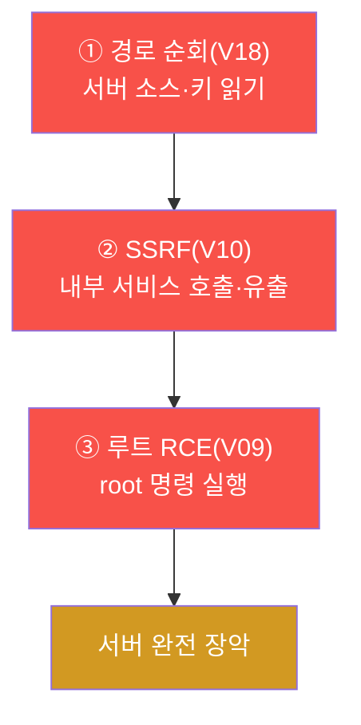
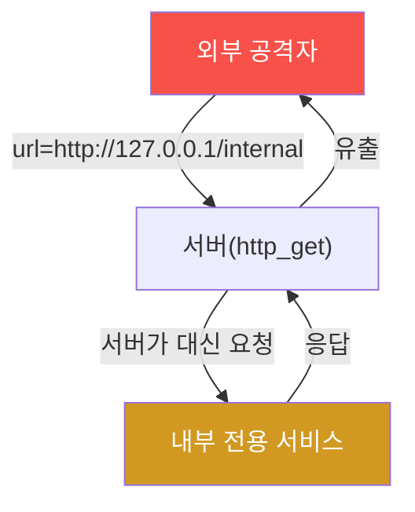
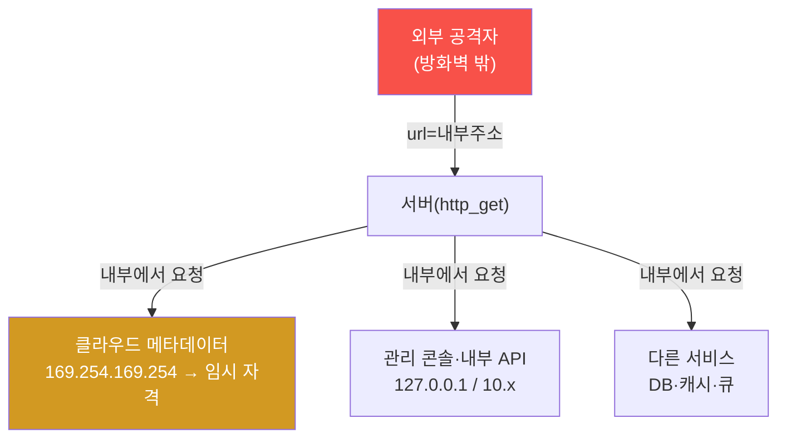
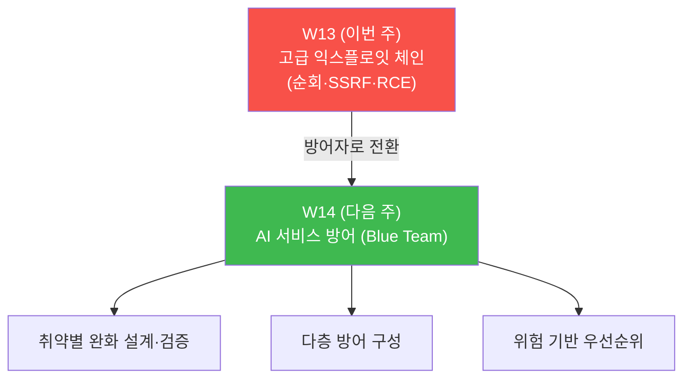

# ai-service-pentest W13 — 고급 익스플로잇 체인: 경로순회·SSRF·루트 RCE (A05·LLM07/08)

> **본 주차의 한 줄 요약**
>
> W13 은 **고급 익스플로잇 체인** 이다. 지금까지 LLM 특유의 공격(인젝션·유출·출력)을 봤다면, W13
> 은 "AI 앱도 결국 **서버·API** 이며 전통 웹 취약이 그대로 존재한다" 를 실증한다. ai.el34.lab
> 앞단 WAF(ModSec)는 **DetectionOnly** 로 설정돼 있어(탐지 로그는 남기되 페이로드를 **차단하지
> 않고** 앱까지 전달 — 모델 공격 시연 목적), 전통 공격이 그대로 통한다. 세 갈래를 연결한다: (1)
> **경로 순회(V18)** — `/api/rag/load?file=../app.py` 로 서버 소스·하드코딩 키·시스템 파일을 읽고,
> (2) **SSRF(V10)** — `/api/tool/http_get` 로 서버가 대신 **내부 서비스(127.0.0.1)** 를 호출해
> 유출하고, (3) **루트 RCE(V09)** — eval 도구로 `os.system(...)` 을 실행해 **root** 권한으로 서버
> 명령을 돌린다. 핵심 개념은 **AI 보안 = LLM 보안 + 전통 앱/인프라 보안** — 프롬프트 인젝션만
> 조심해선 안 되고, 그 앱을 떠받치는 서버·API·도구의 전통 취약(순회·SSRF·RCE)이 결합될 때 가장
> 위험하다. 방어는 **파일 접근 검증·SSRF 차단(내부망 격리)·위험 도구 제거·최소 권한** 이며, WAF 는
> 탐지·모니터링 보조일 뿐 근본 방어가 아니다.

---

## ⚠️ 사전 경고 — 인가된 격리 훈련 대상에서만

모든 공격은 **인가된 격리 훈련 서비스 AICompanion(`ai.el34.lab`)** 만 대상으로 한다. 경로순회·
SSRF·RCE 는 실제 서비스에서는 중대한 범죄다. 공격을 배우는 이유는 방어를 위해서다.

---

## 이 주차의 시선 — AI 앱도 웹 앱이자 서버다

LLM 취약(LLM01~10)에 집중하다 보면, AI 서비스가 **평범한 서버·API** 라는 사실을 놓치기 쉽다.
파일을 읽고, 요청을 보내고, 명령을 실행하는 — 전통 웹의 위험이 그대로 있고, LLM 도구가 그것을
더 쉽게 만든다. W13 은 그 결합을 본다.

> **이 주차의 시선** — "이 AI 앱을 떠받치는 **서버·API·도구** 에 어떤 전통 취약이 있나" 를 본다.

---

## 학습 목표

1. 경로순회·SSRF·RCE 를 설명하고, AI 앱에서 왜 더 위험한지 이해한다.
2. 경로 순회로 서버 소스·하드코딩 키를 읽는다(마커 `TRAVERSAL_OK`).
3. SSRF 로 내부 서비스를 호출·유출하고(마커 `SSRF_OK`), eval 도구로 **root** 명령을 실행한다(마커
   `ROOT_RCE`).
4. 다중 벡터 체인의 근본 방어를 도출한다(마커 `CHAIN_ANALYZED`).
5. 발견을 소견으로 종합한다(마커 `Assessment`).

---

## 0. 용어 해설 (전통 서버 취약)

| 용어 | 영문 | 뜻 | 비유 |
|------|------|----|------|
| **경로 순회** | Path Traversal (A05) | `../` 로 의도 밖 파일 접근 | 옆방·창고 문 열기 |
| **SSRF** | Server-Side Request Forgery | 서버가 대신 요청을 보내게 함 | 심부름꾼을 시켜 안쪽 접근 |
| **RCE** | Remote Code Execution | 원격 서버 코드·명령 실행 | 남의 컴퓨터 조종 |
| **내부망 격리** | Network Segmentation | 내부 서비스를 외부와 분리 | 금고실 별도 잠금 |
| **화이트리스트** | Allowlist | 허용된 것만 통과 | 출입 명단 |
| **DetectionOnly** | — | WAF 가 탐지만, 차단 안 함 | 감시만, 문은 안 잠금 |
| **최소 권한** | Least Privilege | 필요한 만큼만(비-root) | 딱 필요한 열쇠 |

> **헷갈리기 쉬운 한 쌍 — LLM 취약 vs 전통 취약.** LLM 취약(인젝션)만 보면 AI 앱을 절반만 지킨다.
> 그 앱을 이루는 **서버·API·도구** 의 전통 취약(순회·SSRF·RCE)도 함께 봐야 한다. 둘이 결합하면
> 피해가 극대화된다.

---

## 0.5 핵심 개념

### 0.5.1 세 갈래 체인 — 읽기 → 내부 → 실행

세 취약은 독립적이지만 실전에선 **연결** 된다 — 순회로 구조·키를 파악하고, SSRF 로 내부를 정찰·
유출하고, RCE 로 장악한다.

### 0.5.2 경로 순회 — 파일명을 안 믿는다

`/api/rag/load?file=` 는 받은 파일명을 검증 없이 열어(`os.path.join(RAG_DIR, file)`), `../` 로
상위 디렉터리를 벗어난다. `../app.py` 는 서버 소스(하드코딩 키 포함), `../../../../etc/passwd` 는
시스템 계정 파일을 읽는다. **사용자 입력을 파일 경로에 그대로 쓰면 안 된다.**

### 0.5.3 SSRF — 서버를 심부름꾼으로

`/api/tool/http_get?url=` 는 받은 URL 을 **서버가 대신 요청** 한다. 외부 공격자는 못 닿는
`http://127.0.0.1:3005/api/debug/prompt`(내부 전용) 을 서버를 경유해 호출·유출한다. 클라우드
에서는 인스턴스 메타데이터(`169.254.169.254`)로 **자격 증명 탈취** 까지 이어지는 치명적 취약이다.

### 0.5.4 루트 RCE — 명령 실행, 그것도 root

eval 도구(W07)로 `os.system('id')` 를 실행하면 `uid=0(root)` — 프로세스가 root 로 돌기 때문에
서버 명령을 root 권한으로 실행한다. 파일 읽기를 넘어 **완전한 장악**(웹셸·측면 이동·컨테이너
탈출)으로 번진다. **위험 도구 + root 권한** 의 조합이 최악이다.

### 0.5.5 WAF DetectionOnly — 탐지는 하되 안 막는다

ai.el34.lab WAF 는 **DetectionOnly** 라 순회·SSRF·os 명령 페이로드를 **탐지 로그로 남기되 차단
하지 않는다**(공격이 앱까지 도달해야 시연 가능). 즉 이 공격들은 다 통하지만 **로그에 흔적** 이
남는다. 방어 관점의 교훈: WAF 탐지는 **모니터링·대응** 에 유용하지만 그 자체가 근본 방어는 아니며,
**앱 레벨(입력 검증·도구 제거·최소 권한)** 이 근본이다.

---

## 1. 고급 익스플로잇 체인 상세

### 1.1 한 줄 정의와 왜 중요한가

**한 줄 정의**: AI 앱을 이루는 서버·API·도구의 전통 취약(순회·SSRF·RCE)을 연결해 서버를 장악하는
공격이다.

**왜 중요한가**: LLM 취약만 막아도 서버가 뚫린다. AI 보안은 LLM 보안과 전통 앱/인프라 보안의
합집합이며, 실전 침투는 이 둘을 넘나든다.

### 1.2 AICompanion 에서 어떻게 — V18·V10·V09

- **V18 순회**: `/api/rag/load?file=../app.py` → 소스·`sk-fake` 키.
- **V10 SSRF**: `/api/tool/http_get?url=http://127.0.0.1:3005/api/debug/prompt` → 내부 유출.
- **V09 루트 RCE**: eval 도구 `os.system(...)` → root 명령 실행.

### 1.3 실무 — 결합의 위험

실전에서 이 셋은 종종 한 침투에 함께 쓰인다: 순회로 소스·설정을 읽어 공격면을 파악하고, SSRF 로
내부망·메타데이터를 정찰하고, RCE 로 발판을 확보한다. AI 도구(eval·http_get)는 이 전통 공격을
"정상 기능" 으로 포장해 더 쉽게 만든다 — 그래서 도구 통제가 핵심이다.

---

## 1.4 실무 사례 — 전통 취약의 결합이 큰 사고를 만든다

순회·SSRF·RCE 는 각각도 위험하지만 **결합** 될 때 대형 침해가 된다.

- **SSRF → 클라우드 자격 탈취** — SSRF 로 클라우드 인스턴스 **메타데이터 서비스**(`169.254.169.254`)
  를 호출해 임시 자격을 훔치고, 그것으로 클라우드 계정을 장악한 대형 침해 사례가 여러 건 있다.
  서버가 "대신 요청" 해 주는 순간, 내부·특권 자원이 열린다.
- **경로 순회 → 소스·키 → RCE** — 순회로 소스·설정을 읽어 하드코딩 키·업로드 경로를 파악하고,
  그것을 발판으로 웹셸을 올려 RCE 로 확장한 사례.
- **AI 도구가 만든 새 표면** — LLM 에이전트의 `http_get`·코드 실행 도구가 SSRF·RCE 를 "정상 기능"
  으로 노출해, 프롬프트 인젝션 한 줄이 내부망 정찰·명령 실행으로 이어진 사례.

교훈: **AI 앱 보안은 LLM 취약 + 전통 웹/인프라 취약의 합집합** 이고, 결합 사슬이 가장 위험하다.

## 1.5 SSRF 심화 — 왜 이렇게 치명적인가

SSRF 가 특히 무서운 이유는 **서버의 신뢰·위치** 를 빌리기 때문이다.

- 외부 공격자는 방화벽 밖이라 내부 서비스에 직접 못 닿는다. 그러나 **서버는 내부에 있고 신뢰
  받는다.** SSRF 로 서버를 심부름꾼 삼으면 내부 전용 자원이 열린다.
- **클라우드 메타데이터**(`169.254.169.254`)는 인스턴스의 임시 자격을 반환 — SSRF 로 이를 훔치면
  클라우드 계정 장악으로 직결된다. 그래서 SSRF 방어에 **메타데이터 IP 차단** 이 필수다.
- W13 실습에서 `http_get?url=http://127.0.0.1:3005/api/debug/prompt` 로 내부 디버그 엔드포인트를
  유출한 것이 이 개념의 축소판이다.

## 1.6 고치는 코드 — 취약별 방어

| 취약 | 취약한 패턴 | 안전한 패턴 |
|------|-------------|-------------|
| **순회** | `open(join(DIR, user_input))` | 파일명 **화이트리스트**, `realpath` 로 기준 디렉터리 이탈 검사 |
| **SSRF** | `urlopen(user_url)` | URL **allowlist**, 사설·메타데이터 IP 차단, 리다이렉트 검증 |
| **RCE** | `eval(user_code)` | **eval 제거**, 정해진 안전 동작만, 샌드박스·최소 권한 |

- **순회 방어** — 사용자 입력을 경로에 직접 쓰지 않는다. 허용된 파일명 목록으로 매핑하거나,
  `os.path.realpath()` 로 정규화한 뒤 **기준 디렉터리 안에 있는지** 확인한다.
- **SSRF 방어** — 목적지 URL 을 **allowlist**(허용 호스트만)로 제한하고, 사설망(10/172.16/192.168)·
  루프백·`169.254.169.254`(메타데이터)를 차단한다. 리다이렉트도 재검증한다.
- **RCE 방어** — `eval`/`exec` 는 없앤다. 꼭 필요하면 화이트리스트 인터페이스로 대체하고, 실행을
  샌드박스·비-root·리소스 제한 환경에 가둔다.
- **공통** — WAF(DetectionOnly)는 탐지·모니터링 보조. **근본은 앱 레벨** 의 이 검증들이다.

---

## 2. 방어 (Blue) 관점

- **파일 접근 검증(순회)** — 파일명 화이트리스트·정규화(canonical path 검사), 사용자 입력을 경로에
  직접 쓰지 않기.
- **SSRF 차단** — 내부망 격리, URL allowlist, 사설·메타데이터 IP 차단, 리다이렉트 검증.
- **RCE 차단** — eval/임의 실행 도구 제거, 입력 검증, **최소 권한(비-root)·샌드박스.**
- **다층 방어** — WAF 는 탐지·모니터링 보조로, 앱 레벨 방어가 근본. 감사 로깅·이상 탐지.

---

## 3. 실습 안내 (총 5 미션) — 브라우저로 공격, 로그/파일로 확인

공격은 **브라우저**(주소창 GET + F12 콘솔)로 `http://ai.el34.lab`(로그인 `admin/admin`), 확인만
el34 호스트에서 한 줄씩. `?me=<ME>` 토큰으로 귀속한다.

### 미션 1 — 경로 순회 → `TRAVERSAL_OK`
> `/api/rag/load?file=../app.py&me=<ME>` → 소스·`sk-fake` 키. 로그에 남으면 통과.

### 미션 2 — SSRF → `SSRF_OK`
> `/api/tool/http_get?url=http://127.0.0.1:3005/api/debug/prompt&me=<ME>` → 내부 유출. 로그에 남으면 통과.

### 미션 3 — 루트 RCE → `ROOT_RCE`
> F12 콘솔로 eval `os.system('id > /tmp/root-<ME>')` → 파일에 `uid=0(root)`. 통과.

### 미션 4 — 체인 근본 방어 → `CHAIN_ANALYZED`
> 입력 검증 부재·위험 도구·과도 권한, 방어(화이트리스트·SSRF 차단·eval 제거·최소권한)를 노트에.

### 미션 5 — 종합 소견 → `Assessment`
> 순회·SSRF·RCE 체인·방어를 첫 줄 `Assessment` 로.

---

## 4. 핵심 정리 (1줄씩)

- **AI 앱도 서버·API** — 전통 웹 취약(순회·SSRF·RCE)이 그대로 존재한다.
- 경로 순회(V18)로 소스·키·시스템 파일, SSRF(V10)로 내부 서비스, eval(V09)로 **root RCE.**
- LLM 도구(eval·http_get)가 전통 공격을 "정상 기능" 으로 포장해 증폭한다.
- WAF DetectionOnly 는 **탐지(모니터링)** 용 — 차단 안 함. 근본은 앱 레벨 방어.
- 방어: **파일 화이트리스트 + SSRF 차단 + 위험 도구 제거 + 최소 권한(비-root) + 다층.**

---

## 5. 다음 주차 (W14) 예고 — AI 서비스 방어 (Blue Team)

W14 는 공격에서 방어로 전환한다. W01~W13 에서 찾은 취약을 실제로 **완화** 하는 방어(입력·출력
필터, 권한 스코핑, 도구 제거, 레이트 리밋, SSRF 차단 등)를 설계·검증하고, 위험 기반으로 방어
우선순위를 세운다.

