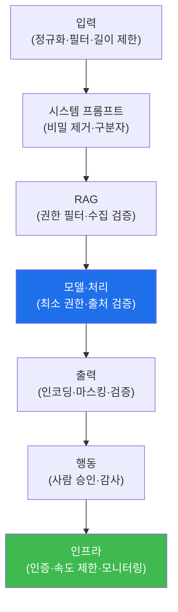

# ai-service-pentest W14 — AI 서비스 방어: 심층 방어와 가드레일

> **본 주차의 한 줄 요약**
>
> W01~W13에서 LLM 앱의 공격을 배웠다. 이번 주 W14는 이를 막는 **방어**를 종합한다. 핵심 원칙은 **어떤 단일 방어도
> 완벽하지 않으므로 심층 방어(defense in depth)**로 겹층을 쌓는 것이다. LLM 앱 방어는 요청 흐름의 각 지점에
> 배치된다: ① **입력 계층**(입력 정규화·인젝션 필터·멀티모달 스캔·입력 길이 제한), ② **시스템 프롬프트 계층**(비밀
> 미포함·명확한 지시·구분자), ③ **검색(RAG) 계층**(권한별 검색 필터·수집 검증·민감 문서 격리/마스킹), ④ **모델·처리
> 계층**(최소 권한·과도한 에이전시 차단·모델 출처 검증), ⑤ **출력 계층**(맥락별 인코딩·살균·민감정보 마스킹·출력
> 검증), ⑥ **행동 계층**(위험 도구 사람 승인·행동 감사), ⑦ **인프라 계층**(인증·인가·속도 제한·쿼터·모니터링·로깅).
> 그리고 전체를 관통하는 원칙: **최소 권한**(오염돼도 피해 제한)·**입출력 불신**(입력=공격자, 출력=오염 가능)·
> **인간 감독**(위험 결정)·**모니터링**(공격 탐지). 특히 프롬프트 인젝션은 완전히 못 막으므로, 필터에만 의존하지
> 말고 **조종당해도 피해가 제한되게** 설계한다. 실습에서는 위협을 방어에 매핑하고(마커 `DEFENSE_MAPPED`), 다층
> 방어를 구성하며(마커 `DEFENSE_LAYERED`), 방어 아키텍처를 검증한다(마커 `ARCHITECTURE_SECURED`). 좋은 AI 서비스
> 방어는 OWASP LLM Top 10을 겹층으로 다루며, 각 계층이 서로의 빈틈을 메운다.

---

## 학습 목표

본 주차 종료 시 학생은 다음 5가지를 **본인 손으로** 할 수 있어야 한다.

1. 심층 방어 7계층과 관통 원칙(최소 권한·입출력 불신·인간 감독·모니터링)을 설명한다.
2. OWASP LLM Top 10 위협을 각 **방어에 매핑**한다(마커 `DEFENSE_MAPPED`).
3. 요청 흐름을 따라 **다층 방어**를 구성한다(마커 `DEFENSE_LAYERED`).
4. 방어 아키텍처가 공격 체인을 끊는지 **검증**한다(마커 `ARCHITECTURE_SECURED`).
5. "단일 방어는 없다 — 겹층이 답"임을 소견으로 종합한다(마커 `Assessment`).

> **이 주차의 시선** — 지금까지의 낱개 방어를 하나의 아키텍처로 조립한다. 각 계층이 왜 필요한지, 어떻게 서로의
> 빈틈을 메우는지가 핵심이다.

---

## 0. 용어 해설 (방어)

| 용어 | 영문 | 뜻 | 비유 |
|------|------|----|------|
| **심층 방어** | Defense in Depth | 여러 계층에 방어를 겹쳐 배치 | 다중 방벽 |
| **가드레일** | Guardrail | LLM 입출력·행동에 두는 안전 경계 | 도로 난간 |
| **최소 권한** | Least Privilege | 필요한 최소 권한만 부여 | 최소 열쇠 |
| **입출력 검증** | I/O Validation | 입력·출력을 검사·인코딩 | 반입·반출 검색 |
| **인간 감독** | Human-in-the-Loop | 위험·비가역 결정은 사람이 승인 | 결재 |
| **모니터링** | Monitoring | 공격 시도를 탐지·기록 | 관제 감시 |
| **위협 매핑** | Threat Mapping | 위협을 대응 방어와 연결 | 병증-처방 대응표 |
| **잔여 위험** | Residual Risk | 방어 후에도 남는 위험 | 예방접종 후 잔존 위험 |

> **헷갈리기 쉬운 한 쌍 — 단일 방어 vs 심층 방어.** *단일 방어*(필터 하나)는 우회당하면 곧바로 뚫린다. *심층 방어*는
> 한 겹이 뚫려도 다음 겹이 막아, 공격이 목표에 닿으려면 모든 겹을 뚫어야 한다. 프롬프트 인젝션처럼 완전 차단이
> 불가능한 위협에는 심층 방어가 유일한 현실적 답이다.

---

## 0.5 신입생 친화 핵심 개념

### 0.5.1 심층 방어 계층

요청 흐름의 각 계층에 방어를 배치한다. 한 계층이 뚫려도 다음 계층이 막는다 — 공격은 모든 겹을 뚫어야 목표에 닿는다.

### 0.5.2 위협 → 방어 매핑

- **LLM01 인젝션**: 입력 정규화·필터(완화) + 최소 권한 + 출력 검증(완전 차단 불가라 심층).
- **LLM06 정보 유출**: RAG 권한 필터·문서 격리·출력 마스킹.
- **LLM02 출력 처리**: 맥락별 인코딩·살균.
- **LLM08 과도한 에이전시**: 최소 권한·위험 행동 승인.
- **LLM04 DoS**: 토큰 제한·속도 제한·쿼터.
- **인증·인가**: 모든 엔드포인트 접근 통제.

각 위협에 겹층 방어를 대응시킨다.

### 0.5.3 관통 원칙

- **최소 권한**: LLM·도구·RAG가 필요한 것만. 오염돼도 피해 제한.
- **입출력 불신**: 입력=공격자, 출력=오염 가능. 검증·인코딩.
- **인간 감독**: 위험·비가역 결정은 사람이.
- **모니터링·로깅**: 공격 시도 탐지·감사(변조 불가 로그).

이 원칙이 모든 계층을 관통한다.

### 0.5.4 필터만으로 부족한 이유

프롬프트 인젝션은 LLM의 근본 특성이라 완전히 못 막는다(W02·W13). 필터는 완화일 뿐 — 공격자는 우회를 찾는다.
그래서 필터에만 의존하지 말고, **조종당해도 피해가 제한되게**(최소 권한·출력 검증·승인) 겹층으로 설계한다. "막을
수 없으면 피해를 제한하라"가 이 과목 방어의 결론이다.

### 0.5.5 el34 맥락

이번 실습은 **위협-방어 매핑·다층 방어 구성·아키텍처 검증**을 결정론 시뮬로 익힌다. W01~W13의 모든 공격에 대응하는
방어를 하나의 아키텍처로 조립한다.

---

## 1. 방어 아키텍처 상세 — 매핑·다층·검증

### 1.1 위협-방어 매핑 (DEFENSE_MAPPED)

- **한 줄 정의**: OWASP LLM Top 10 각 위협을 대응 방어와 연결한다.
- **왜 중요한가**: 매핑이 있어야 "어떤 방어가 어떤 위협을 막는지" 빠짐없이 점검할 수 있다.
- **AICompanion 맥락에서 어떻게**: LLM01→입력/최소권한/출력, LLM06→RAG 권한 필터/마스킹 등으로 매핑하면
  `DEFENSE_MAPPED`.
- **한계/주의**: 매핑은 계층 구성으로 이어져야 한다.

### 1.2 다층 방어 구성 (DEFENSE_LAYERED)

- **한 줄 정의**: 입력→프롬프트→RAG→모델→출력→행동→인프라 순으로 방어를 배치한다.
- **핵심**: 각 계층이 담당 위협을 막고, 관통 원칙(최소 권한·불신·감독·모니터링)이 전체를 지지.
- **판정**: 요청 흐름을 따라 7계층 방어가 구성되면 `DEFENSE_LAYERED`.

### 1.3 아키텍처 검증 (ARCHITECTURE_SECURED)

- **한 줄 정의**: 구성한 방어가 W08의 공격 체인을 끊는지 검증한다.
- **핵심**: 체인의 각 단계(인젝션→추출→유출→행동)가 어느 계층에서 막히는지 확인. 잔여 위험도 명시.
- **판정**: 체인이 차단되면 `ARCHITECTURE_SECURED`.

---

## 2. 실습 안내 (총 5 미션)

실행 위치는 el34 **호스트**(`ssh ccc@{{TARGET_IP}}`, 비밀번호 `1`), 실습 대상은 AICompanion
(`http://192.168.0.161:8007`), 참고 GPU는 Ollama(`http://211.170.162.139:10934`, gemma3:4b)다. 각 미션의 마지막
줄 마커가 채점 기준이다. 반드시 인가된 훈련 대상에서만 수행한다.

### 미션 1 — GPU 헬스체크 → `GEN_OK`

> **왜 하는가?** 대상 LLM 도달·응답 확인(반복 절차).
> **무엇을 아는가?** Ollama 응답 형식·도달성.
> **결과 해석** — 정상 `GEN_OK` / 비정상 `GEN_EMPTY`·연결 오류.
> **실전 활용** — 진단 착수 전 대상 모델 확인.

### 미션 2 — 위협-방어 매핑 → `DEFENSE_MAPPED`

> **왜 하는가?** 각 위협에 어떤 방어가 대응하는지 빠짐없이 연결한다.
> **무엇을 아는가?** LLM01·02·06·08·DoS·인증 각각의 대응 방어.
> **결과 해석** — 정상: 매핑 완성 + `DEFENSE_MAPPED`.
> **실전 활용** — 방어 설계 체크리스트.

### 미션 3 — 다층 방어 구성 → `DEFENSE_LAYERED`

> **왜 하는가?** 방어를 요청 흐름의 각 계층에 배치해 겹층을 만든다.
> **무엇을 아는가?** 입력→프롬프트→RAG→모델→출력→행동→인프라 7계층.
> **결과 해석** — 정상: 계층 구성 + `DEFENSE_LAYERED`.
> **실전 활용** — AI 서비스 보안 아키텍처 설계.

### 미션 4 — 아키텍처 검증 → `ARCHITECTURE_SECURED`

> **왜 하는가?** 구성한 방어가 실제 공격 체인을 끊는지 검증한다.
> **무엇을 아는가?** 공격 체인의 각 단계가 어느 계층에서 막히는지, 잔여 위험.
> **결과 해석** — 정상: 체인 차단 + `ARCHITECTURE_SECURED`.
> **실전 활용** — 방어 효과 검증·잔여 위험 보고.

### 미션 5 — 종합 소견 → `Assessment`

> **왜 하는가?** 매핑·다층·검증을 묶고 "단일 방어는 없다" 원칙을 정리한다.
> **무엇을 아는가?** GPU에 요약시키되 첫 줄을 `Assessment`로 강제.
> **결과 해석** — 정상: `Assessment` 포함. 없으면 `[형식 미준수 — 재실행]`.
> **실전 활용** — 진단 요약. LLM 초안은 사람이 검수(LLM09).

---

## 3. 흔한 오해·관제자 노트

- **"강력한 필터 하나면 충분하다."** — 단일 방어는 우회당하면 뚫린다. 겹층이 필요하다.
- **"인젝션을 완전히 막을 수 있다."** — 못 막는다. 조종당해도 피해가 제한되게 설계한다.
- **"방어를 넣었으니 안전하다."** — 잔여 위험이 남는다. 모니터링으로 지속 탐지·튜닝한다.
- **"방어는 개발팀만의 일이다."** — 관제(Blue)가 계층별 방어 존재와 공격 탐지를 지속 점검해야 한다.
- **관제(Blue) 관점** — (1) 7계층 방어가 각각 존재하는가, (2) 관통 원칙(최소 권한·불신·감독·모니터링)이 적용되는가,
  (3) 공격 체인이 어느 계층에서든 끊기는가, (4) 잔여 위험을 모니터링·로깅으로 커버하는가를 종합 점검한다.

---

## 4. 다음 주차 (W15) 예고 — 종합 평가: 전체 침투 + 방어

W14가 "방어 종합"이었다면, W15는 기말 **종합 평가**다. AICompanion을 대상으로 전체 침투(공격 체인)를 수행하고,
발견을 OWASP LLM Top 10으로 종합하며, W14의 심층 방어로 대응하는 공격·방어 통합 역량을 최종 확인한다.
