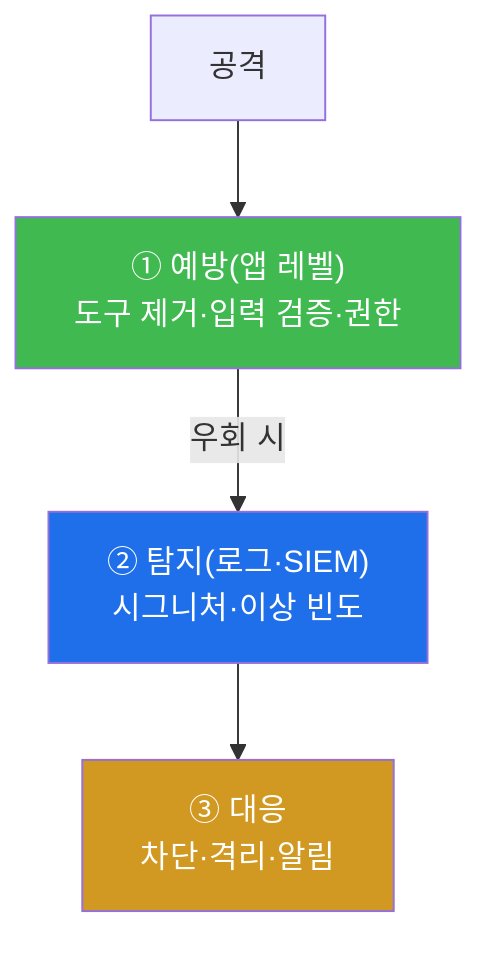
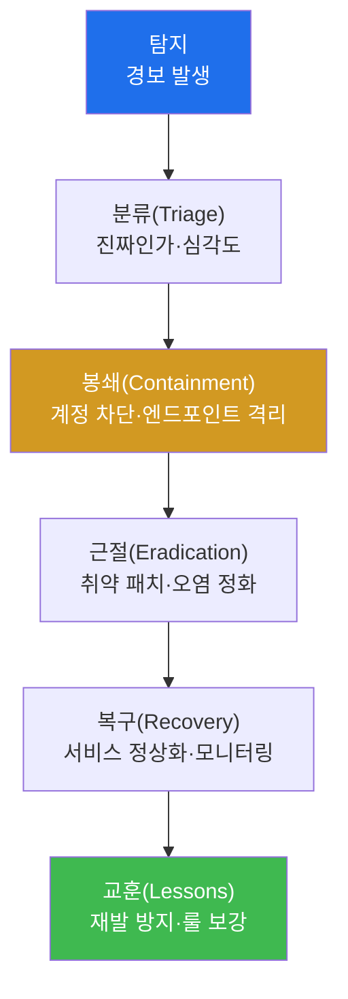
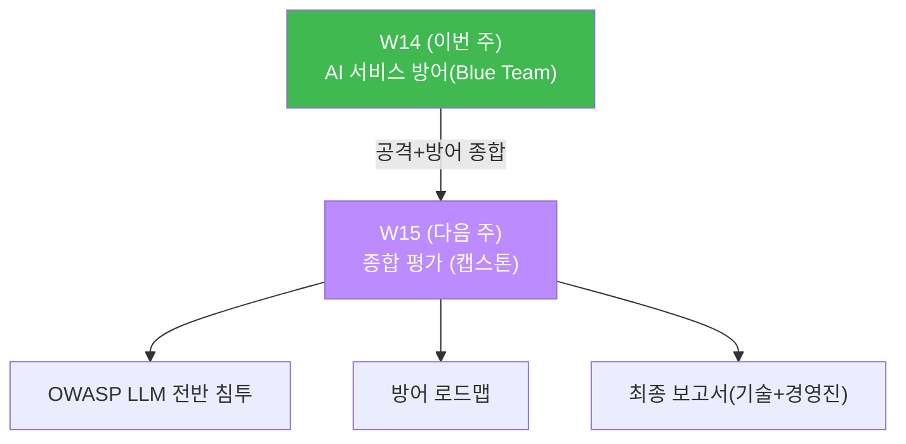

# ai-service-pentest W14 — AI 서비스 방어(Blue Team): 탐지·완화·다층 방어

> **본 주차의 한 줄 요약**
>
> W01~W13 에서 LLM 앱의 공격을 배웠다. W14 는 공격에서 **방어(Blue Team)** 로 전환해 이를 막는
> 방어를 종합한다. 핵심 원칙은 **어떤 단일 방어도 완전하지 않다** — 그래서 **예방(앱 레벨)+탐지
> (로그·모니터링)+대응** 의 **다층 방어(Defense in Depth)** 를 겹친다. ai.el34.lab WAF 가
> **DetectionOnly** 라 공격은 통과하되 **접근 로그에 흔적** 이 남는다 — 이를 이용해 공격을 **탐지**
> 하고, 한정된 자원을 **위험(영향×가능성)** 순으로 배분하는 **우선순위** 를 세우고, 각 취약을
> **구체적 완화** 에 1:1 매핑(OWASP LLM Top 10)하며, 탐지·모니터링 규칙을 설계한다. 핵심 개념은
> **Blue Team 사고** — "이 시스템을 어떻게 지키나" 를 예방·탐지·대응·우선순위·검증의 언어로
> 사고하는 것이며, 침투 테스터도 이 방어 관점을 알아야 제언이 정확해진다.

---

## ⚠️ 사전 경고 — 인가된 격리 훈련 대상에서만

탐지 실습용 공격 재현도 **인가된 격리 훈련 서비스 AICompanion(`ai.el34.lab`)** 만 대상으로 한다.

---

## 이 주차의 시선 — 공격자에서 수비수로

지금까지는 "어떻게 뚫나" 를 봤다. W14 는 시야를 뒤집어 "어떻게 막나" 를 본다. 좋은 수비수는
공격을 이해하고, 예방이 완벽할 수 없음을 알며, 그래서 탐지·대응을 겹치고, 자원을 위험 순으로
배분한다.

> **이 주차의 시선** — "이 취약을 **예방·탐지·대응** 으로 어떻게 다층으로 막나, 무엇부터 하나" 를 본다.

---

## 학습 목표

1. **다층 방어(예방+탐지+대응)** 와 **위험 기반 우선순위** 를 설명한다.
2. 공격을 로그에서 탐지한다(마커 `ATTACK_DETECTED`).
3. 위험 기반 방어 우선순위를 세우고(마커 `PRIORITY_SET`), 취약별 완화를 OWASP LLM 에 매핑한다
   (마커 `MITIGATIONS_MAPPED`).
4. 탐지·모니터링 규칙을 설계한다(마커 `DETECTION_DESIGNED`).
5. 방어 설계를 소견으로 종합한다(마커 `Assessment`).

---

## 0. 용어 해설 (방어)

| 용어 | 영문 | 뜻 | 비유 |
|------|------|----|------|
| **다층 방어** | Defense in Depth | 예방·탐지·대응을 여러 겹 | 여러 겹 자물쇠 |
| **예방** | Prevention | 공격을 애초에 막음(앱 레벨) | 문 잠그기 |
| **탐지** | Detection | 공격 흔적을 발견 | CCTV·경보 |
| **대응** | Response | 발견 후 조치·차단 | 경비 출동 |
| **위험** | Risk | 영향 × 가능성 | 피해 크기 × 확률 |
| **DetectionOnly** | — | WAF 가 탐지만, 차단 안 함 | 감시(문은 안 잠금) |
| **SIEM** | Security Info & Event Mgmt | 로그 수집·상관·경보 | 통합 관제실 |
| **최소 권한** | Least Privilege | 필요한 만큼만 | 딱 필요한 열쇠 |

> **헷갈리기 쉬운 한 쌍 — 예방 ≠ 방어의 전부.** 예방(차단)만 믿으면 우회당할 때 무방비다. **탐지·
> 대응** 을 겹쳐야 우회·신종 공격도 잡는다. 방어는 "막기 + 보기 + 조치" 의 다층이다.

---

## 0.5 핵심 개념

### 0.5.1 다층 방어 — 예방·탐지·대응

어떤 예방도 100% 는 아니다. 예방을 우회당해도 **탐지** 가 잡고 **대응** 이 막는다. 세 겹이 겹쳐야
실질 방어가 된다.

### 0.5.2 위험 기반 우선순위 — 무엇부터 고치나

모든 취약을 동시에 못 고친다. **위험 = 영향 × 가능성** 으로 순위를 매긴다.

| 등급 | 예(AICompanion) | 이유 |
|------|-----------------|------|
| **Critical** | eval 무인증 RCE(V09), 비밀 노출(V05/V07/V13) | 서버 장악·자산/PII 유출 |
| **High** | 프롬프트 인젝션(LLM01), 권한 무시·매스어사인(LLM06/A01) | 조종·인가 붕괴 |
| **Medium** | 출력 XSS(V08)·순회(V18)·SSRF(V10), DoS(V20) | 세션 탈취·내부 접근·가용성 |

Critical 부터 고쳐야 실질 위험이 가장 빨리 준다.

### 0.5.3 취약 → 완화 1:1 매핑

"보안 강화" 구호로는 안 고쳐진다. 각 취약을 **구체적 완화** 에 매핑해 작업 항목·검증 대상으로 만든다.

- **LLM01 인젝션** → 입출력 필터, 지시/데이터 구분, 검색 문서를 데이터로만, 저장소 정화.
- **LLM02 출력** → 출력 인코딩(textContent)·CSP·sanitizer.
- **LLM04 DoS** → 레이트 리밋·길이 제한·비용 쿼터·큐잉.
- **LLM06 유출** → 비밀 분리(Vault/KMS)·검색 권한 스코핑·출력 마스킹.
- **LLM07/08 도구** → eval 제거·도구 인증/승인·샌드박스·최소 권한.
- **LLM10 공급망** → 자산 인증/인가·아티팩트 서명·학습 데이터 PII 제거.
- **전통(A01/A05)** → 필드 화이트리스트·파일 화이트리스트·SSRF 차단.

### 0.5.4 탐지 — DetectionOnly 를 활용

ai.el34.lab WAF 는 DetectionOnly 라 공격이 통과하되 **접근 로그에 시그니처가 남는다.** 이를
탐지에 쓴다:

- 경로순회 `../`, XSS `<script`·`onerror`, 인젝션 `ignore previous`, 도구 남용 `/api/tool/*` 급증,
  DoS 요청 급증 → 경보.
- 출처 IP·계정·토큰 상관, 이상 빈도·시간대 → SIEM 규칙·자동 차단·알림.

예방(차단)이 우회돼도 탐지가 있으면 조기 발견·대응할 수 있다.

### 0.5.5 이번 주 채점 — 탐지 + 설계 문서

채점은 (1) 공격을 재현해 접근 로그에서 탐지, (2) 위험 기반 우선순위·(3) 취약별 완화 매핑·(4) 탐지
규칙 설계 문서를 작성했는지 확인한다.

---

## 1. AI 서비스 방어 상세

### 1.1 안전 아키텍처의 원칙

- **최소 권한** — 프로세스·도구·계정에 필요한 최소 권한만(비-root, 도구 제한).
- **신뢰 경계** — LLM 이 다루는 입력·출력·저장소·검색을 신뢰하지 않고 검증·인코딩.
- **비밀 분리** — 비밀을 프롬프트·KB·코드에서 빼내 Vault/KMS 로.
- **다층** — 앱 레벨 예방 + WAF/네트워크 + 탐지/모니터링 + 대응.

### 1.2 예방이 근본, WAF 는 보조

W13 에서 봤듯 WAF(경계)는 알려진 패턴을 완화할 뿐, 앱 로직·LLM 도구 채널은 못 본다. 그래서 근본은
**앱이 안전하게 만들어지는 것**(위험 도구 제거·입력 검증·최소 권한)이고, WAF·네트워크는 그 위의
보조 겹이다. AICompanion 처럼 WAF 가 DetectionOnly 라면 더욱 앱 레벨 방어가 필수다.

### 1.3 침투 테스터도 방어를 알아야

방어를 이해해야 침투 보고서의 제언이 정확하고 실행 가능해진다. "취약이 있다" 를 넘어 "이렇게
완화하고, 우선순위는 이렇고, 이렇게 탐지하라" 를 제시하는 것이 가치 있는 산출물이다.

---

## 2. 실습 안내 (총 5 미션) — 탐지 + 방어 설계

공격 재현은 **브라우저** 로, 확인·설계 기록은 el34 호스트에서 한 줄씩. `?me=<ME>` 토큰으로 귀속한다.

### 미션 1 — 공격을 로그에서 탐지 → `ATTACK_DETECTED`
> W13 순회 공격을 재현하고 접근 로그에서 `../` 시그니처를 찾는다. 로그에 있으면 통과.

### 미션 2 — 위험 기반 우선순위 → `PRIORITY_SET`
> 위험(영향×가능성)으로 Critical(eval RCE·비밀유출)/High/Medium 을 문서화. 핵심 담기면 통과.

### 미션 3 — 취약별 완화 매핑 → `MITIGATIONS_MAPPED`
> OWASP LLM 각 취약을 구체 완화에 1:1 매핑(비밀 분리·출력 인코딩·eval 제거·검색 스코핑…). 통과.

### 미션 4 — 탐지·모니터링 규칙 → `DETECTION_DESIGNED`
> 순회·XSS/인젝션·도구 남용·DoS 탐지 규칙 + 상관/대응(SIEM)을 설계. 통과.

### 미션 5 — 종합 소견 → `Assessment`
> 탐지·우선순위·완화·다층을 첫 줄 `Assessment` 로.

---

## 2. 탐지 심화 — 로그에서 공격 신호 뽑기

DetectionOnly WAF 와 앱 로그가 있으면, 공격 시그니처를 규칙으로 잡을 수 있다. 예시 탐지 규칙:

| 공격 | 로그 신호 | 규칙(의사) |
|------|-----------|------------|
| 경로 순회 | `../`·`%2e%2e` in URL | `uri =~ /\.\.(\/|%2f)/` → 경보 |
| XSS/인젝션 | `<script`·`onerror`·`ignore previous` | 요청/응답 본문 패턴 매치 → 경보 |
| 도구 남용 | `/api/tool/*` 호출 급증·`os.system` | 엔드포인트 빈도 임계·payload 키워드 |
| 자격 유출 | 응답에 `AKIA`·주민번호·`sk-` 패턴 | 출력 DLP 매치 → 경보·마스킹 |
| DoS | 사용자/IP 당 req/min 급증 | 임계 초과 → 경보·차단 |

> **상관(correlation)이 핵심** — 단일 이벤트보다 **연쇄** 를 본다. "같은 IP 가 순회 → SSRF →
> 도구 호출" 을 시간·출처로 묶으면 오탐을 줄이고 실제 공격 사슬을 잡는다. 출처 IP·계정·`?me=` 토큰이
> 상관의 열쇠다.

## 2.5 사고 대응(IR) — 탐지 다음의 절차

탐지는 시작일 뿐, **대응(Response)** 이 피해를 막는다. 표준 IR 흐름:

- **분류** — 오탐/실제, 영향 범위 판단. (예: eval 도구 호출 경보 → 실제 RCE인가)
- **봉쇄** — 계정·토큰 무효화, 위험 엔드포인트 차단, 세션 종료로 확산 차단.
- **근절** — 근본 취약 패치(eval 제거 등), 오염된 저장소(memory/KB) 정화.
- **복구** — 서비스 정상화, 강화된 모니터링으로 재발 감시.
- **교훈** — 무엇이 뚫렸고 왜 늦게 잡았나 → 탐지 룰·방어 보강.

AICompanion 처럼 WAF 가 차단하지 않는(DetectionOnly) 환경에선 **탐지→대응** 이 특히 중요하다 —
예방이 없으니 빨리 발견하고 대응해야 한다.

## 2.6 AI 위협 모델링 — 설계 단계의 방어

가장 싼 방어는 **설계 단계** 에 있다. AI 시스템을 만들 때 물어야 할 질문:

- **이 LLM 이 볼 수 있는 최악의 데이터는?** → 비밀을 컨텍스트에 넣지 않기(LLM06).
- **이 LLM 이 할 수 있는 최악의 행동은?** → 도구·권한 최소화(LLM08).
- **누가 이 저장소(KB/memory)에 쓸 수 있나?** → 쓰기 통제(LLM01 간접·저장형).
- **출력이 어디로 흘러가나?** → 화면·시스템 전 인코딩·검증(LLM02).
- **인가는 모든 데이터 접근에 있나?** → 검색·API 에 권한 스코핑(LLM06·A01).

이 질문에 설계로 답하면, 나중에 탐지·대응할 사고 자체가 줄어든다. **"막기 > 보기 > 조치"** 의
순으로 비용이 커지므로, 앞단(설계·예방)에 투자하는 것이 가장 효율적이다.

---

## 3. 핵심 정리 (1줄씩)

- 어떤 단일 방어도 완전하지 않다 → **예방+탐지+대응의 다층 방어.**
- 한정 자원은 **위험(영향×가능성)** 순으로 — Critical(RCE·비밀유출) 먼저.
- 각 취약을 **구체 완화에 1:1 매핑** 해야 실제 작업·검증이 된다.
- WAF DetectionOnly 는 **탐지** 에 활용 — 접근 로그로 공격 시그니처를 잡는다.
- 근본은 **앱 레벨 예방**(도구 제거·검증·최소 권한), WAF·네트워크는 보조 겹.

---

## 4. 다음 주차 (W15) 예고 — 종합 평가 (캡스톤)

W15 는 종합 평가다. AICompanion 을 대상으로 OWASP LLM Top 10 전반을 커버하는 **완전한 침투 +
방어 로드맵** 을 스스로 수행하고, 하나의 최종 보고서(기술 + 경영진)로 종합한다.

