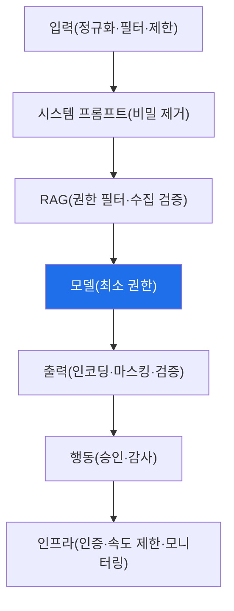

# ai-service-pentest W14 — AI 서비스 방어: 심층 방어와 가드레일

> **본 주차의 한 줄 요약**
>
> W01~W13에서 LLM 앱의 공격을 배웠다. W14는 이를 막는 **방어**를 종합한다. 핵심 원칙: **어떤 단일 방어도 완벽
> 하지 않으므로 심층 방어(defense in depth)** 로 겹층을 쌓는다. LLM 앱 방어는 요청 흐름의 각 지점에 배치된다:
> ① **입력 계층** — 입력 정규화·인젝션 필터(완화)·멀티모달 스캔(W13)·입력 길이 제한(W11), ② **시스템 프롬프트
> 계층** — 비밀 미포함(W03)·명확한 지시·구분자, ③ **검색(RAG) 계층** — 권한별 검색 필터(W05)·수집 검증(W10)·
> 민감 문서 격리·마스킹, ④ **모델·처리 계층** — 최소 권한(W07)·과도한 에이전시 차단·모델 출처 검증(W12),
> ⑤ **출력 계층** — 맥락별 인코딩·살균(W06)·민감정보 마스킹·출력 검증, ⑥ **행동 계층** — 위험 도구 사람 승인
> (W07)·행동 감사, ⑦ **인프라 계층** — 인증·인가(W09)·속도 제한·쿼터(W11)·모니터링·로깅. 그리고 전체를 관통
> 하는 원칙: **최소 권한**(LLM이 오염돼도 할 수 있는 게 제한), **입출력을 신뢰하지 않기**(입력=공격자, 출력=오염
> 가능), **인간 감독**(위험 결정), **모니터링**(공격 탐지). 특히 프롬프트 인젝션은 **완전히 못 막으므로**, 필터
> (완화)에만 의존하지 말고 **조종당해도 피해가 제한되게**(최소 권한·출력 검증·승인) 설계한다. 좋은 AI 서비스
> 방어는 OWASP LLM Top 10을 겹층으로 다루며, 각 계층이 서로의 빈틈을 메운다. 공격을 이해했으니 이제 체계적
> 방어를 설계한다.
>
> **한 줄 결론**: AI 서비스 방어 = **심층 방어**(입력·프롬프트·RAG·모델·출력·행동·인프라 각 계층) + 관통 원칙
> (최소 권한·입출력 불신·인간 감독·모니터링). 단일 방어는 없다 — 겹층으로 OWASP LLM Top 10을 막는다.

---

## 학습 목표

본 주차 종료 시 학생은 다음 5가지를 **본인 손으로** 할 수 있어야 한다.

1. **심층 방어**의 필요를 설명한다.
2. OWASP LLM 위협에 **방어를 매핑**한다(DEFENSE_MAPPED).
3. **다층 방어**를 평가한다(DEFENSE_LAYERED).
4. **안전한 아키텍처**를 설계한다(ARCHITECTURE_SECURED).
5. 왜 필터 하나로 부족한지 설명한다.

> **이 주차의 시선** — 배운 공격에 대한 방어를 심층 방어로 종합한다.

---

## 0. 용어 해설 (방어)

| 용어 | 영문 | 뜻 | 비유 |
|------|------|----|------|
| **심층 방어** | Defense in Depth | 겹층 방어 | 다중 방벽 |
| **가드레일** | Guardrail | 안전 경계 | 난간 |
| **최소 권한** | Least Privilege | 필요한 권한만 | 최소 열쇠 |
| **입출력 검증** | I/O Validation | 입출력 검사 | 검문 |
| **모니터링** | Monitoring | 공격 탐지 | 감시 |

> **헷갈리기 쉬운 한 쌍** — *단일 방어(필터)* 는 "우회당하면 뚫림", *심층 방어* 는 "한 겹 뚫려도 다음 겹"이다.
> 겹층이 핵심.

---

## 0.5 신입생 친화 핵심 개념

### 0.5.1 심층 방어 계층

요청 흐름의 각 계층에 방어를 배치. 한 계층이 뚫려도 다음 계층이 막는다.

### 0.5.2 위협→방어 매핑

- **LLM01 인젝션**: 입력 정규화·필터(완화)+최소 권한+출력 검증(완전 차단 불가라 심층).
- **LLM06 정보 유출**: RAG 권한 필터·문서 격리·출력 마스킹.
- **LLM02 출력 처리**: 맥락별 인코딩·살균.
- **LLM08 과도한 에이전시**: 최소 권한·위험 행동 승인.
- **LLM04 DoS**: 토큰 제한·속도 제한·쿼터.
- **LLM09 인증·인가**: 모든 엔드포인트 접근 통제.
각 위협에 겹층 방어.

### 0.5.3 관통 원칙

- **최소 권한**: LLM·도구·RAG가 필요한 것만. 오염돼도 피해 제한.
- **입출력 불신**: 입력=공격자, 출력=오염 가능. 검증·인코딩.
- **인간 감독**: 위험·비가역 결정은 사람.
- **모니터링·로깅**: 공격 시도 탐지·감사(변조 불가 로그).
이 원칙이 모든 계층을 관통한다.

### 0.5.4 필터만으로 부족한 이유

프롬프트 인젝션은 LLM의 근본 특성이라 **완전히 못 막는다**(W02·W13). 필터는 **완화**일 뿐 — 공격자는 우회를
찾는다(W13). 그래서 필터에만 의존하지 말고, **조종당해도 피해가 제한되게**(최소 권한·출력 검증·승인) 겹층으로
설계한다. "막을 수 없으면 피해를 제한하라".

### 0.5.5 el34 맥락

본 실습은 **위협→방어 매핑·다층 방어 평가·안전 아키텍처 설계**를 결정론 시뮬로 익힌다. AICompanion의 취약점
(W01~W13)에 대한 방어를 종합한다.

---

## 1. 실습 안내 (5 미션)

실행 위치 el34 **호스트**(`ssh ccc@{{TARGET_IP}}`), GPU `http://211.170.162.139:10934`.

### STEP 1 — GPU 헬스체크 → GEN_OK
### STEP 2 — 위협→방어 매핑 → DEFENSE_MAPPED
### STEP 3 — 다층 방어 평가 → DEFENSE_LAYERED
### STEP 4 — 안전 아키텍처 → ARCHITECTURE_SECURED
### STEP 5 — 종합 → Assessment

---

## 2. 흔한 오해·관제자 노트

- **"필터 하나면 됨"** — 우회당함. 심층 방어.
- **"인젝션을 완전 차단"** — 불가. 피해 제한(최소 권한).
- **"출력은 신뢰"** — 오염 가능. 인코딩·검증.
- **관제 관점** — AI 서비스가 입력·RAG·출력·행동·인프라 각 계층에 방어와 관통 원칙(최소 권한·입출력 불신·감독·
  모니터링)을 갖췄는지 점검한다. 겹층 방어가 핵심.

---

## 3. 다음 주차 (W15) 예고 — 종합 평가: LLM 앱 전체 침투+방어

W14가 "방어 종합"이었다면, 마지막 W15는 **종합 평가** — AICompanion을 전체 침투하고 방어를 종합하는 캡스톤이다.
과목을 마무리한다.
