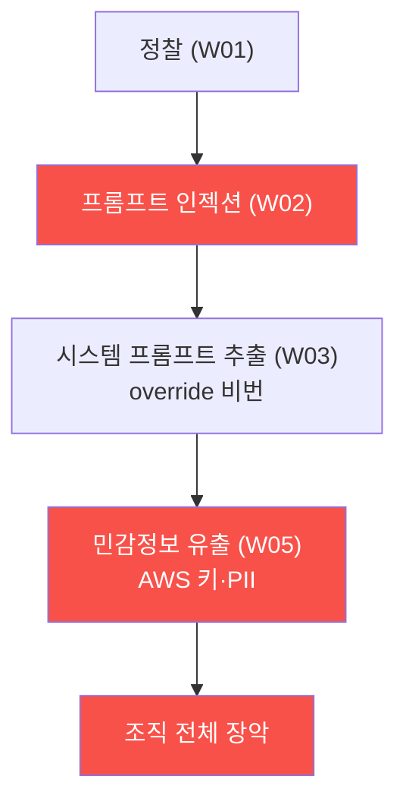

# ai-service-pentest W15 — 종합 평가: LLM 앱 전체 침투 + 방어

> **본 주차의 한 줄 요약**
>
> 마지막 주는 W01~W14를 하나의 **종합 평가**로 통합한다. 실제 AI 서비스 침투 테스트는 AICompanion 같은 대상을
> **전체 침투**하고(정찰 → 공격 체인 → 취약점 종합), **OWASP LLM Top 10 기반 보고**와 **심층 방어 권고**를 내는
> 것이다. AICompanion 전체 침투는 배운 모든 것을 종합한다: 정찰(W01) → 프롬프트 인젝션(W02) → 시스템 프롬프트
> 추출(W03, override 비밀번호) → 민감정보 유출(W05, AWS 키·PII) → 무인증 접근(W09) → 출력 처리(W06) → 과도한
> 에이전시(W07)를 **연결한 공격 체인**으로 조직 전체 장악 위협을 실증한다. 그리고 이 과목의 결론을 확인하며 마친다:
> **LLM 앱은 전통 웹 취약점과 LLM 고유 취약점을 모두 가지며, 프롬프트 인젝션은 완전히 막을 수 없으므로 심층
> 방어로 피해를 제한한다.** 핵심 원칙은 넷이다: ① OWASP LLM Top 10으로 체계적 평가, ② 공격 체인으로 실제 위협
> 실증, ③ 심층 방어(입력·RAG·출력·행동·인프라 계층 + 최소 권한·입출력 불신·감독·모니터링), ④ **"막을 수 없으면
> 피해를 제한하라"**. 실습에서는 전체 침투(마커 `FULL_PENTEST`)·발견 종합/우선순위(마커 `FINDINGS_SYNTHESIZED`)·
> 핵심 원칙 종합(마커 `SYNTHESIS`)을 수행한다. AI 서비스가 폭증하는 시대에, 이를 공격자 관점으로 평가하고 방어하는
> 능력은 보안 실무자의 필수 역량이며, 이 과목이 그 역량을 채운다.

---

## 학습 목표

본 주차 종료 시 학생은 다음 5가지를 **본인 손으로** 할 수 있어야 한다.

1. AICompanion에 대한 **전체 침투**(정찰·공격 체인)를 수행한다(마커 `FULL_PENTEST`).
2. 발견을 OWASP LLM Top 10으로 **종합·우선순위화**한다(마커 `FINDINGS_SYNTHESIZED`).
3. AI 서비스 보안의 **핵심 원칙**을 종합한다(마커 `SYNTHESIS`).
4. 프롬프트 인젝션이 완전 차단 불가라 "피해 제한"이 답임을 설명한다.
5. 공격·방어를 하나의 최종 소견으로 통합한다(마커 `Assessment`).

> **이 주차의 시선** — 한 학기의 공격과 방어를 하나로 묶는다. "이 챗봇 하나로 조직 전체가 뚫린다"는 체인과, "그럼에도
> 심층 방어로 피해를 제한한다"는 결론을 함께 완성한다.

---

## 0. 용어 해설 (종합 평가)

| 용어 | 영문 | 뜻 | 비유 |
|------|------|----|------|
| **전체 침투** | Full Penetration Test | 정찰부터 공격 체인까지 대상을 종합 침투 | 종합 건강검진 |
| **공격 체인** | Attack Chain | 취약점을 연결한 실제 침해 경로 | 도미노 |
| **발견 종합** | Findings Synthesis | 발견을 표준·우선순위로 정리 | 검진 종합소견 |
| **심층 방어** | Defense in Depth | 계층별 겹층 방어 | 다중 방벽 |
| **피해 제한** | Blast Radius Reduction | 조종당해도 피해 범위를 줄임 | 방화구획 |
| **잔여 위험** | Residual Risk | 방어 후에도 남는 위험 | 잔존 위험 |

> **헷갈리기 쉬운 한 쌍 — 개별 취약점 vs 전체 침투.** *개별 취약점*은 "여기 인젝션 하나"이고, *전체 침투*는 그
> 인젝션을 시작점으로 추출·유출·장악까지 **연결한 경로**를 보인다. 침투 평가의 가치는 낱개 발견이 아니라 "이렇게
> 이어져 조직이 뚫린다"는 체인과, 그것을 어디서 끊을지의 방어 권고에 있다.

---

## 0.5 종합 — 침투·보고·방어

### 0.5.1 전체 침투 체인

정찰 → 인젝션 → 추출 → 유출을 연결하면 챗봇 하나에서 조직 전체 장악까지 이어진다. 개별 취약점보다 이 체인이 실제
위협을 드러낸다.

### 0.5.2 AI 서비스 보안 핵심 원칙

- **LLM 고유 표면**: 프롬프트 인젝션·정보 유출·출력 처리·과도한 에이전시(전통 웹 + LLM 고유).
- **OWASP LLM Top 10**: 체계적 평가 프레임워크.
- **심층 방어**: 각 계층 방어 + 관통 원칙(최소 권한·입출력 불신·감독·모니터링).
- **피해 제한**: 인젝션은 완전 못 막으니 조종당해도 안전하게(최소 권한).

### 0.5.3 방어의 결론

프롬프트 인젝션은 LLM의 근본 특성이라 완전 차단이 불가능하다. 그래서 방어의 핵심은 "막을 수 없으면 **피해를
제한하라**"이다 — 최소 권한으로 LLM이 오염돼도 할 수 있는 게 제한되고, 출력 검증·인간 승인으로 위험 행동이
걸러지게 한다. 겹층 방어가 유일한 현실적 답이다.

---

## 1. 종합 평가 상세 — 전체 침투·종합·원칙

### 1.1 전체 침투 (FULL_PENTEST)

- **한 줄 정의**: 정찰부터 공격 체인까지 AICompanion을 종합 침투한다.
- **왜 중요한가**: 낱개 성공이 아니라 "연결된 경로"가 실제 위협을 증명한다.
- **AICompanion 맥락에서 어떻게**: W01~W07의 단계를 하나의 체인으로 이어 실행하면 `FULL_PENTEST`.
- **한계/주의**: 각 단계가 재현 가능해야 체인 신뢰도가 선다. 인가된 훈련 대상에서만.

### 1.2 발견 종합·우선순위 (FINDINGS_SYNTHESIZED)

- **한 줄 정의**: 발견을 OWASP LLM 표준으로 태깅하고 위험 우선순위로 정렬한다.
- **핵심**: 각 발견에 카테고리·영향·악용성·방어를 붙이고, 체인 차단점을 최우선으로.
- **판정**: 발견이 표준·우선순위로 정리되면 `FINDINGS_SYNTHESIZED`.

### 1.3 핵심 원칙 종합 (SYNTHESIS)

- **한 줄 정의**: 이 과목의 결론(LLM 고유 표면·OWASP·심층 방어·피해 제한)을 하나로 정리한다.
- **핵심**: "완전 차단 불가 → 피해 제한"이라는 방어 철학을 명시.
- **판정**: 핵심 원칙이 종합되면 `SYNTHESIS`.

---

## 2. 종합 평가 안내 (총 5 미션)

실행 위치는 el34 **호스트**(`ssh ccc@{{TARGET_IP}}`, 비밀번호 `1`), 실습 대상은 AICompanion
(`http://192.168.0.161:8007`), 참고 GPU는 Ollama(`http://211.170.162.139:10934`, gemma3:4b)다. 각 미션의 마지막
줄 마커가 채점 기준이다. 반드시 인가된 훈련 대상에서만 수행한다.

### 미션 1 — GPU 헬스체크 → `GEN_OK`

> **왜 하는가?** 대상 LLM 도달·응답 확인(반복 절차).
> **무엇을 아는가?** Ollama 응답 형식·도달성.
> **결과 해석** — 정상 `GEN_OK` / 비정상 `GEN_EMPTY`·연결 오류.
> **실전 활용** — 진단 착수 전 대상 모델 확인.

### 미션 2 — 전체 침투 → `FULL_PENTEST`

> **왜 하는가?** 배운 모든 단계를 하나의 침해 경로로 연결해 실제 위협을 실증한다.
> **무엇을 아는가?** 정찰 → 인젝션 → 추출 → 유출로 이어지는 전체 체인.
> **결과 해석** — 정상: 전체 침투 성립 + `FULL_PENTEST`.
> **실전 활용** — 최종 침투 보고서의 핵심.

### 미션 3 — OWASP LLM 종합·우선순위 → `FINDINGS_SYNTHESIZED`

> **왜 하는가?** 발견을 표준으로 체계화하고 위험 순으로 정렬한다.
> **무엇을 아는가?** LLM01~10 태깅·영향/악용성·체인 차단점 우선순위.
> **결과 해석** — 정상: 종합·정렬 + `FINDINGS_SYNTHESIZED`.
> **실전 활용** — 경영진·개발팀용 위험 요약·로드맵.

### 미션 4 — 핵심 원칙 종합 → `SYNTHESIS`

> **왜 하는가?** 한 학기의 결론(고유 표면·OWASP·심층 방어·피해 제한)을 정리한다.
> **무엇을 아는가?** "완전 차단 불가 → 피해 제한" 방어 철학.
> **결과 해석** — 정상: 원칙 종합 + `SYNTHESIS`.
> **실전 활용** — AI 서비스 보안 정책·가이드의 근간.

### 미션 5 — 최종 종합 소견 → `Assessment`

> **왜 하는가?** 공격·방어를 하나의 최종 소견으로 묶는다.
> **무엇을 아는가?** GPU에 요약시키되 첫 줄을 `Assessment`로 강제.
> **결과 해석** — 정상: `Assessment` 포함. 없으면 `[형식 미준수 — 재실행]`.
> **실전 활용** — 최종 진단 요약. LLM 초안은 사람이 검수(LLM09).

---

## 2.5 기말 과제 (제출물)

- **A. 전체 침투 리포트 (필수, 40점)** — AICompanion 5종 취약(무인증 챗·시스템 프롬프트 추출·RAG AWS 키/PII 유출·
  exec_python 코드 실행·model export)을 연결한 전체 침투를 실제 명령·응답 캡처로 서술. 각 전리품을 증거로.
- **B. OWASP LLM 종합 보고 (필수, 30점)** — 발견을 LLM01·02·04·06·08·10 으로 매핑, 심각도·체인 차단 기준 우선순위.
- **C. 방어 로드맵 (심화, 30점)** — 체인 급소(LLM06 유출·LLM08 도구)부터 끊는 7계층 심층 방어 로드맵.

## 2.6 평가 기준

| 항목 | 미흡(0) | 보통 | 우수 |
|------|---------|------|------|
| 전체 침투 | 낱개 | 2~3 연결 | 4+ 연결+증거 |
| 종합 보고 | 매핑 없음 | 코드 매핑 | 코드+심각도+우선순위 |
| 방어 로드맵 | 나열 | 계층화 | 체인 급소 우선+7계층 |

## 2.7 핵심 정리 (1줄씩)

- AI 서비스는 **전통 웹 취약 + LLM 고유 표면**(지시/데이터 미구분)을 함께 가진다.
- AICompanion 전체 침투: **무인증 챗 → 프롬프트 추출 → RAG 유출 → exec_python → model export**.
- 발견은 **OWASP LLM Top 10 + 심각도**로 종합, **체인 급소부터** 끊는다.
- **프롬프트 인젝션은 완전 차단 불가** → 심층 방어로 피해를 제한한다.
- 4대 원칙: **LLM 고유 표면 · OWASP 프레임워크 · 심층 방어 · 피해 제한**.

---

## 3. 흔한 오해·블루팀 노트

- **"LLM 앱은 웹 보안만 하면 된다."** — LLM 고유 표면(인젝션·유출·출력·에이전시)을 OWASP LLM Top 10으로 별도 점검한다.
- **"취약점을 나열하면 보고서다."** — 공격 체인·표준 매핑·우선순위·방어 권고까지 갖춰야 한다.
- **"인젝션을 완전히 막을 수 있다."** — 못 막는다. 심층 방어로 피해를 제한한다.
- **"평가는 한 번으로 끝난다."** — AI 서비스는 계속 변한다. 정기 평가·모니터링이 필요하다.
- **관제(Blue) 관점** — AI 서비스가 (1) 공격 체인이 어느 계층에서 끊기는가, (2) OWASP LLM Top 10을 겹층으로 다루는가,
  (3) 최소 권한·입출력 불신·인간 감독·모니터링이 작동하는가, (4) 잔여 위험을 지속 관제하는가를 최종 점검한다.

---

## 4. 과목을 마치며

한 학기 동안 LLM 앱의 고유 공격 표면(프롬프트 인젝션·정보 유출·출력 처리·과도한 에이전시·공급망)을 공격자 관점으로
익히고, 이를 OWASP LLM Top 10으로 체계화하며, 심층 방어로 막는 법을 배웠다. 핵심 결론은 하나다 — **AI 서비스는
전통 웹 보안과 LLM 고유 보안을 모두 요구하며, 완전 차단이 불가능한 위협(프롬프트 인젝션)에는 "피해를 제한하는"
심층 방어가 답이다.** AI 서비스가 폭증하는 시대에, 공격을 이해하고 방어를 설계하는 이 역량은 모든 보안 실무자의
필수 소양이다.
