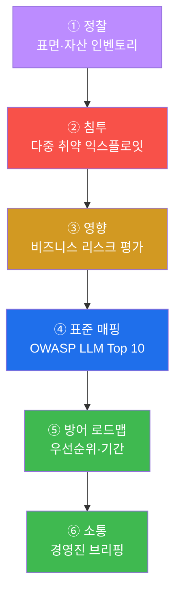
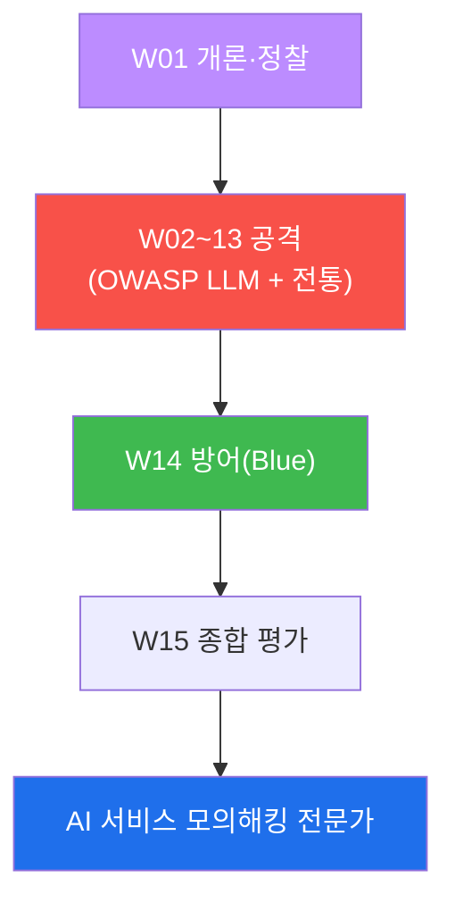

# ai-service-pentest W15 — 종합 평가(캡스톤): 전체 침투 + 방어 로드맵

> **본 주차의 한 줄 요약**
>
> 마지막 주는 W01~W14 를 하나의 **종합 평가(캡스톤)** 로 통합한다. AICompanion 을 대상으로
> 정찰부터 다중 취약 익스플로잇(프롬프트 인젝션 + **루트 RCE** + 경로순회)·영향 평가·**OWASP LLM
> Top 10 전체 매핑**·우선순위 있는 **방어 로드맵** 까지, 완전한 침투 평가 보고서(기술 + 경영진)를
> 완성한다. 새 취약을 배우는 주가 아니라, 15주의 공격·방어를 **하나의 실전 평가로 통합** 해 "AI
> 서비스를 공격자의 눈으로 보고 방어자의 언어로 말하는" 종합 역량을 증명하는 주다. 핵심은 **점을
> 선으로, 선을 보고서로** — 개별 취약(점)을 공격 사슬(선)로 잇고, 그것을 조직이 행동할 수 있는
> 표준 매핑·우선순위 로드맵·경영진 브리핑(보고서)으로 번역하는 것이다.

---

## ⚠️ 사전 경고 — 인가된 격리 훈련 대상에서만

종합 평가도 **인가된 격리 훈련 서비스 AICompanion(`ai.el34.lab`)** 만 대상으로 한다.

---

## 이 주차의 시선 — 전문가로서 종합하기

15주 동안 배운 개별 기법을 이제 **하나의 실전 평가** 로 통합한다. 실전 침투 테스터는 기법을 아는
것을 넘어, 정찰→침투→영향→표준 매핑→방어 로드맵→경영진 소통의 **전 과정** 을 스스로 수행한다.

> **이 주차의 시선** — "나는 이 AI 서비스를 **끝까지 평가하고, 조직이 고칠 수 있게 전달** 할 수
> 있는가" 를 스스로 증명한다.

---

## 학습 목표

1. 15주의 공격·방어를 하나의 종합 침투 평가로 통합한다.
2. 전체 정찰·취약 인벤토리를 수행한다(마커 `RECON_DONE`).
3. 다중 취약(인젝션 + 루트 RCE)을 익스플로잇하고(마커 `PWNED`), 비즈니스 리스크를 평가한다(마커
   `IMPACT_ASSESSED`).
4. OWASP LLM Top 10 전체 매핑 + 방어 로드맵 보고서를 작성한다(마커 `FINAL_REPORT`).
5. 경영진 브리핑으로 종합한다(마커 `Assessment`).

---

## 0. 종합 프레임 — 침투 평가의 전 과정

### 0.1 6단계 평가 흐름

각 단계는 앞을 딛고 선다 — 정찰이 침투를, 침투가 영향을, 영향이 우선순위를, 표준이 로드맵을,
로드맵이 소통을 낳는다.

### 0.2 15주에서 확인한 취약 — OWASP LLM 지도

| 주차 | 취약 | OWASP |
|------|------|-------|
| W02~04·W10 | 프롬프트 인젝션(직접/간접/저장형) | LLM01 |
| W06 | 출력 처리·저장형 XSS | LLM02 |
| W11 | 모델 DoS | LLM04 |
| W03·W05 | 민감정보 유출·권한 무시 검색 | LLM06 |
| W07 | 과도한 에이전시·RCE | LLM07/08 |
| W12 | 공급망·모델 절취 | LLM10 |
| W09·W13 | 인가 우회·순회·SSRF | A01/A05 |

이 지도가 최종 보고서 "발견" 절의 골격이다.

### 0.3 좋은 최종 보고서의 요건

- **재현 가능** — 각 발견에 방법·증거.
- **영향 중심** — 자산·비즈니스 리스크로 번역.
- **표준 매핑** — OWASP LLM 등으로 공통 언어화.
- **실행 가능한 로드맵** — 우선순위(위험)·기간(즉시/단기/중기/상시).
- **두 청중** — 기술팀(상세)·경영진(결론·근거·영향·조치) 분리.

---

## 1. 캡스톤 수행 안내 (총 5 미션)

이번 주는 실습이 곧 평가다. 모든 공격에 `?me=<ME>`/`[me:<ME>]` 토큰을 붙여 내 작업으로 귀속시키고,
각 STEP 은 해당 주차 기법을 통합한다.

### 미션 1 — 전체 정찰 (W01·W12) → `RECON_DONE`
> `/kb`·`/api/debug/prompt`·`/api/model/export`·`/api/dataset` 를 모두 정찰. 4개 다 로그에 남으면 통과.

### 미션 2 — 다중 익스플로잇: 인젝션 + 루트 RCE (W02·W13) → `PWNED`
> (A) 프롬프트 인젝션으로 시스템 프롬프트·마스터 비번, (B) `os.system('id')` 로 루트 RCE. 둘 다 성공하면 통과.

### 미션 3 — 영향·비즈니스 리스크 (W14) → `IMPACT_ASSESSED`
> 서버 장악·비밀/PII 유출을 규제·법적·평판 리스크로 번역. 핵심 담기면 통과.

### 미션 4 — OWASP LLM 매핑 + 방어 로드맵 → `FINAL_REPORT`
> 전 발견을 LLM01~10 + 전통 취약에 매핑, 우선순위 방어 로드맵(즉시/단기/중기/상시). 통과.

### 미션 5 — 경영진 브리핑 → `Assessment`
> 결론·근거·영향·최우선 조치를 한 장으로. 첫 줄 `Assessment`.

---

## 2. 평가 루브릭 (스스로 점검)

| 항목 | 미흡 | 우수 |
|------|------|------|
| 통합 | 개별 취약만 재현 | 정찰→침투→영향→매핑→로드맵→소통 통합 |
| 증거 | "됐다" 서술 | 방법·로그·서버 흔적으로 재현 가능 |
| 표준 매핑 | 없음 | OWASP LLM 전반 정확히 매핑 |
| 영향 | 모호 | 자산·규제·법적으로 구체화 |
| 로드맵 | 나열 | 위험 우선순위 + 기간 |
| 소통 | 기술 용어만 | 경영진 브리핑 분리 |

---

## 2.5 훈련에서 실전으로 — 알아야 할 차이

이 과정은 인가된 훈련 대상(AICompanion)에서 안전하게 배웠다. 실전 침투 평가는 몇 가지가 다르다.

- **인가(Scope)와 계약** — 실전은 반드시 서면 인가(범위·기간·대상·금지사항)를 받고 시작한다.
  범위 밖 공격은 불법이다. "무엇을·언제·어디까지" 를 명문화한 **RoE(Rules of Engagement)** 가 있다.
- **파괴적 행동 자제** — 실 서비스에선 데이터 삭제·서비스 중단(DoS 실측)·과도한 부하를 피하고,
  개념 증명(PoC)만으로 위험을 입증한다(W11 에서 부하를 수십 건으로 제한한 이유).
- **데이터 취급** — 발견 과정에서 접한 실제 PII·비밀은 최소 수집·안전 보관·보고 후 파기한다.
- **소통·재테스트** — 심각한 취약은 즉시 통보(중간 보고), 수정 후 **재테스트** 로 완화를 확인한다.
- **책임 있는 공개** — 외부 제품 취약은 공급자에게 먼저 알리고 수정 기한을 주는 절차를 따른다.

훈련에서 익힌 **기법·사고·보고** 는 그대로 쓰되, 실전에선 **인가·안전·윤리** 가 앞선다.

## 2.6 다음 걸음 — AI 보안 전문가로

이 과정은 시작점이다. 계속 성장하려면:

- **표준·프레임워크 숙지** — OWASP LLM Top 10, OWASP Web/API Top 10, MITRE ATLAS(AI 위협),
  NIST AI RMF 등으로 언어·체계를 넓힌다.
- **전통 웹·인프라 병행** — AI 보안은 전통 보안의 확장이다(W13 이 보여줬듯). 웹·클라우드·컨테이너
  보안을 함께 다진다.
- **방어·탐지 역량** — 공격만이 아니라 SIEM·탐지 룰·IR(W14)로 방어자 관점을 기른다.
- **실습 지속** — 인가된 랩·CTF·버그바운티(범위 준수)로 손을 계속 움직인다.
- **읽고 쓰기** — 새 공격·방어 연구를 따라가고, 발견을 명확한 보고서로 쓰는 훈련을 반복한다.

AI 는 빠르게 바뀌지만, 이 과정의 **척추 — "넓게 훑고, 좁혀 확정하고, 통제한다"** 와 "입력·출력·
저장소·도구를 신뢰하지 말라" 는 원칙은 오래 간다.

## 2.7 커버한 것과 못다 다룬 것

정직한 마무리 — 이 과정이 다룬 것과, 더 배울 여지.

| 다룸 | 더 배울 여지 |
|------|--------------|
| OWASP LLM Top 10 전반 | 멀티모달(이미지·음성) 인젝션, 임베딩 역전 |
| 전통 취약(순회·SSRF·RCE·인가) | 클라우드·컨테이너 탈출, 공급망 심화 |
| 브라우저 공격 + 로그/DB 채점 | 자동화 도구(Burp·프록시)·스크립팅 |
| 방어 설계·탐지·IR | 실운영 SIEM·SOAR·위협 헌팅 |
| 결정론(mock)·실 LLM 체험 | 대형 모델·에이전트 프레임워크 심층 공격 |

못다 다룬 것은 **다음 학습의 지도** 다. 완주한 지금, 그 지도를 들고 계속 나아가면 된다.

---

## 3. 15주 회고 — 이 과정의 척추

- **넓게 훑고, 좁혀 확정하고, 통제한다.** LLM 앱을 OWASP LLM 으로 넓게 훑고(W01), 취약을 브라우저로
  직접 공격해 확정하고(W02~13), 방어(권한·필터·도구 제거·탐지)로 통제한다(W14).
- **AI 보안 = LLM 보안 + 전통 앱/인프라 보안.** 인젝션·유출·에이전시(LLM)와 인가·순회·SSRF·RCE
  (전통)가 결합될 때 가장 위험하다.
- **입력과 출력, 둘 다 신뢰하지 말라.** 프롬프트 인젝션(입력)과 XSS·RCE(출력)는 한 쌍이다.
- **최종 산출물은 보고서.** 조직이 행동할 수 있게 표준 매핑·우선순위·경영진 언어로 번역한다.

---

## 4. 핵심 정리 (1줄씩)

- 종합 평가는 **정찰→침투→영향→표준 매핑→방어 로드맵→소통** 의 전 과정이다.
- 개별 취약(LLM01~10 + 전통)을 **공격 사슬** 로 잇고 서버 장악·자산 탈취를 증명한다.
- 기술 침투를 **비즈니스 리스크** 로 번역해야 경영진이 행동한다.
- 최종 산출물은 **표준 매핑 + 우선순위 방어 로드맵 + 경영진 브리핑** 을 갖춘 보고서다.
- 이제 너는 **AI 서비스를 공격자의 눈으로 보고 방어자의 언어로 말할** 수 있다.

---

## 5. 과정을 마치며

15주 동안 OWASP LLM Top 10 전반 — 프롬프트 인젝션(직접·간접·저장형)·민감정보 유출·부적절한 출력
처리·과도한 에이전시·모델 DoS·공급망 절취 — 과 전통 취약(인가 우회·경로순회·SSRF·RCE)을 **브라우저로
직접 공격** 하고, **로그·DB 로 검증** 하고, **방어까지 설계** 했다. AI 서비스 모의해킹 전문가로서의
여정을 완주한 것을 축하한다. 이 역량으로 더 안전한 AI 서비스를 만드는 데 기여하길 바란다.

