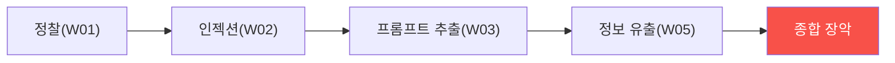

# ai-service-pentest W15 — 종합 평가: LLM 앱 전체 침투 + 방어

> **본 주차의 한 줄 요약**
>
> 마지막 주는 W01~W14를 하나의 **종합 평가**로 통합한다. 실제 AI 서비스 침투 테스트는 AICompanion 같은 대상을
> **전체 침투**하고(정찰→공격 체인→취약점 종합), **OWASP LLM Top 10 기반 보고**와 **심층 방어 권고**를 내는
> 것이다. AICompanion에 대한 전체 침투는 배운 모든 것을 종합한다: 정찰(W01)→프롬프트 인젝션(W02)→시스템 프롬프트
> 추출(W03, override 비밀번호)→민감정보 유출(W05, AWS 키·PII)→무인증 접근(W09)→출력 처리(W06)→과도한 에이전시
> (W07) 등을 **연결한 공격 체인**으로 조직 전체 장악 위협을 실증한다. 그리고 이 과목의 결론을 확인하며 마친다:
> **LLM 앱은 전통 웹 취약점과 LLM 고유 취약점을 모두 가지며, 프롬프트 인젝션은 완전히 막을 수 없으므로 심층
> 방어로 피해를 제한한다.** 핵심 원칙: ① **OWASP LLM Top 10** 으로 체계적 평가, ② **공격 체인**으로 실제 위협
> 실증, ③ **심층 방어**(입력·RAG·출력·행동·인프라 계층 + 최소 권한·입출력 불신·감독·모니터링), ④ **"막을 수
> 없으면 피해를 제한하라"** — 인젝션은 완화하되, 최소 권한·출력 검증·인간 승인으로 조종당해도 안전하게. AI
> 서비스가 폭증하는 시대에, 이를 공격자 관점으로 평가하고 방어하는 능력은 필수다. 사이버 보안자도 LLM 앱의 새로운
> 공격 표면을 이해해야 완전하다. 이 과목이 그 역량을 채운다.
>
> **한 줄 결론**: LLM 앱 침투 평가 = **전체 침투(정찰·공격 체인) + OWASP LLM 보고 + 심층 방어 권고**. 결론 —
> LLM 고유 취약점(특히 프롬프트 인젝션)은 완전 차단 불가라, 심층 방어로 피해를 제한한다.

---

## 학습 목표

본 주차 종료 시 학생은 다음 5가지를 **본인 손으로** 할 수 있어야 한다.

1. AICompanion을 **전체 침투**한다(FULL_PENTEST).
2. 발견을 **OWASP LLM으로 종합·우선순위**한다(FINDINGS_SYNTHESIZED).
3. AI 서비스 보안의 **핵심 원칙**을 종합한다(SYNTHESIS).
4. LLM 고유 취약점과 심층 방어를 설명한다.
5. W01~W14를 하나로 통합한다.

> **이 주차의 시선** — 배운 모든 것을 전체 침투·심층 방어로 통합하며 마친다.

---

## 0. 용어 해설 (종합)

| 용어 | 관련 주차 | 평가에서 |
|------|-----------|----------|
| **공격 체인** | W08 | 취약점 연결 |
| **OWASP LLM** | W01 | 체계 보고 |
| **심층 방어** | W14 | 겹층 방어 |
| **피해 제한** | W07·W14 | 최소 권한 |

---

## 0.5 종합 — 침투·보고·방어

### 0.5.1 전체 침투 체인

정찰→인젝션→추출→유출을 연결해 조직 전체 장악을 실증. 개별보다 체인이 실제 위협.

### 0.5.2 AI 서비스 보안 핵심 원칙

- **LLM 고유 표면**: 프롬프트 인젝션·정보 유출·출력 처리·과도한 에이전시(전통 웹+LLM 고유).
- **OWASP LLM Top 10**: 체계적 평가 프레임워크.
- **심층 방어**: 각 계층 방어+관통 원칙(최소 권한·입출력 불신·감독·모니터링).
- **피해 제한**: 인젝션은 완전 못 막으니 조종당해도 안전하게(최소 권한).

### 0.5.3 방어의 결론

프롬프트 인젝션은 LLM의 근본 특성이라 **완전 차단 불가**다. 그래서 방어의 핵심은 "막을 수 없으면 **피해를 제한
하라**" — 최소 권한으로 LLM이 오염돼도 할 수 있는 게 제한되고, 출력 검증·인간 승인으로 위험 행동이 걸러지게.
겹층 방어가 유일한 현실적 답.

---

## 1. 종합 평가 안내 (5 미션)

실행 위치 el34 **호스트**(`ssh ccc@{{TARGET_IP}}`), GPU `http://211.170.162.139:10934`.
실습 대상 AICompanion `http://192.168.0.161:8007` (인가된 훈련 대상).

### STEP 1 — GPU 헬스체크 → GEN_OK
### STEP 2 — 전체 침투 → FULL_PENTEST
### STEP 3 — OWASP LLM 종합·우선순위 → FINDINGS_SYNTHESIZED
### STEP 4 — 핵심 원칙 종합 → SYNTHESIS
### STEP 5 — 최종 종합 → Assessment

---

## 2. 흔한 오해·관제자 노트

- **"LLM 앱은 웹 보안만"** — LLM 고유 표면도. OWASP LLM Top 10.
- **"인젝션을 완전 차단"** — 불가. 심층 방어·피해 제한.
- **"개별 취약점만"** — 공격 체인이 실제 위협.
- **관제 관점** — AI 서비스가 OWASP LLM Top 10을 심층 방어로 다루고, 인젝션에 피해 제한(최소 권한) 설계인지
  종합 평가한다. AI 서비스 보안 성숙도의 척도.

---

## 3. 과목을 마치며

AI 서비스는 폭발적으로 늘고, 그만큼 새로운 공격 표면이 열렸다. 여러분은 이제 LLM 앱을 **공격자 관점으로 평가**
(프롬프트 인젝션·정보 유출·출력 처리·과도한 에이전시·공급망)하고, **심층 방어로 지키는** 능력을 갖췄다. 실습
대상 AICompanion에서 실제 취약점을 발견하고 방어를 설계하며 이를 체득했다. 프롬프트 인젝션은 완전히 막을 수
없지만, 심층 방어로 피해를 제한할 수 있다 — 그것이 AI 서비스 보안의 현실적 핵심이다. AI 시대의 보안자로서,
이 역량으로 안전한 AI 서비스를 만들길 바란다. 수고했다.
