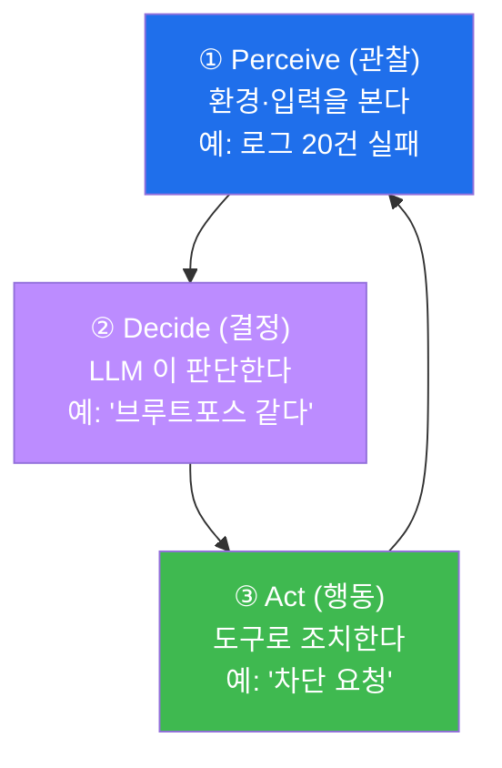
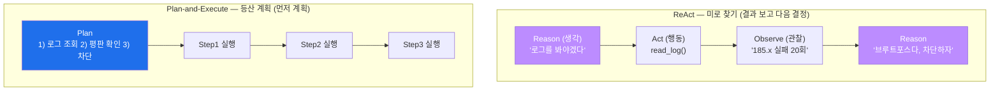
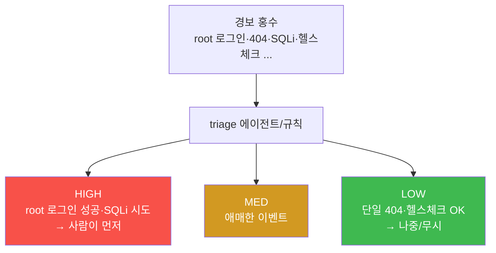
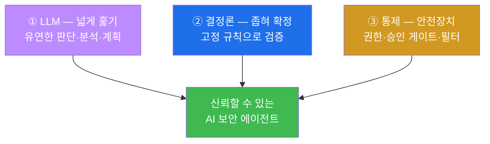
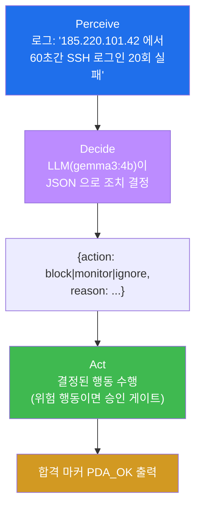
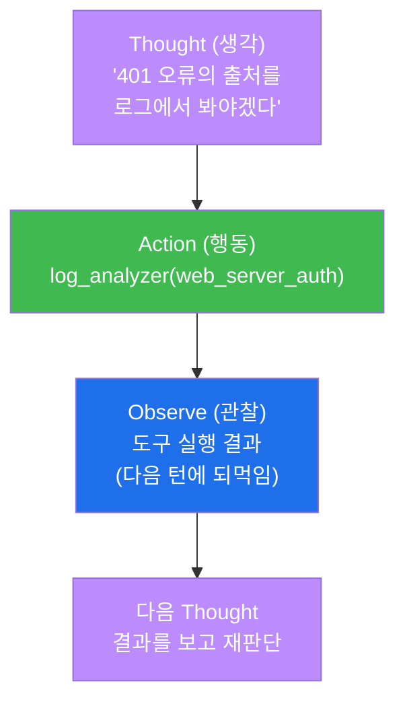
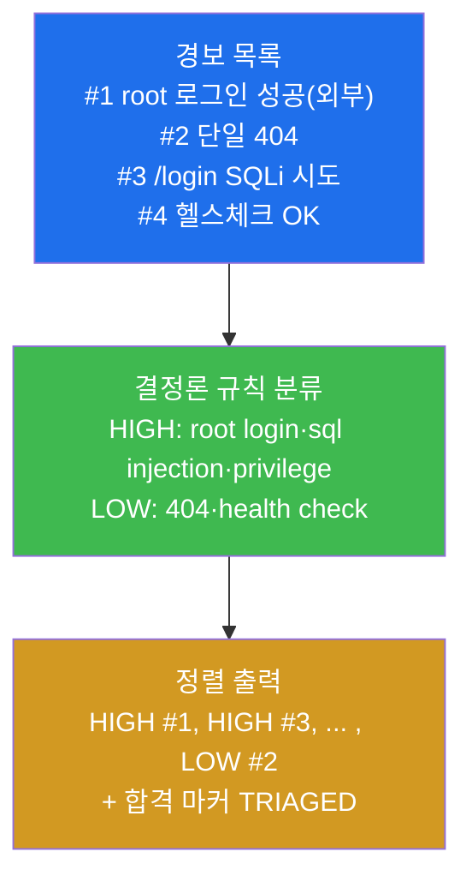
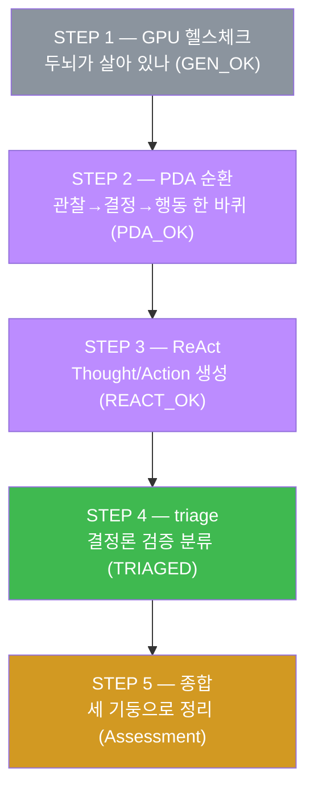
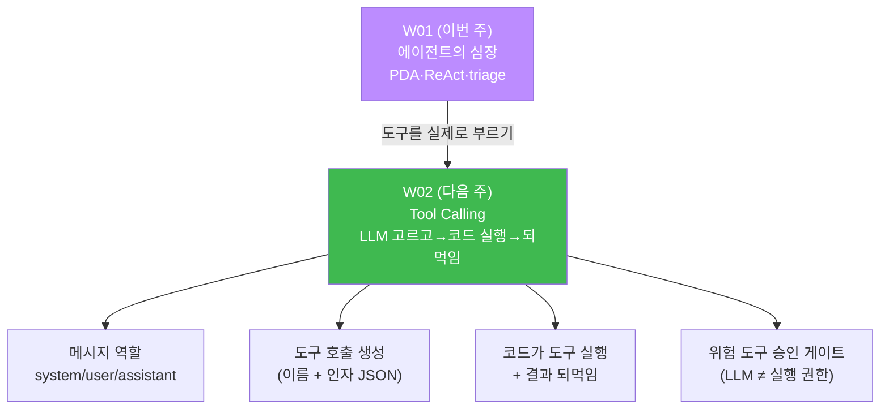

# aisec W01 — AI 보안 에이전트란 무엇인가: Perceive→Decide→Act·ReAct·보안 triage

> **본 주차의 한 줄 요약**
>
> aisec 는 "AI 보안 **에이전트를 직접 만드는**" 과목이다. 첫 주는 그 출발점 — **에이전트가
> 무엇인지** 부터 손으로 잡는다. **에이전트(agent)** 란 환경을 **관찰(Perceive)** 하고,
> 무엇을 할지 **결정(Decide)** 하고, 도구로 **행동(Act)** 하는 순환을 스스로 도는
> 프로그램이다. 정해진 절차만 반복하는 전통적 자동화 스크립트와 달리, LLM 을 두뇌로 얹은
> 에이전트는 **상황을 보고 매번 다르게 판단**한다. 대표적인 사고 패턴으로 **ReAct**(생각→
> 행동→관찰을 반복)와 **Plan-and-Execute**(먼저 전체 계획을 세우고 차례로 실행)가 있다.
> 보안에서 에이전트는 로그 분류·경보 분류(**triage**)·1차 조사·대응 보조처럼 "**판단이
> 필요하지만 반복적인** 업무" 를 맡는다. 이번 주 실습에서는 el34 훈련 인프라 위에서 GPU
> 에 올라간 소형 LLM(gemma3:4b)으로 첫 에이전트를 돌려, **관찰→결정→행동** 순환과 **ReAct**
> 를 직접 만들어 본다.
>
> **한 줄 결론**: 에이전트 = **관찰→결정→행동** 을 스스로 도는 LLM 프로그램. 스크립트는
> "정해진 대로", 에이전트는 "상황을 보고 판단해서" 움직인다. 이 과목은 그 **판단하는 보안
> 일꾼** 을 안전하게 만드는 법을 15주에 걸쳐 배운다. 다만 LLM 의 판단은 틀릴 수 있으므로,
> 처음부터 끝까지 **결정론적 검증** 과 **통제(승인·권한)** 로 감싸는 법을 함께 익힌다.

---

## 이 과목의 좌표 — 어디에 서 있는가

aisec 를 시작하기 전에 이 과목이 무엇의 **다음** 인지 짚고 간다. 선행 과목 **ai-security**
가 "LLM 을 보안 업무에 **쓰는**" 법(프롬프트로 로그를 분석시키고, 그 판단을 결정론으로
검증하는 법)이었다면, aisec 는 "그 LLM 으로 **자율 일꾼(에이전트)을 조립하는**" 법이다.
즉 ai-security 가 도구 하나하나의 사용법이었다면, aisec 는 그 도구들을 **스스로 판단하며
일하는 하나의 시스템** 으로 엮는 조립 과정이다.

그래서 이 과목의 15주는 세 덩어리로 나뉜다. **전반부(W01~W08)** 는 에이전트의 기본기 —
순환·도구 호출·프롬프트·하네스(harness, 에이전트를 실제로 일하게 만드는 운영 골격)를
만든다. **후반부(W09~W12)** 는 그 에이전트를 **안전하게·크게** 만든다 — 보안 위협 방어·
멀티에이전트·RAG(외부 지식 검색)·평가. **프로젝트(W13~W15)** 는 방어(자율 인시던트 대응)·
공격(CTF 자동 풀이)·교육 세 도메인에 적용해 종합한다. W01 은 그 첫 벽돌이다.

> **이 주차의 시선** — ai-security 가 "LLM 을 보안에 쓰기" 였다면, aisec 는 "그 LLM 으로
> **자율 일꾼을 조립하기**" 다. W01 은 그 일꾼의 **심장(관찰→결정→행동)** 을 만드는 주다.

---

## 학습 목표

본 주차 종료 시 학생은 다음 5가지를 **본인 손으로** 할 수 있어야 한다.

1. **에이전트** 의 정의와 **Perceive→Decide→Act** 순환을 설명하고, 이 순환이 왜
   에이전트의 "심장" 인지 말한다.
2. LLM 에이전트와 **전통적 자동화 스크립트** 의 근본적 차이(고정된 절차 vs 상황에 따른
   판단)를 예를 들어 설명한다.
3. 두 가지 사고 패턴 — **ReAct**(생각→행동→관찰 반복)와 **Plan-and-Execute**(계획 먼저→
   차례 실행) — 를 구분하고, 각각이 어떤 작업에 적합한지 판단한다.
4. 보안 분야에서 에이전트의 대표 역할(경보 **triage**·1차 조사·대응 보조)을 파악하고,
   왜 "판단이 필요한 반복 업무" 에 에이전트가 잘 맞는지 설명한다.
5. GPU 에 올라간 소형 LLM(gemma3:4b)으로 첫 에이전트를 실행해, **관찰→결정→행동** 순환
   (PDA_OK), **ReAct** 형식 생성(REACT_OK), 경보 **triage**(TRIAGED)를 손으로 완주한다.

---

## 0. 용어 해설 (AI 보안 에이전트 입문)

본 절은 이번 주에 처음 등장하는 핵심 용어를 표로 먼저 정리하고(§0), 신입생이 특히
헷갈리기 쉬운 용어는 일상 비유로 다시 풀어 설명한다(§0.5). 본문에서 막히면 이 절로
돌아오면 흐름이 끊기지 않는다.

| 용어 | 영문 | 뜻 | 비유 |
|------|------|----|------|
| **에이전트** | Agent | 관찰·결정·행동을 스스로 도는 프로그램 | 판단하는 자율 일꾼 |
| **Perceive** | Perceive | 환경/입력을 관찰하는 단계 | 눈·귀 |
| **Decide** | Decide | 무엇을 할지 판단하는 단계 | 두뇌 |
| **Act** | Act | 도구로 실제 행동하는 단계 | 손발 |
| **PDA 순환** | Perceive-Decide-Act loop | 관찰→결정→행동을 반복하는 고리 | 심장 박동 |
| **LLM** | Large Language Model | 방대한 텍스트로 학습해 다음 말을 예측하는 대형 언어 모델 | 박식한 신입 분석가 |
| **Ollama** | — | 로컬/서버에서 LLM 을 띄워 HTTP API 로 쓰게 해주는 실행기 | 모델 구동 서버 |
| **gemma3:4b** | — | 이 과목이 쓰는 소형 오픈 LLM(40억 파라미터) | 경량 두뇌 |
| **API** | Application Programming Interface | 프로그램끼리 약속된 형식으로 요청·응답하는 창구 | 주문 접수 창구 |
| **JSON** | JavaScript Object Notation | `{"키":"값"}` 형식의 데이터 표기법 | 표준 주문 양식 |
| **ReAct** | Reasoning + Acting | 생각→행동→관찰을 반복하는 패턴 | 시행착오 |
| **Plan-and-Execute** | — | 계획을 먼저 세우고 차례로 실행 | 작전 후 수행 |
| **triage** | Triage | 우선순위로 분류(경보 등) | 응급실 중증도 분류 |
| **환각** | Hallucination | LLM 이 근거 없이 그럴듯하게 지어냄 | 아는 척하는 거짓말 |
| **결정론적 검증** | Deterministic verification | 고정된 규칙으로 LLM 판단을 재확인 | 계산기로 검산 |
| **승인 게이트** | Approval gate | 위험 행동 전 사람의 허가를 받는 관문 | 고액 결제 상급자 승인 |
| **하네스** | Harness | LLM 을 실제로 일하게 만드는 운영 골격(도구·안전장치·기억) | 마구(馬具) |
| **합격 마커** | Pass marker | 각 실습이 성공 시 출력하는 고정 문자열(예: `PDA_OK`) | 통과 도장 |

---

## 0.5 핵심 개념 — 일상 비유

### 0.5.1 에이전트 vs 스크립트 — 신호등과 교통경찰 비유

교차로를 생각해 보자. **신호등** 은 정해진 시간에 따라 빨강·초록을 반복한다. 도로가 텅
비어 있어도, 응급차가 사이렌을 울리며 달려와도, 신호등은 **똑같은 순서** 를 지킨다. 규칙이
고정돼 있어 예측 가능하지만, 예외 상황에는 대응하지 못한다.

반면 그 교차로에 선 **교통경찰** 은 **상황을 보고 판단** 한다. 응급차가 오면 다른 방향을
막고 길을 터주고, 사고가 나면 우회시키고, 정체가 심하면 흐름을 조절한다. 같은 교차로라도
매 순간 다르게 행동한다.

이 차이가 곧 **스크립트** 와 **에이전트** 의 차이다.

- **스크립트(자동화 스크립트)** — `if 실패횟수 > 5: 차단` 처럼 **조건과 행동이 코드에
  고정** 돼 있다. 입력이 무엇이든 정해진 절차만 따른다. 신호등처럼 예측 가능하지만, 살짝
  다른 상황(예: 실패 5회 미만이지만 명백히 수상한 패턴)에는 대응하지 못한다.
- **에이전트** — 로그를 **LLM 이 읽고** "이 패턴은 브루트포스로 보인다" 고 **판단** 한 뒤
  유연하게 대응한다. 교통경찰처럼 상황에 맞춰 움직인다. 대신 판단이 **틀릴 수 있다**(환각).
  그래서 에이전트에는 반드시 **검증** 이 따라붙는다(§0.5.6).

> **핵심.** 둘을 가르는 것은 오직 하나 — **판단의 유무** 다. 스크립트는 "정해진 대로",
> 에이전트는 "상황을 보고 판단해서" 움직인다. 이 과목이 만들려는 것은 후자, 즉 **판단하는
> 보안 일꾼** 이다.

> **브루트포스(brute force)란?** 비밀번호를 무차별로 계속 시도해 뚫으려는 공격이다. 짧은
> 시간에 로그인 실패가 수십 번 몰리는 흔적으로 드러난다. 본문에서 예시로 자주 등장하므로
> 여기서 짚어 둔다.

### 0.5.2 Perceive→Decide→Act — 자동차 운전 비유

운전을 떠올려 보자. 능숙한 운전자는 매 순간 세 가지를 반복한다. 앞을 **본다**(신호·차선·
보행자), 무엇을 할지 **판단한다**(속도를 줄일까, 차선을 바꿀까), 그리고 핸들·브레이크·
액셀로 **행동한다**. 행동한 뒤 다시 앞을 보고, 판단하고, 행동한다 — 이 고리는 목적지에
도착할 때까지 멈추지 않는다.

에이전트의 심장이 바로 이 고리다. **Perceive(관찰) → Decide(결정) → Act(행동)** 순환.



에이전트는 이 순환을 스스로 돈다: 로그를 **관찰** 하고, "이건 공격 같다" 고 **결정** 하고,
"차단 요청" 을 **행동** 한 뒤, 그 결과를 다시 **관찰** 한다. 사람이 매 단계 지시하지 않아도
스스로 순환한다는 것이 핵심이다. 이번 주 실습 STEP 2 에서 이 한 바퀴를 손으로 돌린다.

- **Perceive(관찰)** — 에이전트에게 주어지는 입력. 로그 한 줄, 경보 목록, 조사 결과 등.
- **Decide(결정)** — LLM 이 그 입력을 읽고 무엇을 할지 고른다. 이것이 "판단" 이다.
- **Act(행동)** — 결정한 바를 **도구** 로 실제 수행한다. 로그 읽기, 평판 조회, 차단 등.
  단, 되돌리기 어려운 위험 행동(차단·삭제)은 사람 **승인** 을 거친다(§0.5.6).

### 0.5.3 LLM — 박식하지만 가끔 지어내는 신입 분석가 비유

이 과목의 에이전트는 **LLM** 을 두뇌로 쓴다. LLM 이 무엇인지부터 정확히 잡자.

**LLM(Large Language Model, 대형 언어 모델)** 은 인터넷 규모의 방대한 텍스트로 학습해,
"지금까지의 문장 다음에 올 가장 그럴듯한 말" 을 예측하는 모델이다. 이 단순한 능력이 쌓이면
질문에 답하고, 로그를 분류하고, 계획을 세우는 것처럼 보이는 행동이 나온다.

LLM 을 **아주 박식한 신입 분석가** 로 상상하면 성질을 이해하기 쉽다.

- **장점** — 엄청나게 많이 읽었다. 온갖 공격 유형·로그 형식·대응 절차를 "안다". 새로운
  상황도 그럴듯하게 처리한다. 이것이 스크립트가 못 하는 **유연한 판단** 의 원천이다.
- **치명적 약점** — 가끔 **자신 있게 지어낸다.** 존재하지 않는 CVE 번호를 만들어 내거나,
  안전한 IP 를 위험하다고 단정하기도 한다. 이 "근거 없이 그럴듯하게 지어내는" 현상이
  **환각(hallucination)** 이다. 환각은 버그가 아니라 LLM 의 **상수(항상 존재하는 성질)**
  다 — 그래서 우리는 LLM 의 판단을 결코 그대로 믿지 않고 **검증** 한다(§0.5.6).

> **왜 소형 모델(gemma3:4b)인가?** 이 과목은 40억 파라미터급 소형 오픈 모델 **gemma3:4b**
> 를 쓴다. 소형 모델은 빠르고 값싸며 GPU 한 대에 여러 학생이 함께 쓸 수 있다. 대신 큰
> 모델보다 실수·환각이 잦다. 이는 오히려 교육적으로 유리하다 — **작은 두뇌를 코드로 감싸
> 신뢰할 수 있게 만드는 법** 을 배우면, 큰 모델에는 그 원리가 더 쉽게 적용되기 때문이다.
> "모델이 완벽하지 않아도 시스템은 믿을 수 있게" 만드는 것이 이 과목의 실전 기술이다.

### 0.5.4 ReAct vs Plan-and-Execute — 미로 찾기와 등산 계획 비유

에이전트가 "결정" 을 내리는 방식에는 크게 두 가지 사고 패턴이 있다.

**미로 찾기** 를 떠올려 보자. 미로에서는 전체 경로를 미리 알 수 없다. 한 걸음 가 보고,
막히면 되돌아와 다른 길을 시도한다. **한 번 움직인 결과를 보고 다음을 정하는** 방식이다.
이것이 **ReAct** 다.

반대로 **등산** 은 대개 코스가 정해져 있다. 출발 전에 지도로 "A 봉우리 → 능선 → B 대피소
→ 정상" 이라는 **전체 계획을 먼저 세우고** 그대로 따라간다. 이것이 **Plan-and-Execute** 다.



- **ReAct(Reason + Act)** — **생각(Reason) → 행동(Act) → 관찰(Observe)** 를 반복한다.
  각 행동의 결과를 보고 **다음 생각** 을 정하므로, 예상치 못한 상황에 잘 적응한다. 조사·
  탐색처럼 "해봐야 아는" 작업에 강하다. 이번 주 STEP 3 에서 이 패턴을 직접 만든다.
- **Plan-and-Execute** — **먼저 전체 계획** 을 세우고 차례로 실행한다. 절차가 명확한
  작업(정해진 대응 플레이북 실행 등)에 적합하고, 각 단계가 예측 가능해 감사·검증이 쉽다.

> **어느 쪽이 정답인가?** 둘 다 상황에 따라 맞다. 탐색이 필요하면 ReAct, 절차가 분명하면
> Plan-and-Execute. 실무는 흔히 **섞어 쓴다** — 큰 틀은 계획으로 잡고, 세부 조사는 ReAct 로
> 파고든다. "ReAct 가 항상 최선" 이라는 생각은 흔한 오해다.

### 0.5.5 triage — 응급실 중증도 분류 비유

한밤중 응급실에 환자 열 명이 동시에 몰렸다고 하자. 의료진은 도착 순서대로 진료하지
않는다. **가장 위중한 환자부터** 본다. 손가락을 베인 사람은 기다리고, 가슴 통증을 호소하는
사람은 즉시 처치한다. 이렇게 **한정된 자원을 심각도 순으로 배분** 하는 것이 **triage(트리아지,
중증도 분류)** 다.

보안 관제(SOC)도 똑같은 문제를 안고 있다. 하루에 경보가 수천 건씩 쏟아진다. 사람이 전부
정독할 수 없다. 그래서 **경보를 심각도로 분류해, 사람이 중요한 것부터 보게** 한다 — 이것이
보안에서의 triage 이고, 에이전트의 대표적인 일자리다.



이번 주 STEP 4 에서 경보 목록을 심각도(HIGH/MED/LOW)로 분류·정렬하는 triage 를 만든다.
단, 그 STEP 은 **결정론 규칙** 으로 분류한다 — 그 이유가 다음 절이다.

### 0.5.6 신뢰의 세 기둥 — LLM 을 코드로 감싸기

에이전트는 강력하지만 두뇌(LLM)가 실수한다(환각). 그래서 이 과목은 처음부터 끝까지 **하나의
원칙** 을 반복한다: **LLM 을 그대로 믿지 말고, 코드로 감싸라.** 이는 세 기둥으로 이뤄진다.



- **① LLM 으로 넓게 훑기** — LLM 의 유연함으로 넓게 조사·판단한다. 여기서 환각이 섞일 수
  있다는 것을 **전제** 로 한다.
- **② 결정론으로 좁혀 확정** — LLM 의 판단을 **고정된 규칙(결정론적 검증)** 으로 재확인한다.
  "결정론적(deterministic)" 이란 **같은 입력이면 항상 같은 결과** 를 내는, 지어내지 않는
  코드 로직을 말한다. 계산기로 암산을 검산하듯, 코드가 LLM 의 답을 검산한다. 이것이 STEP 4
  triage 를 **LLM 이 아니라 규칙으로** 짠 이유다 — 그 STEP 은 "좁혀 확정" 하는 검증의 예다.
- **③ 통제(안전장치)** — 되돌리기 어려운 위험 행동(차단·삭제)은 사람 **승인 게이트** 를
  거치고, 에이전트가 할 수 있는 일은 **권한(권한 최소화)** 으로 제한한다. LLM 이 무엇을
  하려 하든 코드의 통제선이 막는다.

> **이 세 기둥을 기억하라.** "**LLM 으로 넓게 훑고, 결정론으로 좁혀 확정하고, 통제로 자율을
> 길들인다**" — 이 한 문장이 aisec 15주 전체를 관통하는 결론이다(W15 에서 다시 만난다).
> W01 의 실습이 이미 이 원칙의 축소판이다: STEP 2 는 LLM 판단(넓게), STEP 4 는 결정론
> 검증(좁혀), block 같은 위험 행동은 승인 대상(통제)이라고 표시한다.

---

## 1. 왜 에이전트인가 — 스크립트로는 안 되는 일

### 1.1 한 줄 답: 규칙으로 다 적을 수 없는 판단이 있다

전통적 보안 자동화는 **규칙(rule)** 으로 돌아간다. "실패 5회 초과면 차단", "이 시그니처면
경보". 규칙은 명확하고 빠르고 검증하기 쉽다. 단순·반복 작업에는 지금도 규칙이 정답이다.

문제는 **규칙으로 다 적을 수 없는 판단** 이 존재한다는 것이다. 예를 들어 "이 로그 묶음이
정상 배치 작업의 부작용인가, 아니면 공격의 전조인가?" 같은 질문은 맥락·경험·상식이
필요해, 모든 경우를 `if` 문으로 나열하기가 사실상 불가능하다. 사람 분석가는 이런 판단을
매일 하지만, 그 수가 너무 많아 사람만으로는 감당하지 못한다.

여기서 에이전트가 등장한다. **LLM 을 두뇌로 얹으면, 규칙으로 못 적는 애매한 판단을 유연하게
처리** 할 수 있다. 사람 분석가의 1차 판단을 대신 맡아, 사람은 정말 중요한 결정에 집중한다.

### 1.2 스크립트 vs 에이전트 — 나란히 비교

| 구분 | 자동화 스크립트 | LLM 에이전트 |
|------|-----------------|--------------|
| 판단 방식 | 코드에 고정된 규칙(`if`) | LLM 이 상황을 읽고 판단 |
| 새로운 상황 | 규칙에 없으면 대응 못 함 | 유연하게 처리 시도 |
| 예측 가능성 | 완전히 예측 가능 | 매번 조금씩 다를 수 있음 |
| 신뢰성 | 규칙이 맞으면 항상 정확 | 환각 위험 → **검증 필요** |
| 적합한 일 | 단순·반복·명확 | 판단이 필요한 반복 업무 |

핵심은 마지막 두 줄이다. 에이전트의 유연함은 **환각** 이라는 대가를 치른다. 그래서 에이전트를
쓸 때는 반드시 **결정론적 검증** 을 붙인다(§0.5.6). "에이전트냐 스크립트냐" 가 아니라,
**"LLM 의 유연함(넓게) + 코드의 신뢰(좁혀)를 어떻게 결합하느냐"** 가 진짜 설계 질문이다.

### 1.3 그래서 에이전트를 "만든다" 는 것은

에이전트를 만든다는 것은 단지 LLM 에게 질문을 던지는 일이 아니다. **관찰→결정→행동 순환을
설계** 하고, LLM 의 판단을 **검증** 하고, 위험 행동에 **승인** 을 걸고, 이 모든 것을 **하네스**
(운영 골격)로 묶는 일이다. W01 은 그중 가장 안쪽 — 순환 자체 — 를 만든다. 도구 호출(W02)·
프롬프트 신뢰성(W03)·하네스(W04~)가 그 바깥을 차례로 감싼다.

---

## 2. 에이전트의 심장 — Perceive→Decide→Act 를 코드로

### 2.1 한 줄 정의와 왜 중요한가

**한 줄 정의**: PDA 순환은 에이전트가 **입력을 관찰(Perceive)** 하고 → **LLM 으로 판단
(Decide)** 하고 → **도구로 행동(Act)** 한 뒤 → 결과를 다시 관찰하는, 스스로 도는 고리다.

**왜 중요한가**: 이 순환이 없으면 에이전트는 단발성 질의응답(챗봇)에 그친다. 순환이 있어야
"관찰한 결과를 보고 다음 행동을 정하는" 자율성이 생긴다. 그래서 이것을 에이전트의 **심장**
이라 부른다 — 멈추면 에이전트가 아니다.

### 2.2 el34 에서 어떻게 — 로그 한 줄을 결정으로

이번 주 실습(STEP 2)은 순환 **한 바퀴** 를 코드로 돌린다. 흐름은 다음과 같다.



여기서 중요한 설계 결정이 하나 있다. LLM 은 `block`(차단)·`monitor`(감시)·`ignore`(무시)
중 하나를 고른다. 이 중 **block 은 되돌리기 어려운 위험 행동** 이다. 그래서 실전에서는
block 을 곧바로 실행하지 않고 **승인 게이트** 를 거친다(이 주는 개념만; 실제 승인 배선은
W04 이후). monitor·ignore 는 상대적으로 안전하다. **"LLM 은 판단만, 위험한 실행은 통제
아래"** — 세 기둥의 통제(§0.5.6)가 여기서 처음 나타난다.

### 2.3 왜 출력을 JSON 으로 강제하나

STEP 2 는 LLM 에게 `{"action":"...","reason":"..."}` 형식의 **JSON** 으로만 답하라고
지시한다. 왜일까? 에이전트의 출력은 **다음 단계(코드)가 읽어서 처리** 한다. LLM 이 "제
생각에는 감시하는 게 좋겠습니다" 같은 자유 문장으로 답하면, 코드가 "그래서 action 이
뭐지?" 를 파싱하기 어렵다. **JSON 은 프로그램끼리 주고받는 표준 주문 양식** 이다 —
`action` 필드를 정확히 꺼내 쓸 수 있다. 그래서 도구 호출·판단 출력에는 낮은 무작위성 +
JSON 형식이 정석이며, 이는 W03(프롬프트 신뢰성 공학)에서 본격적으로 다룬다.

### 2.4 한계

이 순환의 두뇌는 LLM 이므로, **결정이 틀릴 수 있다.** 실제로 소형 모델 gemma3:4b 는 같은
로그에도 어떤 때는 `monitor`, 어떤 때는 `block` 을 낼 수 있다. 그래서 STEP 2 의 합격 기준은
"정확히 block 이 나왔는가" 가 아니라 "**block 또는 monitor 라는 합리적 조치가 나와 순환이
완성됐는가**"(마커 `PDA_OK`)로 잡는다. 판단의 정확도 자체를 끌어올리고 검증하는 일은
W03·W12 의 몫이다. W01 은 "순환이 돈다" 는 것을 확인하는 데 집중한다.

---

## 3. 두뇌 배선 — LLM·Ollama·gemma3:4b·API

이 절은 실습에서 **실제로 쓰는 도구** 를 처음부터 설명한다. 명령을 외우기 전에 "무엇을
왜 부르는지" 를 알아야 결과를 해석할 수 있다.

### 3.1 Ollama 와 GPU 서버 — 두뇌는 어디에 사는가

에이전트의 두뇌(LLM)는 무겁다. 학생 노트북에서 돌리기 어렵다. 그래서 이 과목은 **GPU 서버
한 대에 LLM 을 띄워 놓고, 학생들이 네트워크로 함께 쓰는** 방식을 택한다.

- **Ollama** — 로컬/서버에서 LLM 을 손쉽게 띄우고 **HTTP API** 로 쓰게 해주는 실행기다.
  모델을 내려받아 구동하고, `http://<주소>/api/generate` 같은 창구로 요청을 받는다.
- **GPU 서버 주소** — 이 과목은 `http://211.170.162.139:10934` 에 Ollama 가 gemma3:4b 를
  서빙한다. 실습은 el34 **호스트** 에서 이 주소로 요청을 보낸다.
- **gemma3:4b** — 그 서버에 올라간 소형 오픈 LLM(약 40억 파라미터). 두뇌 역할을 한다.

```mermaid
graph TD
    HOST["el34 호스트<br/>ssh ccc@TARGET_IP<br/>(python3·curl 로 요청 작성)"] -->|HTTP 요청| GPU["GPU 서버<br/>211.170.162.139:10934<br/>Ollama + gemma3:4b"]
    GPU -->|응답(JSON)| HOST
    style HOST fill:#1f6feb,color:#fff
    style GPU fill:#bc8cff,color:#fff
```

> **왜 el34 호스트에서 실행하나?** 이번 주 실습은 el34 의 취약 컨테이너를 공격하지 않는다.
> el34 호스트는 그저 **python3 와 표준 도구가 갖춰진 편리한 리눅스 작업대** 로 쓰인다 — 여기서
> 에이전트 코드를 작성해 GPU 로 보낸다. el34 의 방화벽·IPS·bastion 같은 실물 인프라는
> 에이전트에 **손발** 을 달아 주는 W05 이후에 본격 등장한다. W01 은 **두뇌** 만 만든다.

### 3.2 API·HTTP·JSON — 요청과 응답의 형식

에이전트 코드가 LLM 에게 말을 거는 방법은 **API 호출** 이다. 세 용어를 정리한다.

- **API(Application Programming Interface)** — 프로그램끼리 "이런 형식으로 요청하면 이런
  형식으로 답한다" 고 약속한 창구다. 식당의 주문 창구와 같다.
- **HTTP** — 웹에서 요청·응답을 주고받는 표준 프로토콜. `curl` 이나 파이썬 `urllib` 이
  이 프로토콜로 GPU 서버에 요청을 보낸다.
- **JSON** — 요청 본문과 응답을 담는 데이터 양식. 예: `{"model":"gemma3:4b","prompt":"..."}`.

Ollama 의 `/api/generate` 에 보내는 요청 JSON 의 주요 필드는 다음과 같다. 실습 명령에
그대로 나오므로 미리 익힌다.

| 필드 | 뜻 | 예시 |
|------|----|------|
| `model` | 쓸 모델 이름 | `"gemma3:4b"` |
| `prompt` | 사용자 입력(질문·지시) | `"Log: 20 failed SSH logins..."` |
| `system` | 에이전트의 역할·규칙(가장 중요) | `"You are a security agent..."` |
| `stream` | 응답을 조금씩 흘릴지 여부 | `false`(한 번에 받기) |
| `format` | 출력 형식 강제 | `"json"`(JSON 으로만) |
| `options.temperature` | 무작위성(0=일관, 높을수록 창의적) | `0.1`(판단은 낮게) |
| `options.num_predict` | 생성할 최대 토큰(길이) 제한 | `60` |

> **temperature 와 num_predict 란?** **temperature** 는 출력의 "무작위성" 손잡이다. 0 에
> 가까우면 매번 비슷하고 일관된 답(파싱 안정), 높으면 다양하고 창의적인 답(형식 흔들림)이
> 나온다. 도구 호출·판단처럼 **정확성** 이 필요한 일에는 낮게 둔다. **num_predict** 는 생성
> 길이(토큰 수) 상한이다. **토큰(token)** 은 모델이 글을 처리하는 최소 단위(대략 단어
> 조각)로, num_predict 를 작게 잡으면 빠르고 값싸다. 짧은 판단에는 60 정도면 충분하다.

### 3.3 system 프롬프트 — 에이전트의 정체성

세 필드 중 **`system`** 이 특히 중요하다. system 프롬프트는 LLM 에게 "너는 누구이고, 어떤
규칙을 따르며, 어떤 형식으로 답해야 하는지" 를 못박는 자리다. STEP 2 의 system 은 이렇다.

```
You are a security agent. Given a log, decide ONE action.
Reply JSON only: {"action":"block|monitor|ignore","reason":"..."}
```

이 한 문단이 순한 언어 모델을 "**로그를 받아 하나의 조치를 JSON 으로 내는 보안 에이전트**"
로 바꾼다. system 을 어떻게 쓰느냐가 에이전트의 정체성과 신뢰성을 좌우하며, W03 에서 이
"프롬프트 신뢰성 공학" 을 깊이 다룬다.

### 3.4 실습 코드의 뼈대 — 파이썬 heredoc

STEP 2·3 은 파이썬 스크립트를 셸에서 바로 실행하기 위해 **heredoc** 문법을 쓴다.

```bash
python3 - <<'PY'
# ... 여기에 파이썬 코드 ...
PY
```

`<<'PY' ... PY` 는 "두 `PY` 사이의 여러 줄을 통째로 python3 의 표준 입력으로 넘겨라" 는
셸 문법이다(**heredoc**). 파일을 따로 만들지 않고 긴 스크립트를 한 번에 실행할 수 있어
실습에 편리하다. 따옴표로 감싼 `'PY'` 는 그 안의 `$` 등을 셸이 건드리지 않게 한다.
스크립트 안에서는 `urllib.request` 로 GPU 에 HTTP 요청을 보내고, 돌아온 응답 JSON 에서
`response` 필드(모델이 생성한 텍스트)를 꺼내 판단으로 쓴다.

### 3.5 합격 마커 — 각 실습은 왜 대문자 토큰을 출력하나

실습 스크립트들은 마지막에 `GEN_OK`·`PDA_OK`·`REACT_OK`·`TRIAGED` 같은 **대문자 문자열**
을 출력한다. 이것을 **합격 마커(pass marker)** 라 부른다. 자동 채점기가 스크립트의 출력에
이 마커가 있는지 확인해 통과 여부를 판정한다. 즉 마커는 "이 실습이 의도한 결과에
도달했다" 는 **통과 도장** 이다. 실습을 돌렸을 때 마지막 줄에 이 마커가 보이면 성공이다.

---

## 4. ReAct — 생각하고 행동하고 관찰하기

### 4.1 한 줄 정의와 왜 중요한가

**한 줄 정의**: **ReAct(Reasoning + Acting)** 는 에이전트가 **생각(Thought) → 행동(Action)
→ 관찰(Observation)** 을 반복하며, 각 행동의 결과를 보고 다음 생각을 정하는 사고 패턴이다.

**왜 중요한가**: 조사·탐색처럼 "해봐야 아는" 작업에서는 전체 계획을 미리 세울 수 없다.
ReAct 는 한 걸음씩 나아가며 상황 변화에 적응하므로, 인시던트 조사·CTF 풀이 같은 탐색적
보안 작업의 표준 패턴이다(W13·W14 에서 다시 쓴다).

### 4.2 el34 에서 어떻게 — Thought/Action 두 줄 생성

STEP 3 은 LLM 에게 "정확히 두 줄 — `Thought:` 한 줄, `Action:` 한 줄 — 로만 답하라" 고
시킨다. 예를 들어 "웹 서버의 반복 401 오류를 조사하라" 는 지시에 이렇게 답한다.

```
Thought: Analyze the web server logs for the source of repeated 401 errors.
Action: log_analyzer(web_server_auth)
```



여기서 `Action` 의 `log_analyzer(...)` 는 **도구 호출의 이름과 인자** 를 텍스트로 표현한
것이다. 이번 주는 그 **형식을 생성** 하는 데까지만 간다(합격 마커 `REACT_OK` = 출력에
`Thought` 와 `Action` 이 모두 있음). 이 Action 을 실제로 실행하고 그 결과(Observe)를 다시
LLM 에 넣어 다음 Thought 로 잇는 **완전한 도구 호출 루프** 는 W02 의 주제다.

### 4.3 왜 형식이 중요한가 — 그리고 한계

ReAct 의 힘은 **형식의 규칙성** 에서 나온다. `Thought:`/`Action:` 이라는 고정 틀이 있어야
코드가 "다음에 어떤 도구를 어떤 인자로 부를지" 를 뽑아낼 수 있다. 형식이 깨지면(예: 세
줄로 답하거나 Action 을 빠뜨리면) 루프가 멈춘다. 그래서 소형 모델에서는 형식 강제(W03)가
특히 중요하다. **한계**: gemma3:4b 는 종종 형식을 어긴다. STEP 3 의 판정을 "정확히 이
Action 이 나왔나" 가 아니라 "Thought 와 Action 형식이 생성됐나" 로 느슨하게 잡은 것도 그
때문이다. 형식 신뢰도를 끌어올리는 것은 다음 주의 일이다.

---

## 5. 보안에서의 에이전트 — triage 와 "넓게 훑고 좁혀 확정"

### 5.1 에이전트의 대표 일자리

에이전트가 보안에서 맡는 일은 대체로 **"판단이 필요하지만 반복적인" 업무** 다. 대표적으로:

- **로그·경보 triage** — 쏟아지는 경보를 심각도로 분류해, 사람이 중요한 것부터 보게 한다.
- **1차 조사** — 의심 이벤트의 맥락(관련 로그·IP 이력·평판)을 모아 사람에게 정리해 준다.
- **대응 보조** — (승인 아래) 차단·격리 같은 표준 대응을 실행한다.

공통점은 "규칙으로 다 적기는 애매하지만, 사람이 하기엔 너무 많은" 일이라는 점이다. 사람은
최종 판단과 위험 행동 승인에 집중하고, 반복적인 1차 판단을 에이전트가 덜어 준다.

### 5.2 STEP 4 triage 를 왜 규칙으로 짰나 — 검증의 예

이번 주 STEP 4 는 경보 4건을 심각도로 분류·정렬한다. 그런데 이 STEP 은 **LLM 이 아니라
파이썬 규칙** 으로 분류한다. 언뜻 "에이전트 과목인데 왜 규칙?" 싶지만, 여기에 이 과목의
핵심 교훈이 담겨 있다.



실무의 triage 는 두 층으로 돈다. **① LLM 이 넓게 분류** 한다(유연하지만 환각 위험). **②
결정론 규칙이 그 분류를 검증** 한다(예: "root 로그인·SQLi 는 무조건 HIGH" 를 코드가
확정). STEP 4 는 그중 **② 검증 층** 을 손으로 만들어, "좁혀 확정" 이 무엇인지 체감하게
한다. 즉 STEP 4 는 §0.5.6 세 기둥의 **② 결정론(좁혀 확정)** 을 코드로 보여 주는 실습이다.
마커 `TRIAGED` 는 "root 로그인·SQLi 두 건이 정확히 HIGH 로 분류됐다" 는 검증 통과를 뜻한다.

> **SQLi 가 왜 HIGH 인가?** **SQLi(SQL Injection)** 는 입력창에 악의적 SQL 구문을 넣어
> 데이터베이스를 조작·탈취하는 대표적 웹 공격이다. `/login` 에 SQLi 시도가 보인다는 것은
> 인증을 우회하려는 능동적 공격이므로 즉시 대응 대상 — HIGH 다. 반면 단일 404(없는 페이지
> 한 번 요청)나 헬스체크 성공은 일상적 잡음이라 LOW 다.

### 5.3 이 과목 전체의 척추

STEP 2(LLM 판단, 넓게)와 STEP 4(규칙 검증, 좁혀)를 나란히 두면 이 과목의 척추가 보인다.
**LLM 으로 넓게 훑고, 결정론으로 좁혀 확정한다.** 여기에 위험 행동 **통제(승인·권한)** 가
더해지면 세 기둥(§0.5.6)이 완성된다. 앞으로 매주 이 척추 위에 부품이 하나씩 얹힌다 — 도구
호출(W02)·프롬프트 신뢰성(W03)·하네스(W04~)·위협 방어(W09)·평가(W12). W01 을 마치면 이미
그 뼈대를 손으로 만져 본 셈이다.

---

## 6. 실습으로 가기 전 — 큰 그림 한 장

지금까지의 개념이 이번 주 5개 실습에서 어떻게 이어지는지 한 장으로 정리한다.



STEP 1 로 두뇌가 살아 있는지 확인하고 → STEP 2 로 심장(PDA)을 한 바퀴 돌리고 → STEP 3
으로 ReAct 사고를 생성하고 → STEP 4 로 결정론 검증(triage)을 짜고 → STEP 5 로 배운 것을
세 기둥으로 종합한다. 개념(§0.5)이 그대로 실습이 된다.

---

## 7. 실습 안내 (총 5 미션)

각 실습은 **4축 설명** 으로 구성된다 — (a) 왜 하는가 (b) 무엇을 알 수 있는가 (c) 결과 해석
(d) 실전 활용. 모든 명령은 el34 **호스트**(`ssh ccc@{{TARGET_IP}}`, 비밀번호 `1`)에서
실행하며, 두뇌는 GPU 서버 `http://211.170.162.139:10934`(gemma3:4b)를 호출한다.

### 실습 1 — GPU 헬스체크 (→ GEN_OK)

> **왜 하는가?** 에이전트의 0번째 단계는 "두뇌가 살아 있는가" 의 확인이다. GPU 서버가
> 응답하지 않으면 그 뒤 모든 실습이 무의미하다. 사람으로 치면 조사 전에 "정신이 또렷한가"
> 를 확인하는 셈이다.
>
> **무엇을 알 수 있는가?** `curl` 로 `/api/generate` 에 "ready 라고만 답하라" 는 짧은
> 요청을 보내, gemma3:4b 가 실제로 텍스트를 생성하는지 확인한다. `curl` 은 명령줄에서 HTTP
> 요청을 보내는 표준 도구다.
>
> **결과 해석.** 마지막 줄에 합격 마커 `GEN_OK` 가 보이면 두뇌가 응답한 것이다. `GEN_EMPTY`
> 가 나오면 모델이 빈 응답을 냈고(서버 과부하 등), 아예 오류가 나면 네트워크·서버 문제다.
>
> **실전 활용.** 모든 LLM 시스템의 첫 점검. 모델·엔드포인트 도달성을 확인하지 않고 로직부터
> 짜면, 원인 불명의 실패로 시간을 낭비한다. "먼저 연결부터 확인" 은 실무의 기본기다.

### 실습 2 — Perceive→Decide→Act 순환 (→ PDA_OK)

> **왜 하는가?** 에이전트의 심장인 **관찰→결정→행동** 순환을 직접 한 바퀴 돌려, 스크립트와
> 다른 "판단하는" 동작을 체감한다. 이 순환이 이 과목 전체의 원자 단위다.
>
> **무엇을 알 수 있는가?** 로그 한 줄(관찰)을 gemma3:4b 에게 주고, `system` 프롬프트로
> "하나의 조치를 JSON 으로 결정하라" 고 시켜(결정), 그 결정을 행동으로 출력한다. LLM 이
> 상황을 읽고 `block`/`monitor`/`ignore` 중 하나를 **스스로 고른다** 는 점이 핵심이다.
>
> **결과 해석.** 마지막 줄 `PDA_OK` 는 LLM 이 `block` 또는 `monitor` 라는 합리적 조치를
> 내어 순환이 완성됐다는 뜻이다. `IGNORED` 가 나오면(무시로 판단) 순환은 돌았지만 조치가
> 소극적인 것이다. 소형 모델이라 실행마다 `block`↔`monitor` 가 바뀔 수 있는데, 이는
> 정상이며 **판단의 흔들림 → 검증 필요** 를 몸으로 보여 준다.
>
> **실전 활용.** SOC 의 1차 판단 자동화의 원형이다. 단, 출력 중 `block` 은 위험 행동이므로
> 실전에서는 **승인 게이트** 를 거친다(W04+). "LLM 은 판단, 위험 실행은 통제 아래" 를
> 여기서 처음 새긴다.

### 실습 3 — ReAct 패턴 (→ REACT_OK)

> **왜 하는가?** 조사·탐색 작업의 표준 사고 패턴인 **ReAct**(생각→행동→관찰 반복)를 손으로
> 만든다. 결과를 보고 다음을 정하는 적응적 사고를 형식으로 표현하는 법을 익힌다.
>
> **무엇을 알 수 있는가?** "반복 401 오류를 조사하라" 는 지시에 LLM 이 `Thought:`(생각)
> 한 줄과 `Action:`(다음 행동=도구 호출) 한 줄을 생성한다. 이 형식이 있어야 코드가 "다음에
> 무슨 도구를 부를지" 를 뽑아낼 수 있다.
>
> **결과 해석.** 마지막 줄 `REACT_OK` 는 출력에 `Thought` 와 `Action` 이 모두 담겼다는
> 뜻이다. `NO_REACT` 는 모델이 형식을 어긴 것(소형 모델에서 종종 발생) — 형식 강제의
> 필요성을 보여 준다.
>
> **실전 활용.** 인시던트 조사·CTF 풀이(W13·W14)의 엔진이다. Action 의 결과(Observe)를 다시
> 넣으면 다음 Thought 로 이어져, 한 걸음씩 파고드는 자율 조사가 된다.

### 실습 4 — 보안 triage (→ TRIAGED)

> **왜 하는가?** 에이전트의 대표 보안 역할인 **경보 triage** 를 만들되, 이번엔 **결정론
> 규칙** 으로 짠다. 세 기둥 중 **"결정론으로 좁혀 확정"**(검증)이 무엇인지 코드로 체감하는
> 것이 목적이다.
>
> **무엇을 알 수 있는가?** 경보 4건(root 로그인·단일 404·SQLi 시도·헬스체크)을 심각도
> 규칙으로 HIGH/MED/LOW 로 분류하고, 사람이 먼저 볼 순서로 정렬한다. 규칙은 "같은 입력이면
> 항상 같은 결과" 를 내는 **결정론** 로직이라, LLM 과 달리 흔들리지 않는다.
>
> **결과 해석.** 마지막 줄 `TRIAGED` 는 root 로그인·SQLi 두 건이 정확히 HIGH 로 분류됐다는
> 검증 통과다. `MISCLASSIFIED` 가 나오면 분류 규칙이 의도와 어긋난 것이다.
>
> **실전 활용.** 실무 triage 는 "LLM 이 넓게 분류 → 이런 결정론 규칙으로 검증" 의 2층
> 구조다. STEP 4 는 그 **검증 층** 이다. LLM 의 유연함을 코드의 신뢰로 감싸는 이 과목의
> 핵심 패턴을 처음 손으로 만든다.

### 실습 5 — 종합 (→ Assessment)

> **왜 하는가?** 배운 것(에이전트 정의·PDA·ReAct·triage)을 한데 묶어 정리한다. 부품을
> 나열하는 데 그치지 않고, 그것들이 **하나의 원칙(세 기둥)** 으로 꿰인다는 것을 확인한다.
>
> **무엇을 알 수 있는가?** GPU 에게 W01 의 성과(PDA_OK·REACT_OK·TRIAGED)를 근거로 짧은
> 정리 노트를 쓰게 한다. 노트는 "에이전트가 스크립트와 어떻게 다른가" 와 세 가지 요점
> (관찰-결정-행동 순환 / LLM 판단의 결정론 검증 / 위험 행동 승인)을 담는다.
>
> **결과 해석.** 출력에 `Assessment` 가 있으면 형식을 지킨 것이다. 노트 내용이 세 요점을
> 제대로 담았는지 스스로 읽어 확인한다(형식 통과와 내용 이해는 별개다).
>
> **실전 활용.** 모든 조사·대응의 마지막은 **정리·전달** 이다. 아무리 잘 판단해도 정리하지
> 못하면 가치가 없다. 이번 주 배움을 본인 말로 요약하는 것이 다음 주로 나아가는 토대다.

---

## 8. 흔한 오해·블루팀 노트

- **"에이전트 = 챗봇"** — 챗봇은 대화만 한다. 에이전트는 **도구로 행동** 하고 관찰→결정→
  행동 순환을 돈다. 대화가 아니라 **일** 을 한다는 것이 결정적 차이다.
- **"LLM 판단은 믿을 만하다"** — 환각은 LLM 의 상수다. 판단 결과는 **결정론으로 검증** 한다
  (이 과목 내내 반복). STEP 2 의 판단이 흔들리는 것을 직접 보라 — 그래서 STEP 4 의 검증이
  필요하다.
- **"ReAct 가 항상 최선"** — 계획이 명확한 작업엔 Plan-and-Execute 가 낫다. 탐색엔 ReAct,
  정형 절차엔 계획 — 상황에 맞게 고른다.
- **"위험 행동도 에이전트가 알아서"** — 아니다. 차단·삭제 같은 되돌리기 어려운 행동은
  **승인 게이트** 를 거친다. 자율성과 통제의 균형이 실전 에이전트의 조건이다.
- **관제 관점** — 보안 에이전트의 각 순환(관찰·결정·행동)이 **로깅** 되는지, 행동(특히
  위험 행동)이 **검증·승인** 을 거치는지 점검한다. "왜 그렇게 결정했나" 라는 판단 근거가
  남아야 사후 감사가 된다. 판단 근거 없는 에이전트는 관제 불가다.

---

## 9. 다음 주차 (W02) 예고 — LLM API 와 Tool Calling

W01 이 "에이전트란 무엇인가(심장 만들기)" 였다면, W02 는 에이전트가 **도구를 실제로 부르는**
핵심 메커니즘 **Tool Calling** 을 다룬다. 이번 주 STEP 3 에서 `Action: log_analyzer(...)`
라는 도구 호출을 **형식으로 생성** 하는 데까지 갔다면, W02 는 그 호출을 **실제로 실행하고
결과를 다시 LLM 에 되먹여** 순환을 완성한다.



구체적으로 W02 에서는 (a) LLM API 의 **메시지 역할** 3종(system=규칙·역할, user=사용자
입력, assistant=모델 답변)을 정확히 구분하고, (b) LLM 이 "이 작업엔 이 도구가 필요하다" 며
**도구 호출(이름+인자)** 을 내게 하고, (c) 우리 **코드가 그 도구를 실제 실행** 해 결과를
다시 LLM 에 넣어 주는 루프를 완성하며, (d) 위험 도구(block 등)에는 **승인 게이트** 를 걸어
"**LLM 은 무엇을 할지 결정하고, 코드는 검증 후 실행한다**" 는 안전 원칙을 배선으로 구현한다.
W01 에서 새긴 세 기둥(넓게-좁혀-통제)이 W02 에서 실제 도구 배선으로 이어진다.
