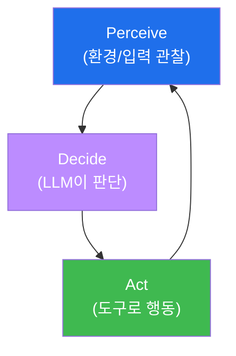
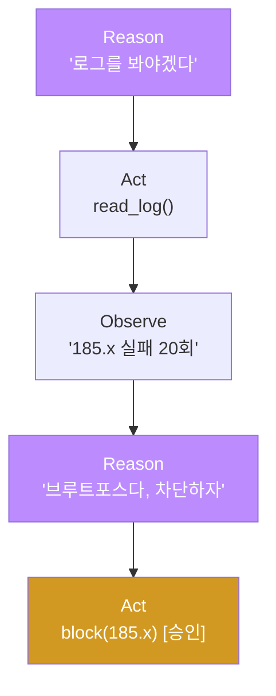

# aisec W01 — AI 에이전트란 무엇인가: Perceive→Decide→Act·ReAct·보안 역할

> **본 주차의 한 줄 요약**
>
> aisec는 "AI 보안 **에이전트를 직접 만드는**" 과목이다. 첫 주는 에이전트가 무엇인지부터 잡는다. **에이전트**란
> 환경을 **관찰(Perceive)** 하고, 무엇을 할지 **결정(Decide)** 하고, 도구로 **행동(Act)** 하는 순환을 스스로
> 도는 프로그램이다. 고정된 절차만 반복하는 전통적 자동화 스크립트와 달리, LLM 에이전트는 **상황에 따라
> 다르게 판단**한다. 대표 패턴으로 **ReAct**(생각하고→행동하고→관찰하길 반복)와 **Plan-and-Execute**(먼저 계획
> 세우고→차례로 실행)가 있다. 보안에서 에이전트는 로그 분류·경보 분류(triage)·대응 등 **판단이 필요한 반복
> 업무**를 맡는다. 이번 주는 Ollama로 첫 에이전트 대화를 돌리고, Perceive-Decide-Act 순환과 ReAct를 손으로
> 만든다.
>
> **한 줄 결론**: 에이전트 = **관찰→결정→행동**을 스스로 도는 LLM 프로그램. 스크립트는 "정해진 대로", 에이전트는
> "상황을 보고 판단해서" 움직인다. 이 과목은 그 판단하는 보안 일꾼을 만드는 법을 배운다.

---

## 학습 목표

본 주차 종료 시 학생은 다음 5가지를 **본인 손으로** 할 수 있어야 한다.

1. 에이전트의 정의와 **Perceive→Decide→Act** 순환을 설명한다.
2. LLM 에이전트와 **전통적 자동화 스크립트**의 차이를 설명한다.
3. **ReAct**·Plan-and-Execute 패턴을 구분한다.
4. 보안 분야에서 에이전트의 역할(triage 등)을 파악한다.
5. Ollama로 첫 에이전트(관찰→결정→행동)를 실행한다(PDA_OK).

> **이 주차의 시선** — ai-security가 "LLM을 보안에 쓰기"였다면, aisec는 "그 LLM으로 **자율 일꾼을 조립하기**"다.

---

## 0. 용어 해설 (AI 보안 에이전트)

| 용어 | 영문 | 뜻 | 비유 |
|------|------|----|------|
| **에이전트** | Agent | 관찰·결정·행동을 스스로 도는 프로그램 | 자율 일꾼 |
| **Perceive** | Perceive | 환경/입력을 관찰 | 눈·귀 |
| **Decide** | Decide | 무엇을 할지 판단 | 두뇌 |
| **Act** | Act | 도구로 행동 | 손발 |
| **ReAct** | Reasoning+Acting | 생각→행동→관찰 반복 | 시행착오 |
| **Plan-and-Execute** | — | 계획 먼저→차례 실행 | 작전 후 수행 |
| **triage** | Triage | 우선순위 분류(경보 등) | 응급 분류 |

> **헷갈리기 쉬운 한 쌍** — *스크립트* 는 "입력이 뭐든 같은 절차"(고정), *에이전트* 는 "상황을 보고 절차를 바꿈"
> (판단)이다. 판단의 유무가 둘을 가른다.

---

## 0.5 신입생 친화 핵심 개념

### 0.5.1 Perceive→Decide→Act — 에이전트의 심장

에이전트는 이 순환을 돈다: 로그를 **관찰**하고, "이건 공격 같다"고 **결정**하고, "차단 요청"을 **행동**한 뒤,
결과를 다시 **관찰**한다. 사람이 매 단계 지시하지 않아도 스스로 돈다.

### 0.5.2 스크립트 vs 에이전트 — 판단의 유무

- **스크립트**: `if 실패횟수>5: 차단` — 조건이 고정. 새로운 상황(살짝 다른 공격)엔 못 대응.
- **에이전트**: 로그를 LLM이 읽고 "이 패턴은 브루트포스로 보인다"고 **판단** → 유연하게 대응. 대신 판단이
  틀릴 수 있어(환각) **검증이 필요**하다(ai-security의 "넓게 훑고 좁혀 확정" 원칙이 여기서도 핵심).

### 0.5.3 ReAct — 생각하고 행동하고 관찰하기

ReAct는 **Reason(생각) → Act(행동) → Observe(관찰)** 를 반복한다.

각 행동의 결과(Observe)를 보고 **다음 생각**을 정하므로, 상황 변화에 적응한다. Plan-and-Execute는 반대로
**먼저 전체 계획**을 세우고 차례로 실행한다(계획이 명확한 작업에 적합).

### 0.5.4 보안에서 에이전트의 역할

- **로그/경보 triage** — 쏟아지는 경보를 심각도로 분류해 사람이 중요한 것부터 보게.
- **1차 조사** — 의심 이벤트의 맥락(관련 로그·IP 이력) 수집.
- **대응 보조** — (승인 하에) 차단·격리 같은 표준 대응 실행.
- 공통점: **판단이 필요하지만 반복적인** 일. 사람은 최종 판단·위험 행동 승인에 집중.

### 0.5.5 이 과목이 만들 것 — 하네스를 갖춘 보안 에이전트

앞으로 우리는 에이전트에 **하네스(harness)** 를 입힌다: 도구 사용법·안전장치·경험/지식(E.G)을 갖춰, 단순
대화를 넘어 **실제 보안 업무를 자율 수행**하는 에이전트를 만든다(W04~W08). W01은 그 출발점인 관찰→결정→행동을
직접 만들어 본다.

---

## 1. 실습 안내 (5 미션)

실행 위치 el34 **호스트**(`ssh ccc@{{TARGET_IP}}`), GPU `http://211.170.162.139:10934`(gemma3:4b).

### STEP 1 — GPU 헬스체크 → GEN_OK
### STEP 2 — Perceive→Decide→Act 순환 → PDA_OK
- **왜/무엇을:** 로그(관찰)를 LLM이 판단(결정)해 조치(행동)를 내는 1회 순환.
- **해석:** 에이전트의 심장을 손으로.

### STEP 3 — ReAct 패턴 → REACT_OK
- **왜?** 생각→행동→관찰 반복.
- **무엇을?** LLM이 Thought/Action 형식으로 다음 행동을 생성.
- **해석:** 결과를 보고 다음을 정한다.

### STEP 4 — 보안 triage → TRIAGED
- **왜?** 에이전트의 대표 보안 역할.
- **무엇을?** 경보 목록을 심각도로 분류(결정론 검증).
- **해석:** 판단이 필요한 반복 업무 자동화.

### STEP 5 — 종합 → Assessment
- 에이전트 정의·PDA·ReAct·역할을 묶어 정리(Assessment).

---

## 2. 흔한 오해·블루팀 노트

- **"에이전트 = 챗봇"** — 챗봇은 대화만, 에이전트는 **도구로 행동**하고 순환을 돈다.
- **"LLM 판단은 믿을 만하다"** — 환각은 상수. 판단 결과는 결정론으로 검증(이 과목 내내 반복).
- **"ReAct가 항상 최선"** — 계획이 명확하면 Plan-and-Execute가 낫다. 상황에 맞게.
- **관제 관점** — 보안 에이전트의 각 순환(관찰·결정·행동)이 로깅되는지, 행동(특히 위험)이 검증·승인을 거치는지
  점검한다. 판단 근거(왜 그렇게 결정했나)가 남아야 사후 감사가 된다.

---

## 3. 다음 주차 (W02) 예고 — LLM API와 Tool Calling

W01이 "에이전트란 무엇인가"였다면, W02는 에이전트가 **도구를 부르는** 핵심 메커니즘 **Tool Calling**을 다룬다.
Ollama API의 메시지 역할(system/user/assistant)과 생성 파라미터를 익히고, LLM이 함수를 호출해 실제 도구를
쓰는 에이전트를 직접 만든다.
