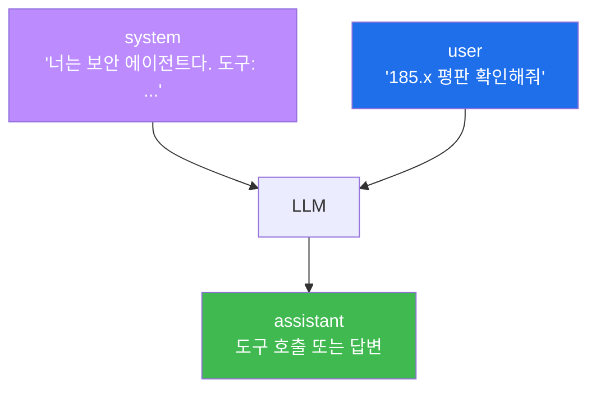

# aisec W02 — LLM API와 Tool Calling: 메시지 역할·도구 호출·실행 루프

> **본 주차의 한 줄 요약**
>
> 에이전트가 "행동(Act)"하려면 **도구(tool)** 를 불러야 한다. W02는 그 메커니즘 **Tool Calling**을 다룬다. 먼저
> LLM API의 **메시지 역할** 3종(system=규칙·역할, user=사용자 입력, assistant=모델 답변)을 정확히 구분한다.
> 그다음 **Tool Calling** — LLM이 "이 작업엔 `get_ip_reputation` 도구가 필요해"라고 판단해 **도구 호출(이름+
> 인자)** 을 내면, 우리 코드가 그 도구를 **실제 실행**하고 결과를 다시 LLM에게 넣어준다. 이 "LLM이 도구를
> 고르고 → 코드가 실행하고 → 결과를 되먹임"의 루프가 에이전트가 실제 세상과 상호작용하는 방식이다. 단,
> LLM이 위험한 도구(block_ip)를 부르면 **승인 게이트**를 거쳐야 한다.
>
> **한 줄 결론**: Tool Calling = **LLM은 "무엇을 할지" 결정하고, 코드는 "실제 실행"을 담당**하는 분업. LLM에게
> 도구 실행 권한을 직접 주는 게 아니라, LLM의 "요청"을 코드가 **검증 후 실행**한다 — 이 분리가 안전의 핵심이다.

---

## 학습 목표

본 주차 종료 시 학생은 다음 5가지를 **본인 손으로** 할 수 있어야 한다.

1. LLM API의 **메시지 역할**(system/user/assistant)을 정확히 구분한다(ROLES_OK).
2. 생성 파라미터(temperature 등)가 도구 호출 안정성에 주는 영향을 설명한다.
3. **Tool Calling** — LLM이 도구 호출(이름+인자)을 생성하게 한다(TOOL_CALLED).
4. 도구를 **실행하고 결과를 되먹여** 루프를 완성한다(TOOL_RESULT).
5. 위험 도구에 **승인 게이트**가 필요한 이유(LLM≠실행 권한)를 설명한다.

> **이 주차의 시선** — 에이전트가 말이 아니라 **행동**하게 만드는 배선을 손으로 연결한다.

---

## 0. 용어 해설 (Tool Calling)

| 용어 | 영문 | 뜻 | 비유 |
|------|------|----|------|
| **메시지 역할** | Message Role | system/user/assistant 구분 | 대본의 배역 |
| **system** | System | 규칙·역할 정의 | 연출 지시 |
| **Tool Calling** | Tool/Function Calling | LLM이 도구 호출을 생성 | 주문서 작성 |
| **도구** | Tool | 코드로 실행되는 기능 | 연장 |
| **인자** | Argument | 도구에 넘기는 값 | 주문 상세 |
| **되먹임** | Feedback | 도구 결과를 LLM에 다시 입력 | 결과 보고 |

> **헷갈리기 쉬운 한 쌍** — *LLM의 도구 호출* 은 "이 도구를 이 인자로 써달라는 **요청**"(말)이고, *도구 실행* 은
> "코드가 실제로 **수행**"(행동)이다. LLM은 요청만, 실행은 코드가 — 이 분리가 안전선이다.

---

## 0.5 신입생 친화 핵심 개념

### 0.5.1 메시지 역할 — 대본의 배역



- **system**: 에이전트의 역할·규칙·사용 가능 도구를 정의(가장 중요, 한 번 설정).
- **user**: 사용자의 요청.
- **assistant**: 모델의 응답(도구 호출 요청 또는 최종 답변).

### 0.5.2 Tool Calling 루프 — LLM이 고르고 코드가 실행

```mermaid
graph TD
    U["user 요청"] --> L1["LLM: 어떤 도구?"]
    L1 -->|"{tool, args}"| CHK{"위험 도구?"}
    CHK -->|안전| RUN["코드가 도구 실행"]
    CHK -->|위험(block 등)| GATE["승인 게이트"]
    GATE --> RUN
    RUN -->|결과| L2["LLM: 결과 해석 → 답변/다음 도구"]
    style L1 fill:#bc8cff,color:#fff
    style RUN fill:#3fb950,color:#fff
    style GATE fill:#d29922,color:#fff
```

핵심: **LLM은 도구를 직접 실행하지 못한다.** LLM은 "이 도구를 이 인자로 써줘"라는 JSON을 낼 뿐이고, **우리
코드가** 그것을 검증(위험하면 승인)한 뒤 실행한다. 그래서 LLM이 탈취돼도 코드의 검증·승인이 방어선이 된다.

### 0.5.3 생성 파라미터와 도구 호출 안정성

도구 호출은 **정확한 형식(JSON)** 이 중요하다. `temperature`를 낮추면(0~0.2) 출력이 일관돼 파싱이 안정된다.
`format:"json"` 을 쓰면 구조화 출력이 강제된다. 창의성보다 **정확성**이 필요한 도구 호출엔 낮은 temperature +
JSON 포맷이 정석이다.

### 0.5.4 왜 "LLM≠실행 권한"이 안전의 핵심인가

만약 LLM에게 직접 셸 실행 권한을 주면, 프롬프트 인젝션(악의적 입력)이 LLM을 속여 위험 명령을 내게 할 수 있다.
대신 **LLM은 요청만, 코드가 화이트리스트·승인으로 걸러 실행**하면, LLM이 무엇을 요청하든 코드의 안전장치가
막는다. 이것이 ai-security W09의 bastion 화이트리스트와 같은 원리다. Tool Calling 설계의 제1원칙.

---

## 1. 실습 안내 (5 미션)

실행 위치 el34 **호스트**(`ssh ccc@{{TARGET_IP}}`), GPU `http://211.170.162.139:10934`(gemma3:4b).

### STEP 1 — GPU 헬스체크 → GEN_OK
### STEP 2 — 메시지 역할 → ROLES_OK
- **왜/무엇을:** system(역할)+user(요청)로 에이전트 응답을 유도, 역할 분리 확인.
- **해석:** system이 에이전트의 정체성.

### STEP 3 — Tool Calling → TOOL_CALLED
- **왜?** 에이전트가 도구를 고르게.
- **무엇을?** LLM이 요청에 맞는 도구 호출(이름+인자) JSON 생성.
- **해석:** LLM은 "무엇을 할지" 결정.

### STEP 4 — 도구 실행·되먹임 → TOOL_RESULT
- **왜?** 루프 완성.
- **무엇을?** 도구를 코드로 실행하고 결과를 LLM에 되먹여 최종 답변 생성(위험 도구는 승인).
- **해석:** 코드가 실행, 결과로 다음 판단.

### STEP 5 — 종합(LLM≠실행 권한) → Assessment
- 역할·도구 호출·실행 분리·승인을 묶어 권고(Assessment).

---

## 2. 흔한 오해·관제자 노트

- **"LLM이 도구를 직접 실행한다"** — 아니다. LLM은 요청(JSON)만, 코드가 실행. 이 분리가 안전.
- **"temperature는 높을수록 똑똑"** — 도구 호출은 정확성이 중요. 낮은 temperature + JSON 포맷.
- **"system 프롬프트는 대충"** — system이 에이전트의 역할·도구·규칙을 정의. 가장 중요.
- **관제 관점** — 에이전트의 도구 호출이 로깅되는지, 위험 도구(block/delete)에 승인 게이트가 걸리는지, 도구
  인자에 인젝션이 섞이지 않는지 점검한다. LLM 요청과 실제 실행 사이의 검증 계층이 핵심.

---

## 3. 다음 주차 (W03) 예고 — 프롬프트 엔지니어링 실전

W02가 "도구를 부르는 배선"이었다면, W03은 에이전트를 **정확하고 안정적으로** 움직이는 프롬프트 설계를 다룬다.
역할 지정·출력 형식 강제·few-shot 예시·체계적 지시로, 도구 호출과 판단의 신뢰도를 끌어올리는 실전 기법을 익힌다.
