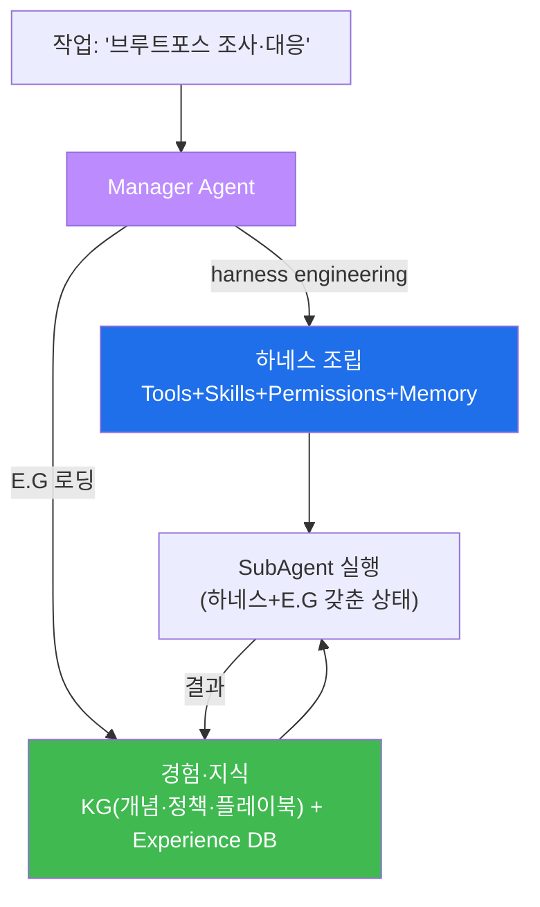

# aisec W04 — 에이전트 하네스 개론: 7대 구성요소·harness engineering·E.G

> **본 주차의 한 줄 요약**
>
> W01~W03이 에이전트의 기본기(순환·도구·프롬프트)였다면, W04부터는 이를 묶는 **하네스(harness)** 를 다룬다.
> LLM 자체는 텍스트만 생성한다. **하네스는 그 LLM을 실제로 일하게 만드는 "운영 골격"** — 도구·안전장치·기억·
> 순환 제어를 제공한다(마구(馬具)가 말을 안전하게 부리듯). 하네스는 **7대 구성요소**(Tools·Skills·Hooks·Memory·
> Agents·Tasks·Permissions)로 이뤄진다. 그리고 이 과목이 강조하는 새 구조에서, **Manager Agent가 harness
> engineering** — 즉 주어진 작업에 맞게 이 구성요소들을 **자동으로 조립**하고, **E.G(경험·지식)** 를 얹어
> SubAgent에게 일을 시킨다. 하네스가 "어떻게 일하나(동작 방식)"라면, E.G는 "무엇을 아는가(경험·지식)"다.
> 하네스는 **클라이언트 사이드(Claude Code)** 와 **서버 사이드(Bastion)** 두 형태가 있다.
>
> **한 줄 결론**: 하네스 = LLM을 일하게 만드는 **7대 구성요소의 운영 골격**. Manager가 이를 작업에 맞게
> **조립(harness engineering)** 하고 **E.G**를 얹어 자율 작업을 수행한다. 하네스=동작 방식, E.G=경험·지식.

---

## 학습 목표

본 주차 종료 시 학생은 다음 5가지를 **본인 손으로** 할 수 있어야 한다.

1. **하네스**의 정의와 필요성(LLM은 텍스트만; 하네스가 도구·안전·기억 제공)을 설명한다.
2. 하네스의 **7대 구성요소**를 파악하고 각 역할을 구분한다.
3. **Client-side(Claude Code) vs Server-side(Bastion)** 하네스를 비교한다.
4. **미니 하네스**(도구·권한·기억)를 만들어 에이전트를 안전하게 실행한다(HARNESS_RUN).
5. **Manager의 harness engineering**과 **E.G**(경험·지식)의 관계를 설명한다.

> **이 주차의 시선** — 낱개 부품(도구·프롬프트)을 **하나의 운영 골격(하네스)** 으로 묶는다.

---

## 0. 용어 해설 (하네스)

| 용어 | 영문 | 뜻 | 비유 |
|------|------|----|------|
| **하네스** | Harness | 에이전트 실행·제어 프레임워크 | 마구(馬具) |
| **harness engineering** | — | 작업에 맞게 하네스를 조립 | 작업 지시서 설계 |
| **E.G** | Experience & Knowledge | 에이전트의 경험·지식 | 매뉴얼+경험록 |
| **Client-side** | Client-side | 단말에서 실행(Claude Code) | 개인 비서 |
| **Server-side** | Server-side | 서버 중앙 운영(Bastion) | 중앙 관제센터 |
| **Skill** | Skill | 복합 도구를 묶은 고수준 능력 | 자격증 |
| **Permission** | Permission | 행동 제한(risk_level 등) | 출입 권한 |

> **헷갈리기 쉬운 한 쌍** — *하네스* 는 "어떻게 일하나(동작 방식·도구·안전)", *E.G* 는 "무엇을 아는가(경험·지식)"다.
> Manager는 하네스를 조립(engineering)하고 E.G를 얹어 SubAgent를 부린다.

---

## 0.5 신입생 친화 핵심 개념

### 0.5.1 왜 하네스가 필요한가 — LLM은 텍스트만 낸다

LLM에게 "185.x를 조사해"라고 하면 **텍스트로 방법을 말할 뿐** 실제로 로그를 읽지 못한다. 하네스가 도구(로그
읽기)·안전장치(위험 차단)·기억(이전 결과)·순환 제어를 붙여야 **실제로 일한다**. 하네스 없는 LLM은 말만 하는
컨설턴트, 하네스를 입은 LLM은 실제로 손발이 있는 일꾼이다.

### 0.5.2 하네스의 7대 구성요소

| # | 구성요소 | 역할 | el34-bastion(서버) | Claude Code(클라이언트) |
|---|----------|------|--------------------|--------------------------|
| 1 | **Tools** | 외부 시스템 상호작용 | /exec(화이트리스트 명령) | Bash·Read·Write·Grep |
| 2 | **Skills** | 복합 도구 고수준 조합 | wazuh.alerts·suricata.tail_eve | MCP 서버 |
| 3 | **Hooks** | 이벤트 전후 자동 실행 | (증거 자동 기록) | pre/post hooks |
| 4 | **Memory** | 컨텍스트·기록 유지 | E.G(Experience DB) | CLAUDE.md·.claude/ |
| 5 | **Agents** | 실행 주체 | SubAgent(원격, VM별) | Claude(로컬) |
| 6 | **Tasks** | 작업 단위 | 미션 계획의 단계들 | 대화 턴 |
| 7 | **Permissions** | 행동 제한 | 화이트리스트·승인 게이트 | .claude/settings.json |

이 7개가 갖춰지면 LLM이 **안전하게·기억하며·권한 내에서** 일한다.

### 0.5.3 Manager의 harness engineering — 자동 조립

새 구조에서 사람이 하네스를 매번 짜 주지 않는다. **Manager가 작업을 받아 필요한 구성요소(어떤 skill·어떤
권한·어떤 기억)를 자동으로 조립**(harness engineering)하고, **E.G**(관련 경험·지식)를 얹은 상태로 SubAgent를
실행한다. 즉 SubAgent는 **하네스(동작 방식) + E.G(경험·지식)** 를 모두 갖춘 채 일을 시작한다.

### 0.5.4 Client-side vs Server-side — 언제 무엇을

- **Client-side(Claude Code)** — 단말에서 실시간 대화·유연한 탐색. 사람과 함께 탐색·개발할 때. (W07)
- **Server-side(Bastion)** — 서버에서 다중 VM·자동화·감사 추적. 상시 자율 운영·대규모 대응에. (W05·W06)
- 둘 다 7대 구성요소를 갖지만, 실행 위치·자동화 정도가 다르다. 작업 성격에 맞게 고른다.

### 0.5.5 E.G — 하네스에 지식을 더하다

하네스가 "동작 골격"이라면 E.G는 그 위에 얹는 "지식·경험"이다. **KG(Knowledge Graph)**: 개념·정책·플레이북·
자산 같은 **정형 지식**. **Experience DB**: 과거 대응의 **경험**(무엇이 통했나). Manager는 harness를 짤 때 E.G를
참조해 더 정확히 조립하고, 결과를 E.G에 축적한다(ai-security W10·W13의 그 E.G와 같다).

---

## 1. 실습 안내 (5 미션)

실행 위치 el34 **호스트**(`ssh ccc@{{TARGET_IP}}`), GPU `http://211.170.162.139:10934`(gemma3:4b).

### STEP 1 — GPU 헬스체크 → GEN_OK
### STEP 2 — 미니 하네스 구축 → HARNESS_BUILT
- **왜/무엇을:** Tools·Permissions·Memory를 가진 미니 하네스 프레임워크를 만든다.
- **해석:** 7대 구성요소의 축소판.

### STEP 3 — 하네스로 에이전트 실행 → HARNESS_RUN
- **왜?** 하네스가 LLM을 안전하게 일하게.
- **무엇을?** LLM이 도구 결정 → 하네스가 권한 검사 → 실행 → 기억 기록.
- **해석:** 권한·기억이 붙은 실행.

### STEP 4 — el34-bastion 7대 구성요소 매핑 → MAPPED
- **왜?** 개념을 실물로.
- **무엇을?** 실물 bastion의 skills/permissions를 7대 구성요소에 매핑(실물 조회).
- **해석:** 하네스는 실물에 구현돼 있다.

### STEP 5 — 종합(harness engineering+E.G) → Assessment
- 7대 구성요소·Manager 조립·E.G를 묶어 정리(Assessment).

---

## 2. 흔한 오해·관제자 노트

- **"LLM만 좋으면 된다"** — LLM은 텍스트만. 하네스가 있어야 실제로 일한다(안전·기억·권한 포함).
- **"하네스=도구 모음"** — 도구는 7개 중 하나. 권한·기억·훅·에이전트까지가 하네스.
- **"harness engineering은 사람이"** — 새 구조에선 Manager가 자동 조립. 사람은 설계·감독.
- **관제 관점** — 에이전트가 어떤 하네스(도구·권한·기억)로 도는지, Permissions(화이트리스트·승인)가 걸려 있는지,
  E.G에 오염이 없는지 점검한다. 하네스의 Permissions가 곧 통제점이다.

---

## 3. 다음 주차 (W05) 예고 — 서버 사이드 하네스 구축 (1) Bastion

W04가 "하네스란 무엇인가"였다면, W05는 서버 사이드 하네스의 실물 **Bastion**을 직접 다룬다. el34-bastion의
Manager–SubAgent 구조, skills·화이트리스트(Permissions)를 실제 API로 조작하며, 서버 중앙 하네스가 어떻게
다중 VM을 안전하게 부리는지 구축·검증한다.
