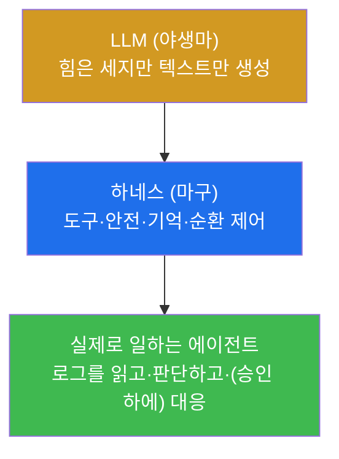
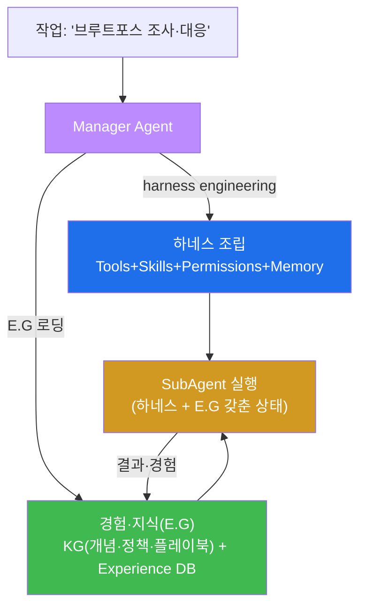
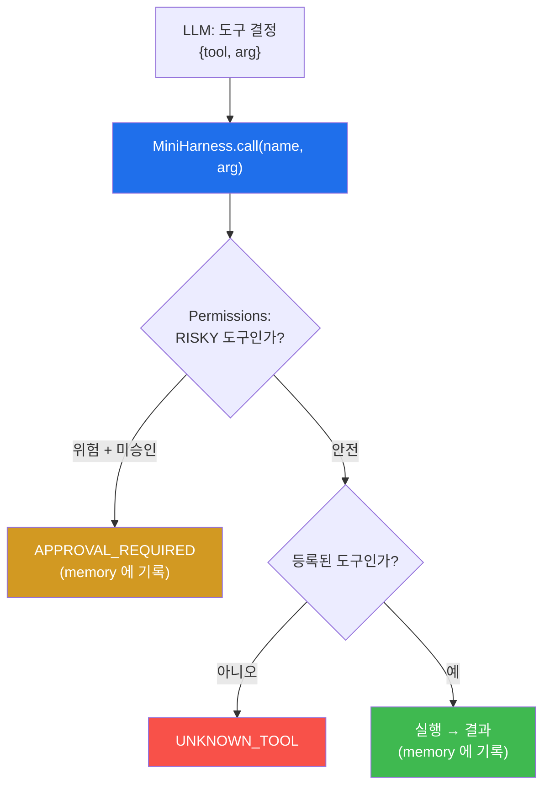
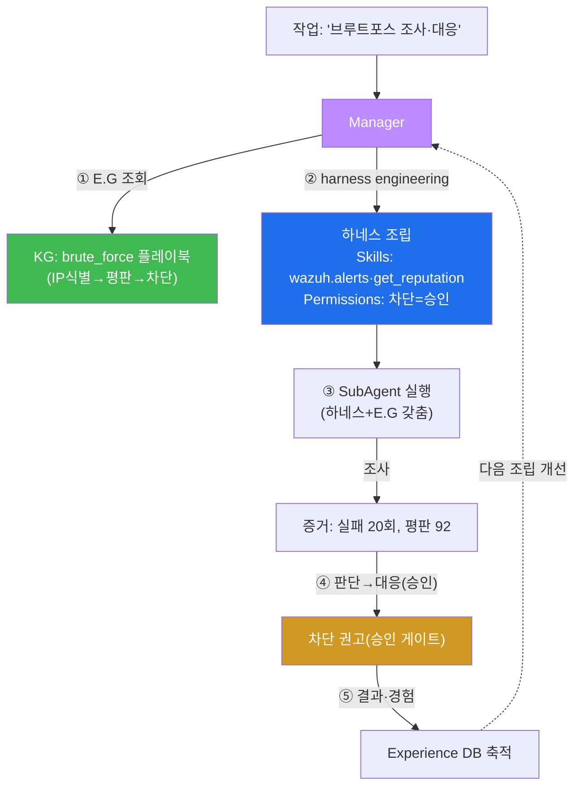
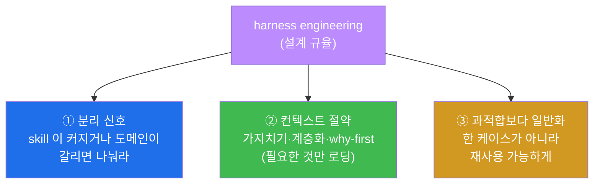
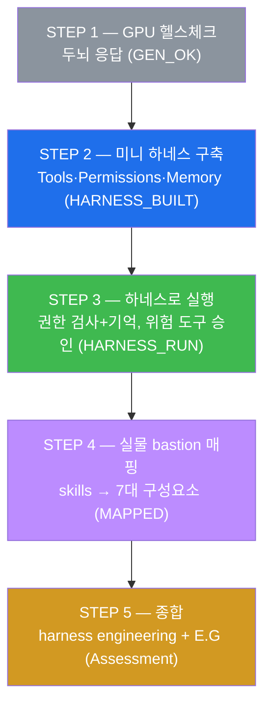
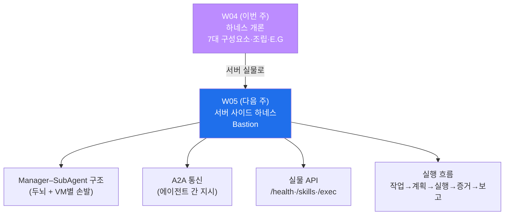

# aisec W04 — 에이전트 하네스 개론: 7대 구성요소·harness engineering·E.G

> **본 주차의 한 줄 요약**
>
> W01~W03 에서 에이전트의 기본기 — 순환·도구 호출·신뢰할 수 있는 프롬프트 — 를 낱개로
> 만들었다. W04 부터는 이 부품들을 하나로 묶는 **하네스(harness)** 를 다룬다. **LLM 자체는
> 텍스트만 생성한다.** "185.x 를 조사해" 라고 하면 방법을 말할 뿐, 실제로 로그를 읽지는
> 못한다. **하네스는 그 LLM 을 실제로 일하게 만드는 "운영 골격"** 이다 — 도구·안전장치·기억·
> 순환 제어를 붙여, 말만 하는 컨설턴트를 손발 달린 일꾼으로 바꾼다(마구(馬具)가 말을 안전하게
> 부리듯). 하네스는 **7대 구성요소**(Tools·Skills·Hooks·Memory·Agents·Tasks·Permissions)로
> 이뤄진다. 그리고 이 과목이 강조하는 구조에서, **Manager Agent 가 harness engineering** —
> 즉 주어진 작업에 맞게 이 구성요소들을 **자동으로 조립** 하고, **E.G(경험·지식)** 를 얹어
> 실제 일을 수행한다. 하네스가 "어떻게 일하나(동작 방식)" 라면, E.G 는 "무엇을 아는가
> (경험·지식)" 다. 하네스는 **서버 사이드(Bastion)** 와 **클라이언트 사이드(Claude Code)**
> 두 형태로 나타난다.
>
> **한 줄 결론**: 하네스 = LLM 을 일하게 만드는 **7대 구성요소의 운영 골격**. Manager 가 이를
> 작업에 맞게 **조립(harness engineering)** 하고 **E.G** 를 얹어 자율 작업을 수행한다.
> **하네스=동작 방식, E.G=경험·지식.**

---

## 이 주차의 시선 — 부품에서 운영 골격으로

W03 까지 우리는 **신뢰할 수 있는 에이전트 부품** 을 만들었다 — 관찰→결정→행동 순환(W01),
도구를 부르는 배선(W02), 항상 같은 형식·판단을 내는 프롬프트(W03). 하지만 부품이 흩어져
있으면 일을 못 한다. 도구를 등록하고, 권한을 걸고, 기억을 유지하고, 순환을 제어하는 **골격**
이 있어야 한다. 그 골격이 하네스다.

> **이 주차의 시선** — 낱개 부품(도구·프롬프트)을 **하나의 운영 골격(하네스)** 으로 묶는다.
> 그리고 그 골격이 실물 el34-bastion 에 어떻게 구현돼 있는지 직접 확인한다.

---

## 학습 목표

본 주차 종료 시 학생은 다음 5가지를 **본인 손으로** 할 수 있어야 한다.

1. **하네스** 의 정의와 필요성(LLM 은 텍스트만 내고, 하네스가 도구·안전·기억을 제공)을
   설명한다.
2. 하네스의 **7대 구성요소**(Tools·Skills·Hooks·Memory·Agents·Tasks·Permissions)를 구분하고
   각 역할을 말한다.
3. **미니 하네스**(Tools·Permissions·Memory)를 만들어, LLM 이 고른 도구를 권한 검사·기억과
   함께 안전하게 실행한다(HARNESS_BUILT·HARNESS_RUN).
4. 실물 **el34-bastion** 의 skills/permissions 를 7대 구성요소에 매핑한다(MAPPED).
5. **Manager 의 harness engineering** 과 **E.G**(경험·지식)의 관계를 설명한다.

---

## 0. 용어 해설 (하네스)

이번 주 처음 나오는 용어를 표로 먼저 정리하고(§0), 헷갈리기 쉬운 것은 일상 비유로 다시
푼다(§0.5).

| 용어 | 영문 | 뜻 | 비유 |
|------|------|----|------|
| **하네스** | Harness | LLM 실행·제어 운영 골격 | 마구(馬具) |
| **harness engineering** | — | 작업에 맞게 하네스를 조립 | 작업 지시서 설계 |
| **E.G** | Experience & Knowledge | 에이전트의 경험·지식 | 매뉴얼 + 경험록 |
| **KG** | Knowledge Graph | 개념·정책·플레이북 같은 정형 지식 | 규정집 |
| **Experience DB** | Experience DB | 과거 대응의 경험 기록 | 사례집 |
| **Manager** | Manager Agent | 계획·조립·E.G 담당 두뇌 | 현장 반장 |
| **SubAgent** | SubAgent | 각 VM 에서 실제 실행하는 손발 | 작업 인부 |
| **Tools** | Tools | 외부 시스템과 상호작용하는 도구 | 연장 |
| **Skills** | Skills | 도구를 묶은 고수준 능력 | 자격증 |
| **Hooks** | Hooks | 이벤트 전후 자동 실행 | 자동 점검 |
| **Memory** | Memory | 컨텍스트·기록 유지 | 업무 일지 |
| **Tasks** | Tasks | 작업 단위 | 작업 순서표 |
| **Permissions** | Permissions | 행동 제한(화이트리스트·승인) | 출입 권한 |
| **Client-side** | Client-side | 단말에서 실행(Claude Code) | 개인 비서 |
| **Server-side** | Server-side | 서버 중앙 운영(Bastion) | 중앙 관제센터 |

> **헷갈리기 쉬운 한 쌍** — *하네스* 는 "**어떻게** 일하나(동작 방식·도구·안전)", *E.G* 는
> "**무엇을** 아는가(경험·지식)" 다. Manager 는 하네스를 조립(engineering)하고 그 위에 E.G 를
> 얹어 SubAgent 를 부린다. 동작(하네스)과 지식(E.G)은 별개의 층이다.

---

## 0.5 핵심 개념 — 일상 비유

### 0.5.1 왜 하네스가 필요한가 — 말과 마구 비유

야생마 한 마리를 상상하자. 힘은 세지만 그대로는 아무 일도 못 시킨다. 방향도, 멈춤도,
안전도 없다. 그런데 **재갈·고삐·안장·편자(마구, harness)** 를 채우면, 그 힘이 **통제 가능한
일** 로 바뀐다 — 수레를 끌고, 방향을 틀고, 필요할 때 멈춘다.

LLM 이 바로 이 야생마다. 힘(방대한 지식·유연한 판단)은 세지만, 그 자체로는 **텍스트만
생성** 한다. "185.x 를 조사해" 라고 하면 조사 **방법을 말로 설명** 할 뿐, 실제로 로그를 읽지
못한다. 하네스가 **도구(로그 읽기)·안전장치(위험 차단)·기억(이전 결과)·순환 제어** 를
채워야 비로소 **실제로 일한다.**



- **하네스 없는 LLM** — 말만 하는 컨설턴트. "이렇게 하세요" 라고 조언할 뿐.
- **하네스를 입은 LLM** — 손발이 있는 일꾼. 실제로 도구를 실행하고, 권한 안에서 움직이며,
  한 일을 기억한다.

### 0.5.2 하네스의 7대 구성요소

하네스는 일곱 부품으로 이뤄진다. 각 부품이 무엇이고, 실물(서버 bastion·클라이언트 Claude
Code)에서 어떻게 나타나는지 한 표로 본다.

| # | 구성요소 | 역할 | el34-bastion(서버) | Claude Code(클라이언트) |
|---|----------|------|--------------------|--------------------------|
| 1 | **Tools** | 외부 시스템과 상호작용 | `/exec`(화이트리스트 명령) | Bash·Read·Write·Grep |
| 2 | **Skills** | 도구를 묶은 고수준 능력 | wazuh.alerts·suricata.tail_eve 등 | MCP 서버 |
| 3 | **Hooks** | 이벤트 전후 자동 실행 | (증거 자동 기록 등) | pre/post 커맨드 훅 |
| 4 | **Memory** | 컨텍스트·기록 유지 | E.G(Experience DB) | CLAUDE.md·.claude/ |
| 5 | **Agents** | 실행 주체 | SubAgent(VM별 원격) | Claude(로컬) |
| 6 | **Tasks** | 작업 단위 | 미션 계획의 단계들 | 대화 턴 |
| 7 | **Permissions** | 행동 제한 | 화이트리스트·승인 게이트 | .claude/settings.json |

이 일곱이 갖춰지면 LLM 이 **안전하게(Permissions)·기억하며(Memory)·권한 내에서** 일한다.
이번 주 실습은 그중 핵심 3개(**Tools·Permissions·Memory**)로 미니 하네스를 만들고, 실물
bastion 에서 나머지까지 확인한다.

> **Skill 은 Tool 과 어떻게 다른가?** **Tool** 은 낱개 기능(예: `read_log`)이고, **Skill**
> 은 여러 도구·절차를 묶어 하나의 능력으로 만든 것이다(예: `wazuh.alerts` = Wazuh 에 질의해
> 경보를 정리해 오는 능력). 도구가 "망치·드라이버" 라면 skill 은 "전기 배선 자격증" 처럼
> 도구를 조합한 상위 능력이다.

> **Hook 이란?** **Hook(훅)** 은 특정 이벤트(도구 실행 직전/직후, 커밋 직전 등)에 **자동으로
> 끼어드는** 코드다. 예: 위험 명령 실행 직전에 확인을 걸거나, 실행 직후 증거를 자동 기록.
> 사람이 매번 챙기지 않아도 안전·기록이 자동으로 이뤄지게 한다.

### 0.5.3 harness engineering — Manager 가 자동 조립

과거에는 사람이 에이전트의 하네스를 매번 손으로 짰다. 이 과목이 강조하는 새 구조에서는
**Manager Agent 가 그 조립을 자동으로** 한다. 이것을 **harness engineering** 이라 부른다.



Manager 는 작업을 받아 **필요한 구성요소(어떤 skill·어떤 권한·어떤 기억)를 자동으로 조립**
(harness engineering)하고, **E.G**(관련 경험·지식)를 얹은 상태로 SubAgent 를 실행한다. 즉
SubAgent 는 **하네스(동작 방식) + E.G(경험·지식)** 를 모두 갖춘 채 일을 시작한다. 그리고
작업 결과는 다시 E.G 에 쌓여 다음 조립을 개선한다(이 순환은 W06 에서 심화).

> **Manager–SubAgent 란?** 뒤에서 자세히 다루지만(W05), 미리 짚어 둔다. **Manager** 는
> 계획·조립을 맡는 **하나의 두뇌**, **SubAgent** 는 각 서버(VM)에서 실제 명령을 실행하는
> **여러 손발** 이다. 현장 반장(Manager)이 인부들(SubAgent)에게 지시하는 구조를 떠올리면
> 된다.

### 0.5.4 E.G — 하네스에 지식을 더하다

하네스가 "동작 골격" 이라면, **E.G(Experience & Knowledge, 경험·지식)** 는 그 위에 얹는
"아는 것" 이다. 아무리 좋은 마구(하네스)를 채운 말이라도, **길을 모르면** 목적지에 못
간다. E.G 가 그 "길에 대한 앎" 이다. E.G 는 두 부분으로 나뉜다.

- **KG(Knowledge Graph, 지식)** — 개념·정책·플레이북·자산 같은 **정형 지식**. "브루트포스는
  이렇게 대응한다", "이 자산은 중요도 상" 같은 규정집이다.
- **Experience DB(경험)** — 과거 대응의 **경험 기록**. "지난번 이 상황에 이렇게 했더니
  통했다/실패했다" 같은 사례집이다.

Manager 는 하네스를 짤 때 이 E.G 를 참조해 더 정확히 조립하고, 대응 결과를 다시 E.G 에
축적한다. **하네스(어떻게)와 E.G(무엇을 아는가)는 별개의 층** 이며, 둘이 함께 있어야
에이전트가 잘 일한다. 이 E.G 는 선행 과목 ai-security(W10·W13)에서 다룬 그 E.G 와 같은
개념이다.

### 0.5.5 Client-side vs Server-side — 개인 비서 vs 관제센터

같은 7대 구성요소라도 **어디서 도느냐** 에 따라 두 형태가 있다.

- **Client-side(Claude Code)** — 사용자 **단말에서 실시간 대화** 로 일하는 하네스. 사람과
  함께 탐색·개발할 때 강하다. **개인 비서** 같다. (W07 에서 다룸)
- **Server-side(Bastion)** — **서버에서 다중 VM 을 중앙 집중** 으로 부리는 하네스. 상시
  자율 운영·감사 추적·대규모 대응에 강하다. **중앙 관제센터** 같다. (W05·W06 에서 다룸)

둘 다 7대 구성요소를 갖지만, 실행 위치·자동화 정도가 다르다. 작업 성격에 맞게 고른다
(§6 에서 자세히).

---

## 1. 하네스란 무엇인가 — LLM 은 텍스트만 낸다

### 1.1 한 줄 답: LLM 에 손발·안전·기억을 붙인 골격

**하네스** 는 LLM 이라는 두뇌에 **손발(도구)·안전(권한·승인)·기억(Memory)·순환 제어** 를
붙여, 실제 작업을 수행하게 만드는 운영 골격이다. LLM 은 텍스트만 낸다는 근본 한계를,
하네스가 바깥에서 감싸 해결한다.

### 1.2 왜 LLM 하나로는 부족한가

LLM 에게 "이 서버의 브루트포스를 조사해" 라고 하면, 훌륭한 조사 **계획을 글로** 써 준다.
하지만 그 글은 로그를 읽지도, IP 평판을 조회하지도, 차단하지도 않는다. 실제로 일하려면 네
가지가 더 필요하다.

- **도구(Tools)** — 로그를 읽고, 평판을 조회하고, 차단하는 실제 기능.
- **안전(Permissions)** — 위험한 행동(차단·삭제)을 함부로 못 하게 막는 통제.
- **기억(Memory)** — 방금 무슨 도구를 어떤 결과로 썼는지 유지(순환을 이어가려면 필수).
- **순환 제어** — 관찰→결정→행동을 몇 번 돌지, 언제 멈출지 관리.

이 넷을 LLM 에 붙인 것이 하네스다. **LLM 은 판단(두뇌), 하네스는 실행·안전·기억(몸)** 이다.

### 1.3 하네스의 안전 원칙 — 여전히 "LLM ≠ 실행 권한"

하네스의 핵심은 W02 에서 배운 원칙의 확장이다. 하네스에서도 **LLM 은 "무엇을 할지" 를
요청하고, 하네스가 그 요청을 Permissions 로 검증한 뒤 실행** 한다. LLM 이 무엇을 하려 하든
하네스의 Permissions 계층이 최종 통제점이다. 즉 하네스는 W01 세 기둥(넓게-좁혀-통제) 중
**통제** 를 구조로 구현한 것이다.

### 1.4 하네스 없이 vs 하네스로 — 같은 작업, 다른 결과

"185.220.101.42 에서 로그인 실패가 몰린다. 조사하고 대응해" 라는 같은 작업을, 하네스 없는
LLM 과 하네스를 입은 에이전트가 어떻게 처리하는지 나란히 보자.

| 단계 | 하네스 없는 LLM | 하네스를 입은 에이전트 |
|------|------------------|--------------------------|
| 조사 | "로그를 확인하고 IP 평판을 조회하세요" (**말만**) | `read_log`·`get_reputation` **도구를 실제 실행** |
| 판단 | "악성으로 보입니다" (근거는 상상) | 실제 조회 결과(실패 20회·평판 92)로 판단 |
| 대응 | "차단하세요" (실행 못 함) | `block_ip` 를 **승인 게이트** 거쳐 실행 |
| 기억 | 없음(다음 턴에 다 잊음) | Memory 에 (도구·결과) 기록 → 감사 추적 |
| 안전 | 없음(통제 계층 자체가 없음) | Permissions 가 위험 행동 통제 |

하네스 없는 LLM 은 **훌륭한 조언** 을 하지만 아무것도 **실행·기억·통제** 하지 못한다.
하네스를 입으면 같은 판단이 **실제 도구 실행 + 기억 + 안전 통제** 로 이어진다. 이 표의
오른쪽 열이 바로 이번 주 미니 하네스(§3)가 만드는 것이다.

---

## 2. 7대 구성요소 상세

§0.5.2 의 표를 각 구성요소별로 조금 더 풀어 본다. 이번 주 미니 하네스가 다루는 3개
(Tools·Permissions·Memory)에 특히 집중한다.

### 2.1 Tools — 외부와 닿는 손발

**정의**: 코드로 실행되는 낱개 기능. **왜 중요한가**: 에이전트가 세상에 영향을 주는 유일한
통로(W02). **el34 에서**: bastion 은 `/exec` 로 화이트리스트 명령을 실행한다. **한계**: 도구가
많거나 인자가 위험하면 통제가 어려워지므로 최소한으로 둔다.

### 2.2 Skills — 도구를 묶은 능력

**정의**: 여러 도구·절차를 묶은 고수준 능력. **왜**: 반복되는 작업 묶음을 재사용 가능한
단위로. **el34 에서**: `wazuh.alerts`(Wazuh 경보 조회)·`suricata.tail_eve`(IDS 로그 조회)·
`apache.error_log`(웹 로그)·`nft.list_ruleset`(방화벽 규칙)·`attacker.nmap`(스캔) 등. **한계**:
skill 이 무엇을 하는지 명확히 문서화·검증돼야 오남용을 막는다.

### 2.3 Permissions — 하네스의 안전선

**정의**: 어떤 행동을 허용/차단할지 정하는 통제 계층. **왜**: LLM 이 오염·실수해도 위험
행동을 막는 최종 방어선. **el34 에서**: 실행 명령 **화이트리스트** + 위험 도구 **승인 게이트**.
**한계**: 화이트리스트가 낡으면(허용 목록이 오래됨) 통제가 헐거워지므로 최신 유지가 관건.
이번 주 미니 하네스에서 `SAFE`/`RISKY` 집합으로 직접 구현한다.

### 2.4 Memory — 기억과 감사

**정의**: 컨텍스트·실행 기록을 유지하는 계층. **왜**: 순환을 이어가려면(이전 결과를 다음
판단에) 필수이고, 무엇을 왜 했는지 **감사 추적** 의 근거가 된다. **el34 에서**: E.G 의
Experience DB. **한계**: 기억이 오염되면(잘못된 경험이 쌓이면) 판단도 나빠지므로 E.G 도
검증한다(W06). 미니 하네스에서 실행 로그 리스트로 구현한다.

### 2.5 나머지 셋 — Hooks·Agents·Tasks

- **Hooks** — 이벤트 전후 자동 실행(위험 명령 전 확인, 실행 후 증거 기록). 안전·기록의 자동화.
- **Agents** — 실제 실행 주체. 서버에선 VM 별 **SubAgent**, 클라이언트에선 로컬 Claude.
- **Tasks** — 작업을 나눈 단위(미션의 각 단계, 대화의 각 턴). 진행 상태를 추적한다.

이 셋은 이번 주 미니 하네스에는 없지만, 실물 bastion(STEP 4)과 W05~W07 에서 실체를 만난다.

---

## 3. 미니 하네스 — Tools·Permissions·Memory 를 손으로

### 3.1 한 줄 정의와 왜 중요한가

**한 줄 정의**: 미니 하네스는 7대 구성요소의 핵심 3개(**Tools·Permissions·Memory**)만으로
만든 최소 운영 골격이다. LLM 이 고른 도구를 **권한 검사** 후 실행하고, 결과를 **기억** 한다.

**왜 중요한가**: 큰 하네스(bastion)도 결국 이 세 부품이 뼈대다. 작게 직접 만들어 보면
"하네스가 LLM 과 실제 실행 사이에서 무엇을 하는가" 가 손에 잡힌다.

### 3.2 el34 에서 어떻게 — MiniHarness 의 세 부품

STEP 2 는 `MiniHarness` 클래스를 만든다. 세 부품이 명확히 나뉜다.

- **Tools** — `read_log`·`get_reputation`·`block_ip` 세 도구를 등록.
- **Permissions** — `SAFE={read_log, get_reputation}`(안전) 와 `RISKY={block_ip}`(위험)로
  구분. 위험 도구는 `approved=True` 없이는 실행하지 않고 `APPROVAL_REQUIRED` 반환.
- **Memory** — `self.memory` 리스트에 (도구, 인자, 결과)를 기록.



`call()` 하나에 하네스의 본질이 담겼다 — **권한 검사(Permissions) → 실행(Tools) → 기록
(Memory)**. 마커 `HARNESS_BUILT` 는 이 세 부품(도구 3개·위험 집합·기억)이 갖춰졌다는 뜻이다.

### 3.3 하네스로 에이전트를 안전하게 실행 (STEP 3)

STEP 3 은 이 하네스에 **LLM 을 연결** 한다. 흐름은 이렇다.

1. **LLM 이 도구 결정** — "185.220.101.42 평판 확인" 요청에 LLM 이 `{"tool":"get_reputation",
   "arg":"185..."}` 를 낸다(W02·W03 의 Tool Calling).
2. **하네스가 권한 검사 후 실행** — `call()` 이 안전 도구임을 확인하고 실행, 결과를 기억.
3. **위험 도구 시도 확인** — `block_ip` 를 승인 없이 부르면 `APPROVAL_REQUIRED` 로 막힌다.

마커 `HARNESS_RUN` 은 "LLM 이 고른 안전 도구는 실행됐고(결과 있음), 위험 도구는 승인 없이
막혔다(APPROVAL_REQUIRED)" 는 두 조건이 모두 성립할 때 나온다. **LLM 의 판단 + 하네스의
통제** 가 함께 작동함을 코드로 확인하는 것이다.

### 3.4 한계

미니 하네스는 개념 이해용이다. 실물은 (a) 도구가 원격 VM 에서 돌고, (b) 인자 검증·감사
로깅이 훨씬 정교하고, (c) Skills·Hooks·Tasks 까지 갖춘다. 하지만 **"권한 검사 → 실행 →
기록"** 이라는 뼈대는 실물도 똑같다. 작게 만들어 본 이 뼈대가 bastion 을 이해하는 열쇠다.

---

## 4. harness engineering 과 E.G — 조립하고 지식을 얹는다

### 4.1 harness engineering — 작업에 맞게 자동 조립

**한 줄 정의**: harness engineering 은 **Manager 가 주어진 작업에 맞게 하네스 구성요소(어떤
도구·skill·권한·기억)를 자동으로 조립** 하는 것이다.

**왜 중요한가**: 작업마다 필요한 하네스가 다르다. "브루트포스 조사" 엔 로그·평판 도구와 조회
권한이, "웹 공격 대응" 엔 WAF 로그 skill 과 차단 권한이 필요하다. 사람이 매번 짜 주는 대신
Manager 가 작업을 보고 알맞게 조립하면, 확장성과 일관성이 크게 오른다.

### 4.2 E.G 가 조립을 돕는다

Manager 는 백지에서 조립하지 않는다. **E.G** 를 참조한다.

- **KG(지식)** — "이런 사건엔 이런 skill·절차" 라는 플레이북을 참조해 뼈대를 잡는다.
- **Experience DB(경험)** — "지난번 이 조합이 통했다/실패했다" 는 경험으로 선택을 다듬는다.

그리고 대응 결과를 다시 E.G 에 쌓아, **다음 조립이 점점 좋아진다.** 이 자기 개선 순환의
심장이 E.G 이며, W06 에서 playbook(지식)과 RL 보상(경험)으로 E.G 를 채우는 법을 배운다.

### 4.3 하네스와 E.G 를 혼동하지 말 것

시험에 자주 나오는 구분: **하네스는 "어떻게 일하나"(도구·안전·순환의 동작 방식), E.G 는
"무엇을 아는가"(경험·지식)** 다. 좋은 마구(하네스)를 채워도 길(E.G)을 모르면 못 가고, 길을
알아도 마구(하네스)가 없으면 못 움직인다. 둘은 별개의 층이고, **Manager 가 둘을 함께 갖춰
SubAgent 를 보낸다.**

### 4.4 한 바퀴 따라가기 — 브루트포스 작업이 처리되는 과정

harness engineering 과 E.G 가 실제로 어떻게 맞물리는지, 브루트포스 대응 작업을 한 바퀴
따라가 본다(이 흐름의 실물 구현은 W05·W13 에서 만든다 — 여기서는 개념을 잇는다).



1. **E.G 조회** — Manager 가 KG 에서 `brute_force` 플레이북(IP 식별→평판 조회→차단)을 꺼낸다.
   백지에서 고민하지 않고 검증된 뼈대를 쓴다.
2. **harness engineering** — 그 플레이북에 맞는 skill(wazuh.alerts·get_reputation)과 권한
   (차단은 승인)을 조립한다.
3. **SubAgent 실행** — 하네스 + E.G 를 갖춘 SubAgent 가 조사를 수행한다.
4. **판단→대응** — 증거(실패 20회·평판 92)로 판단하고, 위험 대응(차단)은 승인 게이트를 거친다.
5. **경험 축적** — 결과가 Experience DB 에 쌓여, 다음 유사 작업의 조립이 좋아진다.

이 한 바퀴가 **하네스(어떻게)** 와 **E.G(무엇을 아는가)** 가 함께 작동하는 전형이다. 사람은
"브루트포스 조사·대응" 한 마디만 했을 뿐, 조립·실행·안전·학습이 자동으로 돌았다.

### 4.5 harness engineering 은 "설계 규율" 이다 — 두 얼굴

지금까지 harness engineering 을 "**Manager 가 작업에 맞게 구성요소를 자동 조립**" 하는
것으로 설명했다. 이는 **실행 시점(run-time)** 의 조립이다. 그런데 harness engineering 에는
또 하나의 얼굴이 있다 — **설계 시점(design-time)** 에 "**좋은 조립 재료(잘 만든 skill·지식·
권한)를 만드는 설계 규율**" 이다. 좋은 재료가 있어야 좋은 조립이 나온다.

> **참고 문헌.** 이 설계 규율의 관점은 『**Harness Engineering with Claude Code**』(한빛미디어)
> 를 따른다. 이 책은 하네스를 "즉흥적 프롬프트가 아니라, **에이전트가 그 안에서 동작하는
> 재사용 가능·조합 가능한 구성요소로 이뤄진 지속적 작업 환경**" 으로 정의하고, 그것을 잘
> 설계하는 규율을 harness engineering 이라 부른다. 실행 런타임은 **Claude Code** 다(이
> 클라이언트 사이드 관점은 W07 에서 깊이 다룬다).

이 관점에서 하네스를 이루는 재료는 다음과 같다(우리 과목의 7대 구성요소와 대응).

| 책의 구성요소 | 뜻 | 우리 과목의 대응 |
|----------------|----|------------------|
| **Agents** | 역할이 정해진 전문 일꾼(예: security-analyst) | Agents(SubAgent) |
| **Skills**(SKILL.md) | 여러 에이전트를 순차·병렬로 조율하는 오케스트레이션 템플릿 | Skills |
| **References** | skill 이 조건부로 참조하는 도메인 지식 | Memory / E.G(KG) |
| **Frontmatter** | 도구 경계·권한을 강제하는 설정 메타데이터 | Permissions |
| **Tools** | 에이전트가 쓸 수 있는 능력(Write/Edit 포함·제외) | Tools |

그리고 이 책은 **좋은 하네스를 설계하는 세 원칙** 을 제시한다. 이는 우리가 앞으로 skill·
지식을 만들 때(특히 W06 playbook·W07 Claude Code)에도 그대로 적용된다.



- **① 분리 신호(separation signals)** — 하나의 skill 이 너무 커지거나, 서로 다른 도메인을
  다루거나, 조건부 상세가 많아지면 그것은 "나눠라" 는 신호다. 큰 skill 하나보다 잘 나뉜
  작은 skill 여럿이 낫다.
- **② 컨텍스트 절약(context savings)** — 에이전트에게 **필요한 것만** 준다. 불필요한 내용은
  **가지치기(pruning)** 하고, 지식은 **계층화(layering)** 해 필요할 때만 참조하며, 규칙은
  **왜(why)를 먼저** 밝혀 남용을 막는다.
- **③ 과적합보다 일반화(generalization over overfitting)** — 특정 한 사례에만 맞춘 skill 은
  다음 사례에서 못 쓴다. **여러 경우에 재사용 가능** 하도록 일반화해 설계한다.

반대로 **안티 패턴(피해야 할 것)** 도 분명하다 — **비대한 skill**(한 skill 이 너무 많은 일),
**빠진 참조**(필요한 References 없음), **근거 없는 규칙**(왜인지 모를 제약). 이 셋이 보이면
하네스 설계가 나빠지고 있다는 경고다.

> **두 얼굴을 잇는다.** 이 과목에서 **Manager 의 자동 조립(run-time)** 이 잘 되려면, 애초에
> **잘 설계된 재료(design-time: 잘 나뉜 skill·정확한 References·명확한 권한)** 가 있어야 한다.
> harness engineering 은 그 둘 — 좋은 재료를 만드는 설계 규율 + 작업에 맞게 조립하는 실행 —
> 을 아우른다. W06 에서 playbook 을 만들 때, W07 에서 Claude Code 의 skill·CLAUDE.md 를 다룰
> 때, 이 세 원칙을 실제로 적용한다.

---

## 5. 실물 하네스 — el34-bastion 매핑

### 5.1 개념을 실물로 — bastion 은 서버 사이드 하네스의 구현

지금까지의 하네스는 개념과 미니 구현이었다. STEP 4 는 그 개념이 **실물 el34-bastion 에
어떻게 구현돼 있는지** 직접 조회한다. bastion 은 이 과목의 **서버 사이드 하네스 실물** 이다.

**el34 에서 어떻게**: 호스트에서 `docker exec` 로 bastion 컨테이너에 들어가, 인증 헤더를
달아 `/skills` API 를 조회한다.

```bash
echo 1 | sudo -S docker exec el34-bastion sh -c \
  'curl -s -H "X-API-Key: ccc-api-key-2026" http://localhost:9100/skills'
```

- **`el34-bastion`** — 서버 사이드 하네스가 도는 컨테이너. API 포트 **9100**.
- **`X-API-Key: ccc-api-key-2026`** — bastion API 의 인증 키. 아무나 하네스를 조작하지
  못하게 하는 접근 통제다(Permissions 의 일부).
- **`/skills`** — 이 하네스가 가진 skill 목록을 돌려주는 엔드포인트.

> **명령 앞의 `echo 1 | sudo -S` 는?** el34 호스트에서 `docker` 실행에 sudo 권한이 필요할
> 때, 비밀번호(`1`)를 표준 입력으로 넣어 주는 관용구다. `sudo -S` 는 "비밀번호를 stdin 에서
> 읽어라" 는 옵션이다. 실습 환경 전용이며, 실제 운영에서는 이렇게 비밀번호를 파이프로 넣지
> 않는다.

### 5.2 7대 구성요소로 매핑

조회한 skill 목록을 7대 구성요소에 매핑하면 이렇게 된다(STEP 4 가 출력).

| 구성요소 | 실물 el34-bastion |
|----------|-------------------|
| **Skills** | `nft.list_ruleset`·`suricata.tail_eve`·`apache.error_log`·`wazuh.alerts`·`attacker.nmap` |
| **Tools** | `/exec`(화이트리스트 명령 실행) |
| **Permissions** | 화이트리스트 + 승인 게이트 + API Key |
| **Agents** | SubAgent(secu·web·siem·attacker — VM별) |
| **Memory** | E.G(Experience DB) |

마커 `MAPPED` 는 실물 skill 이 3개 이상 조회돼 매핑이 성립했다는 뜻이다. **하네스는 추상
개념이 아니라 실물에 구현돼 있다** — bastion 의 skills(Skills)·`/exec`(Tools)·화이트리스트
(Permissions)·SubAgent(Agents)·E.G(Memory)가 바로 그 7대 구성요소다.

> **정직한 한계 — bastion 은 경량 실행기.** el34-bastion 은 skills·화이트리스트·`/exec` 는
> 실물이지만, **Manager 의 LLM 계획 두뇌** 는 이 컨테이너에 탑재돼 있지 않다(경량 실행기).
> 그래서 이 과목의 실습은 **Manager 의 계획·조립은 GPU 로 시연** 하고, **SubAgent 실행·
> 화이트리스트는 실물 bastion** 으로 한다. 개념(Manager+E.G)과 실물(실행 계층)을 정확히
> 구분해 배운다 — 이 점은 W05 에서 자세히 다룬다.

### 5.3 언제 Client, 언제 Server — 작업 성격으로

같은 7대 구성요소가 클라이언트(Claude Code)와 서버(Bastion)로 나타난다. 언제 무엇을 쓰나?

| 상황 | 적합 하네스 | 이유 |
|------|-------------|------|
| 코드 탐색·개발·즉흥 조사 | 클라이언트(Claude Code) | 실시간 대화·유연 |
| 다중 서버 상시 감시·자동 대응 | 서버(Bastion) | 자동화·감사·중앙 통제 |
| 1회성 심층 분석(사람과 협업) | 클라이언트 | 대화형 탐색 |
| 반복 정형 대응(스케줄·플레이북) | 서버 | playbook·RL·상시성 |

둘은 배타적이지 않다. 사람이 Claude Code(클라이언트)로 탐색하다, 정형화되면 Bastion(서버)
playbook 으로 옮기는 식으로 **함께** 쓴다. 형태는 달라도 **Permissions 가 핵심 안전선** 이라는
원칙은 양쪽에 똑같이 적용된다(W02 "LLM ≠ 실행 권한").

---

## 6. 실습으로 가기 전 — 큰 그림 한 장



개념(하네스·7대 구성요소)을 **작게 직접 만들고**(STEP 2·3), 그것이 **실물에 구현된 것**
(STEP 4)을 확인한 뒤, harness engineering·E.G 로 **종합**(STEP 5)한다.

---

## 7. 실습 안내 (총 5 미션)

각 실습은 **4축 설명** — (a) 왜 하는가 (b) 무엇을 알 수 있는가 (c) 결과 해석 (d) 실전 활용.
명령은 el34 **호스트**(`ssh ccc@{{TARGET_IP}}`, 비밀번호 `1`)에서 실행하며, 두뇌는 GPU
`http://211.170.162.139:10934`(gemma3:4b), 실물 하네스는 `el34-bastion:9100`(헤더
`X-API-Key: ccc-api-key-2026`)를 조회한다.

### 실습 1 — GPU 헬스체크 (→ GEN_OK)

> **왜 하는가?** 매주 0번째 단계 — 두뇌(GPU/모델)가 응답하는지 확인한다.
>
> **무엇을 알 수 있는가?** gemma3:4b 가 텍스트를 생성하는지(이전 주와 동일).
>
> **결과 해석.** `GEN_OK` 면 정상, `GEN_EMPTY`/오류면 서버·네트워크 문제부터 해결.
>
> **실전 활용.** 모든 통합의 첫 점검. 연결 확인 없이 로직부터 짜지 않는다.

### 실습 2 — 미니 하네스 구축 (→ HARNESS_BUILT)

> **왜 하는가?** 하네스가 "무엇으로 이뤄지는가" 를 직접 만들어 체감한다. 큰 bastion 도 결국
> 이 뼈대(Tools·Permissions·Memory)임을 손으로 확인한다.
>
> **무엇을 알 수 있는가?** `MiniHarness` 클래스로 도구 등록(Tools)·안전/위험 구분
> (Permissions)·실행 기록(Memory)을 만든다. 위험 도구(block_ip)는 승인 없이는 실행 안 되게
> 설계한다.
>
> **결과 해석.** 마지막 줄 `HARNESS_BUILT` 는 세 부품(도구 3개·RISKY 집합·memory)이 갖춰졌다는
> 뜻이다. `INCOMPLETE` 면 부품이 빠진 것 — 어느 부품이 없는지 확인한다.
>
> **실전 활용.** 어떤 에이전트 프레임워크를 쓰든, "도구·권한·기억" 세 축을 갖췄는지가 신뢰의
> 최소 조건이다. 이 뼈대가 있는지 점검하는 눈을 기른다.

### 실습 3 — 하네스로 에이전트 실행 (→ HARNESS_RUN)

> **왜 하는가?** 하네스가 **LLM 과 실제 실행 사이에서** 무슨 일을 하는지 확인한다. 권한 검사·
> 기억이 붙은 안전한 실행을 체감한다.
>
> **무엇을 알 수 있는가?** LLM 이 도구를 결정(get_reputation)하면 하네스가 권한 검사 후
> 실행하고 기억에 남긴다. 위험 도구(block_ip)를 승인 없이 부르면 하네스가 막는다
> (APPROVAL_REQUIRED).
>
> **결과 해석.** 마지막 줄 `HARNESS_RUN` 은 "안전 도구는 실행됐고 위험 도구는 승인 없이
> 막혔다" 는 두 조건이 모두 성립할 때 나온다. `FAIL` 이면 실행이나 승인 게이트 중 하나가
> 안 된 것이다.
>
> **실전 활용.** LLM 의 판단과 하네스의 통제가 함께 작동하는 것이 실전 에이전트의 표준
> 구조다. "판단은 LLM, 통제는 하네스" 를 코드로 확인한다.

### 실습 4 — 실물 bastion 7대 구성요소 매핑 (→ MAPPED)

> **왜 하는가?** 하네스가 추상 개념이 아니라 **실물에 구현돼 있음** 을 확인한다. 개념과 실물을
> 잇는다.
>
> **무엇을 알 수 있는가?** 실물 el34-bastion 의 `/skills` 를 조회해, 그 skills·`/exec`·
> 화이트리스트·SubAgent·E.G 가 7대 구성요소에 대응함을 매핑한다.
>
> **결과 해석.** 마지막 줄 `MAPPED` 는 실물 skill 이 조회돼 매핑이 성립했다는 뜻이다.
> `NO_SKILLS` 면 조회 실패(인증 키·네트워크·bastion 상태를 확인). 조회된 skill 이름
> (wazuh.alerts 등)이 곧 이 하네스의 능력이다.
>
> **실전 활용.** 실무에서 새 에이전트 플랫폼을 만나면, "7대 구성요소가 어떻게 구현됐나" 를
> 이렇게 매핑해 이해한다. 특히 Permissions(화이트리스트·승인)가 통제점이다.

### 실습 5 — 종합 (harness engineering + E.G, → Assessment)

> **왜 하는가?** 배운 것(7대 구성요소·조립·E.G)을 하나로 묶는다.
>
> **무엇을 알 수 있는가?** GPU 에게 W04 성과(HARNESS_BUILT·HARNESS_RUN·MAPPED)를 근거로
> 정리 노트를 쓰게 한다. 노트는 7대 구성요소, Manager 의 harness engineering(자동 조립),
> E.G(경험·지식)를 담는다.
>
> **결과 해석.** 출력에 `Assessment` 가 있으면 형식을 지킨 것이다. "하네스=동작, E.G=지식"
> 구분이 제대로 담겼는지 스스로 확인한다.
>
> **실전 활용.** 이 개념 틀(7대 구성요소·조립·E.G)이 W05~W07 의 서버·클라이언트 하네스를
> 이해하는 지도다. 본인 말로 정리해 두면 다음 주가 쉬워진다.

---

## 8. 흔한 오해·블루팀 노트

- **"LLM 만 좋으면 된다"** — LLM 은 텍스트만 낸다. 하네스(도구·안전·기억·순환)가 있어야
  실제로 일한다. 모델 성능만큼 하네스 설계가 중요하다.
- **"하네스 = 도구 모음"** — 도구는 7개 중 하나일 뿐. 권한·기억·훅·에이전트·작업까지가
  하네스다. 특히 Permissions 가 안전의 핵심이다.
- **"harness engineering 은 사람이 매번"** — 이 과목의 구조에선 **Manager 가 자동 조립** 한다.
  사람은 설계·감독에 집중한다.
- **"하네스와 E.G 는 같은 것"** — 하네스는 동작 방식, E.G 는 경험·지식. 별개의 층이다.
- **"bastion 은 만능 AI"** — el34-bastion 은 **경량 실행기**(Manager LLM 미탑재)다. 계획은
  GPU 로 시연, 실행·화이트리스트는 실물로 — 개념과 실물을 구분한다.
- **관제 관점** — 에이전트가 어떤 하네스(도구·권한·기억)로 도는지, **Permissions**(화이트
  리스트·승인)가 걸려 있는지, E.G 에 오염이 없는지 점검한다. 하네스의 Permissions 가 곧
  통제점이다.

---

## 9. 다음 주차 (W05) 예고 — 서버 사이드 하네스 (1) Bastion

W04 가 "하네스란 무엇인가(7대 구성요소·조립·E.G)" 였다면, W05 는 서버 사이드 하네스의 실물
**Bastion** 을 직접 다룬다. 이번 주 STEP 4 에서 skills 목록만 조회했다면, W05 는 그 하네스의
**Manager–SubAgent 구조와 실행 흐름** 전체를 조작한다.



구체적으로 W05 에서는 (a) **Manager Agent(두뇌) + 여러 SubAgent(VM별 손발)** 구조와 그
사이의 **A2A(Agent-to-Agent) 통신**, (b) 실물 bastion API(`/health`·`/skills`·`/exec`)로
하네스를 조작하는 법, (c) Manager 의 **skill 선택**(harness engineering 재현), (d) SubAgent
실행이 **화이트리스트(Permissions)** 안에서만 됨을 확인하고, (e) **작업→계획→실행→증거→보고**
라는 서버 하네스의 전체 실행 흐름을 배운다. 이번 주 만든 미니 하네스의 뼈대가, 다중 VM 을
부리는 실물 서버 하네스로 확장된다.
