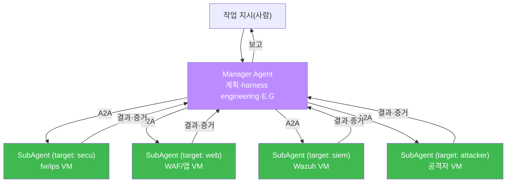
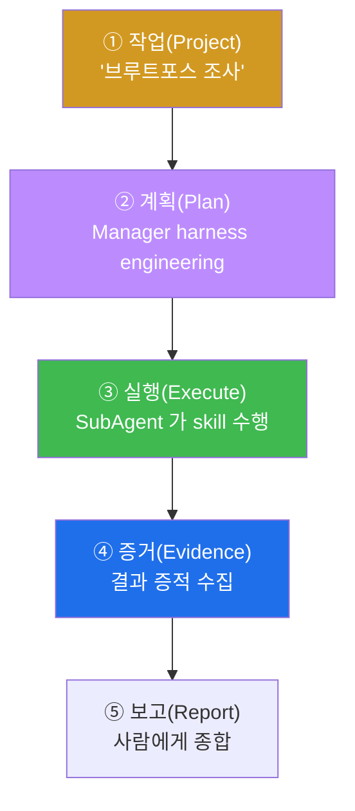
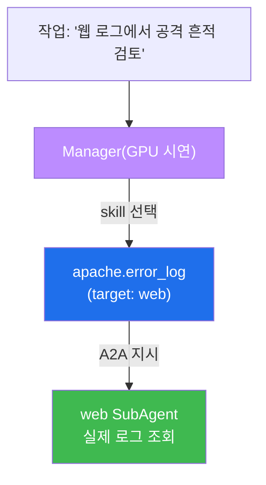
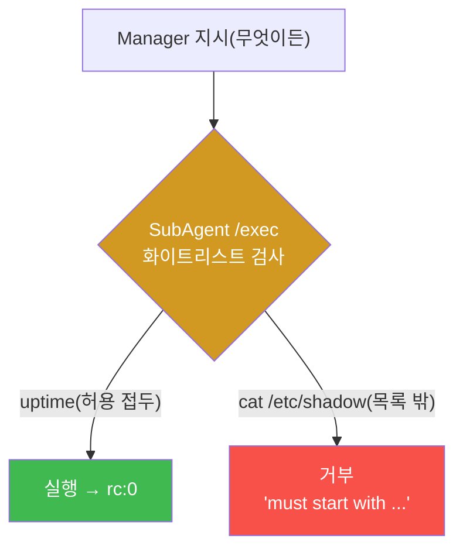
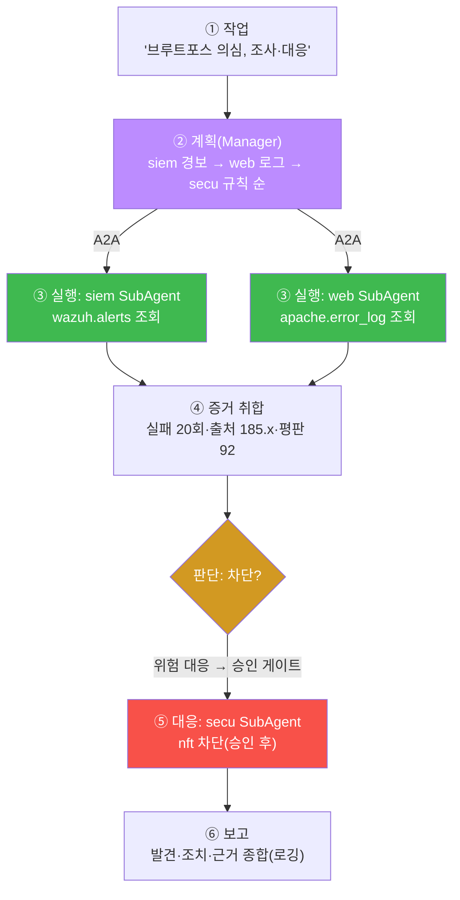
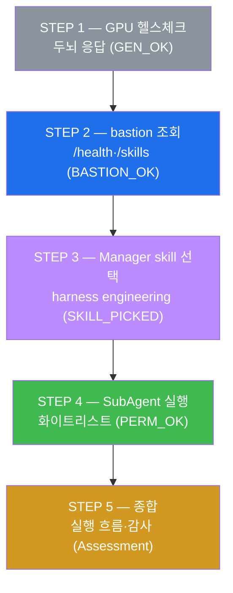
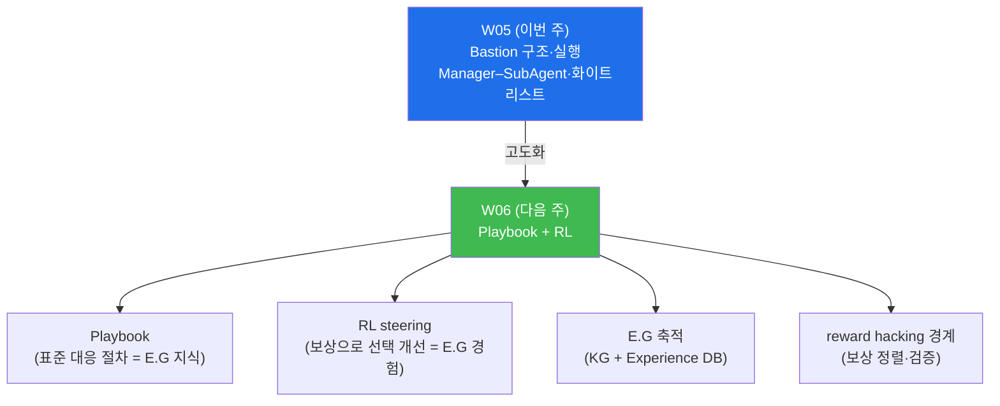

# aisec W05 — 서버 사이드 하네스 (1) Bastion: Manager–SubAgent·A2A·실행 흐름

> **본 주차의 한 줄 요약**
>
> W04 에서 하네스 개념(7대 구성요소·조립·E.G)을 잡고, 그 실물 el34-bastion 의 skill 목록만
> 살짝 봤다. W05 는 그 **서버 사이드 하네스 실물 — Bastion** 을 본격적으로 조작한다. Bastion
> 은 **서버 한 곳에서 다중 VM 을 중앙 집중으로 부리는** 하네스다. 구조는 **Manager Agent
> (두뇌) + 여러 SubAgent(각 VM 의 손발)** 다. Manager 는 작업을 받아 **harness engineering**
> (어떤 skill·권한으로 할지 조립)하고 **E.G** 를 얹어, 각 VM 의 SubAgent 에게 **A2A(Agent-to-
> Agent) 통신** 으로 지시한다. SubAgent 는 자기 VM 에서 실제 명령을 **화이트리스트
> (Permissions) 안에서만** 실행하고 결과를 Manager 에게 돌려준다. 전체는 **작업→계획→실행→
> 증거→보고** 의 흐름으로 돌며, 모든 단계가 로깅돼 **감사 추적** 이 된다. 이번 주는 실물
> bastion API(`/health`·`/skills`·`/exec`)로 이 하네스를 직접 조작하고, Manager 의 skill
> 선택·SubAgent 실행·안전 통제를 손으로 확인한다.
>
> **한 줄 결론**: Bastion = **Manager(계획·harness·E.G) + SubAgent(VM별 실행) + A2A(통신) +
> 화이트리스트(안전)** 로 이뤄진 서버 사이드 하네스다. 다중 VM 을 자동화·감사 추적하며
> 안전하게 부린다. 그리고 그 안전선은 여전히 **화이트리스트**(서버판 "LLM ≠ 실행 권한")다.

---

## 이 주차의 시선 — 개념에서 실물 서버로

W04 STEP 2·3 에서 만든 미니 하네스는 파이썬 클래스 하나였다 — 도구·권한·기억이 한 프로세스
안에 있었다. 하지만 실전 보안은 **여러 서버(VM)** 에 걸쳐 있다. 방화벽·IDS 는 secu VM 에,
웹·WAF 는 web VM 에, SIEM 은 siem VM 에 있다. 한 프로세스가 이들을 다 만질 수 없다. 그래서
서버 사이드 하네스는 **두뇌 하나(Manager) + VM 마다의 손발(SubAgent)** 로 나뉜다.

> **이 주차의 시선** — 하네스를 한 프로세스에서 **다중 VM 으로 확장** 한 실물(Bastion)을
> 직접 조작한다. 미니 하네스의 "권한 검사 → 실행 → 기록" 뼈대가 서버에서 어떻게 커지는지
> 본다.

---

## 학습 목표

본 주차 종료 시 학생은 다음 5가지를 **본인 손으로** 할 수 있어야 한다.

1. Bastion 의 **Manager–SubAgent** 구조와 **A2A** 통신을 설명한다.
2. 실물 bastion API(`/health`·`/skills`)로 서버 하네스의 상태·능력을 조회한다(BASTION_OK).
3. Manager 의 **skill 선택**(harness engineering)을 GPU 로 재현한다(SKILL_PICKED).
4. SubAgent 실행이 **화이트리스트(Permissions)** 안에서만 됨을 확인한다(PERM_OK).
5. 서버 하네스의 **작업→계획→실행→증거→보고** 흐름과 감사 추적의 의미를 설명한다.

---

## 0. 용어 해설 (Bastion)

이번 주 처음 나오는 용어를 표로 먼저 정리하고(§0), 헷갈리기 쉬운 것은 일상 비유로 다시
푼다(§0.5).

| 용어 | 영문 | 뜻 | 비유 |
|------|------|----|------|
| **Bastion** | Bastion | 다중 VM 을 중앙에서 부리는 서버 하네스 | 중앙 관제센터 |
| **Manager** | Manager Agent | 계획·조립·E.G 담당 두뇌(하나) | 현장 반장 |
| **SubAgent** | SubAgent | 각 VM 에서 실행하는 손발(여럿) | 작업 인부 |
| **target** | Target | SubAgent 가 담당하는 VM 이름 | 인부의 담당 구역 |
| **A2A** | Agent-to-Agent | 에이전트 간 통신 | 무전 지시 |
| **`/health`** | — | 하네스 상태를 알려주는 API | 근무 점검 |
| **`/skills`** | — | 하네스가 가진 능력 목록 API | 능력 대장 |
| **`/exec`** | — | SubAgent 에 명령을 실행시키는 API | 작업 지시서 |
| **화이트리스트** | Whitelist | 허용 명령만 실행 | 반입 허가 목록 |
| **감사 추적** | Audit Trail | 무엇을 왜 했는지 사후 검증 기록 | 작업 일지·CCTV |
| **경량 실행기** | — | LLM 두뇌 없이 실행 계층만 있는 상태 | 두뇌 없는 팔다리 |
| **PoW / 증거** | Proof of Work | 실행 결과의 증적 | 작업 사진 |

> **헷갈리기 쉬운 한 쌍** — *Manager* 는 "**무엇을 어떻게**(계획·조립)", *SubAgent* 는 "**실제
> 실행**(VM 에서)" 이다. Manager 는 하나, SubAgent 는 VM 마다 있고, 둘은 A2A 로 통신한다.

---

## 0.5 핵심 개념 — 일상 비유

### 0.5.1 Manager–SubAgent — 반장과 인부 비유

큰 공사 현장을 떠올려 보자. **반장(Manager)** 한 명이 전체 작업을 계획하고, 각 구역의
**인부(SubAgent)** 들에게 "너는 저 벽을, 너는 이 배관을" 하고 지시한다. 인부는 자기 구역에서
실제 작업을 하고 결과를 반장에게 보고한다. 발주자(사람)는 반장에게 한 번 지시할 뿐이다.

Bastion 이 정확히 이 구조다.



- **Manager** 는 하나 — 계획과 조립을 맡는 두뇌.
- **SubAgent** 는 VM 마다 하나 — 실제 명령을 실행하는 손발. 각 SubAgent 는 담당 VM(**target**)
  이 있다: `secu`(방화벽·IDS), `web`(WAF·앱), `siem`(Wazuh), `attacker`(공격자).
- Manager 가 "siem 에서 Wazuh 경보 확인" 을 지시하면, siem-SubAgent 가 자기 VM 에서 실행하고
  결과를 돌려준다. 사람은 Manager 에게 한 번 지시할 뿐이다.

### 0.5.2 A2A — 무전 지시 비유

반장과 인부는 **무전기(A2A)** 로 소통한다. 반장이 "3구역, 배관 상태 확인" 을 무전으로 보내면,
3구역 인부가 확인하고 "이상 없음" 을 회신한다. 이 무전 통신이 에이전트 세계의 **A2A(Agent-
to-Agent)** 다.

**A2A** 는 Manager 가 "이 skill 을 이 인자로 실행해 줘" 를 SubAgent 에게 보내고, SubAgent 가
실행 결과·증거를 회신하는 통신이다. 중요한 점은 이 무전에도 **인증(API Key)과 권한(화이트
리스트)** 이 걸린다는 것이다 — 아무나 무전으로 인부를 부리지 못한다. 다중 에이전트 하네스의
배선이 A2A 다.

### 0.5.3 실행 흐름 — 작업→계획→실행→증거→보고 비유

공사는 아무렇게나 진행되지 않는다. **발주(작업) → 반장의 시공 계획 → 인부 시공 → 작업 사진
(증거) → 발주자 보고** 순서를 따른다. 각 단계가 문서로 남아, 나중에 "왜 이렇게 했나" 를
검증할 수 있다.

서버 하네스도 같은 5단계로 돈다.



각 단계가 **로깅** 되므로 **감사 추적(audit trail)** 이 된다. 무엇을·왜·어떻게 했는지 사후에
검증할 수 있다는 것이 서버 사이드 하네스의 강점이다 — 자율적으로 일하되, 모든 행동이 기록에
남아 사람이 검증할 수 있다.

### 0.5.4 화이트리스트 — 서버 하네스의 안전선 비유

건설 현장에는 **반입 허가 목록** 이 있다. 목록에 있는 자재·장비만 들어올 수 있고, 위험물은
반입이 거부된다. 반장이 실수로 위험물 반입을 지시해도, 게이트의 검문이 막는다.

서버 하네스의 **화이트리스트(Permissions)** 가 이 반입 허가다. SubAgent 가 실행하는 명령은
**허용된 것만** 통과한다. Manager LLM 이 오염돼 위험 명령(`cat /etc/shadow`, `rm -rf /`)을
지시해도, SubAgent 의 실행 계층이 막는다. 이것이 W02·W04 에서 배운 **"LLM ≠ 실행 권한"** 의
**서버판** 이다 — 두뇌(Manager)가 무엇을 지시하든, 손발(SubAgent)의 화이트리스트가 최종
방어선이다.

### 0.5.5 bastion 의 현실 — 경량 실행기 (정직하게)

여기서 중요한 사실을 **정직하게** 짚는다. el34-bastion 은 **경량 실행기** 다 —
`llm_configured: false`. 즉 skills·화이트리스트·`/exec` 는 **실물** 이지만, Manager 의 **LLM
계획 두뇌** 는 이 컨테이너에 탑재돼 있지 않다.

그래서 이번 주 실습은 두 부분으로 나뉜다.

- **Manager 의 계획(skill 선택)** — GPU(gemma3:4b)로 **시연** 한다(STEP 3). "Manager 라면 이
  작업에 어떤 skill 을 고를까" 를 GPU 가 대신 판단한다.
- **SubAgent 실행·화이트리스트** — **실물 bastion** 으로 한다(STEP 2·4). 진짜 API 를 호출해
  실제 실행·차단을 본다.

**개념(Manager + E.G)과 실물(실행 계층)을 정확히 구분** 해 배우는 것이 이번 주의 정직한
설계다. "bastion 이 만능 AI" 라는 오해를 미리 깬다 — bastion 은 튼튼한 **팔다리(실행 계층)**
이고, 두뇌(Manager LLM)는 별도다.

---

## 1. 서버 사이드 하네스란 — 다중 VM 을 중앙에서

### 1.1 한 줄 답: 두뇌 하나로 여러 서버를 부린다

**서버 사이드 하네스** 는 서버 한 곳(Bastion)에 두뇌(Manager)를 두고, 각 VM 의 손발
(SubAgent)을 **중앙에서 자동으로** 부리는 운영 골격이다. 클라이언트 하네스(Claude Code,
W07)가 사람과 단말에서 대화하며 일한다면, 서버 하네스는 사람 없이도 **상시·자동·다중 VM**
으로 일한다.

### 1.2 왜 서버 하네스가 필요한가

보안 인프라는 여러 서버에 흩어져 있다. 하나의 사건(예: 브루트포스)을 조사하려면 방화벽 로그
(secu)·웹 로그(web)·SIEM 경보(siem)를 **동시에** 봐야 한다. 이를 사람이 매번 각 서버에
접속해 확인하면 느리고 실수가 많다. 서버 하네스는 이를 **중앙에서 자동화** 한다.

- **중앙 집중** — Manager 하나가 모든 VM 을 조율한다. 사람은 Manager 에게만 지시한다.
- **자동화** — 반복 대응을 사람 개입 없이 수행한다(스케줄·플레이북, W06).
- **감사 추적** — 모든 행동이 로깅돼 사후 검증이 된다.

이 세 가지 강점이 "상시 자율 운영·대규모 대응" 에 서버 하네스가 맞는 이유다.

### 1.3 서버 하네스의 안전 원칙 — 여전히 화이트리스트

강력할수록 위험도 크다. 다중 VM 을 자동으로 부린다는 것은, 잘못되면 여러 서버를 한꺼번에
망가뜨릴 수 있다는 뜻이다. 그래서 서버 하네스의 안전은 **화이트리스트(Permissions)** 에
달렸다 — SubAgent 는 **허용된 명령만** 실행한다. Manager 가 무엇을 지시하든 이 계층이
최종 통제점이다. "중앙 자동화는 위험하다" 가 아니라, **화이트리스트와 감사 로그가 오히려
사람이 일일이 하는 것보다 안전** 할 수 있다 — 단, Permissions 설계가 관건이다.

---

## 2. Manager–SubAgent 구조와 A2A

### 2.1 Manager — 계획하는 하나의 두뇌

**정의**: Manager 는 작업을 받아 **계획(어떤 순서로)·조립(harness engineering, 어떤 skill·
권한)·E.G 로딩(관련 지식·경험)** 을 담당하는 하나의 두뇌다.

**왜 중요한가**: 다중 VM 작업을 사람이 매번 쪼개 지시하는 대신, Manager 가 작업을 이해해
알맞은 SubAgent 에게 알맞은 skill 을 배정한다. 이것이 harness engineering 의 서버판이다.

**한계(정직)**: el34-bastion 은 이 Manager LLM 을 탑재하지 않은 경량 실행기다. 그래서 이
과목은 Manager 판단을 GPU 로 시연한다(§0.5.5).

### 2.2 SubAgent — VM 마다의 손발

**정의**: SubAgent 는 각 VM(**target**)에서 실제 명령을 실행하는 손발이다. 담당 target 은
`secu`·`web`·`siem`·`attacker` 로 나뉜다.

**왜 중요한가**: 각 VM 의 접근·실행을 SubAgent 가 담당하므로, Manager 는 VM 내부를 몰라도
"web SubAgent 야, 웹 로그 봐 줘" 라고 지시만 하면 된다. 관심사가 깔끔히 분리된다.

**el34 에서**: skill 마다 `target` 필드가 있어, 어떤 SubAgent(VM)가 그 skill 을 수행하는지
정해진다. 예: `apache.error_log` 의 target 은 `web`, `wazuh.alerts` 의 target 은 `siem`.

### 2.3 A2A — 에이전트 간 통신

**정의**: A2A(Agent-to-Agent)는 Manager 와 SubAgent 사이의 통신이다. Manager 가 "이 skill 을
이 인자로 실행해 줘" 를 보내면 SubAgent 가 실행하고 결과·증거를 회신한다.

**왜 중요한가**: 여러 에이전트가 협력하려면 표준화된 통신 규약이 필요하다. 그리고 이 통신에
**인증(API Key)·권한(화이트리스트)** 이 걸려야 안전하다 — 아무 에이전트나 SubAgent 를
부리지 못하게.

**한계**: 통신이 늘수록 인증·권한 관리가 복잡해진다. 그래서 A2A 에도 최소 권한·감사 로깅을
적용한다.

### 2.4 미니 하네스(W04) vs 서버 하네스(Bastion) — 무엇이 커졌나

W04 에서 만든 미니 하네스와 이번 주 실물 bastion 을 나란히 보면, "무엇이 확장됐는지" 가
분명해진다. 뼈대는 같고, 규모와 분산이 달라졌다.

| 항목 | 미니 하네스(W04) | 서버 하네스(Bastion, W05) |
|------|------------------|---------------------------|
| 실행 위치 | 한 프로세스(파이썬 클래스) | 다중 VM(SubAgent마다 원격) |
| 두뇌 | 없음(코드가 직접) | Manager(계획·조립) |
| 손발 | 함수 호출 | SubAgent(secu·web·siem·attacker) |
| 통신 | 함수 인자 | A2A(인증·권한 걸린 통신) |
| 안전선 | RISKY 집합 + 승인 | 화이트리스트 + 승인 + API Key |
| 기억 | memory 리스트 | E.G(Experience DB) |
| 감사 | (없음) | 전 단계 로깅 → 감사 추적 |

핵심은 **뼈대가 똑같다** 는 점이다 — "권한 검사 → 실행 → 기록" 이라는 W04 미니 하네스의
심장이, 서버에서는 다중 VM·A2A·감사 로그로 **규모만 커진** 것이다. 그래서 작게 만들어 본
경험이 큰 실물을 이해하는 열쇠가 된다.

---

## 3. 실물 bastion API — 하네스의 외부 표면

이 과목의 원칙(el34 의 **외부 표면만 의존**)에 따라, bastion 을 컨테이너 내부 구조가 아니라
**공개 API 표면**(`/health`·`/skills`·`/exec`)으로 다룬다. 이 셋이 서버 하네스를 조작하는
창구다.

### 3.1 접근 방법 — docker exec + API Key

bastion API 는 인증 헤더 `X-API-Key: ccc-api-key-2026` 를 요구한다. el34 호스트에서 다음처럼
접근한다.

```bash
echo 1 | sudo -S docker exec el34-bastion sh -c \
  'curl -s -H "X-API-Key: ccc-api-key-2026" http://localhost:9100/health'
```

- **`X-API-Key: ccc-api-key-2026`** — bastion API 인증 키. 이 키가 없으면 하네스를 조작할
  수 없다(Permissions 의 접근 통제).
- **포트 9100** — bastion API 포트.

### 3.2 세 엔드포인트의 역할

| 엔드포인트 | 하는 일 | 이번 주 STEP |
|------------|---------|--------------|
| **`/health`** | 하네스 상태(status·service·llm_configured) 조회 | STEP 2 |
| **`/skills`** | SubAgent skill 목록(id·target) 조회 | STEP 2 |
| **`/exec`** | SubAgent 에 명령 실행(target·command) 요청 | STEP 4 |

### 3.3 el34 에서 어떻게 — 상태와 능력 조회 (STEP 2)

STEP 2 는 `/health` 와 `/skills` 를 한 번에 조회한다.

- **`/health` 응답** — `service: el34-bastion`, `status: ok`, `llm_configured: False`.
  마지막 값이 "경량 실행기"(Manager LLM 미탑재)임을 확인해 준다.
- **`/skills` 응답** — SubAgent 가 가진 능력들. 각 skill 은 `id` 와 담당 `target`(VM)을 갖는다.

el34-bastion 의 skill 5종(이번 주 확인 대상):

| skill.id | target(VM) | 하는 일 |
|----------|-----------|---------|
| `nft.list_ruleset` | secu | 방화벽(nftables) 규칙 조회 |
| `suricata.tail_eve` | secu | IDS(Suricata) 로그 조회 |
| `apache.error_log` | web | 웹 서버 오류 로그 조회 |
| `wazuh.alerts` | siem | SIEM(Wazuh) 경보 조회 |
| `attacker.nmap` | attacker | 공격자 VM 에서 스캔 |

마커 `BASTION_OK` 는 "상태가 ok 이고 skill 이 5종 이상 조회됨" 을 뜻한다. **skill 의 target
이 곧 그 skill 을 수행하는 SubAgent(VM)** 임을 눈으로 확인한다.

---

## 4. Manager 의 skill 선택 — harness engineering 재현

### 4.1 한 줄 정의와 왜 중요한가

**한 줄 정의**: Manager 의 skill 선택은 **주어진 작업에 맞는 SubAgent skill 을 고르는** 것으로,
harness engineering(작업에 맞게 하네스를 조립)의 핵심이다.

**왜 중요한가**: 작업마다 필요한 skill 이 다르다. "웹 로그 분석" 엔 `apache.error_log`(web)가,
"방화벽 규칙 확인" 엔 `nft.list_ruleset`(secu)이 맞다. Manager 가 이를 자동으로 고르면 사람이
매번 지정하지 않아도 된다.

### 4.2 el34 에서 어떻게 — GPU 로 Manager 시연 (STEP 3)

bastion 은 경량 실행기라 Manager LLM 이 없으므로(§0.5.5), GPU(gemma3:4b)가 Manager 역할을
맡는다. skill 목록을 주고, 작업에 맞는 skill 을 고르게 한다.

```
system: You are a Bastion Manager. Skills:
        nft.list_ruleset(secu), suricata.tail_eve(secu), apache.error_log(web),
        wazuh.alerts(siem), attacker.nmap(attacker).
        For the task, reply ONLY: SKILL: <skill.id>
user:   Task: review web server error logs for attack traces.
```

작업이 "웹 서버 오류 로그 검토" 이므로 Manager 는 `apache.error_log`(target: web)를 고른다.
마커 `SKILL_PICKED` 는 응답에 `apache` 가 포함됨(올바른 skill 선택)을 뜻한다. **작업 →
skill → SubAgent(web) 로 이어지는 자동 조립** 이 harness engineering 이다.



### 4.3 한계

소형 모델은 skill 이 많거나 작업이 애매하면 엉뚱한 skill 을 고를 수 있다. 그래서 실무에서는
(a) skill 설명을 명확히 하고, (b) Manager 의 선택을 **결정론 규칙으로 검증**(예: "웹 관련
작업 → web target skill 이 맞나")하고, (c) 위험 skill 선택엔 승인을 둔다. Manager 판단도 LLM
이므로 "넓게 훑고 좁혀 확정" 원칙이 적용된다.

---

## 5. SubAgent 화이트리스트 실행 — 서버판 "LLM ≠ 실행 권한"

### 5.1 한 줄 정의와 왜 중요한가

**한 줄 정의**: SubAgent 의 `/exec` 는 **화이트리스트에 있는 안전 명령만 실행** 하고, 위험
명령은 거부한다. Manager 가 무엇을 지시하든 이 계층이 최종 안전선이다.

**왜 중요한가**: Manager LLM 은 오염·실수할 수 있다(인젝션·환각). 그 지시를 그대로 실행하면
여러 서버가 위험해진다. 화이트리스트가 있으면 Manager 가 무엇을 지시하든 위험 명령은
실행되지 않는다 — 서버 사이드의 최종 방어선이다.

### 5.2 el34 에서 어떻게 — 안전 실행과 위험 차단 (STEP 4)

STEP 4 는 `/exec` 에 두 명령을 보내 화이트리스트를 시험한다.

```
POST /exec  {"target":"web", "command":"uptime"}          → 실행됨 (rc:0)
POST /exec  {"target":"web", "command":"cat /etc/shadow"}  → 차단 ("must start with ...")
```

- **`uptime`**(안전) — 화이트리스트에 있어 실행되고 `rc:0`(정상 종료) 을 반환한다.
- **`cat /etc/shadow`**(위험) — 시스템 암호 파일을 읽으려는 명령. 화이트리스트에 없어
  거부되고 `must start with ...`(허용된 접두로 시작해야 함) 오류가 난다.

마커 `PERM_OK` 는 "안전 명령은 실행됐고 위험 명령은 차단됐다" 는 두 조건이 모두 성립할 때
나온다.



> **화이트리스트가 '접두로 시작' 을 요구하는 이유.** 오류 메시지 `must start with` 가 알려
> 주듯, bastion 은 명령이 **허용된 접두로 시작** 해야만 실행한다. 이는 "허용된 것 외에는
> 전부 거부" 하는 allowlist 원칙(W03 §4.4)의 구현이다. 위험 명령을 하나하나 금지(blocklist)
> 하는 대신, **허용 명령만 통과** 시키므로 예상 못 한 위험 명령(cat/rm/…)도 자동으로 막힌다.

### 5.3 왜 이것이 안전의 핵심인가

STEP 4 의 교훈은 명확하다 — **Manager(LLM)가 무엇을 지시하든, SubAgent 의 화이트리스트가
최종 방어선** 이다. Manager 가 인젝션에 오염돼 `cat /etc/shadow` 를 지시해도, 실행 계층이
막는다. 이것이 이 과목의 등뼈인 "LLM ≠ 실행 권한" 의 서버판이다. 두뇌의 오염이 손발의
재앙으로 번지지 않게 하는 구조적 안전장치다.

### 5.4 실무 확장 — 안전은 화이트리스트 하나가 아니다

이번 주 실습은 화이트리스트 한 겹을 확인했지만, 실전 서버 하네스는 안전을 **여러 겹** 으로
쌓는다. 화이트리스트는 그 첫 겹일 뿐이다.

| 겹 | 무엇을 막나 | 예 |
|----|-------------|----|
| **명령 화이트리스트** | 허용 명령 외 전부 거부 | `must start with` |
| **인자 검증** | 허용 명령이라도 위험 인자 차단 | 경로·IP 형식 검사 |
| **위험 등급 승인** | 되돌리기 어려운 행동은 사람 승인 | 차단·삭제 = 승인 게이트 |
| **속도 제한** | 폭주·오작동을 제한 | 분당 실행 횟수 상한 |
| **감사 로깅** | 사후 검증·책임 추적 | 전 단계 기록 |

- **명령 화이트리스트** 는 "무엇을 실행할 수 있나" 를 제한한다(STEP 4 가 이것).
- **인자 검증** 은 허용된 명령이라도 위험한 값(디렉터리 탈출 경로 등)을 막는다. 예컨대
  로그 조회 skill 이라도 `../../etc/shadow` 같은 인자는 걸러야 한다(W09 에서 심화).
- **위험 등급 승인** 은 조회는 자율, 차단·삭제는 승인으로 나눈다(W02·W04 의 승인 게이트).
- **속도 제한(rate limit)** 은 에이전트가 오작동해 명령을 폭주시켜도 피해를 제한한다.
- **감사 로깅** 은 사후에 "무엇이 왜 일어났나" 를 재구성하는 마지막 안전망이다.

핵심 원칙은 W03 에서 배운 **방어 심층화** 와 같다 — 한 겹이 뚫려도 다음 겹이 막는다. 서버
하네스가 자율적으로 다중 VM 을 부릴수록, 이 여러 겹의 통제가 더 중요해진다. W09(에이전트
보안 위협)에서 각 겹을 공격자 관점으로 다시 본다.

---

## 6. 실행 흐름과 감사 추적

### 6.1 작업→계획→실행→증거→보고

서버 하네스의 한 사이클은 다섯 단계로 돈다(§0.5.3). 이 순서가 중요한 이유는 **각 단계가
남기는 산출물** 에 있다.

- **① 작업(Project)** — 사람이 준 목표("브루트포스 조사·대응").
- **② 계획(Plan)** — Manager 가 harness engineering 으로 세운 실행 계획(어떤 skill·순서).
- **③ 실행(Execute)** — SubAgent 가 각 VM 에서 skill 수행.
- **④ 증거(Evidence, PoW)** — 실행 결과의 증적(로그·경보·명령 출력). 판단의 근거가 된다.
- **⑤ 보고(Report)** — 사람에게 종합 보고. 무엇을 발견했고 무엇을 권고하는지.

### 6.2 감사 추적 — 자율성과 통제의 균형

각 단계가 **로깅** 되면 **감사 추적(audit trail)** 이 성립한다. "언제·누가(어느 SubAgent)·왜
(어떤 계획으로)·무엇을(어떤 명령) 했고 결과가 무엇이었나" 를 사후에 재구성할 수 있다.

이것이 서버 하네스가 **자율적이면서도 통제 가능한** 이유다. 에이전트가 스스로 일하되, 모든
행동이 기록에 남아 사람이 검증·감사한다. 자율성(효율)과 통제(안전)를 동시에 얻는 것 —
그리고 그 통제의 두 축이 **화이트리스트(사전 통제)** 와 **감사 로그(사후 검증)** 다.

### 6.3 한 바퀴 따라가기 — 브루트포스 대응이 서버 하네스로

다섯 단계가 실제로 어떻게 도는지, 여러 SubAgent 가 얽히는 브루트포스 대응을 한 바퀴 따라가
본다(이번 주 실습은 이 흐름의 조각들 — skill 선택·SubAgent 실행 — 을 손으로 만진다).



1. **작업** — 사람이 "브루트포스 의심, 조사·대응" 을 Manager 에게 준다.
2. **계획** — Manager 가 harness engineering 으로 "siem 경보 확인 → web 로그 대조 → secu
   규칙 조치" 순서를 세운다(E.G 의 brute_force 플레이북 참조 — W06).
3. **실행** — siem SubAgent(`wazuh.alerts`)와 web SubAgent(`apache.error_log`)가 **각 VM 에서
   병렬로** 증거를 모은다. A2A 로 지시·회신한다.
4. **증거** — 취합된 증거(실패 20회·출처 185.x·평판 92)가 판단의 근거가 된다.
5. **대응** — 차단은 위험 대응이라 **승인 게이트** 를 거쳐, 승인되면 secu SubAgent 가
   화이트리스트 안에서 방화벽 규칙을 조정한다.
6. **보고** — 발견·조치·근거를 종합해 사람에게 보고하고, 모든 단계가 로깅돼 감사 추적이 된다.

한 작업이 **여러 SubAgent(siem·web·secu)에 걸쳐** 자동으로 처리되지만, 위험 대응은 승인을,
모든 실행은 화이트리스트와 로깅을 거친다. **자율 + 통제** 가 함께 도는 것이 서버 하네스의
핵심이며, 이 전체 파이프라인을 W13(프로젝트 A: 자율 IR 에이전트)에서 실제로 조립한다.

---

## 7. 실습으로 가기 전 — 큰 그림 한 장



하네스 상태·능력 확인(STEP 2) → Manager 조립 재현(STEP 3) → SubAgent 안전 실행(STEP 4) →
실행 흐름 종합(STEP 5). 서버 하네스의 두뇌(계획)·손발(실행)·안전선(화이트리스트)을 차례로
만진다.

---

## 8. 실습 안내 (총 5 미션)

각 실습은 **4축 설명** — (a) 왜 하는가 (b) 무엇을 알 수 있는가 (c) 결과 해석 (d) 실전 활용.
명령은 el34 **호스트**(`ssh ccc@{{TARGET_IP}}`, 비밀번호 `1`)에서 실행하며, 두뇌는 GPU
`http://211.170.162.139:10934`(gemma3:4b), 실물 하네스는 `el34-bastion:9100`(헤더
`X-API-Key: ccc-api-key-2026`)를 조작한다.

### 실습 1 — GPU 헬스체크 (→ GEN_OK)

> **왜 하는가?** 매주 0번째 단계 — Manager 시연에 쓸 두뇌(GPU)가 응답하는지 확인한다.
>
> **무엇을 알 수 있는가?** gemma3:4b 가 텍스트를 생성하는지(이전 주와 동일).
>
> **결과 해석.** `GEN_OK` 면 정상, `GEN_EMPTY`/오류면 서버·네트워크부터 해결한다.
>
> **실전 활용.** 통합의 첫 점검. 두뇌·실물 인프라를 함께 쓰는 주일수록 각 구성요소의 상태를
> 먼저 확인한다.

### 실습 2 — bastion 하네스 조회 (→ BASTION_OK)

> **왜 하는가?** 서버 사이드 하네스의 **실물 표면** 을 직접 조회한다. 개념(Manager–SubAgent)이
> 실물 API 로 어떻게 드러나는지 확인한다.
>
> **무엇을 알 수 있는가?** `/health` 로 상태(status·`llm_configured:False`=경량 실행기)를,
> `/skills` 로 SubAgent 능력 5종과 각 담당 VM(target)을 조회한다.
>
> **결과 해석.** 마지막 줄 `BASTION_OK` 는 상태 ok + skill 5종 이상을 뜻한다. `NO` 면 상태
> 이상이거나 skill 조회 실패(인증 키·bastion 상태 확인). skill 의 target 이 곧 SubAgent(VM)다.
>
> **실전 활용.** 새 서버 하네스를 만나면 먼저 상태·능력 API 로 "무엇을 할 수 있는 하네스인가"
> 를 파악한다. `/health`·`/skills` 조회는 그 첫 단계다.

### 실습 3 — Manager skill 선택 (→ SKILL_PICKED)

> **왜 하는가?** harness engineering 의 핵심 — 작업에 맞는 skill 선택 — 을 재현한다. Manager 가
> 어떻게 작업을 SubAgent 능력에 매핑하는지 본다.
>
> **무엇을 알 수 있는가?** GPU 를 Manager 로 세워, "웹 로그 검토" 작업에 알맞은 skill
> (`apache.error_log`, target: web)을 고르는지 확인한다.
>
> **결과 해석.** 마지막 줄 `SKILL_PICKED` 는 Manager 가 올바른 skill(apache…)을 골랐다는
> 뜻이다. `OTHER:...` 면 엉뚱한 skill 을 고른 것 — Manager 판단도 검증이 필요함을 보여 준다.
>
> **실전 활용.** 실무의 서버 하네스는 작업 → skill 매핑을 Manager 가 자동으로 한다. 그 매핑을
> 결정론으로 검증하는 눈(웹 작업엔 web target 이 맞나)을 기른다.

### 실습 4 — SubAgent 화이트리스트 실행 (→ PERM_OK)

> **왜 하는가?** 서버 하네스의 **최종 안전선(화이트리스트)** 을 실물로 확인한다. Manager 가
> 무엇을 지시하든 위험 명령이 막힘을 본다.
>
> **무엇을 알 수 있는가?** `/exec` 에 안전 명령(`uptime`)과 위험 명령(`cat /etc/shadow`)을
> 보내, 전자는 실행되고(rc:0) 후자는 차단됨(`must start with`)을 확인한다.
>
> **결과 해석.** 마지막 줄 `PERM_OK` 는 "안전 실행 + 위험 차단" 두 조건이 성립함을 뜻한다.
> `CHECK` 면 둘 중 하나가 어긋난 것이다. 화이트리스트가 "허용 접두로 시작" 을 요구하는 것이
> allowlist 원칙의 구현이다.
>
> **실전 활용.** 자동화된 서버 하네스의 안전은 화이트리스트에 달렸다. "Manager 가 오염돼도
> 실행 계층이 막는다" 는 구조를 실물로 확인하는 것이 이 실습의 핵심이다.

### 실습 5 — 종합 (실행 흐름, → Assessment)

> **왜 하는가?** 배운 것(Manager–SubAgent·A2A·화이트리스트·실행 흐름)을 하나로 묶는다.
>
> **무엇을 알 수 있는가?** GPU 에게 W05 성과(BASTION_OK·SKILL_PICKED·PERM_OK)를 근거로 정리
> 노트를 쓰게 한다. 노트는 Manager–SubAgent 구조·A2A·작업→계획→실행→증거→보고 흐름·화이트
> 리스트 안전선을 담는다.
>
> **결과 해석.** 출력에 `Assessment` 가 있으면 형식을 지킨 것이다. 실행 흐름과 안전선이
> 제대로 담겼는지 스스로 확인한다.
>
> **실전 활용.** 이 구조(중앙 두뇌 + VM별 손발 + 화이트리스트 + 감사)가 실무 서버 자동화의
> 표준이다. W06 에서 여기에 playbook·RL 을 얹어 고도화한다.

---

## 9. 흔한 오해·블루팀 노트

- **"bastion 은 만능 AI 다"** — el34-bastion 은 **경량 실행기**(`llm_configured:false`)다.
  Manager LLM 계획은 별도(GPU 시연), 실행·화이트리스트는 실물. 개념과 실물을 구분한다.
- **"SubAgent 는 뭐든 실행한다"** — **화이트리스트 안** 에서만. 위험 명령은 코드가 차단한다
  (`must start with`).
- **"서버 하네스는 복잡해서 위험하다"** — 감사 추적·중앙 통제가 오히려 안전할 수 있다. 단
  **Permissions(화이트리스트) 설계** 가 관건이다.
- **"A2A 통신은 그냥 메시지"** — 인증(API Key)·권한(화이트리스트)이 걸려야 한다. 아무나
  SubAgent 를 부리면 안 된다.
- **관제 관점** — Manager–SubAgent 흐름이 **로깅** 되는지, SubAgent **화이트리스트가 최신**
  인지, A2A 통신에 인증이 걸려 있는지, 위험 skill 에 승인이 있는지 점검한다. 서버 하네스의
  통제점은 **Permissions(화이트리스트)와 감사 로그** 다.

---

## 10. 다음 주차 (W06) 예고 — 서버 사이드 하네스 (2) Playbook + RL

W05 가 "Bastion 의 구조·실행(Manager–SubAgent·화이트리스트)" 이었다면, W06 은 그 서버 하네스를
**점점 더 잘 일하게** 만드는 두 축을 얹는다. 이번 주 Manager 는 매번 백지에서 skill 을
골랐지만, W06 부터는 **검증된 절차(Playbook)를 뼈대로** 삼고 **경험(RL)으로 선택을 개선** 한다.



구체적으로 W06 에서는 (a) 반복 대응을 **Playbook**(표준 절차)으로 굳혀 E.G 의 **지식(KG)** 에
넣고, (b) 대응 결과를 **보상(RL)** 으로 매겨 E.G 의 **경험(Experience DB)** 에 쌓아, (c)
Manager 의 harness engineering 이 매 대응마다 좋아지게 하며, (d) 보상이 목적과 어긋나면
편법을 배우는 **reward hacking** 을 어떻게 경계하는지 배운다. 이번 주 만든 서버 하네스가
**스스로 나아지는** 하네스로 진화한다.
