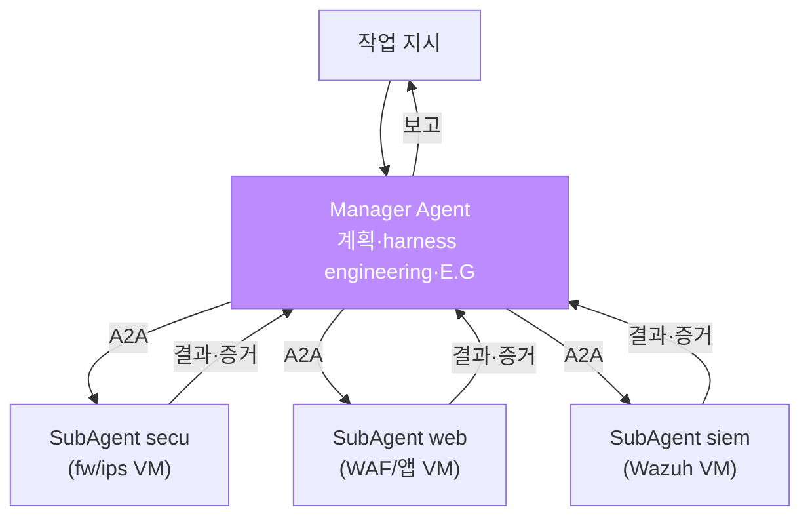
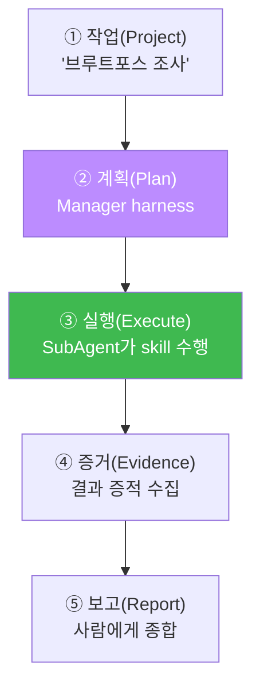

# aisec W05 — 서버 사이드 하네스 (1) Bastion: Manager–SubAgent·A2A·실행 흐름

> **본 주차의 한 줄 요약**
>
> W04에서 하네스 개념을 잡았으니, W05는 그 **서버 사이드 실물 — Bastion**을 직접 다룬다. Bastion은 서버에서
> 다중 VM을 중앙 집중으로 부리는 하네스다. 구조는 **Manager Agent(두뇌) + 여러 SubAgent(각 VM의 손발)**.
> Manager는 작업을 받아 **harness engineering**(어떤 skill·권한으로 할지 조립)하고 **E.G**를 얹어, 각 VM의
> SubAgent에게 **A2A(Agent-to-Agent) 통신**으로 지시한다. SubAgent는 자기 VM에서 실제 명령을 **화이트리스트
> (Permissions) 안에서** 실행하고 결과를 Manager에게 돌려준다. 전체 흐름은 **작업→계획→실행→증거→보고**다.
> 이번 주는 실물 el34-bastion API(`/health`·`/skills`·`/exec`)로 이 서버 사이드 하네스를 조작하고, Manager의
> skill 선택·SubAgent 실행·안전 통제를 손으로 확인한다.
>
> **한 줄 결론**: Bastion = **Manager(계획·harness·E.G) + SubAgent(VM별 실행) + A2A(통신) + 화이트리스트(안전)**
> 로 이뤄진 서버 사이드 하네스. 다중 VM을 자동화·감사 추적하며 안전하게 부린다.

---

## 학습 목표

본 주차 종료 시 학생은 다음 5가지를 **본인 손으로** 할 수 있어야 한다.

1. Bastion의 **Manager–SubAgent** 구조와 A2A 통신을 설명한다.
2. 실물 bastion API(`/health`·`/skills`·`/exec`)로 하네스를 조작한다(BASTION_OK).
3. Manager의 **skill 선택**(harness engineering)을 재현한다(SKILL_PICKED).
4. SubAgent 실행이 **화이트리스트(Permissions)** 안에서만 됨을 확인한다(PERM_OK).
5. **작업→계획→실행→증거→보고** 흐름을 설명한다.

> **이 주차의 시선** — 하네스를 서버에서 다중 VM으로 확장한 실물을 조작한다.

---

## 0. 용어 해설 (Bastion)

| 용어 | 영문 | 뜻 | 비유 |
|------|------|----|------|
| **Manager** | Manager Agent | 계획·harness·E.G 담당 두뇌 | 현장 반장 |
| **SubAgent** | SubAgent | 각 VM에서 실행하는 손발 | 작업 인부 |
| **A2A** | Agent-to-Agent | 에이전트 간 통신 | 무전 지시 |
| **execute-plan** | — | 계획을 단계로 실행 | 작업 순서표 |
| **증거** | Evidence/PoW | 실행 결과의 증적 | 작업 사진 |
| **화이트리스트** | Whitelist | 허용 명령만 실행 | 반입 허가 |

> **헷갈리기 쉬운 한 쌍** — *Manager* 는 "무엇을 어떻게(계획·조립)", *SubAgent* 는 "실제 실행(VM에서)". Manager는
> 여러 SubAgent를 A2A로 지휘한다.

---

## 0.5 신입생 친화 핵심 개념

### 0.5.1 Manager–SubAgent — 반장과 인부

Manager는 하나, SubAgent는 VM마다 있다. Manager가 "siem에서 Wazuh 알림 확인"을 A2A로 siem-SubAgent에게
지시하면, 그 SubAgent가 자기 VM에서 실행하고 결과를 돌려준다. 사람은 Manager에게 한 번 지시할 뿐이다.

### 0.5.2 실행 흐름 — 작업→계획→실행→증거→보고

각 단계가 로깅되므로 **감사 추적**이 된다. 무엇을 왜 했는지 사후에 검증할 수 있다 — 서버 사이드 하네스의 강점.

### 0.5.3 화이트리스트(Permissions) — 서버 하네스의 안전선

SubAgent가 실행하는 명령은 **화이트리스트** 안에서만 허용된다(el34-bastion: ping·uptime·hostname·curl http…).
위험 명령(`rm -rf /`)은 코드가 차단한다. Manager LLM이 오염돼 위험 지시를 내려도, SubAgent의 실행 계층이
막는다 — 이것이 W02·W04의 "LLM≠실행 권한"의 서버판이다.

### 0.5.4 el34-bastion의 현실 — 경량 실행기

정직히: el34-bastion은 **경량 실행기**(`llm_configured:false`)다. 즉 skills·화이트리스트·/exec는 실물이지만,
Manager의 LLM 계획은 이 컨테이너에 탑재돼 있지 않다. 그래서 실습에서 **Manager의 계획(skill 선택)은 GPU로
시연**하고, **SubAgent 실행·화이트리스트는 실물 bastion**으로 한다. 개념(Manager+E.G)과 실물(실행 계층)을
정확히 구분해 배운다.

### 0.5.5 A2A — 에이전트 간 통신

Manager와 SubAgent는 **A2A(Agent-to-Agent)** 로 통신한다: Manager가 "이 skill을 이 인자로 실행해줘"를 보내면,
SubAgent가 실행하고 결과·증거를 회신한다. 이 통신에도 인증(API Key)·권한(화이트리스트)이 걸려, 아무나 SubAgent를
부리지 못한다. 다중 에이전트 하네스의 배선이다.

---

## 1. 실습 안내 (5 미션)

실행 위치 el34 **호스트**(`ssh ccc@{{TARGET_IP}}`), GPU `http://211.170.162.139:10934`, bastion `el34-bastion:9100`
(`X-API-Key: ccc-api-key-2026`).

### STEP 1 — GPU 헬스체크 → GEN_OK
### STEP 2 — bastion 하네스 조작 → BASTION_OK
- **왜/무엇을:** 실물 bastion `/health`·`/skills`로 서버 하네스 상태·능력 확인.
- **해석:** 서버 사이드 하네스의 실물 표면.

### STEP 3 — Manager skill 선택 → SKILL_PICKED
- **왜?** harness engineering 재현.
- **무엇을?** GPU Manager가 작업에 맞는 SubAgent skill을 선택.
- **해석:** Manager가 자동 조립.

### STEP 4 — SubAgent 화이트리스트 실행 → PERM_OK
- **왜?** 서버 하네스 안전선.
- **무엇을?** `/exec`로 안전 명령 실행·위험 명령 차단 확인.
- **해석:** Permissions 안에서만 실행.

### STEP 5 — 종합(실행 흐름) → Assessment
- Manager–SubAgent·A2A·실행 흐름·안전을 묶어 정리(Assessment).

---

## 2. 흔한 오해·블루팀 노트

- **"bastion은 만능 AI"** — el34-bastion은 경량 실행기(llm_configured:false). Manager LLM 계획은 별도(GPU 시연).
- **"SubAgent는 뭐든 실행"** — 화이트리스트 안에서만. 위험 명령은 코드가 차단.
- **"서버 하네스는 복잡해서 위험"** — 감사 추적·중앙 통제가 오히려 안전. 단 Permissions 설계가 관건.
- **관제 관점** — Manager–SubAgent 흐름이 로깅되는지, SubAgent 화이트리스트가 최신인지, A2A 통신에 인증이
  걸려 있는지, 위험 skill에 승인이 있는지 점검한다. 서버 하네스의 통제점은 Permissions와 감사 로그.

---

## 3. 다음 주차 (W06) 예고 — 서버 사이드 하네스 (2) Playbook + RL

W05가 "Bastion의 구조·실행"이었다면, W06은 그 위에 **Playbook**(표준 대응 절차)과 **RL**(경험 학습)을 얹는다.
반복 대응을 playbook으로 표준화하고, 대응 결과를 보상으로 학습해 Manager의 harness engineering이 점점
좋아지게 만드는 서버 하네스의 고도화를 다룬다.
