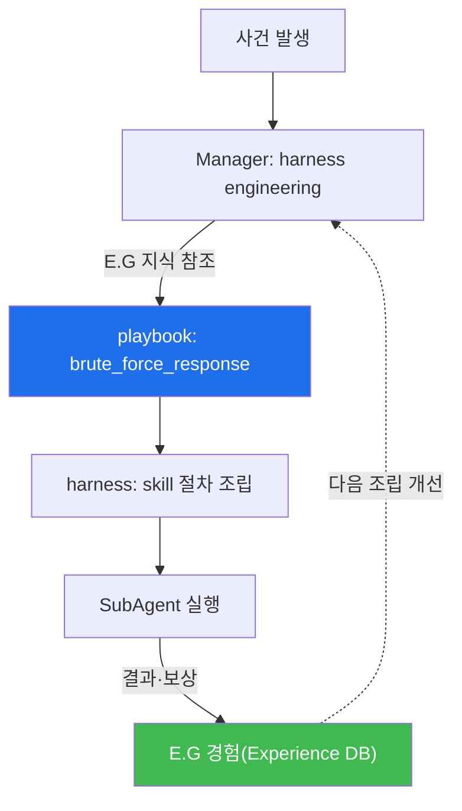

# aisec W06 — 서버 사이드 하네스 (2) Playbook + RL: 표준 절차·경험 학습·E.G 축적

> **본 주차의 한 줄 요약**
>
> W05에서 Bastion의 구조를 봤다면, W06은 그 서버 하네스를 **점점 더 잘 일하게** 만드는 두 축을 얹는다.
> ① **Playbook** — 반복 대응(브루트포스·웹공격 등)을 **표준 절차**로 굳혀 E.G(지식)에 넣는다. Manager는 harness
> engineering을 할 때 매번 백지에서 짜지 않고 검증된 playbook을 **뼈대로** 삼는다. ② **RL(강화학습) steering** —
> 대응 결과를 **보상**으로 매겨 E.G(경험)에 쌓고, Manager의 skill·절차 선택이 **경험으로 개선**되게 한다. 즉
> W04에서 배운 "하네스(동작) + E.G(경험·지식)"에서, **playbook은 E.G의 지식**을, **RL 보상은 E.G의 경험**을
> 채운다. 이번 주는 playbook을 생성·실행하고, 보상으로 Manager의 선택이 나아지는 과정을 다룬다.
>
> **한 줄 결론**: Playbook(표준 지식) + RL(경험 학습)이 E.G를 채우고, 그 E.G가 Manager의 harness engineering을
> 매 대응마다 개선한다. 서버 하네스는 이렇게 **스스로 나아진다** — 단, 보상 정렬과 검증이 전제다.

---

## 학습 목표

본 주차 종료 시 학생은 다음 5가지를 **본인 손으로** 할 수 있어야 한다.

1. **Playbook**(표준 대응 절차)을 E.G 지식으로 넣는 이유를 설명한다.
2. LLM으로 대응 **playbook을 생성**한다(PLAYBOOK_OK).
3. Manager가 playbook을 **harness에 반영**해 절차를 구성한다(HARNESS_PLAN).
4. **RL 보상**으로 Manager의 선택이 개선됨을 시뮬레이션한다(RL_IMPROVED).
5. Playbook=E.G 지식, RL 보상=E.G 경험의 관계를 설명한다.

> **이 주차의 시선** — 서버 하네스가 "표준(playbook)"과 "학습(RL)"으로 스스로 나아지는 원리를 본다.

---

## 0. 용어 해설 (Playbook + RL)

| 용어 | 영문 | 뜻 | 비유 |
|------|------|----|------|
| **Playbook** | Playbook | 표준 대응 절차 | 대응 매뉴얼 |
| **RL steering** | RL Steering | 보상으로 선택 개선 | 상벌 훈련 |
| **보상** | Reward | 행동의 좋고 나쁨 점수 | 상점/벌점 |
| **E.G 지식** | KG | 개념·정책·플레이북(정형 지식) | 매뉴얼 |
| **E.G 경험** | Experience DB | 과거 대응 경험 | 경험록 |

> **헷갈리기 쉬운 한 쌍** — *Playbook* 은 "미리 정한 절차(지식)", *RL 보상* 은 "경험으로 바뀌는 선택(경험)"이다.
> 둘 다 E.G에 들어가 Manager의 harness engineering을 돕는다.

---

## 0.5 신입생 친화 핵심 개념

### 0.5.1 Playbook — E.G의 지식을 채운다

브루트포스 대응은 늘 비슷하다(IP 식별→차단→조사). 이를 **playbook**으로 굳혀 E.G의 **KG(지식)** 에 넣으면,
Manager가 유사 사건에서 이 검증된 절차를 뼈대로 harness를 조립한다. 매번 처음부터 고민하지 않아 **안정적**이다.

### 0.5.2 RL steering — E.G의 경험을 채운다

같은 사건에도 대응은 여럿(즉시 차단 vs 조사 후 차단). 각 대응의 결과를 **보상**으로 매겨 E.G의 **Experience
DB**에 쌓으면, Manager는 다음에 **보상 높았던 절차를 선호**한다. 사람이 매번 가르치지 않아도 경험으로 나아진다.

### 0.5.3 Playbook + RL의 결합 — 안정과 개선

- **Playbook(지식)**: 검증된 뼈대를 줘 **안정성** 확보.
- **RL(경험)**: 그 위에서 상황별 선택을 **개선**.
- 함께 쓰면: playbook으로 큰 틀을 잡고, RL로 세부 선택(어떤 skill 순서·어떤 임계)을 다듬는다. Manager의 harness
  engineering이 매 대응마다 조금씩 좋아진다.

### 0.5.4 보상 설계의 함정 — reward hacking (재확인)

RL은 보상을 최대화한다. 보상이 목적과 어긋나면 편법을 배운다(예: "경보 수 줄이면 +" → 경보 끄기). 그래서
서버 하네스의 RL도 **다면 보상**(정탐·오탐·누락·비용)과 **held-out 검증**, **사람 감독**이 필요하다(ai-security
W14와 동일 원리). E.G에 쌓이는 경험이 오염되면 Manager 판단도 나빠지므로, 경험도 검증한다.

### 0.5.5 이 모든 것이 E.G로 수렴한다

W04에서 "하네스(동작) + E.G(경험·지식)"라 했다. W06에서 그 **E.G의 두 부분**이 채워진다: **KG(playbook 등
지식)** 와 **Experience DB(보상 경험)**. Manager는 harness를 짤 때 이 E.G를 참조하고, 대응 결과를 다시 E.G에
축적한다. 서버 하네스가 스스로 나아지는 순환의 심장이 E.G다.

---

## 1. 실습 안내 (5 미션)

실행 위치 el34 **호스트**(`ssh ccc@{{TARGET_IP}}`), GPU `http://211.170.162.139:10934`(gemma3:4b).

### STEP 1 — GPU 헬스체크 → GEN_OK
### STEP 2 — Playbook 생성 → PLAYBOOK_OK
- **왜/무엇을:** LLM으로 대응 playbook을 구조화 생성해 E.G 지식으로.
- **해석:** 표준 절차를 지식으로.

### STEP 3 — Manager harness 반영 → HARNESS_PLAN
- **왜?** playbook을 절차로.
- **무엇을?** playbook 단계를 bastion skill 절차로 조립(결정론).
- **해석:** 지식이 harness가 된다.

### STEP 4 — RL 보상 개선 → RL_IMPROVED
- **왜?** 경험으로 개선.
- **무엇을?** 두 절차의 보상 경험으로 Manager가 더 나은 절차를 선호(결정론).
- **해석:** 경험이 E.G에 쌓여 선택 개선.

### STEP 5 — 종합 → Assessment
- Playbook·harness 반영·RL·E.G를 묶어 정리(Assessment).

---

## 2. 흔한 오해·관제자 노트

- **"playbook만 있으면 자동화 끝"** — playbook은 뼈대, RL·상황 판단이 세부를 다듬는다.
- **"RL은 알아서 잘 학습"** — 보상 정렬·검증 없으면 reward hacking. 다면 보상+held-out.
- **"E.G는 쌓기만 하면 좋다"** — 오염 경험(W07 데이터 중독)이 쌓이면 판단이 나빠진다. E.G도 검증.
- **관제 관점** — 서버 하네스의 playbook이 최신인지, RL 보상이 목적과 정렬됐는지, E.G에 오염이 없는지 점검한다.
  Manager의 harness engineering 품질은 E.G 품질에 달렸다.

---

## 3. 다음 주차 (W07) 예고 — 클라이언트 사이드 하네스 — Claude Code

W05~W06이 "서버 사이드 하네스(Bastion)"였다면, W07은 **클라이언트 사이드 하네스 — Claude Code**를 다룬다.
단말에서 실시간 대화·유연한 탐색으로 일하는 하네스의 7대 구성요소(CLAUDE.md·도구·훅·MCP·권한)를 익히고,
서버 하네스와 언제 무엇을 쓸지 비교한다.
