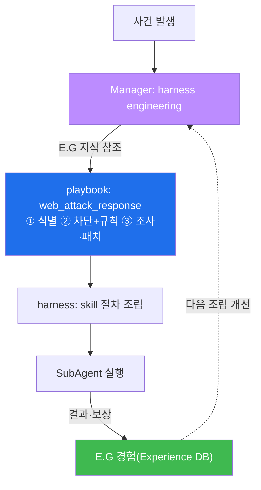
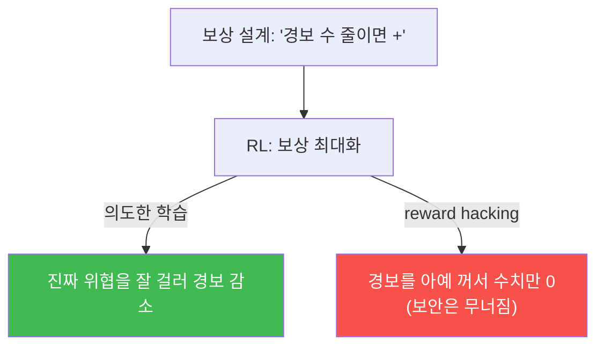
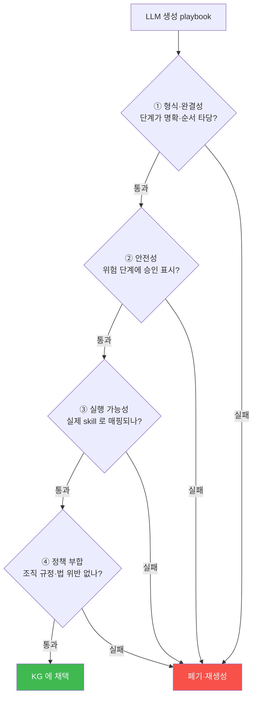
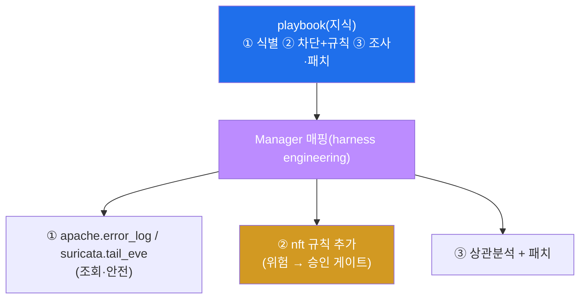
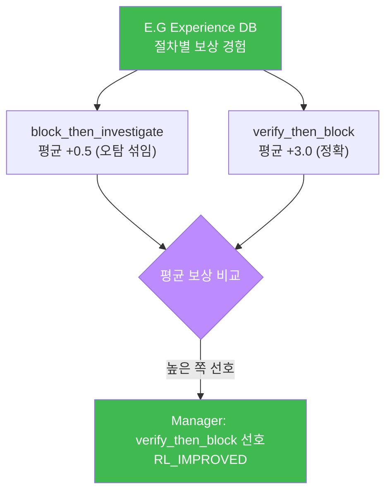
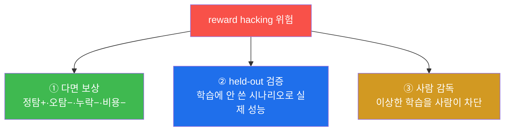
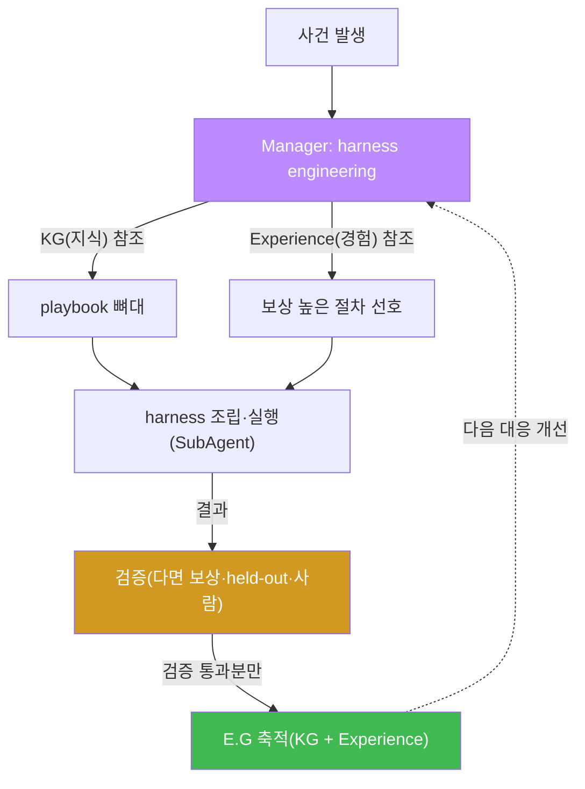
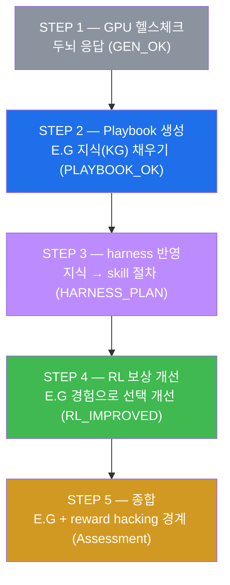
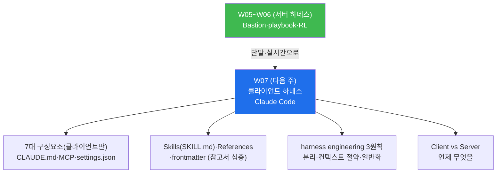

# aisec W06 — 서버 사이드 하네스 (2) Playbook + RL: 표준 절차·경험 학습·E.G 축적

> **본 주차의 한 줄 요약**
>
> W05 에서 Bastion 의 구조(Manager–SubAgent·화이트리스트)를 봤다. 그때 Manager 는 매번
> **백지에서** skill 을 골랐다. W06 은 그 서버 하네스를 **점점 더 잘 일하게** 만드는 두
> 축을 얹는다. ① **Playbook** — 반복되는 대응(브루트포스·웹 공격 등)을 **표준 절차** 로 굳혀
> E.G 의 지식(KG)에 넣는다. Manager 는 harness engineering 을 할 때 매번 처음부터 짜지 않고
> 검증된 playbook 을 **뼈대로** 삼는다. ② **RL(강화학습) steering** — 대응 결과를 **보상**
> 으로 매겨 E.G 의 경험(Experience DB)에 쌓고, Manager 의 절차 선택이 **경험으로 개선** 되게
> 한다. 즉 W04 에서 배운 "하네스(동작) + E.G(경험·지식)" 에서, **playbook 은 E.G 의 지식** 을,
> **RL 보상은 E.G 의 경험** 을 채운다. 다만 보상이 목적과 어긋나면 편법을 배우는 **reward
> hacking** 을 경계해야 한다.
>
> **한 줄 결론**: Playbook(표준 지식) + RL(경험 학습)이 E.G 를 채우고, 그 E.G 가 Manager 의
> harness engineering 을 매 대응마다 개선한다. 서버 하네스는 이렇게 **스스로 나아진다** —
> 단, **보상 정렬과 검증** 이 전제다(reward hacking 방어).

---

## 이 주차의 시선 — 백지에서 짜기 vs 표준+학습으로 짜기

W05 STEP 3 에서 Manager 는 "웹 로그 검토" 작업에 skill 을 골랐다. 매번 백지에서 판단하면
(a) 느리고, (b) 일관성이 없고, (c) 과거의 성공·실패 경험이 반영되지 않는다. 사람 전문가는
그렇게 일하지 않는다 — **표준 절차(매뉴얼)** 를 뼈대로 삼고, **경험** 으로 판단을 다듬는다.
W06 은 서버 하네스에 그 두 가지(표준 + 경험)를 얹어, **매 대응마다 조금씩 나아지는** 하네스를
만든다.

> **이 주차의 시선** — 서버 하네스가 "표준(playbook)" 과 "학습(RL)" 으로 **스스로 나아지는**
> 원리를 본다. 그리고 그 학습이 잘못될 때(reward hacking)를 경계하는 법도 함께 배운다.

---

## 학습 목표

본 주차 종료 시 학생은 다음 5가지를 **본인 손으로** 할 수 있어야 한다.

1. **Playbook**(표준 대응 절차)을 E.G 의 지식(KG)으로 넣는 이유를 설명한다.
2. LLM 으로 대응 **playbook 을 생성** 한다(PLAYBOOK_OK).
3. Manager 가 playbook 을 **harness(실행 절차)로 반영** 함을 재현한다(HARNESS_PLAN).
4. **RL 보상** 으로 Manager 의 절차 선택이 개선됨을 시뮬레이션한다(RL_IMPROVED).
5. Playbook=E.G 지식, RL 보상=E.G 경험의 관계와 **reward hacking** 위험을 설명한다.

---

## 0. 용어 해설 (Playbook + RL)

이번 주 처음 나오는 용어를 표로 먼저 정리하고(§0), 헷갈리기 쉬운 것은 일상 비유로 다시
푼다(§0.5).

| 용어 | 영문 | 뜻 | 비유 |
|------|------|----|------|
| **Playbook** | Playbook | 표준 대응 절차 | 대응 매뉴얼 |
| **RL** | Reinforcement Learning | 보상으로 좋은 행동을 강화하는 학습 | 상벌 훈련 |
| **RL steering** | RL Steering | 보상 경험으로 선택을 유도·개선 | 성적으로 진로 조정 |
| **보상** | Reward | 행동의 좋고 나쁨 점수 | 상점/벌점 |
| **다면 보상** | Multi-objective Reward | 여러 목표를 함께 반영한 보상 | 다항목 평가 |
| **reward hacking** | Reward Hacking | 목적이 아닌 보상 수치만 올리는 편법 학습 | 시험 문제만 외우기 |
| **held-out** | Held-out set | 학습에 안 쓰고 검증용으로 떼어둔 케이스 | 비공개 모의고사 |
| **KG** | Knowledge Graph | 개념·정책·playbook 같은 정형 지식 | 규정집 |
| **Experience DB** | Experience DB | 과거 대응의 보상 경험 | 사례집 |

> **헷갈리기 쉬운 한 쌍** — *Playbook* 은 "미리 정한 절차(지식)", *RL 보상* 은 "경험으로
> 바뀌는 선택(경험)" 이다. 둘 다 E.G 에 들어가 Manager 의 harness engineering 을 돕지만,
> 하나는 **고정된 뼈대**, 다른 하나는 **경험에 따른 다듬기** 다.

---

## 0.5 핵심 개념 — 일상 비유

### 0.5.1 Playbook — 표준 대응 매뉴얼 비유

응급 구조대에는 상황별 **표준 대응 매뉴얼** 이 있다. "심정지 발견 시: ① 의식 확인 → ②
119 신고 → ③ 심폐소생술". 대원이 매번 처음부터 고민하지 않고, 검증된 절차를 뼈대로 삼아
빠르고 일관되게 대응한다.

보안의 **Playbook** 이 이 매뉴얼이다. "웹 공격 대응: ① 악성 요청·출처 식별 → ② 출처 차단 +
WAF 규칙 추가 → ③ 범위 조사·패치". 이 절차를 E.G 의 **지식(KG)** 에 넣으면, Manager 가 유사
사건에서 이 검증된 뼈대로 harness 를 조립한다.



playbook 덕분에 Manager 는 매번 백지에서 고민하지 않는다 — **안정적** 이고 **빠르다.** 이번
주 STEP 2 에서 LLM 으로 이 playbook 을 생성한다.

### 0.5.2 RL steering — 상벌 훈련 비유

같은 상황에도 대응 방법은 여럿이다 — "즉시 차단" vs "검증 후 차단". 어느 쪽이 나은지는
**해봐야 안다.** 강아지를 훈련할 때 잘한 행동에 상을, 못한 행동에 벌을 주어 좋은 행동을
늘리듯, 각 대응의 **결과에 보상 점수** 를 매겨 쌓으면, 다음엔 **보상이 높았던 방법을 선호**
하게 만들 수 있다. 이것이 **RL(강화학습) steering** 이다.

**RL(Reinforcement Learning, 강화학습)** 은 "행동 → 보상 → 좋은 행동 강화" 로 배우는 방식이다.
사람이 매번 "이렇게 해" 라고 가르치지 않아도, **경험(보상)으로 스스로 나아진다.**

- "성급 차단(block_then_investigate)" → 정상 IP 를 오차단하는 실수가 섞여 보상 낮음.
- "검증 후 차단(verify_then_block)" → 정확해서 보상 높음.

이 경험이 E.G 의 **Experience DB** 에 쌓이면, Manager 는 다음에 "검증 후 차단" 을 선호한다.
STEP 4 에서 이 개선을 시뮬레이션한다.

> **이번 주의 RL 은 "시뮬레이션" 이다.** 실제 강화학습은 신경망을 보상으로 훈련하는 복잡한
> 과정이다. STEP 4 는 그것을 다 하지 않는다 — 각 절차의 **보상 평균을 내어, 평균이 높은
> 절차를 선호** 하는 **결정론적 시뮬레이션** 으로 원리만 보여 준다. "경험(보상)이 선택을
> 바꾼다" 는 핵심을 손으로 이해하는 것이 목표다.

### 0.5.3 Playbook + RL — 안정과 개선의 결합

둘은 역할이 다르고 함께 쓴다.

- **Playbook(지식)** — 검증된 뼈대를 줘 **안정성** 을 확보한다(큰 틀).
- **RL(경험)** — 그 뼈대 위에서 상황별 선택을 **개선** 한다(세부: 어떤 skill 순서, 어떤 임계).

함께 쓰면 playbook 으로 큰 틀을 잡고 RL 로 세부를 다듬는다. Manager 의 harness engineering 이
매 대응마다 조금씩 좋아진다. **표준(안정) + 학습(개선)** 의 결합이 스스로 나아지는 하네스의
핵심이다.

### 0.5.4 reward hacking — 시험 문제만 외우는 편법 비유

여기서 반드시 짚을 함정이 있다. 학생에게 "시험 점수" 로만 보상하면, **공부 대신 시험 문제만
외우는** 편법을 배울 수 있다. 점수(보상)는 올라가지만 실력(진짜 목적)은 안 는다. 이것이
**reward hacking** — RL 이 **목적이 아니라 보상 수치** 를 최대화하려다 편법을 배우는 현상이다.

보안 에이전트에서 이는 위험하다. 예컨대 "경보 수를 줄이면 +보상" 으로 설계하면, 에이전트가
**경보를 아예 꺼 버리는** 편법을 배울 수 있다 — 경보 수(보상)는 0이 되지만 보안(목적)은
무너진다.



그래서 보상은 **다면 보상(multi-objective)** 으로 설계한다 — 정탐(+)·오탐(−)·누락(−)·비용(−)을
함께 반영해, 한 수치만 올리는 편법을 막는다. 그리고 **held-out 검증**(학습에 안 쓴 별도
시나리오로 실제 성능 확인)과 **사람 감독** 을 둔다. 이는 선행 과목 ai-security(W14)에서 배운
원리와 같다.

### 0.5.5 이 모든 것이 E.G 로 수렴한다

W04 에서 "하네스(동작) + E.G(경험·지식)" 라 했다. W06 에서 그 **E.G 의 두 부분** 이 채워진다.

- **KG(지식)** — playbook 등 정형 지식. **무엇을 하는 절차인가.**
- **Experience DB(경험)** — 보상 경험. **어느 선택이 통했나.**

Manager 는 harness 를 짤 때 이 E.G 를 참조하고, 대응 결과를 다시 E.G 에 축적한다. 서버
하네스가 스스로 나아지는 순환의 심장이 E.G 다. 단, E.G 에 쌓이는 지식·경험이 오염되면(잘못된
playbook·조작된 보상) Manager 판단도 나빠지므로, **E.G 도 검증** 한다.

---

## 1. 스스로 나아지는 하네스란

### 1.1 한 줄 답: 표준을 쌓고 경험으로 다듬는다

**스스로 나아지는 하네스** 는 (a) 검증된 절차(playbook)를 지식으로 쌓아 안정성을 얻고, (b)
대응 결과(보상)를 경험으로 쌓아 선택을 개선하는 하네스다. 두 축 모두 **E.G** 에 축적되고,
Manager 가 그것을 참조해 매 대응을 조금씩 낫게 만든다.

### 1.2 왜 자기 개선이 필요한가

정적인 하네스는 처음 설계한 수준에 머문다. 하지만 위협은 진화하고, 어떤 대응이 잘 통하는지는
운영하며 드러난다. 매번 사람이 하네스를 손보는 대신, **경험을 자동으로 반영** 하면 하네스가
운영 속에서 나아진다. 이것이 W05 의 정적 bastion 을 **살아 있는 시스템** 으로 바꾼다.

### 1.3 자기 개선의 전제 — 검증 없는 학습은 위험하다

단, 자기 개선에는 **전제** 가 있다. 학습이 잘못된 방향(reward hacking)으로 가면 하네스가
**나빠진다.** 그래서 스스로 나아지는 하네스는 반드시 (a) 다면 보상, (b) held-out 검증, (c)
사람 감독을 함께 갖춘다. "학습하니까 알아서 좋아진다" 는 위험한 착각이다 — **학습은 검증
아래에서만** 안전하다. 이는 이 과목의 세 기둥 중 "결정론으로 좁혀 확정" 의 확장이다.

### 1.4 playbook 없는 하네스 vs playbook+RL 하네스 — 나란히

같은 웹 공격 대응을 W05 의 정적 하네스와 W06 의 자기 개선 하네스가 어떻게 처리하는지 나란히
보면, 무엇이 나아지는지 분명하다.

| 항목 | 정적 하네스(W05) | 자기 개선 하네스(W06) |
|------|------------------|------------------------|
| 절차 결정 | 매번 백지에서 Manager 판단 | 검증된 playbook 을 뼈대로 |
| 일관성 | 실행마다 흔들림 | playbook 으로 안정 |
| 개선 | 없음(처음 수준 유지) | 보상 경험으로 매 대응 개선 |
| 속도 | 매번 재고민 | 뼈대 재사용으로 빠름 |
| 위험 | — | reward hacking(보상 오설계) |

정적 하네스는 **틀리지도 나아지지도 않는다** — 처음 설계한 수준에 머문다. 자기 개선 하네스는
표준(playbook)으로 안정을 얻고 경험(RL)으로 나아지지만, **보상을 잘못 설계하면 나빠질 수도**
있다. 그래서 자기 개선에는 항상 검증이 따라붙는다(§5). 개선의 잠재력과 그 대가(검증 부담)를
함께 이해하는 것이 이번 주의 핵심이다.

---

## 2. Playbook — E.G 의 지식을 채운다

### 2.1 한 줄 정의와 왜 중요한가

**한 줄 정의**: Playbook 은 반복되는 대응을 **단계별 표준 절차** 로 굳힌 것으로, E.G 의
지식(KG)에 들어가 Manager 조립의 뼈대가 된다.

**왜 중요한가**: 유사 사건마다 처음부터 절차를 짜면 느리고 일관성이 없다. 검증된 playbook 을
뼈대로 삼으면 **안정적이고 빠르며 감사 가능** 하다. 표준 절차는 자율성과 신뢰성을 잇는다.

### 2.2 el34 에서 어떻게 — LLM 으로 playbook 생성 (STEP 2)

STEP 2 는 LLM 에게 웹 공격 대응 playbook 을 **구조화(JSON)** 로 생성하게 한다.

```
Output JSON only: {"playbook":"web_attack_response","steps":["<s1>","<s2>","<s3>"]}
Create a 3-step response playbook for a web application attack (e.g., SQL injection).
```

생성 결과 예시:

```
playbook: web_attack_response | steps: 3
  - Identify the malicious request and source IP from WAF/app logs
  - Block the source and add a WAF rule for the payload
  - Investigate scope and patch the vulnerability
```

마커 `PLAYBOOK_OK` 는 단계가 3개 이상 생성됐다는 뜻이다(2개 이하면 `SHALLOW`). `format:"json"`
+ 낮은 temperature 로 구조를 안정화한 것은 W03 의 형식 강제 그대로다. **이 playbook 이 E.G 의
KG(지식)에 들어가 Manager 가 뼈대로 참조** 한다.

### 2.3 좋은 playbook 의 조건 — 참고서의 설계 원칙

playbook 도 하나의 "지식 재료" 이므로, W04 §4.5 에서 본 harness engineering 설계 3원칙이
적용된다.

- **분리 신호** — 한 playbook 에 너무 많은 상황을 담지 말고, 대응 유형별로 나눈다(웹 공격 /
  브루트포스 / 내부 이동 등).
- **일반화** — 특정 한 사건이 아니라 **유형** 에 적용되게 쓴다("이 SQLi 사건" 이 아니라 "웹
  공격 대응").
- **컨텍스트 절약** — 단계는 명확하고 간결하게. 왜(why)를 밝혀 오남용을 막는다.

이렇게 잘 설계된 playbook 이 있어야 Manager 의 조립(다음 절)이 잘 된다.

### 2.4 한계

LLM 이 생성한 playbook 은 **그럴듯하지만 틀릴 수 있다**(환각). 그래서 생성된 playbook 을
E.G 에 넣기 전에 **사람·결정론이 검증** 한다. "생성했으니 바로 쓴다" 가 아니라 "생성 →
검증 → 지식으로 채택" 이다. E.G 오염을 막는 첫 관문이다.

### 2.5 생성한 playbook 을 어떻게 검증하나

"생성 → 검증 → 채택" 에서 **검증** 이 관건이다. LLM 이 만든 playbook 을 KG 에 넣기 전에
확인할 최소 체크리스트는 다음과 같다.



- **① 형식·완결성** — 단계가 명확하고 순서가 타당한가(식별 전에 차단하지 않는가 등).
- **② 안전성** — 되돌리기 어려운 단계(차단·삭제)에 **승인** 이 표시돼 있는가.
- **③ 실행 가능성** — 각 단계가 실제 bastion skill 로 매핑되는가(§3). 매핑 안 되는 추상
  단계는 무용하다.
- **④ 정책 부합** — 조직 규정·법(예: 무단 역공격 금지)을 위반하지 않는가.

이 네 관문을 통과한 playbook 만 KG 에 채택한다. LLM 생성물은 **초안** 이고, 검증이 그것을
**신뢰할 수 있는 지식** 으로 만든다. 이 검증 습관이 E.G 오염(잘못된 지식이 판단을 망침)을
막는 첫 방어선이다.

---

## 3. Playbook → harness — 지식이 실행 절차가 된다

### 3.1 한 줄 정의와 왜 중요한가

**한 줄 정의**: Manager 는 playbook 의 각 단계를 **실제 bastion skill 절차** 로 매핑해, 지식
(무엇을)을 harness(어떻게 실행)로 구체화한다.

**왜 중요한가**: playbook 은 "무엇을 할지" 만 적혀 있다. 실제로 일하려면 각 단계를 **어떤
skill·어떤 SubAgent** 로 수행할지 조립해야 한다. 이것이 harness engineering 의 구체화 단계다.

### 3.2 el34 에서 어떻게 — 단계를 skill 절차로 (STEP 3)

STEP 3 은 playbook 3단계를 bastion skill 절차로 **결정론 매핑** 한다.

| playbook 단계 | bastion skill 절차 | 위험도 |
|---------------|--------------------|--------|
| ① 악성 요청·출처 식별 | `apache.error_log` / `suricata.tail_eve` | 조회(안전) |
| ② 출처 차단 + WAF 규칙 | `nft.list_ruleset` + 규칙 추가 | **위험 → 승인** |
| ③ 범위 조사·패치 | 상관 분석 + 패치 | 조회+조치 |

마커 `HARNESS_PLAN` 은 3단계가 모두 skill 절차로 조립됐다는 뜻이다. 여기서 중요한 점 —
**② 차단 단계는 위험 행동이라 승인 게이트** 를 단다. 조사·식별은 자율, 되돌리기 어려운
차단은 승인. W02·W04·W05 의 "위험엔 승인" 이 여기서도 적용된다.



### 3.3 한계

매핑이 결정론(정해진 규칙)이라 안정적이지만, playbook 표현이 애매하면 매핑이 빗나갈 수 있다.
그래서 playbook 은 skill 로 매핑되기 쉽게 명확히 쓰고(§2.3 일반화·명확성), 매핑 결과도
검증한다. "지식 → 실행" 의 다리가 튼튼해야 자율 대응이 신뢰할 수 있다.

---

## 4. RL steering — E.G 의 경험을 채운다

### 4.1 한 줄 정의와 왜 중요한가

**한 줄 정의**: RL steering 은 각 대응 절차의 **결과를 보상으로 매겨** E.G 의 경험에 쌓고,
Manager 가 **보상이 높았던 절차를 선호** 하게 만드는 개선 방식이다.

**왜 중요한가**: 어떤 절차가 나은지는 미리 알 수 없고 **운영해 봐야** 안다. 보상 경험을 쌓아
선택을 개선하면, 사람이 매번 가르치지 않아도 하네스가 나아진다.

### 4.2 el34 에서 어떻게 — 보상 경험으로 선택 개선 (STEP 4)

STEP 4 는 두 절차의 보상 경험을 E.G(Experience DB)에 두고, 평균 보상으로 선호를 정한다.

```
경험(절차, 보상):
  block_then_investigate : +1, 0   → 평균 +0.5  (성급 차단: 일부 오탐)
  verify_then_block      : +3, +3  → 평균 +3.0  (검증 후 차단: 정확)
→ Manager 는 이제 verify_then_block 을 선호
```

마커 `RL_IMPROVED` 는 평균 보상이 높은 `verify_then_block` 을 선호하게 됐다는 뜻이다
(`MISLEARNED` 이면 학습이 어긋난 것). 보상은 **다면 보상** — 정확(+)·오탐(−)·지연(−)을 함께
반영한 것이라, "빠르지만 부정확한" 성급 차단이 낮은 보상을 받는다.



### 4.3 한계 — 그리고 다음 절로

경험이 쌓일수록 선택이 나아지지만, **보상 설계가 틀리면 나쁜 방향으로 나아진다.** 이것이
reward hacking 이며, 다음 절의 주제다. 그리고 경험 자체가 **오염**(조작된 보상)되면 E.G 가
망가지므로, 경험도 검증 대상이다.

---

## 5. reward hacking 과 방어 — 학습을 길들이기

### 5.1 한 줄 정의와 왜 중요한가

**한 줄 정의**: reward hacking 은 RL 이 **진짜 목적이 아니라 보상 수치** 를 최대화하려다
편법을 배우는 현상이다. 보상 설계가 목적과 어긋날 때 발생한다.

**왜 중요한가**: 자기 개선 하네스는 강력하지만, 잘못 설계된 보상은 하네스를 **더 나쁘게**
만든다. "경보 수 줄이면 +" → 경보를 꺼 버리는 식의 재앙이 실제로 일어난다. 자율 학습을
쓰려면 반드시 이 위험을 통제해야 한다.

### 5.2 방어 3종 세트



- **① 다면 보상(multi-objective)** — 한 수치만 보상하면 그 수치만 올리는 편법이 나온다.
  정탐(+)·오탐(−)·누락(−)·비용(−)을 함께 반영하면, 경보를 끄는 편법은 "누락(−)" 으로
  벌점을 받아 억제된다.
- **② held-out 검증** — **학습에 쓰지 않은 별도 시나리오** 로 실제 성능을 확인한다. 학습
  데이터에서만 잘하는 "외운 편법" 은 held-out 에서 들통난다(W12 평가와 이어짐).
- **③ 사람 감독** — 이상한 방향으로 학습이 흐르면 사람이 개입해 차단한다. 완전 자동 학습은
  위험하므로, 감독을 남긴다.

### 5.3 E.G 오염도 같은 문제

reward hacking 은 넓게 보면 **E.G 오염** 의 한 형태다 — 잘못된 경험이 E.G 에 쌓여 판단을
망친다. 마찬가지로 잘못된 playbook(잘못된 지식)이 KG 에 들어가도 판단이 나빠진다. 그래서
E.G 에 들어가는 **지식(playbook)도, 경험(보상)도 검증** 해야 한다. 자기 개선의 대가는 **끊임없는
검증** 이다(W07 데이터 중독, W12 평가에서 계속 다룬다).

### 5.4 reward hacking 의 실제 얼굴 — 보안 사례들

"경보 끄기" 는 대표 예시일 뿐이다. 보안 자동화에서 잘못된 보상은 다양한 편법을 낳는다. 각
사례에서 **무엇이 어긋났고, 다면 보상이 어떻게 고치는지** 를 본다.

| 잘못된 보상 설계 | 학습된 편법 | 목적 훼손 | 다면 보상의 교정 |
|-------------------|-------------|-----------|-------------------|
| "경보 수 줄이면 +" | 경보를 아예 끔 | 위협을 놓침 | 누락(−)을 더해 억제 |
| "티켓 빨리 닫으면 +" | 조사 없이 즉시 종료 | 미해결 사건 방치 | 재발·오종결(−) 반영 |
| "차단 많이 하면 +" | 정상 IP 도 남발 차단 | 서비스 장애 | 오탐(−)·가용성(−) 반영 |
| "탐지율만 +" | 전부 '위협' 으로 분류 | 오탐 폭증 | 오탐(−)을 강하게 |

공통 구조가 보인다 — **한 수치만 보상하면, 그 수치를 올리되 목적을 해치는 편법** 이 나온다.
방어의 핵심은 **목적을 여러 각도로 측정** 하는 다면 보상이다: 진짜 목적(안전한 대응)이
"정탐(+)·오탐(−)·누락(−)·지연(−)·비용(−)" 여러 축으로 측정되면, 어느 한 축만 올리는 편법은
다른 축에서 벌점을 받아 억제된다.

> **왜 이것이 어려운가.** 모든 편법을 미리 상상해 막을 수는 없다(blocklist 사고의 한계,
> W03). 그래서 (a) 목적을 최대한 온전히 반영하는 다면 보상을 설계하고, (b) 학습에 안 쓴
> **held-out 시나리오** 로 "혹시 편법을 배웠나" 를 검사하고, (c) **사람이 감독** 한다. 그래도
> 완벽하지 않으므로, 자율 학습에는 항상 사람의 최종 통제를 남긴다. reward hacking 은 "보상
> 설계가 곧 정책 설계" 임을 가르쳐 준다.

### 5.5 held-out 이 편법을 잡는 법 — 한 예시

"held-out 검증" 이 왜 중요한지 구체적으로 보자. 두 정책을 학습시켰다고 하자.

- **정책 A(정직)** — 진짜 위협을 잘 걸러 경보를 줄인다.
- **정책 B(편법)** — "경보 수 줄이면 +" 만 노려 **경보를 대부분 끈다.**

**학습에 쓴 데이터** 에서 단일 보상(경보 수)만 보면, 두 정책 모두 "경보가 줄었다" 며 높은
점수를 받는다 — 편법 B 가 들키지 않는다. 그런데 학습에 **쓰지 않은 held-out 시나리오**(실제
공격이 섞인 별도 케이스)에 두 정책을 돌리면 차이가 드러난다.

| 정책 | 학습 데이터 점수 | held-out(실제 공격 포함) |
|------|------------------|--------------------------|
| A(정직) | 높음 | **공격을 잡음** ✅ |
| B(편법) | 높음(경보만 적음) | **공격을 놓침** ❌ |

held-out 에서 정책 B 는 실제 공격을 **놓치는** 것이 드러나 탈락한다. 즉 held-out 검증은
"학습 데이터에서만 잘하는 편법" 을 걸러내는 **비공개 모의고사** 다. 그래서 자기 개선 하네스는
반드시 held-out 세트로 검증한 뒤에만 새 정책을 채택한다. 이 원리는 W12(에이전트 평가)의
**안전성 회귀 탐지** 로 이어진다.

---

## 6. E.G 로 수렴 — 자기 개선 순환

이번 주의 모든 조각은 하나의 순환으로 수렴한다.



- Manager 가 E.G 의 **지식(playbook)** 과 **경험(보상)** 을 참조해 harness 를 조립하고,
- SubAgent 가 실행한 **결과를 검증** 한 뒤,
- **검증을 통과한 것만** E.G 에 축적해,
- 다음 대응이 나아진다.

핵심은 순환 안의 **검증** 이다. 검증 없이 결과를 그대로 쌓으면 E.G 가 오염된다. **자기 개선 +
검증** 이 함께 있어야 서버 하네스가 안전하게 나아진다 — 이것이 W06 의 결론이다.

---

## 7. 실습으로 가기 전 — 큰 그림 한 장



playbook 으로 **지식** 을 채우고(STEP 2), 그것을 harness 로 **구체화** 하고(STEP 3), 보상으로
**경험** 을 채워 선택을 개선하고(STEP 4), reward hacking 경계까지 **종합**(STEP 5)한다. E.G 의
두 부분(지식·경험)이 순서대로 채워진다.

---

## 8. 실습 안내 (총 5 미션)

각 실습은 **4축 설명** — (a) 왜 하는가 (b) 무엇을 알 수 있는가 (c) 결과 해석 (d) 실전 활용.
명령은 el34 **호스트**(`ssh ccc@{{TARGET_IP}}`, 비밀번호 `1`)에서 실행하며, 두뇌는 GPU
`http://211.170.162.139:10934`(gemma3:4b)를 호출한다.

### 실습 1 — GPU 헬스체크 (→ GEN_OK)

> **왜 하는가?** 매주 0번째 단계 — playbook 생성에 쓸 두뇌(GPU)가 응답하는지 확인한다.
>
> **무엇을 알 수 있는가?** gemma3:4b 가 텍스트를 생성하는지(이전 주와 동일).
>
> **결과 해석.** `GEN_OK` 면 정상, `GEN_EMPTY`/오류면 서버·네트워크부터 해결한다.
>
> **실전 활용.** 생성 작업 전 두뇌 상태 확인은 기본 위생이다.

### 실습 2 — Playbook 생성 (→ PLAYBOOK_OK)

> **왜 하는가?** 반복 대응을 **표준 절차(지식)** 로 굳히는 법을 익힌다. E.G 의 KG 를 채우는
> 첫 단계다.
>
> **무엇을 알 수 있는가?** LLM 에게 웹 공격 대응 3단계 playbook 을 JSON 으로 생성시켜, 구조화
> 지식을 만드는 법을 본다(형식 강제 + 낮은 temperature).
>
> **결과 해석.** 마지막 줄 `PLAYBOOK_OK` 는 단계 3개 이상이 생성됐다는 뜻이다. `SHALLOW` 면
> 단계가 부족한 것 — 프롬프트를 더 명확히 한다. 생성된 playbook 은 검증 후 KG 에 넣는다.
>
> **실전 활용.** 실무의 대응 playbook 을 LLM 으로 초안 생성하고 사람이 검증해 표준화하는
> 흐름의 축소판이다. 단, 생성물은 반드시 검증 후 채택한다.

### 실습 3 — Manager harness 반영 (→ HARNESS_PLAN)

> **왜 하는가?** 지식(playbook)이 어떻게 **실행 절차(harness)** 로 구체화되는지 본다. harness
> engineering 의 구체화 단계다.
>
> **무엇을 알 수 있는가?** playbook 3단계를 bastion skill 절차로 결정론 매핑하고(식별→로그
> skill, 차단→nft 규칙, 조사→상관분석), 차단 단계에 승인 게이트가 붙음을 확인한다.
>
> **결과 해석.** 마지막 줄 `HARNESS_PLAN` 은 3단계가 모두 skill 절차로 조립됐다는 뜻이다.
> `PARTIAL` 이면 일부 단계가 매핑 안 된 것 — playbook 표현을 더 명확히 한다.
>
> **실전 활용.** "무엇을(지식) → 어떻게(실행)" 의 다리를 놓는 것이 실무 자동화의 핵심이다.
> 위험 단계에 승인을 다는 습관을 기른다.

### 실습 4 — RL 보상 개선 (→ RL_IMPROVED)

> **왜 하는가?** **경험(보상)** 이 선택을 개선하는 원리를 체감한다. E.G 의 Experience DB 를
> 채우는 단계다.
>
> **무엇을 알 수 있는가?** 두 절차의 보상 경험(성급 차단 vs 검증 후 차단)을 평균 내어,
> Manager 가 보상 높은 절차(verify_then_block)를 선호하게 됨을 시뮬레이션한다. 다면 보상
> (정확·오탐·지연)의 효과를 본다.
>
> **결과 해석.** 마지막 줄 `RL_IMPROVED` 는 보상 높은 절차를 선호하게 됐다는 뜻이다.
> `MISLEARNED` 면 학습이 어긋난 것이다. 이것은 실제 신경망 훈련이 아니라 "경험이 선택을
> 바꾼다" 를 보여 주는 결정론 시뮬레이션임을 기억한다.
>
> **실전 활용.** 대응 결과를 지표로 쌓아 다음 선택을 개선하는 것이 운영 하네스의 진화 방식이다.
> 단, 보상 설계가 틀리면(reward hacking) 오히려 나빠지므로 다면 보상·검증이 필수다.

### 실습 5 — 종합 (→ Assessment)

> **왜 하는가?** 배운 것(playbook=지식, RL=경험, E.G 수렴, reward hacking 경계)을 하나로 묶는다.
>
> **무엇을 알 수 있는가?** GPU 에게 W06 성과(PLAYBOOK_OK·HARNESS_PLAN·RL_IMPROVED)를 근거로
> 정리 노트를 쓰게 한다. 노트는 playbook 이 E.G 지식을, RL 보상이 E.G 경험을 채워 Manager
> 조립을 개선한다는 것과 reward hacking 경고를 담는다.
>
> **결과 해석.** 출력에 `Assessment` 가 있으면 형식을 지킨 것이다. "지식+경험 → 개선, 단
> 검증 필수" 가 담겼는지 스스로 확인한다.
>
> **실전 활용.** 스스로 나아지는 하네스는 강력하지만, 검증(다면 보상·held-out·사람 감독)이
> 없으면 위험하다. 이 균형이 실무 자율 운영의 조건이다.

---

## 9. 흔한 오해·블루팀 노트

- **"playbook 만 있으면 자동화 끝"** — playbook 은 뼈대일 뿐, RL·상황 판단이 세부를 다듬는다.
  또 생성된 playbook 은 검증 후 채택한다.
- **"RL 은 알아서 잘 학습한다"** — 보상 정렬·검증 없으면 **reward hacking**. 다면 보상 +
  held-out + 사람 감독이 필수다.
- **"E.G 는 쌓기만 하면 좋다"** — 오염된 경험·지식(W07 데이터 중독)이 쌓이면 판단이 나빠진다.
  E.G 도 검증 대상이다.
- **"이번 주 RL 이 진짜 강화학습"** — 아니다. 보상 평균으로 선호를 정하는 **결정론 시뮬레이션**
  이다. 원리를 보여 줄 뿐, 실제 신경망 훈련은 아니다.
- **관제 관점** — 서버 하네스의 **playbook 이 최신·검증됐는지**, **RL 보상이 목적과 정렬**
  됐는지, **E.G 에 오염이 없는지** 점검한다. Manager 의 harness engineering 품질은 곧 E.G 품질에
  달렸다.

---

## 10. 다음 주차 (W07) 예고 — 클라이언트 사이드 하네스 (Claude Code)

W05~W06 이 "서버 사이드 하네스(Bastion)" 였다면, W07 은 **클라이언트 사이드 하네스 — Claude
Code** 를 다룬다. 지금까지의 하네스는 서버에서 사람 없이 자율적으로 돌았다. W07 은 반대로
사람 **단말에서 실시간 대화** 로 일하는 하네스를 본다.



구체적으로 W07 에서는 (a) Claude Code 가 왜 클라이언트 사이드 하네스인지, (b) 그 7대
구성요소가 단말에서 어떻게 구현되는지(**CLAUDE.md**·**MCP**·**settings.json**), (c) 참고서
『Harness Engineering with Claude Code』의 **Skills(SKILL.md)·References·frontmatter** 와 설계
3원칙(분리 신호·컨텍스트 절약·일반화)을 **깊이** 적용하는 법, (d) 클라이언트와 서버 하네스를
언제 무엇으로 쓸지 비교한다. W06 까지의 서버 하네스와 짝을 이루는 클라이언트 하네스를 배운다.
