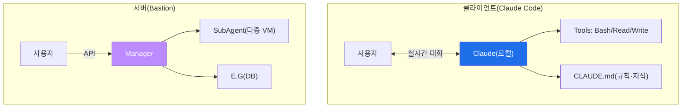

# aisec W07 — 클라이언트 사이드 하네스: Claude Code·CLAUDE.md·MCP·권한·서버와 비교

> **본 주차의 한 줄 요약**
>
> W05~W06이 서버 사이드 하네스(Bastion)였다면, W07은 **클라이언트 사이드 하네스 — Claude Code**를 다룬다.
> Claude Code는 사용자 **단말에서 실시간 대화**로 일하는 에이전트 하네스다. 서버 하네스가 "중앙 관제센터"라면
> 클라이언트 하네스는 "개인 비서"다. Claude Code도 W04의 **7대 구성요소**를 갖는다: **Tools**(Bash·Read·Write·
> Grep), **Skills**(MCP 서버), **Hooks**(pre/post 커맨드 훅), **Memory**(CLAUDE.md·.claude/), **Agents**(로컬
> Claude), **Tasks**(대화 턴), **Permissions**(.claude/settings.json). 특히 **CLAUDE.md**(프로젝트 규칙·지식)가
> 클라이언트 하네스의 E.G 역할을 한다. 클라이언트 하네스는 **유연한 탐색·개발**에 강하고, 서버 하네스는
> **자동화·다중 서버·감사**에 강하다 — 작업 성격에 맞게 고른다. 이번 주는 클라이언트 하네스의 구조를 익히고
> 서버 하네스와 비교한다.
>
> **한 줄 결론**: Claude Code = **클라이언트 사이드 하네스**(단말·실시간·유연). 7대 구성요소는 같되, CLAUDE.md가
> 규칙·지식(E.G)을, settings.json이 권한(Permissions)을 담당한다. 탐색·개발엔 클라이언트, 자동화·감사엔 서버.

---

## 학습 목표

본 주차 종료 시 학생은 다음 5가지를 **본인 손으로** 할 수 있어야 한다.

1. **Claude Code**가 클라이언트 사이드 하네스인 이유를 설명한다.
2. Claude Code의 7대 구성요소(특히 **CLAUDE.md·MCP·settings.json**)를 파악한다.
3. **CLAUDE.md**(규칙·지식)가 클라이언트 하네스의 E.G 역할임을 설명한다(CLIENT_OK).
4. 클라이언트 미니 하네스(규칙+로컬 도구)를 실행한다(LOCAL_RUN).
5. **클라이언트 vs 서버** 하네스를 비교해 언제 무엇을 쓸지 판단한다(COMPARED).

> **이 주차의 시선** — 같은 7대 구성요소가 클라이언트(단말)에선 어떻게 구현되는지, 서버와 무엇이 다른지 본다.

---

## 0. 용어 해설 (클라이언트 하네스)

| 용어 | 영문 | 뜻 | 비유 |
|------|------|----|------|
| **Claude Code** | — | 단말 실행 AI 코딩/보안 에이전트 | 개인 비서 |
| **CLAUDE.md** | — | 프로젝트 규칙·지식 파일 | 업무 지침서 |
| **MCP** | Model Context Protocol | 외부 도구 연결 표준(Skills) | 확장 어댑터 |
| **settings.json** | — | 권한 설정(.claude/) | 권한 대장 |
| **Hooks** | Hooks | 커맨드 전후 자동 실행 | 자동 점검 |

> **헷갈리기 쉬운 한 쌍** — *CLAUDE.md* 는 "규칙·지식(무엇을 알고 지켜야 하나)", *settings.json* 은 "권한(무엇을
> 해도 되나)"이다. 서버 하네스의 E.G·화이트리스트에 대응한다.

---

## 0.5 신입생 친화 핵심 개념

### 0.5.1 클라이언트 vs 서버 — 개인 비서 vs 관제센터

- **클라이언트(Claude Code)**: 단말에서 사용자와 **대화하며** 로컬 도구로 일한다. 탐색·개발·즉흥 대응에 강함.
- **서버(Bastion)**: API로 다중 VM을 **자동** 운영·감사한다. 상시 자율·대규모에 강함.

### 0.5.2 CLAUDE.md — 클라이언트 하네스의 E.G

서버 하네스의 E.G(KG+Experience)에 대응하는 것이 클라이언트에선 **CLAUDE.md**(+`.claude/`)다. 프로젝트 규칙·
컨벤션·주의사항·지식을 담아, Claude가 **매 세션 그 규칙·지식을 지키며** 일하게 한다. "이 프로젝트에선 이렇게
해라"를 적어두면, 사람이 매번 설명하지 않아도 된다 — 클라이언트 하네스의 지식 계층.

### 0.5.3 MCP·Hooks·Permissions — 나머지 구성요소

- **MCP(Skills)**: 외부 도구(DB·API·전용 스캐너)를 표준 프로토콜로 붙여 능력을 확장.
- **Hooks**: 커맨드 전후 자동 실행(예: 커밋 전 린트, 위험 명령 전 확인).
- **Permissions(settings.json)**: 어떤 도구·명령을 허용/차단할지. 서버의 화이트리스트에 대응하는 클라이언트
  안전선. "이 명령은 승인 필요"를 설정.

### 0.5.4 언제 무엇을 — 작업 성격으로 고른다

| 상황 | 적합 하네스 | 이유 |
|------|-------------|------|
| 코드 탐색·개발·즉흥 조사 | 클라이언트(Claude Code) | 실시간 대화·유연 |
| 다중 서버 상시 감시·자동 대응 | 서버(Bastion) | 자동화·감사·중앙 통제 |
| 1회성 심층 분석 | 클라이언트 | 사람과 협업 탐색 |
| 반복 정형 대응 | 서버 | playbook·RL·스케줄 |

둘은 배타적이 아니다. 사람이 Claude Code로 탐색하다, 정형화되면 Bastion playbook으로 옮기는 식으로 **함께** 쓴다.

### 0.5.5 두 하네스의 공통 안전 원칙

클라이언트든 서버든 **Permissions(권한)** 가 핵심 안전선이다. 위험 명령·행동은 승인/차단. LLM이 무엇을 하려
하든 권한 계층이 막는다(W02·W04·W05의 "LLM≠실행 권한"이 양쪽 모두에 적용). 하네스의 형태는 달라도 안전
원칙은 같다.

---

## 1. 실습 안내 (5 미션)

실행 위치 el34 **호스트**(`ssh ccc@{{TARGET_IP}}`), GPU `http://211.170.162.139:10934`(gemma3:4b).
(Claude Code 자체 설치 없이, 클라이언트 하네스 구조를 미니 하네스로 재현·비교한다.)

### STEP 1 — GPU 헬스체크 → GEN_OK
### STEP 2 — CLAUDE.md 규칙 반영 → CLIENT_OK
- **왜/무엇을:** CLAUDE.md식 규칙(E.G)을 에이전트가 지키는지 확인.
- **해석:** 규칙·지식이 클라이언트 하네스의 E.G.

### STEP 3 — 클라이언트 미니 하네스 실행 → LOCAL_RUN
- **왜?** 로컬 도구·권한으로 실행.
- **무엇을?** 규칙+로컬 도구+권한을 가진 미니 하네스로 작업 수행.
- **해석:** 단말에서 유연 실행.

### STEP 4 — 클라이언트 vs 서버 비교 → COMPARED
- **왜?** 언제 무엇을.
- **무엇을?** 작업별 적합 하네스를 매핑(결정론).
- **해석:** 성격에 맞게 선택.

### STEP 5 — 종합 → Assessment
- 7대 구성요소·CLAUDE.md·비교·공통 안전을 묶어 정리(Assessment).

---

## 2. 흔한 오해·블루팀 노트

- **"클라이언트 하네스는 장난감"** — 탐색·개발·심층 분석엔 클라이언트가 최적. 용도가 다를 뿐.
- **"CLAUDE.md는 그냥 메모"** — 클라이언트 하네스의 규칙·지식(E.G). 잘 쓰면 일관성·안전이 크게 오름.
- **"권한 설정은 귀찮다"** — Permissions가 클라이언트 안전선. 위험 명령 승인/차단은 필수.
- **관제 관점** — 클라이언트 하네스의 CLAUDE.md 규칙·settings.json 권한이 적절한지, 위험 명령에 승인이
  걸리는지, 훅이 안전 점검을 하는지 본다. 서버든 클라이언트든 통제점은 Permissions.

---

## 3. 다음 주차 (W08) 예고 — 중간 실습: 나만의 보안 에이전트 구축

W01~W07로 에이전트 기본기·프롬프트·하네스(서버/클라이언트)를 모두 배웠다. W08은 이를 종합해 **나만의 보안
에이전트**를 직접 조립한다. 도구·프롬프트·하네스(권한·기억)를 갖춘 에이전트로 실제 보안 작업(경보 분류·조사)을
end-to-end 수행하는 중간 실습이다.
