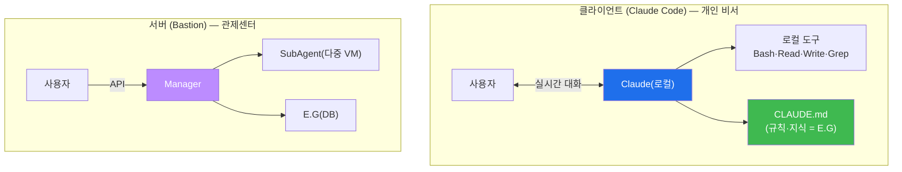
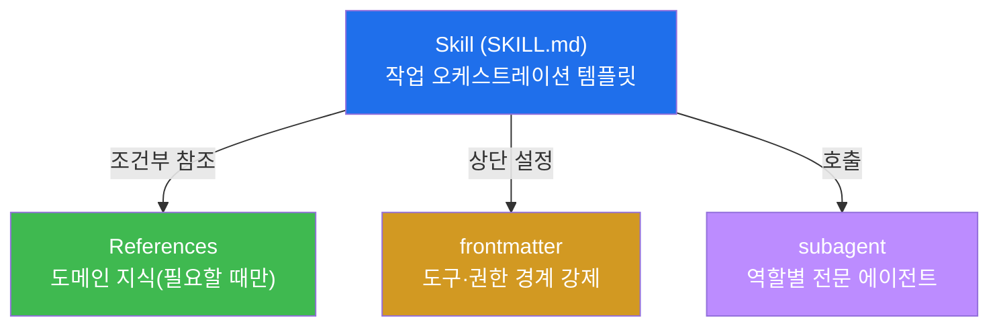
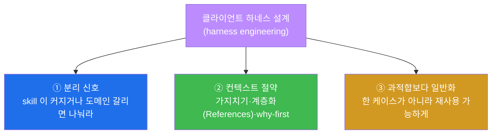
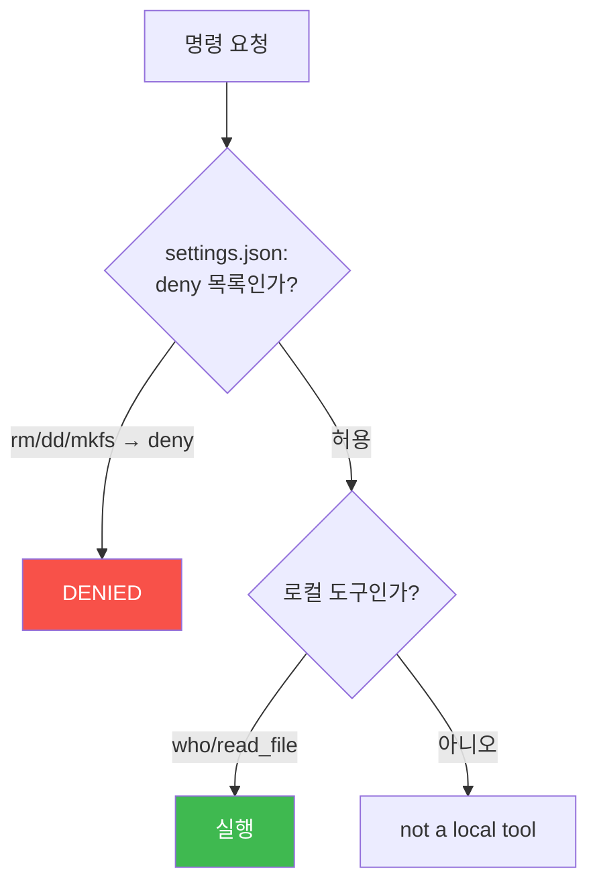
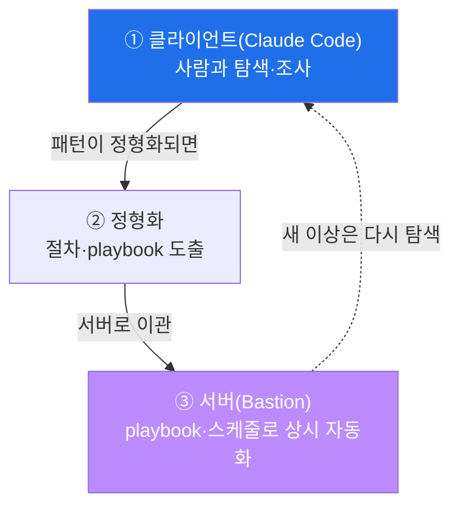
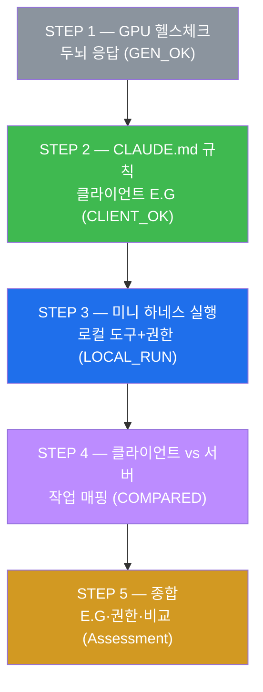
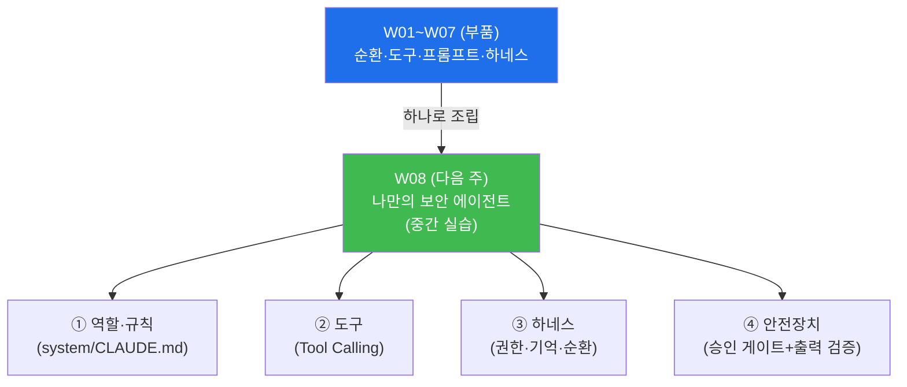

# aisec W07 — 클라이언트 사이드 하네스: Claude Code·CLAUDE.md·MCP·권한·서버와 비교

> **본 주차의 한 줄 요약**
>
> W05~W06 이 서버 사이드 하네스(Bastion)였다면, W07 은 **클라이언트 사이드 하네스 — Claude
> Code** 를 다룬다. Claude Code 는 사용자 **단말에서 실시간 대화** 로 일하는 에이전트 하네스다.
> 서버 하네스가 "중앙 관제센터" 라면 클라이언트 하네스는 "개인 비서" 다. Claude Code 도 W04 의
> **7대 구성요소** 를 갖는다: **Tools**(Bash·Read·Write·Grep), **Skills**(SKILL.md·MCP 서버),
> **Hooks**(도구 전후 자동 실행), **Memory**(CLAUDE.md·.claude/), **Agents**(로컬 Claude·
> subagent), **Tasks**(대화 턴), **Permissions**(.claude/settings.json). 특히 **CLAUDE.md**
> (프로젝트 규칙·지식)가 클라이언트 하네스의 **E.G** 역할을, **settings.json** 이 **Permissions**
> 역할을 한다. 그리고 참고서 『Harness Engineering with Claude Code』의 **Skills(SKILL.md)·
> References·frontmatter** 와 설계 3원칙을 여기서 실제로 적용한다. 클라이언트 하네스는 **유연한
> 탐색·개발** 에, 서버 하네스는 **자동화·다중 서버·감사** 에 강하다 — 작업 성격에 맞게 고른다.
>
> **한 줄 결론**: Claude Code = **클라이언트 사이드 하네스**(단말·실시간·유연). 7대 구성요소는
> 같되, **CLAUDE.md 가 규칙·지식(E.G)** 을, **settings.json 이 권한(Permissions)** 을 담당한다.
> 탐색·개발엔 클라이언트, 자동화·감사엔 서버 — 그리고 둘을 **함께** 쓴다.

---

## 이 주차의 시선 — 관제센터에서 개인 비서로

W05~W06 의 서버 하네스는 사람 없이도 다중 VM 을 **자동** 으로 부렸다. 강력하지만, 사람과
**함께 탐색** 하기엔 뻣뻣하다. 반대로 개발자가 코드를 파고들거나 사고를 즉흥 조사할 때는,
**옆에서 실시간으로 대화** 하며 유연하게 돕는 하네스가 낫다. 그것이 클라이언트 사이드 하네스,
곧 **Claude Code** 다.

> **이 주차의 시선** — 같은 7대 구성요소가 **단말(클라이언트)** 에선 어떻게 구현되는지, 서버와
> 무엇이 다른지, 그리고 언제 무엇을 쓰는지 본다. 참고서의 **Skills·References·frontmatter·설계
> 3원칙** 을 실제 클라이언트 하네스 설계에 적용한다.

---

## 학습 목표

본 주차 종료 시 학생은 다음 5가지를 **본인 손으로** 할 수 있어야 한다.

1. **Claude Code** 가 클라이언트 사이드 하네스인 이유와 서버 하네스와의 차이를 설명한다.
2. Claude Code 의 7대 구성요소, 특히 **CLAUDE.md·MCP·settings.json** 의 역할을 파악한다.
3. **CLAUDE.md**(규칙·지식)가 클라이언트 하네스의 E.G 임을 확인한다(CLIENT_OK), 클라이언트
   미니 하네스를 권한과 함께 실행한다(LOCAL_RUN).
4. 참고서의 **Skills(SKILL.md)·References·frontmatter** 와 설계 3원칙(분리·컨텍스트 절약·
   일반화)을 클라이언트 하네스 설계에 적용한다.
5. **클라이언트 vs 서버** 하네스를 작업 성격으로 비교해 언제 무엇을 쓸지 판단한다(COMPARED).

---

## 0. 용어 해설 (클라이언트 하네스)

이번 주 처음 나오는 용어를 표로 먼저 정리하고(§0), 헷갈리기 쉬운 것은 일상 비유로 다시
푼다(§0.5).

| 용어 | 영문 | 뜻 | 비유 |
|------|------|----|------|
| **Claude Code** | — | 단말에서 실행되는 AI 코딩/보안 에이전트(하네스) | 개인 비서 |
| **CLAUDE.md** | — | 프로젝트 규칙·지식을 담는 파일(매 세션 로딩) | 업무 지침서 |
| **.claude/** | — | 설정·skill·agent·hook 을 담는 디렉터리 | 비서의 서류함 |
| **settings.json** | — | 도구·명령 허용/차단 권한 설정 | 권한 대장 |
| **MCP** | Model Context Protocol | 외부 도구를 표준 방식으로 연결(Skills) | 확장 어댑터 |
| **Hooks** | Hooks | 도구 실행 전후 자동 실행되는 코드 | 자동 점검 |
| **SKILL.md** | — | 에이전트 능력·절차를 정의하는 skill 파일 | 작업 매뉴얼 |
| **References** | References | skill 이 조건부로 참조하는 도메인 지식 | 참고 자료철 |
| **frontmatter** | Frontmatter | 파일 상단의 설정 메타데이터(도구·권한 경계) | 표지의 사용 규정 |
| **subagent** | Subagent | 특정 역할을 맡는 하위 에이전트 | 전문 대리인 |
| **slash command** | — | `/명령` 형태로 재사용하는 작업 템플릿 | 단축 버튼 |

> **헷갈리기 쉬운 한 쌍** — *CLAUDE.md* 는 "규칙·지식(무엇을 알고 지켜야 하나)", *settings.json*
> 은 "권한(무엇을 해도 되나)" 이다. 서버 하네스의 **E.G·화이트리스트** 에 각각 대응한다.

---

## 0.5 핵심 개념 — 일상 비유

### 0.5.1 클라이언트 vs 서버 — 개인 비서 vs 관제센터 비유

두 종류의 조수를 상상하자. **개인 비서(클라이언트)** 는 내 옆에서 실시간으로 대화하며, 내가
"이 문서 좀 봐 줘", "저건 어때?" 하고 즉흥적으로 시키는 일을 유연하게 돕는다. **관제센터
(서버)** 는 여러 건물을 24시간 자동 감시하며, 정해진 절차로 상시 대응하고 모든 것을 기록한다.

- **클라이언트(Claude Code)** — 단말에서 사용자와 **대화하며** 로컬 도구로 일한다. 탐색·개발·
  즉흥 대응에 강하다.
- **서버(Bastion)** — API 로 다중 VM 을 **자동** 운영·감사한다. 상시 자율·대규모에 강하다.



둘은 배타적이지 않다. 개발자가 Claude Code(비서)로 탐색하다 정형화되면 Bastion(관제센터)
playbook 으로 옮기는 식으로 **함께** 쓴다(§5).

### 0.5.2 CLAUDE.md — 클라이언트 하네스의 E.G 비유

새 비서에게 매번 "우리 회사는 이렇게 일해요" 를 처음부터 설명하면 비효율적이다. 대신 **업무
지침서** 를 한 번 써 주면, 비서가 그것을 읽고 매번 규칙을 지킨다. 클라이언트 하네스에서 그
지침서가 **CLAUDE.md** 다.

**CLAUDE.md** 는 프로젝트의 규칙·컨벤션·주의사항·지식을 담는 파일로, Claude Code 가 **매 세션
자동으로 읽어** 그 규칙·지식을 지키며 일한다. 서버 하네스의 E.G(KG+Experience)에 대응하는,
클라이언트 하네스의 **지식 계층** 이다.

> **왜 E.G 라 부르나?** W04 에서 E.G 는 "무엇을 아는가(경험·지식)" 였다. CLAUDE.md 에 "이
> 프로젝트에선 이렇게 해라, 이건 하지 마라" 를 적어두면, Claude 가 매번 그 지식을 갖춘 채
> 일을 시작한다 — 서버의 KG 가 클라이언트에선 CLAUDE.md 로 나타나는 것이다. 이번 주 STEP 2
> 가 이것을 직접 확인한다: CLAUDE.md 식 규칙([SEC] 태그·파괴 명령 금지)을 준 에이전트가 그
> 규칙을 지키는지 본다.

### 0.5.3 MCP·Hooks·Permissions — 나머지 구성요소 비유

클라이언트 하네스의 나머지 부품도 일상 비유로 잡아 둔다.

- **MCP(Skills)** — 비서에게 **확장 어댑터** 를 꽂아 새 능력을 준다. **MCP(Model Context
  Protocol)** 는 외부 도구(DB·전용 스캐너·사내 API)를 **표준 방식으로 연결** 하는 규약이다.
  비서가 쓸 수 있는 연장을 늘린다.
- **Hooks** — **자동 점검** 이다. 커밋 전 린트, 위험 명령 실행 전 확인처럼, 특정 이벤트에
  자동으로 끼어드는 코드다(W04 에서 개념 소개).
- **Permissions(settings.json)** — **권한 대장** 이다. 어떤 도구·명령을 허용/차단할지 정한다.
  서버의 화이트리스트에 대응하는 클라이언트 안전선이다. "이 명령은 승인 필요" 도 설정한다.

### 0.5.4 Skills(SKILL.md)·References·frontmatter — 참고서의 재료 비유

참고서 『Harness Engineering with Claude Code』는 클라이언트 하네스를 **잘 설계하는 재료** 를
구체적으로 제시한다. 요리로 치면, 좋은 요리(에이전트 작업)를 위한 **레시피·자료·규정** 이다.

- **Skills(SKILL.md)** — **레시피(작업 매뉴얼)**. 여러 에이전트·도구를 순차·병렬로 조율하는
  **오케스트레이션 템플릿** 이다. "PR 리뷰를 이렇게 진행하라" 같은 절차를 파일(`SKILL.md`)로
  적어 재사용한다. 서버의 skill·playbook 에 대응하는 클라이언트판이다.
- **References** — **참고 자료철**. skill 이 **필요할 때만 조건부로 참조** 하는 도메인 지식이다.
  모든 지식을 항상 읽지 않고, 관련 상황에서만 해당 자료를 끌어와 컨텍스트를 아낀다.
- **frontmatter** — **표지의 사용 규정**. 파일 맨 위에 적는 설정 메타데이터로, 그 skill·agent
  가 **어떤 도구를 쓸 수 있는지(권한 경계)** 를 강제한다. 예: "이 skill 은 읽기만, Write 금지".



이 재료들을 **잘** 만드는 규율이 harness engineering 이며, 그 설계 3원칙(§3)이 여기 적용된다.

### 0.5.5 언제 무엇을 — 작업 성격으로 고른다

클라이언트와 서버는 우열이 아니라 **용도** 가 다르다. 작업 성격으로 고른다.

| 상황 | 적합 하네스 | 이유 |
|------|-------------|------|
| 코드 탐색·개발·즉흥 조사 | 클라이언트(Claude Code) | 실시간 대화·유연 |
| 다중 서버 상시 감시·자동 대응 | 서버(Bastion) | 자동화·감사·중앙 통제 |
| 1회성 심층 분석(사람과 협업) | 클라이언트 | 대화형 탐색 |
| 반복 정형 대응(스케줄·playbook) | 서버 | playbook·RL·상시성 |

STEP 4 에서 이 매핑을 직접 재현한다. 핵심은 "탐색·1회성 심층 = 클라이언트, 상시·다중·정형 =
서버" 이고, 실무는 **둘을 함께** 쓴다(탐색은 클라이언트 → 정형화되면 서버로 이관).

---

## 1. Claude Code 는 왜 클라이언트 하네스인가

### 1.1 한 줄 답: 단말에서 사람과 실시간으로 일한다

**Claude Code** 는 사용자의 단말(로컬 컴퓨터)에서 실행되며, 사람과 **실시간 대화** 로 일하는
에이전트 하네스다. 서버 하네스가 API 로 원격 자동 운영된다면, 클라이언트 하네스는 사람 옆에서
대화하며 로컬 파일·도구를 다룬다. 이 "단말·실시간·대화" 라는 성격이 클라이언트 하네스의 정체다.

### 1.2 왜 별도의 하네스 형태가 필요한가

서버 하네스만으로는 부족하다. 개발·탐색·즉흥 조사처럼 **사람의 판단이 매 순간 개입** 하는
작업은 자동화보다 **대화** 가 낫다. 예컨대 코드베이스를 파악하거나, 새 취약점을 탐색하거나,
로그를 이리저리 뒤지는 일은 "다음에 뭘 볼지" 를 사람이 그때그때 정한다. 이런 유연한 협업에는
클라이언트 하네스가 맞다. **자동화가 목표가 아니라, 사람과의 협업 효율이 목표** 인 것이다.

### 1.3 같은 7대 구성요소, 다른 구현

중요한 것은 클라이언트도 **W04 의 7대 구성요소를 그대로 갖는다** 는 점이다. 다만 구현이 다르다.

| 구성요소 | 서버(Bastion) | 클라이언트(Claude Code) |
|----------|---------------|--------------------------|
| Tools | `/exec` 화이트리스트 명령 | Bash·Read·Write·Grep 등 로컬 도구 |
| Skills | wazuh.alerts 등 | SKILL.md·MCP 서버 |
| Hooks | 증거 자동 기록 | 도구 전후 커맨드 훅 |
| Memory | E.G(Experience DB) | **CLAUDE.md**·.claude/ |
| Agents | SubAgent(원격 VM) | Claude(로컬)·subagent |
| Tasks | 미션 단계 | 대화 턴 |
| Permissions | 화이트리스트·승인 | **settings.json** |

즉 하네스의 **골격은 같고**, 실행 위치(단말 vs 서버)와 자동화 정도가 다르다. 그래서 W04~W06 에서
배운 하네스 원리가 클라이언트에도 그대로 적용된다.

---

## 2. 7대 구성요소 (클라이언트판) 상세

이번 주 실습이 다루는 핵심 — CLAUDE.md(Memory)·settings.json(Permissions)·로컬 도구(Tools) —
에 집중해 살핀다.

### 2.1 Memory — CLAUDE.md (클라이언트의 E.G)

**정의**: 프로젝트 규칙·지식을 담아 매 세션 로딩되는 파일. **왜**: 사람이 매번 규칙을 설명하지
않아도 Claude 가 일관되게 지킨다. **적용**: "이 프로젝트는 이렇게 해라, 이건 금지" 를 적는다.
**한계**: 소형 모델은 규칙을 무시할 수 있으므로(W02~W03), 규칙만으론 부족하고 Permissions 가
겹쳐야 한다.

### 2.2 Permissions — settings.json (클라이언트의 안전선)

**정의**: 어떤 도구·명령을 허용/차단/승인할지 정하는 설정. **왜**: CLAUDE.md 규칙을 무시하는
경우에도 **코드 계층에서** 위험 행동을 막는 최종 방어선. **적용**: 위험 명령(rm·dd·mkfs)을
차단(deny)하고, 민감 작업은 승인(ask)으로. **한계**: 허용/차단 목록이 낡으면 통제가 헐거워지므로
관리가 필요하다. 서버의 화이트리스트에 정확히 대응한다.

### 2.3 Tools — 로컬 도구

**정의**: Claude 가 로컬에서 쓰는 도구(Bash·Read·Write·Grep 등). **왜**: 단말의 파일·명령을
직접 다뤄 실제 작업을 수행. **적용**: 코드 읽기·수정·검색·실행. **한계**: 강력한 만큼 위험도
크므로 Permissions 로 통제한다(§2.2).

### 2.4 나머지 — Skills·Hooks·Agents·Tasks

- **Skills** — SKILL.md(작업 매뉴얼)와 MCP(외부 도구 연결). 능력을 확장한다(§3 에서 심화).
- **Hooks** — 도구 전후 자동 실행(위험 명령 전 확인, 저장 후 포맷 등). 안전·자동화.
- **Agents** — 로컬 Claude, 그리고 특정 역할의 **subagent**(예: 코드 리뷰 전용). 작업을 위임.
- **Tasks** — 대화의 각 턴이 작업 단위. 진행 상태를 이어간다.

---

## 3. 참고서 심층 — Skills·References·frontmatter 와 설계 3원칙

이 절은 참고서 『Harness Engineering with Claude Code』(한빛미디어)의 핵심을 클라이언트 하네스
설계에 적용한다. 클라이언트 하네스를 **잘** 만드는 규율이 곧 harness engineering 이다.

### 3.1 Skills(SKILL.md) — 작업 오케스트레이션 템플릿

**정의**: SKILL.md 는 여러 에이전트·도구를 **순차·병렬로 조율** 하는 절차를 담은 파일이다.
"이 작업은 이렇게 진행하라" 를 재사용 가능한 템플릿으로 만든다.

**왜 중요한가**: 반복되는 복합 작업(PR 리뷰·코드 리뷰 팀·의존성 분석 등)을 매번 즉흥
프롬프트로 하면 일관성이 없다. SKILL.md 로 절차를 굳히면 **재사용·일관성·품질** 이 오른다.
서버의 playbook 에 대응하는 클라이언트판이다.

### 3.2 References — 조건부 도메인 지식

**정의**: References 는 skill 이 **필요할 때만 조건부로 참조** 하는 도메인 지식 파일이다.

**왜 중요한가**: 모든 지식을 항상 프롬프트에 넣으면 컨텍스트가 넘치고 느려진다. 관련 상황에서만
해당 reference 를 끌어오면 **컨텍스트를 아끼고** 정확도가 오른다. 예: 웹 공격 관련 작업일 때만
`web-attack.md` reference 를 참조.

### 3.3 frontmatter — 도구·권한 경계

**정의**: frontmatter 는 파일(SKILL.md·subagent) 맨 위에 적는 설정 메타데이터로, 그 skill·
agent 가 **쓸 수 있는 도구·권한을 강제** 한다.

**왜 중요한가**: 리뷰 전용 skill 이 실수로 파일을 수정하면 안 된다. frontmatter 에 "Write/Edit
제외" 를 명시하면 **도구 경계** 가 코드로 강제된다. Permissions 를 skill 단위로 세밀하게
거는 장치다.

### 3.4 설계 3원칙 — 좋은 클라이언트 하네스의 규율

W04 §4.5 에서 소개한 세 원칙이 여기서 실제 설계 지침이 된다.



- **① 분리 신호** — 하나의 SKILL.md 가 너무 커지거나 여러 도메인을 다루면 **나눈다.** 큰 skill
  하나보다 잘 나뉜 작은 skill 여럿이 유지·재사용에 낫다.
- **② 컨텍스트 절약** — 불필요한 내용은 **가지치기(pruning)**, 도메인 지식은 References 로
  **계층화(layering)** 해 필요할 때만 참조, 규칙은 **왜(why)를 먼저** 밝혀 오남용을 막는다.
  CLAUDE.md 를 장황하게 쓰지 않고 핵심만 담는 것이 이 원칙이다.
- **③ 과적합보다 일반화** — 특정 한 상황에만 맞춘 skill 은 다음에 못 쓴다. **유형** 에 적용되게
  일반화한다.

**안티 패턴(경고 신호)**: 비대한 skill(한 skill 이 너무 많은 일), 빠진 References(필요한 지식
없음), 근거 없는 규칙(왜인지 모를 제약). 이 셋이 보이면 하네스 설계가 나빠지고 있다는 뜻이다.

> **왜 이 규율이 보안에서도 중요한가.** 잘못 설계된 하네스는 **컨텍스트 낭비 → 판단 저하 →
> 실수·누락** 으로 이어진다. 특히 보안 작업은 정확도가 생명이므로, skill 을 잘 나누고
> References 로 필요한 지식만 정확히 주는 설계가 곧 신뢰성이다. 참고서의 규율은 "빠른 프롬프트"
> 를 넘어 **신뢰할 수 있는 작업 환경** 을 만드는 법이다.

### 3.5 실제로 어떻게 생겼나 — SKILL.md 한 장 뜯어보기

개념만으론 감이 안 오니, 보안 로그 triage 를 하는 SKILL.md 가 실제로 어떻게 생겼는지 본다
(구조 이해용 예시).

```
---
name: log-triage
description: 웹/인증 로그를 읽어 의심 이벤트를 심각도로 분류한다. 읽기 전용.
allowed-tools: Read, Grep, Bash(grep:*)     # frontmatter: 도구 경계(쓰기 금지)
---

# 절차 (오케스트레이션)
1. 대상 로그를 Read/Grep 으로 수집한다.
2. 각 이벤트를 심각도(HIGH/MED/LOW)로 분류한다.
3. 웹 공격 의심이면 References/web-attack.md 를 참조해 판단을 보강한다.
4. HIGH 항목만 요약해 보고한다. (차단 등 조치는 사람 승인 대상 — 이 skill 밖)
```

한 줄씩 뜯어 보면 참고서의 세 재료가 모두 보인다.

- **frontmatter**(맨 위 `---` 사이) — `allowed-tools: Read, Grep, Bash(grep:*)` 로 **도구
  경계** 를 강제한다. 이 skill 은 **읽기만** 하고 Write/Edit 나 위험 Bash 는 못 쓴다. triage 는
  분류만 하면 되므로, 조치 권한을 애초에 안 주는 것이 안전하다(최소 권한).
- **오케스트레이션 절차**(본문) — 수집 → 분류 → (조건부) 보강 → 보고의 순서를 재사용 가능한
  템플릿으로 굳혔다. 매번 즉흥 프롬프트를 쓰지 않는다.
- **References**(3번 줄) — 웹 공격 의심일 때만 `web-attack.md` 를 **조건부로 참조** 한다.
  모든 지식을 항상 읽지 않고 필요할 때만 끌어와 컨텍스트를 아낀다.

이렇게 도구 경계(frontmatter)·절차(skill 본문)·조건부 지식(References)이 한 파일에 명확히
나뉘어 있는 것이 잘 설계된 클라이언트 하네스 재료다. **triage 는 읽기만, 조치는 밖(승인)** 이라는
경계가 frontmatter 로 코드화됐다는 점에 주목하라 — 이것이 안전과 설계가 만나는 지점이다.

### 3.6 좋은 CLAUDE.md vs 나쁜 CLAUDE.md — 3원칙 적용

같은 프로젝트 규칙도 어떻게 쓰느냐에 따라 하네스 품질이 갈린다. 설계 3원칙으로 대비해 본다.

**❌ 나쁜 CLAUDE.md** — 장황하고, 모든 지식을 한 파일에 욱여넣고, 근거 없는 규칙이 섞임.

```
이 프로젝트는 매우 중요하며 보안이 핵심이고 여러 팀이 협업하고...(장황한 배경 3문단)
- 코드는 항상 완벽해야 한다 (근거 불명·모호)
- (웹·DB·네트워크·클라우드 모든 도메인 지식을 여기 나열)
```

**✅ 좋은 CLAUDE.md** — 핵심 규칙만, 지식은 References 로 분리, 규칙에 왜(why)를 붙임.

```
# el34 보안 프로젝트 규칙
- 모든 답을 [SEC] 태그로 시작 (감사 추적용 — why)
- 파괴 명령(rm -rf 등) 제안 금지 (되돌리기 불가 — why)
- 웹 공격 관련은 References/web-attack.md 참조 (필요할 때만 — 컨텍스트 절약)
```

| 3원칙 | 나쁜 예 | 좋은 예 |
|-------|---------|---------|
| **분리 신호** | 모든 도메인을 한 파일에 | 지식은 References 로 분리 |
| **컨텍스트 절약** | 장황한 배경 3문단 | 핵심 규칙만, 조건부 참조 |
| **일반화·근거** | "항상 완벽하게"(모호) | 규칙마다 why 명시 |

나쁜 CLAUDE.md 는 컨텍스트를 낭비해 판단을 흐리고, 모호한 규칙은 지켜지지 않는다. 좋은
CLAUDE.md 는 **핵심 규칙 + 조건부 지식(References) + 근거(why)** 로 간결하다. 이번 주 STEP 2 의
규칙이 정확히 이 "좋은" 형태다 — 짧고, [SEC] 태그·파괴 명령 금지처럼 명확하다.

---

## 4. 클라이언트 미니 하네스 — 손으로 재현

이번 주 실습은 Claude Code 를 직접 설치하지 않고, 그 **구조를 미니 하네스로 재현·비교** 한다.
클라이언트 하네스의 핵심 — CLAUDE.md 규칙 + 로컬 도구 + settings.json 권한 — 을 작게 만든다.

### 4.1 CLAUDE.md 규칙 반영 (STEP 2)

STEP 2 는 CLAUDE.md 식 프로젝트 규칙을 system 으로 주입해, 에이전트가 그 규칙을 지키는지 본다.

```
PROJECT RULES (CLAUDE.md):
- You are a security assistant for the el34 project.
- Always start every answer with the tag [SEC].
- Never suggest running destructive commands.
```

"호스트에 로그인한 사용자 확인법?" 이라는 질문에, 규칙을 지키는 에이전트는 `[SEC] Use the
'who' or 'w' command ...` 처럼 **[SEC] 태그로 시작** 한다(마커 `CLIENT_OK`). 규칙을 무시하면
`RULE_IGNORED`. **CLAUDE.md 가 클라이언트 하네스의 E.G(규칙·지식)로 작동** 함을 확인한다.

### 4.2 로컬 도구 + 권한 실행 (STEP 3)

STEP 3 은 클라이언트 미니 하네스를 만든다 — **규칙 + 로컬 도구 + settings.json 권한**.

```
RULES        = ["[SEC] tag", "no destructive commands"]
local_tools  = {who, read_file}                 # Tools
PERMISSIONS  = {allow:{who, read_file}, deny:{rm, dd, mkfs}}   # settings.json
```

- `who` 실행 → `root pts/0`(로컬 도구 작동).
- `rm -rf /` 실행 → `DENIED (settings.json)`(권한이 위험 명령 차단).

마커 `LOCAL_RUN` 은 "로컬 도구는 실행되고 위험 명령은 권한이 막았다" 는 두 조건이 성립할 때
나온다.



> **서버 화이트리스트와 정확히 대응.** 클라이언트의 settings.json(deny 목록)이 위험 명령을
> 막는 것은, 서버 bastion 의 화이트리스트가 `cat /etc/shadow` 를 막은 것(W05 STEP 4)과 같은
> 원리다. **하네스 형태는 달라도 안전 원칙(Permissions)은 같다** — "LLM ≠ 실행 권한"(W02)이
> 클라이언트에도 적용된다.

---

## 5. 클라이언트 vs 서버 — 언제 무엇을, 그리고 함께

### 5.1 작업 성격으로 고른다 (STEP 4)

STEP 4 는 작업을 클라이언트/서버에 매핑한다.

| 작업 | 적합 하네스 | 이유 |
|------|-------------|------|
| interactive code exploration | client | 실시간 대화·유연 탐색 |
| 24/7 multi-VM monitoring | server | 상시·다중·자동 |
| one-off deep investigation | client | 사람과 협업 심층 |
| scheduled repetitive response | server | 정형·스케줄 |

마커 `COMPARED` 는 네 작업이 모두 올바른 하네스에 매핑됐다는 뜻이다. 규칙은 단순하다 —
**"interactive/exploration/one-off/deep = 클라이언트", "24/7/multi-vm/scheduled/repetitive =
서버"**.

### 5.2 둘은 배타적이 아니다 — 함께 쓴다

실무는 하나만 쓰지 않는다. 전형적 흐름은 이렇다.



사람이 Claude Code(클라이언트)로 새 사건을 **탐색** 하다, 반복되는 대응이 보이면 그것을
**정형화** 해 Bastion(서버) playbook 으로 **이관** 한다. 그리고 서버가 처리 못 하는 새로운
이상은 다시 클라이언트로 탐색한다. **탐색(클라이언트) ↔ 자동화(서버)** 의 순환이 실무의 표준
운영 방식이다.

---

## 6. 공통 안전 원칙 — Permissions

클라이언트든 서버든, 하네스의 형태와 무관하게 **Permissions(권한)가 핵심 안전선** 이다.

- **서버** — SubAgent 화이트리스트 + 승인 게이트(W05).
- **클라이언트** — settings.json allow/deny + 승인(ask).

둘 다 위험 명령·행동을 **코드 계층에서** 막는다. LLM(Manager 든 로컬 Claude 든)이 무엇을
하려 하든 권한 계층이 최종 통제점이다. 이는 W02 의 **"LLM ≠ 실행 권한"** 이 양쪽 하네스에
동일하게 적용됨을 뜻한다. **하네스의 형태는 달라도 안전 원칙은 하나** — 이것이 이번 주가
남기는 핵심 메시지다.

---

## 7. 실습으로 가기 전 — 큰 그림 한 장



CLAUDE.md 로 규칙(E.G)을 확인하고(STEP 2) → 로컬 도구+권한 미니 하네스를 실행하고(STEP 3) →
작업을 클라이언트/서버에 매핑하고(STEP 4) → 공통 안전 원칙으로 종합(STEP 5)한다.

---

## 8. 실습 안내 (총 5 미션)

각 실습은 **4축 설명** — (a) 왜 하는가 (b) 무엇을 알 수 있는가 (c) 결과 해석 (d) 실전 활용.
명령은 el34 **호스트**(`ssh ccc@{{TARGET_IP}}`, 비밀번호 `1`)에서 실행하며, 두뇌는 GPU
`http://211.170.162.139:10934`(gemma3:4b)를 호출한다. (Claude Code 자체 설치 없이, 클라이언트
하네스 구조를 미니 하네스로 재현·비교한다.)

### 실습 1 — GPU 헬스체크 (→ GEN_OK)

> **왜 하는가?** 매주 0번째 단계 — 두뇌(GPU)가 응답하는지 확인한다.
>
> **무엇을 알 수 있는가?** gemma3:4b 가 텍스트를 생성하는지(이전 주와 동일).
>
> **결과 해석.** `GEN_OK` 면 정상, `GEN_EMPTY`/오류면 서버·네트워크부터 해결한다.
>
> **실전 활용.** 통합 작업의 첫 점검 습관.

### 실습 2 — CLAUDE.md 규칙 반영 (→ CLIENT_OK)

> **왜 하는가?** CLAUDE.md 가 클라이언트 하네스의 **E.G(규칙·지식)** 로 작동함을 확인한다.
> 프로젝트 규칙을 매 세션 지키게 하는 원리를 체감한다.
>
> **무엇을 알 수 있는가?** CLAUDE.md 식 규칙([SEC] 태그·파괴 명령 금지)을 system 으로 주고,
> 에이전트가 그 규칙을 지키는지(모든 답을 [SEC] 로 시작) 본다.
>
> **결과 해석.** 마지막 줄 `CLIENT_OK` 는 규칙([SEC] 태그)이 지켜졌다는 뜻이다. `RULE_IGNORED`
> 면 규칙을 무시한 것(소형 모델에서 발생) — 규칙만으론 부족하고 권한(STEP 3)이 필요함을 보여
> 준다.
>
> **실전 활용.** CLAUDE.md 를 잘 쓰면 사람이 매번 설명하지 않아도 일관성·안전이 오른다.
> 단, 규칙에만 의존하지 않고 settings.json 권한을 겹친다.

### 실습 3 — 클라이언트 미니 하네스 실행 (→ LOCAL_RUN)

> **왜 하는가?** 클라이언트 하네스의 뼈대(규칙+로컬 도구+권한)를 직접 만들어, 서버 하네스와
> 같은 안전 구조임을 확인한다.
>
> **무엇을 알 수 있는가?** 로컬 도구(who·read_file)는 실행되고, settings.json 의 deny 목록
> (rm·dd·mkfs)이 위험 명령을 차단함을 본다.
>
> **결과 해석.** 마지막 줄 `LOCAL_RUN` 은 "로컬 도구 실행 + 위험 명령 차단" 두 조건이
> 성립함을 뜻한다. `FAIL` 이면 실행이나 차단 중 하나가 안 된 것이다.
>
> **실전 활용.** 클라이언트 하네스도 Permissions(settings.json)로 위험을 막는다. 서버
> 화이트리스트와 같은 원리 — 하네스 형태는 달라도 안전 원칙은 같다.

### 실습 4 — 클라이언트 vs 서버 비교 (→ COMPARED)

> **왜 하는가?** 작업 성격에 맞는 하네스를 고르는 판단력을 기른다. 두 하네스의 용도를
> 명확히 구분한다.
>
> **무엇을 알 수 있는가?** 네 작업(탐색·상시감시·1회성 심층·정형 대응)을 클라이언트/서버에
> 매핑해, "탐색·1회성 = 클라이언트, 상시·정형 = 서버" 규칙을 확인한다.
>
> **결과 해석.** 마지막 줄 `COMPARED` 는 네 작업이 모두 올바르게 매핑됐다는 뜻이다.
> `MISMATCH` 면 매핑이 어긋난 것 — 각 하네스의 강점을 다시 짚는다.
>
> **실전 활용.** 실무에서 "이 작업을 어디서 할까" 를 판단하는 기준이다. 탐색은 클라이언트,
> 자동화는 서버, 그리고 둘을 이어서(탐색→정형화→서버 이관) 쓴다.

### 실습 5 — 종합 (→ Assessment)

> **왜 하는가?** 배운 것(CLAUDE.md=E.G, settings.json=권한, 클라이언트/서버 비교, 공통 안전)을
> 하나로 묶는다.
>
> **무엇을 알 수 있는가?** GPU 에게 W07 성과(CLIENT_OK·LOCAL_RUN·COMPARED)를 근거로 정리
> 노트를 쓰게 한다. 노트는 CLAUDE.md=클라이언트 E.G, settings.json=권한, 탐색은 클라이언트·
> 자동화는 서버·함께 쓰기를 담는다.
>
> **결과 해석.** 출력에 `Assessment` 가 있으면 형식을 지킨 것이다. 클라이언트/서버 구분과
> 공통 안전 원칙이 담겼는지 스스로 확인한다.
>
> **실전 활용.** W04~W07 로 하네스(서버·클라이언트)를 모두 배웠다. 다음 주 중간 실습(W08)에서
> 이 모든 조각으로 나만의 에이전트를 조립한다. 본인 말로 정리해 두면 조립이 쉬워진다.

---

## 9. 흔한 오해·블루팀 노트

- **"클라이언트 하네스는 장난감이다"** — 탐색·개발·심층 분석엔 클라이언트가 최적이다. 서버와
  용도가 다를 뿐, 둘 다 실전 도구다.
- **"CLAUDE.md 는 그냥 메모다"** — 클라이언트 하네스의 **규칙·지식(E.G)** 이다. 잘 쓰면
  일관성·안전이 크게 오른다. 단, 설계 3원칙(간결·일반화)을 지켜 장황하지 않게 쓴다.
- **"권한 설정은 귀찮다"** — Permissions(settings.json)가 클라이언트 안전선이다. 위험 명령
  차단/승인은 필수다.
- **"skill 은 클수록 좋다"** — 아니다. **분리 신호**(비대한 skill)를 보면 나눈다. 잘 나뉜
  작은 skill 이 재사용·유지에 낫다(참고서 원칙).
- **관제 관점** — 클라이언트 하네스의 CLAUDE.md 규칙·settings.json 권한이 적절한지, 위험
  명령에 승인이 걸리는지, 훅이 안전 점검을 하는지 본다. 서버든 클라이언트든 통제점은
  **Permissions** 다.

---

## 10. 다음 주차 (W08) 예고 — 중간 실습: 나만의 보안 에이전트 구축

W01~W07 로 에이전트의 기본기(순환·도구·프롬프트)와 하네스(서버·클라이언트)를 모두 배웠다.
W08 은 이를 **하나로 조립** 해 **나만의 보안 에이전트** 를 만드는 중간 실습이다. 낱개로 배운
부품을 실제 작동하는 하나로 묶는다.



구체적으로 W08 에서는 (a) 역할·규칙(system/CLAUDE.md) + 도구(Tool Calling) + 하네스(권한·기억)
+ 안전장치(승인+출력 검증)의 **4부품** 을 조립하고, (b) 경보를 받아 → 조사하고 → 판단해 →
대응을 권고하는 **end-to-end** 작업을 수행하며, (c) 그동안 배운 원칙(LLM 은 판단, 코드는
검증·실행, 위험은 승인)을 하나의 작동하는 에이전트로 증명한다. W01~W07 의 모든 조각이 여기
모인다.
