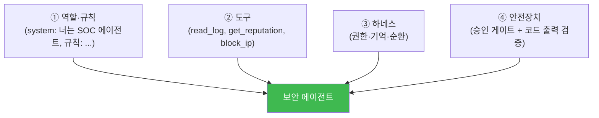
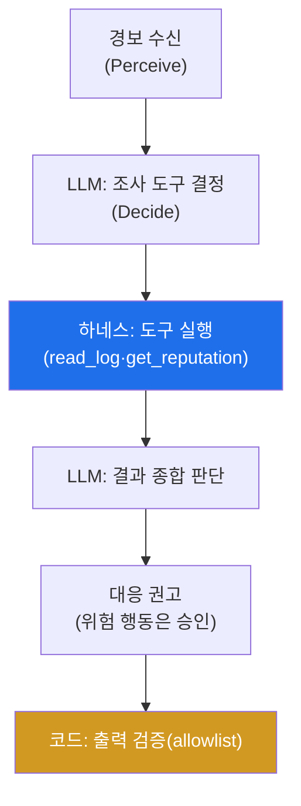

# aisec W08 — 중간 실습: 나만의 보안 에이전트 구축 (W01~W07 종합)

> **본 주차의 한 줄 요약**
>
> W01~W07로 에이전트의 기본기(순환·도구·프롬프트)와 하네스(서버·클라이언트)를 모두 배웠다. W08은 이를 **하나로
> 조립**해 **나만의 보안 에이전트**를 만드는 중간 실습이다. 조립할 부품은 넷: ① **역할·규칙**(system/CLAUDE.md로
> 정체성·판단 기준·안전 규칙), ② **도구**(로그 읽기·평판 조회·차단 등, Tool Calling), ③ **하네스**(권한·기억·
> 순환 제어), ④ **안전장치**(위험 도구 승인 게이트 + 코드 레벨 출력 검증). 이 넷을 갖춘 에이전트가 실제 보안
> 작업 — **경보를 받아 → 조사하고 → 판단해 → 대응을 권고** — 을 end-to-end로 수행한다. 핵심은 그동안 배운
> 원칙의 결합이다: **LLM은 판단(넓게 훑기), 코드는 검증·실행(좁혀 확정), 위험은 승인.**
>
> **한 줄 결론**: 보안 에이전트 = **역할·규칙 + 도구 + 하네스(권한·기억) + 안전장치**의 조립. LLM이 판단하고
> 코드가 검증·실행하며 위험 행동은 승인을 거친다 — W01~W07의 종합.

---

## 학습 목표

본 주차 종료 시 학생은 다음 5가지를 **본인 손으로** 할 수 있어야 한다.

1. 보안 에이전트의 4부품(역할·도구·하네스·안전장치)을 조립한다(AGENT_BUILT).
2. 경보→조사→판단→권고를 **end-to-end** 수행한다(E2E_OK).
3. 위험 도구에 **승인 게이트**를, 출력에 **코드 검증**을 건다(SAFE_OK).
4. LLM(판단)+코드(검증·실행)+승인의 결합을 설명한다.
5. 자신이 만든 에이전트의 한계·개선점을 평가한다.

> **이 주차의 시선** — 부품을 배웠으니, 이제 **작동하는 하나의 에이전트**를 조립해 증명한다.

---

## 0. 용어 해설 (종합)

| 용어 | 관련 주차 | 조립에서의 역할 |
|------|-----------|------------------|
| **역할·규칙** | W02·W03·W07 | system/CLAUDE.md로 정체성·판단·안전 |
| **도구·Tool Calling** | W02 | LLM이 도구 선택, 코드가 실행 |
| **하네스** | W04·W05 | 권한·기억·순환 제어 |
| **승인 게이트** | W02·W05 | 위험 행동에 사람 승인 |
| **코드 출력 검증** | W03 | 출력 allowlist로 인젝션·오류 차단 |

---

## 0.5 조립 설계 — 4부품과 e2e 흐름

### 0.5.1 4부품 조립도

### 0.5.2 e2e 흐름 — 경보에서 권고까지

경보를 받아 LLM이 조사 도구를 고르고, 하네스가 실행하고, LLM이 종합 판단해 권고하며, 위험 행동은 승인,
최종 출력은 코드가 검증한다. W01~W07의 모든 조각이 여기 모인다.

### 0.5.3 조립의 원칙 — 배운 것의 결합

- **LLM은 판단, 코드는 실행**(W02): LLM은 도구 선택·종합 판단, 실제 실행·검증은 코드.
- **넓게 훑고 좁혀 확정**(전 과목): LLM으로 넓게 조사·판단, 결정론으로 검증.
- **위험엔 승인**(W05): 차단·삭제는 사람 승인 게이트.
- **출력은 검증**(W03): 코드 allowlist로 인젝션·형식 오류 차단.

### 0.5.4 좋은 에이전트의 조건 — 자기 평가

만든 에이전트를 스스로 평가하라: (1) 판단이 일관적인가(프롬프트·few-shot), (2) 위험 행동에 승인이 걸리는가,
(3) 출력이 항상 파싱되는가(형식 강제), (4) 인젝션에 견고한가(코드 검증), (5) 무엇을 왜 했는지 로깅되는가
(관제 가능성). 이 다섯이 "장난감 에이전트"와 "실전 에이전트"를 가른다.

---

## 1. 중간 실습 안내 (5 미션 — 종합 조립)

실행 위치 el34 **호스트**(`ssh ccc@{{TARGET_IP}}`), GPU `http://211.170.162.139:10934`(gemma3:4b).

### STEP 1 — GPU 헬스체크 → GEN_OK
### STEP 2 — 에이전트 4부품 조립 → AGENT_BUILT
- **왜/무엇을:** 역할·도구·하네스·안전장치를 하나로 조립.
- **해석:** 4부품이 하나의 에이전트로.

### STEP 3 — e2e 실행(경보→권고) → E2E_OK
- **왜?** 실제 작업 수행.
- **무엇을?** 경보→LLM 조사 결정→도구 실행→LLM 판단→권고.
- **해석:** 부품들이 이어서 동작.

### STEP 4 — 안전장치 검증 → SAFE_OK
- **왜?** 실전 에이전트의 조건.
- **무엇을?** 위험 도구 승인 게이트 + 출력 코드 검증(allowlist) 작동 확인.
- **해석:** 승인+검증이 안전선.

### STEP 5 — 종합·자기 평가 → Assessment
- 조립·e2e·안전·자기 평가를 묶어 정리(Assessment).

---

## 2. 흔한 오해·관제자 노트

- **"돌아가면 완성"** — 안전장치(승인·검증)·로깅이 없으면 실전 불가. 좋은 에이전트의 5조건 확인.
- **"LLM이 다 판단"** — 실행·검증은 코드. LLM은 판단만.
- **"조립은 한 번으로 끝"** — 프롬프트·few-shot·안전장치를 반복 개선. 자기 평가로 약점 보완.
- **관제 관점** — 학생 에이전트가 승인 게이트·출력 검증·로깅을 갖췄는지, 위험 행동을 코드가 막는지 점검한다.
  중간 실습의 채점 관점이자 실전 에이전트의 기준.

---

## 3. 다음 주차 (W09) 예고 — 에이전트 보안 위협과 방어

전반부(W01~W08)가 "에이전트를 만드는 법"이었다면, 후반부는 그 에이전트를 **안전하게·크게** 만드는 법이다.
W09는 에이전트 자체의 보안 위협(프롬프트 인젝션·도구 오남용·권한 상승·데이터 유출)과 방어를 체계적으로 다룬다.
