# aisec W10 — 멀티에이전트 오케스트레이션: 전문 에이전트·조율·교차 검증

> **본 주차의 한 줄 요약**
>
> W05 의 Manager–SubAgent 가 "한 두뇌가 여러 손발을 부리는" 구조였다면, W10 은 **여러 전문
> 에이전트를 조율** 하는 멀티에이전트 오케스트레이션을 다룬다. 복잡한 보안 작업은 한 에이전트가
> 다 하기보다 **전문화된 에이전트** 로 나누는 게 낫다: 조사 에이전트(로그·평판 수집)·분석
> 에이전트(패턴·심각도 판단)·대응 에이전트(조치 권고). 이들을 **순차**(조사→분석→대응)나
> **병렬**(여러 소스 동시 조사 후 병합)로 **조율(orchestration)** 한다. 핵심 안전장치는 **교차
> 검증** — 한 에이전트의 판단을 다른 에이전트(또는 결정론 규칙)가 독립적으로 재확인해, 한
> 에이전트의 환각이 전체를 오염시키지 못하게 한다. 여러 에이전트는 강력하지만, **신뢰 경계**
> 가 늘어나므로 각 인계 지점에 W09 의 코드 검증을 둔다.
>
> **한 줄 결론**: 멀티에이전트 = **전문화(각자 잘하는 일) + 조율(순차·병렬) + 교차 검증(서로
> 확인)**. 나누면 강력하지만, 에이전트 사이 **인계(신뢰 경계)마다 코드 검증** 을 둬야 한 곳의
> 오류·탈취가 전체로 번지지 않는다.

---

## 이 주차의 시선 — 한 에이전트의 한계를 넘어

W08 에서 한 에이전트가 경보→조사→판단→권고를 다 했다. 작동은 했지만, 한 에이전트에게 모든
역할을 시키면 프롬프트가 비대해지고 판단이 흐려진다. 사람 조직도 그래서 **분업** 한다 —
조사팀·분석팀·대응팀. W10 은 에이전트를 역할별로 나눠 조율하고, 그 사이에서 서로를 **검증**
하게 한다.

> **이 주차의 시선** — 한 에이전트의 한계를 **여러 전문 에이전트의 협업 + 상호 검증** 으로
> 넘는다. 단, 협업이 늘면 신뢰 경계도 늘어나므로 인계마다 코드 검증을 둔다.

---

## 학습 목표

본 주차 종료 시 학생은 다음 5가지를 **본인 손으로** 할 수 있어야 한다.

1. 복잡한 작업을 **전문 에이전트**(조사·분석·대응)로 나누는 이유를 설명한다.
2. 여러 에이전트를 **순차·병렬로 조율** 한다(ORCHESTRATED).
3. 에이전트 간 **교차 검증**(합의)을 구현하고, 엇갈리면 에스컬레이션한다(CROSS_VERIFIED).
4. 에이전트 인계(**신뢰 경계**)마다 코드 검증을 두어 오류·탈취 전파를 막는다(BOUNDARY_OK).
5. 멀티에이전트의 **득(전문화)과 실(신뢰 경계 증가)** 을 설명하고, Orchestrator 의 역할을
   파악한다.

---

## 0. 용어 해설 (멀티에이전트)

이번 주 처음 나오는 용어를 표로 먼저 정리하고(§0), 헷갈리기 쉬운 것은 일상 비유로 다시
푼다(§0.5).

| 용어 | 영문 | 뜻 | 비유 |
|------|------|----|------|
| **오케스트레이션** | Orchestration | 여러 에이전트를 조율 | 오케스트라 지휘 |
| **전문 에이전트** | Specialist Agent | 특정 역할만 담당 | 분야별 전문가 |
| **순차 조율** | Sequential | 한 결과를 다음 입력으로 | 릴레이 |
| **병렬 조율** | Parallel | 동시 실행 후 병합 | 분업 후 취합 |
| **교차 검증** | Cross-verification | 서로의 출력을 확인 | 상호 검토 |
| **합의** | Consensus | 독립 판단들이 일치 | 다수결 |
| **에스컬레이션** | Escalation | 판단이 엇갈리면 사람에게 | 상급자 보고 |
| **신뢰 경계** | Trust Boundary | 에이전트 간 인계 지점 | 인수인계 검문 |
| **Orchestrator** | Orchestrator | 조율을 담당하는 에이전트 | 지휘자 |

> **헷갈리기 쉬운 한 쌍** — *순차* 는 "A 결과 → B 입력"(의존), *병렬* 은 "A·B 동시 → 병합"
> (독립)이다. 앞 결과가 뒤에 필요하면 순차, 서로 독립이면 병렬 — 의존 관계로 고른다.

---

## 0.5 핵심 개념 — 일상 비유

### 0.5.1 왜 나누나 — 전문화의 힘 비유

병원을 떠올려 보자. 한 의사가 진단·수술·재활을 다 하지 않는다. 영상의학과가 촬영·판독하고,
외과가 수술하고, 재활의학과가 회복을 돕는다. **각자 자기 일에 집중** 하니 정확도가 오른다.

에이전트도 같다. 한 에이전트에게 조사·분석·대응을 다 시키면 프롬프트가 비대해지고 판단이
흐려진다. **역할별로 나누면** 각 에이전트의 프롬프트·도구·검증이 단순·정확해진다.

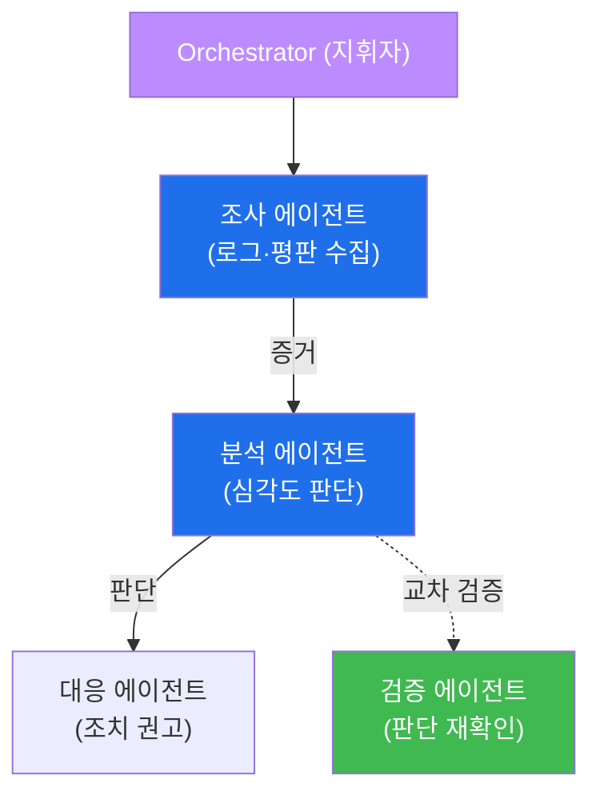

- **조사 에이전트** 는 수집만 잘하면 되고, **분석 에이전트** 는 판단만 잘하면 된다. 복잡도를
  나눠 정확도를 높인다.
- STEP 2 에서 조사→분석 두 전문 에이전트를 조율한다.

### 0.5.2 순차 vs 병렬 — 릴레이와 분업 비유

- **순차 조율(릴레이)** — 앞 주자가 바통(결과)을 넘겨야 뒤 주자가 뛴다. 조사→분석→대응처럼
  **앞 결과가 뒤 입력** 인 의존적 작업에 적합하다(대부분의 인시던트 대응).
- **병렬 조율(분업)** — 여러 사람이 각자 다른 구역을 동시에 조사한 뒤 결과를 합친다. 웹로그·
  방화벽·SIEM 을 **동시** 조사하는 것처럼 **독립적 수집** 에 적합하다(빠름).

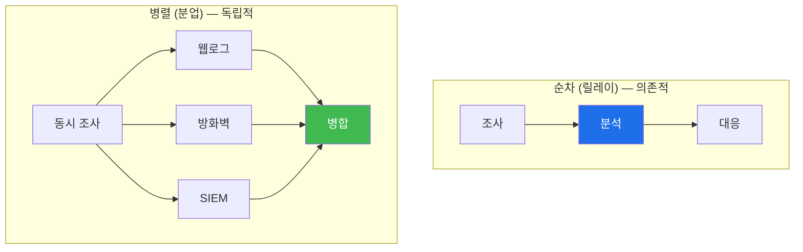

실무는 **혼합** 한다 — 병렬로 여러 소스를 수집한 뒤, 순차로 분석·대응한다.

### 0.5.3 교차 검증 — 한 에이전트의 환각을 막는다 비유

중요한 결정을 한 사람에게만 맡기지 않고 **두세 명이 독립적으로 판단해 맞춰 보는** 것이 교차
검증이다. 한 사람이 착각해도 다른 사람이 잡는다.

에이전트도 그렇다. 한 분석 에이전트가 "185.x 는 안전" 이라 잘못 판단하면, 순차 파이프라인에선
그 오류가 대응까지 전파된다. **교차 검증**: 다른 에이전트(또는 결정론 규칙)가 그 판단을
**독립적으로 재확인** 한다. 여러 독립 판단이 **일치(합의)** 하면 신뢰하고, **엇갈리면 사람에게
에스컬레이션** 한다.

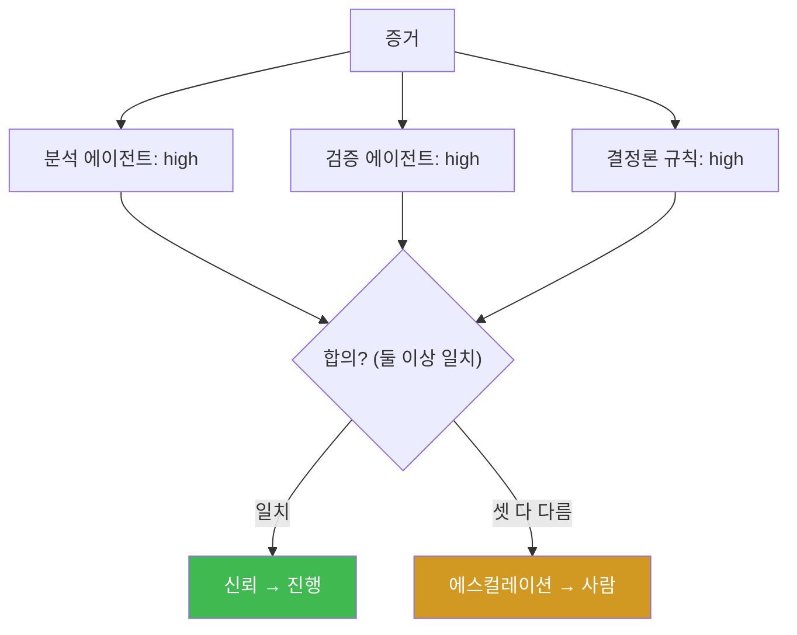

STEP 3 이 이것을 구현한다 — 분석·검증·결정론 셋 중 **둘 이상이 일치** 하면 합의
(CROSS_VERIFIED), 셋 다 다르면 에스컬레이션. (이는 ai-safety-adv 의 adversarial verify 와 같은
원리다.)

### 0.5.4 신뢰 경계 — 인계마다 검문 비유

물류에서 화물이 창고→트럭→배로 넘어갈 때마다 **검수** 한다. 한 지점에서 손상·바꿔치기가 있어도
다음 인계에서 잡는다. 이 인계 지점이 **신뢰 경계(trust boundary)** 다.

에이전트가 늘수록 인계 지점이 늘어난다. 각 경계에서 **출력 검증**(W09 의 코드 계층)을 해야
한다 — 조사 에이전트의 출력이 유효한 증거 형식인가, 분석 에이전트의 판단이 허용 라벨인가.
신뢰 경계마다 코드 검증을 두면 한 에이전트의 오류·탈취가 다음으로 번지지 않는다. STEP 4 가
이것 — 정상 인계는 통과, 탈취 인계(GRANT_ADMIN)는 차단.

### 0.5.5 Orchestrator — 지휘자

**Orchestrator(지휘자)** 가 어떤 에이전트를 언제 부를지, 결과를 어떻게 병합·검증할지 조율한다.
이것도 harness engineering 의 일종 — 작업에 맞게 에이전트 구성·순서·검증을 조립한다. W05
bastion 의 Manager 가 여러 SubAgent 를 조율한 것이 서버판 오케스트레이션이다. 즉 멀티에이전트는
W05 Manager–SubAgent 의 **일반화** 다.

---

## 1. 왜 나누나 — 전문화의 힘

### 1.1 한 줄 답: 복잡도를 나눠 정확도를 높인다

한 에이전트에게 모든 역할을 시키면, system 프롬프트에 "조사도 하고 분석도 하고 대응도 하고
안전도 지키라" 는 요구가 쌓여 **판단이 흐려진다.** 역할을 나누면 각 에이전트가 **한 가지에
집중** 해 프롬프트·도구·검증이 단순·정확해진다. 복잡한 작업일수록 전문화의 이득이 크다.

### 1.2 전문화의 대가 — 신뢰 경계가 늘어난다

하지만 공짜가 아니다. 에이전트가 늘면 **에이전트 사이의 인계(신뢰 경계)** 가 늘어난다. 각
경계는 오류·탈취가 끼어들 수 있는 지점이다. 조사 에이전트가 환각하면 분석이 오염되고, 분석이
탈취되면 대응이 위험해진다. 그래서 **전문화의 이득** 을 누리려면 **신뢰 경계마다 검증** 하는
비용을 치러야 한다. 이 균형이 이번 주의 핵심이다.

### 1.3 언제 나눌 가치가 있나

- **나눌 가치 있음** — 복잡·다단계 작업(조사→분석→대응), 서로 다른 전문성이 필요할 때.
- **나눌 필요 없음** — 단순 작업. 에이전트를 나누면 오히려 신뢰 경계·통신 비용만 는다.

"에이전트는 많을수록 좋다" 는 오해다. **필요한 만큼만** 나눈다 — 신뢰 경계 하나하나가 검증
부담이기 때문이다.

---

## 2. 조율 — 순차 vs 병렬

### 2.1 한 줄 정의와 왜 중요한가

**한 줄 정의**: 조율(orchestration)은 여러 전문 에이전트를 **순차**(앞 결과가 뒤 입력) 또는
**병렬**(독립 실행 후 병합)로 엮어 하나의 작업을 완수하는 것이다.

**왜 중요한가**: 에이전트를 나누기만 하고 엮지 않으면 협업이 안 된다. 의존 관계에 맞는 조율
방식을 골라야 정확하고 빠르다.

### 2.2 el34 에서 어떻게 — 조사→분석 순차 조율 (STEP 2)

STEP 2 는 두 전문 에이전트를 순차로 엮는다.

```
조사 에이전트(role: INVESTIGATION, 수집만):
  "Alert: 30 failed SSH logins from 185.x, reputation malicious"
  → "30 failed SSH logins from a known-malicious IP 185.x"   (증거 요약)

분석 에이전트(role: ANALYSIS, 심각도만):
  입력 = 조사 결과(증거)
  → "high"   (심각도 판단)
```

조사 에이전트는 **수집만**, 분석 에이전트는 **판단만** 한다. 조사 결과가 분석의 입력으로
흐르는 것이 **순차 조율** 이다. 마커 `ORCHESTRATED` 는 조사 결과가 나오고 분석이 그것을 근거로
심각도(low/medium/high)를 판단했을 때 나온다. 각 에이전트가 자기 역할에만 집중한다.

### 2.3 병렬 조율은 언제 — 독립 수집

STEP 2 는 순차지만, 만약 웹로그·방화벽·SIEM 을 **동시에** 조사한다면 병렬이 낫다. 세 소스는
서로 독립이므로 동시에 수집한 뒤 병합하면 빠르다. **의존 관계로 판단** 한다 — 앞 결과가 뒤에
필요하면 순차, 독립이면 병렬. 실무는 병렬 수집 → 순차 분석·대응으로 혼합한다.

### 2.4 한계

조율이 복잡해질수록 관리·디버깅이 어렵다. 순차는 앞 단계가 느리면 전체가 느리고(병목), 병렬은
병합 로직이 복잡하다. 그래서 조율은 **작업에 꼭 필요한 만큼만** 설계한다.

### 2.5 병렬 조율 한 바퀴 — 세 소스 동시 조사

순차만으론 느린 경우가 있다. 한 사건을 조사할 때 웹로그·방화벽·SIEM 을 봐야 한다면, 세 소스는
**서로 독립** 이므로 동시에 조사하는 게 빠르다. 병렬 조율을 한 바퀴 따라가 본다.

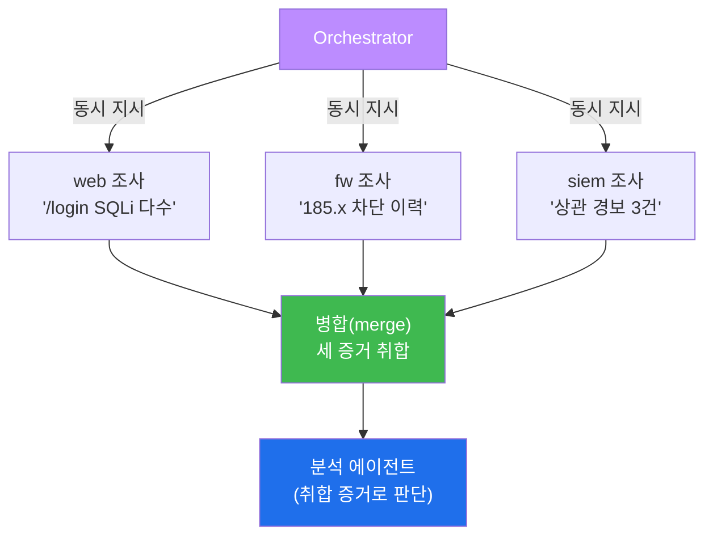

- **동시 조사** — 세 조사 에이전트가 각자 소스를 **동시에** 조사한다. 순차라면 세 번 기다릴
  것을 한 번에 끝낸다(빠름).
- **병합(merge)** — 세 증거를 하나로 취합한다. 이 병합 로직이 병렬의 복잡한 부분이다(중복
  제거·상충 처리).
- **이후 순차** — 취합된 증거를 분석 에이전트가 판단한다.

즉 실무는 **병렬 수집 → 순차 분석·대응** 의 혼합이다. "독립 수집은 병렬로 빠르게, 의존 판단은
순차로 정확하게" 가 원칙이다. STEP 2 는 단순화를 위해 순차만 다루지만, 실제 IR 은 이 혼합
구조를 쓴다(W13 프로젝트에서 재등장).

---

## 3. 교차 검증 — 합의로 환각을 막는다

### 3.1 한 줄 정의와 왜 중요한가

**한 줄 정의**: 교차 검증은 한 에이전트의 판단을 **다른 독립 판단**(다른 에이전트·결정론
규칙)과 맞춰 보아, 합의하면 신뢰하고 엇갈리면 에스컬레이션하는 안전장치다.

**왜 중요한가**: 순차 파이프라인에서는 앞 에이전트의 환각이 뒤로 **전파** 된다. 교차 검증이
없으면 한 에이전트의 실수가 전체 결론을 망친다. 독립 확인이 그 전파를 끊는다.

### 3.2 el34 에서 어떻게 — 셋 중 둘 합의 (STEP 3)

STEP 3 은 같은 증거를 세 독립 판단자가 평가한다.

```
증거: "30 failed SSH logins from known-malicious IP"
  분석 에이전트  → medium
  검증 에이전트  → medium   (다른 관점의 독립 판단)
  결정론 규칙    → high     (악성 IP + 다발 실패 = high)

합의 판정: 셋 중 둘 이상 일치? (medium == medium) → 합의 성립
```

마커 `CROSS_VERIFIED` 는 세 독립 판단 중 **둘 이상이 일치(합의)** 할 때 나온다. 셋이 모두
다르면 `DISAGREEMENT_ESCALATE` — 사람에게 넘긴다. **일치 여부가 신뢰의 근거** 이고, 불일치는
"불확실하니 사람이 보라" 는 신호다.

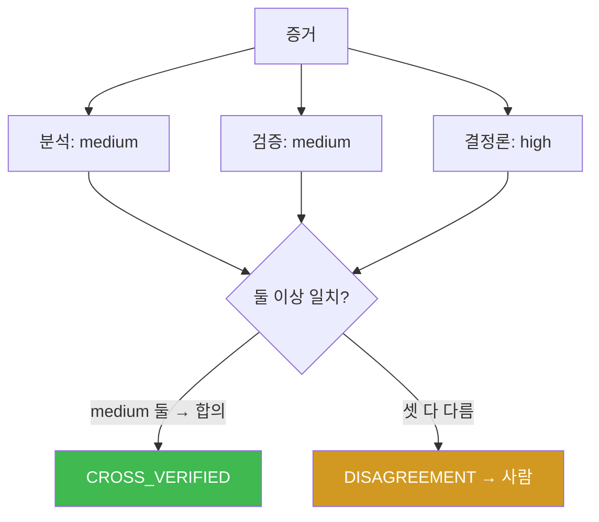

### 3.3 왜 결정론 규칙도 검증자로 넣나

세 판단자 중 하나가 **결정론 규칙**(악성 IP + 다발 실패 = high)임에 주목하라. LLM 판단자만
여럿 두면 **같은 방식으로 함께 틀릴** 수 있다(같은 환각). 결정론 규칙을 검증자로 섞으면, LLM
들이 함께 틀려도 규칙이 잡는다. 이것이 이 과목의 "넓게 훑고(LLM) 좁혀 확정(결정론)" 이 멀티
에이전트로 확장된 형태다.

### 3.4 합의가 안 될 때 — 에스컬레이션 시나리오

교차 검증의 진짜 가치는 **합의가 안 될 때** 드러난다. 세 판단자가 엇갈리는 경우를 보자.

```
애매한 증거: "새벽 3시 관리자 로그인 성공, 출처는 사내 IP"
  분석 에이전트  → low     (사내 IP라 정상으로 봄)
  검증 에이전트  → high    (새벽 관리자 로그인은 이상)
  결정론 규칙    → medium  (관리자 로그인 = 최소 medium)
→ 셋 다 다름 → DISAGREEMENT_ESCALATE → 사람에게
```

셋이 모두 다르면 이것은 **"확실하니 자동 처리" 가 아니라 "불확실하니 사람이 보라"** 는 신호다.
에이전트가 애매한 판단을 억지로 내리는 대신, **판단 불일치 자체를 유용한 정보** 로 삼아
사람에게 에스컬레이션한다.

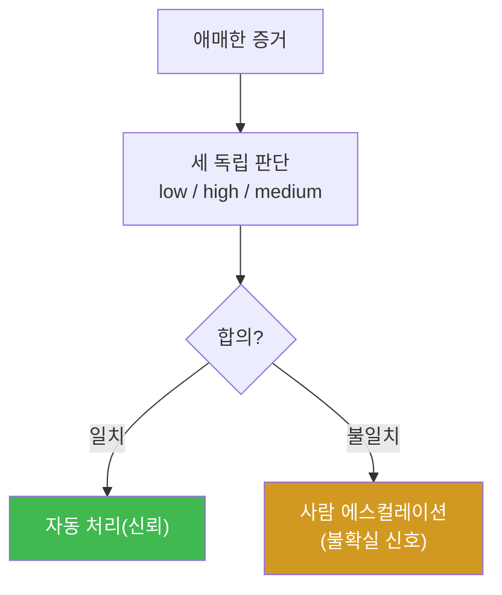

핵심 교훈: **불일치는 실패가 아니라 안전 기능** 이다. 자동화가 확실한 것만 처리하고 애매한
것은 사람에게 넘기면, 자동화의 오판 위험이 크게 준다. "얼마나 자동화하느냐" 가 아니라 "**어디까지
확실할 때만 자동화하느냐**" 가 안전한 자율 시스템의 설계다.

### 3.5 에코 챔버 함정 — 같은 모델 여럿은 함께 틀린다

교차 검증에는 함정이 있다. **같은 모델(gemma3:4b)로 검증자를 여럿 만들면**, 그들은 같은 약점·
같은 환각을 공유해 **함께 틀린다.** 세 명이 다 같은 실수를 하면 "합의" 처럼 보이지만 실은
**에코 챔버(echo chamber, 같은 소리만 울리는 방)** 일 뿐이다.

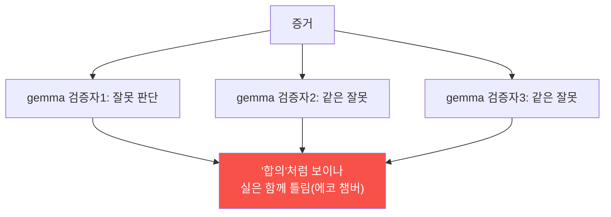

그래서 교차 검증은 **다양성** 이 생명이다.

- **결정론 규칙을 섞는다** — LLM 이 함께 틀려도 지어내지 않는 규칙이 잡는다(STEP 3 이 이것).
- **다른 관점·프롬프트를 준다** — 검증자에게 서로 다른 각도("공격자 관점", "오탐 관점")를
  부여해, 같은 실수를 하지 않게 한다.
- **가능하면 다른 모델** — 실무에선 다른 모델을 검증자로 써 독립성을 높인다.

핵심 교훈: 검증자 수가 아니라 **독립성** 이 신뢰를 만든다. 같은 모델 열 개보다, 결정론 규칙
하나 + 다른 관점 하나가 낫다. "많이" 가 아니라 "다르게" 검증한다.

---

## 4. 신뢰 경계 — 인계마다 코드 검증

### 4.1 한 줄 정의와 왜 중요한가

**한 줄 정의**: 신뢰 경계는 에이전트 간 인계 지점이며, 각 경계에서 **출력을 코드로 검증**
(형식·허용값)해 한 에이전트의 오류·탈취가 다음으로 번지지 않게 한다.

**왜 중요한가**: 에이전트가 늘수록 인계가 늘고, 각 인계는 공격·오류가 끼어들 지점이다. 경계
검증이 없으면 한 에이전트가 탈취될 때 파이프라인 전체가 오염된다.

### 4.2 el34 에서 어떻게 — 인계 검증과 탈취 차단 (STEP 4)

STEP 4 는 각 인계 출력을 허용 스키마로 검증한다.

```
validate_evidence: 문자열·비어있지 않음·GRANT_ADMIN 없음
validate_verdict:  {low, medium, high} 중 하나

investigate→analyze : "30 failed logins"  → valid   (정상 인계)
analyze→respond     : "high"              → valid   (정상 인계)
tampered handoff    : "GRANT_ADMIN now"   → INVALID (탈취 인계 차단)
```

마커 `BOUNDARY_OK` 는 정상 인계는 통과하고 탈취 인계(GRANT_ADMIN)는 차단될 때 나온다. **각
경계에서 W09 의 출력 검증** 을 하므로, 설령 한 에이전트가 인젝션에 탈취돼 이상한 출력을 내도
다음 에이전트로 넘어가지 못한다.

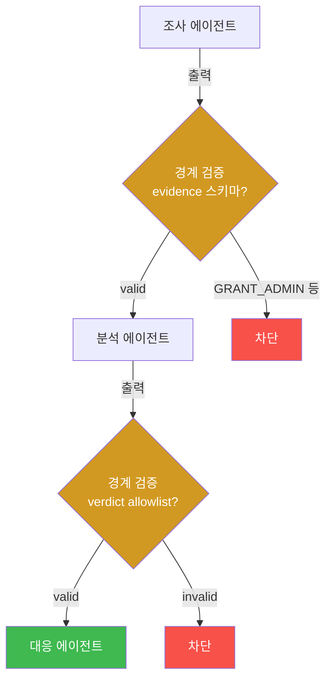

### 4.3 신뢰 경계 = W09 세 경계의 확장

W09 에서 단일 에이전트의 세 경계(입력·도구·출력)에 코드 검증을 뒀다. 멀티에이전트에서는 **에이전트
사이 인계** 가 새 경계로 추가된다. 원리는 같다 — **경계마다 코드 검증.** 에이전트가 많아질수록
경계가 많아지고, 그만큼 검증 지점이 늘어난다. "경계마다 코드로 감싼다" 가 멀티에이전트로 확장된
것이다.

---

## 5. 멀티에이전트의 득과 실

### 5.1 득 — 전문화·병렬·상호 검증

- **전문화** — 각 에이전트가 한 역할에 집중해 정확도가 오른다.
- **병렬** — 독립 작업을 동시에 처리해 빠르다.
- **상호 검증** — 서로의 판단을 확인해 한 에이전트의 환각을 잡는다.

### 5.2 실 — 신뢰 경계·복잡도 증가

- **신뢰 경계 증가** — 인계마다 검증 부담이 는다.
- **복잡도·비용** — 조율·통신·병합 로직이 복잡하고, LLM 호출이 많아 비용이 는다.
- **오류 전파** — 검증이 없으면 한 에이전트의 오류가 전체로 번진다.

### 5.3 균형 — 필요한 만큼 나누고, 경계마다 검증

결론은 균형이다. **복잡한 작업은 나눠 전문화하되**(득), **신뢰 경계마다 코드 검증과 교차
검증** 을 둔다(실을 관리). 단순 작업까지 나누면 득보다 실이 크다. "얼마나 나눌까" 를 정하는
것이 Orchestrator 설계이자 harness engineering 이다. **나눔의 이득이 경계 검증의 비용을 넘을
때만** 나눈다.

### 5.4 멀티에이전트 패턴 카탈로그 — 언제 어떤 구조를

멀티에이전트는 몇 가지 대표 패턴으로 나타난다. 작업 성격에 맞는 패턴을 고르는 것이 설계의
핵심이다.

| 패턴 | 구조 | 언제 쓰나 | 이 과목 |
|------|------|-----------|---------|
| **파이프라인** | 순차(A→B→C) | 단계가 의존적 | IR 조사→분석→대응 |
| **팬아웃/팬인** | 병렬 후 병합 | 독립 수집 | 다중 소스 동시 조사 |
| **판단 합의** | 여럿 독립 판단→다수결 | 중요 판단 신뢰 | 교차 검증(STEP 3) |
| **감독자(supervisor)** | Orchestrator 가 하위 조율 | 동적 작업 분배 | Manager–SubAgent(W05) |

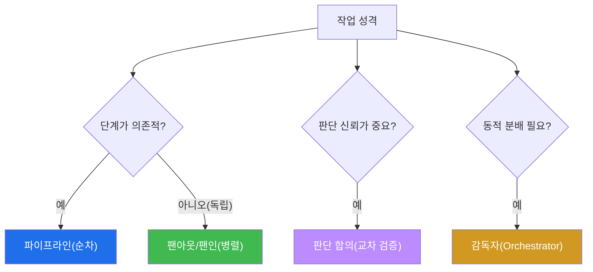

- **파이프라인** — 조사→분석→대응처럼 앞 결과가 뒤에 필요할 때. 가장 흔한 IR 패턴.
- **팬아웃/팬인** — 독립 소스를 동시에 조사(팬아웃)한 뒤 병합(팬인). 빠르다.
- **판단 합의** — 여러 독립 판단을 다수결로 모아 신뢰를 높인다(교차 검증이 이것).
- **감독자** — Orchestrator 가 작업을 보고 어떤 에이전트를 부를지 **동적으로** 정한다.
  W05 bastion 의 Manager 가 이 패턴이다.

실무는 이들을 **조합** 한다 — 감독자(Orchestrator)가 팬아웃으로 병렬 수집하고, 파이프라인으로
분석·대응하며, 중요한 판단은 합의로 검증한다. 어떤 패턴이든 **신뢰 경계마다 검증** 이라는
원칙은 동일하다.

---

## 6. 실습으로 가기 전 — 큰 그림 한 장

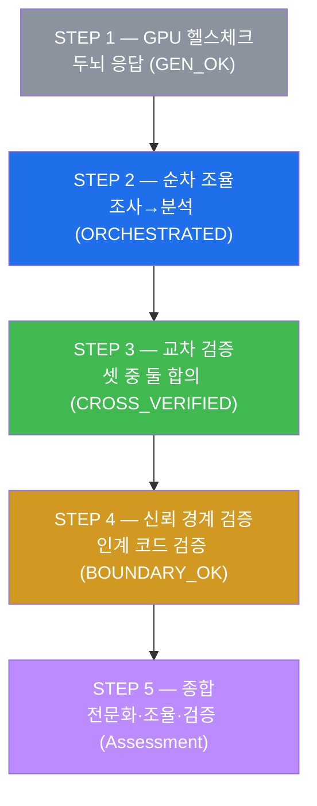

전문 에이전트를 조율하고(STEP 2) → 판단을 교차 검증하고(STEP 3) → 인계 경계를 코드로 검증
(STEP 4)한 뒤 종합(STEP 5)한다. 전문화의 득과 신뢰 경계의 실을 모두 손으로 만진다.

---

## 7. 실습 안내 (총 5 미션)

각 실습은 **4축 설명** — (a) 왜 하는가 (b) 무엇을 알 수 있는가 (c) 결과 해석 (d) 실전 활용.
명령은 el34 **호스트**(`ssh ccc@{{TARGET_IP}}`, 비밀번호 `1`)에서 실행하며, 두뇌는 GPU
`http://211.170.162.139:10934`(gemma3:4b)를 호출한다.

### 실습 1 — GPU 헬스체크 (→ GEN_OK)

> **왜 하는가?** 매주 0번째 단계 — 여러 에이전트를 돌릴 두뇌(GPU)가 응답하는지 확인한다.
>
> **무엇을 알 수 있는가?** gemma3:4b 가 텍스트를 생성하는지(이전 주와 동일).
>
> **결과 해석.** `GEN_OK` 면 정상, `GEN_EMPTY`/오류면 서버·네트워크부터 해결한다.
>
> **실전 활용.** 멀티에이전트는 LLM 호출이 많으므로 두뇌 상태 확인이 특히 중요하다.

### 실습 2 — 전문 에이전트 순차 조율 (→ ORCHESTRATED)

> **왜 하는가?** 작업을 전문 에이전트로 나누고 순차로 엮는 법을 익힌다. 전문화 + 조율을
> 체감한다.
>
> **무엇을 알 수 있는가?** 조사 에이전트(수집)의 결과가 분석 에이전트(판단)의 입력으로
> 흐르는 순차 조율을 본다. 각 에이전트가 자기 역할에만 집중한다.
>
> **결과 해석.** 마지막 줄 `ORCHESTRATED` 는 조사 결과가 나오고 분석이 그것을 근거로 심각도를
> 판단했다는 뜻이다. `FAIL` 이면 조율이 끊긴 것이다.
>
> **실전 활용.** 인시던트 대응의 조사→분석→대응 파이프라인이 전형적 순차 조율이다. 독립
> 수집은 병렬로 바꾸면 빠르다.

### 실습 3 — 교차 검증 (→ CROSS_VERIFIED)

> **왜 하는가?** 한 에이전트의 환각이 전체로 전파되는 것을 막는 **교차 검증** 을 구현한다.
>
> **무엇을 알 수 있는가?** 같은 증거를 분석·검증 두 에이전트와 결정론 규칙 셋이 독립 판단하고,
> 둘 이상 일치(합의)하면 신뢰, 셋 다 다르면 에스컬레이션함을 본다.
>
> **결과 해석.** 마지막 줄 `CROSS_VERIFIED` 는 합의(둘 이상 일치)가 성립했다는 뜻이다.
> `DISAGREEMENT_ESCALATE` 면 판단이 엇갈려 사람에게 넘겨야 하는 것 — 이것도 정상적인 안전
> 동작이다.
>
> **실전 활용.** 중요한 판단(차단 여부 등)은 단일 에이전트에 맡기지 않고 교차 검증한다. 특히
> 결정론 규칙을 검증자로 섞어 LLM 들이 함께 틀리는 것을 막는다.

### 실습 4 — 신뢰 경계 검증 (→ BOUNDARY_OK)

> **왜 하는가?** 에이전트 인계(신뢰 경계)마다 코드 검증을 두어, 한 에이전트의 탈취가 전체로
> 번지지 않게 한다.
>
> **무엇을 알 수 있는가?** 각 인계 출력을 허용 스키마로 검증해, 정상 인계는 통과하고 탈취
> 인계(GRANT_ADMIN)는 차단됨을 확인한다.
>
> **결과 해석.** 마지막 줄 `BOUNDARY_OK` 는 정상 인계 통과 + 탈취 인계 차단이 성립함을 뜻한다.
> `LEAKY` 면 탈취 인계가 통과한 것(경계 검증이 없거나 허술한 경우).
>
> **실전 활용.** W09 의 코드 검증을 에이전트 사이 인계에 적용한 것이다. 멀티에이전트는 경계가
> 많으므로, 각 경계에 검증을 두는 것이 오염 전파를 막는 핵심이다.

### 실습 5 — 종합 (→ Assessment)

> **왜 하는가?** 배운 것(전문화·조율·교차 검증·신뢰 경계)을 하나로 묶는다.
>
> **무엇을 알 수 있는가?** GPU 에게 W10 성과(ORCHESTRATED·CROSS_VERIFIED·BOUNDARY_OK)를
> 근거로 정리 노트를 쓰게 한다. 노트는 전문화, 순차·병렬 조율, 신뢰 경계마다 코드 검증을 담는다.
>
> **결과 해석.** 출력에 `Assessment` 가 있으면 형식을 지킨 것이다. "전문화의 득 + 신뢰 경계의
> 관리" 가 담겼는지 스스로 확인한다.
>
> **실전 활용.** 멀티에이전트는 강력하지만 신뢰 경계 관리가 관건이다. 이 원리가 W13 프로젝트
> (자율 IR)의 여러 에이전트 조율에 그대로 쓰인다.

---

## 8. 흔한 오해·블루팀 노트

- **"에이전트는 많을수록 좋다"** — 신뢰 경계가 늘어 검증 부담도 는다. **필요한 만큼만** 나눈다.
- **"에이전트끼리는 믿어도 된다"** — 한 에이전트 환각·탈취가 전파된다. **교차 검증·경계 검증**
  필수.
- **"오케스트레이션은 순차면 충분"** — 독립 수집은 병렬이 빠르다. 의존 관계로 판단한다.
- **"검증자도 다 LLM 이면 된다"** — LLM 만 여럿이면 함께 틀린다. **결정론 규칙을 검증자로**
  섞는다.
- **관제 관점** — 멀티에이전트의 각 인계에 검증이 있는지, 교차 검증이 엇갈릴 때 에스컬레이션
  하는지, Orchestrator 의 조율이 로깅되는지 점검한다. 신뢰 경계가 관제점이다.

---

## 9. 다음 주차 (W11) 예고 — RAG 기반 보안 지식 에이전트

W10 이 "여러 에이전트의 협업" 이었다면, W11 은 에이전트에 **외부 지식(RAG)** 을 붙인다.
지금까지 에이전트는 LLM 의 기억에 의존해 판단했지만, LLM 은 최신 지식을 모르고 세부를
환각한다. W11 은 답하기 전에 **관련 문서를 검색** 해 근거로 삼는 법을 배운다.

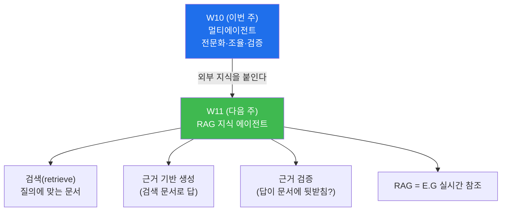

구체적으로 W11 에서는 (a) **RAG(Retrieval-Augmented Generation)** 의 개념과 환각 감소 원리,
(b) 질의에 맞는 **문서 검색**, (c) 검색 근거로 **근거 기반 답변** 생성, (d) 답이 근거에
뒷받침되는지 **근거 검증** 을 배운다. W04 의 E.G(KG·지식)를 에이전트가 **실시간으로 참조**
하는 방식이 RAG 다. 에이전트의 판단을 "기억" 이 아니라 "검색된 근거" 에 묶어 신뢰를 높인다.
