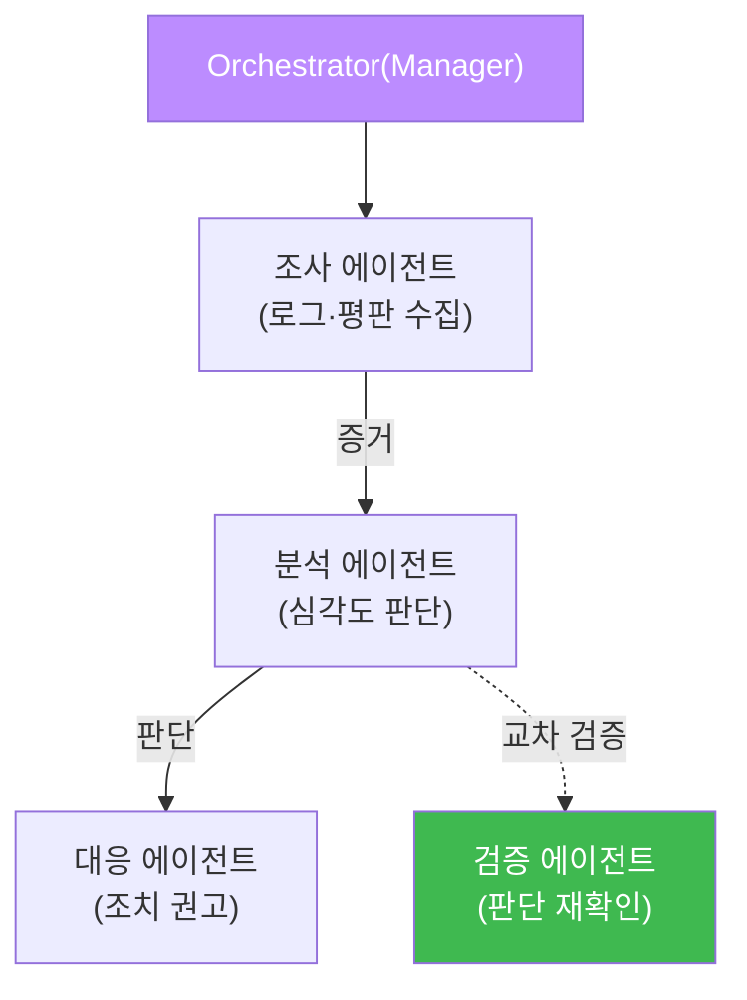

# aisec W10 — 멀티에이전트 오케스트레이션: 전문 에이전트·조율·교차 검증

> **본 주차의 한 줄 요약**
>
> W05의 Manager–SubAgent가 "한 두뇌가 여러 손발을 부리는" 구조였다면, W10은 **여러 전문 에이전트를 조율**하는
> 멀티에이전트 오케스트레이션을 다룬다. 복잡한 보안 작업은 한 에이전트가 다 하기보다, **전문화된 에이전트**로
> 나누는 게 낫다: 조사 에이전트(로그·평판 수집)·분석 에이전트(패턴·심각도 판단)·대응 에이전트(조치 권고).
> 이들을 **순차**(조사→분석→대응)나 **병렬**(여러 소스 동시 조사 후 병합)로 **조율(orchestration)** 한다. 핵심
> 안전장치는 **교차 검증** — 한 에이전트의 출력을 다른 에이전트가 검증해, 한 에이전트의 환각이 전체를 오염시키지
> 못하게 한다. 여러 에이전트는 강력하지만, **신뢰 경계**가 늘어나므로 각 인계 지점에 검증이 필요하다.
>
> **한 줄 결론**: 멀티에이전트 = **전문화(각자 잘하는 일) + 조율(순차·병렬) + 교차 검증(서로 확인)**. 나누면
> 강력하지만, 에이전트 사이 인계마다 검증을 둬야 한 곳의 오류가 전체로 번지지 않는다.

---

## 학습 목표

본 주차 종료 시 학생은 다음 5가지를 **본인 손으로** 할 수 있어야 한다.

1. **전문 에이전트**(조사·분석·대응)로 나누는 이유를 설명한다.
2. 여러 에이전트를 **조율**(순차·병렬)한다(ORCHESTRATED).
3. 에이전트 간 **교차 검증**을 구현한다(CROSS_VERIFIED).
4. 멀티에이전트의 **신뢰 경계**와 검증 필요를 설명한다.
5. Manager 오케스트레이터의 조율 패턴을 파악한다.

> **이 주차의 시선** — 한 에이전트의 한계를 여러 전문 에이전트의 협업+상호 검증으로 넘는다.

---

## 0. 용어 해설 (멀티에이전트)

| 용어 | 영문 | 뜻 | 비유 |
|------|------|----|------|
| **오케스트레이션** | Orchestration | 여러 에이전트 조율 | 오케스트라 지휘 |
| **전문 에이전트** | Specialist Agent | 특정 역할 담당 | 분야별 전문가 |
| **순차 조율** | Sequential | 한 결과를 다음 입력으로 | 릴레이 |
| **병렬 조율** | Parallel | 동시 실행 후 병합 | 분업 후 취합 |
| **교차 검증** | Cross-verification | 서로의 출력 확인 | 상호 검토 |
| **신뢰 경계** | Trust Boundary | 에이전트 간 인계 지점 | 인수인계 검문 |

> **헷갈리기 쉬운 한 쌍** — *순차* 는 "A 결과→B 입력"(의존), *병렬* 은 "A·B 동시→병합"(독립)이다. 의존 관계에
> 따라 고른다.

---

## 0.5 신입생 친화 핵심 개념

### 0.5.1 왜 나누나 — 전문화의 힘

한 에이전트에게 조사·분석·대응을 다 시키면 프롬프트가 비대해지고 판단이 흐려진다. **역할별로 나누면** 각
에이전트의 프롬프트·도구·검증이 단순·정확해진다. 조사 에이전트는 수집만 잘하면 되고, 분석 에이전트는 판단만
잘하면 된다. 복잡도를 나눠 정확도를 높인다.

### 0.5.2 순차 vs 병렬 조율

- **순차**: 조사→분석→대응. 앞 결과가 뒤 입력. 의존적 작업에 적합(대부분의 IR).
- **병렬**: 여러 소스(웹로그·방화벽·SIEM)를 **동시** 조사한 뒤 **병합**. 독립적 수집에 적합(빠름).
- 실무는 혼합: 병렬로 수집 → 순차로 분석·대응.

### 0.5.3 교차 검증 — 한 에이전트의 환각을 막는다

한 에이전트가 "185.x는 안전"이라 잘못 판단하면, 순차 파이프라인에선 그 오류가 대응까지 전파된다. **교차
검증**: 다른 에이전트(또는 결정론 규칙)가 그 판단을 **독립적으로 재확인**한다. 두 판단이 엇갈리면 사람에게
에스컬레이션. 멀티에이전트의 필수 안전장치다(ai-safety-adv의 adversarial verify와 같은 원리).

### 0.5.4 신뢰 경계 — 인계마다 검증

에이전트가 늘수록 **인계 지점(신뢰 경계)** 이 늘어난다. 각 경계에서 **출력 검증**(W09의 코드 계층)을 해야
한다: 조사 에이전트의 출력이 유효한 증거 형식인가, 분석 에이전트의 판단이 허용 라벨인가. 신뢰 경계마다 코드
검증을 두면 한 에이전트의 오류·탈취가 다음으로 번지지 않는다.

### 0.5.5 Orchestrator — 지휘자

**Orchestrator(Manager)** 가 어떤 에이전트를 언제 부를지, 결과를 어떻게 병합·검증할지 조율한다. 이것도
harness engineering의 일종 — 작업에 맞게 에이전트 구성·순서·검증을 조립한다. bastion의 Manager가 여러
SubAgent를 조율하는 것이 서버판 오케스트레이션이다.

---

## 1. 실습 안내 (5 미션)

실행 위치 el34 **호스트**(`ssh ccc@{{TARGET_IP}}`), GPU `http://211.170.162.139:10934`(gemma3:4b).

### STEP 1 — GPU 헬스체크 → GEN_OK
### STEP 2 — 전문 에이전트 조율 → ORCHESTRATED
- **왜/무엇을:** 조사→분석 두 전문 에이전트를 순차 조율(한 결과를 다음 입력으로).
- **해석:** 전문화+조율.

### STEP 3 — 교차 검증 → CROSS_VERIFIED
- **왜?** 한 에이전트 환각 차단.
- **무엇을?** 분석 판단을 검증 에이전트/결정론이 독립 재확인, 일치 확인.
- **해석:** 서로 확인해 신뢰.

### STEP 4 — 신뢰 경계 검증 → BOUNDARY_OK
- **왜?** 인계마다 안전.
- **무엇을?** 에이전트 인계 출력을 코드로 형식·허용값 검증.
- **해석:** 경계마다 코드 검증.

### STEP 5 — 종합 → Assessment
- 전문화·조율·교차 검증·신뢰 경계를 묶어 정리(Assessment).

---

## 2. 흔한 오해·블루팀 노트

- **"에이전트 많을수록 좋다"** — 신뢰 경계가 늘어 검증 부담도 는다. 필요한 만큼만 나눈다.
- **"에이전트끼리는 믿어도 된다"** — 한 에이전트 환각·탈취가 전파된다. 교차 검증·경계 검증 필수.
- **"오케스트레이션은 순차면 충분"** — 독립 수집은 병렬이 빠르다. 의존 관계로 판단.
- **관제 관점** — 멀티에이전트의 각 인계 지점에 검증이 있는지, 교차 검증이 엇갈릴 때 에스컬레이션하는지,
  Orchestrator의 조율이 로깅되는지 점검한다. 신뢰 경계가 관제점.

---

## 3. 다음 주차 (W11) 예고 — RAG 기반 보안 지식 에이전트

W10이 "여러 에이전트의 협업"이었다면, W11은 에이전트에 **외부 지식(RAG)** 을 붙인다. 보안 문서·CVE·플레이북을
검색해 근거로 삼는 RAG(Retrieval-Augmented Generation) 에이전트를 만들어, 환각을 줄이고 최신 지식에 기반한
판단을 하게 한다.
