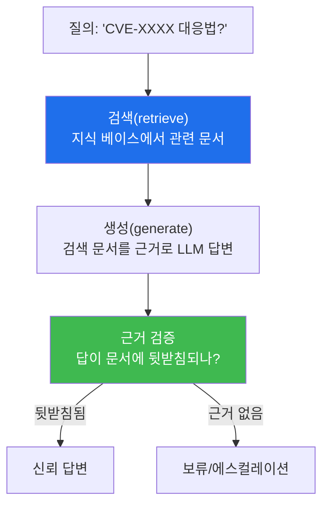

# aisec W11 — RAG 기반 보안 지식 에이전트: 검색 증강·근거 기반 판단·환각 감소

> **본 주차의 한 줄 요약**
>
> LLM은 학습 시점 이후의 지식을 모르고, 세부를 **환각**한다. W11은 이를 **RAG(Retrieval-Augmented Generation,
> 검색 증강 생성)** 로 보완한다. RAG는 답하기 전에 **관련 문서를 검색**해(보안 정책·CVE·플레이북·자산 정보)
> 그 문서를 **근거로** LLM이 답하게 한다. "LLM의 기억"이 아니라 "검색된 근거"에 기반하므로, 최신 지식을 쓰고
> 환각이 준다. 흐름은 **질의→검색(retrieve)→근거 주입→생성(generate)→근거 검증**이다. 이것이 W04의 E.G(KG·
> 지식)를 에이전트가 **실시간으로 참조**하는 방식이다. 핵심 안전장치는 **근거 검증** — 생성된 답이 실제 검색
> 문서에 뒷받침되는지 확인해, "그럴듯하지만 근거 없는" 답을 걸러낸다.
>
> **한 줄 결론**: RAG = **검색된 근거에 기반해 답하기**. LLM의 기억 대신 실시간 검색 지식을 써서 최신성·정확성을
> 얻는다. 단, 생성된 답이 근거에 실제로 뒷받침되는지 **검증**해야 RAG의 이점이 산다.

---

## 학습 목표

본 주차 종료 시 학생은 다음 5가지를 **본인 손으로** 할 수 있어야 한다.

1. **RAG**의 개념(검색 증강)과 환각 감소 원리를 설명한다.
2. 질의에 맞는 **문서를 검색(retrieve)** 한다(RETRIEVED).
3. 검색 근거로 **근거 기반 답변(grounded)** 을 생성한다(GROUNDED).
4. 답이 근거에 뒷받침되는지 **근거 검증**한다(GROUND_VERIFIED).
5. RAG가 E.G(KG·지식)의 실시간 참조임을 설명한다.

> **이 주차의 시선** — 에이전트의 판단을 "기억"이 아니라 "검색된 근거"에 묶어 신뢰를 높인다.

---

## 0. 용어 해설 (RAG)

| 용어 | 영문 | 뜻 | 비유 |
|------|------|----|------|
| **RAG** | Retrieval-Augmented Generation | 검색으로 보강해 생성 | 자료 찾아 답하기 |
| **검색(retrieve)** | Retrieval | 질의에 맞는 문서 찾기 | 도서 검색 |
| **근거 기반** | Grounded | 검색 문서에 기반한 답 | 출처 있는 답 |
| **지식 베이스** | Knowledge Base | 검색 대상 문서 모음 | 자료실 |
| **임베딩** | Embedding | 의미를 벡터로 | 의미 좌표 |
| **환각** | Hallucination | 근거 없는 그럴듯한 답 | 지어내기 |

> **헷갈리기 쉬운 한 쌍** — *LLM 단독 답* 은 "기억에서"(환각 위험), *RAG 답* 은 "검색된 근거에서"(출처 있음)다.
> 근거의 유무가 신뢰를 가른다.

---

## 0.5 신입생 친화 핵심 개념

### 0.5.1 왜 RAG인가 — 기억의 한계

LLM은 (1) 학습 이후 지식을 모르고(최신 CVE 모름), (2) 세부를 지어낸다(존재하지 않는 CVE 번호). 보안은
**정확한 최신 지식**이 생명이다. RAG는 답하기 전에 **신뢰된 문서를 검색**해 근거로 삼아, 이 두 문제를 함께
해결한다.

### 0.5.2 검색(Retrieve) — 어떻게 관련 문서를 찾나

- **키워드 검색**: 질의 단어가 포함된 문서(간단·빠름).
- **의미 검색(임베딩)**: 질의와 문서를 벡터로 바꿔 **의미가 가까운** 문서(동의어·문맥 처리). 실무는 주로 임베딩.
- 이번 주 실습은 개념 이해를 위해 키워드/간단 매칭으로 검색을 구현한다(원리는 동일: 질의↔문서 관련도).

### 0.5.3 근거 기반 생성 — 검색 문서를 프롬프트에 넣는다

검색된 문서를 프롬프트의 **컨텍스트**로 넣고 "이 문서에 근거해서만 답하라"고 지시한다. 그러면 LLM은 기억이
아니라 **주어진 근거**로 답한다. "문서에 없으면 모른다고 하라"를 더하면 환각이 크게 준다.

### 0.5.4 근거 검증 — RAG의 안전장치

RAG도 완벽하지 않다. LLM이 검색 문서를 무시하고 지어낼 수 있다. 그래서 **근거 검증**: 생성된 답의 핵심 주장이
검색 문서에 **실제로 있는지** 확인(키워드·인용 대조). 근거가 없으면 답을 보류하거나 에스컬레이션. "넓게 훑고
좁혀 확정"의 RAG판이다.

### 0.5.5 RAG = E.G의 실시간 참조

W04에서 E.G의 KG(지식)를 말했다. RAG는 그 **지식을 에이전트가 실시간으로 검색·참조**하는 방식이다. 보안
정책·플레이북·CVE·자산 정보를 지식 베이스로 두면, 에이전트가 매 판단에서 최신 근거를 끌어와 쓴다. bastion의
Manager도 harness engineering 시 E.G(KG)를 이렇게 참조한다.

---

## 1. 실습 안내 (5 미션)

실행 위치 el34 **호스트**(`ssh ccc@{{TARGET_IP}}`), GPU `http://211.170.162.139:10934`(gemma3:4b).

### STEP 1 — GPU 헬스체크 → GEN_OK
### STEP 2 — 문서 검색 → RETRIEVED
- **왜/무엇을:** 질의에 맞는 문서를 지식 베이스에서 검색.
- **해석:** 관련 근거 찾기.

### STEP 3 — 근거 기반 생성 → GROUNDED
- **왜?** 검색 근거로 답변.
- **무엇을?** 검색 문서를 컨텍스트로 넣어 LLM이 근거 기반 답변.
- **해석:** 기억 아닌 근거로.

### STEP 4 — 근거 검증 → GROUND_VERIFIED
- **왜?** RAG 안전장치.
- **무엇을?** 답의 핵심이 검색 문서에 뒷받침되는지 대조.
- **해석:** 근거 없으면 보류.

### STEP 5 — 종합 → Assessment
- 검색·근거 생성·근거 검증·E.G를 묶어 정리(Assessment).

---

## 2. 흔한 오해·관제자 노트

- **"RAG면 환각 없음"** — 줄지만 없어지진 않는다. LLM이 근거를 무시할 수 있어 근거 검증 필수.
- **"검색만 잘하면 끝"** — 검색+근거 생성+근거 검증이 한 세트. 검증이 빠지면 RAG 이점이 샌다.
- **"지식 베이스는 아무 문서나"** — 신뢰된·최신 문서만. 오염된 지식(W07)이 들어가면 근거도 오염.
- **관제 관점** — 에이전트의 지식 베이스가 신뢰·최신인지, 답이 근거에 뒷받침되는지(근거 검증), 근거 없는 답을
  보류하는지 점검한다. RAG의 신뢰는 지식 베이스 품질 + 근거 검증에 달렸다.

---

## 3. 다음 주차 (W12) 예고 — 에이전트 평가와 벤치마크

W11까지 에이전트를 만들고 지식을 붙였다면, W12는 그 에이전트가 **얼마나 잘하는지 측정**하는 평가·벤치마크를
다룬다. 정확도·안전성·비용을 정량 지표로 재고, 회귀(성능 저하)를 잡는 테스트 세트를 만들어, 에이전트를
데이터로 개선하는 법을 배운다.
