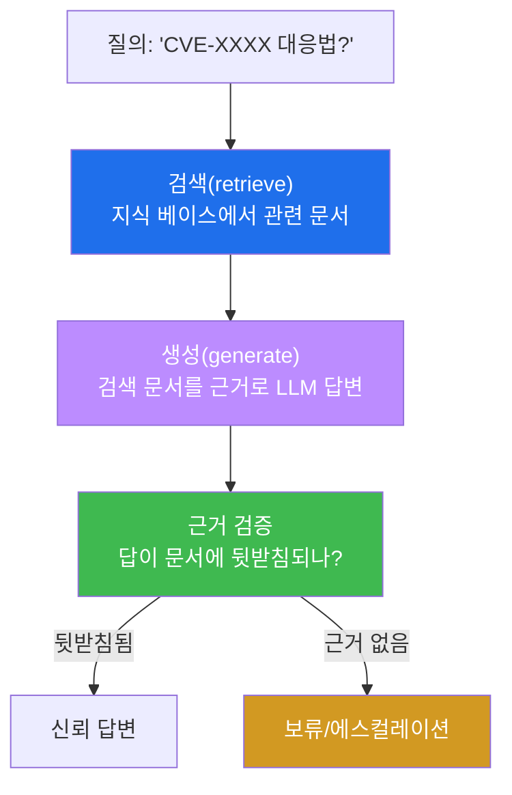
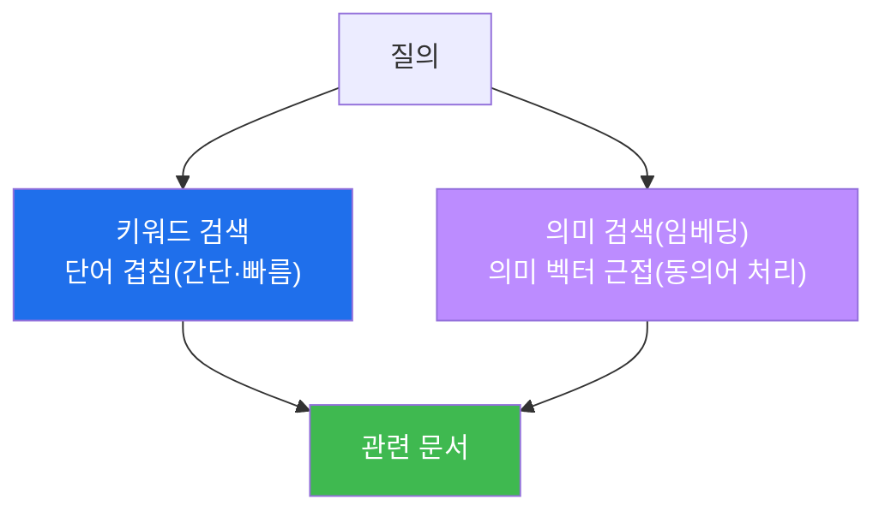
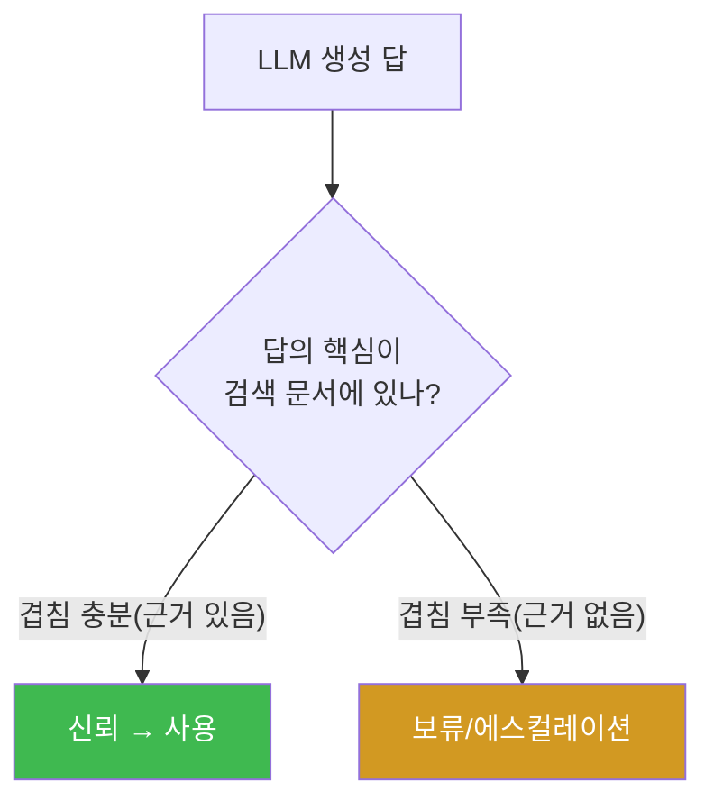
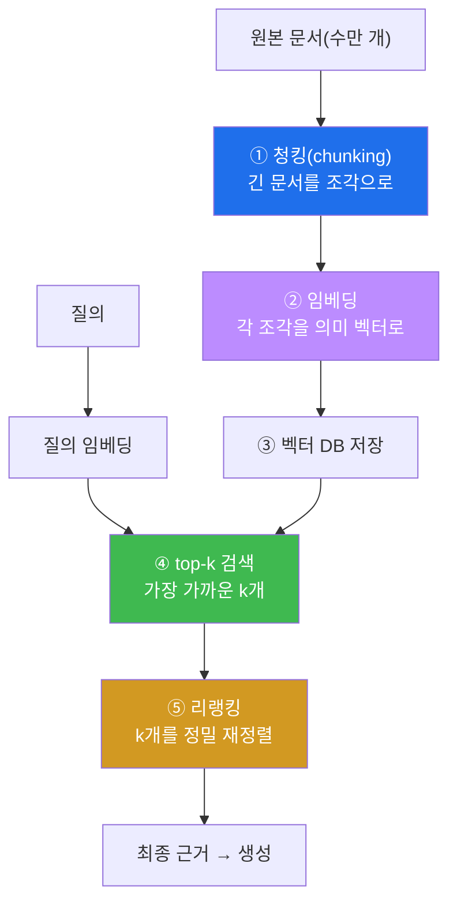
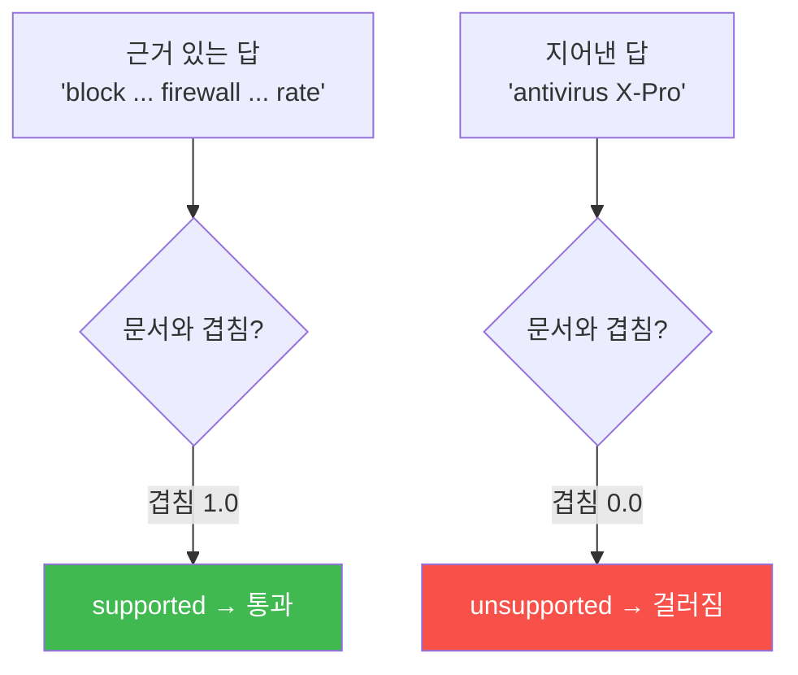
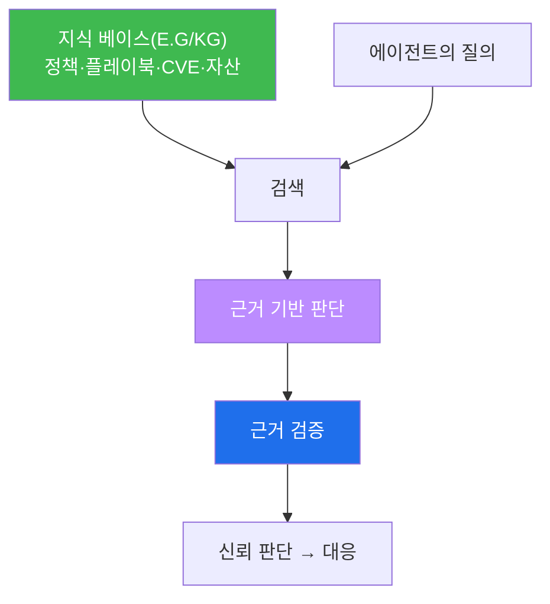
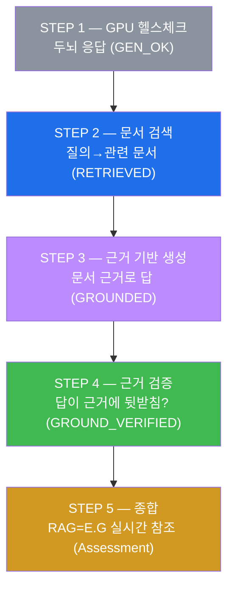
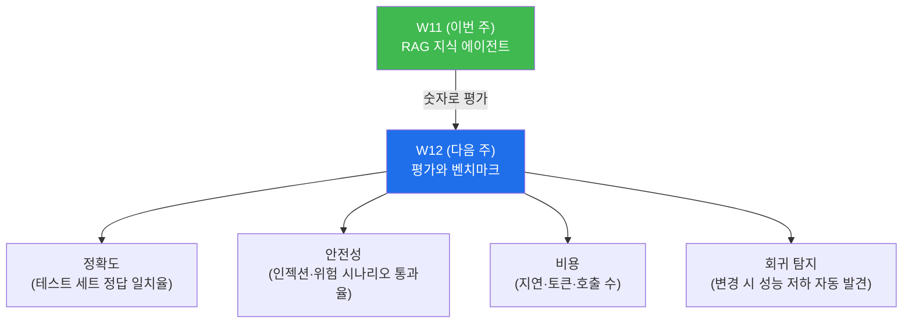

# aisec W11 — RAG 기반 보안 지식 에이전트: 검색 증강·근거 기반 판단·환각 감소

> **본 주차의 한 줄 요약**
>
> LLM 은 학습 시점 이후의 지식을 모르고, 세부를 **환각** 한다(존재하지 않는 CVE 번호를 지어
> 내는 식). W11 은 이를 **RAG(Retrieval-Augmented Generation, 검색 증강 생성)** 로 보완한다.
> RAG 는 답하기 전에 **관련 문서를 검색** 해(보안 정책·CVE·플레이북·자산 정보) 그 문서를
> **근거로** LLM 이 답하게 한다. "LLM 의 기억" 이 아니라 "검색된 근거" 에 기반하므로, 최신
> 지식을 쓰고 환각이 준다. 흐름은 **질의→검색(retrieve)→근거 주입→생성(generate)→근거 검증**
> 이다. 이것이 W04 의 E.G(KG·지식)를 에이전트가 **실시간으로 참조** 하는 방식이다. 핵심 안전
> 장치는 **근거 검증** — 생성된 답이 실제 검색 문서에 뒷받침되는지 확인해, "그럴듯하지만 근거
> 없는" 답을 걸러낸다.
>
> **한 줄 결론**: RAG = **검색된 근거에 기반해 답하기**. LLM 의 기억 대신 실시간 검색 지식을
> 써서 최신성·정확성을 얻는다. 단, 생성된 답이 근거에 실제로 뒷받침되는지 **검증** 해야 RAG 의
> 이점이 산다. "넓게 훑고 좁혀 확정" 이 RAG 에선 "검색해서 답하고(넓게) 근거로 검증(좁혀)" 이
> 된다.

---

## 이 주차의 시선 — 기억에서 검색된 근거로

지금까지 에이전트는 LLM 의 **기억** 으로 판단했다. 하지만 기억에는 두 문제가 있다 — (1) 학습
이후 지식을 모르고(최신 CVE 모름), (2) 세부를 지어낸다(환각). 보안은 **정확한 최신 지식** 이
생명이다. 사람 전문가도 애매하면 **자료를 찾아본다.** W11 은 에이전트에게 그 "자료를 찾아
근거로 삼는" 능력을 붙인다.

> **이 주차의 시선** — 에이전트의 판단을 "기억" 이 아니라 "**검색된 근거**" 에 묶어 신뢰를
> 높인다. 그리고 그 근거가 실제로 답을 뒷받침하는지 **검증** 한다.

---

## 학습 목표

본 주차 종료 시 학생은 다음 5가지를 **본인 손으로** 할 수 있어야 한다.

1. **RAG** 의 개념(검색 증강)과 환각 감소 원리를 설명한다.
2. 질의에 맞는 **문서를 검색(retrieve)** 한다(RETRIEVED).
3. 검색 근거로 **근거 기반 답변(grounded)** 을 생성한다(GROUNDED).
4. 답이 근거에 뒷받침되는지 **근거 검증(grounding verification)** 한다(GROUND_VERIFIED).
5. RAG 가 E.G(KG·지식)의 실시간 참조이며, 지식 베이스 품질과 근거 검증이 신뢰를 결정함을
   설명한다.

---

## 0. 용어 해설 (RAG)

이번 주 처음 나오는 용어를 표로 먼저 정리하고(§0), 헷갈리기 쉬운 것은 일상 비유로 다시
푼다(§0.5).

| 용어 | 영문 | 뜻 | 비유 |
|------|------|----|------|
| **RAG** | Retrieval-Augmented Generation | 검색으로 보강해 생성 | 자료 찾아 답하기 |
| **검색** | Retrieval | 질의에 맞는 문서 찾기 | 도서 검색 |
| **근거 기반** | Grounded | 검색 문서에 기반한 답 | 출처 있는 답 |
| **근거 검증** | Grounding Verification | 답이 문서에 뒷받침되나 확인 | 인용 대조 |
| **지식 베이스** | Knowledge Base (KB) | 검색 대상 문서 모음 | 자료실 |
| **키워드 검색** | Keyword Search | 질의 단어 겹침으로 찾기 | 색인 찾기 |
| **임베딩** | Embedding | 의미를 숫자 벡터로 표현 | 의미 좌표 |
| **의미 검색** | Semantic Search | 의미가 가까운 문서 찾기 | 뜻으로 찾기 |
| **환각** | Hallucination | 근거 없는 그럴듯한 답 | 지어내기 |

> **헷갈리기 쉬운 한 쌍** — *LLM 단독 답* 은 "기억에서"(환각 위험), *RAG 답* 은 "검색된
> 근거에서"(출처 있음)다. **근거의 유무** 가 신뢰를 가른다. RAG 는 "무엇을 아는가" 를 기억이
> 아니라 검색으로 조달한다.

---

## 0.5 핵심 개념 — 일상 비유

### 0.5.1 왜 RAG 인가 — 기억의 한계 비유

시험을 두 방식으로 본다고 하자. **암기 시험(LLM 단독)** 은 머릿속 기억에만 의존한다 — 최신
내용을 모르거나, 헷갈리면 그럴듯하게 지어낸다. **오픈북 시험(RAG)** 은 **자료를 찾아보고**
답한다 — 최신 자료를 쓰고, 근거를 대며, 지어내지 않는다.

보안은 오픈북이어야 한다. 최신 CVE·정책·플레이북을 **찾아보고** 답해야 정확하다. RAG 는
에이전트를 오픈북 시험 방식으로 바꾼다.



### 0.5.2 검색(Retrieve) — 어떻게 관련 문서를 찾나

- **키워드 검색** — 질의 단어가 포함된 문서를 찾는다(간단·빠름). "SSH brute force" 질의에
  그 단어가 든 문서를 고른다. 이번 주 실습이 쓰는 방식이다.
- **의미 검색(임베딩)** — 질의와 문서를 **숫자 벡터(임베딩)** 로 바꿔 **의미가 가까운** 문서를
  찾는다. "무차별 로그인 공격" 과 "brute force" 처럼 **단어는 달라도 뜻이 같은** 경우도
  잡는다. 실무는 주로 임베딩을 쓴다.



> **임베딩이란?** **임베딩(embedding)** 은 텍스트의 **의미를 숫자 벡터(좌표)로 표현** 한
> 것이다. 의미가 비슷한 텍스트는 벡터 공간에서 가깝다. 그래서 "질의 벡터에 가까운 문서 벡터"
> 를 찾으면 **단어가 달라도 뜻이 통하는** 문서를 검색할 수 있다. 이번 주 실습은 원리 이해를
> 위해 키워드 검색을 쓰지만(질의↔문서 관련도), 임베딩도 "질의와 관련된 문서를 찾는다" 는
> 원리는 동일하다.

### 0.5.3 근거 기반 생성 — 검색 문서를 컨텍스트에 넣는다

검색된 문서를 프롬프트의 **컨텍스트** 로 넣고 **"이 문서에 근거해서만 답하라"** 고 지시한다.
그러면 LLM 은 기억이 아니라 **주어진 근거** 로 답한다. 여기에 **"문서에 없으면 모른다고
하라"** 를 더하면 환각이 크게 준다.

STEP 3 이 이것이다 — 브루트포스 플레이북 문서를 컨텍스트로 넣고, "문서에 근거해서만" 답하게
해, 답에 문서의 핵심(차단·방화벽/속도제한)이 반영되는지 본다.

### 0.5.4 근거 검증 — RAG 의 안전장치

RAG 도 완벽하지 않다. LLM 이 검색 문서를 **무시하고 지어낼** 수 있다. 그래서 **근거 검증** 을
둔다: 생성된 답의 핵심 주장이 검색 문서에 **실제로 있는지** 대조(키워드·인용)한다. 근거가
없으면 답을 보류하거나 에스컬레이션한다.



STEP 4 가 이것이다 — 근거 있는 답(문서와 겹침 높음)은 통과, 지어낸 답(문서에 없는
"antivirus X-Pro")은 걸러낸다. "넓게 훑고 좁혀 확정" 의 RAG 판이다.

### 0.5.5 RAG = E.G 의 실시간 참조

W04 에서 E.G 의 KG(지식)를 말했다. RAG 는 그 **지식을 에이전트가 실시간으로 검색·참조** 하는
방식이다. 보안 정책·플레이북·CVE·자산 정보를 지식 베이스로 두면, 에이전트가 매 판단에서 **최신
근거를 끌어와** 쓴다. W05 bastion 의 Manager 도 harness engineering 시 E.G(KG)를 이렇게
참조한다. **RAG 는 "E.G 에 어떻게 접근하는가" 의 구체적 방법** 이다.

---

## 1. RAG 란 — 기억 대신 검색된 근거

### 1.1 한 줄 답: 답하기 전에 자료를 찾는다

**RAG** 는 LLM 이 답하기 전에 **관련 문서를 검색해 근거로 삼는** 방식이다. 흐름은 **검색
(retrieve) → 생성(generate) → 검증(verify grounding)** 이다. LLM 의 기억이 아니라 검색된 근거로
답하므로, 최신성과 정확성이 오른다.

### 1.2 왜 기억만으론 부족한가

LLM 의 기억에는 두 근본 한계가 있다.

- **최신성 없음** — 학습 시점 이후의 지식(새 CVE·바뀐 정책)을 모른다.
- **환각** — 세부를 지어낸다(존재하지 않는 CVE 번호, 잘못된 대응 절차).

보안 판단이 틀리면 대가가 크다. RAG 는 **신뢰된 최신 문서를 검색해 근거로 삼아** 두 문제를
함께 해결한다. 기억을 안 쓰는 게 아니라, **기억을 검색된 근거로 보강** 한다.

### 1.3 RAG 의 신뢰는 두 가지에 달렸다

RAG 가 신뢰할 수 있으려면 두 가지가 필요하다.

- **지식 베이스 품질** — 검색 대상 문서가 **신뢰되고 최신** 이어야 한다. 오염·낡은 문서를
  검색하면 근거도 오염된다(§5).
- **근거 검증** — 생성된 답이 근거에 실제로 뒷받침되는지 확인해야 한다. 검증이 없으면 LLM 이
  근거를 무시해도 잡지 못한다.

이 둘이 빠지면 RAG 의 이점이 샌다. "검색만 붙이면 안전" 이 아니라 **품질 + 검증** 이 신뢰를
만든다.

### 1.4 RAG vs 단독 LLM — 한 예로

RAG 가 무엇을 바꾸는지, 최신 CVE 대응을 묻는 예로 대비해 본다.

**❌ 단독 LLM (기억으로 답)**

```
질문: "CVE-2024-XXXX(최근 취약점) 대응법?"
답:   "CVE-2024-XXXX 는 원격 코드 실행 취약점으로, 패치 3.2.1 을 적용하세요."
      → 학습 이후 CVE 라 모름 → 그럴듯한 번호·패치를 지어냄(환각). 위험.
```

**✅ RAG (검색된 근거로 답)**

```
질문: "CVE-2024-XXXX 대응법?"
검색: 지식 베이스에서 해당 CVE 문서 검색 → "영향: X 라이브러리 1.0~1.4, 조치: 1.5 로 업그레이드"
답:   "검색된 문서에 따르면, X 라이브러리 1.5 로 업그레이드하세요."
      → 검색된 실제 문서 근거 → 정확. 근거 검증 통과.
```

| 항목 | 단독 LLM | RAG |
|------|----------|-----|
| 최신 지식 | 학습 시점까지만 | KB 갱신으로 최신 |
| 환각 | 세부 지어냄 | 근거로 억제 |
| 출처 | 없음 | 검색 문서(감사 가능) |
| 신뢰 | 낮음(검증 불가) | 근거 검증으로 확보 |

같은 모델인데 **검색된 근거를 붙이는 것만** 으로 "지어내는 답" 이 "출처 있는 답" 이 된다.
보안처럼 정확성과 감사가 중요한 도메인에서 RAG 가 필수인 이유다.

---

## 2. 검색(Retrieve) — 관련 문서 찾기

### 2.1 한 줄 정의와 왜 중요한가

**한 줄 정의**: 검색은 질의에 **관련된 문서를 지식 베이스에서 찾는** 단계다. 키워드 겹침이나
의미 근접(임베딩)으로 관련도를 잰다.

**왜 중요한가**: 검색이 틀리면(엉뚱한 문서를 가져오면) 그 뒤 생성·검증이 다 어긋난다. **검색
품질이 RAG 품질의 출발점** 이다.

### 2.2 el34 에서 어떻게 — 플레이북 검색 (STEP 2)

STEP 2 는 보안 플레이북 지식 베이스에서 질의에 맞는 문서를 찾는다.

```
지식 베이스(KB):
  pb-bruteforce : "SSH brute force: block the source IP ... enable rate limiting"
  pb-sqli       : "SQL injection: add a WAF rule ... patch parameterized query"
  pb-malware    : "Malware alert: isolate the host ... full endpoint scan"

질의: "How to respond to an SSH brute force attack?"
→ 검색: 질의 단어와 겹침이 가장 큰 문서 = pb-bruteforce
```

마커 `RETRIEVED` 는 브루트포스 질의에 `pb-bruteforce` 문서가 검색됐을 때 나온다. 질의 단어
("SSH", "brute", "force")와 문서의 겹침이 가장 큰 것을 고른 것이다. 엉뚱한 문서가 나오면
`WRONG_DOC` — 검색이 틀렸다는 신호다.

### 2.3 키워드의 한계와 임베딩

키워드 검색은 간단하지만 한계가 있다 — **단어가 다르면 못 찾는다.** "무차별 로그인 시도" 라는
질의는 "brute force" 문서와 단어가 안 겹쳐 놓칠 수 있다. **임베딩(의미 검색)** 은 의미로
찾으므로 이 문제를 푼다. 실무는 임베딩을 쓰되, 원리는 같다 — **질의와 가장 관련된 문서를
찾는다.** 이번 주는 원리 이해를 위해 키워드로 구현한다.

### 2.4 실무 RAG 파이프라인 — 청킹·임베딩·top-k·리랭킹

이번 주 실습은 문서 3개짜리 미니 KB 에 키워드 검색이지만, 실무 RAG 는 문서가 수만 개다. 그래서
몇 단계가 더 붙는다. 각 단계를 짚어 둔다(개념 이해용).



- **① 청킹(chunking)** — 긴 문서를 **적당한 조각(chunk)** 으로 나눈다. 문서 전체가 아니라
  관련 **조각** 만 검색·주입해 컨텍스트를 아낀다(참고서의 "컨텍스트 절약" 원칙).
- **② 임베딩** — 각 조각을 의미 벡터로 바꾼다(§0.5.2).
- **③ 벡터 DB** — 벡터들을 저장해 빠른 근접 검색을 가능하게 한다.
- **④ top-k 검색** — 질의 벡터에 **가장 가까운 k개** 조각을 가져온다(k=3~5 등). 하나만 쓰면
  놓칠 수 있으므로 여러 개를 후보로.
- **⑤ 리랭킹(reranking)** — top-k 후보를 더 정밀한 모델로 **재정렬** 해 가장 관련된 것을 위로.

실무 RAG 는 이렇게 정교하지만, **핵심 흐름(검색→생성→검증)은 이번 주 실습과 동일** 하다.
미니 KB 로 원리를 잡으면, 실무 파이프라인은 이 원리에 규모·정밀도를 더한 것일 뿐이다.

> **왜 top-k(여러 개)를 쓰나?** 문서 하나만 가져오면, 그 검색이 틀렸을 때 근거가 통째로
> 어긋난다. 여러 후보(k개)를 가져와 리랭킹하면, 관련 문서를 놓칠 확률이 준다. "넓게 검색하고
> (top-k) 좁혀 확정(리랭킹)" — 이 과목의 척추가 검색에도 적용된다.

---

## 3. 근거 기반 생성 (Grounded)

### 3.1 한 줄 정의와 왜 중요한가

**한 줄 정의**: 근거 기반 생성은 검색된 문서를 **컨텍스트로 넣고 "그 문서에 근거해서만"** 답
하게 하는 것이다. LLM 의 기억이 아니라 주어진 근거로 답한다.

**왜 중요한가**: 문서를 검색만 하고 "근거해서만 답하라" 고 안 하면, LLM 이 여전히 기억(환각)
으로 답할 수 있다. 근거에 묶는 지시가 환각 감소의 핵심이다.

### 3.2 el34 에서 어떻게 — 문서를 컨텍스트로 (STEP 3)

STEP 3 은 검색 문서를 컨텍스트로 넣고 근거에 묶는다.

```
system: Answer ONLY using the provided context.
        If the context lacks the answer, say 'not in context'.
user:   Context: SSH brute force: block the source IP at the firewall and enable rate limiting.
        Question: How should I respond to an SSH brute force?

→ 답: "Block the source IP at the firewall and enable rate limiting."
```

마커 `GROUNDED` 는 답에 문서의 핵심(차단 + 방화벽/속도제한)이 반영됐을 때 나온다. **"문서에
근거해서만"** 지시 덕분에 LLM 이 기억이 아니라 주어진 근거로 답한 것이다. `"not in context"`
안전장치까지 더하면, 근거 없는 질문에 지어내지 않고 "모른다" 고 한다.

### 3.3 한계

근거 기반 지시도 소형 모델에선 완벽하지 않다 — LLM 이 지시를 무시하고 기억으로 답할 수 있다.
그래서 다음 단계(근거 검증)가 필요하다. 생성 단계의 "근거해서만" 은 1차 방어, 검증 단계가
2차 방어다(방어 심층화가 RAG 에도 적용).

---

## 4. 근거 검증 (Grounding Verification)

### 4.1 한 줄 정의와 왜 중요한가

**한 줄 정의**: 근거 검증은 생성된 답의 핵심 주장이 검색 문서에 **실제로 뒷받침되는지** 대조해,
근거 없는 답을 걸러내는 RAG 의 안전장치다.

**왜 중요한가**: LLM 은 근거를 무시하고 그럴듯하게 지어낼 수 있다. 근거 검증이 없으면 "출처
있어 보이지만 실은 지어낸" 답이 통과한다. 검증이 RAG 의 신뢰를 완성한다.

### 4.2 el34 에서 어떻게 — 답↔문서 대조 (STEP 4)

STEP 4 는 답과 문서의 **겹침** 으로 근거 여부를 판정한다.

```
문서: "SSH brute force: block the source IP at the firewall and enable rate limiting"

근거 있는 답: "Block the source IP at the firewall and enable rate limiting"
  → 문서와 겹침 1.0 → supported=True  (통과)

지어낸 답: "Install antivirus X-Pro version 9 and reboot into safe mode"
  → 문서와 겹침 0.0 → supported=False (걸러짐)
```

마커 `GROUND_VERIFIED` 는 근거 있는 답은 통과하고 지어낸 답은 걸러질 때 나온다. 답의 핵심어가
문서에 실제로 있는지(겹침이 임계 이상인지) 대조하는 것이다. **"그럴듯하지만 근거 없는" 답을
차단** 하는 것이 이 단계의 역할이다.



### 4.3 한계 — 겹침 검증의 정교함

키워드 겹침 검증은 간단하지만 거칠다 — 답이 문서를 **그대로 베끼면** 겹침은 높지만 실제로
질문에 답했는지는 별개다. 실무에선 더 정교한 검증(문장 단위 대조, 별도 검증 LLM 으로 "이 답이
이 문서에 근거하나?" 판정)을 쓴다. 하지만 원리는 같다 — **답이 근거에 뒷받침되는지 독립적으로
확인** 한다. 근거 검증은 완벽하진 않아도, 명백한 환각(문서와 무관한 답)을 걸러내는 강력한
안전망이다.

---

## 5. RAG = E.G 실시간 참조 — 그리고 한계

### 5.1 RAG 로 에이전트가 지식을 조달한다

RAG 는 W04 의 E.G(KG·지식)를 **실시간으로 참조** 하는 방법이다. 지식 베이스에 보안 정책·
플레이북·CVE·자산 정보를 두면, 에이전트가 매 판단에서 관련 근거를 검색해 쓴다. 앞서 만든
에이전트(W08)에 RAG 를 붙이면, "기억으로 판단" 하던 것이 "검색된 근거로 판단" 으로 바뀐다 —
신뢰가 크게 오른다.



### 5.2 한계 — 오염된 지식과 검색 실패

RAG 도 두 가지로 뚫린다.

- **오염된 지식 베이스** — 잘못된·낡은 문서가 KB 에 있으면, 검색된 근거도 오염된다(W06 데이터
  중독). 그래서 KB 에는 **신뢰된·최신 문서만** 넣고 검증한다. "쓰레기 넣으면 쓰레기 나온다."
- **검색 실패** — 관련 문서가 없거나 검색이 엉뚱하면, 근거 없이 답하게 된다. 그래서 "관련
  문서 없음 → 모른다고 하기(not in context)" 를 명시하고, 근거 검증으로 걸러낸다.

두 한계 모두 방어는 같다 — **KB 품질 관리 + 근거 검증.** RAG 는 마법이 아니라, 신뢰된 지식과
검증이 뒷받침될 때만 이점이 산다.

### 5.3 RAG 도 "넓게 훑고 좁혀 확정"

정리하면 RAG 는 이 과목의 척추를 그대로 따른다 — **검색해서 근거로 답하고(넓게 훑기), 그 답이
근거에 뒷받침되는지 검증(좁혀 확정)** 한다. LLM 의 유연함(근거 해석)을 코드의 신뢰(근거 대조)로
감싸는 것이다. 에이전트에 지식을 붙이는 일조차 이 원칙 위에 있다.

### 5.4 RAG 실패 사례 카탈로그 — 어디서 뚫리나

RAG 가 "검색 → 생성 → 검증" 세 단계이므로, 실패도 각 단계에서 다른 모습으로 나타난다. 증상과
방어를 카탈로그로 정리한다.

| 실패 유형 | 어디서 | 증상 | 방어 |
|-----------|--------|------|------|
| **검색 실패** | 검색 | 엉뚱한/무관한 문서 검색 | 임베딩·리랭킹·"없으면 모른다" |
| **근거 무시** | 생성 | 문서 있는데 기억으로 답(환각) | 근거 지시 + 근거 검증 |
| **오염 근거** | 지식 베이스 | 낡은·잘못된 문서를 근거로 | KB 품질 관리·검증 |
| **부분 근거** | 검증 | 답 일부만 근거 있고 일부는 지어냄 | 문장 단위 근거 검증 |

- **검색 실패** — 관련 문서를 못 찾으면 근거 없이 답하게 된다. 방어: 더 나은 검색(임베딩·
  리랭킹) + "관련 문서 없으면 모른다고 하기".
- **근거 무시** — 문서를 줬는데도 LLM 이 기억으로 답한다(소형 모델에서 흔함). 방어: 근거 지시
  강화 + **근거 검증**(STEP 4)으로 걸러내기.
- **오염 근거** — KB 자체가 잘못되면 근거도 잘못된다(W06 데이터 중독). 방어: KB 에 신뢰된
  문서만, 주기적 검증·갱신.
- **부분 근거** — 답의 절반은 문서 근거, 절반은 지어냄. 가장 교묘하다. 방어: 답을 문장 단위로
  쪼개 각각 근거를 대조.

핵심 교훈: RAG 는 "붙이면 끝" 이 아니라, **각 단계마다 실패할 수 있고 각각 방어가 필요** 하다.
그래도 세 방어(좋은 검색·근거 지시·근거 검증)를 겹치면, 단독 LLM 보다 훨씬 신뢰할 수 있다.
여기서도 **방어 심층화** 가 원칙이다.

---

## 6. 실습으로 가기 전 — 큰 그림 한 장



검색(STEP 2) → 근거 기반 생성(STEP 3) → 근거 검증(STEP 4) → 종합(STEP 5). RAG 의 세 단계
(retrieve→generate→verify)를 순서대로 만든다.

---

## 7. 실습 안내 (총 5 미션)

각 실습은 **4축 설명** — (a) 왜 하는가 (b) 무엇을 알 수 있는가 (c) 결과 해석 (d) 실전 활용.
명령은 el34 **호스트**(`ssh ccc@{{TARGET_IP}}`, 비밀번호 `1`)에서 실행하며, 두뇌는 GPU
`http://211.170.162.139:10934`(gemma3:4b)를 호출한다.

### 실습 1 — GPU 헬스체크 (→ GEN_OK)

> **왜 하는가?** 매주 0번째 단계 — 두뇌(GPU)가 응답하는지 확인한다.
>
> **무엇을 알 수 있는가?** gemma3:4b 가 텍스트를 생성하는지(이전 주와 동일).
>
> **결과 해석.** `GEN_OK` 면 정상, `GEN_EMPTY`/오류면 서버·네트워크부터 해결한다.
>
> **실전 활용.** 근거 생성에 쓸 두뇌 상태 확인.

### 실습 2 — 문서 검색 (→ RETRIEVED)

> **왜 하는가?** RAG 의 출발점인 **검색** 을 만든다. 검색이 틀리면 뒤가 다 어긋남을 체감한다.
>
> **무엇을 알 수 있는가?** 보안 플레이북 지식 베이스에서 브루트포스 질의에 맞는 문서
> (pb-bruteforce)를 질의↔문서 관련도로 찾는 법을 본다.
>
> **결과 해석.** 마지막 줄 `RETRIEVED` 는 올바른 문서(pb-bruteforce)가 검색됐다는 뜻이다.
> `WRONG_DOC` 면 엉뚱한 문서를 가져온 것 — 검색 관련도 계산을 점검한다.
>
> **실전 활용.** 실무는 임베딩(의미 검색)을 쓰지만 원리는 같다. 검색 품질이 RAG 품질의
> 출발점이므로, 관련 문서를 정확히 찾는 것이 중요하다.

### 실습 3 — 근거 기반 생성 (→ GROUNDED)

> **왜 하는가?** 검색된 문서를 **근거로 삼아** 답하게 해, 기억(환각) 대신 근거로 답하는
> 원리를 익힌다.
>
> **무엇을 알 수 있는가?** 검색 문서를 컨텍스트로 넣고 "문서에 근거해서만" 지시해, 답에
> 문서의 핵심(차단·방화벽/속도제한)이 반영되는지 본다.
>
> **결과 해석.** 마지막 줄 `GROUNDED` 는 답이 검색 문서의 핵심을 반영했다는 뜻이다.
> `UNGROUNDED` 면 문서를 무시하고 답한 것 — 근거 지시를 강화하거나 근거 검증(STEP 4)에 의존한다.
>
> **실전 활용.** "이 문서에 근거해서만, 없으면 모른다고" 지시가 환각 감소의 핵심이다. 근거
> 있는 답은 출처를 댈 수 있어 신뢰·감사에 유리하다.

### 실습 4 — 근거 검증 (→ GROUND_VERIFIED)

> **왜 하는가?** RAG 의 안전장치인 **근거 검증** 을 만든다. "그럴듯하지만 근거 없는" 답을
> 걸러내는 법을 익힌다.
>
> **무엇을 알 수 있는가?** 답의 핵심이 검색 문서에 실제로 있는지(겹침) 대조해, 근거 있는
> 답은 통과하고 지어낸 답("antivirus X-Pro")은 걸러냄을 본다.
>
> **결과 해석.** 마지막 줄 `GROUND_VERIFIED` 는 근거 있는 답 통과 + 지어낸 답 차단이 성립함을
> 뜻한다. `CHECK` 면 검증이 어긋난 것이다.
>
> **실전 활용.** LLM 이 검색 문서를 무시하고 지어낼 수 있으므로, 근거 검증이 RAG 의 마지막
> 안전망이다. 근거 없는 답은 보류·에스컬레이션한다.

### 실습 5 — 종합 (→ Assessment)

> **왜 하는가?** 배운 것(검색·근거 생성·근거 검증·E.G 참조)을 하나로 묶는다.
>
> **무엇을 알 수 있는가?** GPU 에게 W11 성과(RETRIEVED·GROUNDED·GROUND_VERIFIED)를 근거로
> 정리 노트를 쓰게 한다. 노트는 retrieve→generate→verify 흐름과 "검색 근거로 답해 환각 감소,
> 근거 검증이 안전망" 을 담는다.
>
> **결과 해석.** 출력에 `Assessment` 가 있으면 형식을 지킨 것이다. RAG 세 단계와 KB 품질·검증의
> 중요성이 담겼는지 스스로 확인한다.
>
> **실전 활용.** RAG 는 W13 프로젝트(자율 IR)에서 플레이북·CVE 를 근거로 판단을 보강하는 데
> 쓰인다. 지식 베이스 품질 관리 + 근거 검증이 신뢰의 조건이다.

---

## 8. 흔한 오해·블루팀 노트

- **"RAG 면 환각이 없다"** — 줄지만 없어지진 않는다. LLM 이 근거를 무시할 수 있어 **근거
  검증** 이 필수다.
- **"검색만 잘하면 끝"** — 검색 + 근거 생성 + 근거 검증이 한 세트다. 검증이 빠지면 RAG 이점이
  샌다.
- **"지식 베이스는 아무 문서나"** — **신뢰된·최신 문서만** 넣는다. 오염된 지식(W06 데이터
  중독)이 들어가면 근거도 오염된다.
- **"키워드 검색이면 충분"** — 단어가 다르면 못 찾는다. 실무는 임베딩(의미 검색)으로 동의어·
  문맥을 처리한다.
- **관제 관점** — 에이전트의 지식 베이스가 신뢰·최신인지, 답이 근거에 뒷받침되는지(근거 검증),
  근거 없는 답을 보류하는지 점검한다. RAG 의 신뢰는 **지식 베이스 품질 + 근거 검증** 에 달렸다.

---

## 9. 다음 주차 (W12) 예고 — 에이전트 평가와 벤치마크

W11 까지 에이전트를 만들고(전반부) 안전·협업·지식(W09~11)을 붙였다면, W12 는 그 에이전트가
**얼마나 잘하는지 측정** 하는 평가·벤치마크를 다룬다. "돌아가는 것 같다" 가 아니라 **숫자로**
평가한다.



구체적으로 W12 에서는 (a) 에이전트 평가의 세 축(**정확도·안전성·비용**), (b) 라벨된 테스트
세트로 **정확도** 측정, (c) **안전 벤치마크** 로 방어 통과율 측정, (d) 기준선 대비 **회귀
탐지**(특히 안전성 회귀)를 배운다. "감으로 개선" 이 아니라 "지표로 개선" 하는 것 — 실전 에이전트
운영의 필수다. 지금까지 만든 모든 에이전트(RAG 포함)를 데이터로 검증하는 법을 익힌다.
