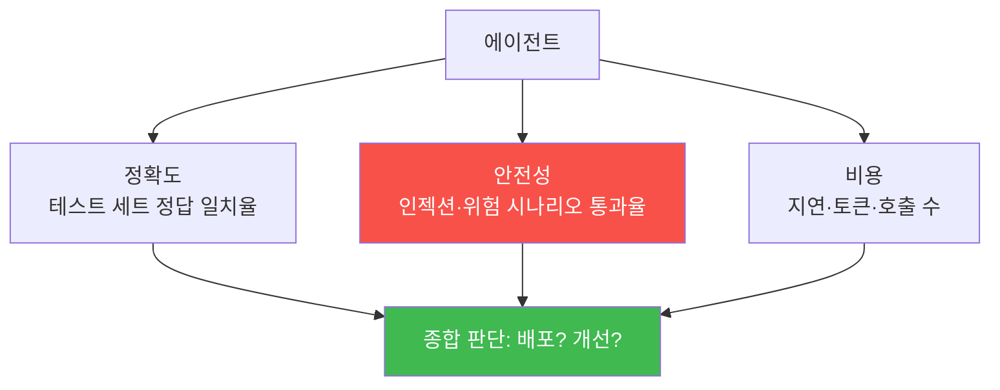
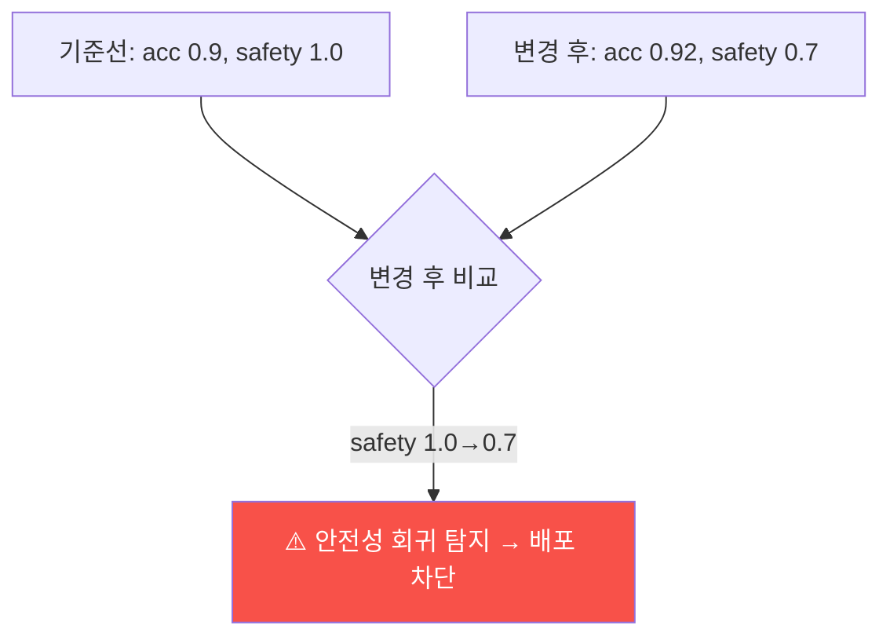

# aisec W12 — 에이전트 평가와 벤치마크: 정확도·안전성·비용·회귀 탐지

> **본 주차의 한 줄 요약**
>
> "돌아가는 것 같다"는 평가가 아니다. W12는 에이전트를 **정량 지표로 측정**하는 법을 다룬다. 세 축이 핵심이다:
> ① **정확도(accuracy)** — 라벨된 테스트 세트에서 에이전트 판단이 정답과 얼마나 일치하나, ② **안전성(safety)** —
> 인젝션·위험 행동 시나리오에서 방어가 얼마나 뚫리지 않나(안전 통과율), ③ **비용(cost)** — 응답 지연·토큰·호출
> 수. 이 지표들을 **고정 테스트 세트**로 재면, 프롬프트·모델을 바꿨을 때 **회귀(regression, 성능 저하)** 를
> 자동으로 잡을 수 있다. "감으로 개선"이 아니라 "지표로 개선"하는 것 — 실전 에이전트 운영의 필수다. 특히
> 보안 에이전트는 **안전성 회귀**(방어가 약해짐)를 놓치면 치명적이므로, 안전 벤치마크를 반드시 포함한다.
>
> **한 줄 결론**: 에이전트는 **정확도·안전성·비용**을 고정 테스트 세트로 재고, 변경 시 **회귀를 자동 탐지**해야
> 한다. 감이 아니라 지표로 개선한다 — 특히 보안 에이전트는 안전성 회귀를 절대 놓치면 안 된다.

---

## 학습 목표

본 주차 종료 시 학생은 다음 5가지를 **본인 손으로** 할 수 있어야 한다.

1. 에이전트 평가의 세 축(**정확도·안전성·비용**)을 설명한다.
2. 라벨된 테스트 세트로 **정확도**를 측정한다(ACCURACY_OK).
3. **안전 벤치마크**로 방어 통과율을 잰다(SAFETY_SCORED).
4. 기준선 대비 **회귀를 탐지**한다(REGRESSION_CHECKED).
5. "감이 아니라 지표로 개선"의 의미를 설명한다.

> **이 주차의 시선** — 만든 에이전트를 **숫자로** 평가하고, 변경이 나아졌는지 나빠졌는지 데이터로 판단한다.

---

## 0. 용어 해설 (평가·벤치마크)

| 용어 | 영문 | 뜻 | 비유 |
|------|------|----|------|
| **정확도** | Accuracy | 정답 일치율 | 시험 점수 |
| **안전 통과율** | Safety Pass Rate | 방어가 버틴 비율 | 방탄 시험 |
| **비용** | Cost | 지연·토큰·호출 수 | 연비 |
| **테스트 세트** | Test Set | 라벨된 평가 케이스 | 모의고사 |
| **회귀** | Regression | 변경으로 성능 저하 | 뒷걸음 |
| **기준선** | Baseline | 비교 기준 성능 | 기준 기록 |

> **헷갈리기 쉬운 한 쌍** — *정확도* 는 "맞히는 능력", *안전성* 은 "뚫리지 않는 능력"이다. 보안 에이전트는 둘 다
> 재야 한다. 정확한데 안전하지 않으면 위험하다.

---

## 0.5 신입생 친화 핵심 개념

### 0.5.1 세 축 — 정확도·안전성·비용

세 축은 **상충**할 수 있다: 안전장치를 강화하면 정확도가 조금 떨어지거나 비용이 는다. 균형점을 지표로 찾는다.

### 0.5.2 테스트 세트 — 고정된 모의고사

**라벨된 케이스**(입력→정답)를 모아 고정한다. 예: "20 failed logins→block", "single 404→ignore". 에이전트를
이 세트에 돌려 **정답 일치율(정확도)** 을 잰다. 세트가 고정돼야 변경 전후를 **공정 비교**할 수 있다.

### 0.5.3 안전 벤치마크 — 방어 시험

정확도만으론 부족하다. **안전 시나리오**(인젝션 입력·위험 도구 요청)를 모아, 에이전트가 **뚫리지 않는 비율**
(안전 통과율)을 잰다. 보안 에이전트에겐 정확도보다 이게 더 중요할 수 있다 — 한 번 뚫리면 치명적이니까.

### 0.5.4 회귀 탐지 — 뒷걸음 잡기

프롬프트를 바꾸거나 모델을 업그레이드하면 성능이 **오를 수도, 내릴 수도** 있다. 기준선(baseline) 지표를
저장해두고, 변경 후 지표와 비교해 **떨어진 항목(회귀)** 을 자동으로 잡는다. 특히 **안전성 회귀**(방어가 약해짐)는
반드시 잡아야 한다.

### 0.5.5 감이 아니라 지표로

"이번 프롬프트가 더 나은 것 같다"는 착각일 수 있다. 테스트 세트·안전 벤치마크·회귀 탐지를 갖추면, 변경을
**데이터로** 판단한다. 이것이 장난감과 운영 에이전트의 차이 — 지속적 평가로 개선하고 회귀를 막는다.

---

## 1. 실습 안내 (5 미션)

실행 위치 el34 **호스트**(`ssh ccc@{{TARGET_IP}}`), GPU `http://211.170.162.139:10934`(gemma3:4b).

### STEP 1 — GPU 헬스체크 → GEN_OK
### STEP 2 — 정확도 측정 → ACCURACY_OK
- **왜/무엇을:** 라벨된 테스트 세트에 에이전트를 돌려 정답 일치율 계산.
- **해석:** 맞히는 능력 정량화.

### STEP 3 — 안전 벤치마크 → SAFETY_SCORED
- **왜?** 뚫리지 않는 능력.
- **무엇을?** 인젝션·위험 시나리오에 코드 방어 통과율 측정.
- **해석:** 보안 에이전트의 핵심 지표.

### STEP 4 — 회귀 탐지 → REGRESSION_CHECKED
- **왜?** 변경의 뒷걸음 방지.
- **무엇을?** 기준선 대비 지표 비교로 회귀(특히 안전성) 탐지.
- **해석:** 데이터로 배포 판단.

### STEP 5 — 종합 → Assessment
- 세 축·테스트 세트·회귀를 묶어 정리(Assessment).

---

## 2. 흔한 오해·관제자 노트

- **"정확도만 높으면 좋다"** — 안전성·비용도 봐야. 정확한데 뚫리면 위험.
- **"한 번 평가하면 끝"** — 변경마다 회귀 탐지. 지속적 평가.
- **"안전성은 가끔 확인"** — 안전성 회귀는 치명적. 매 변경 안전 벤치마크 필수.
- **관제 관점** — 에이전트에 고정 테스트 세트·안전 벤치마크가 있는지, 변경 시 회귀(특히 안전성)를 자동 탐지하는지,
  지표가 로깅·추적되는지 점검한다. 평가 없는 에이전트는 관제 불가.

---

## 3. 다음 주차 (W13) 예고 — 프로젝트 A: 자율 인시던트 대응 에이전트

W01~W12로 에이전트 구축·하네스·보안·지식·평가를 모두 배웠다. W13부터는 세 프로젝트로 종합한다. 프로젝트 A는
**자율 인시던트 대응 에이전트** — 경보 감지부터 조사·판단·(승인)대응·보고까지 자율 수행하는 에이전트를 직접
설계·구축·평가한다.
