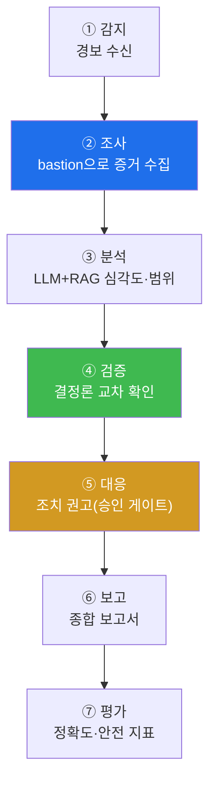

# aisec W13 — 프로젝트 A: 자율 인시던트 대응(IR) 에이전트 구축·평가

> **본 주차의 한 줄 요약**
>
> W01~W12를 하나의 **프로젝트**로 종합한다. 프로젝트 A는 **자율 인시던트 대응(IR) 에이전트** — 경보를 감지해
> 스스로 조사·판단·(승인)대응·보고까지 완주하는 에이전트다. 그동안 배운 모든 조각이 여기 모인다: 에이전트
> 순환(W01)·Tool Calling(W02)·프롬프트(W03)·하네스(W04~07)·보안 방어(W09)·멀티에이전트(W10)·RAG(W11)·평가
> (W12). IR 에이전트의 파이프라인은 **감지→조사(도구)→분석(LLM+RAG)→검증(결정론)→대응(승인)→보고→평가**다.
> 이번 주는 이 에이전트를 실제로 조립해 **실물 el34-bastion으로 증거를 수집**하고, GPU로 분석하며, 안전장치·
> 평가를 갖춰 end-to-end로 돌린다. 핵심은 "지금까지 배운 것을 실제로 작동하는 하나로 만드는 것"이다.
>
> **한 줄 결론**: 자율 IR 에이전트 = W01~W12의 종합. 감지→조사→분석→검증→대응(승인)→보고→평가를 하나로
> 엮되, LLM 판단은 결정론으로 검증하고 위험 대응은 승인하며 성능은 지표로 평가한다.

---

## 학습 목표

본 주차 종료 시 학생은 다음 5가지를 **본인 손으로** 할 수 있어야 한다.

1. 자율 IR 에이전트의 파이프라인(감지→조사→분석→검증→대응→보고→평가)을 설계한다.
2. **실물 bastion**으로 증거를 수집하는 조사 단계를 구현한다(IR_EVIDENCE).
3. 조사 증거를 분석·검증해 대응을 권고한다(IR_ANALYZED).
4. 안전장치(승인·검증)와 평가(정확도·안전)를 갖춘다(IR_VERIFIED).
5. 프로젝트를 스스로 평가하고 개선점을 제시한다.

> **이 주차의 시선** — 배운 부품을 **작동하는 프로젝트**로. 실물 인프라 위에서 end-to-end.

---

## 0. 용어 해설 (자율 IR)

| 용어 | 영문 | 뜻 | 관련 주차 |
|------|------|----|-----------|
| **인시던트 대응** | Incident Response(IR) | 보안 사건 대응 절차 | 전 과목 |
| **감지** | Detection | 경보·이상 포착 | W01 |
| **조사** | Investigation | 증거 수집(도구) | W02·W05 |
| **분석** | Analysis | 심각도·범위 판단 | W03·W11 |
| **대응** | Response | 조치(승인) | W05·W09 |
| **보고** | Reporting | 종합 보고 | W08 |

---

## 0.5 프로젝트 설계 — IR 에이전트 파이프라인

### 0.5.1 전체 파이프라인

### 0.5.2 실물 조사 — bastion으로 증거 수집

조사 단계는 실물 **el34-bastion**을 쓴다: `/exec`(화이트리스트 안전 명령)·skills(wazuh.alerts·apache.error_log)로
**진짜 증거**를 수집한다. 개념 시뮬이 아니라 실제 인프라에서 증거를 모으는 것 — 프로젝트의 현실성이다.
(el34-bastion은 경량 실행기라 Manager 분석 LLM은 GPU로.)

### 0.5.3 분석·검증 — LLM 넓게, 결정론 좁혀

수집한 증거를 LLM이 분석(심각도·범위·연관)하고, **결정론 규칙이 검증**한다(예: 악성 IP+다발 실패=high 확정).
RAG로 관련 플레이북을 끌어와 근거를 보강한다. LLM의 유연함 + 결정론의 신뢰 — 이 과목의 핵심 원칙.

### 0.5.4 대응·안전 — 승인 게이트

대응 단계의 위험 조치(차단·격리)는 **승인 게이트**를 거친다. 조사·분석은 자율, 되돌리기 어려운 대응만 사람
승인. 그리고 모든 단계가 **로깅**돼 감사 추적이 된다. 자율성과 통제의 균형(W11·W12).

### 0.5.5 평가 — 프로젝트도 지표로

만든 IR 에이전트를 **평가**한다(W12): IR 테스트 세트 정확도, 안전 벤치마크 통과율. 프로젝트도 "돌아간다"가
아니라 "얼마나 잘·안전하게 하나"를 지표로 증명한다. 이것이 프로젝트 A의 완성 기준이다.

---

## 1. 프로젝트 A 실습 안내 (5 미션)

실행 위치 el34 **호스트**(`ssh ccc@{{TARGET_IP}}`), GPU `http://211.170.162.139:10934`, bastion `el34-bastion:9100`
(`X-API-Key: ccc-api-key-2026`).

### STEP 1 — GPU 헬스체크 → GEN_OK
### STEP 2 — 실물 조사(증거 수집) → IR_EVIDENCE
- **왜/무엇을:** bastion으로 실제 증거(호스트 상태·로그) 수집.
- **해석:** 실물 인프라 조사.

### STEP 3 — 분석·검증·대응 권고 → IR_ANALYZED
- **왜?** 증거로 판단.
- **무엇을?** LLM 분석 + 결정론 검증 + 대응 권고(승인).
- **해석:** 넓게 훑고 좁혀 확정.

### STEP 4 — 안전+평가 → IR_VERIFIED
- **왜?** 프로젝트 완성 기준.
- **무엇을?** 안전장치 + IR 정확도·안전 지표.
- **해석:** 지표로 증명.

### STEP 5 — 종합·발표 → Assessment
- 파이프라인·실물 조사·안전·평가를 묶어 보고(Assessment).

---

## 2. 흔한 오해·관제자 노트

- **"IR 에이전트면 다 자동"** — 위험 대응은 승인. 자율은 조사·분석·권고까지.
- **"분석은 LLM만"** — 결정론 검증 필수. LLM 판단만 믿으면 오판 전파.
- **"돌아가면 완성"** — 안전·평가 지표까지가 완성. 프로젝트도 W12 평가로.
- **관제 관점** — IR 에이전트의 각 단계 로깅, 위험 대응 승인, 결정론 검증, 평가 지표를 점검한다. 이 프로젝트가
  실전 IR 자동화의 축소판이자 관제 대상이다.

---

## 3. 다음 주차 (W14) 예고 — 프로젝트 B: CTF 자동 풀이 에이전트

프로젝트 A가 "방어(IR)"였다면, 프로젝트 B는 "공격 추론" — **CTF 자동 풀이 에이전트**다. 문제를 분석해 취약점을
추론하고 단계적으로 풀이를 시도하는 에이전트를 만든다(인가된 격리 환경에서). 공격 추론 에이전트의 설계와 안전
경계를 다룬다.
