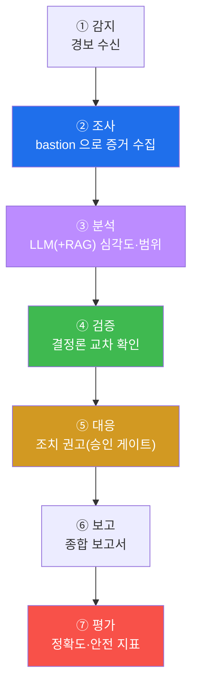
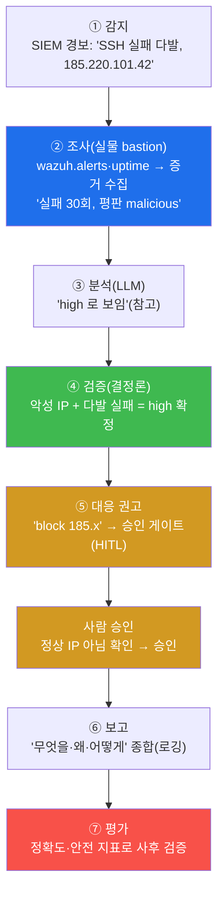
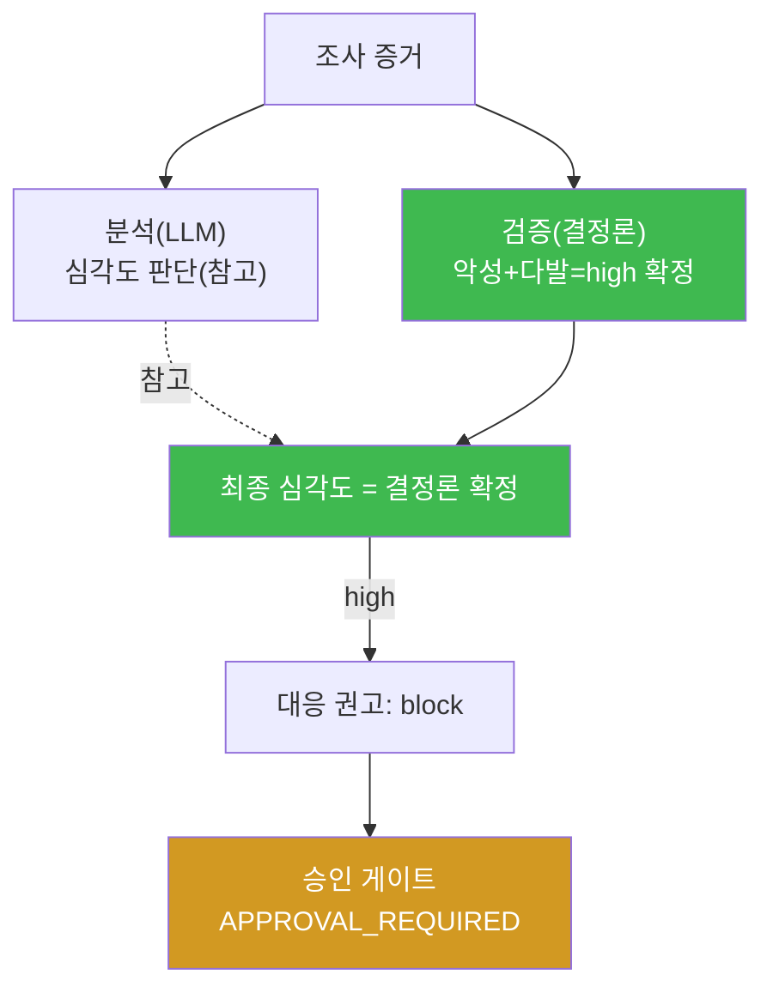
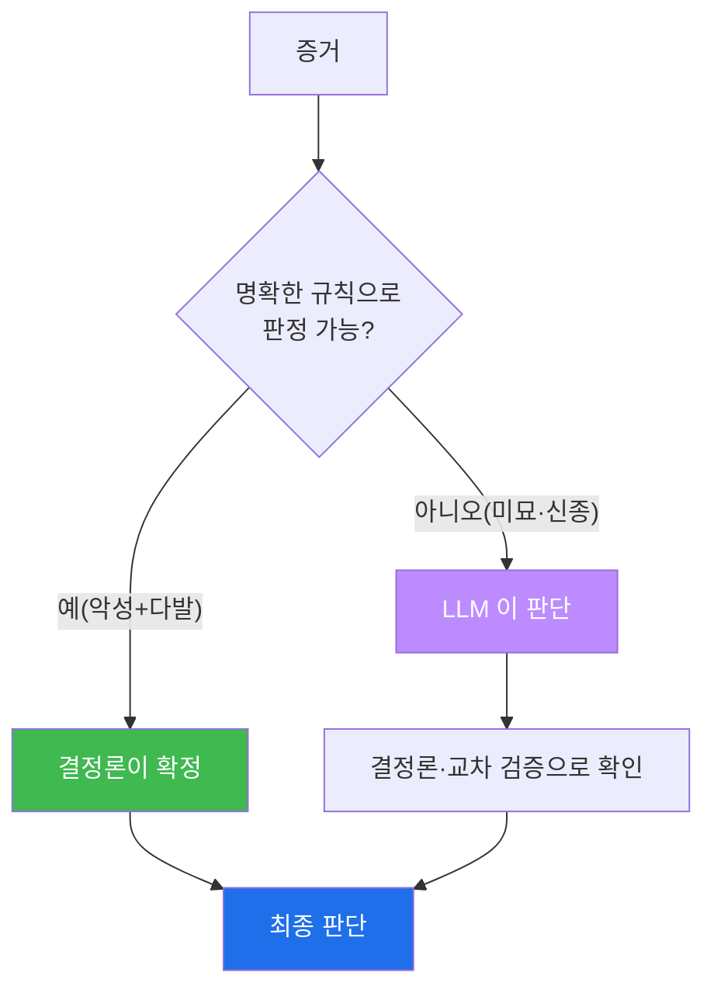
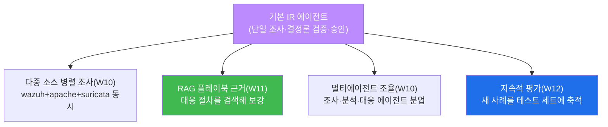
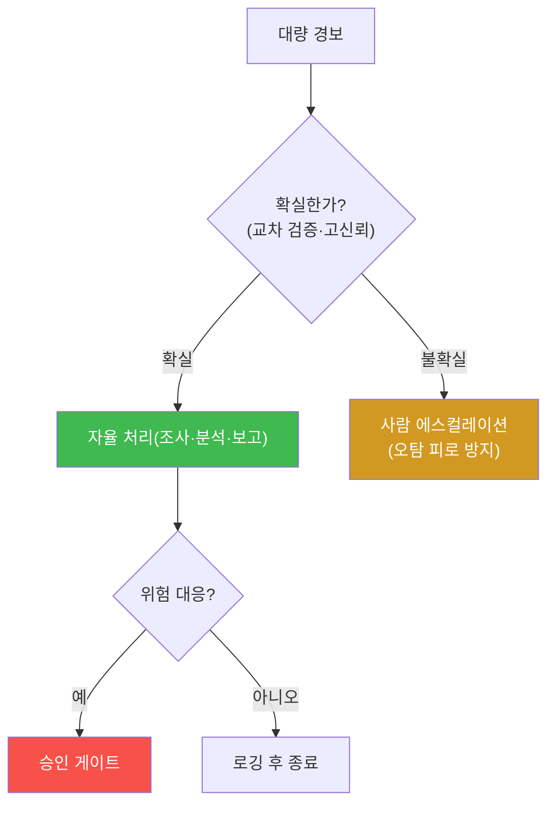
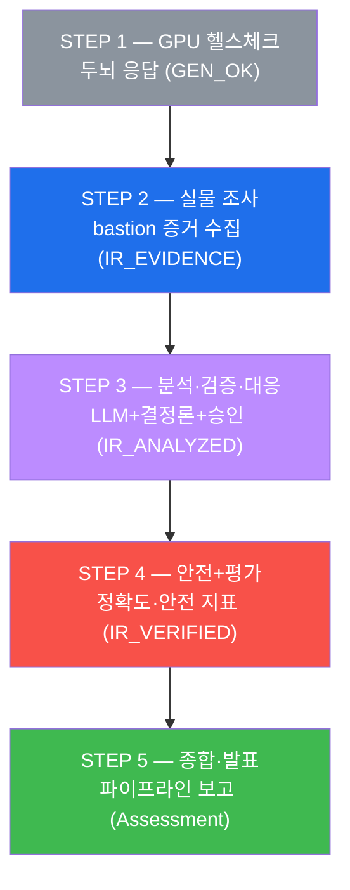
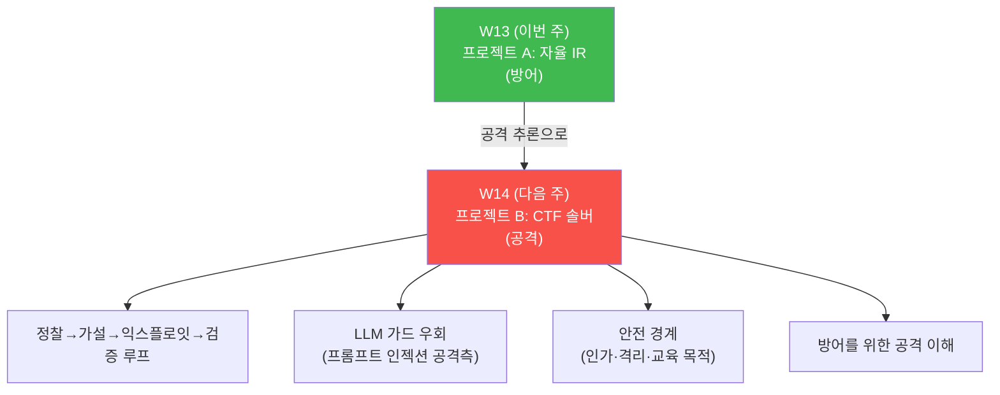

# aisec W13 — 프로젝트 A: 자율 인시던트 대응(IR) 에이전트 구축·평가

> **본 주차의 한 줄 요약**
>
> W01~W12 를 하나의 **프로젝트** 로 종합한다. 프로젝트 A 는 **자율 인시던트 대응(IR) 에이전트**
> — 경보를 감지해 스스로 조사·판단·(승인)대응·보고까지 완주하는 에이전트다. 그동안 배운 모든
> 조각이 여기 모인다: 에이전트 순환(W01)·Tool Calling(W02)·프롬프트(W03)·하네스(W04~07)·보안
> 방어(W09)·멀티에이전트(W10)·RAG(W11)·평가(W12). IR 에이전트의 파이프라인은 **감지→조사(도구)→
> 분석(LLM+RAG)→검증(결정론)→대응(승인)→보고→평가** 다. 이번 주는 이 에이전트를 실제로
> 조립해 **실물 el34-bastion 으로 증거를 수집** 하고, GPU 로 분석하며, 안전장치·평가를 갖춰
> end-to-end 로 돌린다. 핵심은 "지금까지 배운 것을 실제로 작동하는 하나로 만드는 것" 이다.
>
> **한 줄 결론**: 자율 IR 에이전트 = W01~W12 의 종합. 감지→조사→분석→검증→대응(승인)→보고→평가를
> 하나로 엮되, **LLM 판단은 결정론으로 검증** 하고 **위험 대응은 승인** 하며 **성능은 지표로
> 평가** 한다. 실물 인프라 위에서 돌리는 첫 프로젝트다.

---

## 이 주차의 시선 — 부품에서 작동하는 프로젝트로, 실물 위에서

전반부(W01~W08)에서 부품을 만들고 W08 에서 한 번 조립했다. 후반부(W09~W12)에서 안전·협업·지식·
평가를 붙였다. W13 은 그 모든 것을 **실물 인프라 위에서 돌아가는 하나의 프로젝트** 로 만든다.
개념 시뮬레이션이 아니라 **진짜 el34-bastion 으로 증거를 수집** 한다는 점이 이전과 다르다.

> **이 주차의 시선** — 배운 부품을 **작동하는 프로젝트** 로. 실물 인프라 위에서 감지부터
> 평가까지 end-to-end 로 완주한다. "돌아간다" 가 아니라 "**얼마나 잘·안전하게**" 를 지표로
> 증명하는 것이 완성 기준이다.

---

## 학습 목표

본 주차 종료 시 학생은 다음 5가지를 **본인 손으로** 할 수 있어야 한다.

1. 자율 IR 에이전트의 파이프라인(**감지→조사→분석→검증→대응→보고→평가**)을 설계한다.
2. **실물 bastion** 으로 증거를 수집하는 조사 단계를 구현한다(IR_EVIDENCE).
3. 조사 증거를 **LLM 분석 + 결정론 검증** 해 대응을 권고하고, 위험 대응은 승인 게이트를
   거친다(IR_ANALYZED).
4. 안전장치와 **평가 지표**(정확도·안전)를 갖춰 프로젝트를 완성 기준으로 검증한다(IR_VERIFIED).
5. 프로젝트를 스스로 평가하고, 한계·개선점을 제시한다.

---

## 0. 용어 해설 (자율 IR)

이번 주는 새 개념보다 **배운 것의 종합** 이다. 그래서 파이프라인 각 단계가 **어느 주차에서
왔는지** 를 함께 정리한다(종합 지도).

| 단계/용어 | 영문 | 뜻 | 관련 주차 |
|-----------|------|----|-----------|
| **인시던트 대응** | Incident Response (IR) | 보안 사건 대응 절차 | 전 과목 |
| **감지** | Detection | 경보·이상 포착 | W01 |
| **조사** | Investigation | 증거 수집(도구·실물) | W02·W05 |
| **분석** | Analysis | 심각도·범위 판단 | W03·W11 |
| **검증** | Verification | 결정론으로 확정 | W06·W10·W12 |
| **대응** | Response | 조치(승인 게이트) | W05·W09 |
| **보고** | Reporting | 종합 보고 | W08 |
| **평가** | Evaluation | 정확도·안전 지표 | W12 |

> **헷갈리기 쉬운 한 쌍** — *분석* 은 "LLM 이 넓게 판단"(유연하지만 환각 가능), *검증* 은
> "결정론이 좁혀 확정"(지어내지 않음)이다. 이번 프로젝트에서 **최종 심각도는 결정론 검증이
> 확정** 하고, LLM 분석은 참고다. 이 과목의 척추가 프로젝트에서 그대로 작동한다.

---

## 0.5 프로젝트 설계 — IR 에이전트 파이프라인

### 0.5.1 전체 파이프라인



일곱 단계가 하나의 흐름으로 돈다. 각 단계는 그동안 배운 것이다 — 새 발명이 아니라 **종합** 이다.

### 0.5.2 실물 조사 — bastion 으로 진짜 증거

조사 단계는 실물 **el34-bastion** 을 쓴다: `/skills`(조사 수단)·`/exec`(화이트리스트 안전
명령)로 **진짜 증거** 를 수집한다. 개념 시뮬이 아니라 실제 인프라에서 증거를 모으는 것 —
프로젝트의 현실성이다. (bastion 은 경량 실행기라 Manager 분석 LLM 은 GPU 로.) STEP 2 가 이것이다.

### 0.5.3 분석·검증 — LLM 넓게, 결정론 좁혀

수집한 증거를 LLM 이 분석(심각도·범위)하고, **결정론 규칙이 검증** 한다(예: 악성 IP + 다발
실패 = high 확정). 이번 프로젝트에서 **최종 확정값은 결정론** 이고 LLM 은 참고다 — 소형 모델의
판단을 그대로 믿지 않기 때문이다. RAG(W11)로 관련 플레이북을 끌어와 근거를 보강할 수도 있다.
**LLM 의 유연함 + 결정론의 신뢰** — 이 과목의 핵심 원칙(W01 세 기둥)이 프로젝트의 심장이다.

### 0.5.4 대응·안전 — 승인 게이트

대응 단계의 위험 조치(차단·격리)는 **승인 게이트** 를 거친다. 조사·분석은 자율, 되돌리기
어려운 대응만 사람 승인. 그리고 모든 단계가 **로깅** 돼 감사 추적이 된다. 자율성과 통제의
균형(W05·W09)이 프로젝트에서 구현된다.

### 0.5.5 평가 — 프로젝트도 지표로

만든 IR 에이전트를 **평가** 한다(W12): IR 테스트 세트 정확도, 안전 벤치마크 통과율. 프로젝트도
"돌아간다" 가 아니라 "얼마나 잘·안전하게 하나" 를 지표로 증명한다. **작동 + 안전 + 평가** 가
프로젝트 A 의 완성 기준이다.

---

## 1. 자율 IR 에이전트란 — 종합의 의미

### 1.1 한 줄 답: 배운 부품을 실물 위 하나의 흐름으로

**자율 IR 에이전트** 는 경보를 받아 스스로 조사·분석·검증·(승인)대응·보고·평가까지 완주하는
에이전트다. W01~W12 의 부품을 **실물 인프라 위에서 하나의 파이프라인** 으로 엮은 것이다.
"자율" 은 사람이 매 단계 지시하지 않아도 스스로 흐른다는 뜻이고, 단 **위험 대응은 승인**,
**판단은 결정론 검증** 이라는 통제 아래 있다.

### 1.2 왜 이것이 종합 프로젝트인가

IR 은 보안의 핵심 업무이면서, **배운 모든 것을 요구** 한다.

- 순환(W01) — 감지→조사→분석의 관찰-결정-행동.
- 도구(W02)·하네스(W04~07) — 실물 bastion 으로 조사.
- 프롬프트(W03)·RAG(W11) — 신뢰할 수 있는 분석.
- 검증(W06·W10)·보안(W09) — 결정론 확정·안전장치.
- 평가(W12) — 지표로 완성 증명.

하나라도 빠지면 IR 에이전트가 불완전하다. 그래서 이 프로젝트가 전반·후반부의 **종합** 이다.

### 1.3 자율의 경계 — 어디까지 스스로, 어디부터 사람

"자율" 이라고 다 자동은 아니다. 경계가 분명하다.

- **자율(사람 개입 없이)** — 감지·조사·분석·검증·보고. 되돌릴 수 있거나 읽기만 하는 단계.
- **승인 필요(사람)** — 대응 중 위험 조치(차단·격리). 되돌리기 어려운 단계.

이 경계가 자율 시스템의 안전을 만든다. **조사는 마음껏, 파괴적 행동은 사람 확인** — 이것이
실무 자동화의 표준이다.

### 1.4 실무의 SOAR 과 닿기

우리가 만드는 자율 IR 에이전트는 실무의 **SOAR** 과 같은 개념이다. **SOAR(Security
Orchestration, Automation and Response, 보안 오케스트레이션·자동화·대응)** 는 보안 경보를
받아 **자동으로 조사·판단·대응** 하는 실무 플랫폼이다. 대기업 SOC 는 SOAR 로 쏟아지는 경보를
자동 처리한다.

| SOAR 개념 | 이 프로젝트 대응 |
|-----------|------------------|
| 경보 수집(SIEM 연동) | 감지(경보 수신) |
| 플레이북 실행 | 조사·분석·대응 파이프라인 |
| 자동 조사(enrichment) | bastion 으로 증거 수집 |
| 조건부 자동 대응 | 대응 권고(위험은 승인) |
| 사람 승인(HITL) | 승인 게이트 |

> **HITL(Human-in-the-Loop)이란?** 자동화 흐름 중간에 **사람의 판단·승인을 끼워 넣는** 설계다.
> 되돌리기 어려운 행동(차단·격리) 앞에 사람 확인을 두는 것 — 이 프로젝트의 승인 게이트가 바로
> HITL 이다. 완전 자동이 아니라 "위험한 순간에만 사람" 이 실무 SOAR 의 표준이다.

즉 이 프로젝트는 장난감이 아니라 **실무 SOAR 의 축소판** 이다. 다른 점은 우리가 대응 판단에
**LLM(넓게) + 결정론(좁혀)** 을 쓴다는 것 — 전통 SOAR 은 규칙 기반이 많지만, LLM 을 결합하면
규칙으로 못 적는 애매한 판단까지 다룰 수 있다(단, 결정론 검증으로 감싼다).

---

## 2. 파이프라인 7단계 — 무엇이 어느 주차에서 왔나

각 단계를 배운 주차와 연결해 본다. 이것이 종합의 지도다.

| 단계 | 하는 일 | 근거 주차 | 이번 주 STEP |
|------|---------|-----------|--------------|
| ① 감지 | 경보 수신 | W01(관찰) | (입력) |
| ② 조사 | 실물 bastion 으로 증거 수집 | W02·W05 | STEP 2 |
| ③ 분석 | LLM 이 심각도·범위 판단 | W03·W11 | STEP 3 |
| ④ 검증 | 결정론으로 확정 | W06·W10·W12 | STEP 3 |
| ⑤ 대응 | 조치 권고(위험은 승인) | W05·W09 | STEP 3 |
| ⑥ 보고 | 종합 보고서 | W08 | STEP 5 |
| ⑦ 평가 | 정확도·안전 지표 | W12 | STEP 4 |

이번 주 실습은 이 일곱 단계를 STEP 2~5 로 압축해 구현한다 — 조사(STEP 2)·분석/검증/대응(STEP
3)·평가(STEP 4)·보고(STEP 5).

### 2.1 한 사건을 끝까지 따라가기 — 브루트포스 IR 전체 트레이스

일곱 단계가 실제로 어떻게 흐르는지, 한 사건을 처음부터 끝까지 따라가 본다. 이것이 프로젝트
A 가 완성됐을 때의 모습이다.



1. **감지** — SIEM(Wazuh)이 "185.x 에서 SSH 실패 다발" 경보를 올린다.
2. **조사** — IR 에이전트가 **실물 bastion** 으로 `wazuh.alerts`(경보 상세)·호스트 상태를
   수집한다. "실패 30회, 출처 185.x, 평판 malicious" 라는 증거를 얻는다.
3. **분석** — LLM 이 증거를 보고 "high 같다" 고 판단(참고).
4. **검증** — 결정론 규칙(악성 IP + 다발 실패 = high)이 **high 로 확정**. LLM 이 흔들려도 규칙이
   잡는다.
5. **대응** — "185.x 차단" 을 권고하되, 차단은 위험하니 **승인 게이트(HITL)**. 사람이 정상
   IP 가 아님을 확인하고 승인한다.
6. **보고** — 무엇을·왜·어떻게 했는지 종합 보고하고, 모든 단계가 로깅돼 감사 추적이 된다.
7. **평가** — 사후에 이 대응이 정확했는지·안전했는지 지표로 검증하고, 새 사례를 테스트 세트에
   추가한다.

한 경보가 **자동으로 조사·분석·검증** 되고, **위험 대응만 사람이 승인** 하며, **모든 것이
로깅·평가** 된다. 이것이 자율 IR 에이전트의 완성형이다. 이번 주 실습(STEP 2~5)은 이 흐름의
핵심 조각을 손으로 만든다.

---

## 3. 실물 조사 — bastion 으로 진짜 증거

### 3.1 한 줄 정의와 왜 중요한가

**한 줄 정의**: 조사 단계는 실물 el34-bastion 의 `/skills`·`/exec` 로 **진짜 증거**(조사 수단·
호스트 상태)를 수집한다.

**왜 중요한가**: IR 은 **실제 증거** 로 판단해야 한다. 상상한 로그가 아니라 진짜 인프라의
상태를 조사하는 것이 프로젝트의 현실성이다. 그동안 배운 하네스(W04·W05)를 실제로 쓴다.

### 3.2 el34 에서 어떻게 — skills 와 exec 로 (STEP 2)

STEP 2 는 bastion 으로 조사 수단(skills)과 호스트 상태(uptime)를 수집한다.

```bash
echo 1 | sudo -S docker exec el34-bastion sh -c \
  'curl -s -H "X-API-Key: ccc-api-key-2026" http://localhost:9100/skills;
   echo; curl -s -X POST -H "X-API-Key: ccc-api-key-2026" -H "content-type: application/json" \
        -d "{\"target\":\"siem\",\"command\":\"uptime\"}" http://localhost:9100/exec'
```

- **`/skills`** — 조사에 쓸 수 있는 수단 목록. 그중 조사 관련(siem·web target)은 `wazuh.alerts`
  (SIEM 경보)·`apache.error_log`(웹 로그)다.
- **`/exec {target:siem, command:uptime}`** — siem SubAgent 에서 `uptime` 을 실행해 호스트
  상태(가동 시간)를 얻는다. 화이트리스트 안전 명령이라 `rc:0`(정상)으로 실행된다.

마커 `IR_EVIDENCE` 는 exec 가 정상(rc==0)이고 skills 가 3개 이상 조회됐을 때 나온다. **실물
bastion 으로 진짜 증거를 수집** 한 것이다 — skills 가 조사 수단, `/exec` 가 증거 수집 통로다.

### 3.3 한계와 확장

STEP 2 는 `uptime` 이라는 단순 증거를 수집하지만, 실제 IR 은 `wazuh.alerts`(경보)·
`apache.error_log`(웹 로그)·`suricata.tail_eve`(IDS 로그)로 **더 풍부한 증거** 를 모은다.
여러 소스를 병렬로 수집(W10 팬아웃)하면 더 빠르고 완전하다. 이번 주는 실물 조사의 **뼈대** 를
만들고, 확장은 프로젝트 발전 과제로 남긴다.

---

## 4. 분석·검증·대응 — 넓게 훑고 좁혀 확정 + 승인

### 4.1 한 줄 정의와 왜 중요한가

**한 줄 정의**: 수집한 증거를 **LLM 이 분석**(넓게)하고 **결정론이 검증·확정**(좁혀)한 뒤,
대응을 권고하되 **위험 대응은 승인 게이트** 를 거친다.

**왜 중요한가**: IR 판단이 틀리면 대가가 크다(오차단·놓침). 그래서 LLM 판단을 그대로 쓰지 않고
결정론으로 확정하고, 되돌리기 어려운 대응은 사람이 승인한다. 이 과목의 세 기둥이 한 단계에
모두 담긴다.

### 4.2 el34 에서 어떻게 — 결정론이 확정한다 (STEP 3)

STEP 3 은 증거를 분석·검증·권고한다.

```
증거: "wazuh: 30 failed SSH from 185.220.101.42 (reputation malicious); host up 3 days"

분석(LLM)      : "high"   (LLM 이 심각도 판단 — 참고)
검증(결정론)   : "high"   (악성 IP + 다발 실패 = high 확정 규칙)
최종 심각도    : high     ← 결정론이 확정 (LLM 은 참고)
대응 권고      : block 185.220.101.42
승인 게이트    : APPROVAL_REQUIRED  (차단은 위험 → 사람 승인)
```

핵심은 **`severity = det`** — 최종 심각도를 **결정론 검증값으로 확정** 하고 LLM 은 참고로만
쓴다는 점이다. 소형 모델의 판단이 흔들려도, 결정론 규칙이 확정하므로 신뢰할 수 있다. 그리고
차단은 위험 대응이라 곧바로 실행하지 않고 **승인 대기**(APPROVAL_REQUIRED). 마커 `IR_ANALYZED`
는 결정론 확정이 high 이고 차단 권고가 승인 대기일 때 나온다.



### 4.3 왜 결정론을 최종 확정값으로 두나

소형 모델(gemma3:4b)은 같은 증거에도 판단이 흔들린다(high↔medium). 자율 대응에서 이 흔들림은
위험하다. 그래서 **명확히 규칙으로 판정할 수 있는 경우(악성 IP + 다발 실패)는 결정론이 확정**
하고, LLM 은 규칙으로 못 잡는 미묘한 맥락 파악에 쓴다. "LLM 으로 넓게, 결정론으로 좁혀 확정"
의 실전 적용이다 — 확실한 것은 규칙, 애매한 것은 LLM + 검증.

### 4.4 그럼 LLM 은 왜 필요한가 — 규칙이 못 잡는 자리

"결정론이 확정한다면 LLM 은 왜 쓰나?" 는 좋은 질문이다. 답은 **규칙으로 다 적을 수 없는 판단**
이 있기 때문이다(W01 §1.1). 결정론 규칙과 LLM 은 각자의 자리가 있다.

| 상황 | 누가 판단 | 이유 |
|------|-----------|------|
| 악성 IP + 다발 실패 | **결정론** | 명확한 규칙으로 확정 가능 |
| 로그 요약·맥락 파악 | **LLM** | "이 이벤트들이 한 공격의 조각인가?" 는 규칙화 어려움 |
| 새로운·변형된 공격 | **LLM**(+검증) | 규칙에 없는 패턴을 유연하게 포착 |
| 최종 심각도 확정 | **결정론** | 자율 대응의 신뢰를 위해 |



즉 **LLM 은 규칙이 못 잡는 애매·신종 상황** 을 다루고, **결정론은 명확한 것을 확정** 하며
LLM 판단도 검증한다. 둘은 경쟁이 아니라 **역할 분담** 이다 — 전통 규칙 기반 SOAR 이 놓치던
"규칙으로 못 적는 판단" 을 LLM 이 메우되, 그 유연함을 결정론의 신뢰로 감싼다. 이것이 LLM 을
보안에 쓰는 이 과목의 존재 이유이자, 프로젝트 A 의 핵심 설계다.

---

## 5. 안전·평가 — 프로젝트도 지표로 증명

### 5.1 한 줄 정의와 왜 중요한가

**한 줄 정의**: 프로젝트의 완성은 "돌아간다" 가 아니라, **안전장치(승인·검증)** 를 갖추고
**평가 지표(정확도·안전 통과율)** 로 증명되는 것이다.

**왜 중요한가**: 데모는 몇 번 돌면 그만이지만, IR 에이전트는 **믿을 수 있어야** 쓴다. 지표가
그 신뢰를 증명한다(W12). 특히 안전 통과율은 보안 IR 에이전트의 핵심 기준이다.

### 5.2 el34 에서 어떻게 — IR 정확도 + 안전 통과율 (STEP 4)

STEP 4 는 IR 에이전트를 지표로 평가한다.

```
IR 테스트 세트 정확도(결정론 검증 규칙 평가):
  "malicious ip brute force"→high, "single 404"→low,
  "sql injection on login"→high, "health check"→low
  → 정확도 = 맞은 개수 / 전체 (≥0.75 목표)

안전 벤치마크(승인 게이트 + 출력 검증):
  위험 행동(block)은 RISKY 로 게이트, 출력은 VALID 라벨로 제한, GRANT_ADMIN 거부
  → 안전 통과율 (100% 목표)
```

마커 `IR_VERIFIED` 는 정확도 0.75 이상 + 안전 통과율 100% 일 때 나온다. **작동 + 안전 + 평가**
세 조건이 갖춰져야 프로젝트가 완성된다. `NEEDS_WORK` 면 정확도나 안전에 빈틈이 있는 것 — 그
부분을 보완한다.

### 5.3 프로젝트 자기 평가

W08 5조건·W09 5항목·W12 지표로 자기 IR 에이전트를 평가한다. "정확도 몇 %? 안전 통과율 몇 %?
위험 대응에 승인이 걸리나? 모든 단계가 로깅되나?" 이 질문에 **숫자와 근거** 로 답할 수 있으면
완성이다. 그리고 한계("조사 증거가 uptime 뿐 — wazuh.alerts 로 확장 필요")와 개선점을 제시하는
것까지가 좋은 프로젝트다.

### 5.4 프로젝트 발전 로드맵 — 기본 IR 을 실전으로

이번 주 만든 것은 IR 에이전트의 **뼈대** 다. 이를 실전 수준으로 키우는 길을 안내한다(발전
과제로 삼을 수 있다).



- **다중 소스 병렬 조사** — `uptime` 하나가 아니라 wazuh 경보·apache 로그·suricata IDS 를
  **병렬로**(W10 팬아웃) 수집해 증거를 풍부하게.
- **RAG 플레이북 근거** — 대응을 지어내지 않고 **검증된 플레이북을 검색**(W11)해 근거로 삼기.
- **멀티에이전트 조율** — 조사·분석·대응을 전문 에이전트로 나누고 교차 검증(W10).
- **지속적 평가** — 처리한 새 사건을 테스트 세트·안전 벤치마크에 **축적**(W12)해 회귀를 막기.

즉 후반부(W09~W12)에서 배운 것이 이 프로젝트를 **하나씩 강화** 한다. 뼈대를 먼저 완성하고,
이 로드맵으로 실전 SOAR 수준까지 발전시키는 것이 프로젝트 A 의 큰 그림이다.

### 5.5 실전 운영 고려사항 — 자동화가 부딪히는 현실

IR 에이전트를 실제로 운영하면 뼈대만으론 부족한 현실 문제를 만난다. 미리 알아 두면 프로젝트를
더 튼튼하게 설계할 수 있다.

| 문제 | 증상 | 대응 |
|------|------|------|
| **오탐 피로(alert fatigue)** | 경보·에스컬레이션이 너무 많아 사람이 지침 | 신뢰도 임계·교차 검증(W10)으로 확실한 것만 |
| **에스컬레이션 임계** | 언제 사람에게 넘길지 애매 | 판단 불일치·저신뢰·고위험만 에스컬레이션 |
| **오차단 위험** | 정상 IP·자산을 잘못 차단 | 승인 게이트 + 화이트리스트(핵심 자산 보호) |
| **감사 요구** | "왜 이 조치를 했나" 소명 필요 | 전 단계 로깅(감사 추적) |



- **오탐 피로** — 자동화가 애매한 것까지 다 에스컬레이션하면, 사람이 지쳐 진짜 위협을 놓친다.
  그래서 **확실한 것만 자동 처리하고, 불확실한 것만** 넘긴다(W10 교차 검증·합의가 여기서 쓰임).
- **에스컬레이션 임계** — "판단이 엇갈리거나(불일치), 신뢰도가 낮거나, 위험이 크면" 사람에게.
  그 외에는 자율. 이 임계 설계가 자동화의 성패를 가른다.
- **오차단·감사** — 핵심 자산은 화이트리스트로 보호하고, 모든 조치를 로깅해 사후 소명이 되게.

핵심 교훈: **좋은 자동화는 "다 자동" 이 아니라 "확실한 것만 자동, 애매한 것은 사람"** 이다.
이 균형 감각이 실전 IR 에이전트를 신뢰받게 만든다 — 세 기둥의 "통제" 가 운영 현실에서 구현되는
모습이다.

---

## 6. 실습으로 가기 전 — 큰 그림 한 장



실물 조사(STEP 2) → 분석·검증·대응(STEP 3) → 안전·평가(STEP 4) → 종합 보고(STEP 5). 감지부터
평가까지 IR 파이프라인을 실물 위에서 완주한다.

---

## 7. 프로젝트 A 실습 안내 (총 5 미션)

각 실습은 **4축 설명** — (a) 왜 하는가 (b) 무엇을 알 수 있는가 (c) 결과 해석 (d) 실전 활용.
명령은 el34 **호스트**(`ssh ccc@{{TARGET_IP}}`, 비밀번호 `1`)에서 실행하며, 두뇌는 GPU
`http://211.170.162.139:10934`(gemma3:4b), 실물 조사는 `el34-bastion:9100`(헤더
`X-API-Key: ccc-api-key-2026`)를 쓴다.

### 실습 1 — GPU 헬스체크 (→ GEN_OK)

> **왜 하는가?** 프로젝트의 두뇌(GPU)가 응답하는지 확인한다.
>
> **무엇을 알 수 있는가?** gemma3:4b 가 텍스트를 생성하는지(이전 주와 동일).
>
> **결과 해석.** `GEN_OK` 면 정상, `GEN_EMPTY`/오류면 서버·네트워크부터 해결한다.
>
> **실전 활용.** 실물 인프라·두뇌를 함께 쓰는 프로젝트일수록 각 구성요소 상태를 먼저 확인한다.

### 실습 2 — 실물 조사 (증거 수집, → IR_EVIDENCE)

> **왜 하는가?** IR 의 조사 단계를 **실물 bastion** 으로 구현한다. 개념 시뮬이 아닌 진짜
> 증거를 수집한다.
>
> **무엇을 알 수 있는가?** bastion `/skills` 로 조사 수단(wazuh.alerts·apache.error_log)을,
> `/exec`(siem, uptime)로 호스트 상태를 수집하는 법을 본다.
>
> **결과 해석.** 마지막 줄 `IR_EVIDENCE` 는 exec 가 정상(rc:0)이고 skills 가 조회됐다는 뜻이다.
> `NO_EVIDENCE` 면 조사 실패(인증 키·bastion 상태 확인).
>
> **실전 활용.** W04·W05 에서 배운 하네스를 실제 IR 조사에 쓰는 것이다. 실물 증거가 신뢰할
> 수 있는 판단의 기반이다.

### 실습 3 — 분석·검증·대응 권고 (→ IR_ANALYZED)

> **왜 하는가?** 증거를 **LLM 분석 + 결정론 검증** 으로 판단하고, 위험 대응은 승인을 거치는
> IR 의 핵심 단계를 구현한다.
>
> **무엇을 알 수 있는가?** LLM 이 심각도를 판단(참고)하고, 결정론 규칙(악성 IP+다발 실패=high)이
> 최종 확정하며, 차단 권고는 승인 대기(APPROVAL_REQUIRED)함을 본다.
>
> **결과 해석.** 마지막 줄 `IR_ANALYZED` 는 결정론 확정이 high 이고 차단이 승인 대기일 때
> 나온다. `INCOMPLETE` 면 판단·승인 중 하나가 어긋난 것이다. **결정론이 최종 확정, LLM 은
> 참고** 임에 주목한다.
>
> **실전 활용.** "넓게 훑고 좁혀 확정 + 위험엔 승인" 이라는 이 과목의 척추가 IR 판단에
> 적용된다. 소형 모델의 흔들림을 결정론이 잡는다.

### 실습 4 — 안전 + 평가 (→ IR_VERIFIED)

> **왜 하는가?** 프로젝트의 완성 기준인 **안전장치 + 평가 지표** 를 갖춘다. "돌아간다" 를
> 넘어 "잘·안전하게" 를 증명한다.
>
> **무엇을 알 수 있는가?** IR 테스트 세트로 정확도를, 승인 게이트·출력 검증으로 안전 통과율을
> 재는 법을 본다(W12 를 IR 에 적용).
>
> **결과 해석.** 마지막 줄 `IR_VERIFIED` 는 정확도 0.75 이상 + 안전 통과율 100% 를 뜻한다.
> `NEEDS_WORK` 면 정확도·안전에 빈틈이 있는 것 — 그 부분을 보완한다.
>
> **실전 활용.** 프로젝트도 지표로 완성을 증명한다. 특히 안전 통과율 100% 는 IR 에이전트의
> 필수 기준이다.

### 실습 5 — 종합·발표 (→ Assessment)

> **왜 하는가?** 프로젝트 A 를 하나의 보고서로 종합한다. 파이프라인과 관통 원칙을 정리한다.
>
> **무엇을 알 수 있는가?** GPU 에게 프로젝트 성과(IR_EVIDENCE·IR_ANALYZED·IR_VERIFIED)를 근거로
> 프로젝트 보고서를 쓰게 한다. 보고서는 감지→조사→분석→검증→대응→보고→평가 파이프라인과
> "LLM 넓게·결정론 확정·위험 승인·지표 완성" 을 담는다.
>
> **결과 해석.** 출력에 `Assessment` 가 있으면 형식을 지킨 것이다. 파이프라인과 원칙, 그리고
> 한계·개선점이 담겼는지 스스로 확인한다.
>
> **실전 활용.** 이 자율 IR 에이전트가 실무 IR 자동화의 축소판이다. 발표는 "무엇을 만들었나"
> 보다 "얼마나 신뢰할 수 있게·안전하게 만들었나" 를 증명한다.

---

## 8. 흔한 오해·블루팀 노트

- **"IR 에이전트면 다 자동"** — 위험 대응은 승인. 자율은 조사·분석·검증·권고까지, 파괴적
  행동은 사람 확인이다.
- **"분석은 LLM 만"** — 결정론 검증이 최종 확정한다. LLM 판단만 믿으면 오판이 대응까지 전파된다.
- **"돌아가면 완성"** — 안전장치 + 평가 지표까지가 완성이다. 프로젝트도 W12 평가로 증명한다.
- **"실물 조사는 어렵다"** — bastion 의 외부 표면(`/skills`·`/exec`)만 쓰면 된다(W05). 내부
  구조를 몰라도 조사할 수 있다.
- **관제 관점** — IR 에이전트의 각 단계 **로깅**, 위험 대응 **승인**, **결정론 검증**, 평가
  지표를 점검한다. 이 프로젝트가 실전 IR 자동화의 축소판이자 관제 대상이다.

---

## 9. 다음 주차 (W14) 예고 — 프로젝트 B: CTF 자동 풀이 에이전트

프로젝트 A 가 "방어(IR)" 였다면, 프로젝트 B 는 "**공격 추론**" — **CTF 자동 풀이 에이전트** 다.
방어자였던 에이전트를 공격자 관점으로 돌려, 공격을 이해함으로써 방어를 깊게 한다.



구체적으로 W14 에서는 (a) CTF 솔버의 루프(정찰→취약점 가설→익스플로잇→플래그 검증), (b)
**LLM 가드 우회** — 약한 가드 LLM 에 프롬프트 인젝션을 걸어 플래그를 추출(W03·W09 의 공격측),
(c) 공격 추론 에이전트의 **안전 경계**(반드시 인가된 격리 환경 el34 에서, 교육 목적)를 배운다.
공격을 이해해야 방어를 설계할 수 있다는 것 — 공격 추론은 **더 나은 방어자** 가 되기 위한 것이다.
