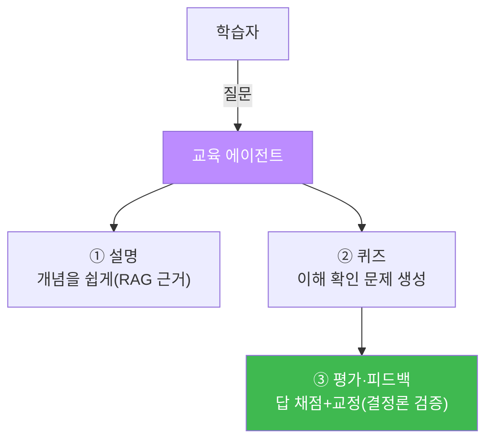
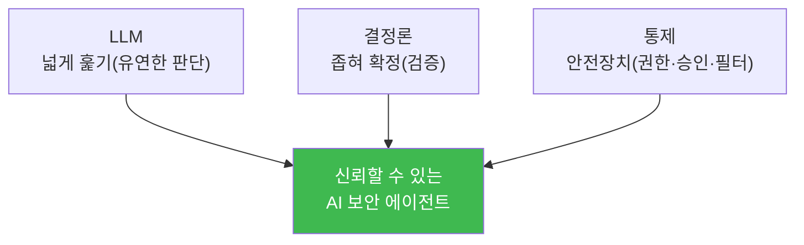

# aisec W15 — 프로젝트 C: 보안 교육 에이전트 + 최종 발표·종합

> **본 주차의 한 줄 요약**
>
> 마지막 주는 프로젝트 C **보안 교육 에이전트**와 과목 전체의 **종합 발표**다. 보안 교육 에이전트는 개념을
> **설명하고**, 이해를 확인하는 **퀴즈를 내고**, 답을 **평가·피드백**하는 에이전트다 — 지금까지 배운 조각
> (프롬프트·RAG·평가·안전)을 교육 도메인에 적용한다. 그리고 세 프로젝트(A 방어 IR·B 공격 CTF·C 교육)를 묶어,
> 이 과목이 관통한 **하나의 원칙**을 확인하며 마친다: **좋은 AI 보안 에이전트 = LLM(넓게 훑기) + 결정론(좁혀
> 확정) + 통제(안전장치)**. 에이전트를 만들고(전반부), 안전하게·크게 만들고(후반부), 방어·공격·교육에 적용
> (프로젝트)하기까지 — AI를 보안에 **신뢰할 수 있게** 쓰는 법을 완성한다.
>
> **한 줄 결론**: 보안 교육 에이전트로 교육 도메인을 다루며 과목을 종합한다. 관통 원칙은 변함없다 —
> **LLM으로 넓게 훑고, 결정론으로 좁혀 확정하고, 통제로 자율을 길들인다.** 이것이 aisec의 결론이다.

---

## 학습 목표

본 주차 종료 시 학생은 다음 5가지를 **본인 손으로** 할 수 있어야 한다.

1. 보안 **교육 에이전트**(설명·퀴즈·평가)를 만든다(TEACH_OK).
2. 학습자 답을 **평가·피드백**한다(QUIZ_GRADED).
3. 세 프로젝트(방어·공격·교육)를 하나로 **종합**한다(CAPSTONE_OK).
4. 과목 관통 원칙(LLM+결정론+통제)을 설명한다.
5. 자신의 에이전트들을 **평가·시연**하고 개선점을 발표한다.

> **이 주차의 시선** — 만든 것을 정리·발표하며, 배운 원칙을 하나로 꿴다.

---

## 0. 용어 해설 (교육 에이전트·종합)

| 용어 | 영문 | 뜻 | 관련 |
|------|------|----|------|
| **교육 에이전트** | Tutor Agent | 설명·퀴즈·평가 에이전트 | W03·W11·W12 |
| **형성 평가** | Formative Assessment | 학습 중 이해 확인 | 퀴즈 |
| **피드백** | Feedback | 답에 대한 교정 | 첨삭 |
| **캡스톤** | Capstone | 종합 완성 프로젝트 | 졸업 작품 |

---

## 0.5 프로젝트 C 설계 + 과목 종합

### 0.5.1 보안 교육 에이전트 구조

교육 에이전트도 배운 조각의 조합이다: 설명은 **RAG**(근거 있는 정확한 설명, W11), 퀴즈는 **프롬프트**(형식
강제, W03), 채점은 **결정론 검증**(정답 대조, W12). 교육은 정확성이 생명이므로 **근거·검증**이 특히 중요하다.

### 0.5.2 세 프로젝트의 종합 — 방어·공격·교육

| 프로젝트 | 관점 | 핵심 |
|----------|------|------|
| A (W13) | 방어(IR) | 감지→조사→분석→대응, LLM+결정론+승인 |
| B (W14) | 공격(CTF) | 정찰→가설→익스플로잇→검증, 안전 경계 |
| C (W15) | 교육 | 설명→퀴즈→평가, 근거+검증 |

셋 다 **같은 뼈대**를 쓴다: 에이전트 순환 + 하네스 + LLM 판단 + 결정론 검증 + 안전장치. 도메인만 다를 뿐
설계 원칙은 하나다.

### 0.5.3 과목 관통 원칙 — 세 기둥

- **LLM(넓게)**: 유연한 판단·분석·계획. 하지만 환각·인젝션에 취약.
- **결정론(좁혀)**: LLM 출력을 규칙으로 검증해 신뢰를 준다.
- **통제(안전)**: 권한·승인·필터로 자율을 길들인다.
셋 중 하나라도 빠지면 신뢰할 수 없다 — 이것이 aisec 전체의 결론이다.

### 0.5.4 최종 발표 — 만든 것을 증명

최종 발표는 (1) 만든 에이전트들(IR·CTF·교육)을 **시연**, (2) 평가 지표(정확도·안전) **제시**, (3) 배운 원칙
**정리**, (4) 한계·개선점 **성찰**로 구성한다. "무엇을 만들었나"보다 "얼마나 신뢰할 수 있게·안전하게 만들었나"를
증명한다.

### 0.5.5 이 과목을 마치며

AI를 보안에 쓰는 법은 "LLM에게 다 맡기기"가 아니라 **LLM의 유연함을 결정론의 신뢰로 감싸고 통제로 길들이는
것**이다. 여러분은 이제 보안 에이전트를 **설계·구축·방어·평가**할 수 있다. 이 원칙은 bastion을 넘어 앞으로 만날
모든 AI 시스템에 적용된다.

---

## 1. 프로젝트 C 실습 안내 (5 미션)

실행 위치 el34 **호스트**(`ssh ccc@{{TARGET_IP}}`), GPU `http://211.170.162.139:10934`(gemma3:4b).

### STEP 1 — GPU 헬스체크 → GEN_OK
### STEP 2 — 교육 에이전트(설명) → TEACH_OK
- **왜/무엇을:** 보안 개념을 근거 기반으로 쉽게 설명.
- **해석:** RAG+프롬프트로 정확한 설명.

### STEP 3 — 퀴즈·채점 → QUIZ_GRADED
- **왜?** 이해 확인.
- **무엇을?** 퀴즈 생성 + 답 채점(결정론 검증).
- **해석:** 근거+검증 평가.

### STEP 4 — 캡스톤 종합 → CAPSTONE_OK
- **왜?** 세 프로젝트 종합.
- **무엇을?** 방어·공격·교육이 같은 뼈대(LLM+결정론+통제)임을 확인.
- **해석:** 도메인 달라도 원칙은 하나.

### STEP 5 — 최종 발표 → Assessment
- 세 프로젝트·관통 원칙·성찰을 묶어 발표(Assessment).

---

## 2. 흔한 오해·관제자 노트

- **"교육 에이전트는 설명만"** — 퀴즈·채점·피드백으로 이해를 확인해야 교육. 채점은 결정론 검증.
- **"교육은 정확성 덜 중요"** — 반대다. 틀린 개념을 가르치면 해롭다. 근거(RAG)+검증 필수.
- **"발표는 데모만"** — 평가 지표·안전·성찰까지. 신뢰성을 증명.
- **관제 관점** — 세 에이전트가 각자 안전장치·검증·평가를 갖췄는지, 관통 원칙(LLM+결정론+통제)이 구현됐는지
  종합 점검한다. 이 과목의 모든 관제 관점의 통합이다.

---

## 3. 과목을 마치며

W01의 "에이전트란 무엇인가"부터 W15의 세 프로젝트까지, 여러분은 **AI 보안 에이전트를 설계·구축·방어·평가**하는
법을 배웠다. 핵심은 하나다: **LLM으로 넓게 훑고, 결정론으로 좁혀 확정하고, 통제로 자율을 길들인다.** 이
원칙으로 신뢰할 수 있는 AI 보안 에이전트를 만들어 가길 바란다. 수고했다.
