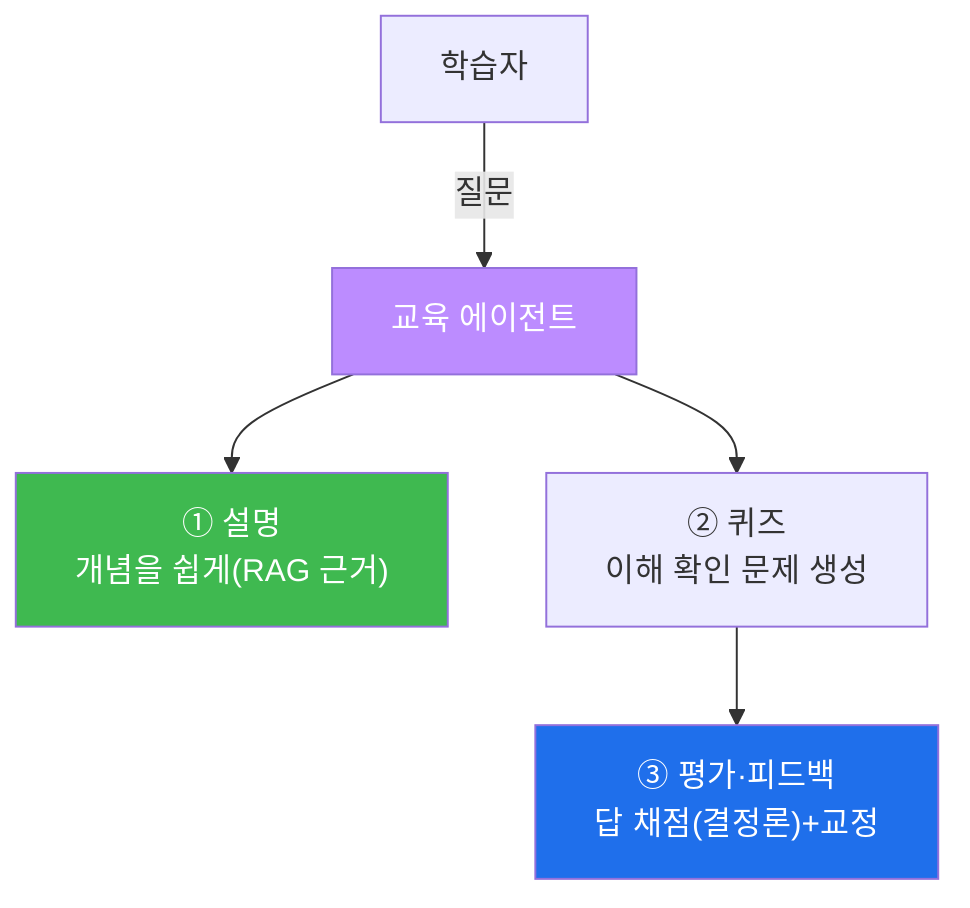
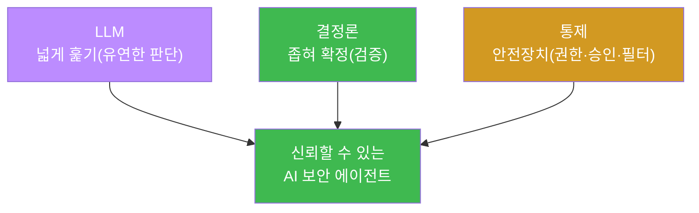
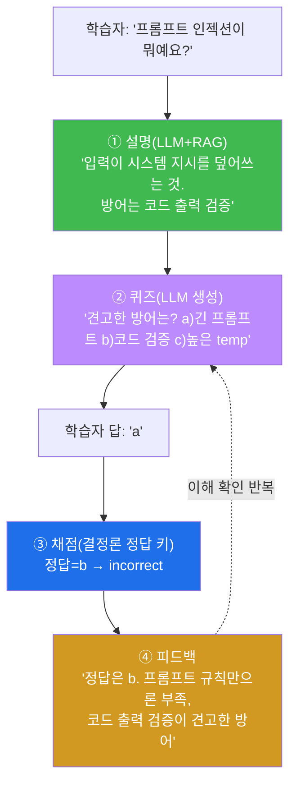
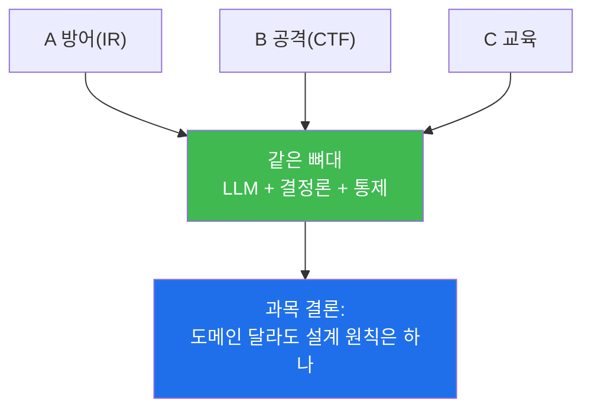
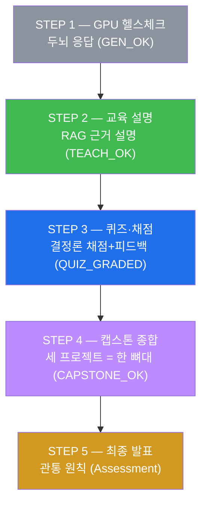
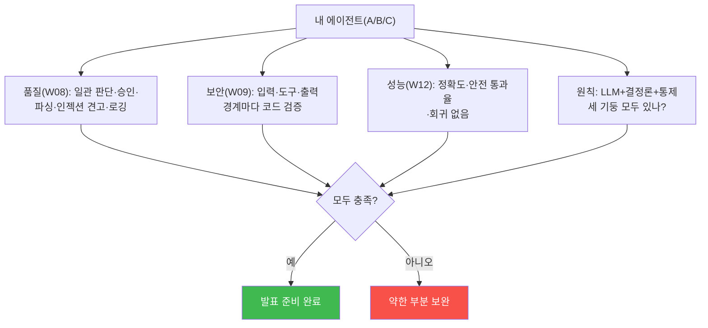
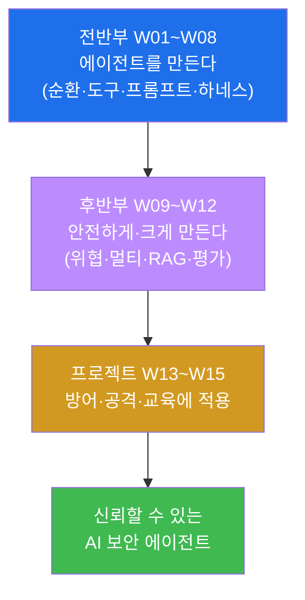

# aisec W15 — 프로젝트 C: 보안 교육 에이전트 + 최종 발표·종합

> **본 주차의 한 줄 요약**
>
> 마지막 주는 프로젝트 C **보안 교육 에이전트** 와 과목 전체의 **종합 발표** 다. 보안 교육
> 에이전트는 개념을 **설명하고**, 이해를 확인하는 **퀴즈를 내고**, 답을 **평가·피드백** 하는
> 에이전트다 — 지금까지 배운 조각(프롬프트·RAG·평가·안전)을 교육 도메인에 적용한다. 그리고
> 세 프로젝트(A 방어 IR·B 공격 CTF·C 교육)를 묶어, 이 과목이 관통한 **하나의 원칙** 을
> 확인하며 마친다: **좋은 AI 보안 에이전트 = LLM(넓게 훑기) + 결정론(좁혀 확정) + 통제(안전
> 장치).** 에이전트를 만들고(전반부), 안전하게·크게 만들고(후반부), 방어·공격·교육에 적용
> (프로젝트)하기까지 — AI 를 보안에 **신뢰할 수 있게** 쓰는 법을 완성한다.
>
> **한 줄 결론**: 보안 교육 에이전트로 교육 도메인을 다루며 과목을 종합한다. 관통 원칙은
> 변함없다 — **LLM 으로 넓게 훑고, 결정론으로 좁혀 확정하고, 통제로 자율을 길들인다.** 이것이
> aisec 의 결론이다.

---

## 이 주차의 시선 — 세 번째 도메인, 그리고 하나의 원칙

프로젝트 A 는 방어(IR), B 는 공격(CTF)이었다. C 는 세 번째 도메인 — **교육** 이다. 언뜻 방어·
공격과 무관해 보이지만, 만들어 보면 **같은 뼈대** 를 쓴다는 것을 알게 된다. 그리고 그 깨달음이
이 과목의 결론으로 이어진다 — 도메인이 무엇이든, 신뢰할 수 있는 AI 보안 에이전트의 설계 원칙은
하나다.

> **이 주차의 시선** — 교육 에이전트를 만들며, 세 프로젝트가 **하나의 원칙(세 기둥)** 으로
> 꿰인다는 것을 확인하고, 과목을 종합한다. 마지막은 "무엇을 만들었나" 가 아니라 "**어떤
> 원칙을 배웠나**" 다.

---

## 학습 목표

본 주차 종료 시 학생은 다음 5가지를 **본인 손으로** 할 수 있어야 한다.

1. 보안 **교육 에이전트**(설명·퀴즈·평가)를 만든다(TEACH_OK).
2. 학습자 답을 **결정론으로 채점** 하고 피드백한다(QUIZ_GRADED).
3. 세 프로젝트(방어·공격·교육)가 **하나의 뼈대**(LLM+결정론+통제)를 공유함을 확인한다
   (CAPSTONE_OK).
4. 과목 관통 원칙(**LLM 넓게 + 결정론 좁혀 + 통제**)을 설명한다.
5. 자신의 에이전트들을 **평가·시연** 하고, 배운 원칙과 한계·개선점을 발표한다.

---

## 0. 용어 해설 (교육 에이전트·종합)

이번 주는 새 개념보다 **종합** 이다. 용어와 그 근거 주차를 함께 정리한다.

| 용어 | 영문 | 뜻 | 관련 |
|------|------|----|------|
| **교육 에이전트** | Tutor Agent | 설명·퀴즈·평가를 하는 에이전트 | W03·W11·W12 |
| **형성 평가** | Formative Assessment | 학습 중 이해를 확인하는 평가 | 퀴즈 |
| **피드백** | Feedback | 답에 대한 교정·안내 | 첨삭 |
| **결정론 채점** | Deterministic Grading | 정답 키로 채점(지어내지 않음) | W06·W12 |
| **캡스톤** | Capstone | 종합 완성 프로젝트 | 졸업 작품 |
| **세 기둥** | Three Pillars | LLM + 결정론 + 통제 | 전 과목 |

> **헷갈리기 쉬운 한 쌍** — 교육에서 *설명* 은 "LLM 이 근거로 생성"(RAG), *채점* 은 "결정론이
> 정답 키로 대조" 다. 설명은 유연해야 하고 채점은 정확해야 한다 — 여기서도 넓게(설명)와
> 좁혀(채점)가 나뉜다.

---

## 0.5 프로젝트 C 설계 + 과목 종합

### 0.5.1 보안 교육 에이전트 구조



교육 에이전트도 배운 조각의 조합이다 — 설명은 **RAG**(근거 있는 정확한 설명, W11), 퀴즈는
**프롬프트**(형식 강제, W03), 채점은 **결정론 검증**(정답 대조, W12). 교육은 정확성이 생명이므로
**근거·검증** 이 특히 중요하다. 틀린 개념을 가르치면 해롭기 때문이다.

### 0.5.2 세 프로젝트의 종합 — 방어·공격·교육

| 프로젝트 | 관점 | 핵심 흐름 |
|----------|------|-----------|
| A (W13) | 방어(IR) | 감지→조사→분석→검증→대응(승인) |
| B (W14) | 공격(CTF) | 정찰→가설→익스플로잇→검증(안전 경계) |
| C (W15) | 교육 | 설명→퀴즈→평가(근거+검증) |

셋 다 **같은 뼈대** 를 쓴다: 에이전트 순환 + 하네스 + LLM 판단 + 결정론 검증 + 안전장치.
도메인만 다를 뿐 설계 원칙은 하나다. STEP 4 가 이것을 코드로 확인한다.

### 0.5.3 과목 관통 원칙 — 세 기둥



- **LLM(넓게)** — 유연한 판단·분석·계획. 하지만 환각·인젝션에 취약.
- **결정론(좁혀)** — LLM 출력을 규칙으로 검증해 신뢰를 준다.
- **통제(안전)** — 권한·승인·필터로 자율을 길들인다.

셋 중 하나라도 빠지면 신뢰할 수 없다 — 이것이 aisec 전체의 결론이다.

### 0.5.4 최종 발표 — 만든 것을 증명

최종 발표는 (1) 만든 에이전트들(IR·CTF·교육)을 **시연**, (2) 평가 지표(정확도·안전) **제시**,
(3) 배운 원칙 **정리**, (4) 한계·개선점 **성찰** 로 구성한다. **"무엇을 만들었나" 보다 "얼마나
신뢰할 수 있게·안전하게 만들었나"** 를 증명한다.

### 0.5.5 이 과목을 마치며

AI 를 보안에 쓰는 법은 "LLM 에게 다 맡기기" 가 아니라 **LLM 의 유연함을 결정론의 신뢰로 감싸고
통제로 길들이는 것** 이다. 여러분은 이제 보안 에이전트를 **설계·구축·방어·평가** 할 수 있다.
이 원칙은 bastion 을 넘어 앞으로 만날 모든 AI 시스템에 적용된다.

---

## 1. 보안 교육 에이전트란

### 1.1 한 줄 답: 설명하고 묻고 평가하는 에이전트

**보안 교육 에이전트** 는 학습자에게 개념을 **설명** 하고, 이해를 확인하는 **퀴즈** 를 내고,
답을 **채점·피드백** 하는 에이전트다. 방어·공격 에이전트가 시스템을 다뤘다면, 교육 에이전트는
**사람의 학습** 을 돕는다.

### 1.2 교육은 왜 정확성이 특히 중요한가

교육 도메인의 특징은 **틀리면 해롭다** 는 것이다. 방어 에이전트가 오탐하면 헛경보로 끝나지만,
교육 에이전트가 틀린 개념을 가르치면 **학습자가 잘못 배운다.** 그래서 교육 에이전트는 (a) 설명을
**근거(RAG)** 에 묶어 정확히 하고, (b) 채점을 **결정론(정답 키)** 으로 해 오채점을 막는다. 이
과목이 강조한 "근거 + 검증" 이 교육에서 가장 중요하다.

### 1.3 교육 에이전트도 세 기둥 위에 있다

교육 에이전트도 예외가 아니다 — **LLM(설명 생성) + 결정론(정답 키 채점) + 통제(근거 검증)** 의
세 기둥 위에 있다. 설명은 LLM 이 유연하게 하되 근거에 묶고, 채점은 결정론이 정확히 하고,
근거 없는 설명은 걸러낸다. 도메인은 교육이지만 뼈대는 방어·공격과 같다.

---

## 2. 근거 기반 설명 — 교육은 정확성

### 2.1 한 줄 정의와 왜 중요한가

**한 줄 정의**: 교육 에이전트의 설명은 **근거 문서(RAG)에 기반해** 개념을 정확하고 쉽게
전달하는 것이다.

**왜 중요한가**: LLM 이 기억으로 설명하면 틀린 개념(환각)을 가르칠 수 있다. 근거에 묶으면
정확한 설명이 보장된다. 교육에서 정확성은 타협할 수 없다.

### 2.2 el34 에서 어떻게 — 근거로 개념 설명 (STEP 2)

STEP 2 는 프롬프트 인젝션 개념을 근거 문서에 기반해 설명한다.

```
근거 문서: "Prompt injection: attacker input overrides the system instructions;
           defense is code-level output validation, not prompt rules alone."
system:   "You are a security tutor. Explain ... using ONLY the provided context."

→ 설명: "프롬프트 인젝션은 공격자 입력이 시스템 지시를 덮어쓰는 것이다. 방어는
        프롬프트 규칙이 아니라 코드 레벨 출력 검증이다."
```

마커 `TEACH_OK` 는 설명에 근거의 핵심(override/instruction/injection)이 반영됐을 때 나온다.
**RAG(W11)로 근거를 대 정확히 설명** 한 것이다. 이 과목에서 배운 개념을, 이 과목에서 배운 RAG
로 가르치는 셈이다.

### 2.3 한계

소형 모델은 근거를 무시하거나 과하게 단순화할 수 있다. 그래서 교육 에이전트도 (a) 근거 지시를
강화하고, (b) 근거 검증(W11)으로 "근거 없는 설명" 을 걸러내며, (c) 중요한 개념은 사람이 검수
한다. 교육의 정확성은 근거 + 검증 + 사람 검수의 합이다.

---

## 3. 퀴즈·채점 — 결정론으로 채점

### 3.1 한 줄 정의와 왜 중요한가

**한 줄 정의**: 교육 에이전트는 이해를 확인하는 **퀴즈를 생성** 하고, 학습자 답을 **정답 키로
결정론 채점** 한 뒤 피드백한다.

**왜 중요한가**: 설명만으론 학습이 확인되지 않는다. 퀴즈로 이해를 점검해야 교육이 완성된다.
그리고 채점은 **오채점이 없어야** 하므로 LLM 이 아니라 정답 키로 결정론 채점한다.

### 3.2 el34 에서 어떻게 — 정답 키 채점 + 피드백 (STEP 3)

STEP 3 은 퀴즈를 내고 학습자 답을 채점한다.

```
퀴즈: "프롬프트 인젝션의 견고한 방어는?"
  a) 더 긴 프롬프트  b) 코드 레벨 출력 검증  c) 높은 temperature
  정답: b

채점(정답 키로 결정론):
  student1: "b" → correct  → "잘했어요."
  student2: "a" → incorrect → "복습: 정답은 'b'(코드 레벨 출력 검증)."
```

마커 `QUIZ_GRADED` 는 정답(b)을 낸 학생은 correct, 오답(a)은 incorrect 로 채점될 때 나온다.
**채점은 LLM 이 아니라 정답 키로 결정론 검증** 한다 — 교육의 신뢰(오채점 방지)를 위해서다.
틀린 답에는 **교정 피드백** 을 준다(단순 X 가 아니라 "정답은 b, 이유는…").

### 3.3 왜 채점은 결정론인가

여기서 이 과목의 척추가 또 나타난다. **퀴즈 생성(설명·문제 만들기)은 LLM 이 유연하게**(넓게),
**채점은 결정론이 정답 키로 정확히**(좁혀). 만약 채점을 LLM 에 맡기면, 소형 모델이 맞는 답을
틀렸다 하거나(오채점) 그 반대일 수 있다 — 교육에서 치명적이다. 그래서 **채점은 반드시 결정론**
이다. 넓게(생성)와 좁혀(채점)의 분담이 교육에도 그대로 적용된다.

### 3.4 한 세션 따라가기 — 설명→퀴즈→채점→피드백

교육 에이전트가 한 학습자를 어떻게 돕는지, 프롬프트 인젝션 개념을 가르치는 한 세션을 처음부터
끝까지 따라가 본다.



1. **설명** — 학습자 질문에 RAG 근거로 정확히 설명(LLM, 넓게).
2. **퀴즈** — 이해를 확인할 문제를 생성(LLM, 형식 강제).
3. **채점** — 학습자 답을 정답 키로 결정론 채점(결정론, 좁혀).
4. **피드백** — 틀린 답에 **왜 틀렸고 정답이 무엇인지** 교정. 단순 X 가 아니라 학습으로 잇는다.

한 세션에 이 과목의 조각들이 다 모인다 — RAG(설명)·프롬프트(퀴즈)·결정론(채점)·안전(근거 검증).
그리고 흐름은 W01 의 관찰(질문)→결정(설명·문제)→행동(채점·피드백) 순환이다. **교육조차 같은
뼈대** 로 만들어진다는 것을, 한 세션을 따라가며 확인한다.

---

## 4. 세 프로젝트 종합 — 하나의 뼈대

### 4.1 한 줄 정의와 왜 중요한가

**한 줄 정의**: 세 프로젝트(방어 IR·공격 CTF·교육)는 도메인이 다르지만 **같은 뼈대** — LLM +
결정론 + 통제 — 를 공유한다.

**왜 중요한가**: 이 깨달음이 과목의 결론이다. 특정 도메인의 기법이 아니라, **모든 AI 보안
에이전트에 통하는 설계 원칙** 을 배운 것이다. 새 도메인을 만나도 이 뼈대로 설계할 수 있다.

### 4.2 el34 에서 어떻게 — 세 프로젝트의 뼈대 대조 (STEP 4)

STEP 4 는 세 프로젝트가 세 기둥을 모두 갖는지 확인한다.

| 프로젝트 | LLM(넓게) | 결정론(좁혀) | 통제(안전) |
|----------|-----------|--------------|------------|
| A 방어(IR) | 증거 분석 | 심각도 확정 | 승인 게이트 |
| B 공격(CTF) | 취약점 가설 | 플래그 검증 | 인가 표적만 |
| C 교육 | 개념 설명 | 정답 키 채점 | 근거 검증 |

마커 `CAPSTONE_OK` 는 세 프로젝트가 모두 세 기둥(llm·deterministic·control)을 가질 때 나온다.
**방어·공격·교육 — 도메인은 달라도 관통 원칙(세 기둥)은 하나** 임을 코드로 확인한다.



### 4.3 왜 뼈대가 같은가

세 도메인이 같은 뼈대를 쓰는 이유는, 셋 다 **"똑똑하지만 믿을 수 없는 LLM 을 신뢰할 수 있게
쓰는"** 같은 문제를 풀기 때문이다. 방어든 공격이든 교육이든, LLM 의 유연함이 필요하고, 그
판단은 검증돼야 하며, 그 자율은 통제돼야 한다. **문제가 같으니 해법(세 기둥)도 같다.** 이것이
이 과목이 특정 기법 모음이 아니라 **하나의 설계 철학** 을 가르친 이유다.

---

## 5. 관통 원칙 — 세 기둥 (과목의 결론)

### 5.1 15주를 관통한 하나의 문장

이 과목의 모든 주차는 하나의 문장으로 수렴한다.

> **LLM 으로 넓게 훑고, 결정론으로 좁혀 확정하고, 통제로 자율을 길들인다.**

각 주차가 이 문장의 어느 부분을 채웠는지 돌아보면, 과목 전체가 하나의 그림으로 보인다.

| 기둥 | 채운 주차 |
|------|-----------|
| **LLM(넓게)** | W01 순환·W02 도구·W03 프롬프트·W10 멀티에이전트·W11 RAG |
| **결정론(좁혀)** | W01 triage·W06 검증·W10 교차 검증·W12 평가·전 프로젝트 |
| **통제(안전)** | W02 LLM≠실행·W04·W05 권한·W09 4대 위협·W13·W14 승인/경계 |

W01 에서 "관찰→결정→행동" 을 만들 때 이미 이 세 기둥의 씨앗이 있었고(LLM 판단·결정론 triage·
승인 표시), 15주에 걸쳐 그것이 자라 완성됐다.

### 5.2 왜 세 기둥이 모두 필요한가

하나라도 빠지면 무너진다.

- **결정론 없이 LLM 만** — 환각·인젝션에 그대로 노출(믿을 수 없음).
- **통제 없이 LLM+결정론** — 판단은 맞아도 위험 행동을 함부로 실행(위험).
- **LLM 없이 결정론+통제** — 규칙으로 못 적는 애매한 판단을 못 함(전통 자동화의 한계).

세 기둥이 함께여야 **유연하고(LLM), 믿을 수 있고(결정론), 안전한(통제)** 에이전트가 된다.

### 5.3 이 원칙은 bastion 을 넘어선다

이 과목은 el34-bastion 이라는 구체적 환경에서 배웠지만, 세 기둥은 **모든 AI 시스템** 에
적용된다. 챗봇이든, 코딩 에이전트든, 자율 로봇이든 — "똑똑하지만 믿을 수 없는 모델을 신뢰할
수 있게 쓰는" 문제는 같다. 여러분이 앞으로 어떤 AI 를 만들든, 이 세 기둥이 나침반이 된다.

### 5.4 15주 여정 돌아보기 — 각 주가 무엇을 남겼나

과목을 마치며 15주를 한 번에 돌아본다. 각 주가 세 기둥의 어느 벽돌을 놓았는지 보면, 흩어진
주차가 하나의 건축물로 보인다.

| 주차 | 배운 것 | 남긴 벽돌 |
|------|---------|-----------|
| W01 | 에이전트란(PDA·ReAct·triage) | LLM 판단 + 결정론 triage 의 씨앗 |
| W02 | Tool Calling | LLM≠실행 권한(통제의 시작) |
| W03 | 프롬프트=신뢰성 공학 | 형식·인젝션 방어(넓게를 믿을 수 있게) |
| W04 | 하네스 개론(7대 구성요소) | 운영 골격 + harness engineering |
| W05 | 서버 하네스 Bastion | Manager–SubAgent·화이트리스트(통제) |
| W06 | Playbook + RL | E.G 지식·경험, reward hacking 경계 |
| W07 | 클라이언트 하네스 Claude Code | CLAUDE.md·권한, 참고서 설계 3원칙 |
| W08 | 중간 실습(나만의 에이전트) | 4부품 조립·두 안전선·5조건 |
| W09 | 에이전트 4대 위협 | 입력·도구·출력 코드 계층 방어 |
| W10 | 멀티에이전트 | 교차 검증·신뢰 경계(결정론 확장) |
| W11 | RAG | 검색된 근거로 판단(넓게+근거 검증) |
| W12 | 평가·벤치마크 | 정확도·안전·회귀(지표로 증명) |
| W13 | 프로젝트 A: 자율 IR | 방어 파이프라인(세 기둥 종합) |
| W14 | 프로젝트 B: CTF | 공격 이해로 방어 심화(안전 경계) |
| W15 | 프로젝트 C: 교육 + 종합 | 세 도메인 = 한 뼈대(과목 결론) |

전반부(W01~W08)가 **에이전트를 만드는** 벽돌이었고, 후반부(W09~W12)가 **안전하게·크게 만드는**
벽돌이었으며, 프로젝트(W13~W15)가 그것을 **방어·공격·교육에 적용** 한 지붕이다. 어느 주도 혼자가
아니라, 세 기둥이라는 하나의 설계 위에 얹혔다. 막히는 개념이 있으면 그 벽돌의 주차로 돌아가면
된다 — 모든 주차가 이 표로 이어져 있다.

### 5.5 실무로 나가며 — 세 기둥을 쓰는 곳

이 과목에서 배운 세 기둥은 학교 밖 실무에서 그대로 쓰인다. 어디에 적용되는지 짚어, 배운 것이
어떤 길로 이어지는지 보인다.

| 실무 분야 | 하는 일 | 세 기둥의 적용 |
|-----------|---------|----------------|
| **SOC 자동화(SOAR)** | 경보 자동 분류·조사·대응 | LLM 분류(넓게)+결정론 검증(좁혀)+승인(통제) — 프로젝트 A |
| **AI 레드팀** | AI 시스템의 취약점 점검 | 공격 추론(넓게)+검증(좁혀)+인가 경계(통제) — 프로젝트 B |
| **보안 AI 개발** | 에이전트 제품을 안전하게 구축 | 하네스·4대 위협 방어·평가 — W04~W12 |
| **AI 거버넌스** | AI 시스템의 안전·감사 정책 | 승인 게이트·감사 로깅·평가 지표 — 통제 전반 |

- **SOC 자동화** — 기업 보안 관제의 미래다. 쏟아지는 경보를 사람이 다 못 보니, 여러분이 만든
  자율 IR 같은 에이전트가 1차 처리한다. 세 기둥이 그 신뢰의 조건이다.
- **AI 레드팀** — AI 가 곳곳에 쓰이면서, "이 AI 를 어떻게 뚫나" 를 점검하는 전문가 수요가
  는다. 프로젝트 B 의 공격 추론이 그 출발점이다(인가 경계 안에서).
- **보안 AI 개발·거버넌스** — AI 제품을 **안전하게 만들고 감사** 하는 일. 하네스·위협 방어·
  평가·통제가 곧 그 실무 역량이다.

공통점은 하나다 — 어디서든 **"똑똑하지만 믿을 수 없는 AI 를 신뢰할 수 있게 쓰는"** 문제를
풀고, 그 해법이 세 기둥이라는 것. 여러분은 이제 그 문제를 풀 도구를 갖췄다.

---

## 6. 최종 발표 + 실습으로 가기 전

### 6.1 최종 발표 구성

프로젝트 C 실습(STEP 5)은 최종 발표 노트를 생성한다. 좋은 최종 발표는 넷을 담는다.

- **시연** — 만든 에이전트(IR·CTF·교육)가 실제로 도는 것을 보인다.
- **지표** — 정확도·안전 통과율로 "얼마나 잘·안전한지" 를 숫자로 제시.
- **원칙** — 배운 세 기둥과, 각 프로젝트에 어떻게 적용됐는지.
- **성찰** — 한계와 개선점("조사 소스가 적다", "채점을 서술형으로 확장" 등).

### 6.2 큰 그림 한 장



교육 설명(STEP 2) → 퀴즈·채점(STEP 3) → 세 프로젝트 종합(STEP 4) → 최종 발표(STEP 5). 마지막
프로젝트를 만들고, 과목 전체를 하나의 원칙으로 종합한다.

### 6.3 최종 점검 체크리스트 — 발표 전에 세 에이전트를

발표 전, 만든 세 에이전트(IR·CTF·교육)를 이 과목이 세운 기준으로 최종 점검한다. W08 5조건(품질)
+ W09 5항목(보안) + W12 지표(성능)를 하나로 묶은 것이다.



- **품질(W08)** — 판단이 일관적인가, 위험 행동에 승인이, 출력이 파싱되나, 인젝션에 견고한가,
  로깅되나.
- **보안(W09)** — 입력·도구·출력 세 경계에 코드 검증이 있나.
- **성능(W12)** — 정확도·안전 통과율이 목표 이상인가, 회귀는 없나.
- **원칙** — LLM(넓게)·결정론(좁혀)·통제(안전) 세 기둥이 모두 구현됐나.

이 네 축을 통과하면 발표 준비가 된 것이다. 하나라도 약하면 그 부분을 보완한다 — 그 자체가
과목이 가르친 "지표로 개선" 의 실천이다. 발표는 "완벽하다" 가 아니라 **"이 기준으로 점검했고,
여기가 강하고 여기를 개선하겠다"** 를 보이는 것이다.

---

## 7. 프로젝트 C 실습 안내 (총 5 미션)

각 실습은 **4축 설명** — (a) 왜 하는가 (b) 무엇을 알 수 있는가 (c) 결과 해석 (d) 실전 활용.
명령은 el34 **호스트**(`ssh ccc@{{TARGET_IP}}`, 비밀번호 `1`)에서 실행하며, 두뇌는 GPU
`http://211.170.162.139:10934`(gemma3:4b)를 호출한다.

### 실습 1 — GPU 헬스체크 (→ GEN_OK)

> **왜 하는가?** 마지막 프로젝트의 두뇌(GPU)가 응답하는지 확인한다.
>
> **무엇을 알 수 있는가?** gemma3:4b 가 텍스트를 생성하는지(이전 주와 동일).
>
> **결과 해석.** `GEN_OK` 면 정상, `GEN_EMPTY`/오류면 서버·네트워크부터 해결한다.
>
> **실전 활용.** 15주 내내 반복한 첫 점검 습관 — 어떤 AI 시스템이든 도달성 확인부터.

### 실습 2 — 교육 에이전트 설명 (→ TEACH_OK)

> **왜 하는가?** 교육 에이전트의 **설명** 을 근거 기반으로 만든다. 교육의 정확성을 RAG 로
> 보장하는 법을 익힌다.
>
> **무엇을 알 수 있는가?** 근거 문서에 기반해 프롬프트 인젝션 개념을 정확히 설명하는 법을
> 본다(이 과목의 개념을, 이 과목의 RAG 로 가르침).
>
> **결과 해석.** 마지막 줄 `TEACH_OK` 는 설명에 근거의 핵심이 반영됐다는 뜻이다. `OFF_TOPIC`
> 이면 근거를 벗어난 것 — 근거 지시를 강화한다.
>
> **실전 활용.** 교육은 정확성이 생명이다. 틀린 개념을 가르치지 않으려면 근거(RAG) + 검증이
> 필수다.

### 실습 3 — 퀴즈·채점 (→ QUIZ_GRADED)

> **왜 하는가?** 이해를 확인하는 **퀴즈** 와, 오채점 없는 **결정론 채점** 을 만든다.
>
> **무엇을 알 수 있는가?** 퀴즈를 내고 학습자 답을 정답 키로 결정론 채점하며, 틀린 답에 교정
> 피드백을 주는 법을 본다.
>
> **결과 해석.** 마지막 줄 `QUIZ_GRADED` 는 정답·오답이 올바로 채점됐다는 뜻이다.
> `GRADING_ERROR` 면 채점 로직이 어긋난 것이다. 채점을 LLM 이 아니라 정답 키로 하는 이유
> (오채점 방지)를 확인한다.
>
> **실전 활용.** 생성(퀴즈)은 LLM, 채점은 결정론 — 넓게와 좁혀의 분담이 교육에도 적용된다.

### 실습 4 — 캡스톤 종합 (→ CAPSTONE_OK)

> **왜 하는가?** 세 프로젝트(방어·공격·교육)가 **같은 뼈대** 를 쓴다는 과목의 결론을 코드로
> 확인한다.
>
> **무엇을 알 수 있는가?** 세 프로젝트 각각이 LLM(넓게)·결정론(좁혀)·통제(안전) 세 기둥을 모두
> 가짐을 대조한다.
>
> **결과 해석.** 마지막 줄 `CAPSTONE_OK` 는 세 프로젝트가 세 기둥을 공유함을 뜻한다.
> `INCONSISTENT` 면 어떤 프로젝트에 기둥이 빠진 것이다. 도메인이 달라도 원칙이 하나임을 확인한다.
>
> **실전 활용.** 새 도메인의 AI 에이전트를 만날 때도, 이 세 기둥으로 설계·점검할 수 있다.

### 실습 5 — 최종 발표 (→ Assessment)

> **왜 하는가?** 과목 전체를 하나의 발표로 종합한다. 배운 원칙을 본인 말로 정리한다.
>
> **무엇을 알 수 있는가?** GPU 에게 과목 성과(TEACH_OK·QUIZ_GRADED·CAPSTONE_OK)를 근거로 최종
> 발표 노트를 쓰게 한다. 노트는 세 프로젝트 종합과 관통 원칙(LLM 넓게 + 결정론 좁혀 + 통제)을
> 담는다.
>
> **결과 해석.** 출력에 `Assessment` 가 있으면 형식을 지킨 것이다. 관통 원칙과 성찰이 담겼는지
> 스스로 확인한다.
>
> **실전 활용.** 최종 발표는 "무엇을 만들었나" 보다 "얼마나 신뢰할 수 있게 만들었나, 어떤
> 원칙을 배웠나" 를 증명한다. 이 원칙이 앞으로 만들 모든 AI 시스템의 나침반이다.

---

## 8. 흔한 오해·블루팀 노트

- **"교육 에이전트는 설명만 하면 된다"** — 퀴즈·채점·피드백으로 이해를 확인해야 교육이다.
  채점은 결정론 검증으로.
- **"교육은 정확성이 덜 중요하다"** — 반대다. 틀린 개념을 가르치면 해롭다. 근거(RAG) + 검증이
  필수다.
- **"발표는 데모만 보이면 된다"** — 평가 지표·안전·성찰까지. 신뢰성을 증명하는 것이 발표다.
- **"세 기둥 중 하나만 있어도 된다"** — 셋 다 필요하다. 하나라도 빠지면 신뢰할 수 없다.
- **관제 관점** — 세 에이전트가 각자 안전장치·검증·평가를 갖췄는지, 관통 원칙(LLM+결정론+통제)이
  구현됐는지 종합 점검한다. 이 과목의 모든 관제 관점의 통합이다.

---

## 9. 과목을 마치며

W01 의 "에이전트란 무엇인가" 부터 W15 의 세 프로젝트까지, 여러분은 **AI 보안 에이전트를 설계·
구축·방어·평가** 하는 법을 배웠다.



핵심은 하나다: **LLM 으로 넓게 훑고, 결정론으로 좁혀 확정하고, 통제로 자율을 길들인다.** 이
원칙으로 신뢰할 수 있는 AI 보안 에이전트를 만들어 가길 바란다.

AI 를 보안에 쓰는 일은 "모델에게 다 맡기기" 가 아니다. **모델의 유연함을 규칙의 신뢰로 감싸고,
통제로 길들이는 일** 이다. 그 힘은 언제나 **지키기 위해** 쓴다 — 인가된 환경에서, 책임 있게.
수고했습니다.
