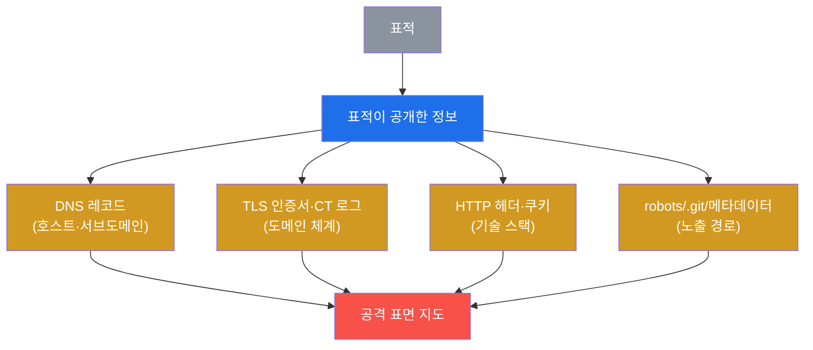
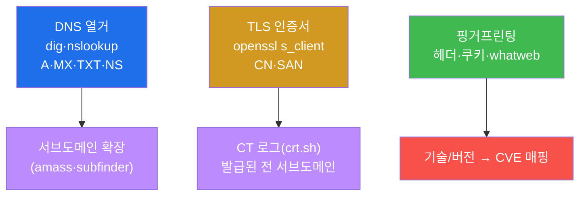
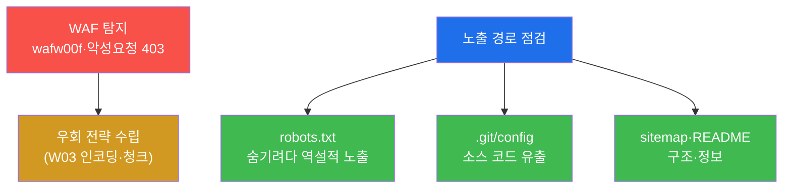

# 공격고급 W02 — OSINT·수동 정찰: 표적이 모르게 공격 표면을 그린다

> **본 주차의 한 줄 요약**
>
> W01의 정찰은 nmap으로 표적을 직접 두드리는 **능동** 정찰이었다 — 정확하지만 IDS에 흔적을 남긴다. 본 주차는
> 그 반대다. **OSINT(공개 출처 정보, Open-Source Intelligence)** 와 **수동 정찰**은 표적과의 직접 상호작용을
> 최소화하면서 — DNS, TLS 인증서, 웹 기술 핑거프린팅, 공개 메타데이터로 — 공격 표면을 그린다. 표적은 자신이
> 정찰당하는 줄 거의 모른다. 본 주차에 학생은 el34에서 dig·openssl·whatweb·wafw00f로 표적의 지도를 그리고,
> 공격 전에 방어(WAF)까지 파악한다.
>
> **레드팀 한 줄 결론**: 좋은 정찰이 좋은 공격을 만든다. 침투의 성패는 익스플로잇 실력 이전에 **표적을 얼마나
> 아느냐**에 달려 있다 — 그리고 가장 좋은 정보는 표적이 스스로 공개한 곳(DNS·인증서·헤더)에 이미 있다.

---

## ⚠️ 윤리 고지

OSINT라도 **인가 없는 표적 정찰은 금지**다. 본 실습은 el34 인가 표적에만 수행한다. 능동 요청(curl·whatweb)은
표적에 흔적을 남기므로 더더욱 인가 범위를 지킨다.

---

## 학습 목표

본 주차 종료 시 학생은 다음 5가지를 **본인 손으로** 할 수 있어야 한다.

1. **수동 정찰(OSINT)** 과 **능동 정찰**의 차이와 은밀성 트레이드오프를 설명한다.
2. **DNS 열거**로 호스트·서브도메인을 발견한다.
3. **TLS 인증서**(CN/SAN)와 CT 로그로 도메인 체계를 파악한다.
4. **웹 기술 핑거프린팅**으로 기술 스택을 식별하고 CVE를 매핑한다.
5. **WAF 탐지**와 **노출 경로** 점검으로 방어·정보원을 파악하고 공격 표면을 종합한다.

---

## 0. 용어 해설

| 용어 | 영문 | 뜻 | 비유 |
|------|------|----|------|
| **OSINT** | Open-Source Intelligence | 공개 출처 정보 수집 | 공개 자료 조사 |
| **수동 정찰** | passive recon | 표적과 상호작용 최소 | 멀리서 관찰 |
| **능동 정찰** | active recon | 직접 스캔·요청 | 직접 두드려보기 |
| **DNS 열거** | DNS enumeration | DNS 레코드 수집 | 전화번호부 조사 |
| **서브도메인** | subdomain | 하위 도메인(api·dev…) | 건물의 부속동 |
| **CT 로그** | Certificate Transparency | 발급된 인증서 공개 기록 | 등기부 등본 |
| **핑거프린팅** | fingerprinting | 기술/버전 식별 | 차종 식별 |
| **CVE** | — | 공개 취약점 식별번호 | 알려진 결함 목록 |
| **WAF** | Web Application Firewall | 웹 공격 차단 방화벽 | 입구 검색대 |
| **공격 표면** | attack surface | 공격 가능한 지점의 총합 | 침입 가능한 모든 문·창 |

> **헷갈리기 쉬운 한 쌍 — 수동 vs 능동 정찰.** **수동**은 표적을 직접 건드리지 않고 제3자 출처(공개 DNS·CT
> 로그·검색엔진)에서 정보를 얻는다 — 표적은 모른다. **능동**은 표적에 직접 패킷을 보낸다(nmap·whatweb) —
> 정확하지만 로그에 남는다. 엄밀히 whatweb·curl은 능동(표적에 요청)이지만 단발이라 스캔보다 은밀하다. 실무
> 순서는 **수동으로 밑그림 → 능동으로 확증**이다.

---

## 1. 왜 수동 정찰인가

### 1.1 한 줄 답: 표적이 모르게, 그러나 깊이

공격의 첫 원칙은 "들키지 않기"다. 능동 스캔은 IDS를 울린다 — 방어자는 "누가 우리를 정찰한다"를 알고 경계를
높인다. 수동 정찰은 표적이 스스로 공개한 정보(DNS·인증서·검색 결과)를 모으므로 표적이 거의 눈치채지 못한다.

### 1.2 왜 중요한가 — 정찰이 침투를 결정한다

침투 단계에서 "어디를 어떻게 칠지"는 모두 정찰에서 나온다. 기술 스택을 알면 CVE를 매핑하고, WAF를 알면
우회를 준비하고, 서브도메인을 찾으면 약한 고리(개발 서버 등)를 노린다. **정찰이 부실하면 침투는 더듬거린다.**

### 1.3 한계 — 결국 능동이 필요

수동 정찰은 밑그림이지 확증이 아니다. 실제 취약점은 능동으로 확인해야 한다(W01). 그래서 둘은 순서다 — 은밀한
수동으로 좁히고, 정밀한 능동으로 확정한다.

---

## 2. DNS · TLS/CT · 핑거프린팅

**DNS** — `dig`/`nslookup`으로 호스트 IP·메일 서버·TXT를 얻고, 서브도메인 무차별(amass)로 숨은 자산(dev·api·
staging)을 찾는다. **TLS 인증서** — `openssl s_client`로 인증서의 CN/SAN을 보면 도메인 체계가 드러난다(el34는
`*.6v6.lab` 와일드카드). **CT 로그**(Certificate Transparency)는 발급된 모든 인증서를 공개하므로 crt.sh로
전 서브도메인을 추적할 수 있다 — 표적이 모르는 강력한 정보원. **핑거프린팅** — Server 헤더·쿠키(PHPSESSID)·
whatweb로 기술 스택을 식별하면 그 버전의 알려진 CVE를 공격 후보로 삼는다.

---

## 3. WAF 탐지 · 노출 경로

**WAF 탐지** — 공격 전에 방어를 안다. `wafw00f`나 악성 요청에 대한 403 응답으로 WAF 유무를 판단한다. WAF가
있으면 W03의 우회 기법(인코딩·청크·케이스 변형)이 필요함을 미리 안다. **노출 경로** — `robots.txt`는 숨기려는
경로를 역설적으로 알려주고, 실수로 노출된 `.git/config`는 소스 코드 전체 유출로 이어질 수 있다. 이런 메타데이터는
뜻밖의 강력한 정보원이다.

---

## 4. 공격 표면 종합

수집한 모든 정보 — 호스트(DNS), 도메인 체계(인증서/CT), 기술 스택(핑거프린팅), 방어(WAF), 노출 경로 — 를
하나의 **공격 표면 지도**로 종합한다. 이 지도가 다음 단계(W01 능동 정찰·침투)의 우선순위를 정한다.

| 정보원 | 얻는 것 | 공격 활용 | 방어 대응 |
|--------|---------|-----------|-----------|
| DNS | 호스트·서브도메인 | 약한 고리(dev) | 내부 DNS 분리 |
| TLS/CT | 도메인 체계 | 서브도메인 발견 | 와일드카드·정보 최소화 |
| 핑거프린팅 | 기술·버전 | CVE 매핑 | 배너 숨김·패치 |
| WAF | 방어 유무 | 우회 준비 | WAF 강화 |
| 노출 경로 | .git·robots | 소스·경로 | 접근 차단 |

방어자 관점에서 이 표는 "내가 무엇을 노출하고 있나"의 체크리스트가 된다 — **노출 최소화**가 수동 정찰에 대한
최선의 방어다.

---

## 5. 실습 안내 (8 미션)

1. **OSINT 도구**. 2. **DNS 열거**. 3. **TLS 인증서**. 4. **핑거프린팅**. 5. **WAF 탐지**. 6. **노출 경로**.
7. **표면 종합**. 8. **보고서**.

> 명령은 el34 호스트에서 `docker exec el34-attacker`로. **인가된 표적(10.20.30.1)에만**.

---

## 6. 다음 주차 (W03) 예고 — 네트워크 우회·방어 회피

W02에서 WAF의 존재를 탐지했다. W03은 그 방어를 **우회**하는 기법 — 페이로드 인코딩·난독화, 방화벽/IDS 회피,
터널링으로 탐지를 피하는 법을 다룬다.
