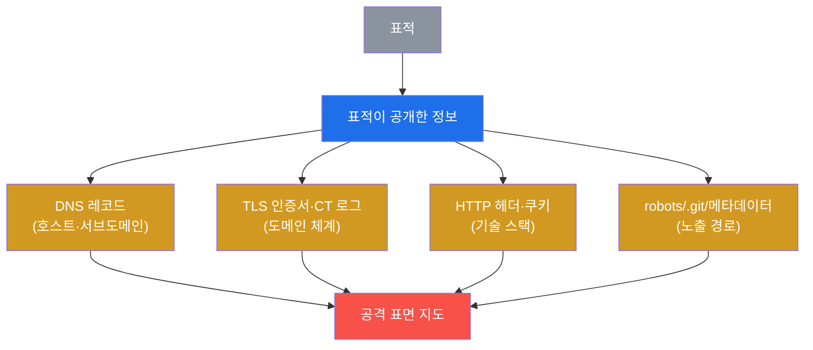
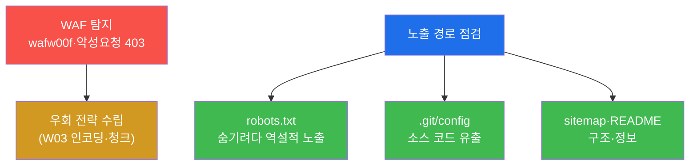

# 공격고급 W02 — OSINT·수동 정찰: 표적이 모르게 공격 표면을 그린다

> **본 주차의 한 줄 요약**
>
> W01의 정찰은 nmap으로 표적을 직접 두드리는 **능동** 정찰이었다 — 정확하지만 IDS에 흔적을 남긴다. 본 주차는
> 그 반대다. **OSINT(공개 출처 정보, Open-Source Intelligence)** 와 **수동 정찰**은 표적과의 직접 상호작용을
> 최소화하면서 — DNS, TLS 인증서, 웹 기술 핑거프린팅, 공개 메타데이터로 — 공격 표면을 그린다. 표적은 자신이
> 정찰당하는 줄 거의 모른다. 본 주차에 학생은 el34에서 dig·openssl·whatweb·wafw00f로 표적의 지도를 그리고,
> 공격 전에 방어(WAF)까지 파악한다.
>
> **레드팀 한 줄 결론**: 좋은 정찰이 좋은 공격을 만든다. 침투의 성패는 익스플로잇 실력 이전에 **표적을 얼마나
> 아느냐**에 달려 있다 — 그리고 가장 좋은 정보는 표적이 스스로 공개한 곳(DNS·인증서·헤더)에 이미 있다.

---

## ⚠️ 윤리 고지

OSINT라도 **인가 없는 표적 정찰은 금지**다. 본 실습은 el34 인가 표적에만 수행한다. 능동 요청(curl·whatweb)은
표적에 흔적을 남기므로 더더욱 인가 범위를 지킨다.

---

## 학습 목표

본 주차 종료 시 학생은 다음 5가지를 **본인 손으로** 할 수 있어야 한다.

1. **수동 정찰(OSINT)** 과 **능동 정찰**의 차이와 은밀성 트레이드오프를 설명한다.
2. **DNS 열거**로 호스트·서브도메인을 발견한다.
3. **TLS 인증서**(CN/SAN)와 CT 로그로 도메인 체계를 파악한다.
4. **웹 기술 핑거프린팅**으로 기술 스택을 식별하고 CVE를 매핑한다.
5. **WAF 탐지**와 **노출 경로** 점검으로 방어·정보원을 파악하고 공격 표면을 종합한다.

---

## 0. 용어 해설

| 용어 | 영문 | 뜻 | 비유 |
|------|------|----|------|
| **OSINT** | Open-Source Intelligence | 공개 출처 정보 수집 | 공개 자료 조사 |
| **수동 정찰** | passive recon | 표적과 상호작용 최소 | 멀리서 관찰 |
| **능동 정찰** | active recon | 직접 스캔·요청 | 직접 두드려보기 |
| **DNS 열거** | DNS enumeration | DNS 레코드 수집 | 전화번호부 조사 |
| **서브도메인** | subdomain | 하위 도메인(api·dev…) | 건물의 부속동 |
| **CN / SAN** | Common Name / Subject Alt Name | 인증서가 보증하는 도메인 | 신분증의 이름란 |
| **CT 로그** | Certificate Transparency | 발급된 인증서 공개 기록 | 등기부 등본 |
| **self-signed** | — | 발급자=주체인 자체 서명 인증서 | 자기가 만든 신분증 |
| **핑거프린팅** | fingerprinting | 기술/버전 식별 | 차종 식별 |
| **CVE** | — | 공개 취약점 식별번호 | 알려진 결함 목록 |
| **WAF** | Web Application Firewall | 웹 공격 차단 방화벽 | 입구 검색대 |
| **공격 표면** | attack surface | 공격 가능한 지점의 총합 | 침입 가능한 모든 문·창 |

> **헷갈리기 쉬운 한 쌍 — 수동 vs 능동 정찰.** **수동**은 표적을 직접 건드리지 않고 제3자 출처(공개 DNS·CT
> 로그·검색엔진)에서 정보를 얻는다 — 표적은 모른다. **능동**은 표적에 직접 패킷을 보낸다(nmap·whatweb) —
> 정확하지만 로그에 남는다. 엄밀히 whatweb·curl은 능동(표적에 요청)이지만 단발이라 스캔보다 은밀하다. 실무
> 순서는 **수동으로 밑그림 → 능동으로 확증**이다.

---

## 0.5 신입생 친화 핵심 개념

### 0.5.1 정보원 5종 — 각각 무엇을 주나

수동 정찰은 표적이 **스스로 공개한** 정보를 줍는다. 다섯 정보원과 산출물은:

| 정보원 | 도구 | 얻는 것 |
|--------|------|---------|
| DNS | dig/getent | 호스트 IP·서브도메인 |
| TLS 인증서 | openssl s_client | 도메인 체계·조직(CN/SAN) |
| CT 로그 | crt.sh | 발급된 모든 서브도메인 |
| HTTP 헤더 | curl -sI/whatweb | 서버·버전·프레임워크 |
| 노출 파일 | curl robots/.git | 숨은 경로·소스 |

각 정보원이 한 조각씩 주고, §4에서 하나의 공격 표면 지도로 합친다.

### 0.5.2 인증서 읽기 — `subject` `issuer`, self-signed 판별

`openssl x509 -subject -issuer` 출력을 읽는 법:

```
subject=CN = *.6v6.lab, O = 6v6, C = KR     ← 이 인증서가 보증하는 도메인
issuer=CN  = *.6v6.lab, O = 6v6, C = KR     ← 발급자
```

- **subject == issuer** → **self-signed**(자체 서명). 공인 CA가 보증 안 한 인증서 = 신뢰 경고 대상.
- `CN = *.6v6.lab` → 와일드카드. "6v6.lab 의 모든 서브도메인"을 쓴다는 단서.
- `O = 6v6` → 조직명 노출.

el34 인증서는 아직 `*.6v6.lab`(구 브랜드 잔재)로 보인다 — 콘텐츠 도메인은 `el34.lab` 이지만 인증서는 갱신
전이라, "한 조직이 두 도메인 체계를 쓴다"는 정찰 단서가 된다(실제 OSINT에서 흔한 단서).

### 0.5.3 el34의 2단 구조가 핑거프린팅에 드러난다

STEP 4에서 같은 표적인데 두 도구가 다른 서버 버전을 본다 — 이게 **2단(프록시) 구조**의 증거다.

| 도구 | 보는 것 | 정체 |
|------|---------|------|
| `curl -sI` Server 헤더 | `Apache/2.4.25 (Debian)` | **백엔드** dvwa 앱 |
| `whatweb` | `Apache/2.4.52 (Ubuntu)` | **앞단** ModSec 프록시 |

즉 "ModSec WAF 프록시(2.4.52) → dvwa 백엔드(2.4.25)" 2단 구조가 핑거프린팅만으로 드러난다. 각 버전의 CVE를
따로 매핑할 수 있다. `security=low` 쿠키까지 보이면 dvwa 보안 레벨도 노출된다.

### 0.5.4 HTTP 응답코드로 "경로 존재" 판별

STEP 6의 경로 점검에서 코드의 뜻:

| 코드 | 의미 |
|------|------|
| 200 | 존재·접근 가능(정보원!) |
| 301/302 | 존재(리다이렉트) |
| 403 | 존재하나 차단(WAF가 .git 막음) |
| 404 | 없음 |

핵심: **404가 아니면 "거기 뭔가 있다"** 는 뜻. `robots.txt=200` 은 숨기려던 경로 목록을, `README.md=200` 은
버전 단서를 준다.

### 0.5.5 el34 함정 — getent는 답하고 dig는 빈 줄

STEP 2에서 `getent hosts` 는 IP를 주는데 `dig +short` 는 빈 줄이 나온다. **버그가 아니다** — el34의 호스트명
해석은 DNS 서버가 아니라 `/etc/hosts` 기반이라, `/etc/hosts`+DNS를 둘 다 보는 `getent` 는 답하고 DNS만 보는
`dig` 는 못 찾는다. 그래서 실습은 `getent` 로 도달을 확인한다(실 OSINT에선 dig로 공개 DNS를 조회).

### 0.5.6 임의로 보이는 값들

| 값 | 무엇 | 규칙 |
|----|------|------|
| **\*.6v6.lab** | 인증서 CN | 구 브랜드 잔재(콘텐츠는 el34.lab) |
| **security=low** | dvwa 쿠키 | 앱이 노출하는 보안 레벨 |
| **마커(`osint_ready` 등)** | 단계 완료 신호 | 채점이 통과를 확인하는 약속 문자열 |

---

## 1. 왜 수동 정찰인가

### 1.1 한 줄 답: 표적이 모르게, 그러나 깊이

공격의 첫 원칙은 "들키지 않기"다. 능동 스캔은 IDS를 울린다 — 방어자는 "누가 우리를 정찰한다"를 알고 경계를
높인다. 수동 정찰은 표적이 스스로 공개한 정보(DNS·인증서·검색 결과)를 모으므로 표적이 거의 눈치채지 못한다.



### 1.2 왜 중요한가 — 정찰이 침투를 결정한다

침투 단계에서 "어디를 어떻게 칠지"는 모두 정찰에서 나온다. 기술 스택을 알면 CVE를 매핑하고, WAF를 알면
우회를 준비하고, 서브도메인을 찾으면 약한 고리(개발 서버 등)를 노린다. **정찰이 부실하면 침투는 더듬거린다.**

### 1.3 한계 — 결국 능동이 필요

수동 정찰은 밑그림이지 확증이 아니다. 실제 취약점은 능동으로 확인해야 한다(W01). 그래서 둘은 순서다 — 은밀한
수동으로 좁히고, 정밀한 능동으로 확정한다.

---

## 2. DNS · TLS/CT · 핑거프린팅


**DNS** — `getent`/`dig` 로 호스트 IP를 얻고(el34는 /etc/hosts 기반, §0.5.5), 서브도메인 무차별(amass)로 숨은
자산(dev·api·staging)을 찾는다. **TLS 인증서** — `openssl s_client` 로 CN/SAN을 보면 도메인 체계가 드러난다
(§0.5.2). **CT 로그**(Certificate Transparency)는 발급된 모든 인증서를 공개하므로 crt.sh로 전 서브도메인을
추적할 수 있다 — 표적이 모르는 강력한 정보원. **핑거프린팅** — Server 헤더·쿠키·whatweb로 기술 스택을 식별하면
(§0.5.3의 2단 구조까지) 그 버전의 알려진 CVE를 공격 후보로 삼는다.

---

## 3. WAF 탐지 · 노출 경로



**WAF 탐지 — 실측 예.** 공격 전에 방어를 안다.

```bash
wafw00f http://10.20.30.1/ | grep -iE "is behind|seems"
curl -s -o /dev/null -w "%{http_code}" -H "Host: dvwa.el34.lab" "http://10.20.30.1/?x=<script>alert(1)</script>"
# → seems to be behind a WAF ... / 403
```

XSS 악성 요청이 403으로 차단되면 WAF(ModSec)가 있다는 확증 — W03의 우회 기법(인코딩·청크)이 필요함을 미리
안다. **노출 경로** — `robots.txt` 는 숨기려는 경로를 역설적으로 알려주고, 실수로 노출된 `.git/config` 는
소스 코드 전체 유출로 이어질 수 있다(§0.5.4의 응답코드로 판별). 이런 메타데이터는 뜻밖의 강력한 정보원이다.

---

## 4. 공격 표면 종합

수집한 모든 정보 — 호스트(DNS), 도메인 체계(인증서/CT), 기술 스택(핑거프린팅), 방어(WAF), 노출 경로 — 를
하나의 **공격 표면 지도**로 종합한다(실습 STEP 7은 호스트·인증서·서버헤더 3 데이터포인트를 실제 수집해 2개
이상이면 지도 완성으로 본다). 이 지도가 다음 단계(W01 능동 정찰·침투)의 우선순위를 정한다.

| 정보원 | 얻는 것 | 공격 활용 | 방어 대응 |
|--------|---------|-----------|-----------|
| DNS | 호스트·서브도메인 | 약한 고리(dev) | 내부 DNS 분리 |
| TLS/CT | 도메인 체계 | 서브도메인 발견 | 와일드카드·정보 최소화 |
| 핑거프린팅 | 기술·버전 | CVE 매핑 | 배너 숨김·패치 |
| WAF | 방어 유무 | 우회 준비 | WAF 강화 |
| 노출 경로 | .git·robots | 소스·경로 | 접근 차단 |

방어자 관점에서 이 표는 "내가 무엇을 노출하고 있나"의 체크리스트가 된다 — **노출 최소화**가 수동 정찰에 대한
최선의 방어다.

---

## 5. 실습 안내 (8 미션)

각 미션을 **① 왜 하는가 / ② 무엇을 알 수 있는가 / ③ 결과 해석 / ④ 실전 활용** 4축으로 설명한다. 명령은
el34 호스트에서 `docker exec el34-attacker` 로. **인가된 표적(10.20.30.1)에만.**

### STEP 1 — OSINT 도구
- **왜**: 수동 정찰의 도구함 확인.
- **무엇을**: dig/openssl/whatweb/wafw00f/whois 가용.
- **해석**: 다 있으면 준비(`osint_ready`). 능동 스캔 없이 표적을 그린다.
- **실전**: OSINT 키트 점검.

### STEP 2 — DNS
- **왜**: DNS는 공격 표면의 지도.
- **무엇을**: 호스트명→IP 해석(getent/dig).
- **해석**: 해석되면 도달 확인(`dns_done`). getent 답·dig 빈 줄(§0.5.5).
- **실전**: amass/subfinder로 서브도메인 확장.

### STEP 3 — TLS 인증서
- **왜**: CN/SAN이 도메인 체계·조직을 노출.
- **무엇을**: 443 인증서 subject/issuer.
- **해석**: `*.6v6.lab` 와일드카드·self-signed(`cert_done`, §0.5.2).
- **실전**: CT 로그로 전 서브도메인 추적.

### STEP 4 — 핑거프린팅
- **왜**: 기술·버전을 알면 CVE 매핑.
- **무엇을**: Server 헤더·쿠키·whatweb.
- **해석**: 2단 구조 드러남(백엔드 2.4.25 vs 프론트 2.4.52, `fingerprint_done`, §0.5.3).
- **실전**: 버전별 CVE를 공격 후보로.

### STEP 5 — WAF 탐지
- **왜**: 공격 전 방어를 알면 전략이 선다.
- **무엇을**: wafw00f + XSS 악성요청 응답.
- **해석**: 403 = WAF 확증(`waf_done`). W03 우회 필요.
- **실전**: 방어를 알고 공격을 설계.

### STEP 6 — 노출 경로
- **왜**: 숨기려는 정보가 역설적으로 노출.
- **무엇을**: robots/.git/sitemap/README 응답코드.
- **해석**: 404 아니면 뭔가 있음(`metadata_done`, §0.5.4). 200이 정보원.
- **실전**: .git 열렸으면 소스 유출 — 치명적.

### STEP 7 — 표면 종합
- **왜**: 흩어진 단서를 한 지도로.
- **무엇을**: 호스트·인증서·서버헤더 3 데이터포인트 수집.
- **해석**: 2+ 수집 시 지도 완성(`surface_mapped`).
- **실전**: "어디를·무엇으로 칠지"의 출발점.

### STEP 8 — 정찰 보고서
- **왜**: 공격자 보고서엔 방어 권고까지.
- **무엇을**: 서버 헤더를 인용한 보고서 골격.
- **해석**: 실수집 인용(`recon_report_done`). 방어 권고(배너 숨김·.git 차단).
- **실전**: 노출 최소화 = 수동 정찰의 유일한 방어.

---

## 6. 흔한 오해·관제자 노트

- **"수동 정찰은 약하다"** — DNS·인증서·헤더만으로 표면 대부분이 드러난다. 표적이 모르게, 깊이.
- **"한 도구의 버전이 진실"** — el34는 2단 구조라 도구마다 다른 버전을 본다. 둘 다 정보(§0.5.3).
- **"dig가 안 되니 DNS 실패"** — el34는 /etc/hosts 기반. getent로 확인(§0.5.5).
- **"노출 막으면 끝"** — CT 로그·검색 캐시는 통제 밖이다. 노출 최소화 + CT 모니터링.

---

## 7. 다음 주차 (W03) 예고 — 네트워크 우회·방어 회피

W02에서 WAF의 존재를 탐지했다. W03은 그 방어를 **우회**하는 기법 — 페이로드 인코딩·난독화, 방화벽/IDS 회피,
터널링으로 탐지를 피하는 법을 다룬다. 정찰로 안 방어(ModSec)를 이번엔 뚫는다.
