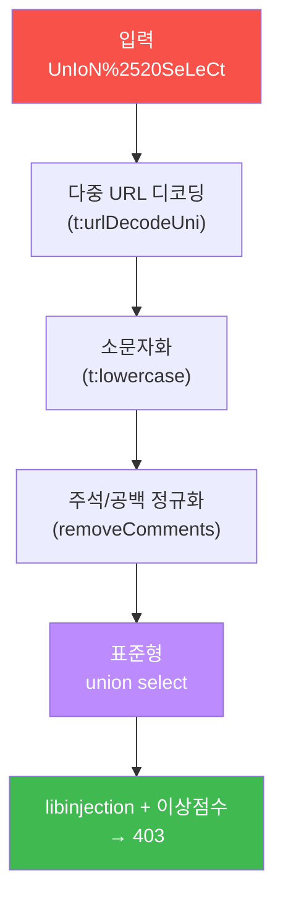
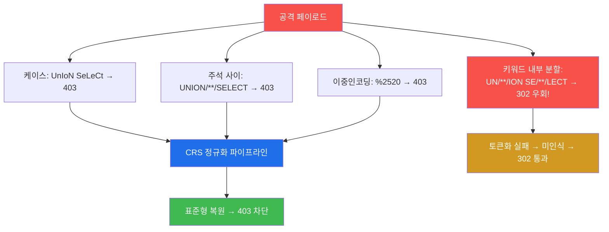
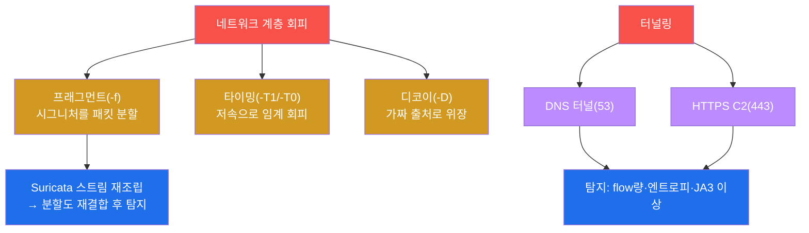

# 공격고급 W03 — 네트워크 우회·방어 회피: 끝나지 않는 군비경쟁

> **본 주차의 한 줄 요약**
>
> W02에서 WAF의 존재를 탐지했다. 이제 그 벽을 넘어야 한다. 본 주차는 **방어 회피(evasion)** — 페이로드
> 인코딩·케이스 변형·주석 삽입으로 WAF를, 패킷 분할·타이밍·디코이로 IDS를, 터널링으로 방화벽을 우회하는
> 기법을 다룬다. **그러나 본 주차의 가장 중요한 교훈은 "어떤 우회는 막히고 어떤 우회는 통한다"** 는 것이다.
> 학생은 el34의 ModSec CRS에 고전적 우회(케이스·주석·이중인코딩)를 직접 던져, **현대 WAF의 정규화가 대부분을
> 무력화하지만 특정 변형(키워드 내부 분할)은 실제로 우회됨**을 403/302 응답으로 실측한다.
>
> **레드팀 한 줄 결론**: 방어 회피는 군비경쟁이다. 잘 구성된 WAF(정규화 + 이상 점수)는 교과서적 우회에
> 강하지만 **완벽하지 않다.** 진짜 고급 회피는 시그니처를 비트는 게 아니라 **방어가 보지 못하는 곳**(파서
> 한계·룰 사각·앱 로직·허용 채널)을 찾는 것이다 — 그래서 방어를 깊이 알수록 회피도 깊어진다.

---

## ⚠️ 윤리 고지

회피 기법은 **인가된 침투 테스트에서만** 쓴다. 탐지 회피로 타인 시스템에 침입하는 것은 중범죄다. 본 실습은
el34 인가 표적에 한정한다.

---

## 학습 목표

본 주차 종료 시 학생은 다음 5가지를 **본인 손으로** 할 수 있어야 한다.

1. **WAF 우회 기법**(인코딩·케이스·주석)을 실행하고 응답(403/302)을 해석한다.
2. **현대 WAF의 정규화**가 어떤 naive 우회를 무력화하고 **어떤 변형은 못 막는지** 실측·설명한다.
3. **IDS 회피**(프래그먼트·타이밍·디코이)와 그 한계(스트림 재조립)를 안다.
4. **터널링**(DNS·HTTPS C2)으로 허용 채널에 숨는 원리를 안다.
5. 방어 회피가 **군비경쟁**임을, 다층 방어가 단일 회피를 무력화함을 설명한다.

---

## 0. 용어 해설

| 용어 | 영문 | 뜻 | 비유 |
|------|------|----|------|
| **방어 회피** | evasion | 탐지/차단을 우회 | 검문소 통과 위장 |
| **WAF** | Web Application Firewall | 웹 공격 차단 | 입구 검색대 |
| **CRS** | Core Rule Set | OWASP의 WAF 룰셋(el34=3.3.2) | 표준 검색 매뉴얼 |
| **libinjection** | — | CRS의 SQLi/XSS 토큰 기반 탐지 라이브러리 | 문법 분석 검문관 |
| **정규화** | normalization | 입력을 표준형으로 변환 후 매칭 | 위장 벗기기 |
| **이상 점수** | anomaly scoring | 약한 신호 합산으로 판단 | 의심 정황 누적 |
| **인라인 주석** | inline comment | SQL `/**/`로 키워드 분리 | 단어 사이 끼워넣기 |
| **프래그먼트** | fragmentation | 패킷 분할로 시그니처 쪼갬 | 조각내 반입 |
| **디코이** | decoy | 가짜 출처로 위장(nmap -D) | 미끼 |
| **터널링** | tunneling | 허용 채널에 숨기기 | 합법 화물에 밀반입 |
| **재조립** | reassembly | IDS가 분할 패킷을 재결합 | 조각 맞추기 |

> **헷갈리기 쉬운 한 쌍 — 시그니처 매칭 vs 정규화 후 매칭.** **단순 시그니처**는 입력에서 `UNION SELECT`
> 문자열을 그대로 찾는다 — 그래서 `UnIoN SeLeCt`나 인코딩에 속는다. **정규화 후 매칭**은 먼저 입력을 다중
> 디코딩·소문자화·주석 제거해 `union select`라는 **표준형**으로 만든 뒤 매칭한다 — 표면 변형이 무력해진다.
> 현대 WAF(CRS)는 후자다. **단, 정규화가 토큰을 복원하지 못하는 변형(아래 §0.5.2)은 빠져나간다.**

---

## 0.5 핵심 개념

### 0.5.1 CRS 정규화 파이프라인 — 매칭 전에 위장을 벗긴다

ModSec CRS는 입력을 그대로 검사하지 않는다. **먼저 표준형으로 되돌린 뒤** 매칭한다.



그래서 케이스 변형·인코딩 같은 "표면 위장"은 정규화 단계에서 벗겨져 무력해진다.

### 0.5.2 왜 어떤 우회는 막히고 어떤 우회는 통하나 — el34 실측

이게 W03의 **핵심**이다. 같은 `/**/` 주석이라도 **어디에 넣느냐**로 결과가 갈린다(el34 ModSec CRS 3.3.2 라이브
3회 재현 확인).

| 변형 | 예 | el34 결과 | 이유 |
|------|----|-----------|------|
| 케이스 | `UnIoN SeLeCt` | **403 차단** | t:lowercase 정규화 |
| 주석 **키워드 사이** | `UNION/**/SELECT` | **403 차단** | 주석 제거 후 키워드 온전 → 매칭 |
| 이중 인코딩 | `%2520` | **403 차단** | 다중 디코딩 후 매칭 |
| 주석 **키워드 내부** | `UN/**/ION SE/**/LECT` | **302 우회!** | libinjection이 깨진 키워드를 토큰으로 못 알아봄 |

핵심: 정규화는 키워드 '사이'의 주석은 지우지만, 키워드 '내부'를 쪼갠 `UN/**/ION` 은 libinjection의 토큰화를
무너뜨려 **SQLi로 인식조차 못 한다** — 그래서 통과(302)한다. **"정규화면 다 막힌다"는 과신**이며, 파서의
한계가 곧 우회 지점이다(soc-adv W14의 "난독화가 WAF도 우회" 정직성과 같은 사실).

### 0.5.3 IDS 회피 플래그 — `-f` `-T1` `-D`, 그리고 재조립

| nmap 플래그 | 회피 시도 | 방어의 대응 |
|-------------|-----------|-------------|
| `-f` | 패킷 분할로 시그니처 쪼갬 | **스트림 재조립** 후 재탐지 |
| `-T1`/`-T0` | 저속으로 임계 회피 | 장기 베이스라인·상관 |
| `-D` | 디코이로 출처 위장 | flow 상관으로 진짜 출처 식별 |

현대 Suricata는 분할 패킷을 **재조립(stream reassembly)** 해 원래 패턴으로 되돌리므로 단순 `-f` 는 무력하다.

### 0.5.4 터널링 — 막을 수 없는 채널에 숨는다

방화벽은 53(DNS)·443(HTTPS)을 거의 막지 못한다(끊으면 업무 마비). 그래서 데이터를 그 채널에 숨긴다 —
**DNS 터널**은 유출 데이터를 base64 DNS 라벨로 인코딩(`ZXhmaWw6ZGJkdW1w.tunnel.el34.lab`)해 쿼리로 내보내고,
**HTTPS C2**는 암호화로 내용 검사를 피한다. 방어는 내용이 아니라 **메타**(DNS 쿼리 길이·엔트로피·flow량·JA3
지문)로 이상을 탐지한다(soc-adv W07/W14).

### 0.5.5 임의로 보이는 값들

| 값 | 무엇 | 규칙 |
|----|------|------|
| **%2520** | 이중 인코딩 | `%20`(공백)을 한 번 더 인코딩 |
| **t:lowercase / t:urlDecodeUni** | CRS 변환(transformation) | 정규화 단계 이름 |
| **302 / 403** | 응답코드 | 302=통과(우회), 403=차단 |
| **마커(`baseline_done` 등)** | 단계 완료 신호 | 채점이 통과를 확인하는 약속 문자열 |

---

## 1. 회피란 — 군비경쟁의 본질

### 1.1 한 줄 답: 탐지의 빈틈을 찾는 것

방어 회피는 탐지 로직의 빈틈을 파고드는 기술이다. 시그니처가 `UNION`만 본다면 `UnIoN`으로, IDS가 완전한
패킷만 본다면 조각내서. **그러나 방어도 진화한다** — 표면 위장(케이스·인코딩)은 정규화가 벗겨낸다. 그럼에도
**파서가 복원 못 하는 변형(키워드 내부 분할, §0.5.2)은 여전히 통한다** — 빈틈이 메워지면 회피는 다시 새 빈틈을
찾는다. 이 끝없는 순환이 회피의 본질이다.

```mermaid
graph TD
    ATK["공격: 회피 기법"]
    ATK --> A1["케이스/주석 변형"]
    ATK --> A2["패킷 분할/타이밍"]
    ATK --> A3["터널링"]
    DEF["방어: 대응"]
    A1 --> D1["정규화(표면은 막음)"]
    A2 --> D2["스트림 재조립"]
    A3 --> D3["flow/JA3 이상 탐지"]
    D1 --> DEF
    D2 --> DEF
    D3 --> DEF
    DEF -.->|빈틈 메움 → 새 회피(파서 한계)| ATK
    style ATK fill:#f85149,color:#fff
    style A1 fill:#d29922,color:#fff
    style A2 fill:#d29922,color:#fff
    style A3 fill:#d29922,color:#fff
    style DEF fill:#3fb950,color:#fff
    style D1 fill:#1f6feb,color:#fff
    style D2 fill:#1f6feb,color:#fff
    style D3 fill:#1f6feb,color:#fff
```

### 1.2 왜 배우는가 — 방어의 강함과 빈틈을 알기 위해

회피를 시도해봐야 방어가 얼마나 강한지, 그리고 **어디가 약한지** 안다. 본 실습에서 학생은 고전 우회 대부분이
CRS에 막히는 것을 보며 "왜 정규화가 강력한지"를, 동시에 키워드 내부 분할이 통하는 것을 보며 "정규화도 만능이
아님"을 체득한다 — 이것이 거꾸로 견고한 WAF를 구성·튜닝하는 방어 지식이 된다.

### 1.3 한계 — 완벽한 회피도, 완벽한 방어도 없다

다층 방어(WAF+IDS+호스트+상관) 앞에서 단일 회피는 한 계층을 넘어도 다른 계층에 걸린다(§4). 한 계층을 뚫는
것과 모든 계층을 뚫는 것은 전혀 다른 난이도다.

---

## 2. WAF 우회와 정규화 (실측)



**실측 예 — 막히는 우회 vs 통하는 우회.**

```bash
# 케이스 변형 → 403 (정규화)
curl -s -o /dev/null -w "%{http_code}" -H "Host: dvwa.el34.lab" "http://10.20.30.1/?id=1%20UnIoN%20SeLeCt%20pass"   # 403
# 주석 키워드 '사이' → 403 (주석 제거 후 키워드 온전)
curl -s -o /dev/null -w "%{http_code}" -H "Host: dvwa.el34.lab" "http://10.20.30.1/?id=1%2F**%2FUNION%2F**%2FSELECT" # 403
# 키워드 '내부' 분할 → 302 (libinjection 토큰화 실패 = 우회)
curl -s -o /dev/null -w "%{http_code}" -H "Host: dvwa.el34.lab" "http://10.20.30.1/?id=1%20UN/**/ION%20SE/**/LECT%20pass" # 302
```

케이스·주석사이·이중인코딩은 **403**(정규화가 표준형으로 복원해 차단), 게다가 CRS는 **이상 점수**로 약한
신호도 합산해 막는다. **그러나** 키워드를 내부에서 쪼갠 `UN/**/ION` 은 libinjection이 SQL 토큰으로 인식조차
못 해 **302로 통과**한다(§0.5.2). 즉 표면 위장은 무력하지만 **파서의 한계를 찌르는 변형은 통한다.**

**그래서 진짜 우회는** 정규화가 풀지 못하는 인코딩, 룰이 커버 안 하는 파라미터/메서드(룰 사각), 파서가
토큰화 못 하는 분할, WAF가 검사 못 하는 **애플리케이션 로직**(인증 후 단계·API 내부)을 노린다 — 시그니처
싸움이 아니라 **방어의 사각**을 찾는 싸움이다.

---

## 3. IDS 회피 · 터널링



**IDS 회피** — `nmap -f`(패킷 분할)·`-T1`(저속)·`-D`(디코이). 그러나 Suricata는 **스트림 재조립**으로 분할을
재결합한 뒤 탐지하므로 단순 분할은 무력하다(§0.5.3). **터널링** — 방화벽이 막을 수 없는 채널(DNS 53·HTTPS
443)에 악성 트래픽을 숨긴다(§0.5.4). 실습 STEP 6은 유출 데이터(`exfil:dbdump`)를 base64 DNS 라벨로 인코딩해
`dig` 로 실제 쿼리를 내보낸다. 그러나 비정상 DNS량·JA3·flow 이상으로 탐지된다(soc-adv W07/W14).

---

## 4. 회피의 한계 — 다층 방어

| 공격(회피) | 방어(대응) |
|------------|------------|
| 케이스·주석사이·이중인코딩 | 정규화(표준형 후 매칭) → 403 |
| **키워드 내부 분할** | (파서 한계 — **통할 수 있음 302**) |
| 단편 시그니처 | 이상 점수(약신호 합산) |
| 패킷 분할 | 스트림 재조립 |
| 저속 스캔 | 장기 상관·베이스라인 |
| 단일 계층 회피 | **다층 방어(WAF+IDS+호스트+상관)** |

핵심은 마지막 줄이다. 공격자가 WAF를 우회해도(키워드 내부 분할로 302를 받아도) IDS가, IDS를 우회해도 호스트
탐지(헌팅)가, 그것도 우회해도 다계층 상관(soc-adv W15)이 잡는다. **한 계층을 뚫는 것과 모든 계층을 뚫는 것은
전혀 다른 난이도다.** 그래서 방어의 정답은 단일 완벽이 아니라 **다층화**이고, 공격의 정답은 시그니처 비틀기가
아니라 **사각 찾기**다.

---

## 5. 실습 안내 (8 미션)

각 미션을 **① 왜 하는가 / ② 무엇을 알 수 있는가 / ③ 결과 해석 / ④ 실전 활용** 4축으로 설명한다. 명령은
el34 호스트에서 `docker exec el34-attacker` 로. **인가된 표적(10.20.30.1)에만.** 차단(403)도 유효한 학습
결과 — naive 우회의 실패를, 그리고 키워드 내부 분할의 우회(302)를 실측한다.

### STEP 1 — 베이스라인
- **왜**: 우회 성공/실패는 baseline 대비로만 판정.
- **무엇을**: 정상(302) vs SQLi(403) 응답.
- **해석**: 403이 우회의 목표물(`baseline_done`).
- **실전**: "이 403을 302로 바꿀 수 있나"가 이번 주 질문.

### STEP 2 — 케이스 변형
- **왜**: SQL은 대소문자 무관 — 옛 시그니처 우회 시도.
- **무엇을**: `UnIoN SeLeCt`.
- **해석**: 403(t:lowercase 정규화로 차단, `case_done`). 표면 위장 무력.
- **실전**: 케이스 변형만으로는 현대 WAF 못 뚫음.

### STEP 3 — 인라인 주석
- **왜**: `/**/` 를 키워드 사이에 끼워 패턴 흩뜨리기.
- **무엇을**: `UNION/**/SELECT`(키워드 사이).
- **해석**: 403(주석 제거 후 키워드 온전, `comment_done`). **단 키워드 내부 분할 `UN/**/ION` 은 302 우회**(§0.5.2).
- **실전**: 같은 `/**/` 라도 위치가 결과를 가른다.

### STEP 4 — 정규화 원리
- **왜**: naive 우회 실패의 근본 이유.
- **무엇을**: 이중 인코딩 `%2520`.
- **해석**: 403(다중 디코딩 후 매칭, `normalization_understood`).
- **실전**: 인코딩 숨기기가 안 통하는 이유 = 정규화.

### STEP 5 — IDS 회피
- **왜**: L7(WAF) 넘어 L3/L4(네트워크) 회피.
- **무엇을**: `nmap -f -T1`(분할+저속).
- **해석**: 스캔되나 Suricata 재조립으로 재탐지(`ids_evasion_done`).
- **실전**: 단순 분할은 무력 — 재조립이 천적.

### STEP 6 — 터널링
- **왜**: 정면 돌파 대신 허용 채널에 숨기기.
- **무엇을**: base64 DNS 라벨 → dig 실제 전송.
- **해석**: DNS로 데이터 유출(`tunneling_done`). 실도구 iodine/dnscat2.
- **실전**: 방어는 DNS 길이·엔트로피 이상탐지.

### STEP 7 — 회피 한계
- **왜**: 다층 방어 앞 단일 회피의 한계.
- **무엇을**: 케이스 SQLi + XSS 각각.
- **해석**: 둘 다 403(`limits_done`). 단 키워드 내부 분할 같은 빈틈은 존재.
- **실전**: 단일 방어 의존 금지, 다층화.

### STEP 8 — 회피 분석 보고서
- **왜**: 회피는 군비경쟁 — 결과+방어 권고.
- **무엇을**: SQLi 직접 응답을 인용한 보고서 골격.
- **해석**: 실측 인용(`evasion_report_done`). 막힌 우회/통하는 우회 구분 기재.
- **실전**: 방어 권고(정규화 강화·이상점수·다층·DNS 이상탐지).

---

## 6. 흔한 오해·블루팀 노트

- **"정규화면 다 막는다"** — 과신이다. 키워드 내부 분할(`UN/**/ION`)은 libinjection 토큰화를 무너뜨려 302로
  우회된다(el34 실측, §0.5.2). 파서의 한계가 곧 우회 지점.
- **"케이스/인코딩으로 뚫는다"** — 표면 위장은 정규화가 벗긴다(403). 고전 우회는 현대 WAF에 약하다.
- **"패킷 분할이면 IDS 회피"** — Suricata 재조립으로 무력(§0.5.3).
- **"한 계층 뚫으면 끝"** — WAF를 넘어도 IDS·호스트·상관이 받친다. 다층이 천적.

---

## 7. 다음 주차 (W04) 예고 — 웹 고급 취약점 (SSRF·XXE·SSTI)

W03까지 SQLi/XSS 같은 고전 취약점과 그 우회를 다뤘다. W04는 더 깊은 서버측 취약점 — SSRF(서버측 요청 위조)·
XXE(XML 외부 엔티티)·SSTI(템플릿 인젝션)로 서버 내부를 공략하는 법을 다룬다.
