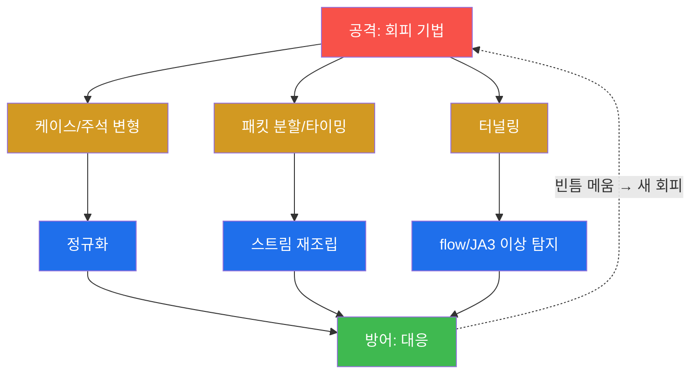
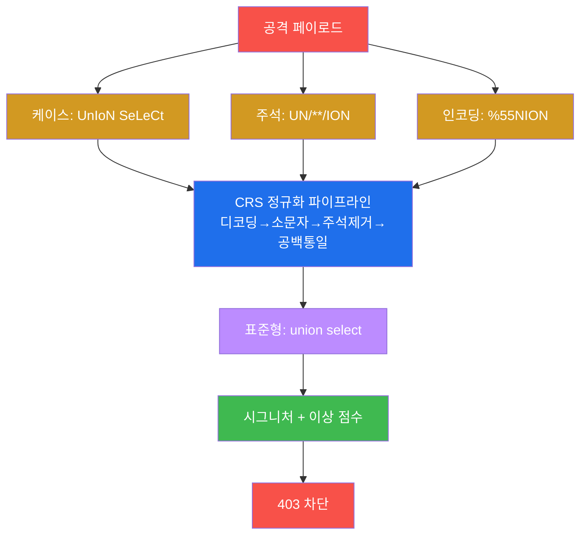
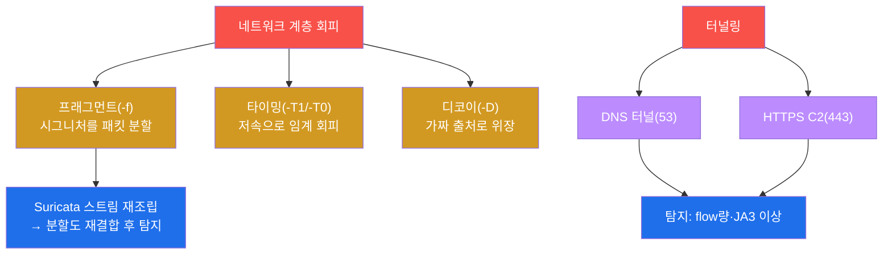

# 공격고급 W03 — 네트워크 우회·방어 회피: 끝나지 않는 군비경쟁

> **본 주차의 한 줄 요약**
>
> W02에서 WAF의 존재를 탐지했다. 이제 그 벽을 넘어야 한다. 본 주차는 **방어 회피(evasion)** — 페이로드
> 인코딩·케이스 변형·주석 삽입으로 WAF를, 패킷 분할·타이밍·디코이로 IDS를, 터널링으로 방화벽을 우회하는
> 기법을 다룬다. **그러나 본 주차의 가장 중요한 교훈은 "우회가 늘 통하지는 않는다"** 는 것이다. 학생은
> el34의 ModSec CRS에 고전적 우회(케이스·주석)를 직접 던져보고, **현대 WAF의 정규화가 그것을 어떻게
> 무력화하는지** 를 403 응답으로 실측한다.
>
> **레드팀 한 줄 결론**: 방어 회피는 군비경쟁이다. 잘 구성된 WAF(정규화 + 이상 점수)는 교과서적 우회에
> 강하다. 진짜 고급 회피는 시그니처를 비트는 게 아니라 **방어가 보지 못하는 곳**(룰 사각·앱 로직·허용 채널)을
> 찾는 것이다 — 그래서 방어를 깊이 알수록 회피도 깊어진다.

---

## ⚠️ 윤리 고지

회피 기법은 **인가된 침투 테스트에서만** 쓴다. 탐지 회피로 타인 시스템에 침입하는 것은 중범죄다. 본 실습은
el34 인가 표적에 한정한다.

---

## 학습 목표

본 주차 종료 시 학생은 다음 5가지를 **본인 손으로** 할 수 있어야 한다.

1. **WAF 우회 기법**(인코딩·케이스·주석)을 실행하고 응답을 해석한다.
2. **현대 WAF의 정규화**가 naive 우회를 무력화하는 원리를 설명한다(실측).
3. **IDS 회피**(프래그먼트·타이밍·디코이)와 그 한계(스트림 재조립)를 안다.
4. **터널링**(DNS·HTTPS C2)으로 허용 채널에 숨는 원리를 안다.
5. 방어 회피가 **군비경쟁**임을, 다층 방어가 단일 회피를 무력화함을 설명한다.

---

## 강의 시간 배분 (총 3시간 50분)

| 시간        | 내용                                                                | 유형      |
|-------------|---------------------------------------------------------------------|-----------|
| 0:00–0:25   | 이론 — 회피란, 군비경쟁의 본질                                       | 강의      |
| 0:25–0:55   | 이론 — WAF 우회 기법과 정규화                                        | 강의      |
| 0:55–1:05   | 휴식                                                                 | —         |
| 1:05–1:35   | 이론 — IDS 회피·터널링·다층 방어                                     | 강의/토론 |
| 1:35–2:15   | 실습 — 베이스라인·케이스·주석 우회                                   | 실습      |
| 2:15–2:45   | 실습 — IDS 회피·터널링                                               | 실습      |
| 2:45–2:55   | 휴식                                                                 | —         |
| 2:55–3:30   | 실습 — 회피 한계 + 보고서                                            | 실습      |
| 3:30–3:50   | 정리 + 다음 주차 예고                                                | 정리      |

---

## 0. 용어 해설

| 용어 | 영문 | 뜻 | 비유 |
|------|------|----|------|
| **방어 회피** | evasion | 탐지/차단을 우회 | 검문소 통과 위장 |
| **WAF** | Web Application Firewall | 웹 공격 차단 | 입구 검색대 |
| **CRS** | Core Rule Set | OWASP의 WAF 룰셋 | 표준 검색 매뉴얼 |
| **정규화** | normalization | 입력을 표준형으로 변환 후 매칭 | 위장 벗기기 |
| **이상 점수** | anomaly scoring | 약한 신호 합산으로 판단 | 의심 정황 누적 |
| **인라인 주석** | inline comment | SQL `/**/`로 키워드 분리 | 단어 사이 끼워넣기 |
| **프래그먼트** | fragmentation | 패킷 분할로 시그니처 쪼갬 | 조각내 반입 |
| **디코이** | decoy | 가짜 출처로 위장(nmap -D) | 미끼 |
| **터널링** | tunneling | 허용 채널에 숨기기 | 합법 화물에 밀반입 |
| **재조립** | reassembly | IDS가 분할 패킷을 재결합 | 조각 맞추기 |

> **헷갈리기 쉬운 한 쌍 — 시그니처 매칭 vs 정규화 후 매칭.** **단순 시그니처**는 입력에서 `UNION SELECT`
> 문자열을 그대로 찾는다 — 그래서 `UnIoN SeLeCt`나 `UN/**/ION`에 속는다. **정규화 후 매칭**은 먼저 입력을
> 소문자로 바꾸고 주석을 제거해 `union select`라는 **표준형**으로 만든 뒤 매칭한다 — 표면 변형이 무력해진다.
> 현대 WAF(CRS)는 후자다. 그래서 교과서적 우회가 실습에서 403으로 막힌다.

---

## 1. 회피란 — 군비경쟁의 본질

### 1.1 한 줄 답: 탐지의 빈틈을 찾는 것

방어 회피는 탐지 로직의 빈틈을 파고드는 기술이다. 시그니처가 `UNION`만 본다면 `UnIoN`으로, IDS가 완전한
패킷만 본다면 조각내서. **그러나 방어도 진화한다** — 빈틈이 메워지면 회피는 다시 새 빈틈을 찾는다. 이 끝없는
순환이 회피의 본질이다.

### 1.2 왜 배우는가 — 방어의 강함을 알기 위해

회피를 시도해봐야 방어가 얼마나 강한지 안다. 본 실습에서 학생은 고전 우회가 CRS에 막히는 것을 보며, "왜
정규화가 강력한지"를 체득한다 — 이것이 거꾸로 견고한 WAF를 구성하는 방어 지식이 된다.

### 1.3 한계 — 완벽한 회피는 없다

다층 방어(WAF+IDS+호스트+상관) 앞에서 단일 회피는 한 계층을 넘어도 다른 계층에 걸린다(§4). 완벽한 회피란
없고, 회피는 탐지를 늦추거나 어렵게 할 뿐이다.

---

## 2. WAF 우회와 정규화 (실측)

실습에서 학생은 케이스 변형(`UnIoN SeLeCt`)과 인라인 주석(`UN/**/ION`)을 던지고 **둘 다 403**을 받는다 —
CRS가 매칭 전에 소문자화·주석 제거로 표준형을 만들기 때문이다. 게다가 CRS는 **이상 점수(anomaly scoring)**:
하나로는 약한 신호들도 합산해 임계를 넘으면 차단한다. 그래서 표면을 비트는 고전 우회는 무력하다.

**그렇다면 진짜 우회는?** 정규화가 풀지 못하는 인코딩(이중·비표준), 룰이 커버하지 않는 파라미터/메서드(룰
사각), 그리고 WAF가 검사하지 못하는 **애플리케이션 로직**(인증 후 단계·API 내부)을 노린다. 즉, 시그니처
싸움이 아니라 **방어의 사각**을 찾는 싸움이다.

---

## 3. IDS 회피 · 터널링

**IDS 회피** — `nmap -f`(패킷 분할로 시그니처를 쪼갬)·`-T1`(저속으로 임계 탐지 회피)·`-D`(디코이로 출처
위장). 그러나 Suricata는 **스트림 재조립**으로 분할을 재결합한 뒤 탐지하므로 단순 분할은 무력하다. **터널링**
— 방화벽이 막을 수 없는 채널(DNS 53·HTTPS 443)에 악성 트래픽을 숨긴다. DNS 터널링은 데이터를 쿼리에
인코딩하고, HTTPS C2는 암호화로 내용 검사를 피한다. 그러나 비정상 DNS량·JA3 핑거프린트·flow 이상으로
탐지된다(soc-adv W07/W14).

---

## 4. 회피의 한계 — 다층 방어

| 공격(회피) | 방어(대응) |
|------------|------------|
| 케이스·주석 변형 | 정규화(표준형 후 매칭) |
| 단편 시그니처 | 이상 점수(약신호 합산) |
| 패킷 분할 | 스트림 재조립 |
| 저속 스캔 | 장기 상관·베이스라인 |
| 단일 계층 회피 | **다층 방어(WAF+IDS+호스트+상관)** |

핵심은 마지막 줄이다. 공격자가 WAF를 우회해도 IDS가, IDS를 우회해도 호스트 탐지(헌팅)가, 그것도 우회해도
다계층 상관(soc-adv W15)이 잡는다. **한 계층을 뚫는 것과 모든 계층을 뚫는 것은 전혀 다른 난이도다.** 그래서
방어의 정답은 단일 완벽이 아니라 **다층화**이고, 공격의 정답은 시그니처 비틀기가 아니라 **사각 찾기**다.

---

## 5. 실습 안내 (8 미션)

1. **베이스라인**(정상/차단). 2. **케이스 변형**. 3. **인라인 주석**. 4. **정규화 이해**. 5. **IDS 회피**.
6. **터널링**. 7. **회피 한계**. 8. **보고서**.

> 명령은 el34 호스트에서 `docker exec el34-attacker`로. **인가된 표적(10.20.30.1)에만**. 차단(403)도 유효한
> 학습 결과 — naive 우회의 실패를 실측한다.

---

## 6. 다음 주차 (W04) 예고 — 웹 고급 취약점 (SSRF·XXE·SSTI)

W03까지 SQLi/XSS 같은 고전 취약점을 다뤘다. W04는 더 깊은 서버측 취약점 — SSRF(서버측 요청 위조)·XXE(XML
외부 엔티티)·SSTI(템플릿 인젝션)로 서버 내부를 공략하는 법을 다룬다.
