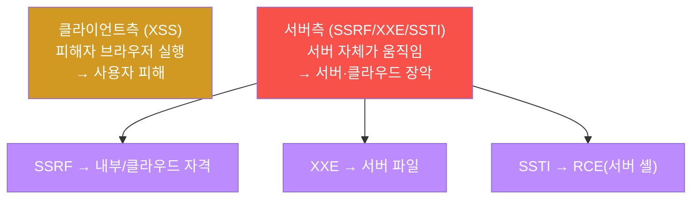
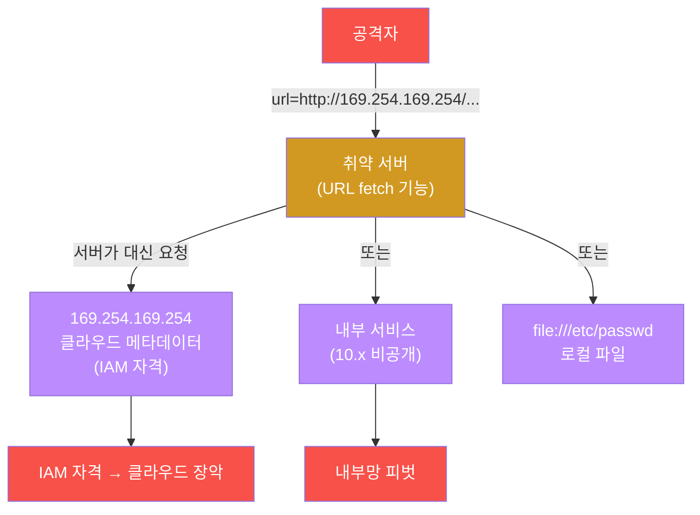
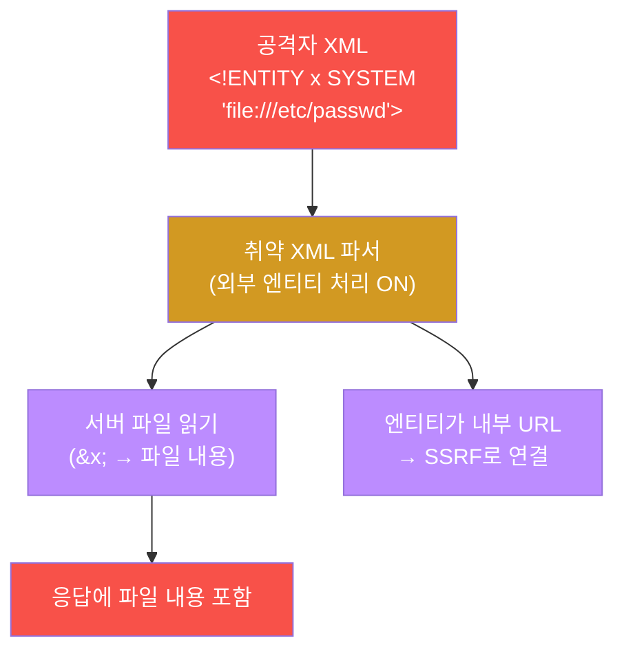

# 공격고급 W04 — 웹 고급: SSRF·XXE·SSTI로 서버 내부를 공략한다

> **본 주차의 한 줄 요약**
>
> 입문 과정의 웹 공격(XSS)은 대부분 **클라이언트측** — 피해자의 브라우저를 노렸다. 본 주차는 더 깊이,
> **서버 자체**를 공략한다. **SSRF**(서버측 요청 위조)는 서버를 프록시로 삼아 외부에선 못 닿는 내부·클라우드
> 메타데이터에 접근하고, **XXE**(XML 외부 엔티티)는 XML 파서를 속여 서버 파일을 읽고, **SSTI**(서버측 템플릿
> 주입)는 `{{7*7}}`이 `49`로 평가되는 순간부터 **원격 코드 실행(RCE)** 로 이어진다. 본 주차에 학생은 이
> 세 가지 페이로드를 el34에 직접 작성·전송하고, 응답을 해석하며, 각 취약점의 영향 연쇄와 방어를 배운다.
>
> **레드팀 한 줄 결론**: 클라이언트측 취약점이 "사용자 피해"라면, 서버측 취약점은 "서버 장악"이다 — 차원이
> 다른 영향이다. SSRF 하나로 클라우드 계정 전체가, SSTI 하나로 서버 셸이 넘어간다. 그래서 입력을 **처리하는**
> 곳(fetch·파싱·렌더)의 방어가 결정적이다.

---

## ⚠️ 윤리 고지

서버측 취약점은 RCE·데이터 유출로 직결되는 고위험 기법이다. **인가된 실습(el34)에서만** 수행한다.

---

## ⚠️ el34 정직 고지 — 본 주차는 "페이로드까지"다 (미시연)

**중요:** el34의 실습 표적(admin.el34.lab)에는 **실제로 악용 가능한 SSRF fetch·XML 파서·템플릿 평가 취약점이
없다.** 실측 결과: **SSRF=ModSec 403 차단 · XXE=`/api/xml` 404 부재 · SSTI=`{{7*7}}` 의 `49` 미반사.** 따라서
본 주차의 실습은 **페이로드를 정확히 작성·전송하고 응답을 해석하는 데까지**이며, 실제 데이터 탈취·RCE는
일어나지 않는다. "취약 앱이었다면의 영향(IAM 자격 탈취·파일 읽기·서버 셸)"은 각 단계 해석에 명시한다 —
이는 attack-adv W09(AD 미보유)와 같은 **정직한 스코핑**이다. 마커가 "탐지됨/악용됨"으로 거짓말하지 않게,
응답코드를 있는 그대로(403/404) 해석한다.

---

## 학습 목표

본 주차 종료 시 학생은 다음 5가지를 **본인 손으로** 할 수 있어야 한다.

1. **SSRF**로 클라우드 메타데이터·내부 서비스에 접근하는 페이로드를 작성한다.
2. **XXE** 외부 엔티티로 서버 파일을 읽는 원리를 안다.
3. **SSTI**를 `{{7*7}}`로 탐지하고 RCE로 이어지는 연쇄를 설명한다.
4. 서버측 취약점의 **영향 연쇄**(클라우드 장악·RCE·내부 피벗)를 안다.
5. 각 취약점의 **방어**(allowlist·외부엔티티 비활성·템플릿 평가 금지)를 설명한다.

---

## 0. 용어 해설

| 용어 | 영문 | 뜻 | 비유 |
|------|------|----|------|
| **SSRF** | Server-Side Request Forgery | 서버가 공격자 지정 URL을 요청 | 직원을 시켜 금고 열기 |
| **메타데이터** | metadata service | 클라우드 인스턴스 정보(169.254.169.254) | 직원의 사원증 보관함 |
| **XXE** | XML External Entity | XML 파서의 외부 엔티티 악용 | 양식 빈칸에 명령 삽입 |
| **엔티티** | entity | XML의 치환 변수(`&x;`) | 약어 사전 |
| **SSTI** | Server-Side Template Injection | 입력이 템플릿으로 평가됨 | 편지 양식에 수식 끼우기 |
| **템플릿 엔진** | template engine | 동적 페이지 생성기(Jinja2 등) | 메일 머지 |
| **RCE** | Remote Code Execution | 원격 코드 실행 | 남의 컴퓨터 조종 |
| **피벗** | pivot | 한 시스템을 발판으로 내부 이동 | 징검다리 |
| **OOB** | Out-of-Band | 응답 외 채널로 데이터 유출 | 우회 통로 |
| **allowlist** | — | 허용 목록(나머지 차단) | 출입 허가 명단 |

> **헷갈리기 쉬운 한 쌍 — SSRF vs XXE.** 둘 다 "서버가 공격자 대신 무언가를 가져오게" 만들지만, 진입점이
> 다르다. **SSRF**는 서버의 **URL fetch 기능**(이미지 가져오기·웹훅 등)을 악용한다. **XXE**는 서버의 **XML
> 파싱**을 악용해 외부 엔티티로 파일/URL을 가져온다. XXE는 종종 SSRF로 이어진다(엔티티가 내부 URL을 가리킬
> 때). 핵심 공통점: **서버를 대리인으로 삼아 내부에 접근**한다.

---

## 0.5 핵심 개념

### 0.5.1 클라이언트측 vs 서버측 — 피해 범위가 차원이 다르다

| | 클라이언트측(XSS) | 서버측(SSRF/XXE/SSTI) |
|---|-------------------|------------------------|
| 누가 실행 | 피해자 브라우저 | **서버 자신** |
| 피해 | 사용자 세션 탈취 | 서버·클라우드 장악 |
| 권한 | 사용자 권한 | **서버 권한**(내부 신뢰) |

서버측이 무서운 이유: **서버는 내부에서 신뢰받는다.** 방화벽은 외부는 막지만 서버 자신의 내부 요청은 허용한다.
SSRF는 이 신뢰를 악용해 외부 공격자가 서버를 "내부 대리인"으로 부린다.

### 0.5.2 SSRF의 3대 표적

서버에게 "이 URL을 대신 가져와"라고 시킬 때 노리는 곳:

| 페이로드 | 노리는 것 | 영향 |
|----------|-----------|------|
| `http://169.254.169.254/...` | 클라우드 메타데이터 | **IAM 임시 자격 → 계정 장악** |
| `file:///etc/passwd` | 로컬 파일 | 서버 파일 읽기 |
| `http://10.x.x.x/...` | 내부 비공개 서비스 | 내부망 피벗 |

`169.254.169.254` 는 클라우드(AWS/GCP 등) 인스턴스가 자기 메타데이터를 받는 **링크-로컬 주소**다. 여기엔 IAM
임시 자격이 있어, 탈취하면 클라우드 계정을 장악할 수 있다(Capital One 사고의 핵심).

### 0.5.3 SSTI 탐지 — `{{7*7}}` 이 `49` 가 되는 순간

SSTI 탐지는 한 줄이다: **`{{7*7}}` 을 입력하고 응답에 `49` 가 나오는지** 본다.

- 응답에 `{{7*7}}` 그대로 → 안전(입력을 문자로 출력).
- 응답에 `49` → **위험!** 입력이 템플릿으로 **평가**됐다는 뜻 = 코드가 실행될 수 있다.

`49` 가 나오면 거기서 템플릿 엔진의 내부 객체(`__class__`·`__mro__`)를 타고 `subprocess` 에 도달해 **RCE**로
간다. SSTI 하나가 서버 셸로 직결된다. (el34에선 `49` 가 미반사 = 이 표적은 SSTI 취약점이 없음, §정직 고지.)

### 0.5.4 응답코드로 "취약/안전" 정직하게 읽기 (el34)

본 주차의 핵심 정직성: 응답코드를 있는 그대로 해석한다.

| 단계 | el34 응답 | 정직한 해석 |
|------|-----------|-------------|
| SSRF | 403 | ModSec SSRF 룰이 차단(취약 아님). 취약 앱이면 200+자격 유출 |
| XXE | 404 | `/api/xml` 엔드포인트 부재(파서 없음). 취약 앱이면 파일 내용 반환 |
| SSTI | 49 미반사 | 템플릿 평가 안 됨(취약 아님). 취약 앱이면 49 반사→RCE |

즉 **el34에선 실제 악용이 안 된다.** 본 주차는 "공격이 통했다"가 아니라 **"페이로드를 정확히 만들고, 응답으로
취약/안전을 판정하는 법"** 을 배운다 — 실전에서 취약 앱을 만나면 같은 페이로드가 통한다.

### 0.5.5 임의로 보이는 값들

| 값 | 무엇 | 규칙 |
|----|------|------|
| **169.254.169.254** | 클라우드 메타데이터 | 링크-로컬 표준 주소 |
| **{{7*7}}** | SSTI 탐지 표현식 | 49 반사 여부로 평가 판정 |
| **aa04test** | SSRF 경로 태그 | attack-adv W04 식별 |
| **마커(`serverside_ready` 등)** | 단계 완료 신호 | 채점이 통과를 확인하는 약속 문자열 |

---

## 1. 클라이언트측 vs 서버측

### 1.1 한 줄 답: 서버측은 서버를 장악한다

XSS는 피해자 브라우저에서 스크립트를 실행한다 — 사용자 세션 탈취 등 피해는 사용자에게 국한된다. 서버측
취약점은 **서버 자체**를 움직인다 — 서버의 권한으로 내부에 접근하고, 서버의 파일을 읽고, 서버에서 코드를
실행한다. 피해 범위가 차원이 다르다(§0.5.1).



### 1.2 왜 중요한가 — 신뢰의 악용

서버측 취약점이 강력한 이유는 **서버가 내부에서 신뢰받기 때문**이다. 방화벽은 외부는 막지만 서버 자신의
내부 요청은 허용한다. SSRF는 바로 이 신뢰를 악용한다 — 외부 공격자가 서버를 "내부의 대리인"으로 부린다.

### 1.3 한계 — 입력 처리부에만 존재

서버측 취약점은 서버가 입력을 **처리**하는 곳(URL fetch·XML 파싱·템플릿 렌더)에만 생긴다. 그 처리부를
안전하게 막으면(allowlist·파서 설정·평가 금지) 취약점은 사라진다 — el34가 그 예다(§정직 고지: 처리부가
안전하거나 부재해 악용 불가). 방어가 명확하다.

---

## 2. SSRF — 서버를 프록시로



**실측 예 — el34에서.**

```bash
echo -en "GET /files/read?url=http://169.254.169.254/latest/meta-data/aa04test HTTP/1.0\r\nHost: admin.el34.lab\r\nConnection: close\r\n\r\n" | nc -w3 192.168.0.161 80 | head -1 | grep -oE '[0-9]{3}'
# → 403
```

SSRF의 최우선 표적은 **클라우드 메타데이터**(`169.254.169.254`, §0.5.2)다. el34에선 ModSec이 이 패턴을 **403
으로 차단**한다 — WAF에 SSRF 룰이 있음을 실측한다. **취약 앱이었다면** 200 응답에 IAM 자격이 그대로 반환돼
클라우드 계정이 넘어간다. 우리는 그 페이로드를 정확히 만들고, 403이라는 응답으로 "여기는 막혀 있다"를 판정
하는 법을 배운다.

---

## 3. XXE — XML 파서의 배신



XML은 `<!ENTITY>` 로 치환 변수를 정의할 수 있는데, `SYSTEM "file://..."` 외부 엔티티를 쓰면 파서가 그 파일을
읽어 `&x;` 자리에 넣는다. 응답에 그 내용이 포함되면 서버 파일이 유출된다. 응답에 안 나와도(블라인드 XXE)
엔티티를 외부 URL로 보내 OOB 유출할 수 있다. **el34에선 `/api/xml` 엔드포인트가 404(부재)** — XML 파서 자체가
없어 악용되지 않는다(§정직 고지). 우리는 XXE 페이로드의 구조를 익히고, 404로 "이 표적엔 파서가 없다"를
판정한다. **방어는 단순하고 확실하다** — XML 파서에서 외부 엔티티·DTD 처리를 **비활성화**한다(대부분의 언어가
한 줄 설정).

---

## 4. SSTI — 템플릿이 코드가 될 때

```mermaid
graph TD
    PROBE["탐지: {{7*7}}"]
    PROBE --> EVAL["템플릿 엔진이 평가?"]
    EVAL -->|49 반사| R49["SSTI 취약! → RCE 단계"]
    EVAL -->|{{7*7}} 그대로| SAFE["안전(평가 안 됨)<br/>el34 = 이 경우"]
    R49 --> RCE["__class__→subprocess→RCE"]
    style PROBE fill:#1f6feb,color:#fff
    style EVAL fill:#d29922,color:#fff
    style R49 fill:#f85149,color:#fff
    style SAFE fill:#3fb950,color:#fff
    style RCE fill:#f85149,color:#fff
```

SSTI는 사용자 입력이 템플릿 문자열로 **평가**될 때 생긴다. 탐지는 `{{7*7}}` 을 보내 응답에 `49` 가 나오는지
보는 것(§0.5.3) — 나오면 입력이 코드로 평가된다는 뜻이다. 거기서부터 템플릿 엔진의 내부 객체를 타고
`subprocess` 에 도달하면 **RCE**다. **el34에선 `49` 가 미반사** = 템플릿 평가가 일어나지 않는다(안전, §정직
고지). 우리는 탐지 페이로드와 판정법을 익힌다. **방어**는 사용자 입력을 절대 템플릿으로 평가하지 않고
(로직-표현 분리), 불가피하면 샌드박스 템플릿을 쓰는 것이다.

---

## 5. 영향 연쇄 · 방어 요약

| 취약점 | 핵심 페이로드 | el34 결과 | (취약 앱이면) 영향 | 방어 |
|--------|---------------|-----------|---------------------|------|
| SSRF | `url=http://169.254.169.254/` | 403 차단 | 클라우드 자격·내부 피벗 | URL allowlist·메타 차단 |
| XXE | `<!ENTITY x SYSTEM "file://...">` | 404 부재 | 파일 읽기·SSRF | 외부 엔티티 비활성 |
| SSTI | `{{7*7}}` → 49 | 미반사 | 서버 코드 실행(RCE) | 입력 템플릿 평가 금지 |

공통 방어 원칙은 **입력을 신뢰하지 않고, 처리부를 안전하게 설정하며, 최소 권한**으로 운영하는 것이다. el34는
이 원칙이 지켜져(또는 기능 부재) 악용이 안 된다 — 그것이 곧 "방어가 된 상태"의 모습이다. WAF(ModSec)는 보조
다층이다(SSRF 403). 근본 방어는 애플리케이션 코드에 있다.

---

## 6. 실습 안내 (8 미션)

각 미션을 **① 왜 하는가 / ② 무엇을 알 수 있는가 / ③ 결과 해석 / ④ 실전 활용** 4축으로 설명한다. 명령은
공격자 VM(`ssh att@192.168.0.202`)에서 실행한다. **인가된 표적(admin.el34.lab)에만.** 차단(403)·부재(404)·
미반사도 유효한 학습 결과 — 페이로드 작성·전송·응답 해석까지가 목표다(실악용 미시연, §정직 고지).

### STEP 1 — 서버측 표면
- **왜**: 서버측 취약점은 서버가 입력을 처리하는 곳에 생긴다.
- **무엇을**: admin.el34.lab 도달(200).
- **해석**: 도달 확인(`serverside_ready`). 여기에 SSRF/XXE/SSTI 페이로드를 던진다.
- **실전**: 입력 처리 엔드포인트(fetch/파싱/렌더) 식별.

### STEP 2 — SSRF 메타데이터
- **왜**: 클라우드 IAM 자격 탈취가 단골 표적.
- **무엇을**: `url=http://169.254.169.254/...`.
- **해석**: 403=ModSec SSRF 룰 차단(`ssrf_meta_done`). 취약 앱이면 자격 유출.
- **실전**: 메타데이터 IP·file:// 차단 여부 판정.

### STEP 3 — SSRF 내부/file://
- **왜**: 메타데이터 외 로컬 파일·내부 서비스 피벗.
- **무엇을**: `file:///etc/passwd` + 내부 IP.
- **해석**: 차단 확인(`ssrf_internal_done`). 취약 앱이면 파일·내부 서비스 노출.
- **실전**: SSRF 표적 3종(§0.5.2)을 모두 점검.

### STEP 4 — XXE
- **왜**: XML 파서 악용으로 파일 읽기.
- **무엇을**: 외부 엔티티 XML 페이로드.
- **해석**: `/api/xml` 404=파서 부재(`xxe_done`). 취약 앱이면 파일 반환.
- **실전**: XML 입력 받는 곳에서 외부 엔티티 시도.

### STEP 5 — SSTI 탐지
- **왜**: `{{7*7}}` 평가 여부로 RCE 가능성 판정.
- **무엇을**: `{{7*7}}` 전송 → 49 반사 확인.
- **해석**: 49 미반사=평가 안 됨(`ssti_done`). 49면 RCE 단계로.
- **실전**: 입력 반사 지점에 SSTI 프로브.

### STEP 6 — 영향 연쇄
- **왜**: 서버측 취약점이 서버 장악으로 이어지는 그림.
- **무엇을**: SSRF→자격, XXE→파일, SSTI→RCE 연쇄 정리.
- **해석**: 영향 연쇄 이해(`impact_done`). 한 취약점이 전체 장악으로.
- **실전**: 단일 취약점의 최대 영향 산정.

### STEP 7 — 방어
- **왜**: WAF가 SSRF를 막는지 + 근본 방어.
- **무엇을**: SSRF 차단(403) 확인 + 방어 원칙.
- **해석**: WAF 보조 다층 확인(`defense_done`). 근본은 앱 코드.
- **실전**: allowlist·외부엔티티 비활성·템플릿 평가 금지.

### STEP 8 — 서버측 보고서
- **왜**: 페이로드·응답·영향·방어를 종합.
- **무엇을**: 응답코드를 인용한 보고서 골격.
- **해석**: 실측 인용(`serverside_report_done`). 미시연 정직 기재.
- **실전**: "막힌 곳/취약했을 곳" 구분 + 방어 권고.

---

## 7. 흔한 오해·블루팀 노트

- **"el34에서 안 통하니 SSRF는 약하다"** — 아니다. el34가 방어돼 있을 뿐. 실전 취약 앱에선 SSRF 하나로 클라우드
  계정이 넘어간다(§0.5.2).
- **"403이면 실패한 실습"** — 응답코드 판정이 곧 학습이다. 막힘(403)·부재(404)·미반사도 유효한 결과(§0.5.4).
- **"SSTI는 XSS 비슷"** — 전혀 다르다. XSS는 브라우저, SSTI는 서버에서 코드 실행(RCE). 차원이 다른 영향.
- **"WAF면 충분"** — WAF(403)는 보조다. 근본 방어는 앱 코드(allowlist·파서 설정·평가 금지).

---

## 8. 다음 주차 (W05) 예고 — 인증·세션 공격

W04는 입력 처리부의 취약점이었다. W05는 인증 체계 자체를 노린다 — 자격증명 공격(브루트포스·패스워드
스프레이), 세션 관리 결함, JWT·토큰 공격으로 신원 통제를 뚫는 법을 다룬다.
