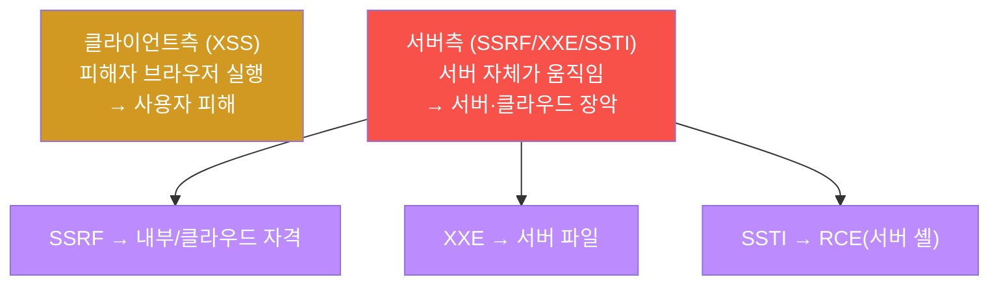
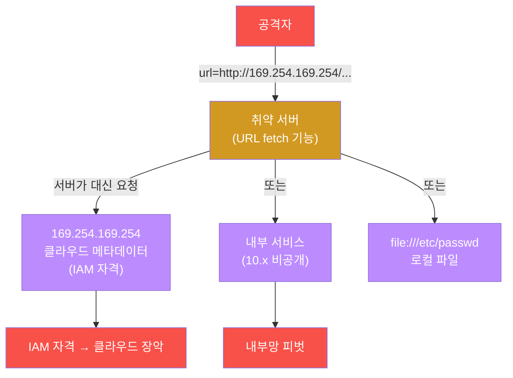
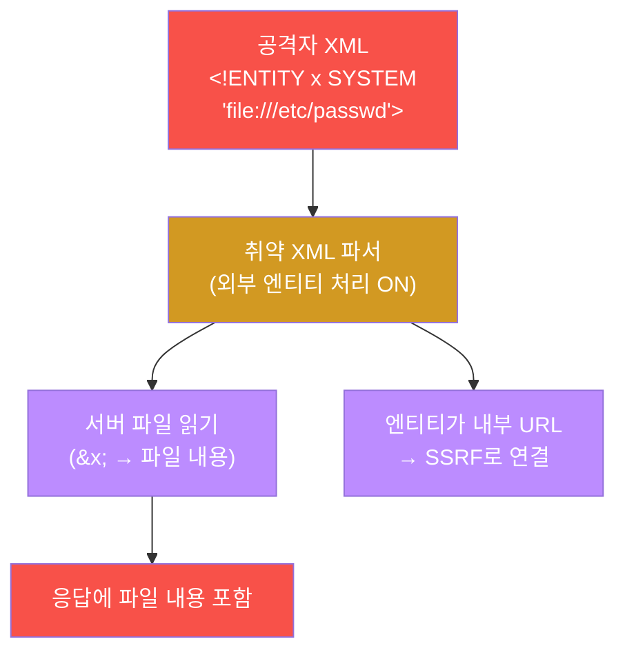
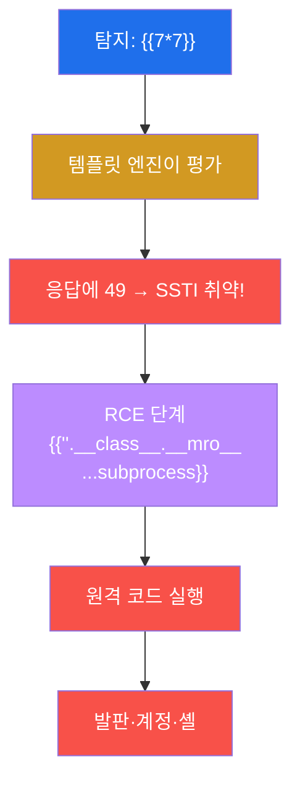

# 공격고급 W04 — 웹 고급: SSRF·XXE·SSTI로 서버 내부를 공략한다

> **본 주차의 한 줄 요약**
>
> 입문 과정의 웹 공격(XSS)은 대부분 **클라이언트측** — 피해자의 브라우저를 노렸다. 본 주차는 더 깊이,
> **서버 자체**를 공략한다. **SSRF**(서버측 요청 위조)는 서버를 프록시로 삼아 외부에선 못 닿는 내부·클라우드
> 메타데이터에 접근하고, **XXE**(XML 외부 엔티티)는 XML 파서를 속여 서버 파일을 읽고, **SSTI**(서버측 템플릿
> 주입)는 `{{7*7}}`이 `49`로 평가되는 순간부터 **원격 코드 실행(RCE)** 로 이어진다. 본 주차에 학생은 이
> 세 가지 페이로드를 el34에 직접 던지고, WAF가 SSRF를 어떻게 탐지하는지(403)를 실측하며, 각 취약점의 영향
> 연쇄와 방어를 배운다.
>
> **레드팀 한 줄 결론**: 클라이언트측 취약점이 "사용자 피해"라면, 서버측 취약점은 "서버 장악"이다 — 차원이
> 다른 영향이다. SSRF 하나로 클라우드 계정 전체가, SSTI 하나로 서버 셸이 넘어간다. 그래서 입력을 **처리하는**
> 곳(fetch·파싱·렌더)의 방어가 결정적이다.

---

## ⚠️ 윤리 고지

서버측 취약점은 RCE·데이터 유출로 직결되는 고위험 기법이다. **인가된 실습(el34)에서만** 수행한다.

---

## 학습 목표

본 주차 종료 시 학생은 다음 5가지를 **본인 손으로** 할 수 있어야 한다.

1. **SSRF**로 클라우드 메타데이터·내부 서비스에 접근하는 페이로드를 작성한다.
2. **XXE** 외부 엔티티로 서버 파일을 읽는 원리를 안다.
3. **SSTI**를 `{{7*7}}`로 탐지하고 RCE로 이어지는 연쇄를 설명한다.
4. 서버측 취약점의 **영향 연쇄**(클라우드 장악·RCE·내부 피벗)를 안다.
5. 각 취약점의 **방어**(allowlist·외부엔티티 비활성·템플릿 평가 금지)를 설명한다.

---

## 강의 시간 배분 (총 3시간 50분)

| 시간        | 내용                                                                | 유형      |
|-------------|---------------------------------------------------------------------|-----------|
| 0:00–0:25   | 이론 — 클라이언트측 vs 서버측, 영향의 차이                          | 강의      |
| 0:25–0:55   | 이론 — SSRF(메타데이터·내부·file://)                                | 강의      |
| 0:55–1:05   | 휴식                                                                 | —         |
| 1:05–1:35   | 이론 — XXE·SSTI→RCE·방어                                            | 강의/토론 |
| 1:35–2:15   | 실습 — SSRF(메타데이터·내부)                                         | 실습      |
| 2:15–2:45   | 실습 — XXE·SSTI 탐지                                                 | 실습      |
| 2:45–2:55   | 휴식                                                                 | —         |
| 2:55–3:30   | 실습 — 영향·방어 + 보고서                                            | 실습      |
| 3:30–3:50   | 정리 + 다음 주차 예고                                                | 정리      |

---

## 0. 용어 해설

| 용어 | 영문 | 뜻 | 비유 |
|------|------|----|------|
| **SSRF** | Server-Side Request Forgery | 서버가 공격자 지정 URL을 요청 | 직원을 시켜 금고 열기 |
| **메타데이터** | metadata service | 클라우드 인스턴스 정보(169.254.169.254) | 직원의 사원증 보관함 |
| **XXE** | XML External Entity | XML 파서의 외부 엔티티 악용 | 양식 빈칸에 명령 삽입 |
| **엔티티** | entity | XML의 치환 변수 | 약어 사전 |
| **SSTI** | Server-Side Template Injection | 입력이 템플릿으로 평가됨 | 편지 양식에 수식 끼우기 |
| **템플릿 엔진** | template engine | 동적 페이지 생성기(Jinja2 등) | 메일 머지 |
| **RCE** | Remote Code Execution | 원격 코드 실행 | 남의 컴퓨터 조종 |
| **피벗** | pivot | 한 시스템을 발판으로 내부 이동 | 징검다리 |
| **OOB** | Out-of-Band | 응답 외 채널로 데이터 유출 | 우회 통로 |
| **allowlist** | — | 허용 목록(나머지 차단) | 출입 허가 명단 |

> **헷갈리기 쉬운 한 쌍 — SSRF vs XXE.** 둘 다 "서버가 공격자 대신 무언가를 가져오게" 만들지만, 진입점이
> 다르다. **SSRF**는 서버의 **URL fetch 기능**(이미지 가져오기·웹훅 등)을 악용한다. **XXE**는 서버의 **XML
> 파싱**을 악용해 외부 엔티티로 파일/URL을 가져온다. XXE는 종종 SSRF로 이어진다(엔티티가 내부 URL을 가리킬
> 때). 핵심 공통점: **서버를 대리인으로 삼아 내부에 접근**한다.

---

## 1. 클라이언트측 vs 서버측

### 1.1 한 줄 답: 서버측은 서버를 장악한다

XSS는 피해자 브라우저에서 스크립트를 실행한다 — 사용자 세션 탈취 등 피해는 사용자에게 국한된다. 서버측
취약점은 **서버 자체**를 움직인다 — 서버의 권한으로 내부에 접근하고, 서버의 파일을 읽고, 서버에서 코드를
실행한다. 피해 범위가 차원이 다르다.

### 1.2 왜 중요한가 — 신뢰의 악용

서버측 취약점이 강력한 이유는 **서버가 내부에서 신뢰받기 때문**이다. 방화벽은 외부는 막지만 서버 자신의
내부 요청은 허용한다. SSRF는 바로 이 신뢰를 악용한다 — 외부 공격자가 서버를 "내부의 대리인"으로 부린다.

### 1.3 한계 — 입력 처리부에만 존재

서버측 취약점은 서버가 입력을 **처리**하는 곳(URL fetch·XML 파싱·템플릿 렌더)에만 생긴다. 그 처리부를
안전하게 막으면(allowlist·파서 설정·평가 금지) 취약점은 사라진다 — 방어가 명확하다.

---

## 2. SSRF — 서버를 프록시로

SSRF의 최우선 표적은 **클라우드 메타데이터**(`169.254.169.254`)다 — 여기엔 인스턴스의 IAM 임시 자격증명이
있어, 탈취하면 클라우드 계정을 장악할 수 있다(Capital One 사고의 핵심). 그 외 `file://`로 로컬 파일을, 내부
IP로 비공개 서비스를 노린다. 실습에서 이 페이로드들을 던지면 el34의 ModSec이 **403으로 탐지**한다 — WAF에
SSRF 룰이 있음을 실측한다. 방어자는 이 탐지를, 공격자는 우회(W03)를 고민한다.

---

## 3. XXE — XML 파서의 배신

XML은 `<!ENTITY>` 로 치환 변수를 정의할 수 있는데, `SYSTEM "file://..."` 외부 엔티티를 쓰면 파서가 그 파일을
읽어 `&x;` 자리에 넣는다. 응답에 그 내용이 포함되면 서버 파일이 유출된다. 응답에 안 나와도(블라인드 XXE)
엔티티를 외부 URL로 보내 OOB 유출할 수 있다. **방어는 단순하고 확실하다** — XML 파서에서 외부 엔티티·DTD
처리를 **비활성화**한다(대부분의 언어가 한 줄 설정).

---

## 4. SSTI — 템플릿이 코드가 될 때

SSTI는 사용자 입력이 템플릿 문자열로 **평가**될 때 생긴다. 탐지는 `{{7*7}}`을 보내 응답에 `49`가 나오는지
보는 것 — 나오면 입력이 코드로 평가된다는 뜻이다. 거기서부터 템플릿 엔진의 내부 객체(`__class__`·`__mro__`)를
타고 `subprocess`에 도달하면 **RCE**다. SSTI 하나가 서버 셸로 직결된다. **방어**는 사용자 입력을 절대 템플릿
으로 평가하지 않고(로직-표현 분리), 불가피하면 샌드박스 템플릿을 쓰는 것이다.

---

## 5. 영향 연쇄 · 방어 요약

| 취약점 | 핵심 페이로드 | 영향 | 방어 |
|--------|---------------|------|------|
| SSRF | `url=http://169.254.169.254/` | 클라우드 자격·내부 피벗 | URL allowlist·메타 차단 |
| XXE | `<!ENTITY x SYSTEM "file://...">` | 파일 읽기·SSRF | 외부 엔티티 비활성 |
| SSTI | `{{7*7}}` → RCE | 서버 코드 실행 | 입력 템플릿 평가 금지 |

공통 방어 원칙은 **입력을 신뢰하지 않고, 처리부를 안전하게 설정하며, 최소 권한**으로 운영하는 것이다. WAF
(ModSec)는 보조 다층이다 — 실습에서 SSRF를 403으로 잡았지만, 근본 방어는 애플리케이션 코드에 있다.

---

## 6. 실습 안내 (8 미션)

1. **서버측 표면**. 2. **SSRF 메타데이터**. 3. **SSRF 내부/file://**. 4. **XXE**. 5. **SSTI 탐지**.
6. **영향 연쇄**. 7. **방어**. 8. **보고서**.

> 명령은 el34 호스트에서 `docker exec el34-attacker`로. **인가된 표적(admin.el34.lab)에만**. WAF 차단(403)도
> 유효한 학습 결과.

---

## 7. 다음 주차 (W05) 예고 — 인증·세션 공격

W04는 입력 처리부의 취약점이었다. W05는 인증 체계 자체를 노린다 — 자격증명 공격(브루트포스·패스워드
스프레이), 세션 관리 결함, JWT·토큰 공격으로 신원 통제를 뚫는 법을 다룬다.
