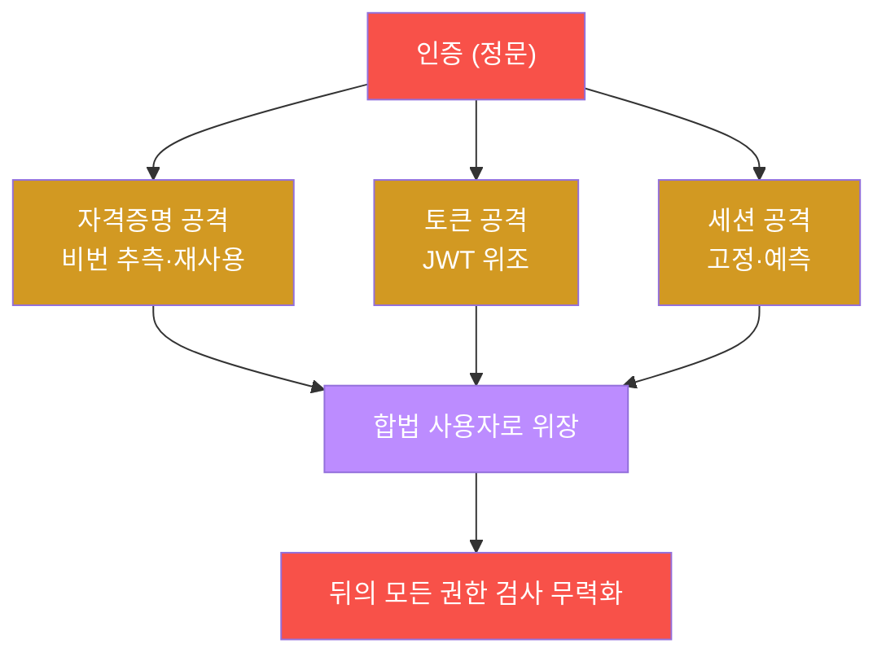
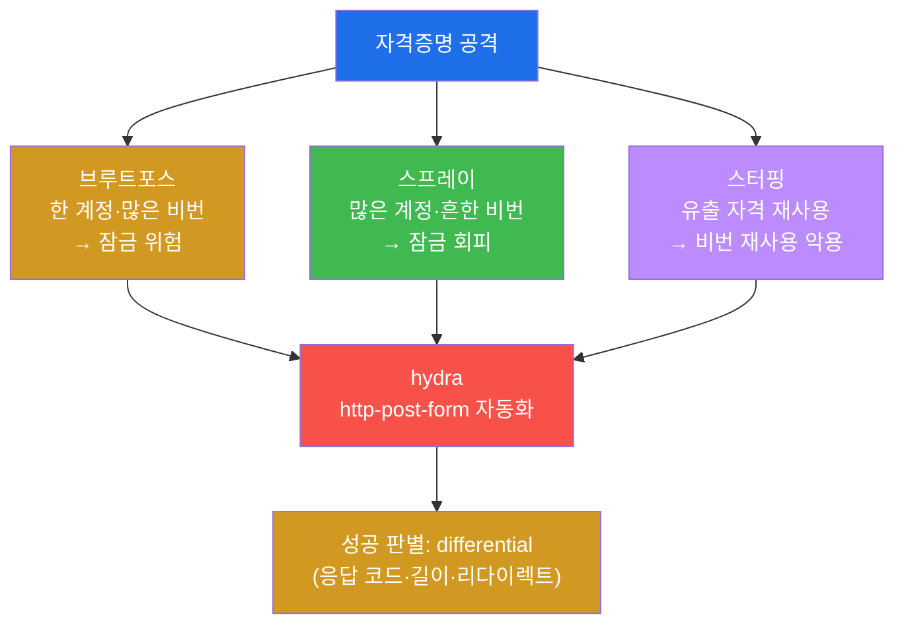
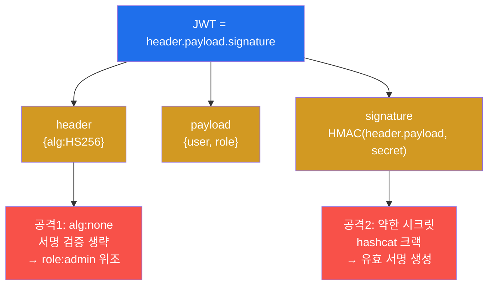
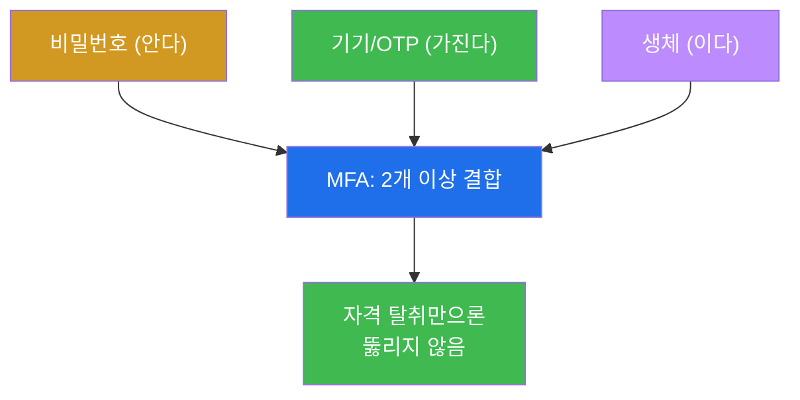

# 공격고급 W05 — 인증·세션 공격: 신원 통제의 관문을 뚫는다

> **본 주차의 한 줄 요약**
>
> 모든 접근 통제는 "당신이 누구인가"를 묻는 **인증**에서 시작한다. 인증이 뚫리면 그 뒤의 모든 권한 검사는
> 무의미하다 — 공격자가 합법 사용자로 위장하기 때문이다. 본 주차는 인증 체계를 세 각도에서 공격한다:
> **자격증명 공격**(브루트포스·패스워드 스프레이·크리덴셜 스터핑), **토큰 공격**(JWT의 `alg:none` 위조·약한
> 시크릿), **세션 공격**(고정·예측 가능 토큰). 학생은 el34에서 패스워드 스프레이를 실행하고, `alg:none` JWT를
> 직접 위조하며, 세션 토큰을 관찰한다.
>
> **레드팀 한 줄 결론**: 인증은 가장 자주, 가장 효과적으로 뚫리는 관문이다 — 사람은 약한 비밀번호를 재사용하고,
> 개발자는 토큰·세션을 잘못 다룬다. 그리고 이 모든 공격을 한 방에 막는 방어가 있다: **MFA**. 무언가를 안다
> (비밀번호) + 가진다(기기)의 결합은 자격 탈취만으로는 뚫리지 않는다.

---

## ⚠️ 윤리 고지

자격증명 공격은 **인가된 계정·시스템에만** 수행한다. 타인 계정 무단 접근은 중범죄다. 본 실습은 el34 인가
표적에 한정한다.

---

## 학습 목표

본 주차 종료 시 학생은 다음 5가지를 **본인 손으로** 할 수 있어야 한다.

1. **자격증명 공격**(브루트포스·스프레이·스터핑·기본자격)을 분류하고 선택 기준을 안다.
2. **패스워드 스프레이**를 실행하고 성공을 differential로 판별한다.
3. **hydra**로 자격 공격을 자동화하는 구문을 작성한다.
4. **JWT** 구조와 `alg:none`·약한 시크릿 위조를 이해한다.
5. **세션 결함**(고정·예측)과 인증 방어(**MFA**·잠금·세션 강화)를 설명한다.

---

## 0. 용어 해설

| 용어 | 영문 | 뜻 | 비유 |
|------|------|----|------|
| **브루트포스** | brute force | 한 계정에 많은 비번 시도 | 자물쇠 모든 조합 |
| **패스워드 스프레이** | password spraying | 많은 계정에 흔한 비번 | 만능열쇠로 모든 문 |
| **크리덴셜 스터핑** | credential stuffing | 유출 자격 재사용 | 훔친 열쇠 재사용 |
| **JWT** | JSON Web Token | 서명된 JSON 토큰 | 위조 방지 출입증 |
| **alg:none** | — | 서명 없음 알고리즘 | 도장 없는 증명서 |
| **시크릿** | secret | JWT 서명 키 | 도장 |
| **세션 고정** | session fixation | 로그인 후 세션 미재발급 악용 | 미리 심은 출입증 |
| **MFA** | Multi-Factor Auth | 다단계 인증 | 이중 잠금 |
| **rate limit** | — | 시도 횟수 제한 | 입장 인원 제한 |
| **differential** | — | 응답 차이로 성공 판별 | 반응의 미묘한 차이 |

> **헷갈리기 쉬운 한 쌍 — 브루트포스 vs 패스워드 스프레이.** **브루트포스**는 한 계정에 수천 개 비밀번호를
> 퍼붓는다 — 빠르지만 **계정 잠금**(N회 실패 시 잠금)에 바로 걸린다. **스프레이**는 거꾸로다 — 많은 계정에
> 흔한 비번 1~2개만 시도한다. 계정당 시도가 적어 잠금을 피하고, "어느 조직이든 `password123`을 쓰는 사람은
> 있다"는 통계에 기댄다. 그래서 실무 공격자는 스프레이를 선호한다 — 더 은밀하고 효과적이다.

---

## 1. 왜 인증을 노리나

### 1.1 한 줄 답: 관문이 뚫리면 나머지는 무의미

인증은 시스템의 정문이다. 정문을 합법적으로 통과하면(자격 탈취), 그 안의 권한 검사는 공격자를 정당한
사용자로 대한다. 익스플로잇으로 어렵게 침투하는 대신, **로그인하면 된다** — 가장 조용하고 확실한 침투다.

### 1.2 왜 중요한가 — 사람과 코드의 약점

인증은 두 약점을 안고 있다 — **사람**(약한 비번·재사용)과 **코드**(토큰·세션 구현 실수). 둘 다 흔해서 인증
공격은 늘 통한다. Verizon DBIR마다 "유출 자격"이 침해 원인 1위인 이유다.

### 1.3 한계 — MFA 앞에서 무력

자격 공격의 결정적 한계는 **MFA**다. 비밀번호를 알아내도 두 번째 요소(기기·OTP)가 없으면 못 들어간다. 그래서
방어의 핵심은 복잡한 비번 정책이 아니라 MFA다(§4).

---

## 2. 자격증명 공격 · hydra

**hydra**는 자격 공격을 자동화한다. 핵심 구문은 `-l/-L`(사용자)·`-P`(비번 목록)·`http-post-form`(폼 경로와
파라미터)·`F=실패문자열`(실패 판별)이다. **성공 판별이 까다롭다** — 로그인 폼은 성공/실패 모두 200을 줄 수
있어, 응답의 **차이(differential)** — 코드·본문 길이·리다이렉트 대상 — 로 판별한다. 실습에서 스프레이 루프를
돌려 응답을 관찰하고, 균일하면 실패임을 확인한다. CSRF 토큰이 있으면 매 요청 토큰을 추출해 넣어야 한다.

---

## 3. JWT 토큰 공격

JWT는 `header.payload.signature`를 base64url로 이은 토큰이다. 서명이 무결성을 보장하지만, 두 가지로 뚫린다.
**alg:none** — 헤더의 알고리즘을 `none`으로 바꾸고 서명을 비우면, 서버가 이를 수락할 경우 서명 검증 없이
`role:admin`으로 위조한 토큰이 통과한다(실습에서 직접 위조). **약한 시크릿** — HMAC 서명의 시크릿이 약하면
hashcat으로 크랙해 유효한 서명을 직접 만든다. **방어**는 alg 화이트리스트(none 거부)·강한 시크릿·서명 검증
필수·짧은 만료다.

---

## 4. 세션 결함 · MFA

**세션 결함.** 인증에 성공하면 서버는 세션 토큰(PHPSESSID 등)을 준다 — 이후 요청의 신원 증표다. 이게
약하면 인증을 통째로 우회한다: **세션 고정**(로그인 후 세션을 재발급하지 않아, 공격자가 미리 심은 세션이
인증됨), **예측 가능 토큰**(순차·약한 난수), **미만료**, **Secure/HttpOnly 부재**(탈취 용이). 방어는 로그인
후 **세션 재발급**·강한 난수·만료·쿠키 플래그다.

**MFA — 최선의 방어.**

MFA는 "안다(비번) + 가진다(기기)"를 결합한다. 비밀번호를 스프레이·스터핑으로 알아내도 두 번째 요소가 없으면
못 들어간다 — 본 주차 공격 대부분을 한 번에 무력화한다. 그래서 인증 방어의 1순위는 늘 MFA다.

---

## 5. 실습 안내 (8 미션)

1. **인증 표적**. 2. **자격 공격 분류**. 3. **스프레이 실행**. 4. **hydra 자동화**. 5. **JWT 위조**.
6. **세션 결함**. 7. **방어(MFA)**. 8. **보고서**.

> 명령은 el34 호스트에서 `docker exec el34-attacker`로. **인가된 표적·계정에만**. 스프레이는 소수 비번으로
> 제한(잠금 정책 존중).

---

## 6. 다음 주차 (W06) 예고 — 권한 상승

W05로 시스템에 발을 들였다(인증 우회·침투). W06은 그 다음 — 일반 사용자에서 **root/SYSTEM으로 올라가는**
권한 상승(SUID·sudo 오설정·커널 취약점·자격 수집)을 다룬다.
