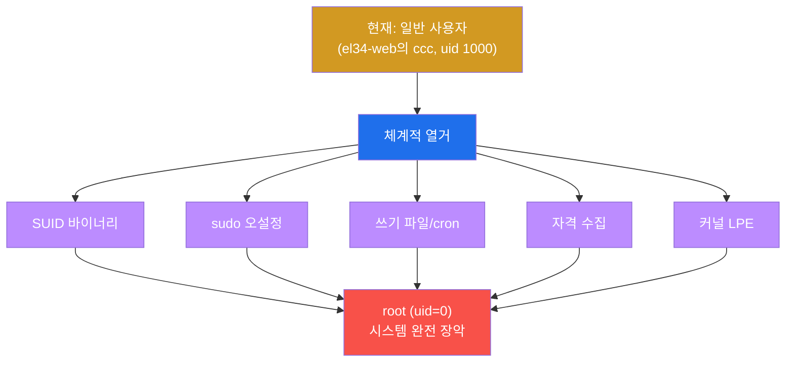
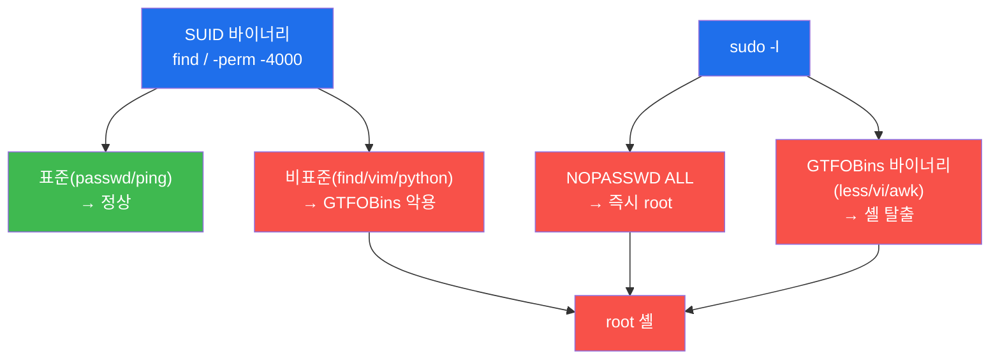
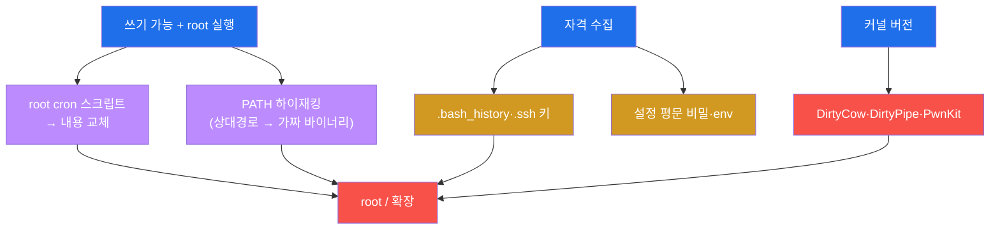

# 공격고급 W06 — 권한 상승: 일반 사용자에서 root로

> **본 주차의 한 줄 요약**
>
> W01~W05로 시스템에 발을 들였다 — 그러나 대개 **일반 사용자** 권한이다. 웹셸은 `www-data`로, 탈취한 계정은
> 평범한 사용자로 돈다. 진짜 통제권은 **root(uid=0)** 에 있다. 본 주차는 그 마지막 도약 — **권한 상승
> (Privilege Escalation)** 을 다룬다. 핵심은 화려한 익스플로잇이 아니라 **체계적 열거**다: SUID 바이너리,
> sudo 오설정, 쓰기 가능한 root 파일/cron, 흘린 자격증명, 패치 안 된 커널. 학생은 el34에서 **비-root 사용자
> `ccc`(uid 1000)** 의 저권한 셸로 들어가 이 벡터들을 LinPEAS처럼 하나씩 열거한다.
>
> **레드팀 한 줄 결론**: 권한 상승의 9할은 **열거**다 — 화려한 0day가 아니라, 관리자가 무심코 남긴 SUID
> 하나, NOPASSWD 한 줄, 쓰기 가능한 cron 하나가 root를 내준다. 그래서 방어도 단순하다: **최소 권한과 정기
> 감사**. 줄 게 없으면 올라갈 곳도 없다.

---

## ⚠️ 윤리 고지

권한 상승은 시스템 완전 장악으로 이어진다. **인가된 실습(el34)에서만** 수행한다. 본 실습은 열거(읽기)에
집중하며 실제 상승은 수행하지 않는다.

---

## 학습 목표

본 주차 종료 시 학생은 다음 5가지를 **본인 손으로** 할 수 있어야 한다.

1. **권한 상승**의 본질(체계적 열거)과 root의 의미를 설명한다.
2. **SUID 바이너리**·**sudo 오설정**을 열거하고 악용 가능성을 판단한다.
3. **쓰기 가능 파일/cron**·**PATH 하이재킹** 벡터를 찾는다.
4. **자격 수집**과 **커널 LPE**·**GTFOBins**를 이해한다.
5. **최소 권한·SUID 감사·패치** 방어를 설명한다.

---

## 0. 용어 해설

| 용어 | 영문 | 뜻 | 비유 |
|------|------|----|------|
| **권한 상승** | privilege escalation | 낮은 권한→높은 권한 | 사원증→마스터키 |
| **root** | — | 리눅스 최고 권한(uid=0) | 건물 마스터키 |
| **uid** | user id | 사용자 번호(0=root, 1000=일반) | 사번 |
| **SUID** | Set User ID | 소유자 권한으로 실행되는 비트 | 사장 명의 결재권 |
| **sudo** | — | 권한 위임 명령 | 임시 결재 위임 |
| **NOPASSWD** | — | 비번 없이 sudo 허용 | 무인 결재 |
| **GTFOBins** | — | 바이너리 악용 기법 백과 | 도구 악용 매뉴얼 |
| **PATH 하이재킹** | — | 상대경로 악용해 가짜 실행 | 이정표 바꿔치기 |
| **LPE** | Local Privilege Escalation | 로컬 권한 상승(커널 등) | 내부 승급 부정 |
| **자격 수집** | credential harvesting | 흘린 비밀 모으기 | 떨어진 열쇠 줍기 |
| **LinPEAS** | — | privesc 자동 열거 도구 | 자동 점검 스캐너 |

> **헷갈리기 쉬운 한 쌍 — 수직 vs 수평 권한 상승.** **수직(vertical)** 은 일반 사용자→root처럼 **더 높은**
> 권한으로 올라간다(본 주차의 주제). **수평(horizontal)** 은 같은 등급의 **다른 사용자**가 된다(A 사용자→B
> 사용자, 다음 W08 측면 이동과 연결). 둘 다 "현재 권한으로 접근 못 하는 것에 접근"하는 점은 같지만,
> 수직은 "위로", 수평은 "옆으로"다. 공격자는 보통 수평으로 자격을 모으며 수직 상승 기회를 찾는다.

---

## 0.5 신입생 친화 핵심 개념

### 0.5.1 왜 이번엔 `el34-web` 의 `ccc` 로 실습하나 — 저권한 셸 모사

지금까지 공격은 `el34-attacker` 에서 했다. 그런데 **권한 상승은 "낮은 권한에서 시작"해야 의미가 있다.**
el34-attacker는 컨테이너 안에서 root라 "올라갈 곳"이 없다 — privesc 실습의 시작점으로 모순이다. 그래서 W06은
**`el34-web` 의 비-root 사용자 `ccc`(uid 1000)** 로 들어간다:

```bash
docker exec -it -u ccc el34-web bash   # uid 1000 = 침투로 얻은 저권한 발판을 모사
```

이게 "웹셸로 막 들어온 `www-data` 같은 낮은 권한"을 흉내 낸 것이다. 여기서 root로 올라가는 길을 찾는 게 W06의
전부다. (`-u ccc` 를 빼면 root로 들어가 실습이 무의미해진다 — 반드시 `-u ccc`.)

### 0.5.2 SUID 비트 읽기 — `find / -perm -4000`

SUID 비트가 붙은 파일은 **누가 실행하든 소유자(보통 root) 권한**으로 돈다. 권한 표시에서 소유자 실행 자리가
`s`(`-rwsr-xr-x`)다. 찾는 명령:

```bash
find / -perm -4000 -type f 2>/dev/null    # SUID 비트(4000) 파일 전부
```

`passwd`·`ping` 처럼 정상적으로 SUID인 것도 있지만, `find`·`vim`·`python`·`nmap` 에 SUID가 붙어 있으면
**GTFOBins** 기법으로 root 셸을 딴다(예: `find . -exec /bin/sh -p \;`). 그래서 "비표준 SUID"가 1순위 점검 대상.

### 0.5.3 sudo -l 읽기 — 무엇이 root 직행인가

`sudo -l` 은 "내가 sudo로 쓸 수 있는 명령"을 보여준다. 위험 신호:

| sudo -l 결과 | 의미 |
|--------------|------|
| `(ALL) NOPASSWD: ALL` | **즉시 root**(`sudo su`) |
| `(root) NOPASSWD: /usr/bin/less` | GTFOBins 바이너리 → `sudo less /x` 안에서 `!/bin/sh` 로 셸 탈출 |
| `(root) /usr/bin/vi` | `sudo vi` → `:!sh` |

핵심: sudo로 허용된 게 `less`·`vi`·`awk`·`find` 같은 **셸을 띄울 수 있는 바이너리**면 root로 직행한다.
GTFOBins(gtfobins.github.io)가 바이너리별 탈출법을 정리해 둔 백과다.

### 0.5.4 권한 상승 벡터 5종 — LinPEAS가 한 번에 본다

| 벡터 | 찾는 법 | 악용 |
|------|---------|------|
| SUID | `find -perm -4000` | GTFOBins |
| sudo 오설정 | `sudo -l` | NOPASSWD·셸 바이너리 |
| 쓰기 root 파일/cron | `find -writable` | 내용 교체·PATH 하이재킹 |
| 자격 수집 | `.bash_history`·`.ssh`·env | 비번·키 재사용 |
| 커널 LPE | `uname -r` | DirtyCow/DirtyPipe/PwnKit |

LinPEAS는 이 다섯을 한 번에 자동 열거한다. 본 실습은 각 벡터를 손으로 하나씩 본다.

### 0.5.5 임의로 보이는 값들

| 값 | 무엇 | 규칙 |
|----|------|------|
| **uid 0 / 1000** | 사용자 번호 | 0=root, 1000=첫 일반 사용자(ccc) |
| **-perm -4000** | find 권한 마스크 | SUID 비트 |
| **PwnKit/DirtyPipe** | 커널/pkexec LPE | CVE 별명 |
| **마커(`suid_done` 등)** | 단계 완료 신호 | 채점이 통과를 확인하는 약속 문자열 |

---

## 1. 권한 상승이란 — 열거가 9할

### 1.1 한 줄 답: 시스템이 흘린 실수를 줍는 것

권한 상승은 대개 제로데이 익스플로잇이 아니다. 관리자가 무심코 남긴 **오설정**을 찾는 것이다 — 악용 가능한
SUID, NOPASSWD sudo, 쓰기 가능한 root cron. 이걸 찾는 과정이 **열거(enumeration)** 이고, 권한 상승의 9할이다.



### 1.2 왜 중요한가 — 침투의 완성

초기 발판은 제한된 권한이다. root를 얻어야 로그 삭제·전체 데이터 접근·지속성 심기·다른 사용자 가장이
자유로워진다. 권한 상승은 침투를 **완전한 장악**으로 바꾼다.

### 1.3 한계 — 잘 관리된 시스템엔 길이 없다

열거가 9할이라는 말은 거꾸로, **열거할 오설정이 없으면 길이 없다**는 뜻이다. 최소 권한으로 빈틈없이 관리된
시스템에선 권한 상승이 막힌다 — 그래서 방어가 명확하다(§4).

---

## 2. SUID · sudo · GTFOBins



**실측 예 — SUID 열거(el34-web의 ccc 셸에서).**

```bash
find / -perm -4000 -type f 2>/dev/null | head -20
N=$(find / -perm -4000 -type f 2>/dev/null | wc -l); echo "SUID 총 ${N}개"
```

`passwd`·`ping` 등 표준 SUID 외에 `find`·`vim`·`python` 이 보이면 GTFOBins로 root 셸을 딴다(§0.5.2).
**sudo -l** 은 내가 sudo로 쓸 수 있는 명령을 보여준다(§0.5.3) — `(ALL) NOPASSWD: ALL` 이면 즉시 root, GTFOBins
바이너리가 허용되면 그 안에서 셸을 탈출한다(`sudo less /etc/hosts` → `!/bin/sh`). **GTFOBins** 는 이런 악용
기법을 바이너리별로 정리한 백과다.

---

## 3. 쓰기 파일/cron · 자격 · 커널



**쓰기 파일/cron** — root가 주기적으로 실행하는 스크립트가 내게 쓰기 가능하면, 그 안에 셸 명령을 넣어 root로
실행시킨다. cron이 절대경로 없이 명령을 부르면 **PATH 하이재킹**(내 디렉터리에 가짜 바이너리를 놓고 PATH를
조작)도 가능하다. **자격 수집** — `.bash_history`(명령에 박힌 비번)·`.ssh` 키·설정 파일 평문 비밀·env 변수를
모은다. 이 자격은 권한 상승뿐 아니라 **측면 이동(W08)** 의 연료다(메모리도 소스 — soc-adv W08). **커널 LPE**
— `uname -r` 로 커널 버전을 확인해 알려진 로컬 익스플로잇(DirtyCow·DirtyPipe·PwnKit/pkexec)을 매핑한다.
**LinPEAS** 는 이 모든 벡터를 한 번에 자동 열거한다(§0.5.4).

---

## 4. 방어 — 줄 게 없으면 올라갈 곳도 없다

| 벡터 | 방어 |
|------|------|
| SUID 악용 | 불필요한 SUID 제거·정기 감사(`find -perm -4000`) |
| sudo 오설정 | NOPASSWD 최소화·GTFOBins 바이너리 sudo 금지 |
| 쓰기 파일/cron | root 실행 파일 비쓰기·cron 절대경로 |
| 자격 노출 | 평문 비밀 금지·`.ssh` 권한·env 비밀 제거 |
| 커널 LPE | 알려진 LPE 신속 패치 |

핵심 원칙은 **최소 권한**이다 — 꼭 필요한 SUID·sudo만 남기고, root 실행 파일을 일반 사용자가 못 건드리게
한다. 그리고 **정기 감사**(실습 STEP 7의 SUID 감사)로 새로 생긴 오설정을 잡는다. 탐지 측면에선 soc-adv W06
헌팅(새 SUID 실행·sudo 이상·신규 계정)이 권한 상승 시도를 포착한다 — 공격과 방어가 다시 만난다.

---

## 5. 실습 안내 (8 미션)

각 미션을 **① 왜 하는가 / ② 무엇을 알 수 있는가 / ③ 결과 해석 / ④ 실전 활용** 4축으로 설명한다. 명령은
el34 호스트에서 **`docker exec -it -u ccc el34-web bash`(uid 1000 저권한 셸 모사, §0.5.1)** 로. **인가된 실습
환경(el34)에서만**, 열거는 읽기 전용(실제 상승 미수행).

### STEP 1 — 현재 권한
- **왜**: privesc는 낮은 권한에서 시작 — 출발점 확인.
- **무엇을**: `id`/`whoami`(uid 1000 ccc).
- **해석**: 비-root 발판 확인(`privesc_ready`). 여기서 root로 올라갈 길을 찾는다.
- **실전**: 침투 직후 "나는 누구·어디"부터.

### STEP 2 — SUID 열거
- **왜**: 1순위 privesc 벡터.
- **무엇을**: `find / -perm -4000 -type f`.
- **해석**: 비표준 SUID(find/vim/python)면 GTFOBins(`suid_done`).
- **실전**: 표준 외 SUID를 GTFOBins와 대조.

### STEP 3 — sudo 점검
- **왜**: NOPASSWD·셸 바이너리면 root 직행.
- **무엇을**: `sudo -l`(비번 없으면 `-n`).
- **해석**: NOPASSWD·(ALL)·less/vi/awk 확인(`sudo_done`, §0.5.3).
- **실전**: 허용 바이너리를 GTFOBins로 탈출.

### STEP 4 — 쓰기 파일/cron
- **왜**: root 실행 파일이 쓰기 가능하면 내용 교체로 root.
- **무엇을**: 쓰기 가능 root cron·스크립트·PATH.
- **해석**: 쓰기+root실행 조합이 벡터(`writable_done`).
- **실전**: cron 절대경로 부재 시 PATH 하이재킹.

### STEP 5 — 자격 수집
- **왜**: 흘린 비번·키가 상승·이동의 연료.
- **무엇을**: `.bash_history`·`.ssh`·설정·env.
- **해석**: 평문 비밀·키 수집(`creds_done`). W08 이동에도 쓰임.
- **실전**: 메모리(soc-adv W08)도 자격 소스.

### STEP 6 — 커널/GTFOBins
- **왜**: 오설정이 없으면 커널 LPE로.
- **무엇을**: `uname -r` → 알려진 LPE 매핑.
- **해석**: DirtyPipe/PwnKit 등 후보(`kernel_done`).
- **실전**: 커널 버전별 공개 익스플로잇 확인.

### STEP 7 — 방어(SUID 감사)
- **왜**: 줄 게 없으면 올라갈 곳도 없다.
- **무엇을**: SUID 감사 + 위험 바이너리 점검.
- **해석**: 비표준 위험 SUID 유무(`defense_done`). 최소 권한·정기 감사.
- **실전**: 방어자의 SUID·sudo 감사 루틴.

### STEP 8 — privesc 보고서
- **왜**: 발견 벡터·영향·방어를 종합.
- **무엇을**: 열거 결과를 인용한 보고서 골격.
- **해석**: 실측 인용(`privesc_report_done`).
- **실전**: 오설정 목록 + 최소 권한 권고.

---

## 6. 흔한 오해·관제자 노트

- **"privesc = 화려한 0day"** — 9할은 열거다. SUID·NOPASSWD·쓰기 cron 같은 오설정이 root를 내준다.
- **"el34-attacker에서 하면 되지"** — attacker는 root라 올라갈 곳이 없다. el34-web의 ccc(uid 1000)로(§0.5.1).
- **"sudo 되면 그냥 좋은 것"** — `sudo less/vi/awk` 는 셸 탈출로 root 직행이다(GTFOBins). NOPASSWD 최소화.
- **"패치는 나중에"** — 커널 LPE(PwnKit 등)는 공개 즉시 무기화된다. 신속 패치가 방어.

---

## 7. 다음 주차 (W07) 예고 — C2 인프라

W06으로 root를 얻었다. W07은 장악한 시스템을 **원격에서 통제**하는 C2(Command and Control) 인프라 —
비콘·암호화 채널·리다이렉터로 은밀하고 견고한 통제망을 구축하는 법을 다룬다.
