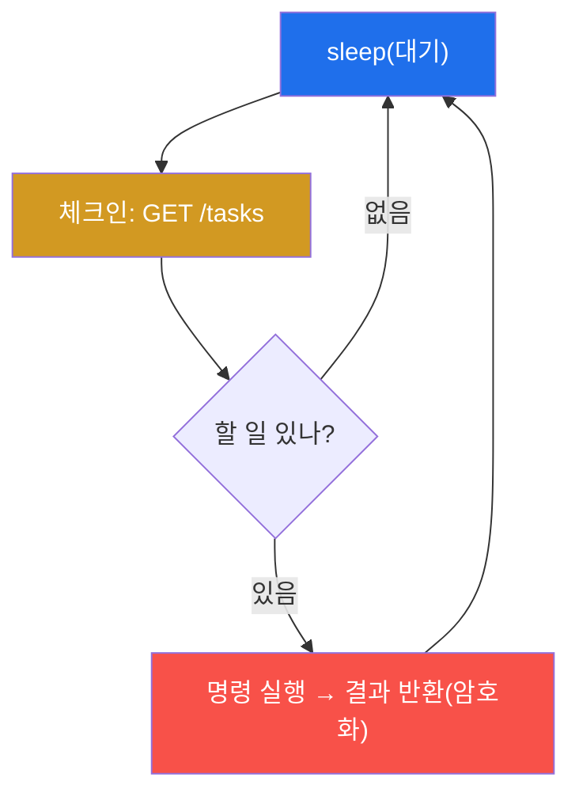
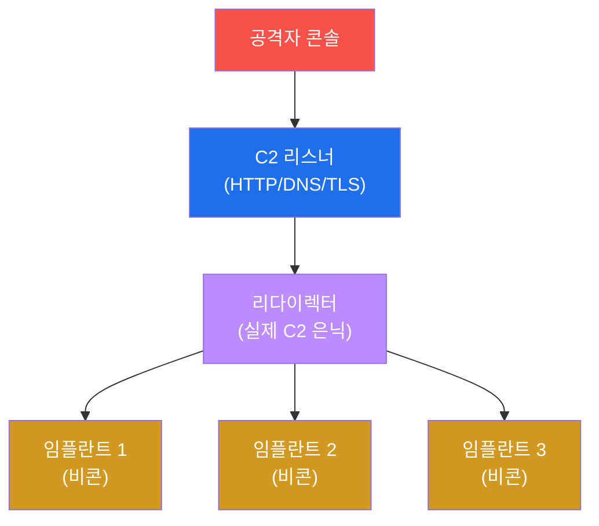
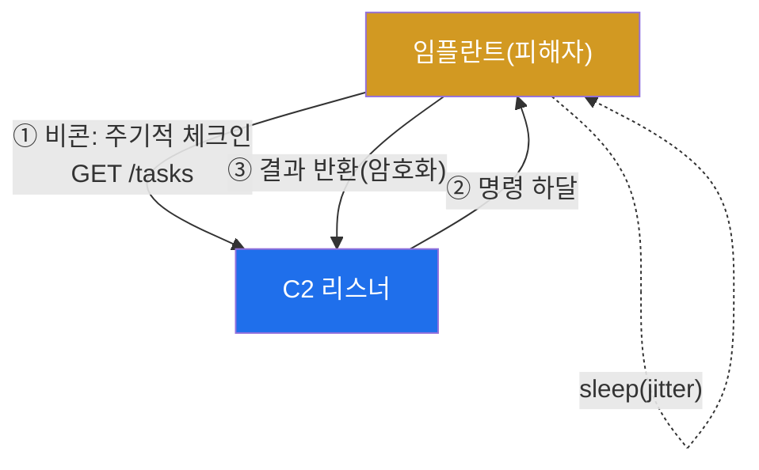
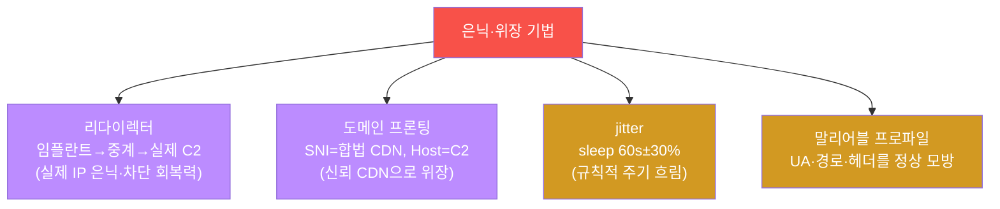
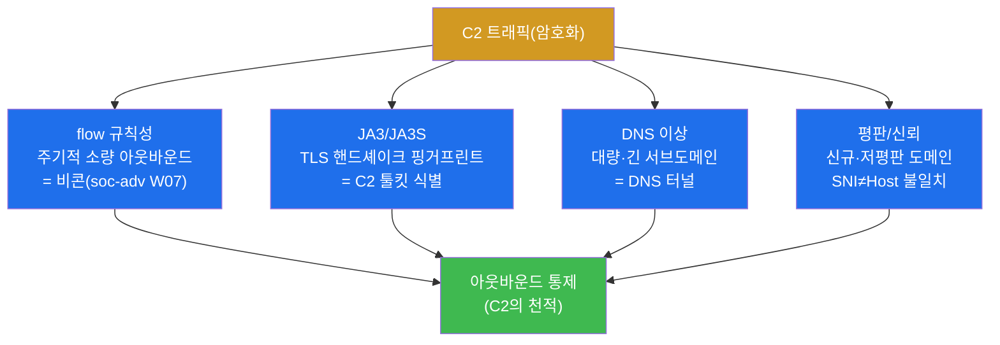

# 공격고급 W07 — C2 인프라: 장악한 시스템을 원격에서 통제한다

> **본 주차의 한 줄 요약**
>
> W01에서 리버스 셸로 첫 C2 채널을 맛봤다. 그러나 단순 nc 셸은 끊기면 끝이고, 암호화도 없고, 출처가 빤히
> 드러난다. 실전 APT는 **C2(Command and Control) 인프라** 를 짓는다 — 끊겨도 다시 붙는 **비콘**, 내용을
> 숨기는 **암호화 채널**, 실제 서버를 가리는 **리다이렉터·도메인 프론팅**, 규칙성을 지우는 **jitter**. 본
> 주차에 학생은 el34에서 C2 리스너를 띄우고 비콘 체크인을 시연하며, 동시에 **방어자가 이 C2를 어떻게
> 탐지하는지**(flow 규칙성·JA3) 를 배운다.
>
> **레드팀 한 줄 결론**: C2의 목표는 은밀·견고·위장이다. 그러나 아무리 암호화하고 위장해도 **메타데이터는
> 못 숨긴다** — 주기적 비콘은 flow에, TLS 툴킷은 JA3에 흔적을 남긴다. 그래서 C2와 탐지는 끝없는 군비경쟁
> (W03)이고, 방어의 최종 무기는 **아웃바운드 통제**(나가는 연결을 허용 목록으로)다.

---

## ⚠️ 윤리 고지

C2는 실제 침해의 핵심 인프라다. **인가된 실습(el34)에서만** 메커니즘을 시연한다. 실제 C2 프레임워크를 무단
시스템에 배포하는 것은 중범죄다.

---

## 학습 목표

본 주차 종료 시 학생은 다음 5가지를 **본인 손으로** 할 수 있어야 한다.

1. **C2 구조**(리스너↔임플란트)와 비콘 vs 인터랙티브를 설명한다.
2. **C2 리스너**를 띄우고 **비콘 체크인**을 시연한다.
3. **암호화 채널**(HTTPS C2)이 내용 검사를 어떻게 회피하는지 안다.
4. **리다이렉터·도메인 프론팅·jitter**로 은닉·위장하는 원리를 안다.
5. 방어자의 **C2 탐지**(flow·JA3·아웃바운드 통제)를 설명한다.

---

## 0. 용어 해설

| 용어 | 영문 | 뜻 | 비유 |
|------|------|----|------|
| **C2** | Command and Control | 원격 통제 채널·인프라 | 작전 통신망 |
| **리스너** | listener | 임플란트 접속을 받는 서버 | 본부 무전기 |
| **임플란트** | implant | 피해자측 에이전트 | 잠입 요원 |
| **비콘** | beacon | 주기적 체크인 방식 | 정기 무전 |
| **인터랙티브** | interactive | 상시 연결 셸 | 상시 통화 |
| **sleep** | — | 비콘 체크인 간격 | 무전 주기 |
| **리다이렉터** | redirector | C2 앞 중계 서버 | 중계 기지 |
| **도메인 프론팅** | domain fronting | CDN 뒤에 C2 은닉 | 합법 화물로 위장 |
| **jitter** | — | 비콘 주기 무작위화 | 불규칙 무전 |
| **말리어블** | malleable | 트래픽 위장 설정 | 변장 |
| **JA3** | — | TLS 핸드셰이크 핑거프린트 | 악수 습관으로 식별 |

> **헷갈리기 쉬운 한 쌍 — 비콘 vs 인터랙티브 셸.** **인터랙티브**(W01의 리버스 셸)는 상시 연결을 유지한다 —
> 즉각 반응하지만, 끊기면 끝이고 지속 연결이 탐지에 잘 걸린다. **비콘**은 주기적으로 "할 일 있나요?" 폴링하고
> 평소엔 잠잔다(sleep) — 반응은 느리지만 훨씬 은밀하고, 끊겨도 다음 체크인에 복구된다. 실전 C2는 비콘이
> 기본이고, 필요할 때만 인터랙티브로 전환한다.

---

## 0.5 핵심 개념

### 0.5.1 C2 구성요소 — 단순 nc 셸과 무엇이 다른가

| 요소 | 역할 | nc 셸엔 없음 |
|------|------|--------------|
| 리스너 | 임플란트 접속 수신 | (nc도 있음) |
| 임플란트 | 피해자측 에이전트(비콘) | sleep·복구 |
| 리다이렉터 | 실제 C2 IP 은닉·차단 회복 | ✓ |
| 도메인 프론팅 | CDN 뒤 위장 | ✓ |
| jitter/말리어블 | 규칙성·서명 흐림 | ✓ |

핵심: nc 셸은 "한 번 연결"이지만, C2는 **인프라**(끊겨도 복구, 암호화, 위장, 다중 호스트 관리)다.

### 0.5.2 비콘의 한 사이클 — 체크인 → 명령 → sleep



임플란트는 sleep 간격마다 리스너의 `/tasks` 를 폴링한다. 실습 STEP 2~3은 `python3 -m http.server :55007` 리스너를
띄우고 **3회 체크인**을 시연한다(마커 `beacon_checkins_N` 은 실제 체크인 횟수로 게이트). 평소엔 잠자므로
상시 연결보다 훨씬 조용하다.

### 0.5.3 jitter 계산 — 규칙성을 흐린다

비콘이 정확히 60초마다 나가면 flow에 **칼 같은 규칙성**이 찍혀 탐지된다. **jitter**는 주기에 무작위 편차를 준다:

```
sleep 60s, jitter 30%  →  60 ± 18s  →  실제 체크인 간격 42~78초(무작위)
```

이렇게 흐려도 **장기 통계로는 평균 주기가 드러난다** — jitter는 탐지를 늦출 뿐 못 막는다(§0.5.4).

### 0.5.4 메타데이터는 못 숨긴다 — C2의 근본 약점

C2가 내용을 TLS로 암호화하고 도메인 프론팅으로 위장해도, **통신의 메타**(언제·얼마나·어디로)는 남는다:

| 메타 | C2의 흔적 |
|------|-----------|
| flow 규칙성 | 주기적 소량 아웃바운드 = 비콘(soc-adv W07) |
| JA3 | TLS 핸드셰이크 지문 = C2 툴킷(Cobalt Strike 등) 식별 |
| DNS | 대량·긴 서브도메인 = DNS 터널 |
| 평판 | 신규·저평판 도메인, SNI≠Host 불일치 |

암호화는 "무엇을 말하는지"는 숨기지만 "말하고 있다는 사실"은 못 숨긴다. 그래서 방어의 최종 무기는
**아웃바운드 통제**(나갈 곳을 허용 목록으로) — C2가 나갈 데가 없으면 인프라가 무력해진다.

### 0.5.5 임의로 보이는 값들

| 값 | 무엇 | 규칙 |
|----|------|------|
| **포트 55007** | 실습 C2 리스너 포트 | attack-adv W07 임의 고포트 |
| **/tasks** | 비콘 체크인 경로 | "할 일 폴링" 관례 경로 |
| **JA3** | TLS 지문 | ClientHello 필드 해시 |
| **마커(`beacon_checkins_N` 등)** | 단계 완료 신호(횟수 게이트) | 실제 체크인 수로 통과 판정 |

---

## 1. C2란 — 단순 셸을 넘어

### 1.1 한 줄 답: 견고하고 은밀한 통제망

C2는 장악한 호스트들을 원격에서 통제하는 신경망이다. 단순 nc 셸과 다른 점은 **인프라**라는 것 — 끊겨도 다시
붙고, 암호화로 숨고, 여러 호스트를 한 콘솔로 관리하고, 탐지를 회피하도록 설계된다(§0.5.1).



### 1.2 왜 중요한가 — 지속 작전의 신경망

APT는 한 번 들어가 끝내지 않는다 — 며칠~몇 달 머물며 측면 이동하고 데이터를 빼낸다(W08·W10). 그 모든
지속 작전을 가능케 하는 것이 C2다. C2가 죽으면 작전이 끝나므로, 견고함(복구·다중화)이 핵심이다.

### 1.3 한계 — 메타데이터는 못 숨긴다

C2는 내용을 암호화하고 출처를 위장할 수 있지만, **통신의 메타데이터**(언제·얼마나·어디로)는 남는다(§0.5.4).
주기적 비콘은 flow에, TLS 툴킷은 JA3에 흔적을 남긴다. 완벽한 은신은 없다.

---

## 2. 리스너 · 비콘 · 암호화 채널



**실측 예 — 리스너 + 비콘(el34-attacker에서).**

```bash
python3 -u -m http.server 55007 >/tmp/c2.log 2>&1 & P=$!   # C2 리스너 기동
sleep 1
curl -s http://127.0.0.1:55007/tasks >/dev/null            # 비콘 체크인 1회 (×3 반복)
```

**리스너**는 임플란트 접속을 받는 공격자측 서버다(실무는 Sliver·Mythic·Cobalt Strike). **비콘**은 sleep
간격마다 `/tasks` 를 폴링해 "할 일 있나요?"를 묻는다 — 실습은 3회 체크인을 시연하고 마커가 실제 횟수로
게이트된다. **암호화 채널** — C2 트래픽을 TLS(443)로 암호화하면 DPI(내용 검사)가 무력화되고 정상 HTTPS와
섞인다. 방어자는 내용을 못 보고 메타(flow·JA3)로만 판단해야 한다(§0.5.4).

---

## 3. 은닉 · 위장 (리다이렉터 · jitter)



**리다이렉터**는 임플란트와 실제 C2 사이의 중계 서버다 — 실제 C2 IP를 숨기고, 중계가 차단돼도 새로 세워
회복한다. **도메인 프론팅**은 TLS SNI엔 합법 CDN 도메인을, 내부 Host 헤더엔 C2를 넣어 CDN이 C2로 전달하게
한다 — 방어자 눈엔 "신뢰 CDN과 통신"으로 보인다. **jitter**는 비콘 주기에 무작위 편차를 줘(§0.5.3) flow의
규칙성을 흐린다. **말리어블 프로파일**은 User-Agent·경로·헤더를 정상 브라우저/앱처럼 위장한다. 모두 "정상과
구분 안 되게"가 목표다. (실습 STEP 6은 그 한 형태로 DNS 터널을 시연한다 — 데이터를 DNS 쿼리에 숨겨 내보냄.)

---

## 4. C2 탐지 — 메타데이터의 배신

C2가 내용을 숨겨도, 방어자는 메타데이터로 잡는다(§0.5.4).



**flow 규칙성** — 정확히 N초마다 같은 크기로 나가는 연결은 비콘의 서명이다(soc-adv W07 flow 분석). jitter가
이를 흐리지만 장기 통계로는 여전히 드러난다. **JA3** — TLS 핸드셰이크의 핑거프린트로 C2 툴킷(Cobalt Strike
등)을 식별한다 — 암호화돼도 핸드셰이크 패턴은 보인다. **아웃바운드 통제** — 나가는 연결을 허용 목록으로
제한하면 C2는 나갈 곳이 없다. 이것이 C2의 천적이다. C2 회피와 탐지는 W03처럼 군비경쟁이지만, **다층 메타
분석**이 암호화 C2도 결국 잡는다.

---

## 5. 실습 안내 (8 미션)

각 미션을 **① 왜 하는가 / ② 무엇을 알 수 있는가 / ③ 결과 해석 / ④ 실전 활용** 4축으로 설명한다. 명령은
el34 호스트에서 `docker exec el34-attacker` 로. **인가된 실습 환경(el34)에서만**, C2는 자체완결 메커니즘
데모(로컬 리스너).

### STEP 1 — C2 도구
- **왜**: C2 구축 도구(python3·curl·nc) 확인.
- **무엇을**: 도구 가용.
- **해석**: 준비 확인(`c2_tools_ready`).
- **실전**: 실무는 Sliver/Mythic/Cobalt Strike.

### STEP 2 — 리스너 구축
- **왜**: 임플란트 접속을 받을 서버.
- **무엇을**: `python3 -m http.server :55007` + 실접속.
- **해석**: 200 응답으로 리스너 가동 확인(`listener_up_200`). 죽으면 미통과.
- **실전**: HTTP/DNS/TLS 멀티 프로토콜 리스너.

### STEP 3 — 비콘
- **왜**: 끊겨도 복구되는 은밀한 체크인.
- **무엇을**: `/tasks` 3회 체크인.
- **해석**: 실제 체크인 수로 게이트(`beacon_checkins_N`). sleep으로 평소 잠잠.
- **실전**: jitter로 주기 흐림(§0.5.3).

### STEP 4 — 암호화 채널
- **왜**: 내용 검사(DPI) 회피.
- **무엇을**: TLS(443) C2 개념·시연.
- **해석**: 암호화로 내용 은닉(`tls_channel_ok`). 메타는 남음.
- **실전**: 정상 HTTPS와 섞여 DPI 무력화.

### STEP 5 — 리다이렉터/프론팅
- **왜**: 실제 C2 IP 은닉·신뢰 CDN 위장.
- **무엇을**: 도메인 프론팅(SNI=CDN, Host=C2) 개념.
- **해석**: 위장 원리 확인(`fronting_ok`).
- **실전**: 차단돼도 중계 재구성으로 회복.

### STEP 6 — DNS 터널(은닉 채널)
- **왜**: 막을 수 없는 채널(53)에 데이터 은닉.
- **무엇을**: base64 DNS 라벨 쿼리 전송.
- **해석**: DNS로 데이터 유출(`dns_tunnel_sent`).
- **실전**: 방어는 DNS 길이·엔트로피 이상탐지.

### STEP 7 — C2 탐지
- **왜**: 암호화해도 메타로 잡힌다.
- **무엇을**: flow 규칙성·JA3·DNS 이상 집계.
- **해석**: 탐지 신호 수로 게이트(`c2_detected_N`).
- **실전**: 아웃바운드 통제가 C2의 천적.

### STEP 8 — C2 보고서
- **왜**: 구축·은닉·탐지를 종합.
- **무엇을**: C2 운용 결과를 인용한 보고서 골격.
- **해석**: 실측 인용(`c2_report_done`).
- **실전**: C2 IOC + 아웃바운드 통제 권고.

---

## 6. 흔한 오해·블루팀 노트

- **"암호화하면 안 들킨다"** — 내용은 숨겨도 메타(flow·JA3·DNS)는 남는다(§0.5.4). 완벽한 은신은 없다.
- **"비콘은 느려서 안 좋다"** — 느리지만 은밀하고 복구된다. 실전 C2의 기본이 비콘(§0.5.1).
- **"jitter면 flow 탐지 회피"** — 장기 통계로 평균 주기가 드러난다. 늦출 뿐 못 막음(§0.5.3).
- **"인바운드만 막으면 된다"** — C2는 아웃바운드다. 나가는 연결 통제가 천적(§0.5.4).

---

## 7. 다음 주차 (W08) 예고 — 측면 이동

W07로 한 호스트의 견고한 통제(C2)를 얻었다. W08은 거기서 **내부로 번지는** 측면 이동 — 자격 재사용·Pass-
the-Hash·내부 피벗으로 한 발판에서 네트워크 전체로 확산하는 법을 다룬다.
