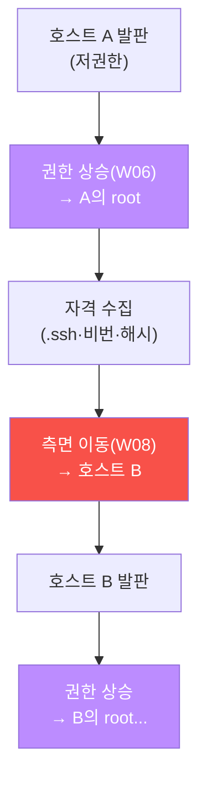
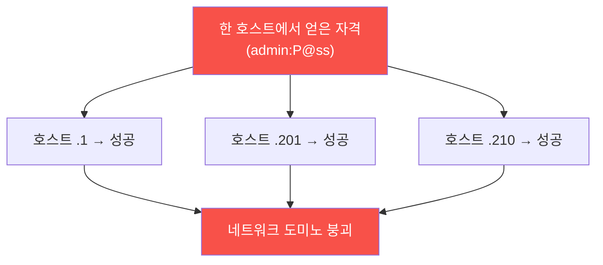
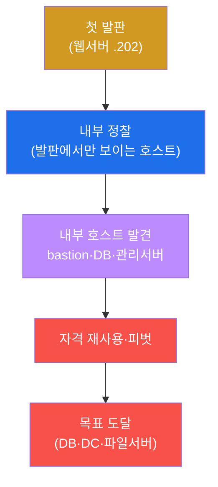
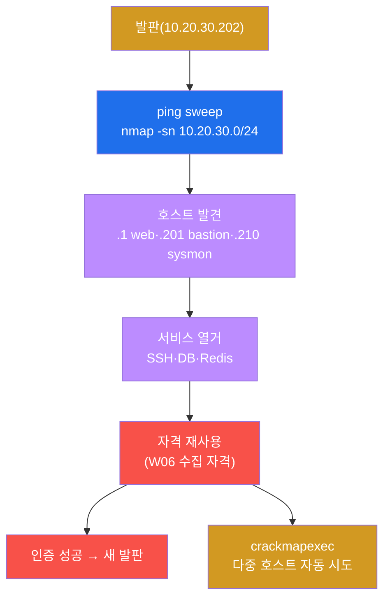
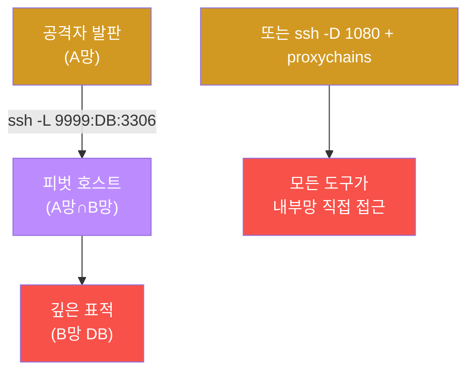
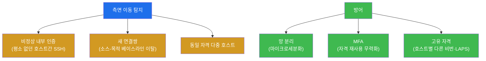

# 공격고급 W08 — 측면 이동: 한 발판에서 네트워크 전체로

> **본 주차의 한 줄 요약**
>
> 침투는 한 호스트를 내준다 — 그러나 공격자가 원하는 건 보통 다른 곳에 있다(DB 서버, 도메인 컨트롤러,
> 파일 서버). **측면 이동(Lateral Movement)** 은 장악한 한 발판을 디딤돌 삼아 내부망 전체로 번지는 기술이다.
> 외부에선 안 보이던 내부 호스트를 정찰하고, W06에서 수집한 **자격을 재사용**하고, 직접 못 닿는 깊은 곳을
> **피벗(터널)** 으로 뚫는다. 본 주차에 학생은 el34에서 내부망 발판(10.20.30.202)에 서서 실제 내부 호스트
> (bastion·web·sysmon)를 정찰하고 측면 이동을 시도한다.
>
> **레드팀 한 줄 결론**: 측면 이동의 고속도로는 **비밀번호 재사용**이다 — 한 호스트의 자격이 다른 호스트에도
> 통하면 네트워크가 도미노처럼 쓰러진다. 그래서 방어의 천적은 **망 분리 + 호스트별 고유 자격 + MFA**다. 한
> 발판이 전체가 되지 못하게 끊는 것이 핵심이다.

---

## ⚠️ 윤리 고지

측면 이동은 침해 확산 기술이다. **인가된 실습(el34)에서만**, 인가된 내부 표적에 한정한다.

---

## 학습 목표

본 주차 종료 시 학생은 다음 5가지를 **본인 손으로** 할 수 있어야 한다.

1. **측면 이동**의 목적과 외부 정찰과 다른 **내부 정찰**을 수행한다.
2. **내부 서비스 열거**로 이동 진입점을 찾는다.
3. **자격 재사용**이 확산의 고속도로임을 이해하고 시도한다.
4. **피벗(SSH 터널·proxychains)** 으로 분리망을 우회하는 원리를 안다.
5. **Pass-the-Hash/티켓**(AD)과 측면 이동 **탐지·방어**(망분리·MFA)를 설명한다.

---

## 0. 용어 해설

| 용어 | 영문 | 뜻 | 비유 |
|------|------|----|------|
| **측면 이동** | lateral movement | 내부망 호스트 간 확산 | 건물 내 방 이동 |
| **내부 정찰** | internal recon | 발판에서 내부 스캔 | 잠입 후 내부 답사 |
| **자격 재사용** | credential reuse | 한 자격을 여러 호스트에 | 한 열쇠로 여러 문 |
| **피벗** | pivot | 발판 경유 깊은 곳 접근 | 징검다리 |
| **터널** | tunnel | 경유 연결 통로 | 비밀 통로 |
| **proxychains** | — | SOCKS 프록시 경유 도구 | 우회 배달망 |
| **crackmapexec** | CME | 다중 호스트 자격 시도 자동화 | 만능열쇠 일괄 시도 |
| **Pass-the-Hash** | PtH | 해시로 평문 없이 인증 | 지문 복제로 출입 |
| **Pass-the-Ticket** | PtT | Kerberos 티켓 재사용 | 출입증 복제 |
| **골든 티켓** | golden ticket | krbtgt로 임의 티켓 위조 | 마스터 출입증 위조 |
| **망 분리** | segmentation | 네트워크를 구역으로 나눔 | 방화구획 |

> **헷갈리기 쉬운 한 쌍 — 권한 상승 vs 측면 이동.** **권한 상승(W06)** 은 같은 호스트에서 **위로**(사용자→
> root) 올라간다. **측면 이동(W08)** 은 호스트에서 호스트로 **옆으로** 번진다. 둘은 짝을 이뤄 반복된다 —
> 한 호스트에서 root를 얻어(상승) 자격을 수집하고, 그 자격으로 다음 호스트로 가서(이동) 다시 root를 얻고…
> 이 "상승↔이동" 사이클이 침해를 네트워크 전체로 키운다.

---

## 0.5 신입생 친화 핵심 개념

### 0.5.1 상승↔이동 사이클 — 침해가 네트워크로 커지는 법



한 호스트에서 root를 얻으면(상승) 거기 저장된 자격을 줍고, 그 자격으로 옆 호스트로 간다(이동). 이 사이클이
반복되며 침해가 네트워크 전체로 번진다. W06(상승)과 W08(이동)은 짝이다.

### 0.5.2 el34 내부망 지도 — 발판에서 보이는 호스트

외부에선 공인 IP 하나만 보이지만, 발판(10.20.30.202) 안에서는 내부 서브넷이 펼쳐진다.

| IP | 호스트 | 역할 |
|----|--------|------|
| 10.20.30.202 | attacker | **내 발판** |
| 10.20.30.1 | web(fw 게이트) | 웹·DNAT |
| 10.20.30.201 | bastion | 점프 서버 |
| 10.20.30.210 | sysmon | 모니터링 |

`nmap -sn 10.20.30.0/24`(ping sweep)로 이 호스트들을 찾는 게 내부 정찰의 시작이다 — 외부 정찰(W02)과 전혀
다른 그림이 나온다.

### 0.5.3 자격 재사용 — 측면 이동의 고속도로

측면 이동에서 가장 빠른 길은 익스플로잇이 아니라 **재사용된 비밀번호**다.



같은 관리자 비번을 여러 호스트가 쓰면, 하나가 뚫리면 전부 뚫린다. `crackmapexec` 는 이 시도를 다수 호스트에
일괄 자동화한다. **그래서 방어는 호스트별 고유 자격(LAPS)** 이다 — 한 비번이 옆에 안 통하면 도미노가 끊긴다.

### 0.5.4 피벗 — `ssh -L` vs `ssh -D`(proxychains)

직접 못 닿는 깊은 망은 장악 호스트를 경유(피벗)한다. 두 방식:

| 방식 | 명령 | 효과 |
|------|------|------|
| 로컬 포워딩 | `ssh -L 9999:DB:3306 pivot` | **특정 포트 하나**를 내 9999로 |
| 동적 포워딩 | `ssh -D 1080 pivot` + proxychains | **모든 도구**를 내부망으로(SOCKS) |

`-D` + proxychains 면 nmap·curl 등 어떤 도구든 `proxychains nmap ...` 로 내부망을 직접 친다. chisel·ligolo-ng는
방화벽 우회 전용 터널 도구다.

### 0.5.5 Pass-the-Hash와 임의로 보이는 값들

**Pass-the-Hash(PtH)** — Windows/AD에서 평문 비번 없이 **NTLM 해시만으로 인증**한다(해시 탈취 = 로그인).
Pass-the-Ticket은 Kerberos 티켓을, 골든 티켓은 krbtgt 해시로 임의 티켓을 위조해 도메인을 완전 장악한다. el34는
Linux라 **개념으로** 다룬다(도구: mimikatz·impacket).

| 값 | 무엇 | 규칙 |
|----|------|------|
| **10.20.30.0/24** | 내부 서브넷 | el34 ext 망 |
| **nmap -sn** | ping sweep | 포트 스캔 없이 호스트만 |
| **마커(`internal_recon_done` 등)** | 단계 완료 신호 | 채점이 통과를 확인하는 약속 문자열 |

---

## 1. 측면 이동이란 — 발판을 네트워크로

### 1.1 한 줄 답: 목표는 첫 호스트가 아니다

공격자가 처음 뚫은 웹서버는 대개 목표가 아니다 — 진짜 목표(고객 DB·소스 저장소·도메인 컨트롤러)는 내부
깊숙이 있다. 측면 이동은 첫 발판을 디딤돌 삼아 그 목표까지 한 호스트씩 나아가는 과정이다.



### 1.2 왜 중요한가 — 내부는 방어가 약하다

조직은 외곽(인터넷 경계)에 방어를 집중하고 내부는 "신뢰"하는 경향이 있다(평평한 네트워크). 그래서 일단
내부에 들어가면 호스트 간 이동이 의외로 쉽다 — 공유 계정, 재사용 비번, 분리 안 된 망. 측면 이동은 이 내부
신뢰를 악용한다.

### 1.3 한계 — 분리된 망 앞에서 막힌다

망이 잘 분리되고(마이크로세분화) 자격이 호스트별로 고유하면, 측면 이동은 한 구역에 갇힌다. 그래서 제로
트러스트("내부도 신뢰하지 않는다")가 측면 이동의 근본 방어다(§4).

---

## 2. 내부 정찰 · 자격 재사용



**실측 예 — 내부 정찰(발판에서).**

```bash
nmap -sn 10.20.30.0/24 | grep -E "report|up"   # ping sweep → .1, .201, .210 발견
```

내부 정찰은 외부 정찰(W02)과 전혀 다른 그림을 준다 — 발판에서만 보이는 관리 서버·bastion이 드러난다(§0.5.2).
**자격 재사용**이 핵심 무기다(§0.5.3) — W06에서 수집한 비번·SSH 키를 다른 호스트에 시도한다. 비밀번호 재사용
이나 공유 관리자 계정이 있으면 즉시 다음 호스트로 확산한다. `crackmapexec` 는 이 시도를 다수 호스트에 자동화
한다.

---

## 3. 피벗 · Pass-the-Hash



**피벗** — 공격자가 직접 못 닿는 깊은 망의 호스트를, 양쪽 망에 걸친 장악 호스트를 경유해 공격한다(§0.5.4).
SSH 로컬 포워딩(`-L`)은 특정 포트를, 동적 포워딩(`-D` + proxychains)은 모든 도구를 내부망으로 보낸다.
chisel·ligolo-ng는 방화벽을 우회하는 전용 터널 도구다. **Pass-the-Hash(Windows/AD)** — 평문 비번 없이 NTLM
해시만으로 인증한다(§0.5.5). Pass-the-Ticket은 Kerberos 티켓을, 골든 티켓은 krbtgt 해시로 임의 티켓을 위조해
도메인을 완전 장악한다. el34는 Linux라 개념으로 다루지만(mimikatz·impacket이 도구), AD 환경 측면 이동의
핵심이다(W09에서 심화).

---

## 4. 탐지 · 방어 — 분리와 고유 자격



**탐지** — 측면 이동은 내부 인증·연결의 이상으로 드러난다: 평소 통신 안 하던 호스트 간 SSH, 베이스라인을
벗어난 새 연결쌍, 같은 자격이 갑자기 여러 호스트에서 쓰임. 그래서 **내부 트래픽도 모니터링**해야 한다
(soc-adv W07 — 동서 트래픽). **방어** — ① **망 분리**(구역 간 이동 차단) ② **MFA**(재사용 자격을 무력화)
③ **호스트별 고유 자격**(한 비번이 다른 곳에 안 통하게, LAPS) ④ 최소 권한. 핵심은 "내부도 신뢰하지 않는"
제로 트러스트다 — 한 발판이 전체가 되는 도미노를 끊는다.

---

## 5. 실습 안내 (8 미션)

각 미션을 **① 왜 하는가 / ② 무엇을 알 수 있는가 / ③ 결과 해석 / ④ 실전 활용** 4축으로 설명한다. 명령은
el34 호스트에서 `docker exec el34-attacker` 로. **인가된 내부 표적(10.20.30.0/24)에만.**

### STEP 1 — 내부 발판
- **왜**: 측면 이동은 내부망에 선 발판에서 시작.
- **무엇을**: 발판(10.20.30.202)의 내부 위치 확인.
- **해석**: 내부망 접근 확인(`foothold_confirmed`).
- **실전**: 침투 직후 "나는 어느 망에" 파악.

### STEP 2 — 내부 정찰
- **왜**: 발판에서만 보이는 내부 호스트 발견.
- **무엇을**: `nmap -sn 10.20.30.0/24` ping sweep.
- **해석**: .1·.201·.210 발견(`internal_recon_done`, §0.5.2).
- **실전**: 외부 정찰과 다른 내부 지도.

### STEP 3 — 서비스 열거
- **왜**: 이동 진입점(열린 서비스) 찾기.
- **무엇을**: 발견 호스트의 SSH·DB·Redis 포트.
- **해석**: 진입점 식별(`services_enum_done`).
- **실전**: 서비스별 인증 시도 대상.

### STEP 4 — 자격 재사용
- **왜**: 측면 이동의 고속도로(§0.5.3).
- **무엇을**: W06 수집 자격을 다른 호스트에 시도(crackmapexec).
- **해석**: 재사용 성공/실패(`cred_reuse_done`). 성공=도미노.
- **실전**: 공유·재사용 비번이 확산의 핵심.

### STEP 5 — 피벗
- **왜**: 직접 못 닿는 깊은 망 접근.
- **무엇을**: SSH 터널(`-L`/`-D`)·proxychains.
- **해석**: 피벗 경유 접근(`pivot_done`, §0.5.4).
- **실전**: chisel/ligolo-ng로 방화벽 우회 터널.

### STEP 6 — PtH/PtT (개념)
- **왜**: AD에서 해시·티켓만으로 인증.
- **무엇을**: Pass-the-Hash/Ticket·골든 티켓 개념.
- **해석**: 해시=로그인 이해(`pth_done`). el34는 Linux라 개념.
- **실전**: mimikatz/impacket(Windows/AD).

### STEP 7 — 탐지·방어
- **왜**: 내부 이동도 흔적을 남긴다.
- **무엇을**: 비정상 내부 인증·연결쌍 + 방어책.
- **해석**: 탐지·방어 정리(`defense_done`). 망분리·MFA·고유자격.
- **실전**: 동서 트래픽 모니터링·제로 트러스트.

### STEP 8 — 측면 이동 보고서
- **왜**: 이동 경로·자격·방어를 종합.
- **무엇을**: 정찰·이동 결과를 인용한 보고서 골격.
- **해석**: 실측 인용(`lateral_report_done`).
- **실전**: 이동 경로 + 망분리/고유자격 권고.

---

## 6. 흔한 오해·관제자 노트

- **"첫 호스트가 목표"** — 대개 아니다. 진짜 목표는 내부 깊은 곳. 측면 이동이 거기로 데려간다.
- **"내부는 안전"** — 평평한 내부망은 도미노다. 같은 비번 재사용이 전체를 무너뜨린다(§0.5.3).
- **"경계 방화벽이면 충분"** — 측면 이동은 내부에서 일어난다. 망 분리·동서 트래픽 모니터링 필요.
- **"PtH는 Windows만"** — 맞지만 자격 재사용 원리는 Linux도 동일. 고유 자격·MFA가 공통 방어.

---

## 7. 다음 주차 (W09) 예고 — Active Directory 공격 (개념)

W08에서 측면 이동을 익혔다. W09는 기업 네트워크의 심장 **Active Directory**를 공략하는 법 — 케르베로스
공격(Kerberoasting·AS-REP)·BloodHound 경로 분석·도메인 장악을 개념 중심으로 다룬다(el34는 Linux 환경이라
도구·방법론 중심의 정직한 스코핑).
