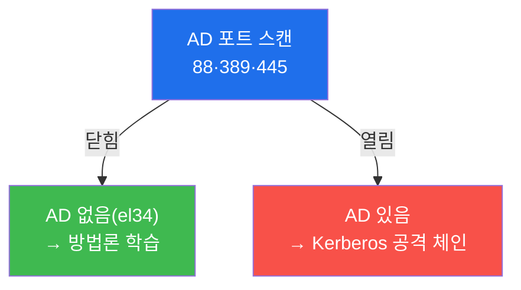
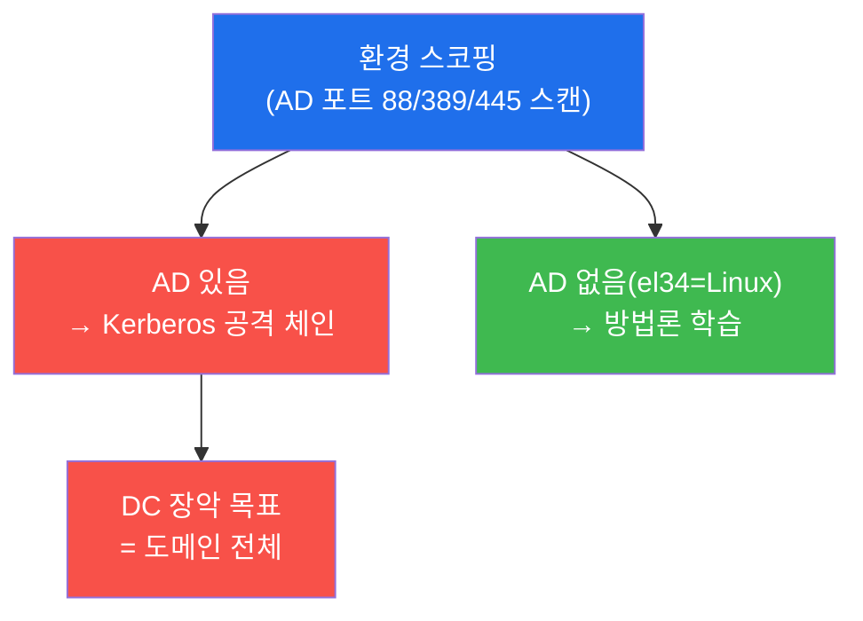
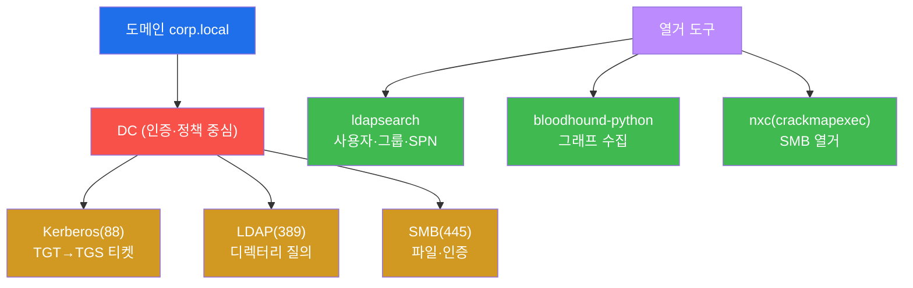
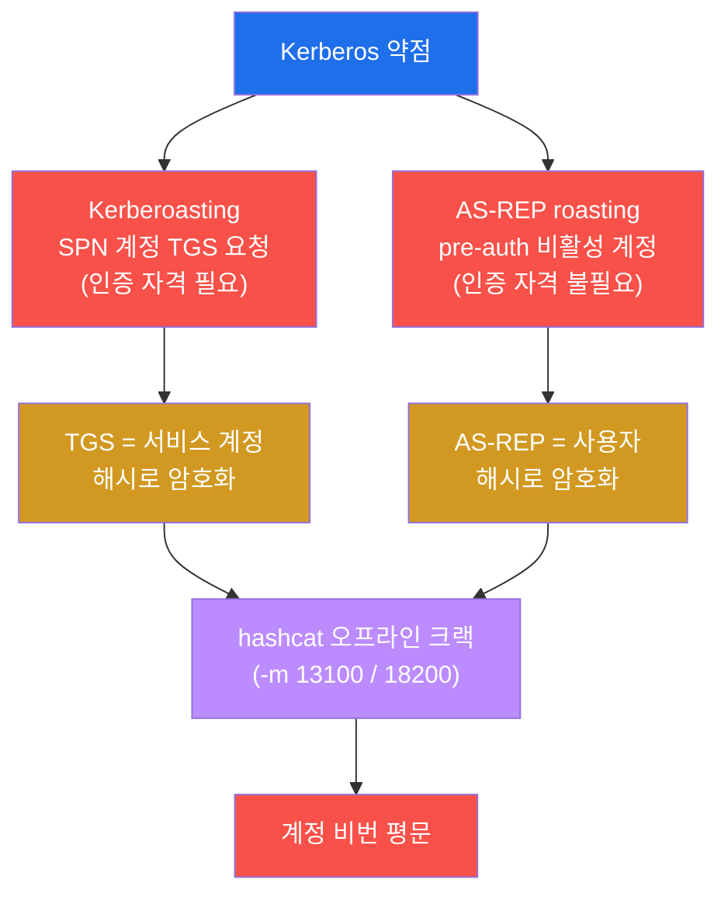
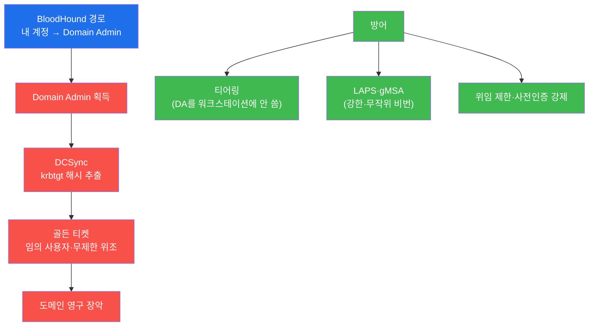

# 공격고급 W09 — Active Directory 공격: 기업 네트워크의 심장을 노린다 (개념·방법론)

> **본 주차의 한 줄 요약**
>
> 기업 네트워크의 90% 이상이 **Active Directory(AD)** 로 사용자·컴퓨터·정책을 중앙 관리한다 — 그래서 AD는
> 공격자의 최우선 표적이다. 도메인 컨트롤러(DC) 하나를 장악하면 도메인 전체가 넘어간다. 본 주차는 AD 공격의
> 핵심 체인 — **Kerberoasting·AS-REP roasting**(Kerberos 약점), **BloodHound**(공격 경로 자동 분석),
> **DCSync·골든 티켓**(도메인 영구 장악) — 을 다룬다.
>
> **⚠️ 중요 — 본 주차는 개념·방법론 주차다.** el34는 순수 Linux 환경으로 AD(도메인 컨트롤러)가 없다. 학생은
> el34에서 **AD 부재를 직접 스캔으로 확인**(정직한 스코핑)하고, 실제 AD를 만났을 때 쓸 **정확한 명령·도구·
> 공격 체인**을 학습한다. 이것이 실무 침투 테스터의 현실 — 환경을 정확히 스코핑하고, 도구를 갖춰 임하는 것이다.
>
> **레드팀 한 줄 결론**: AD 공격은 화려한 익스플로잇이 아니라 **설계의 약점**(약한 서비스 비번·과한 권한·잘못된
> 위임)을 BloodHound로 찾아 잇는 것이다. 그리고 방어의 핵심은 **티어링**(관리 권한 계층 분리) — DC를 만질 수
> 있는 계정이 워크스테이션에 내려오지 않게 하는 것이다.

---

## ⚠️ 윤리 고지

AD 공격은 조직 전체 장악으로 이어진다. **인가된 침투 테스트에서만** 수행한다. 본 주차는 el34에 AD가 없어
방법론 학습에 집중한다.

---

## 학습 목표

본 주차 종료 시 학생은 다음 5가지를 **본인 손으로** 할 수 있어야 한다.

1. **환경 스코핑**으로 AD 유무를 확인하고(정직한 정찰), AD 구조를 설명한다.
2. **AD 열거** 방법론(ldapsearch·BloodHound 수집)을 안다.
3. **Kerberoasting·AS-REP roasting**의 원리와 명령을 설명한다.
4. **BloodHound**로 공격 경로를 분석하는 개념을 안다.
5. **도메인 장악**(DCSync·골든 티켓)과 **AD 방어**(티어링·LAPS)를 설명한다.

---

## 0. 용어 해설

| 용어 | 영문 | 뜻 | 비유 |
|------|------|----|------|
| **Active Directory** | AD | 윈도우 중앙 디렉터리 서비스 | 회사 인사·출입 시스템 |
| **도메인** | domain | AD의 관리·신뢰 경계 | 회사 조직 |
| **DC** | Domain Controller | 인증·정책의 중심 서버 | 본사 인사부 |
| **Kerberos** | — | AD 티켓 기반 인증 프로토콜(88) | 출입증 발급 체계 |
| **TGT / TGS** | — | 티켓 부여 티켓 / 서비스 티켓 | 마스터 출입증 / 부서 출입증 |
| **SPN** | Service Principal Name | 서비스 계정 식별자 | 부서 명패 |
| **Kerberoasting** | — | SPN 계정 TGS 크랙 | 부서 출입증 위조 |
| **BloodHound** | — | AD 공격 경로 그래프 도구 | 조직도 침투 지도 |
| **DCSync** | — | DC 복제로 해시 추출 | 인사부 사칭 자료 복사 |
| **골든 티켓** | golden ticket | krbtgt로 임의 티켓 위조 | 마스터 출입증 위조 |
| **티어링** | tiering | 관리 권한 계층 분리 | 보안 등급 분리 |

> **헷갈리기 쉬운 한 쌍 — Kerberoasting vs AS-REP roasting.** 둘 다 "티켓을 받아 오프라인 크랙"하지만 대상이
> 다르다. **Kerberoasting**은 **SPN이 달린 서비스 계정**의 TGS를 요청한다 — 도메인 인증 자격이 **필요**하다.
> **AS-REP roasting**은 **사전인증(pre-auth)이 비활성된 계정**의 AS-REP을 요청한다 — 도메인 인증 자격이
> **불필요**하다(인증 전 단계). 그래서 AS-REP은 초기 진입에, Kerberoast는 발판 확보 후 권한 확장에 쓰인다.

---

## 0.5 핵심 개념

### 0.5.1 "없음 확인"도 정찰이다 — 정직한 스코핑

이 주차의 가장 중요한 교훈: **공격 대상이 없으면 그것을 확인하는 것 자체가 일이다.** el34는 순수 Linux라
AD(도메인 컨트롤러)가 없다. 그래서 STEP 1은 AD 포트(88 Kerberos·389 LDAP·445 SMB)를 실제 스캔해 **"AD 없음"
을 확정**한다.



실무 침투 테스터는 없는 것을 공격하려 헤매지 않는다 — 정확히 스코핑하고, 있는 것에 집중한다. 본 주차는 그
스코핑 습관과, 실제 AD를 만났을 때 쓸 **정확한 명령**을 함께 익힌다.

### 0.5.2 AD 핵심 4객체 — 한 눈에

| 객체 | 역할 | 공격 표면 |
|------|------|-----------|
| 도메인 | 관리·신뢰 경계 | 신뢰 관계 악용 |
| DC | 인증·정책 중심 | 장악=도메인 전체 |
| Kerberos(TGT/TGS) | 티켓 인증 | Kerberoast·AS-REP |
| SPN | 서비스 계정 명패 | Kerberoasting 대상 |

핵심: **DC 하나 = 도메인 전부.** 그래서 AD 공격은 "DC로 가는 최단 경로"를 찾는 게임이다(BloodHound).

### 0.5.3 Kerberos 공격 = "정상 티켓을 받아 오프라인 크랙"

두 공격의 공통 원리: Kerberos가 **정상적으로 내주는 티켓이 계정 해시로 암호화**돼 있다 → 받아서 hashcat으로
크랙. 도메인을 시끄럽게 안 두드려도(정상 요청) 비번을 깰 수 있어 은밀하다.

| 공격 | 도구 | hashcat 모드 | 인증 필요? |
|------|------|--------------|-----------|
| Kerberoasting | `impacket-GetUserSPNs -request` | **-m 13100** | 필요(발판 후) |
| AS-REP roasting | `impacket-GetNPUsers` | **-m 18200** | 불필요(초기 진입) |

서비스 계정은 비번이 약하고 오래되고 고권한인 경우가 많아 Kerberoast가 잘 통한다.

### 0.5.4 BloodHound — 사람이 못 보는 경로를 그래프로

AD는 객체·권한 관계가 수천 개라 사람 눈엔 안 보인다. **BloodHound**는 이를 그래프 DB로 만들어 "내 계정 →
Domain Admin **최단 경로**"를 자동 질의한다 — 복잡한 ACL 남용(GenericAll)·세션 탈취·그룹 중첩·위임 악용을
한 줄 쿼리로 찾아준다. AD 공격의 게임체인저다.

### 0.5.5 임의로 보이는 값들

| 값 | 무엇 | 규칙 |
|----|------|------|
| **88 / 389 / 445** | AD 포트 | Kerberos / LDAP / SMB |
| **hashcat -m 13100 / 18200** | 크랙 모드 | Kerberoast TGS / AS-REP |
| **krbtgt** | 도메인 마스터 키 계정 | DCSync→골든 티켓의 핵심 |
| **마커(`scoping_done` 등)** | 단계 완료 신호 | 채점이 통과를 확인하는 약속 문자열 |

---

## 1. AD의 중요성 · 환경 스코핑

### 1.1 한 줄 답: DC 하나가 전부다

AD는 중앙 집중이다 — 모든 사용자·컴퓨터·정책이 DC에 모인다. 편리하지만, 그래서 **DC를 장악하면 도메인 전체
(수천 대)가 한 번에 넘어간다.** 공격자에게 AD는 "한 점만 뚫으면 되는" 매력적 표적이다.



**실측 예 — 환경 스코핑(el34).**

```bash
nmap -p 88,389,445 10.20.30.0/24 2>/dev/null | grep -E "88|389|445|open" | head
# → AD 포트 닫힘 = el34엔 도메인 컨트롤러 없음 (정직한 스코핑)
```

### 1.2 왜 중요한가 — 현실 스코핑

실무 침투 테스터의 첫 일은 **환경 파악**이다. AD가 있는지, 어떤 OS인지에 따라 도구와 전략이 완전히 달라진다.
el34에서 AD 포트를 스캔해 "없음"을 확인하는 것은 시간 낭비가 아니라 **정확한 스코핑**이다(§0.5.1) — 없는 것을
공격하려 헤매지 않는다.

### 1.3 한계 — 본 주차는 개념

el34엔 AD가 없으므로 본 주차는 명령을 실제 DC에 쏘지 않는다. 대신 **정확한 도구·명령·체인**을 익혀, 실제
AD 환경(인턴십·실무·CTF)에서 바로 쓸 수 있게 한다.

---

## 2. AD 구조 · 열거



AD 공격은 **인증된 열거**에서 시작한다 — 한 계정(저권한이라도)을 얻으면 사용자·그룹·SPN·ACL·신뢰 관계를
대량 수집한다. `ldapsearch`로 디렉터리를, `nxc`(crackmapexec 후속)로 SMB를, `bloodhound-python`으로 공격
경로 그래프 데이터를 모은다. 이 수집물이 다음 단계(Kerberos 공격·경로 분석)의 원재료다.

---

## 3. Kerberos 공격 (Kerberoast · AS-REP)



두 공격의 공통 구조는 "Kerberos가 정상적으로 내주는 티켓이 **계정 해시로 암호화**되어 있다"는 점을 악용해
**오프라인 크랙**하는 것이다(§0.5.3). **Kerberoasting**은 `impacket-GetUserSPNs ... -request`로 SPN 계정의
TGS를 받아 `hashcat -m 13100`으로 크랙한다 — 서비스 계정은 종종 비번이 약하고 오래됐고 고권한이다. **AS-REP
roasting**은 `impacket-GetNPUsers`로 사전인증 비활성 계정의 AS-REP을 받아 `hashcat -m 18200`으로 크랙한다 —
인증 자격이 없어도 가능해 초기 진입에 쓰인다. 둘 다 **정상 트래픽처럼 보여** 탐지가 어렵다.

---

## 4. BloodHound · 도메인 장악 · 방어

**BloodHound** — AD의 모든 객체·권한 관계를 그래프 DB로 만들어 "내 계정 → Domain Admin 최단 경로"를 자동
질의한다(§0.5.4). 사람이 못 보는 복잡한 ACL 남용(GenericAll)·세션 탈취·그룹 중첩·위임 악용 경로를 찾아준다 —
AD 공격의 게임체인저다.



**도메인 장악** — Domain Admin을 얻으면 **DCSync**(DC 복제 권한 악용)로 `krbtgt` 해시를 추출하고, 그것으로
**골든 티켓**(임의 사용자·무제한 권한 티켓)을 위조해 도메인을 영구 장악한다(krbtgt 비번을 2회 변경하기 전까지).
**방어** — ① **티어링**(Tier 0=DC/DA를 Tier 2=워크스테이션과 분리, DA 자격이 일반 PC에 안 내려오게) ②
**LAPS/gMSA**(로컬·서비스 계정 비번을 강한 무작위로) ③ 위임 제한 ④ 사전인증 강제. 탐지는 비정상 대량 TGS
요청(Kerberoast)·DCSync 복제·골든 티켓 이상(soc-adv W03 SIGMA)이다.

---

## 5. 실습 안내 (8 미션)

각 미션을 **① 왜 하는가 / ② 무엇을 알 수 있는가 / ③ 결과 해석 / ④ 실전 활용** 4축으로 설명한다. 명령은
공격자 VM(`ssh att@192.168.0.202`)에서 실행한다. **el34엔 AD가 없어 개념·방법론 학습**(스코핑은 실제 스캔).
실제 AD 공격은 인가된 환경에서만.

### STEP 1 — 환경 스코핑 (AD 부재 확인)
- **왜**: 없는 것을 공격하려 헤매지 않게 — 정직한 스코핑(§0.5.1).
- **무엇을**: AD 포트(88/389/445) 스캔.
- **해석**: 닫힘=AD 없음 확정(`scoping_done`). 실무 침투의 첫 일.
- **실전**: 환경별로 도구·전략을 정하는 출발점.

### STEP 2 — AD 구조
- **왜**: 공격 전 표적 구조 이해.
- **무엇을**: 도메인/DC/Kerberos/SPN 4객체(§0.5.2).
- **해석**: 구조 파악(`ad_structure_done`). DC=도메인 전부.
- **실전**: 어디를(DC) 노릴지 명확화.

### STEP 3 — AD 열거
- **왜**: 인증된 열거가 공격의 원재료.
- **무엇을**: ldapsearch(389)·nxc·bloodhound-python 방법론.
- **해석**: 열거 도구 체인 이해(`ad_enum_done`).
- **실전**: 저권한 계정으로 대량 수집.

### STEP 4 — Kerberoasting
- **왜**: 서비스 계정의 약한 비번을 오프라인 크랙.
- **무엇을**: `GetUserSPNs -request` → `hashcat -m 13100`.
- **해석**: TGS 크랙 체인 이해(`kerberoast_done`). 발판 후 권한 확장.
- **실전**: SPN 계정이 고권한일 때 치명적.

### STEP 5 — AS-REP roasting
- **왜**: 인증 자격 없이도 가능 — 초기 진입.
- **무엇을**: `GetNPUsers` → `hashcat -m 18200`.
- **해석**: pre-auth 비활성 계정 크랙(`asrep_done`).
- **실전**: 도메인 진입 전 단계에 유용.

### STEP 6 — BloodHound
- **왜**: 사람이 못 보는 DA 최단 경로를 그래프로.
- **무엇을**: 객체·권한 그래프 → 경로 질의(§0.5.4).
- **해석**: 경로 분석 개념(`bloodhound_done`).
- **실전**: ACL 남용·위임 악용 경로 발견.

### STEP 7 — 도메인 장악·방어
- **왜**: DA→DCSync→골든 티켓의 영구 장악과 그 방어.
- **무엇을**: DCSync·골든 티켓 + 티어링/LAPS.
- **해석**: 장악 체인·방어 이해(`domain_defense_done`).
- **실전**: 티어링이 핵심 방어(DA 자격 격리).

### STEP 8 — AD 보고서
- **왜**: 스코핑·체인·방어를 종합.
- **무엇을**: 스코핑 결과를 인용한 보고서 골격.
- **해석**: 실측 인용(`ad_report_done`). 미보유 정직 기재.
- **실전**: 실 AD 환경의 공격 체인 + 티어링 권고.

---

## 6. 흔한 오해·블루팀 노트

- **"AD 없으니 배울 게 없다"** — 정확한 스코핑과 실 AD용 명령 체인을 익히는 게 본 주차다(§0.5.1).
- **"Kerberos는 안전한 프로토콜"** — 정상 티켓이 해시로 암호화돼 오프라인 크랙된다(§0.5.3). 강한 서비스 비번 필수.
- **"DA만 막으면 된다"** — DCSync·골든 티켓은 DA 이후를 노린다. 티어링으로 DA 자격이 일반 PC에 안 내려오게.
- **"BloodHound는 방어자 도구"** — 양측 다 쓴다. 방어자도 BloodHound로 위험 경로를 선제 차단한다.

---

## 7. 다음 주차 (W10) 예고 — 데이터 유출

W01~W09로 침투·상승·이동·장악을 했다. W10은 공격의 **목적** — 데이터 유출(exfiltration)을 다룬다. 무엇을
훔치고, 어떻게 탐지를 피해 빼내며(암호화·터널·저속), 방어자는 어떻게 막는가(DLP·아웃바운드 통제).
