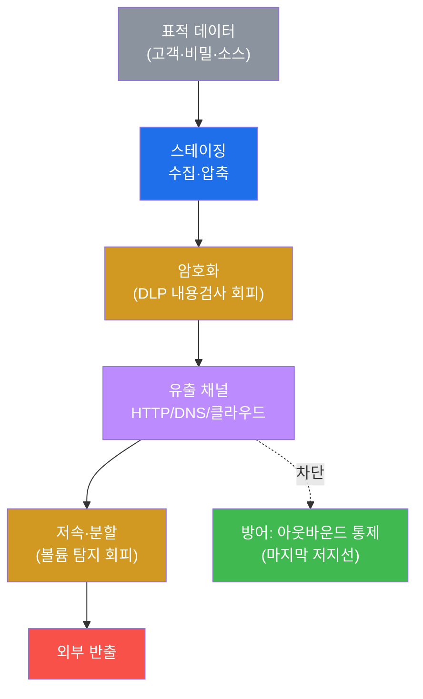
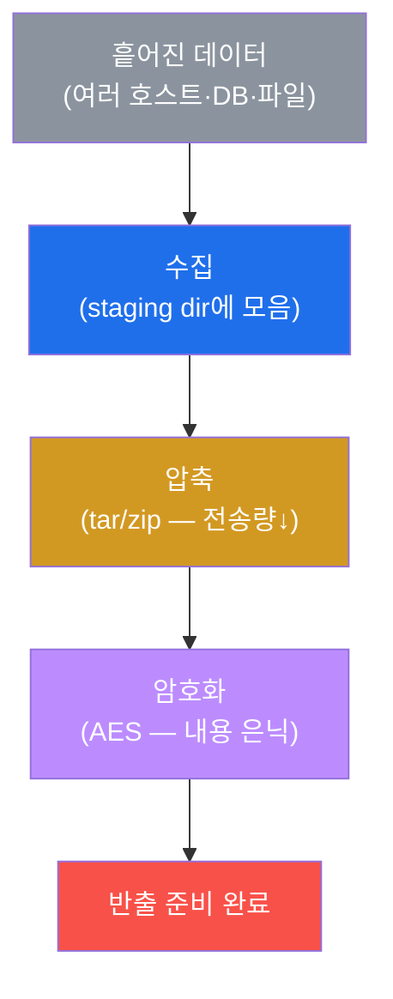
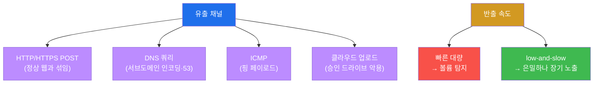
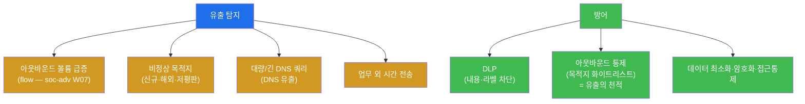

# 공격고급 W10 — 데이터 유출: 침투의 목적이자 방어의 마지막 기회

> **본 주차의 한 줄 요약**
>
> 정찰·침투·상승·이동·장악(W01~W09) — 이 모든 것은 **수단**이다. APT의 진짜 **목적**은 대개 데이터다:
> 고객 정보, 영업 비밀, 소스 코드, 자격증명. 본 주차는 그 마지막 단계 **데이터 유출(Exfiltration)** 을 다룬다.
> 데이터를 한곳에 모으고(**스테이징**), 내용 검사를 피하려 **암호화**하고, 허용된 채널(HTTP·DNS·클라우드)로
> 반출하며, 볼륨 탐지를 피하려 **저속·분할**한다. 학생은 el34에서 스테이징→압축→암호화→반출의 사슬을 직접
> 시연하고, 방어자의 **DLP·아웃바운드 통제**를 배운다.
>
> **레드팀 한 줄 결론**: 유출은 공격자에게 목적이지만, 방어자에겐 **마지막 기회**다 — 침투를 다 놓쳐도 유출만
> 막으면 피해는 0이다. 공격자는 내용을 암호화하고 채널을 위장할 수 있지만, **메타데이터(얼마나·어디로)는 못
> 숨긴다.** 그래서 유출의 천적은 **아웃바운드 통제**(나가는 목적지를 허용 목록으로)다.

---

## ⚠️ 윤리 고지

데이터 유출은 침해의 핵심 피해다. **인가된 실습(el34)에서만** 모의 데이터로 시연하며, 실습 데이터는
self-clean한다. 실제 데이터 무단 반출은 중범죄다.

---

## 학습 목표

본 주차 종료 시 학생은 다음 5가지를 **본인 손으로** 할 수 있어야 한다.

1. 데이터 **스테이징**(수집·압축)과 **암호화**를 수행한다.
2. **유출 채널**(HTTP·DNS·ICMP·클라우드)의 특성을 안다.
3. **저속·분할(low-and-slow)** 로 볼륨 탐지를 회피하는 원리를 안다.
4. **DLP 우회**(암호화·스테가노·허용 채널)의 한계를 설명한다.
5. 방어자의 **유출 탐지·아웃바운드 통제**를 설명한다.

---

## 0. 용어 해설

| 용어 | 영문 | 뜻 | 비유 |
|------|------|----|------|
| **데이터 유출** | exfiltration | 데이터를 외부로 반출 | 기밀 반출 |
| **스테이징** | staging | 반출 전 한곳에 모음 | 짐 싸기 |
| **DLP** | Data Loss Prevention | 데이터 유출 방지 시스템 | 출구 검색대 |
| **유출 채널** | channel | 데이터를 빼내는 통로 | 밀반출 경로 |
| **DNS 유출** | DNS exfil | DNS 쿼리에 데이터 인코딩 | 암호 전보 |
| **low-and-slow** | — | 저속·분할 반출 | 조금씩 오래 빼내기 |
| **스테가노그래피** | steganography | 정상 파일에 숨기기 | 그림 속 암호 |
| **아웃바운드 통제** | egress control | 나가는 연결 제한 | 출구 통제 |
| **CASB** | — | 클라우드 접근 보안 중개 | 클라우드 검문소 |
| **데이터 라벨링** | data labeling | 민감도 분류·태깅 | 기밀 도장 |

> **헷갈리기 쉬운 한 쌍 — 빠른 대량 유출 vs low-and-slow.** **빠른 대량**은 한 번에 다 빼낸다 — 빠르지만
> 볼륨 임계 탐지(갑자기 1GB가 나감)에 즉시 걸린다. **low-and-slow**는 작게 쪼개 오랜 시간 분산한다 — 일별
> 소량은 정상 트래픽에 묻혀 은밀하지만, 느리고 그동안 **장기 노출**(탐지 기회가 더 많아짐)된다. 선택은
> "빨리 빼고 들켜도 됨" vs "오래 걸려도 은밀" 사이의 트레이드오프다.

---

## 1. 유출이란 — 목적이자 마지막 기회

### 1.1 한 줄 답: 모든 공격은 여기로 수렴한다

침투·상승·이동은 데이터에 도달하기 위한 과정이다. 유출은 그 데이터를 실제로 빼내는 마지막 행위 — 공격이
"성공"으로 완성되는 지점이다. 동시에 방어자에겐 침해를 사고로 만들지 않을 **마지막 저지선**이다.

### 1.2 왜 중요한가 — 피해의 실체

침해의 실제 피해(규제 벌금·신뢰 상실·경쟁력 손실)는 대부분 **데이터 유출**에서 발생한다. 침투만 되고 유출이
막히면 "사고(incident)"지만, 유출되면 "유출 사고(breach)"가 되어 법적 통보 의무까지 생긴다.

### 1.3 한계 — 메타데이터는 못 숨긴다

공격자는 내용을 암호화하고 채널을 위장할 수 있지만, **통신의 메타데이터**(언제·얼마나·어디로)는 네트워크에
남는다. 그래서 아무리 정교한 유출도 아웃바운드 통제와 flow 분석(soc-adv W07)에 약하다(§4).

---

## 2. 스테이징 · 암호화

**스테이징** — 측면 이동으로 여러 호스트에서 모은 데이터를 한 작업 디렉터리에 모으고 **압축**한다. 압축은
전송량을 줄이고 한 번에 반출할 수 있게 한다. **암호화** — 압축물을 AES로 암호화하면 DLP의 **내용 검사**
(주민번호 패턴·기밀 키워드 정규식)가 무력해진다. 실습에서 모의 데이터를 `tar czf`로 압축하고 `openssl enc
-aes-256-cbc`로 암호화한다. **단, 역설** — 암호화는 내용을 숨기지만 "암호화된 대량 데이터가 나간다"는 사실
자체가 이상 신호가 될 수 있다.

---

## 3. 유출 채널 · 저속 분할

**채널** — 방화벽이 허용하는 통로를 악용한다. HTTP POST는 정상 웹과 섞이고, **DNS 유출**은 데이터를 서브
도메인에 인코딩해 53 포트로 내보내며(거의 항상 열림), 승인된 **클라우드 드라이브**는 의심을 덜 받는다. 실습
에서 로컬 TCP 리스너로 반출 메커니즘을 시연한다. **저속·분할** — 대량을 한 번에 빼면 볼륨 임계에 걸리므로,
작게 쪼개(chunk) 시간에 분산한다(업무시간에만·랜덤 간격). DNS 유출은 본질적으로 쿼리당 소량이라 저속이다.

---

## 4. DLP 우회 · 탐지 · 방어

**DLP 우회.** DLP는 내용·라벨 기반으로 유출을 막는다. 공격자는 **암호화**(내용 검사 무력)·**스테가노그래피**
(이미지 등 정상 파일에 숨김)·**허용 채널**(승인 클라우드·이메일)로 우회한다. 그러나 어느 우회도 메타데이터
(볼륨·목적지·시점)는 못 숨긴다.

**탐지** — 유출은 아웃바운드의 이상으로 드러난다: 볼륨 급증, 신규·저평판 목적지, 대량/긴 DNS 쿼리, 업무 외
시간 전송. **방어** — DLP(내용·라벨 기반 차단)와 함께, **아웃바운드 통제**(나가는 목적지를 허용 목록으로
제한)가 가장 강력하다 — 데이터가 나갈 곳이 없으면 유출도 없다. 그 위에 데이터 최소화·암호화·접근통제·대량
다운로드 알림을 더한다. 유출은 침투의 마지막 단계이자 방어의 마지막 기회 — **못 막으면 사고, 막으면 피해 0**.

---

## 5. 실습 안내 (8 미션)

1. **유출 시나리오**. 2. **스테이징**. 3. **암호화**. 4. **유출 채널**. 5. **저속 분할**. 6. **DLP 우회·정리**.
7. **탐지·방어**. 8. **보고서**.

> 명령은 el34 호스트에서 `docker exec el34-attacker`로. **인가된 실습 환경(el34)에서만**, 모의 데이터·로컬
> 리스너·self-clean.

---

## 6. 다음 주차 (W11) 예고 — 안티포렌식

W10으로 데이터를 빼냈다. W11은 흔적을 지우는 **안티포렌식** — 로그 삭제·타임스탬프 조작·파일리스·은닉으로
포렌식(soc-adv W07/W08)을 방해하는 법과, 그래도 남는 흔적을 다룬다.
