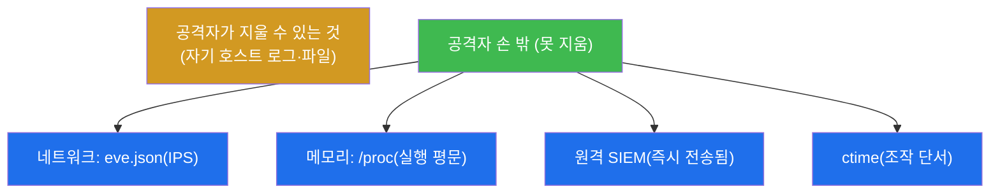
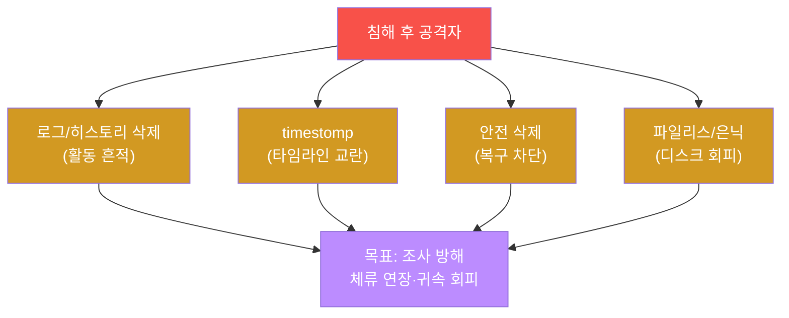
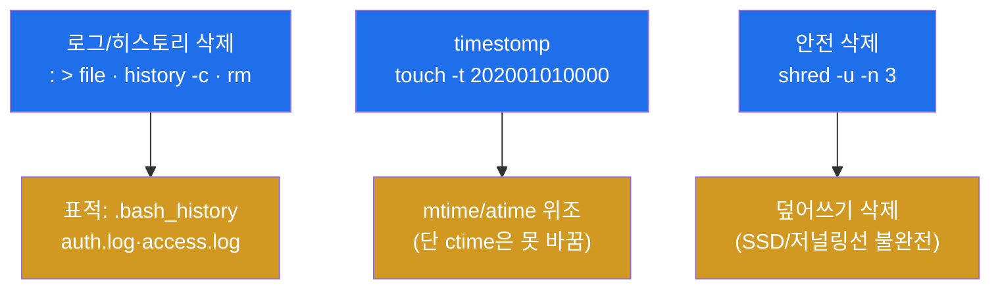
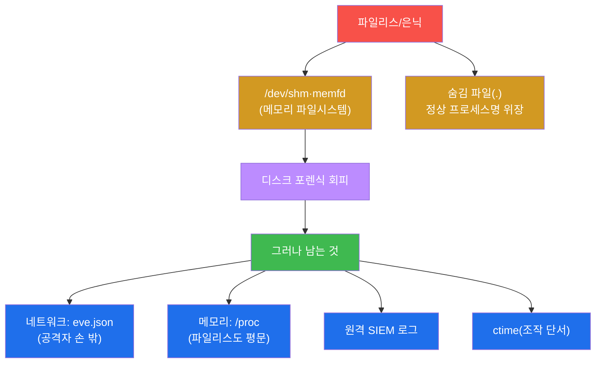
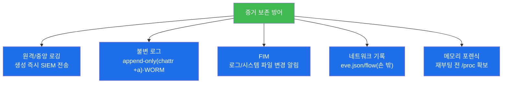

# 공격고급 W11 — 안티포렌식: 흔적을 지우려는 자와 그래도 남는 것

> **본 주차의 한 줄 요약**
>
> 침투에 성공한 공격자의 마지막 일은 **흔적 지우기**다 — 셸 히스토리를 비우고, 로그를 삭제하고, 파일
> 타임스탬프를 위조하고, 페이로드를 안전 삭제하거나 메모리에만 둔다. 이것이 **안티포렌식(anti-forensics)** —
> soc-adv W07/W08에서 배운 포렌식을 정면에서 방해하는 기술이다. **그러나 본 주차의 핵심 교훈은 "완벽한
> 안티포렌식은 없다"** 는 것이다. 호스트의 흔적은 지워도, **네트워크 기록(eve.json)·메모리(/proc)·원격
> 로그·ctime**은 공격자의 손이 닿지 않는 곳에 남는다. 학생은 el34에서 흔적 삭제 기법을 직접 시연하고, 동시에
> 그것이 왜 실패하는지를 배운다.
>
> **레드팀 한 줄 결론**: 안티포렌식은 포렌식을 **지연·방해**할 뿐 **무력화하지 못한다**. 그래서 방어의 정답은
> 단순하다 — **증거를 공격자가 못 닿는 곳(원격 SIEM·불변 로그·네트워크 센서)에 즉시 복제**하는 것이다.
> 지울 수 없는 곳에 증거가 있으면, 아무리 지워도 소용없다.

---

## ⚠️ 윤리 고지

안티포렌식은 침해 은폐 기술이다. 학습 목적은 방어자가 "무엇이 지워질 수 있는지" 알아 보존책을 마련하는
것이다. **인가된 실습(el34)에서만**, 임시 파일로 시연하고 self-clean한다.

---

## 학습 목표

본 주차 종료 시 학생은 다음 5가지를 **본인 손으로** 할 수 있어야 한다.

1. **로그·히스토리 삭제**와 **타임스탬프 조작(timestomp)** 을 수행한다.
2. **안전 삭제(shred)** 와 rm의 차이(복구 가능성)를 안다.
3. **파일리스·은닉**(/dev/shm·숨김 파일)의 원리를 안다.
4. **안티포렌식의 한계**(네트워크·메모리·원격 로그·ctime)를 설명한다.
5. **증거 보존 방어**(원격/불변 로깅·FIM)를 설명한다.

---

## 0. 용어 해설

| 용어 | 영문 | 뜻 | 비유 |
|------|------|----|------|
| **안티포렌식** | anti-forensics | 포렌식을 방해하는 기술 | 증거 인멸 |
| **timestomp** | — | 파일 시각 위조 | 시계 되돌리기 |
| **mtime/atime/ctime** | — | 수정/접근/inode변경 시각 | 세 종류 기록 시각 |
| **안전 삭제** | secure deletion | 덮어써서 복구 차단 | 분쇄 폐기 |
| **shred** | — | 덮어쓰기 삭제 도구 | 문서 분쇄기 |
| **파일리스** | fileless | 디스크 미경유 실행 | 흔적 없는 침입 |
| **/dev/shm** | — | 메모리 파일시스템 | 휘발성 사물함 |
| **memfd** | — | 메모리 전용 파일 디스크립터 | 익명 메모리 파일 |
| **FIM** | File Integrity Monitoring | 파일 무결성 감시 | 변경 감지 센서 |
| **불변 로그** | immutable log | 수정 불가 로그(append-only) | 잉크 장부 |
| **chattr +a** | — | append-only 속성 부여 | 덧쓰기만 허용 |

> **헷갈리기 쉬운 한 쌍 — rm vs shred.** **rm**은 파일의 **디렉터리 항목(메타데이터)만** 지운다 — 실제 데이터
> 블록은 디스크에 남아 **복구 가능**하다(포렌식 도구로 되살림). **shred**는 파일 내용을 **여러 번 덮어쓴 뒤**
> 삭제해 복구를 막는다. 그러나 SSD·저널링 파일시스템·카피온라이트(Btrfs)에선 덮어쓰기가 원본 블록에 안 닿을
> 수 있어 **shred도 불완전**하다. "삭제했다"와 "복구 불가"는 다르다.

---

## 0.5 신입생 친화 핵심 개념

### 0.5.1 안티포렌식 4종 — 무엇을 어떻게 지우나

| 기법 | 명령 | 표적 | 한계 |
|------|------|------|------|
| 로그/히스토리 삭제 | `: > file`·`history -c` | .bash_history·auth.log | 원격 SIEM엔 남음 |
| timestomp | `touch -t` | mtime/atime | ctime 못 바꿈 |
| 안전 삭제 | `shred -u` | 파일 내용 | SSD/저널링 불완전 |
| 파일리스/은닉 | `/dev/shm`·memfd | 디스크 흔적 | 메모리·네트워크 남음 |

넷 다 "호스트의 흔적"을 노리지만, 각각 **공격자가 못 지우는 부분**이 있다(§0.5.4).

### 0.5.2 timestomp의 배신 — ctime은 못 바꾼다

리눅스 파일엔 세 시각이 있다.

| 시각 | 의미 | touch로 위조? |
|------|------|---------------|
| mtime | 내용 수정 시각 | **가능**(`touch -t`) |
| atime | 접근 시각 | **가능** |
| **ctime** | inode 변경 시각 | **불가**(touch가 ctime을 오히려 갱신) |

공격자가 `touch -t 202001010000` 으로 파일을 "2020년 오래된 파일"처럼 위장해도, **ctime은 위조 시점으로
갱신**된다. 그래서 "mtime은 2020인데 ctime은 어제"인 파일은 **timestomp의 명백한 단서**다. 시각을 속이려다
오히려 조작을 들킨다.

### 0.5.3 파일리스 — 디스크는 피해도 메모리는 못 피한다

`/dev/shm`(메모리 파일시스템)·`memfd_create` 로 페이로드를 디스크에 안 쓰고 메모리에만 두면 디스크 포렌식을
회피한다. **하지만** 코드가 실행되려면 메모리에 평문으로 펼쳐져야 한다 — soc-adv W08의 `/proc` 메모리 포렌식에
그대로 잡힌다. 디스크를 피한 대가로 메모리에 노출된다.

### 0.5.4 못 지우는 4가지 — 완벽한 안티포렌식은 없다

공격자는 **자기가 제어하는 호스트의 흔적만** 지운다. 네트워크 센서(eve.json)·실행 중 메모리(/proc)·이미
전송된 원격 로그·조작 불가 ctime은 손 밖이다. 그래서 방어는 "증거를 공격자 손 밖에 두기"로 귀결된다(§4).

### 0.5.5 임의로 보이는 값들

| 값 | 무엇 | 규칙 |
|----|------|------|
| **touch -t 202001010000** | timestomp | [[CC]YYMMDDhhmm] 형식 |
| **chattr +a** | append-only | 덧쓰기만, 삭제·변조 차단 |
| **/dev/shm** | tmpfs | 메모리 기반 임시 FS |
| **마커(`limits_done` 등)** | 단계 완료 신호 | 채점이 통과를 확인하는 약속 문자열 |

---

## 1. 안티포렌식이란 — 포렌식과의 대결

### 1.1 한 줄 답: 조사를 어렵게 만드는 모든 것

안티포렌식은 침해 후 조사관(soc-adv W07/W08의 포렌식)이 무슨 일이 있었는지 재구성하지 못하게 방해하는
기술의 총칭이다 — 증거 삭제, 시각 위조, 디스크 미경유 실행, 은닉. 목표는 **체류 시간 연장**과 **귀속 회피**다.

### 1.2 왜 배우는가 — 보존책을 알기 위해

방어자가 "무엇이 지워질 수 있는지"를 알아야 그것을 **미리 안전한 곳에 보존**한다. 안티포렌식을 이해하는 것은
곧 증거 보존 전략(원격 로깅·불변 로그)을 설계하는 것이다.

### 1.3 한계 — 지울 수 없는 곳이 있다

공격자는 자신이 제어하는 호스트의 흔적만 지울 수 있다. 그러나 **네트워크 센서·원격 SIEM·메모리**는 공격자의
통제 밖이다(§0.5.4). 그래서 안티포렌식은 본질적으로 불완전하다(§3).

---

## 2. 로그 삭제 · timestomp · 안전 삭제

**로그 삭제** — 가장 흔한 안티포렌식. `: > file`(절단)·`history -c`·`unset HISTFILE`·`rm`으로 셸 히스토리와
로그(auth.log·access.log)를 없앤다. **timestomp** — `touch -t`로 파일의 mtime/atime을 과거로 위조해 "오래된
정상 파일"처럼 위장, 포렌식 타임라인을 교란한다. **그러나 ctime**(inode 변경 시각)은 touch로 바꿀 수 없어
조작의 단서가 된다(§0.5.2). **안전 삭제** — `shred`로 덮어써 rm으로는 복구되는 데이터를 지운다. 단 SSD·저널링
파일시스템에선 불완전하다. 실습에서 셋을 모두 임시 파일로 시연하고, 각각의 한계(ctime·SSD)를 확인한다.

---

## 3. 파일리스 · 은닉 · 그리고 한계

**파일리스·은닉** — `/dev/shm`(메모리 파일시스템)·`memfd_create`로 페이로드를 **디스크에 안 쓰고** 메모리에만
둬 디스크 포렌식을 회피한다(§0.5.3). 숨김 파일(`.`)·정상 프로세스명 위장도 쓴다. **그러나 한계가 명확하다** —
① **네트워크**: 스캔·C2·유출 흔적은 IPS eve.json에 남고, 이는 공격자 손 밖이다(soc-adv W07). ② **메모리**:
파일리스라도 실행하려면 메모리에 평문으로 펼쳐지므로 /proc 메모리 포렌식에 잡힌다(soc-adv W08). ③ **원격
로그**: 생성 즉시 SIEM으로 전송된 로그는 호스트에서 지워도 SIEM에 남는다. ④ **ctime**: timestomp로 못 바꾸는
시각이 조작을 폭로한다. **완벽한 안티포렌식은 없다.** 실습 STEP 6은 호스트 로그를 지워도 IPS eve.json에 출처
(10.20.30.202) 흔적이 남음을 실측한다.

---

## 4. 방어 — 공격자 손 밖에 보존

안티포렌식의 천적은 "지울 수 없는 곳에 증거를 두는 것"이다.

**원격/중앙 로깅** — 로그를 생성 즉시 SIEM(Wazuh)으로 보내면, 호스트에서 지워도 SIEM에 남는다. **불변 로그**
— `chattr +a`(append-only)·WORM 스토리지로 삭제·변조를 차단한다(실습 STEP 7이 chattr +a를 직접 시도). **FIM**
(파일 무결성 모니터링 — Wazuh syscheck)은 로그·시스템 파일이 변경되는 순간 알린다(역설적으로 "로그 삭제 시도"
자체가 알림이 된다). **네트워크·메모리** 증거는 애초에 공격자 손 밖이다. 핵심 원칙은 하나 — **증거를 공격자가
못 닿는 곳에 즉시 복제**하면, 안티포렌식은 무력해진다.

---

## 5. 실습 안내 (8 미션)

각 미션을 **① 왜 하는가 / ② 무엇을 알 수 있는가 / ③ 결과 해석 / ④ 실전 활용** 4축으로 설명한다. 명령은
el34 호스트에서 `docker exec el34-attacker`(한계·보고는 el34-ips eve.json)로. **인가된 실습 환경(el34)에서만**,
임시 파일 시연·self-clean. 실제 로그·시스템 파일은 건드리지 않는다.

### STEP 1 — 시나리오
- **왜**: 침해 후 흔적 지우기 맥락 설정.
- **무엇을**: 안티포렌식 도구·임시 작업 디렉터리.
- **해석**: 준비 확인(`af_ready`).
- **실전**: 침해 종료 시 은폐 단계.

### STEP 2 — 로그/히스토리 삭제
- **왜**: 가장 흔한 안티포렌식.
- **무엇을**: `: > file`·`history -c` 시연(임시 파일).
- **해석**: 삭제 시연(`logclear_done`). 단 원격 SIEM엔 남음.
- **실전**: 셸 히스토리·로컬 로그 절단.

### STEP 3 — timestomp
- **왜**: 타임라인 교란.
- **무엇을**: `touch -t` 로 mtime/atime 위조.
- **해석**: 위조 시연(`timestomp_done`). **ctime은 못 바꿔 단서**(§0.5.2).
- **실전**: "오래된 파일" 위장 — 단 ctime이 폭로.

### STEP 4 — 안전 삭제(shred)
- **왜**: rm으로는 복구되는 데이터 차단.
- **무엇을**: `shred -u` 시연.
- **해석**: 덮어쓰기 삭제(`shred_done`). SSD/저널링선 불완전.
- **실전**: 삭제 ≠ 복구 불가(매체 의존).

### STEP 5 — 파일리스/은닉
- **왜**: 디스크 포렌식 회피.
- **무엇을**: `/dev/shm`·숨김 파일 시연.
- **해석**: 디스크 미경유(`fileless_done`). 메모리·네트워크엔 남음(§0.5.3).
- **실전**: 메모리에만 두되 /proc엔 평문.

### STEP 6 — 한계 (네트워크 残存)
- **왜**: "완벽한 안티포렌식은 없다"를 실측.
- **무엇을**: 호스트 로그 삭제 후 IPS eve.json의 출처 흔적.
- **해석**: 네트워크에 흔적 残存(`limits_done`, §0.5.4). 공격자 손 밖.
- **실전**: 네트워크·메모리·원격·ctime은 못 지움.

### STEP 7 — 방어
- **왜**: 증거를 공격자 손 밖에 보존.
- **무엇을**: `chattr +a`(append-only) 시도 + 원격 로깅/FIM.
- **해석**: 불변 로그 시연(`defense_done`). 삭제·변조 차단.
- **실전**: 원격 SIEM + WORM + FIM 조합.

### STEP 8 — 안티포렌식 보고서
- **왜**: 지운 것·남는 것·보존책을 종합.
- **무엇을**: 네트워크 残存 흔적을 인용한 보고서 골격.
- **해석**: 실측 인용(`antiforensics_report_done`).
- **실전**: "무엇이 지워질 수 있나" + 보존 권고.

---

## 6. 흔한 오해·관제자 노트

- **"로그 지우면 안 들킨다"** — 원격 SIEM·네트워크·메모리엔 남는다(§0.5.4). 호스트 흔적만 지워진다.
- **"timestomp로 완벽 위장"** — ctime은 못 바꾼다. mtime≠ctime이 조작 단서(§0.5.2).
- **"shred면 복구 불가"** — SSD·저널링·CoW에선 불완전. 매체에 따라 다름.
- **"파일리스는 무흔적"** — 디스크는 피해도 메모리(/proc)·네트워크엔 남는다(§0.5.3).

---

## 7. 다음 주차 (W12) 예고 — 공급망 공격

W11까지 한 조직 내부의 공격을 다뤘다. W12는 더 넓은 표적 — **공급망 공격**: 신뢰받는 소프트웨어·의존성·
빌드 파이프라인을 오염시켜 다수 피해자에 한 번에 침투하는 법과 방어(SBOM·서명 검증)를 다룬다.
