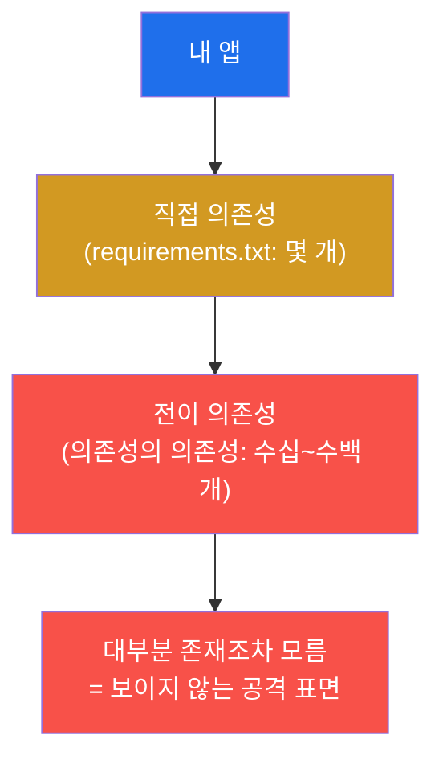
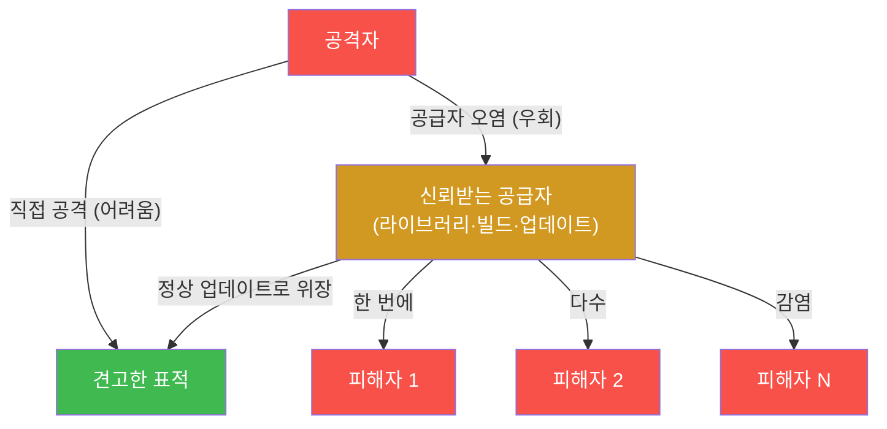
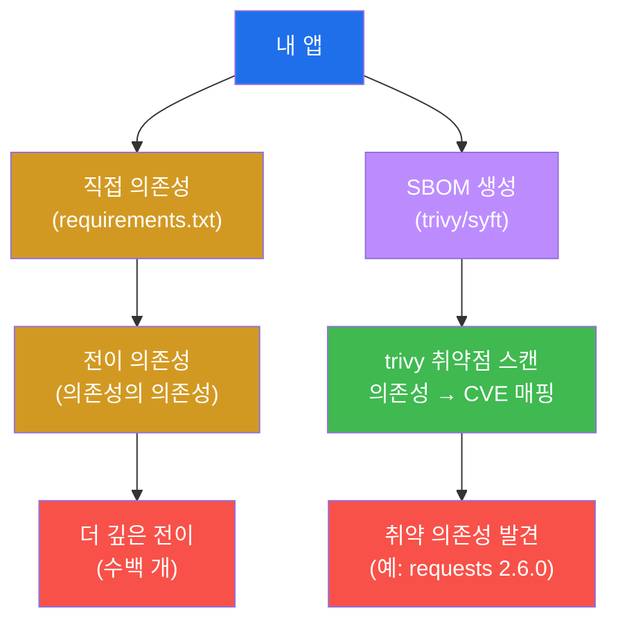
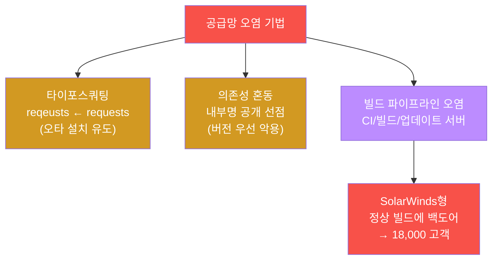
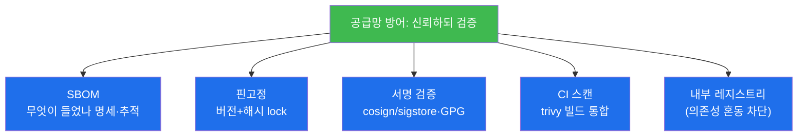

# 공격고급 W12 — 공급망 공격: 신뢰의 연쇄를 무기로 삼는다

> **본 주차의 한 줄 요약**
>
> W01~W11은 한 표적을 직접 공격했다. 그러나 표적이 너무 견고하다면? **공급망 공격(Supply Chain Attack)** 은
> 표적을 우회한다 — 표적이 **신뢰하는** 소프트웨어 라이브러리, 빌드 파이프라인, 업데이트 서버를 오염시켜,
> 표적이 스스로 악성 코드를 끌어오게 한다. SolarWinds 한 번의 빌드 오염이 18,000 고객을 감염시켰듯, 공급망
> 공격은 **한 번의 침투로 다수 피해자**에 도달하는 최대 파괴력을 가진다. 학생은 el34에서 의존성 표면을
> 측정하고, trivy로 취약 의존성을 **실제 스캔**하며, 타이포스쿼팅을 시연하고, 방어(SBOM·서명 검증)를 배운다.
>
> **레드팀 한 줄 결론**: 공급망 공격의 본질은 "신뢰의 악용"이다 — 우리는 우리가 쓰는 수백 개 의존성을
> 일일이 검증하지 않고 **신뢰**한다. 그래서 방어의 정답은 **신뢰하되 검증(trust but verify)** — SBOM으로
> 무엇이 들었는지 알고, 서명으로 진짜인지 확인하고, 핀고정으로 몰래 바뀌지 못하게 하는 것이다.

---

## ⚠️ 윤리 고지

공급망 공격은 광범위한 피해를 낳는다. **개념·방어 학습이 목적**이며, 실제 패키지 오염·레지스트리 선점은
범죄다. 본 실습은 el34에서 분석·방어 도구(trivy)와 개념 시연에 한정한다.

---

## 학습 목표

본 주차 종료 시 학생은 다음 5가지를 **본인 손으로** 할 수 있어야 한다.

1. **공급망 공격**이 직접 공격과 다른 점(신뢰 악용·다수 피해)을 설명한다.
2. **의존성 표면**(전이 의존성)을 측정하고 **trivy로 취약 의존성**을 스캔한다.
3. **타이포스쿼팅·의존성 혼동**의 원리를 안다.
4. **빌드 파이프라인 오염**(SolarWinds형)을 이해한다.
5. **서명 검증·SBOM·핀고정** 방어를 설명한다.

---

## 0. 용어 해설

| 용어 | 영문 | 뜻 | 비유 |
|------|------|----|------|
| **공급망 공격** | supply chain attack | 신뢰받는 공급자 오염 | 정수장 오염 |
| **의존성** | dependency | 앱이 끌어쓰는 외부 코드 | 부품 |
| **전이 의존성** | transitive dependency | 의존성의 의존성 | 부품의 부품 |
| **SBOM** | Software Bill of Materials | 소프트웨어 자재 명세 | 성분표 |
| **타이포스쿼팅** | typosquatting | 유사 이름 악성 패키지 | 짝퉁 상표 |
| **의존성 혼동** | dependency confusion | 내부명 공개 선점 | 사칭 납품 |
| **핀고정** | pinning | 버전·해시 고정 | 봉인 |
| **trivy** | — | 취약점·SBOM 스캐너(호스트 0.71.2) | 성분 검사기 |
| **cosign** | — | 컨테이너·아티팩트 서명 | 정품 인증 |
| **CVE** | — | 공개 취약점 식별번호 | 알려진 결함 ID |

> **헷갈리기 쉬운 한 쌍 — 타이포스쿼팅 vs 의존성 혼동.** **타이포스쿼팅**은 유명 패키지의 **오타 이름**
> (`reqeusts` ← `requests`)으로 악성 패키지를 올려, 개발자의 오타 설치를 노린다. **의존성 혼동**은 조직의
> **내부 전용 패키지명**을 공개 레지스트리에 **더 높은 버전**으로 선점해, 빌드 도구가 "더 최신"인 공개(악성)
> 버전을 내부 대신 끌어오게 만든다. 전자는 사람의 실수를, 후자는 도구의 버전 우선 로직을 악용한다.

---

## 0.5 신입생 친화 핵심 개념

### 0.5.1 직접 공격 vs 공급망 — 파괴력의 차이

| | 직접 공격(W01~W11) | 공급망 공격(W12) |
|---|---------------------|-------------------|
| 표적 | 한 조직 | 공급자를 쓰는 **모든** 조직 |
| 노력 | 표적마다 다시 | 한 번(공급자 오염) |
| 예 | 이 회사 SQLi | SolarWinds(18,000)·XZ Utils |

공급망 공격은 "한 번 뚫어 다수 감염" — 투자 대비 파괴력이 압도적이다. 표적이 견고할수록 공급자 우회가 매력적.

### 0.5.2 의존성 빙산 — 보이는 건 일부



`requirements.txt` 에 적은 직접 의존성 뒤로 **수백 개의 전이 의존성**이 딸려 온다 — 개발자가 이름조차 모르는
코드다. SBOM(자재 명세)은 이 빙산 전체를 목록화해 "무엇이 들었는지"를 드러낸다.

### 0.5.3 trivy fs 워크드예제 — 의존성 → CVE

el34의 **호스트(.151)에 설치된 trivy 0.71.2**(컨테이너엔 없음)로 오래된 의존성을 스캔하면 실제 CVE가 나온다:

```bash
# requirements.txt: requests==2.6.0, flask==0.5 (의도적 구버전)
trivy fs --scanners vuln /path/to/proj 2>/dev/null | grep -E "Total|HIGH"
# → Total: 9 (HIGH: 4 ...) 처럼 실제 알려진 CVE 다수 탐지
```

같은 `trivy` 를 **공격자는 진입점 찾기**에, **방어자는 패치 대상 찾기**에 쓴다 — 같은 도구, 반대 목적.
(trivy image는 느려 PipeTimeout이 나므로 실습은 `trivy fs` 로 소형 디렉터리를 스캔한다.)

### 0.5.4 빌드 파이프라인 오염이 가장 파괴적인 이유

타이포스쿼팅·의존성 혼동은 "개발자가 잘못 설치"를 노리지만, **빌드 파이프라인 오염**은 한 단계 위다 — CI/CD
러너·빌드 스크립트·코드 서명 키를 오염시켜 **정상 빌드 산출물에 백도어**를 심는다. 피해자는 **서명된 정상
업데이트**로 믿고 설치한다(SolarWinds·Codecov·XZ Utils). 한 빌드 오염이 그 빌드를 받는 **모든** 고객을
감염시킨다 — 서명조차 공격자 손에 들어가면 검증도 무력하다.

### 0.5.5 임의로 보이는 값들

| 값 | 무엇 | 규칙 |
|----|------|------|
| **requests==2.6.0 / flask==0.5** | 구버전 의존성 | 의도적으로 취약(CVE 보유) |
| **reqeusts** | 타이포스쿼팅 예 | requests의 오타(difflib 유사도 0.9+) |
| **trivy(호스트 .151)** | 스캐너 | el34-attacker엔 없음, 호스트 0.71.2 |
| **마커(`vulnscan_done` 등)** | 단계 완료 신호 | 채점이 통과를 확인하는 약속 문자열 |

---

## 1. 공급망 공격이란 — 신뢰의 악용

### 1.1 한 줄 답: 표적이 스스로 악성 코드를 끌어오게 한다

표적이 직접 공격에 견고해도, 표적은 수백 개의 외부 의존성과 업데이트를 **신뢰**한다. 공급망 공격은 그
신뢰받는 공급자를 오염시켜, 표적이 정상 업데이트인 줄 알고 악성 코드를 스스로 설치하게 만든다.



### 1.2 왜 중요한가 — 최대 파괴력

직접 공격은 표적 하나를 얻는다. 공급망 공격은 **공급자를 쓰는 모든 피해자**를 한 번에 얻는다 — SolarWinds는
18,000 조직, XZ Utils 백도어는 거의 모든 리눅스를 노렸다. 투자 대비 파괴력이 압도적이다(§0.5.1).

### 1.3 한계 — 검증 앞에서 막힌다

공급망 공격은 "검증 없는 신뢰"를 전제로 한다. 의존성을 SBOM으로 추적하고 서명으로 검증하고 핀으로 고정하면,
오염된 공급물이 검증 단계에서 걸린다(§4). 방어가 명확하다 — 검증을 추가하면 된다.

---

## 2. 의존성 표면 · SBOM · 취약 의존성



현대 앱은 직접 의존성 몇 개 뒤에 **수백 개의 전이 의존성**을 끌어온다(§0.5.2) — 대부분 개발자가 존재조차
모르는 코드다. 이것이 보이지 않는 공격 표면이다. **SBOM**(소프트웨어 자재 명세)은 "무엇이 들었는지"를
목록화하고, **trivy**가 그 목록을 CVE 데이터베이스와 대조해 취약 의존성을 찾는다. 실습에서 `trivy fs`로
오래된 의존성(`requests==2.6.0`·`flask==0.5`)을 스캔하면 **실제로 여러 개의 알려진 CVE**(Total 9, HIGH 4)가
탐지된다(§0.5.3) — 공격자는 이걸로 진입점을, 방어자는 패치 대상을 찾는다(같은 도구, 반대 목적).

---

## 3. 오염 기법 · 빌드 파이프라인



**타이포스쿼팅** — 유명 패키지의 오타 이름으로 악성 패키지를 올린다(실습에서 difflib로 `reqeusts`의 유사도가
0.9+임을 확인 — `requests` 와 거의 같아 오타로 설치되기 쉽다). **의존성 혼동** — 내부 전용 패키지명을 공개
레지스트리에 더 높은 버전으로 선점해 빌드가 공개(악성) 버전을 끌어오게 한다. **빌드 파이프라인 오염** — 가장
파괴적이다(§0.5.4). CI/CD 러너·빌드 스크립트·코드 서명 키·업데이트 서버를 오염시켜 **정상 빌드 산출물에
백도어**를 심는다. 피해자는 서명된 정상 업데이트로 믿고 설치한다(SolarWinds·Codecov·XZ Utils).

---

## 4. 방어 — 신뢰하되 검증



| 방어 | 막는 공격 |
|------|-----------|
| **SBOM** | 취약 의존성(무엇이 들었는지 알아야 추적) |
| **핀고정**(버전+해시) | 몰래 바뀐 의존성·의존성 혼동 |
| **서명 검증**(cosign/GPG) | 위조·변조된 패키지·업데이트 |
| **CI trivy 스캔** | 취약 의존성 빌드 진입 |
| **내부 레지스트리** | 의존성 혼동(공개 선점) |

핵심 원칙은 **신뢰하되 검증(trust but verify)** 이다 — 의존성을 쓰되, SBOM으로 알고, 서명으로 확인하고, 핀으로
고정하고, CI에서 스캔한다(실습의 trivy가 바로 이 역할). 공급망은 **가장 약한 고리만큼만** 안전하므로, 검증
없는 신뢰 한 곳이 SolarWinds를 낳는다.

---

## 5. 실습 안내 (8 미션)

각 미션을 **① 왜 하는가 / ② 무엇을 알 수 있는가 / ③ 결과 해석 / ④ 실전 활용** 4축으로 설명한다. **trivy는
el34 호스트(.151)에서**(컨테이너엔 없음), 타이포·gpg 등은 `docker exec el34-attacker` 로. **인가된 실습 환경
(el34)에서만**, 분석·방어 도구 중심.

### STEP 1 — 공급망 개념
- **왜**: 분석 도구(호스트 trivy·attacker gpg) 확인.
- **무엇을**: trivy(호스트)·gpg(attacker) 가용.
- **해석**: 준비 확인(`supplychain_ready`). 신뢰 악용이 본질.
- **실전**: SBOM·CVE 스캔·서명 도구 점검.

### STEP 2 — 의존성 표면
- **왜**: 보이지 않는 전이 의존성이 공격 표면(§0.5.2).
- **무엇을**: requirements.txt 직접→전이 의존성.
- **해석**: 표면 측정(`depsurface_done`). 수백 개 빙산.
- **실전**: SBOM으로 전체 목록화.

### STEP 3 — 취약 의존성 스캔 (trivy)
- **왜**: 의존성 → CVE 매핑으로 위험 식별.
- **무엇을**: `trivy fs` 로 구버전 스캔(호스트).
- **해석**: 실제 CVE 다수(Total 9/HIGH 4, `vulnscan_done`, §0.5.3).
- **실전**: 공격=진입점, 방어=패치 대상(같은 도구).

### STEP 4 — 타이포스쿼팅
- **왜**: 오타 이름 악성 패키지로 잘못 설치 유도.
- **무엇을**: difflib로 `reqeusts`↔`requests` 유사도.
- **해석**: 유사도 0.9+(`typo_done`). 오타로 설치되기 쉬움.
- **실전**: 패키지명 검증·내부 레지스트리.

### STEP 5 — 빌드 오염
- **왜**: 가장 파괴적인 공급망 공격(§0.5.4).
- **무엇을**: SolarWinds형 빌드 백도어 개념.
- **해석**: 정상 빌드에 백도어 이해(`build_poison_done`).
- **실전**: CI/서명키 보호가 핵심.

### STEP 6 — 서명 검증
- **왜**: 위조·변조 패키지 차단.
- **무엇을**: cosign/GPG 서명 검증 개념·시연.
- **해석**: 서명으로 진위 확인(`verify_done`).
- **실전**: 서명 없는 아티팩트 거부.

### STEP 7 — 방어
- **왜**: 신뢰하되 검증의 조합.
- **무엇을**: SBOM·핀고정·서명·CI 스캔·내부 레지스트리.
- **해석**: 다층 방어 정리(`defense_done`, 호스트 trivy).
- **실전**: 가장 약한 고리를 없애는 검증 체계.

### STEP 8 — 공급망 보고서
- **왜**: 의존성 위험·오염 기법·방어를 종합.
- **무엇을**: 스캔 결과를 인용한 보고서 골격(호스트).
- **해석**: 실측 CVE 인용(`supplychain_report_done`).
- **실전**: 취약 의존성 목록 + trust-but-verify 권고.

---

## 6. 흔한 오해·블루팀 노트

- **"내가 쓴 라이브러리만 보면 된다"** — 전이 의존성 수백 개가 진짜 표면이다(§0.5.2). SBOM으로 전체를.
- **"서명되면 안전"** — 빌드 파이프라인·서명키가 오염되면 서명도 무력(SolarWinds, §0.5.4). 빌드 보호가 핵심.
- **"trivy는 컨테이너에 있겠지"** — el34-attacker엔 없다. 호스트(.151) trivy 0.71.2를 쓴다(§0.5.3).
- **"오타는 사용자 실수"** — 맞지만 공격자가 그 실수를 설계(타이포스쿼팅)한다. 내부 레지스트리로 차단.

---

## 7. 다음 주차 (W13) 예고 — 클라우드 공격 (개념)

W12는 소프트웨어 공급망이었다. W13은 현대 인프라의 표적 **클라우드** — IAM 오설정·메타데이터 SSRF(W04)·
스토리지 노출·컨테이너 탈출을 개념 중심으로 다룬다(el34는 온프렘이라 개념·방법론 + 컨테이너 탈출은 실점검).
