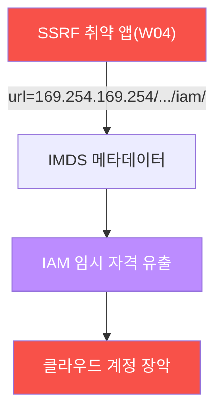
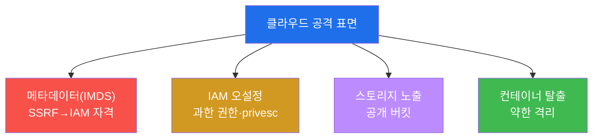
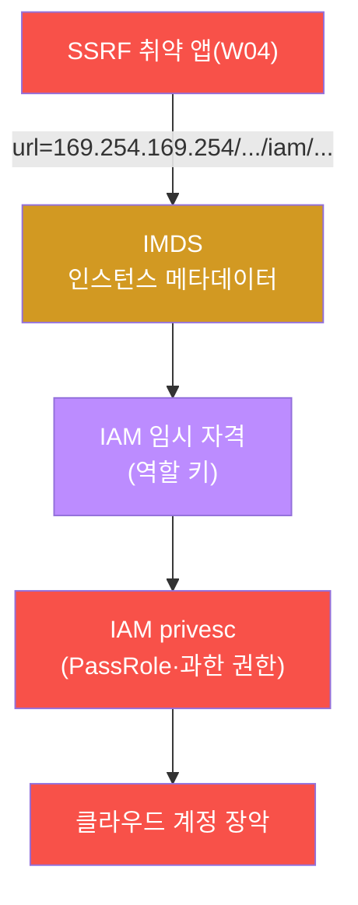
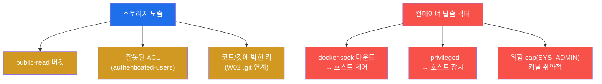
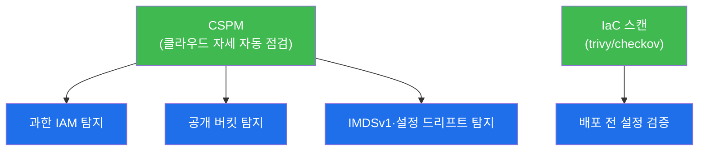

# 공격고급 W13 — 클라우드 공격: 설정의 빈틈과 컨테이너 탈출 (개념+실점검)

> **본 주차의 한 줄 요약**
>
> 현대 인프라는 클라우드로 옮겨갔고, 공격 표면도 함께 옮겨갔다. 클라우드 공격의 핵심은 **설정(configuration)**
> 이다 — 과한 IAM 권한, SSRF로 탈취 가능한 메타데이터 자격(W04 연계), 공개된 스토리지 버킷, 격리가 약한
> 컨테이너. 본 주차는 이 네 표면을 다룬다. **el34는 온프렘**이라 IAM·스토리지는 개념으로, **컨테이너 탈출은
> el34 Docker로 실제 점검**한다 — 학생은 컨테이너 내부에서 `docker.sock`·특권 모드·위험 capabilities를
> 점검해 탈출 가능 여부를 직접 확인한다.
>
> **레드팀 한 줄 결론**: 클라우드를 무너뜨리는 건 제로데이가 아니라 **설정 실수**다 — 와일드카드 IAM 정책
> 한 줄, public으로 둔 버킷 하나, --privileged 컨테이너 하나. 그래서 방어의 정답은 **최소 권한 + 자동 자세
> 점검(CSPM)** 이다. 사람이 일일이 못 보는 설정을 도구가 끊임없이 검증한다.

---

## ⚠️ 윤리·환경 고지

클라우드 공격은 **인가된 환경에서만**. el34는 온프렘 Docker라 클라우드 메타데이터/IAM/스토리지는 **개념·
방법론**으로 학습하고, **컨테이너 탈출만 el34에서 실점검**한다(읽기 전용). 실제 클라우드 공격은 본인 소유·
인가 계정에서만.

---

## 학습 목표

본 주차 종료 시 학생은 다음 5가지를 **본인 손으로** 할 수 있어야 한다.

1. 클라우드 공격이 **설정 보안** 문제임을 설명한다.
2. **메타데이터(IMDS)** 와 SSRF(W04)의 연계로 IAM 자격이 탈취되는 경로를 안다.
3. **IAM 오설정·스토리지 노출**의 유형을 안다.
4. **컨테이너 탈출 벡터**(docker.sock·특권·capabilities)를 실점검한다.
5. **최소 권한·IMDSv2·CSPM·컨테이너 강화** 방어를 설명한다.

---

## 0. 용어 해설

| 용어 | 영문 | 뜻 | 비유 |
|------|------|----|------|
| **IAM** | Identity and Access Management | 클라우드 권한 관리 | 출입 권한 체계 |
| **IMDS** | Instance Metadata Service | 인스턴스 메타데이터(169.254.169.254) | 사원증 보관함 |
| **임시 자격** | temporary credentials | 역할의 단기 키 | 임시 출입증 |
| **버킷** | bucket | 클라우드 객체 스토리지 | 창고 |
| **CSPM** | Cloud Security Posture Mgmt | 클라우드 설정 자세 관리 | 자동 점검 감사관 |
| **컨테이너 탈출** | container escape | 컨테이너→호스트 침투 | 격리실 탈출 |
| **docker.sock** | — | 도커 제어 소켓 | 관리실 마스터 스위치 |
| **privileged** | — | 호스트 장치 접근 모드 | 모든 문 열림 |
| **capabilities** | — | 세분화된 root 권한 조각 | 권한 조각들 |
| **IMDSv2** | — | 토큰 요구 메타데이터(SSRF 완화) | 토큰 있어야 여는 보관함 |

> **헷갈리기 쉬운 한 쌍 — 컨테이너 vs VM.** **VM**은 자체 커널을 가진 완전 격리다 — 탈출이 매우 어렵다.
> **컨테이너**는 호스트 커널을 **공유**하는 격리된 프로세스다 — 가볍지만, 격리(namespace·cgroup·cap)가 약하면
> 호스트로 탈출할 수 있다. "컨테이너는 보안 경계가 아니다"라는 말이 여기서 나온다 — 강화하지 않은 컨테이너는
> VM만큼 안전하지 않다.

---

## 0.5 핵심 개념

### 0.5.1 클라우드 공격 = 설정 보안 (코드 아닌 설정)

온프렘 공격이 취약점·익스플로잇 중심이라면, 클라우드 공격은 **설정 실수** 중심이다. 클라우드 제공자(AWS 등)의
인프라 자체는 견고하지만, 사용자가 설정하는 4가지가 빈틈이 된다:

| 표면 | 흔한 실수 | el34에서 |
|------|-----------|----------|
| IMDS | SSRF로 자격 탈취 | 개념(온프렘) |
| IAM | `Action:*` 와일드카드 | 개념 |
| 스토리지 | public 버킷 | 개념 |
| 컨테이너 | --privileged·docker.sock | **실점검** |

el34는 온프렘이라 앞 3개는 개념·도구로, 실재하는 **컨테이너**는 직접 점검한다.

### 0.5.2 IMDS + SSRF 연계 — Capital One 사고의 핵심

클라우드 인스턴스는 `169.254.169.254`(IMDS)에서 자기 IAM 역할의 **임시 자격**을 받는다. 문제는: **SSRF(W04)로
서버가 이 주소를 대신 요청하게** 만들면 그 자격이 응답에 실려 나온다.



2019 Capital One 사고가 정확히 이것 — SSRF → IMDS → IAM 자격 → S3 버킷 1억 건 유출. **완화는 IMDSv2**(토큰을
먼저 받아야 메타데이터 접근 → 단순 SSRF로는 못 뚫음).

### 0.5.3 컨테이너 탈출 3벡터 — el34에서 직접 점검

컨테이너가 호스트로 탈출하는 길은 대개 셋이다. 실습은 el34-attacker 내부에서 직접 점검한다:

| 벡터 | 점검 | 위험 시 |
|------|------|---------|
| docker.sock 마운트 | `/var/run/docker.sock` 존재? | 도커 API로 호스트 제어 |
| --privileged | 블록 장치(`/dev/sda`) 보임? | 호스트 디스크 접근 |
| 위험 capability | `CAP_SYS_ADMIN` 등? | 커널 조작 |

**el34-attacker 점검 결과(honest)**: docker.sock **없음** · **비특권** · **표준 cap** = 탈출 벡터가 없다. 잘
격리된 컨테이너의 본보기다. 취약했다면 한 줄 명령으로 호스트가 넘어간다.

### 0.5.4 "컨테이너는 보안 경계가 아니다"

VM은 자체 커널로 완전 격리되지만, 컨테이너는 **호스트 커널을 공유**한다. 그래서 격리(namespace·cgroup·cap)가
약하면 공유 커널을 통해 호스트로 빠져나간다. 강화하지 않은 컨테이너를 신뢰 경계로 삼으면 안 된다 — 반드시
비특권·cap drop·seccomp로 단단히 조여야 VM에 준하는 격리가 된다.

### 0.5.5 임의로 보이는 값들

| 값 | 무엇 | 규칙 |
|----|------|------|
| **169.254.169.254** | IMDS 주소 | 클라우드 링크-로컬 표준 |
| **docker.sock** | `/var/run/docker.sock` | 도커 데몬 제어 소켓 |
| **CAP_SYS_ADMIN** | 위험 capability | "사실상 root"인 권한 조각 |
| **마커(`escape_check_done` 등)** | 단계 완료 신호 | 채점이 통과를 확인하는 약속 문자열 |

---

## 1. 클라우드 공격은 설정 보안

### 1.1 한 줄 답: 빈틈은 코드가 아니라 설정에 있다

온프렘 공격이 취약점·익스플로잇 중심이라면, 클라우드 공격은 **설정 실수** 중심이다(§0.5.1). 클라우드 제공자의
인프라 자체는 견고하지만, 사용자가 설정하는 IAM 정책·버킷 권한·컨테이너 옵션의 실수가 빈틈이 된다.



### 1.2 왜 중요한가 — 폭발 반경

클라우드는 모든 것이 API로 연결돼 있다. 한 자격이 탈취되면 그 권한 범위 전체가 위험하고(폭발 반경), 한 버킷
설정 실수가 수백만 건 데이터를 공개한다. 빈틈 하나의 영향이 온프렘보다 크다.

### 1.3 환경 한계 — el34는 온프렘

el34엔 클라우드 IMDS·IAM·버킷이 없다(스코핑으로 확인). 그래서 그 부분은 **정확한 개념·도구**로 배우고,
el34에 실재하는 **컨테이너**의 탈출 벡터는 직접 점검한다 — 실무 스코핑 그대로다(W09 AD와 같은 정직한 처리).

---

## 2. 메타데이터(IMDS) · IAM



**IMDS** — 클라우드 인스턴스는 `169.254.169.254`에서 자신의 메타데이터(IAM 역할의 임시 자격 포함)를 제공한다.
**SSRF(W04)** 로 서버가 이 주소를 대신 요청하게 만들면 IAM 자격이 응답에 실려 나온다 — Capital One 2019
사고의 핵심이다(§0.5.2). **IAM 오설정** — 탈취한 자격이 과한 권한(`Action:*`)이거나 `iam:PassRole` 같은
privesc 경로를 가지면, 저권한에서 관리자로 확장된다. ScoutSuite·pmapper가 이 IAM 경로를 그래프로 분석한다
(클라우드판 BloodHound). **완화** — IMDSv2(토큰 요구)는 단순 SSRF를 막는다.

---

## 3. 스토리지 노출 · 컨테이너 탈출



**스토리지 노출** — public-read로 둔 버킷, `authenticated-users`(=모든 클라우드 계정) 허용 ACL, 코드·깃에 박힌
액세스 키(W02 `.git` 노출과 연계)가 대량 데이터를 공개한다. **컨테이너 탈출** — 실습에서 el34-attacker 내부
에서 직접 점검한다(§0.5.3): `docker.sock`이 마운트됐는가(→호스트 제어), 특권 모드인가(블록 장치 보임→호스트
장치 접근), 위험 capability가 있는가.

**실측 예 — 컨테이너 탈출 점검.**

```bash
ls -la /var/run/docker.sock >/dev/null 2>&1 && echo "docker.sock 노출!" || echo "docker.sock 없음(양호)"
ls /dev/sda >/dev/null 2>&1 && echo "블록장치 보임=특권 의심" || echo "비특권(양호)"
```

el34-attacker는 **docker.sock 없음·비특권·표준 cap**으로 잘 격리돼 있어 탈출 벡터가 없다(honest 결과) — 잘
구성된 컨테이너의 본보기다. 취약하다면 한 줄 명령으로 호스트가 넘어간다.

---

## 4. 방어 — 최소 권한과 자동 점검

| 표면 | 방어 |
|------|------|
| IMDS | IMDSv2 강제(토큰)·SSRF 방어(W04) |
| IAM | 최소 권한(와일드카드 금지)·권한 경계·정기 감사 |
| 스토리지 | 기본 비공개·퍼블릭 차단·암호화·키 로테이션 |
| 컨테이너 | 비특권·docker.sock 미마운트·cap drop·읽기전용 FS·seccomp/AppArmor |



클라우드 보안의 핵심은 **최소 권한**과 **자동 자세 점검(CSPM)** 이다. 설정이 너무 많고 자주 바뀌어 사람이
일일이 못 보므로, CSPM이 과한 IAM·공개 버킷·IMDSv1을 끊임없이 탐지하고, IaC 스캔(trivy/checkov)이 배포
전에 설정을 검증한다(cloud-container 트랙과 직결). 컨테이너는 비특권·cap drop·seccomp로 강화한다.

---

## 5. 실습 안내 (8 미션)

각 미션을 **① 왜 하는가 / ② 무엇을 알 수 있는가 / ③ 결과 해석 / ④ 실전 활용** 4축으로 설명한다. 명령은
공격자 VM(`ssh att@192.168.0.202`)에서 실행한다. **IAM/스토리지는 개념, 컨테이너 탈출은 el34 실점검**(읽기
전용). 실제 클라우드 공격은 인가 계정만.

### STEP 1 — 환경 스코핑
- **왜**: 클라우드 표면 유무를 먼저 확인(W09식 정직 스코핑).
- **무엇을**: IMDS/클라우드 API 도달 여부.
- **해석**: 온프렘 확인(`cloud_scoping_done`). 없는 건 개념으로.
- **실전**: 환경별 도구·전략 결정.

### STEP 2 — IMDS/SSRF
- **왜**: SSRF→IMDS→IAM 자격 경로(Capital One, §0.5.2).
- **무엇을**: IMDS 주소·SSRF 연계 개념.
- **해석**: 자격 탈취 경로 이해(`imds_done`). IMDSv2가 완화.
- **실전**: SSRF 방어 + IMDSv2 강제.

### STEP 3 — IAM 오설정
- **왜**: 과한 권한이 저권한→관리자 확장 경로.
- **무엇을**: `Action:*`·PassRole privesc 개념.
- **해석**: IAM privesc 이해(`iam_done`). ScoutSuite/pmapper로 분석.
- **실전**: 최소 권한·권한 경계.

### STEP 4 — 스토리지 노출
- **왜**: 버킷 설정 실수가 대량 유출.
- **무엇을**: public-read·ACL·박힌 키 유형.
- **해석**: 노출 유형 이해(`storage_done`). W02 .git 키와 연계.
- **실전**: 기본 비공개·퍼블릭 차단·키 로테이션.

### STEP 5 — 컨테이너 탈출 점검 (실)
- **왜**: el34에 실재하는 표면 — 직접 점검.
- **무엇을**: docker.sock·특권·cap 점검(§0.5.3).
- **해석**: el34-attacker 잘 격리됨(`escape_check_done`, honest). 취약 시 호스트 장악.
- **실전**: 비특권·sock 미마운트·cap drop 확인.

### STEP 6 — 탈출 기법
- **왜**: 취약 컨테이너에서 호스트로 가는 법.
- **무엇을**: docker.sock API·특권 마운트 탈출 기법.
- **해석**: 탈출 메커니즘 이해(`escape_done`).
- **실전**: "컨테이너는 보안 경계가 아니다"(§0.5.4).

### STEP 7 — 방어
- **왜**: 설정이 많아 자동 점검 필수.
- **무엇을**: 최소 권한·IMDSv2·CSPM·컨테이너 강화.
- **해석**: 자동 자세 점검 정리(`defense_done`).
- **실전**: CSPM + IaC 스캔(trivy/checkov).

### STEP 8 — 클라우드 보고서
- **왜**: 설정 빈틈·탈출 점검·방어를 종합.
- **무엇을**: 스코핑·점검 결과를 인용한 보고서 골격.
- **해석**: 실측 인용(`cloud_report_done`). 미보유 개념·실점검 구분.
- **실전**: 설정 위험 목록 + 최소권한/CSPM 권고.

---

## 6. 흔한 오해·블루팀 노트

- **"클라우드는 제공자가 다 지킨다"** — 책임 공유 모델이다. 설정(IAM·버킷·컨테이너)은 사용자 책임(§0.5.1).
- **"SSRF는 웹 문제"** — 클라우드에선 SSRF→IMDS→IAM 자격→계정 장악으로 번진다(§0.5.2). IMDSv2 필수.
- **"컨테이너면 격리됨"** — 호스트 커널 공유다. 강화 안 하면 탈출(§0.5.4). 비특권·cap drop 필수.
- **"설정은 한 번 하면 끝"** — 드리프트로 바뀐다. CSPM이 끊임없이 점검해야 한다.

---

## 7. 다음 주차 (W14) 예고 — 종합 모의 침투 (캡스톤)

W01~W13으로 공격의 전 단계를 익혔다. W14는 이 모두를 하나의 **종합 모의 침투**로 통합 — 정찰부터 유출까지
전 킬체인을 한 시나리오로 수행하는 캡스톤이다.
