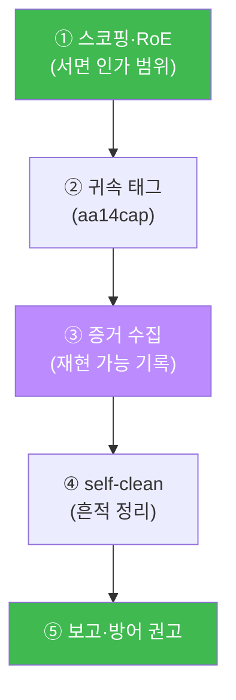
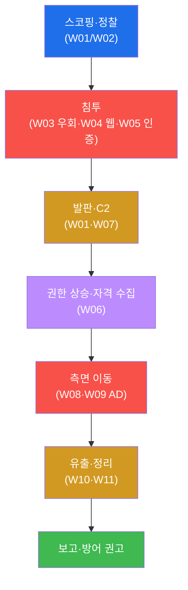
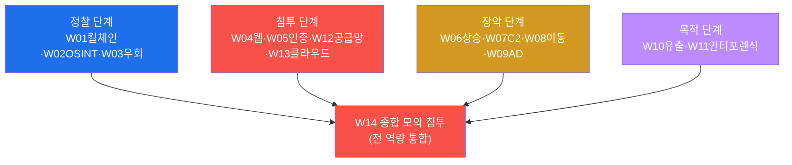
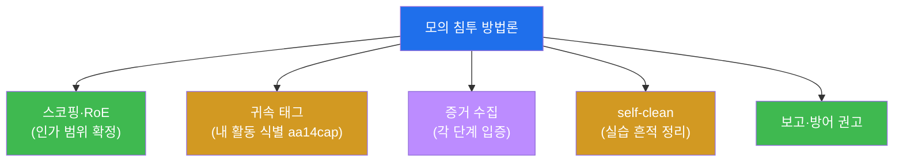

# 공격고급 W14 — 종합 모의 침투: 전 킬체인을 하나의 작전으로 (캡스톤)

> **본 주차의 한 줄 요약**
>
> 13주 동안 학생은 공격의 각 단계를 따로 익혔다 — 킬체인(W01)·OSINT(W02)·우회(W03)·웹(W04)·인증(W05)·
> 상승(W06)·C2(W07)·이동(W08)·AD(W09)·유출(W10)·안티포렌식(W11)·공급망(W12)·클라우드(W13). 본 주차는 이
> 모두를 **하나의 모의 침투(penetration test)** 로 통합한다. 정찰부터 유출까지 전 킬체인을 el34에서 한
> 시나리오로 수행하며, 각 단계를 상황에 맞게 선택·연결한다. 이것은 단순 기법 나열이 아니라 **작전 수행** —
> 실제 침투 테스터가 하는 일 그대로다.
>
> **레드팀 한 줄 결론**: 공격은 **사슬**이다 — 정찰이 침투를, 침투가 발판을, 발판이 상승을, 상승이 이동을,
> 이동이 유출을 가능케 한다. 그리고 이 사슬의 의미는 방어에 있다: **한 고리만 끊어도 전체가 멈춘다.** 공격을
> 끝까지 수행해본 자만이, 어디를 끊어야 가장 효과적인지(방어 — soc-adv W15)를 안다.

---

## ⚠️ 윤리 고지

이 캡스톤은 전 킬체인을 수행하는 통합 시험이다. **반드시 인가된 실습 환경(el34)에서만**, 인가 표적에 한정해
수행하고 self-clean한다. 실제 시스템에 무단 수행은 중범죄다.

---

## 학습 목표

본 주차 종료 시 학생은 다음 5가지를 **본인 손으로** 할 수 있어야 한다.

1. **전 킬체인**(정찰→침투→발판→상승→이동→유출)을 한 시나리오로 수행한다.
2. 각 단계의 **도구·기법을 상황에 맞게 선택·연결**한다.
3. **모의 침투 방법론**(스코핑·RoE·증거·태그)을 적용한다.
4. 발견을 **ATT&CK로 매핑**하고 **단계별 방어 권고**를 도출한다.
5. **전문 모의 침투 보고서**를 작성한다.

---

## 0. 용어 해설

| 용어 | 영문 | 뜻 | 비유 |
|------|------|----|------|
| **모의 침투** | penetration test | 인가된 공격 시뮬레이션 | 모의 침입 훈련 |
| **킬체인** | kill chain | 공격 단계의 사슬 | 작전 단계 |
| **RoE** | Rules of Engagement | 교전 규칙(인가 범위) | 작전 수칙 |
| **스코핑** | scoping | 표적·범위 확정 | 작전 구역 설정 |
| **귀속 태그** | attribution tag | 내 공격 식별 표식(aa14cap) | 작전 식별 부호 |
| **증거** | evidence | 발견의 입증 자료 | 작전 기록 |
| **ATT&CK 매핑** | — | 기법을 T번호로 분류 | 수법 분류 |
| **방어 권고** | remediation | 발견의 개선책 | 보강 지시 |
| **캡스톤** | capstone | 전 과정 통합 과제 | 졸업 작전 |
| **퍼플팀** | purple team | 공·방 협업(soc-adv W13) | 합동 훈련 |

> **헷갈리기 쉬운 한 쌍 — 모의 침투 vs 실제 공격.** 기법은 똑같다 — 차이는 **인가·범위·목적**이다. 모의
> 침투는 ① **서면 인가**(RoE) 안에서 ② 정해진 **범위**만 ③ 방어 개선이라는 **목적**으로 수행하고, 모든 것을
> 문서화·보고하며 흔적을 정리한다. 같은 SQLi라도 인가가 있으면 보안 강화이고, 없으면 범죄다. 본 캡스톤이
> 끝까지 강조하는 것은 기법이 아니라 이 **윤리적 경계**다.

---

## 0.5 신입생 친화 핵심 개념

### 0.5.1 킬체인은 사슬 — 각 단계의 입력/출력

캡스톤의 핵심은 "각 단계가 다음 단계에 무엇을 넘기는가"다. 한 단계의 **산출물**이 다음 단계의 **재료**가 된다.

| 단계 | 입력(전 단계에서) | 출력(다음 단계로) |
|------|-------------------|-------------------|
| 정찰 | (없음) | 열린 포트·취약점·표면 |
| 침투 | 취약점 | 첫 발판(저권한) |
| 발판/C2 | 발판 | 지속 통제 채널 |
| 권한상승 | 저권한 셸 | root + 수집 자격 |
| 측면이동 | 자격 | 새 호스트 발판 |
| 유출 | 데이터 접근 | 반출된 데이터 |

이 사슬을 못 이으면 단계가 끊긴다 — 정찰 없이 침투 못 하고, 자격 없이 이동 못 한다. 통합 = 이 흐름을 잇는 것.

### 0.5.2 모의 침투 방법론 5요소 — 기법만큼 중요하다

전문 모의 침투는 해킹 기법만이 아니다. 다섯 가지 규율이 핵심이다.

범위 이탈은 위법, 태그 없으면 실제 공격과 혼동, 증거 없으면 보고 불가, 정리 안 하면 환경 오염, 보고 없으면
가치 0. 기법이 "무엇을 할 수 있나"라면, 방법론은 "어떻게 책임 있게 하나"다.

### 0.5.3 공격 캡스톤 = 방어 캡스톤의 거울

본 주차(공격 W14)와 soc-adv W15(방어 APT 캡스톤)는 **같은 킬체인의 양면**이다.

| 킬체인 | 공격(W14) | 방어(soc-adv W15) |
|--------|-----------|-------------------|
| 정찰 | nmap 스캔 | IPS 스캔 탐지 |
| 침투 | SQLi | WAF·SIEM 탐지 |
| C2 | 비콘 | flow·아웃바운드 통제 |
| 이동 | 자격 재사용 | 동서 트래픽 탐지 |
| 유출 | 암호화 반출 | DLP·볼륨 탐지 |

공격을 끝까지 해본 자가 "어디를 끊어야 가장 효과적인지"를 안다 — 그래서 공격 학습이 방어 설계로 이어진다.

### 0.5.4 캡스톤은 "동원"의 시험 — 상황에 맞는 도구 선택

13주 기법을 다 외워도, 상황에 맞게 못 꺼내면 소용없다. WAF가 있으면 W03 우회를, AD면 W09를, 클라우드면
W13을 — 표적 상황을 읽고 맞는 도구를 고르는 **판단**이 종합 역량이다. 캡스톤은 새 기법이 아니라 이 판단을
시험한다.

### 0.5.5 임의로 보이는 값들

| 값 | 무엇 | 규칙 |
|----|------|------|
| **aa14cap** | 캡스톤 귀속 태그 | attack-adv W14 capstone |
| **T1046/T1190/T1071/...** | ATT&CK 기법 | 각 킬체인 단계 |
| **마커(`recon_phase_done` 등)** | 단계(phase) 완료 신호 | 채점이 통과를 확인하는 약속 문자열 |

---

## 1. 공격은 사슬 — 모의 침투 방법론

### 1.1 한 줄 답: 단계가 단계를 가능케 한다

캡스톤은 새 기법을 배우지 않는다. 13주의 기법을 **연결**하는 법을 배운다 — 정찰 결과가 침투 지점을 정하고,
침투가 발판을 주고, 발판에서 권한을 올리고, 올린 권한으로 자격을 모아 옆으로 가고, 마침내 데이터를 빼낸다
(§0.5.1).

### 1.2 왜 중요한가 — 통합이 실전이다

실전 침투는 기법 하나가 아니라 **사슬의 흐름**이다. 한 단계의 산출물(자격·발판·정보)을 다음 단계의 입력으로
잇는 능력이 진짜 실력이다. 캡스톤은 이 통합 역량을 시험한다.

### 1.3 한계 — 방어의 거울

이 사슬의 궁극적 의미는 방어다. 각 단계마다 방어 기회가 있고, 한 고리만 끊어도 전체가 멈춘다. 캡스톤의
마지막이 "방어 권고"인 이유다 — 공격은 방어를 위한 거울이다(soc-adv W15와 정확히 대칭, §0.5.3).

---

## 2. 13주 역량 지도 — 캡스톤에서 하나로

캡스톤은 13주를 네 묶음으로 동원한다 — **정찰**(표적 파악)·**침투**(진입)·**장악**(통제 확장)·**목적**(데이터).
각 상황에 맞는 도구를 골라 쓰는 것 — WAF가 있으면 W03 우회를, AD면 W09를, 클라우드면 W13을 — 이 판단이
종합 역량이다(§0.5.4).

---

## 3. 모의 침투 방법론 — 스코핑·증거·태그

전문 모의 침투는 기법만큼 **방법론**이 중요하다(§0.5.2). **스코핑·RoE** — 무엇을, 어디까지 공격할지 서면으로
합의한다(범위 이탈은 위법). **귀속 태그** — 내 공격에 고유 식별(`aa14cap`)을 붙여 실제 공격·다른 테스터와
구분한다. **증거 수집** — 각 발견을 재현 가능하게 기록한다(보고의 근거). **self-clean** — 실습으로 만든 발판·
계정·파일을 정리한다(환경 오염 방지). 실습에서 전 킬체인을 수행하며 이 방법론을 적용한다.

---

## 4. 킬체인 통합 · 방어 권고

모의 침투의 산출물은 "뚫었다"가 아니라 **방어 권고**다. 발견을 ATT&CK로 매핑하고, 각 단계의 개선책을 제시한다.

| 킬체인 (ATT&CK) | 공격 기법 | 방어 권고 |
|-----------------|-----------|-----------|
| 정찰 (T1046/T1595) | nmap·OSINT | IDS·노출 최소화 |
| 침투 (T1190) | SQLi | 입력 검증·WAF |
| 발판/C2 (T1071) | 리버스셸·비콘 | 아웃바운드 통제 |
| 권한상승 (T1068) | SUID/sudo | 최소 권한·감사 |
| 측면이동 (T1021) | 자격 재사용 | 망 분리·MFA |
| 유출 (T1041) | 암호화 반출 | DLP·아웃바운드 |

이 표가 공격 캡스톤과 방어 캡스톤(soc-adv W15)이 **정확히 대칭**임을 보여준다(§0.5.3) — 공격자가 친 각 단계를
방어자가 탐지·차단한다. 그리고 핵심 통찰: **사슬의 한 고리만 끊어도 전체가 멈춘다.** 모든 단계를 완벽히
막을 순 없어도, 가장 효과적인 한 곳(예: 아웃바운드 통제로 C2·유출 동시 차단)을 끊으면 공격이 좌절된다.
이것이 퍼플팀(soc-adv W13)의 협업이 향하는 곳이다.

---

## 5. 실습 안내 (8 미션, 캡스톤)

각 미션을 **① 왜 하는가 / ② 무엇을 알 수 있는가 / ③ 결과 해석 / ④ 실전 활용** 4축으로 설명한다. 명령은
el34 호스트에서 `docker exec el34-attacker` 로. **인가된 표적(el34)에만**, 발판/유출은 자체완결 데모·
self-clean. 이 캡스톤은 W01~W13 통합 시험이다.

### STEP 1 — 스코핑·정찰
- **왜**: 작전의 시작 — 범위 확정 + 표면 파악.
- **무엇을**: RoE 범위 내 nmap·OSINT(W01/W02).
- **해석**: 정찰 단계 완료(`recon_phase_done`). 침투 지점 후보.
- **실전**: 인가 범위 안에서만, 태그 부착.

### STEP 2 — 침투
- **왜**: 발견 취약점으로 첫 진입.
- **무엇을**: SQLi 등(W03 우회·W04 웹·W05 인증).
- **해석**: 침투 단계 완료(`exploit_phase_done`). 첫 발판.
- **실전**: 정찰 결과에 맞는 침투 벡터 선택.

### STEP 3 — 발판·C2
- **왜**: 지속 통제 채널 확보.
- **무엇을**: 리버스셸·비콘(W01·W07).
- **해석**: 발판 단계 완료(`foothold_phase_done`).
- **실전**: 끊겨도 복구되는 비콘.

### STEP 4 — 권한 상승·자격 수집
- **왜**: root + 다음 이동의 연료(자격).
- **무엇을**: SUID/sudo 열거(W06).
- **해석**: 상승 단계 완료(`privesc_phase_done`).
- **실전**: 상승↔이동 사이클의 연결점.

### STEP 5 — 측면 이동
- **왜**: 한 발판에서 내부로 확산.
- **무엇을**: 자격 재사용·피벗(W08·W09).
- **해석**: 이동 단계 완료(`lateral_phase_done`).
- **실전**: 수집 자격으로 새 호스트.

### STEP 6 — 유출·정리
- **왜**: 공격의 목적 + 흔적 정리.
- **무엇을**: 스테이징→암호화→반출(W10) + self-clean(W11).
- **해석**: 유출 단계 완료(`exfil_phase_done`).
- **실전**: 모의 침투는 반드시 정리까지.

### STEP 7 — 킬체인 통합·방어 권고
- **왜**: 발견을 ATT&CK·방어로 전환.
- **무엇을**: 단계별 ATT&CK 매핑 + 방어 권고.
- **해석**: 통합 완료(`integration_done`). 공·방 대칭(§0.5.3).
- **실전**: "어디를 끊어야 효과적인가" 도출.

### STEP 8 — 모의 침투 보고서
- **왜**: 산출물은 보고서(다음 주 W15 심화).
- **무엇을**: 전 킬체인을 인용한 보고서 골격.
- **해석**: 캡스톤 완료(`pentest_capstone_report_done`).
- **실전**: 경영/기술 두 층 + 방어 권고.

---

## 6. 흔한 오해·관제자 노트

- **"기법만 알면 침투 가능"** — 단계를 잇는 통합(§0.5.1)과 방법론(§0.5.2)이 진짜 실력이다.
- **"캡스톤은 새 기법"** — 아니다. 13주를 상황에 맞게 동원하는 판단 시험(§0.5.4).
- **"뚫으면 성공"** — 모의 침투의 산출물은 방어 권고다. 보고 없는 침투는 가치 0.
- **"인가는 형식"** — 인가·범위·목적이 모의 침투와 범죄를 가르는 전부다(§0 헷갈리는 쌍).

---

## 7. 다음 주차 (W15) 예고 — 침투 보고서·재현 가능성

W14는 침투를 수행했다. W15는 그것을 **전달**하는 법 — 경영진/기술진 모두가 행동할 수 있는 전문 보고서,
재현 가능한 PoC, 위험 등급화(CVSS), 그리고 윤리·법적 책임을 다루며 공격 고급 과정을 마무리한다.
