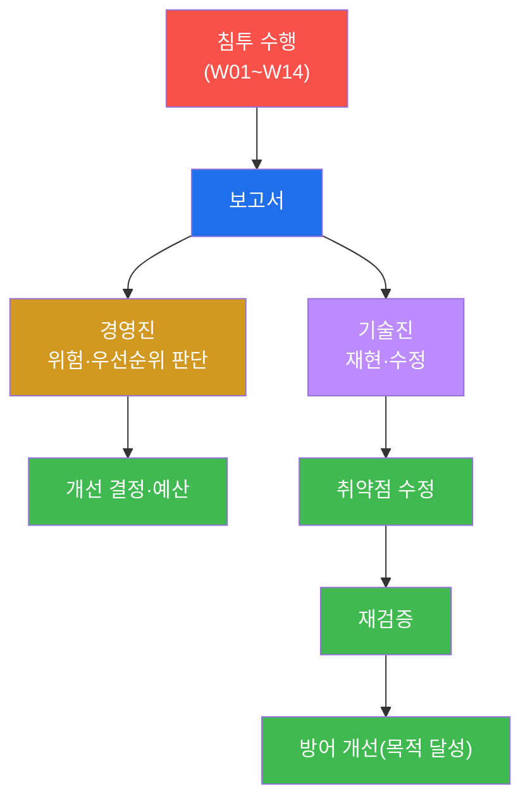
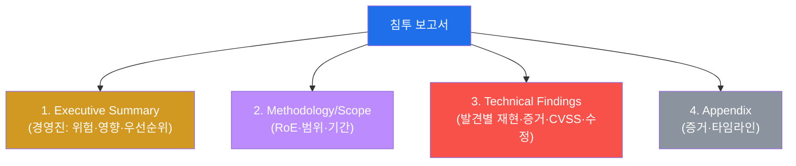
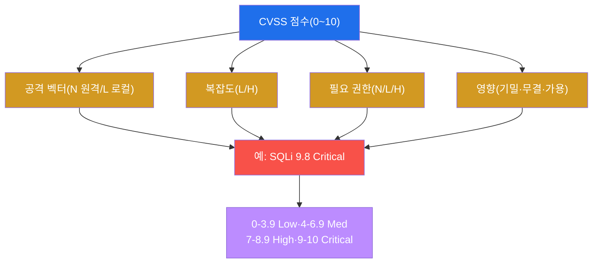
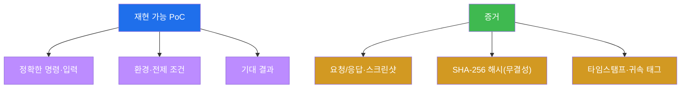
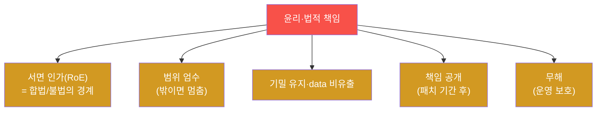

# 공격고급 W15 — 침투 보고서·재현 가능성: 발견을 행동으로 바꾼다

> **본 주차의 한 줄 요약**
>
> 14주 동안 학생은 침투하는 법을 배웠다. 본 주차는 그 모든 것이 **무의미해지지 않게** 하는 법을 배운다 —
> 아무리 화려하게 뚫어도, **보고서가 부실하면 아무것도 고쳐지지 않는다.** 모의 침투의 진짜 산출물은 셸이
> 아니라 **보고서**다. 본 주차는 경영진과 기술진 모두가 행동할 수 있는 보고서 구조, **CVSS** 위험 등급화,
> **재현 가능한 PoC**, 증거·추적성, 그리고 무엇보다 **윤리·법적 책임**을 다루며 공격 고급 과정을 마무리한다.
>
> **레드팀 한 줄 결론**: 전문 침투 테스터와 범죄자를 가르는 것은 기법이 아니라 **인가와 보고**다 — 서면
> 인가 안에서, 발견을 재현 가능하게 문서화하고, 방어 개선으로 연결한다. 침투의 목적은 처음부터 끝까지 **방어
> 개선**이었다. 공격(attack-adv)을 끝까지 배운 이유가 바로 여기 있다 — 더 깊은 방어를 위해.

---

## ⚠️ 윤리 고지 (과정의 결론)

이 과정에서 배운 모든 기법은 **인가된 방어 목적**으로만 쓴다. 인가 없는 사용은 범죄이며, 기술적 능력은
윤리적 책임을 동반한다. 본 주차는 그 윤리·법적 경계를 명확히 하며 과정을 닫는다.

---

## 학습 목표

본 주차 종료 시 학생은 다음 5가지를 **본인 손으로** 할 수 있어야 한다.

1. **경영진·기술진** 두 독자를 위한 보고서 구조를 작성한다.
2. **CVSS**로 발견을 객관적으로 등급화한다.
3. **재현 가능한 PoC**를 작성한다(재현성=신뢰성).
4. **증거·추적성**(해시·태그)을 확보한다.
5. **윤리·법적 책임**(RoE·책임 공개)과 **개선 추적·재검증**을 설명한다.

---

## 강의 시간 배분 (총 3시간 40분)

| 시간        | 내용                                                                | 유형      |
|-------------|---------------------------------------------------------------------|-----------|
| 0:00–0:25   | 이론 — 보고가 침투의 산출물, 독자 분석                              | 강의      |
| 0:25–0:55   | 이론 — 보고서 구조·CVSS                                             | 강의      |
| 0:55–1:05   | 휴식                                                                 | —         |
| 1:05–1:35   | 이론 — 재현 PoC·증거·윤리/법적                                       | 강의/토론 |
| 1:35–2:10   | 실습 — 구조·CVSS·재현 PoC                                            | 실습      |
| 2:10–2:40   | 실습 — 증거·윤리·개선 추적                                           | 실습      |
| 2:40–2:50   | 휴식                                                                 | —         |
| 2:50–3:20   | 실습 — 종합 보고서                                                   | 실습      |
| 3:20–3:40   | 과정 총정리 + 수료                                                   | 정리      |

---

## 0. 용어 해설

| 용어 | 영문 | 뜻 | 비유 |
|------|------|----|------|
| **침투 보고서** | pentest report | 모의 침투 결과 문서 | 진단 결과서 |
| **Executive Summary** | — | 경영진용 요약 | 의사 소견 요약 |
| **CVSS** | Common Vulnerability Scoring System | 취약점 점수 체계 | 중증도 점수 |
| **PoC** | Proof of Concept | 재현 증명 | 재현 실험 |
| **재현성** | reproducibility | 그대로 따라 재현 가능 | 실험 재현 |
| **추적성** | traceability | 증거의 출처·무결성 추적 | 검사 이력 |
| **RoE** | Rules of Engagement | 교전 규칙(인가 범위) | 진료 동의서 |
| **책임 공개** | responsible disclosure | 패치 기간 후 공개 | 유예 후 발표 |
| **remediation** | — | 개선·수정 조치 | 처방·치료 |
| **재검증** | retest | 수정 확인 재테스트 | 경과 재검사 |

> **헷갈리기 쉬운 한 쌍 — Executive Summary vs Technical Findings.** **Executive Summary**는 경영진을 위한
> 것이다 — 비기술 언어로 "우리 위험이 얼마나 큰가, 무엇을 먼저 고쳐야 하나, 비용/영향은"을 답한다. **Technical
> Findings**는 기술진을 위한 것이다 — "정확히 어떻게 재현하고, 무엇을 어떻게 고치나"를 답한다. 같은 침투라도
> 독자에 따라 **언어와 초점이 완전히 다르다.** 한 보고서에 둘을 분리해 담는 것이 핵심이다.

---

## 1. 보고가 침투의 산출물

### 1.1 한 줄 답: 셸이 아니라 보고서가 결과물이다

모의 침투의 목적은 "방어 개선"이다. 그 개선은 보고서를 통해서만 일어난다 — 조직은 셸을 보지 않고 보고서를
읽고 행동한다. 화려한 침투도 보고가 부실하면 아무것도 안 고쳐지고, 침투는 무의미해진다.

### 1.2 왜 중요한가 — 발견을 행동으로

보고서는 발견(공격자의 언어)을 행동(방어자의 언어)으로 번역하는 다리다. 재현 가능한 PoC가 있어야 개발자가
고치고, CVSS가 있어야 우선순위를 정하고, Executive Summary가 있어야 경영진이 예산을 댄다.

### 1.3 한계 — 신뢰가 전부

보고서의 가치는 **신뢰성**에 달려 있다. 재현 안 되는 발견, 과장된 심각도, 부정확한 증거는 보고서 전체의
신뢰를 무너뜨린다. 그래서 재현성·정확한 CVSS·무결한 증거가 생명이다.

---

## 2. 보고서 구조 · CVSS

보고서는 **독자별 두 층**이다 — 경영진용 Executive Summary(비즈니스 위험·우선순위)와 기술진용 Technical
Findings(발견별 재현·증거·수정). **CVSS**가 각 발견의 심각도를 객관화한다.

CVSS는 공격 벡터·복잡도·필요 권한·영향(CIA)으로 0~10 점수를 매긴다(원격·무인증·전면 영향 SQLi는 9.8
Critical). 객관 점수에 **비즈니스 맥락**(노출도·데이터 민감도)을 보정해 실제 위험 우선순위를 정한다.

---

## 3. 재현 PoC · 증거 · 추적성

**재현 PoC** — 개발자가 그대로 따라 재현할 수 있어야 한다(정확한 명령·환경·기대 결과). 재현 안 되는 발견은
무시되거나 신뢰를 잃는다. **증거·추적성** — 요청/응답·스크린샷을 SHA-256 해시+타임스탬프+귀속 태그(W14의
`aa14cap`)로 보존한다. 흥미롭게도 이는 방어자의 chain of custody(soc-adv W07/W11)와 **정확히 대칭**이다 —
공격자도 방어자도 무결한 증거를 보존한다.

---

## 4. 윤리·법적 책임 · 개선 추적

**윤리·법적 책임 — 과정의 결론.**

같은 SQLi도 **서면 인가**가 있으면 보안 강화이고, 없으면 범죄(정보통신망법)다. 인가가 합법의 경계다. 범위를
엄수하고(밖이면 멈춤), 발견·데이터를 기밀로 유지하고, 취약점은 책임 공개(공급자에 먼저, 패치 기간 부여)하며,
운영을 해치지 않는다. **개선 추적·재검증** — 발견별 remediation을 제시하고, 조직이 수정하면 retest로 확인
한다. 수정 확인까지가 침투의 완결이며, 이는 퍼플팀(soc-adv W13)의 순환으로 이어진다.

---

## 5. 실습 안내 (8 미션)

1. **보고 가치**. 2. **보고서 구조**. 3. **CVSS**. 4. **재현 PoC**. 5. **증거·추적성**. 6. **윤리·법적**.
7. **개선 추적·재검증**. 8. **종합 보고서**.

> 명령은 el34 호스트에서 `docker exec el34-attacker`로. **인가된 실습 환경(el34)에서만**, 보고·방법론 중심.

---

## 6. 공격 고급 과정을 마치며

15주 동안 학생은 정찰부터 보고까지 **공격자의 전 여정**을 걸었다 — 킬체인·OSINT·우회·웹·인증·상승·C2·이동·
AD·유출·안티포렌식·공급망·클라우드·종합 침투·보고. 그러나 이 과정의 진짜 목적은 한 번도 "공격" 자체가
아니었다.

> **공격을 알아야 방어가 깊어진다.** 각 공격 기법을 배울 때마다 그 거울인 방어를 보았다 — SQLi에서 입력
> 검증을, C2에서 아웃바운드 통제를, 측면 이동에서 망 분리를. 공격 고급(attack-adv)과 SOC 고급(soc-adv)은
> **한 동전의 양면**이다. soc-adv W15(방어 캡스톤)와 attack-adv W14(공격 캡스톤)가 정확히 대칭인 것은 우연이
> 아니다.

기술적 능력에는 **윤리적 책임**이 따른다. 여러분이 가진 이 능력은 인가된 방어를 위해, 더 안전한 시스템을
만들기 위해 쓰여야 한다. 그것이 이 과정이 여러분에게 남기는 마지막이자 가장 중요한 가르침이다.

> **다음 여정.** 공격과 방어를 모두 익혔다면, 둘을 잇는 **퍼플팀**(soc-adv W13)으로 협업하거나, compliance·
> cloud-container 트랙으로 거버넌스·클라우드 보안으로 확장할 수 있다. 보안은 끝없는 학습의 여정이다.
