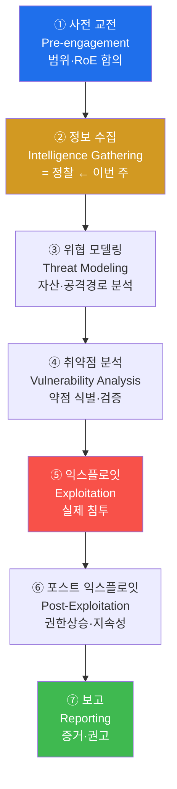
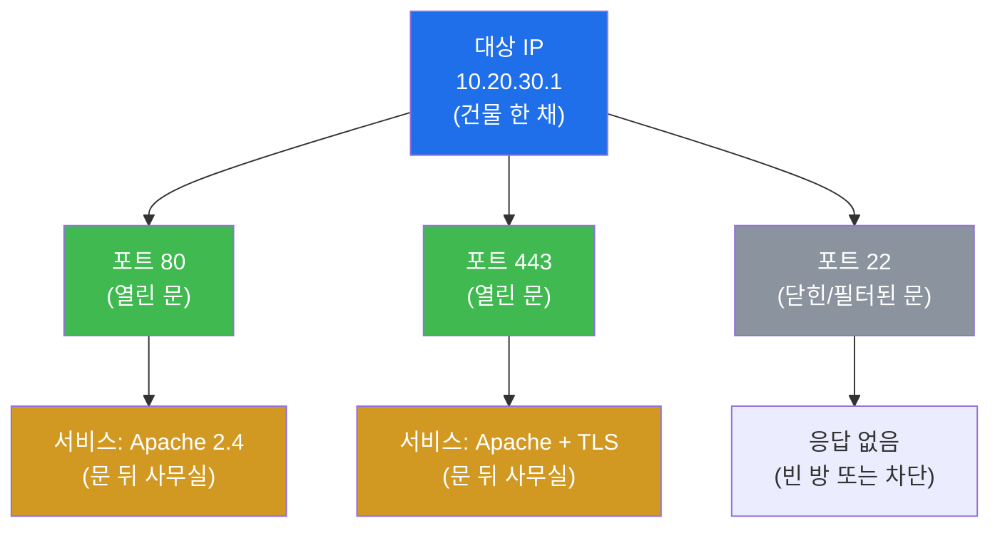
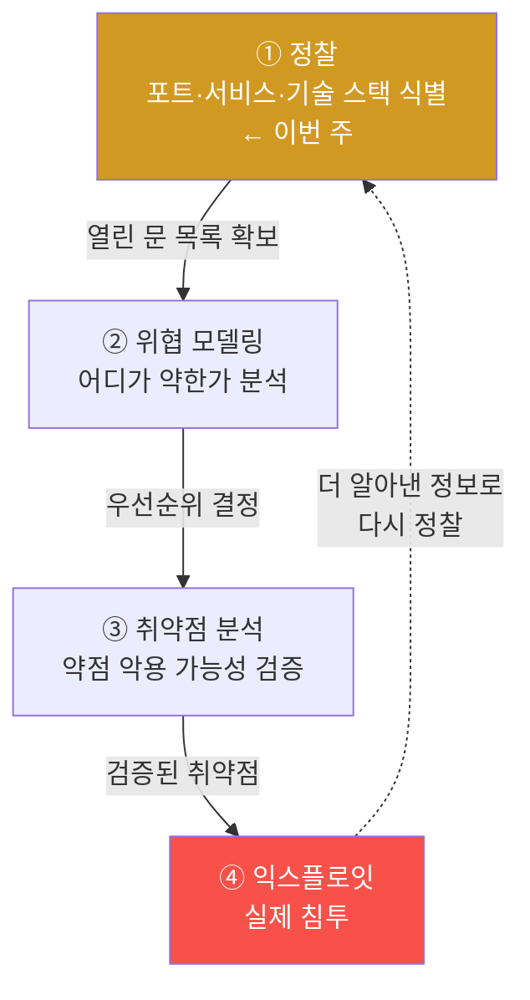
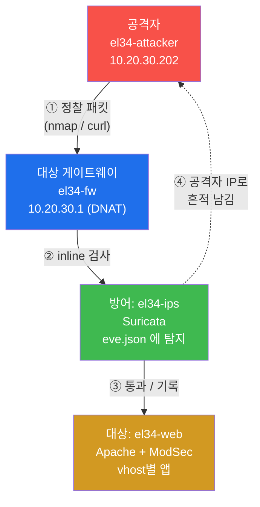
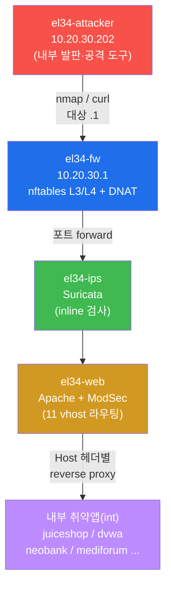
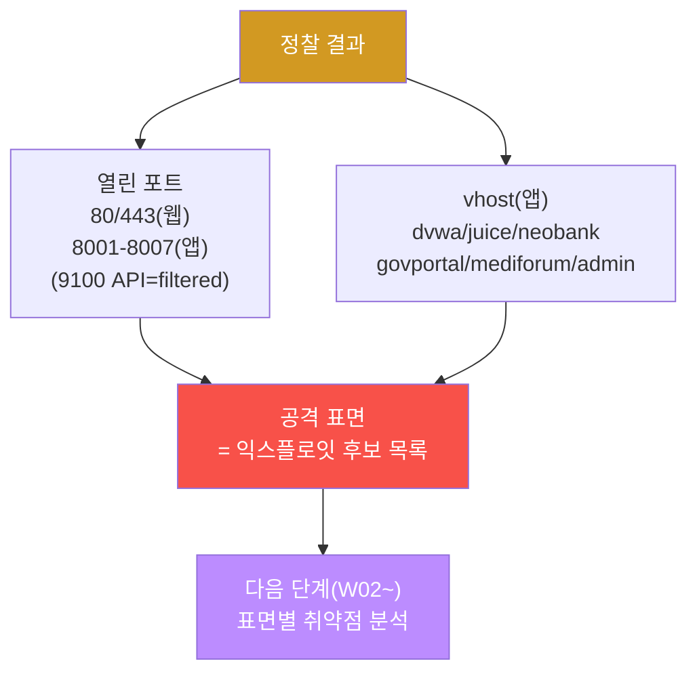
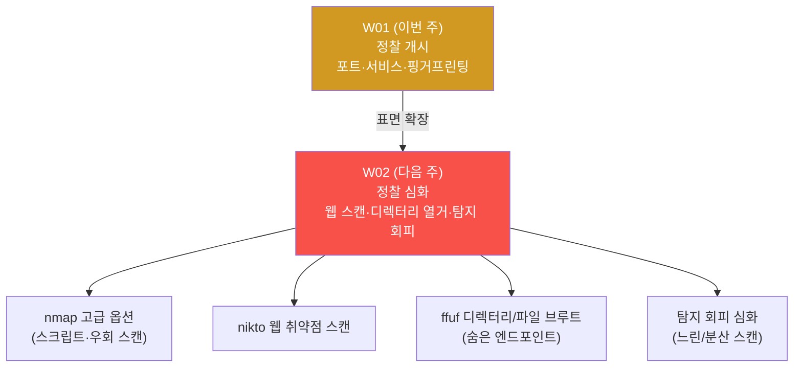

# 공격기법 W01 — 정찰(Reconnaissance) 개시 + 방어 가시성 동시 학습

> **본 주차의 한 줄 요약**
>
> 침투 테스트는 무작정 공격하는 행위가 아니라, **체계적 방법론(PTES)** 과 **교전 규칙(RoE)**
> 안에서 진행되는 절차다. 그 첫 단계가 **정찰(Reconnaissance)** — "무엇이 있고, 어디가
> 열렸고, 무슨 기술을 쓰는가" 를 파악하는 일이다. 본 주차에 학생은 인가된 실습 환경
> `el34` 위에서 공격자 발판(`el34-attacker`)으로 대상의 포트·서비스·웹 기술 스택을
> 직접 식별하고, **그 정찰이 방어 스택(Suricata)에 어떻게 보이는지** 동시에 추적한다.

---

## ⚠️ 사전 경고 — 인가된 환경에서만

이 트랙의 모든 명령은 **인가된 실습 환경(el34)** 안에서만 수행한다. 실제 운영 중인
시스템·외부 서버에 대한 무단 포트 스캔·정찰은 **국내외 법(정보통신망법 등)으로 금지된
범죄 행위**다. 정찰조차도 "조용히 문고리를 흔들어 본 행위" 로 침입 시도로 간주될 수
있다. 본 강의는 **RoE(교전 규칙)** 안에서 자신의 행동이 합법인 경계를 명확히 인지하는
것을 첫 번째 목표로 삼는다. el34 는 이 연습을 안전하게 할 수 있도록 격리된 학습용
타깃이다.

---

## 학습 목표

본 주차 종료 시 학생은 다음 6가지를 **본인 손으로** 할 수 있어야 한다.

1. PTES(Penetration Testing Execution Standard)의 7단계를 순서대로 말하고, 그중 정찰이
   왜 1단계인지, 정찰을 건너뛰면 무엇이 잘못되는지 설명한다.
2. 정찰의 두 종류 — **수동 정찰(passive)** 과 **능동 정찰(active)** — 의 차이와 각자의
   탐지 위험을 구분한다.
3. `nmap` 으로 대상의 열린 포트를 발견하고(`-p`), 각 포트에서 동작하는 서비스·버전을
   식별한다(`-sV`).
4. `curl -I` / `whatweb` 로 웹 서버의 기술 스택(Server 헤더, 응용 프레임워크)을
   핑거프린팅하고, vhost(가상 호스트)별로 다른 애플리케이션이 응답함을 확인한다.
5. 자신이 발생시킨 정찰 트래픽이 방어 스택(Suricata `eve.json`)에 출처 IP
   `10.20.30.202` 로 어떻게 탐지되는지 확인하고, "내 정찰이 얼마나 시끄러운가" 를
   판단한다.
6. 발견한 포트·서비스·vhost 를 **공격 표면(attack surface)** 으로 정리하고, 정찰
   결과 + 방어 가시성을 1페이지 정찰 보고서로 작성한다.

---

## 0. 용어 해설 (정찰 입문)

본 절은 이번 주에 처음 등장하는 핵심 용어를 표로 먼저 정리하고(§0), 신입생이 헷갈리기
쉬운 용어는 일상 비유로 다시 풀어 설명한다(§0.5). 본문에서 막히면 이 절로 돌아오면
흐름이 끊기지 않는다.

| 용어 | 영문 | 뜻 | 비유 |
|------|------|----|------|
| **침투 테스트** | Penetration Test (pentest) | 인가받고 공격자처럼 시스템 약점을 찾는 평가 | 의뢰받은 모의 도둑 |
| **PTES** | Penetration Testing Execution Standard | 침투 테스트의 표준 7단계 방법론 | 공사 표준 공정표 |
| **정찰** | Reconnaissance (recon) | 공격 전 대상 정보를 수집하는 1단계 | 도둑이 집을 사전 답사 |
| **수동 정찰** | Passive recon | 대상에 직접 접촉하지 않고 공개 정보만 수집 | 멀리서 망원경으로 관찰 |
| **능동 정찰** | Active recon | 대상에 직접 패킷을 보내 응답으로 정보 수집 | 직접 문고리를 흔들어 봄 |
| **RoE** | Rules of Engagement | 교전 규칙 — 범위·시간·방법의 합의된 경계 | 모의훈련 안전 수칙 |
| **공격 표면** | Attack Surface | 공격자가 노릴 수 있는 모든 진입점의 총합 | 건물의 모든 문·창문 |
| **포트** | Port | 한 IP 위에서 서비스를 구분하는 0~65535 번호 | 건물의 각 출입문 번호 |
| **서비스** | Service | 특정 포트에서 응답하는 프로그램(웹/SSH 등) | 그 문 뒤의 사무실 |
| **포트 스캔** | Port scan | 어떤 포트가 열렸는지 패킷으로 점검 | 모든 문을 차례로 두드리기 |
| **핑거프린팅** | Fingerprinting | 응답의 특징으로 SW 종류·버전을 식별 | 지문으로 신원 식별 |
| **nmap** | Network Mapper | 포트 스캔·서비스 식별의 표준 OSS 도구 | 만능 문 점검 도구 |
| **whatweb / curl -I** | — | 웹 기술 스택을 식별하는 도구 | 간판·내부 안내판 읽기 |
| **vhost** | Virtual Host | 같은 IP/포트에서 도메인별 다른 사이트 | 한 건물 안 여러 매장 |
| **DNAT** | Destination NAT | 공인 IP 포트를 내부 대상으로 전달 | 대표번호 → 내선 연결 |
| **Suricata** | — | 트래픽을 검사하는 IDS/IPS(방어 측) | 보안 카메라 |
| **eve.json** | Extensible EVent JSON | Suricata 의 JSON 이벤트 로그 | CCTV 영상 인덱스 |
| **IDS / IPS** | Intrusion Detection / Prevention System | 침입 탐지(IDS) / 탐지+차단(IPS) | 보안 카메라 + 자동 잠금 |
| **CVE** | Common Vulnerabilities and Exposures | 공개 취약점의 전 세계 공통 식별번호 | 질병 표준 코드 |

---

## 0.5 신입생 친화 핵심 용어 — 일상 비유

### 0.5.1 정찰(Reconnaissance) — 도둑의 사전 답사 비유

영화 속 노련한 도둑은 금고를 털기 전에 절대 곧장 침입하지 않는다. 먼저 며칠에 걸쳐
대상 건물을 답사한다. 출입문이 몇 개인지, 경비는 몇 시에 교대하는지, CCTV 사각지대는
어디인지, 창문 잠금장치는 어떤 제품인지 — 이 모든 정보를 모은 뒤에야 비로소 계획을
세운다. 정보가 충분할수록 침입은 빠르고 조용하다.

이 사전 답사가 보안 세계에서는 **정찰(Reconnaissance)** 이다.

**정찰** 은 본격적인 공격(익스플로잇) 이전에, 대상에 대해 알 수 있는 모든 정보를
체계적으로 수집하는 단계다. 침투 테스트의 성패는 사실상 이 단계의 충실도에서
갈린다 — 무엇이 열려 있는지 모르면 어디를 공격할지도 모르기 때문이다.

정찰은 답사 방식에 따라 두 가지로 나뉜다. 이 둘의 차이는 "들킬 위험" 에서 결정적이다.

| 도둑의 답사 | 정찰의 종류 | 대상 접촉 | 탐지 위험 |
|--------------|-------------|-----------|-----------|
| 멀리서 망원경으로 관찰, 공개된 건축 도면 열람 | **수동 정찰(passive)** | 없음(공개 정보만) | 거의 없음 |
| 직접 문고리를 흔들고 창문을 두드려 봄 | **능동 정찰(active)** | 직접 패킷 발송 | 있음(탐지될 수 있음) |

- **수동 정찰(passive recon)** — 대상 시스템에 직접 패킷을 보내지 않고, 외부의 공개
  정보(DNS 등록 정보, 검색엔진 캐시, 공개 문서 메타데이터)만으로 단서를 모은다. 대상은
  자신이 정찰당하는지 알 수 없다.
- **능동 정찰(active recon)** — 대상에 직접 패킷을 보내고 그 응답을 분석한다. 포트
  스캔(`nmap`)이 대표적이다. 정보를 훨씬 많이 얻지만, **대상의 방어 스택(IDS/IPS)에
  흔적이 남는다.** 본 주차의 실습은 인가된 환경에서의 능동 정찰이다.

> **핵심.** 본 주차에서 학생이 수행하는 `nmap` 스캔과 `curl` 요청은 모두 **능동 정찰**
> 이다. 따라서 el34 의 Suricata 에 흔적이 남는다. 좋은 공격자는 "내가 지금 얼마나
> 시끄러운가" 를 항상 의식한다 — 그것이 §6 에서 다룰 **탐지 회피** 의 출발점이다.

### 0.5.2 PTES — 공사 표준 공정표 비유

집을 짓는 일을 떠올려보자. 능숙한 시공사는 순서를 건너뛰지 않는다. 측량 → 설계 →
기초 → 골조 → 마감 → 준공검사 라는 표준 공정을 따른다. 기초 없이 골조를 올리면 건물이
무너지듯, 순서를 어기면 결과가 무너진다.

이 표준 공정표가 침투 테스트에서는 **PTES(Penetration Testing Execution Standard)** 다.

**PTES** 는 침투 테스트를 누가 하더라도 일관된 품질로 수행하도록 만든 산업 표준
방법론으로, 다음 7단계로 구성된다. 본 주차는 그중 **2단계 정보 수집(정찰)** 이다.



각 단계의 의미는 다음과 같다.

- **① 사전 교전(Pre-engagement)** — 실제 행동 전에 고객과 범위·시간·금지사항을
  문서로 합의한다. 여기서 정해지는 것이 곧 **RoE(§0.5.3)** 다.
- **② 정보 수집 = 정찰(이번 주)** — 대상의 포트·서비스·기술 스택을 파악한다.
- **③ 위협 모델링** — 정찰 결과를 보고 "어떤 자산이 중요하고, 어디로 들어갈 수
  있는가" 를 분석한다.
- **④ 취약점 분석** — 식별한 약점이 실제로 악용 가능한지 검증한다(W03~).
- **⑤ 익스플로잇** — 검증된 취약점으로 실제 침투한다(공격기법 트랙 중반부).
- **⑥ 포스트 익스플로잇** — 침투 후 권한상승·지속성 확보·내부 이동을 한다.
- **⑦ 보고** — 발견 사항·증거·개선 권고를 문서화한다. 실무에서 가장 중요한 산출물이다.

> **왜 정찰이 1단계(②)인가?** 정찰을 건너뛰고 곧장 익스플로잇하면, 공격자는 무엇이
> 열렸는지도 모른 채 아무 포트에나 알려진 공격을 난사하게 된다. 이는 (a) 성공률이
> 극히 낮고 (b) 방어 스택에 엄청나게 시끄러운 흔적을 남겨 즉시 차단당한다. **충분한
> 정찰이 곧 성공적이고 조용한 침투의 토대**다.

### 0.5.3 RoE — 모의훈련 안전 수칙 비유

군대의 실전 같은 모의훈련을 떠올려보자. 아무리 실전처럼 한다 해도 반드시 지켜야 할
안전 수칙이 있다 — "실탄 대신 공포탄", "이 구역 밖으로 나가지 말 것", "이 시간 안에만",
"부상자 발생 시 즉시 중단". 이 수칙이 없으면 훈련이 사고로 변한다.

이 안전 수칙이 침투 테스트에서는 **RoE(Rules of Engagement, 교전 규칙)** 다.

**RoE** 는 침투 테스트를 시작하기 전에 공격 측과 의뢰 측이 합의하는, 합법과 불법을
가르는 경계선이다. 보통 다음 네 가지를 명시한다.

- **범위(Scope)** — 어떤 IP·도메인·시스템까지 공격해도 되는가. 범위 밖은 무단 침입이다.
- **시간(Timing)** — 언제 공격하는가. 업무 시간 외로 제한하는 경우가 많다.
- **방법(Methods)** — 무엇이 금지인가. 예: 서비스 중단(DoS) 금지, 실데이터 유출 금지.
- **증거(Evidence)** — 모든 행동을 기록으로 남겨, 사고 시 책임 소재를 명확히 한다.

본 트랙에서 RoE 는 단순하다 — **el34 실습 환경 안에서만, 제공된 명령으로만** 수행한다.
el34 외부의 어떤 시스템에 대한 시도도 절대 금지다.

### 0.5.4 포트와 서비스 — 건물의 문과 사무실 비유

한 IP 주소(예: `10.20.30.1`)를 큰 건물 한 채로 생각하자. 이 건물에는 0번부터
65535번까지 번호가 매겨진 수많은 출입문이 있다. 각 문 번호가 **포트(port)** 다. 그리고
어떤 문 뒤에는 실제로 일하는 사무실(프로그램)이 있고, 어떤 문 뒤에는 아무것도 없다.
문 뒤에서 일하는 사무실이 **서비스(service)** 다.

- **포트(port)** — 한 IP 위에서 통신 상대를 구분하는 16비트 번호(0~65535). 관례적으로
  잘 알려진 포트가 있다 — 80(HTTP 웹), 443(HTTPS 웹), 22(SSH), 5432(PostgreSQL) 등.
- **서비스(service)** — 그 포트에서 실제로 응답하는 프로그램. 같은 80번 문 뒤라도
  Apache 일 수도 nginx 일 수도 있고, 버전도 제각각이다.

공격자가 포트를 스캔하는 이유는 명확하다 — **열린 문(포트)이 곧 들어갈 수 있는
입구 후보**이고, 그 문 뒤 서비스의 종류·버전을 알아야 그에 맞는 알려진 약점을 찾을 수
있기 때문이다.



### 0.5.5 eve.json — 보안 카메라 영상 인덱스 비유 (방어 측이 보는 것)

이번 트랙은 공격 과목이지만, 우리는 공격이 **방어 측에 어떻게 보이는지** 동시에
학습한다. 그래야 탐지를 회피하는 법도 알 수 있기 때문이다.

집에 설치한 CCTV 를 떠올려보자. CCTV 는 24시간 녹화하면서 동시에 "몇 시 몇 분에 어떤
일이 있었다" 는 시간별 인덱스를 자동으로 작성한다. 이 인덱스가 방어 측의 IDS
**Suricata** 에서는 **eve.json** 이라는 로그 파일이다.

**eve.json** 은 Suricata 가 분석한 모든 패킷의 결과를 한 줄에 하나의 JSON 객체로
기록하는 로그다. `event_type` 필드로 종류가 구분되며(`alert`/`http`/`dns`/`flow` 등),
공격자 관점에서 가장 중요한 것은 `src_ip`(누가 보냈나)와 `alert.signature`(무슨 공격으로
탐지됐나)다.

```json
{"timestamp":"2026-06-20T13:01:16+0000",
 "event_type":"alert",
 "src_ip":"10.20.30.202",
 "dest_ip":"10.20.30.1",
 "alert":{"signature":"ET SCAN Nmap ..."}}
```

| eve.json 필드 | CCTV 인덱스 | 공격자에게 주는 의미 |
|---------------|-------------|----------------------|
| `timestamp` | 영상의 시각 | 내 행동이 기록된 시점 |
| `src_ip` | 침입자 얼굴 | **내 출처가 그대로 노출** |
| `event_type` | 정상/비정상 구분 | `alert` 면 의심 트래픽 |
| `alert.signature` | 무슨 행동이었나 | 내 스캔이 무슨 이름으로 탐지됐나 |

> **el34 의 핵심 사실 — 출처 IP 보존.** el34 의 방화벽(fw)은 공격 트래픽을 SNAT(출처
> 위장)하지 않는다. 따라서 공격자 `el34-attacker(10.20.30.202)`의 IP 가 Suricata·웹
> 로그·SIEM 전 계층에 **그대로 보존**된다. 공격자 입장에서는 "내 정찰이 내 IP 로 또렷이
> 기록된다" 는 뜻이고, 이것이 §5 방어 가시성 실습의 전제다.

---

## 1. 공격은 정찰에서 시작한다 — 왜 곧장 익스플로잇하지 않는가

### 1.1 한 줄 답: 모르는 것은 공격할 수 없다

침투 테스트를 단순화하면 다음 순환을 따른다. 공격자는 정보가 쌓일수록 더 정밀하게,
더 조용하게 다음 단계로 나아간다.



정찰 없이 ④ 익스플로잇으로 직행하면, 무엇이 열렸는지도 모른 채 모든 포트에 알려진
공격을 난사하게 된다. 성공률은 낮고 탐지는 확실하다. **정찰의 충실도가 곧 침투의
성공률**이다.

### 1.2 정찰을 건너뛰면 생기는 일 (실패 사례)

| 정찰을 건너뛴 행동 | 결과 | 정찰했다면 |
|--------------------|------|-----------|
| 닫힌 포트에 SQLi 시도 | 응답 없음, 시간 낭비 | 열린 80/443 만 노렸을 것 |
| 모든 포트에 전체 익스플로잇 난사 | IDS 가 즉시 탐지·차단 | 표적 한 곳만 조용히 공략 |
| 서비스 버전 모른 채 공격 | 버전 안 맞는 익스플로잇 실패 | 버전에 맞는 CVE 선택 |

위 모든 실패의 공통 원인은 **정보 부족**이며, 충분한 정찰로 예방할 수 있었다는 것이
침투 테스트 방법론의 일관된 교훈이다.

---

## 2. 공방 통합 — 공격하며 방어를 본다

el34 는 공격자 출처 IP 를 fw → ips → web 전 계층에 보존한다(§0.5.5). 그래서 본 트랙은
공격을 수행하면서, **그 공격이 방어 스택에 어떻게 보이는지** 를 같은 실습 안에서 동시에
관찰한다. 공격 과목이지만 방어 가시성도 함께 배우는 이유는 단순하다 — **자기 행동이
어떻게 탐지되는지 아는 공격자만이 탐지를 회피할 수 있기** 때문이다.



이 그림의 핵심은 ④ 점선 — 공격자가 보낸 정찰 패킷이 IPS(Suricata)에 **공격자 자신의
IP 로** 기록되어 돌아온다는 점이다. §5 에서 학생은 이 흔적을 직접 확인한다.

---

## 3. el34 정찰 대상 — 토폴로지와 공격 위치

### 3.1 공격자는 어디에 서 있는가

본 주차의 공격 위치는 **`el34-attacker`(내부 발판, 10.20.30.202)** 다. 이 컨테이너는
대상 게이트웨이 `el34-fw`(10.20.30.1)와 같은 `ext` 망에 있어, fw 가 공인 IP 의 포트를
DNAT 로 내부에 전달하는 공격 표면을 직접 점검할 수 있다.



> **DNAT 란?** **DNAT(Destination NAT)** 는 공인 IP 의 특정 포트로 들어온 트래픽을 내부
> 사설 IP 의 대상으로 전달하는 기능이다. 회사 대표번호로 전화하면 교환기가 담당 부서
> 내선으로 연결해 주는 것과 같다. el34 의 fw 가 이 역할을 해서, 공격자는 내부 IP 를 몰라도
> 게이트웨이(10.20.30.1)의 공개 포트만으로 내부 웹에 도달한다.

### 3.2 정찰의 두 표면 — 포트(L3/L4)와 vhost(L7)

el34 에는 공격자가 매핑해야 할 표면이 두 층위로 나뉜다. 이 둘을 구분하는 것이 정찰의
핵심이다.

| 표면 | 무엇 | 정찰 도구 | el34 사실 |
|------|------|-----------|-----------|
| **포트(L3/L4)** | 어떤 포트가 열렸나 | `nmap -p` | fw 가 DNAT 한 80/443/8001-8007/9100 |
| **vhost(L7)** | 같은 포트 뒤 어떤 앱인가 | `curl -H "Host: ..."` / `whatweb` | web Apache 가 `Host:` 헤더로 dvwa/juice/… 분기 |

> **vhost 란?** **vhost(Virtual Host, 가상 호스트)** 는 같은 IP·포트에서 `Host:` 헤더의
> 도메인 값에 따라 전혀 다른 웹 사이트를 응답하는 방식이다. 한 건물 주소에 여러 매장이
> 간판으로 구분되는 것과 같다. el34 의 web 컨테이너 Apache 는 `Host: dvwa.el34.lab`,
> `Host: juice.el34.lab` 등을 보고 내부의 서로 다른 취약앱으로 요청을 전달한다. 따라서
> **같은 80번 포트라도 Host 헤더에 따라 공격 표면(앱)이 완전히 달라진다** — 공격자는
> 포트만이 아니라 vhost 까지 열거해야 표면 전체를 본다.

el34 의 주요 vhost (정찰로 식별하게 될 공격 표면 후보):

| vhost (Host 헤더) | 내부 앱 | 익스플로잇 표면 성격 |
|-------------------|---------|----------------------|
| `dvwa.el34.lab` | DVWA | SQLi / XSS / 명령주입 (난이도 4단계) |
| `juice.el34.lab` | OWASP Juice Shop | 현대 SPA, 80+ 챌린지 |
| `neobank.el34.lab` | NeoBank | 인증/IDOR(권한 우회) |
| `govportal.el34.lab` | GovPortal | 인증/LFI(파일 포함) |
| `mediforum.el34.lab` | MediForum | XSS |
| `admin.el34.lab` | AdminConsole | RCE/XXE |

각 vhost 는 서로 다른 취약점 성격을 가지므로, 정찰 단계에서 vhost 를 빠짐없이 열거하는
것이 곧 익스플로잇 후보 목록을 넓히는 일이다.

### 3.3 실습 접근 모델 — 호스트 SSH + docker exec

el34 의 모든 컨테이너는 타깃 VM **192.168.0.80** 한 대 위에서 돈다. 본 트랙의 표준
접근은 호스트에 SSH 로 들어간 뒤 `docker exec` 로 공격자 컨테이너에 명령을 보내는
것이다.

```bash
ssh ccc@192.168.0.80                       # 비밀번호: 1
docker exec el34-attacker nmap --version    # 공격자 컨테이너에서 도구 실행
```

> **공격자 컨테이너에 미리 설치된 도구.** el34-attacker 에는 정찰·공격 도구가 사전
> 설치되어 있다 — `nmap`(포트/서비스 스캔), `curl`(HTTP 요청), `nikto`(웹 취약점 스캔),
> `ffuf`(디렉터리 브루트), `sqlmap`(SQLi 자동화), `hydra`(인증 브루트), `nuclei`(템플릿
> 기반 스캔) 등. 본 주차는 그중 정찰의 기본인 `nmap` 과 `curl` 에 집중한다.

---

## 4. 정찰 도구 상세

### 4.1 nmap — 포트·서비스 식별의 표준

**한 줄 정의**: `nmap`(Network Mapper)은 대상에 패킷을 보내 열린 포트를 발견하고, 각
포트에서 동작하는 서비스·버전을 식별하는 능동 정찰의 표준 OSS 도구다.

**왜 중요한가**: 열린 포트가 곧 침입 가능한 입구 후보이고, 서비스 버전을 알아야 그에
맞는 알려진 취약점(CVE)을 찾을 수 있다. 정찰의 가장 기본 산출물이 nmap 결과다.

**el34 에서 어떻게**: 공격자 컨테이너에서 게이트웨이(10.20.30.1)의 공개 포트를 스캔한다.

```bash
docker exec el34-attacker nmap -sV -p 80,443,8001-8007,9100 10.20.30.1 -T4 --max-retries 1
```

핵심 옵션의 의미:

- `-p 80,443,8001-8007,9100` — **스캔할 포트 지정**. el34 fw 가 DNAT 한 공개 포트들이다.
  생략하면 nmap 기본 1000 포트를 스캔한다.
- `-sV` — **서비스/버전 식별(Service/Version)**. 단순히 "열림/닫힘" 이 아니라 그 포트
  뒤가 `Apache 2.4` 인지 `nginx` 인지까지 알아낸다. 알려진 취약점 매핑의 출발점이다.
- `-T4` — **타이밍 템플릿 4(aggressive)**. nmap 은 T0(paranoid, 매우 느림)~T5(insane,
  매우 빠름)의 6단계 속도를 제공한다. 빠를수록 시끄럽고(탐지 위험↑), 느릴수록 조용하다.
- `--max-retries 1` — 응답 없는 포트에 대한 **재시도 횟수 제한**. 스캔 속도를 높인다.

**출력 해석 예시**:

```
PORT     STATE    SERVICE  VERSION
80/tcp   open     http     Apache httpd 2.4.x
443/tcp  open     ssl/http Apache httpd 2.4.x
8001/tcp open     ...
9100/tcp filtered jetdirect
```

- `open` — **열린 포트**. 들어갈 수 있는 입구 후보. 공격 표면(여기선 80/443/8001-8007).
- `filtered` — 방화벽이 응답을 막아 열림/닫힘 판단 불가. (fw 정책의 흔적) — el34 에서 9100(Bastion
  API)은 fw 가 DNAT 하지만 외부 attacker 시점에선 **filtered** 로 나온다(내부에서만 도달). "DNAT
  되어 있다 ≠ 외부에서 열려 있다"의 좋은 예.
- `closed` — 포트는 도달하지만 서비스 없음.
- `VERSION` 열 — 이 버전 정보가 곧 CVE 검색의 키워드가 된다.

> **CVE 란?** **CVE(Common Vulnerabilities and Exposures)** 는 전 세계가 공유하는 공개
> 취약점 식별번호다(예: `CVE-2021-41773`). 질병에 표준 코드를 붙이듯, 알려진 취약점마다
> 고유 번호가 부여된다. nmap 으로 식별한 서비스 버전을 CVE 데이터베이스에서 검색하면,
> 그 버전에 알려진 약점이 있는지 즉시 확인할 수 있다.

**한계**: `-sV` 같은 능동 스캔은 IDS 에 또렷이 탐지된다(§5). 또한 fw 가 `filtered` 로
응답을 막으면 정확한 식별이 어렵다.

### 4.2 curl / whatweb — 웹 기술 스택 핑거프린팅

**한 줄 정의**: `curl -I` 와 `whatweb` 는 웹 서버의 응답에서 서버 종류·버전·프레임워크
같은 기술 스택 단서를 추출하는 **웹 핑거프린팅** 도구다.

**왜 중요한가**: nmap 이 "80번 포트에 웹이 있다" 까지 알려준다면, 핑거프린팅은 "그 웹이
Apache 2.4 이고, vhost 마다 다른 앱이 뜬다" 까지 좁혀 준다. 익스플로잇 표면을 앱
단위로 매핑하는 단계다.

**핑거프린팅이란?** **핑거프린팅(fingerprinting)** 은 응답의 미세한 특징(헤더, 에러
페이지 형식, 쿠키 이름 등)을 단서로 소프트웨어의 종류·버전을 식별하는 기법이다. 사람의
지문으로 신원을 식별하는 것과 같은 원리다.

**el34 에서 어떻게**: 공격자 컨테이너에서 Host 헤더를 바꿔 가며 응답 헤더를 본다.

```bash
docker exec el34-attacker sh -c "curl -sI -H 'Host: dvwa.el34.lab' http://10.20.30.1/"
```

핵심 옵션:

- `-I` — **헤더만 요청(HEAD)**. 본문 없이 응답 헤더만 받아 빠르게 기술 스택을 본다.
- `-s` — **silent**. 진행률 표시를 끄고 결과만 출력한다.
- `-H 'Host: dvwa.el34.lab'` — **Host 헤더 지정**. 같은 IP(10.20.30.1)라도 이 헤더에
  따라 web Apache 가 다른 vhost(앱)로 분기한다. Host 를 바꿔 가며 보내면 vhost 를 열거할
  수 있다.

**출력 해석 예시**:

```
HTTP/1.1 200 OK
Server: Apache/2.4.x
Set-Cookie: PHPSESSID=...
```

- `Server:` 헤더 → 웹 서버 종류·버전(여기선 Apache 2.4). CVE 매핑 단서.
- 응답 코드(`200`/`302`/`403`) → `200`/`302` 는 정상 도달, `403` 은 WAF 차단, `503` 은
  백엔드 다운.
- `Set-Cookie` 의 쿠키 이름(`PHPSESSID`) → 백엔드 언어(여기선 PHP) 단서.

> **whatweb 도 같은 일을 자동화한다.** `whatweb` 는 위 단서들을 자동으로 분석해 "Apache,
> PHP, jQuery" 식으로 기술 스택을 요약해 주는 도구다. 본 주차 실습은 더 투명한 `curl -I`
> 로 헤더를 직접 읽는 방식을 표준으로 삼는다 — 무엇을 보고 판단하는지가 명확하기 때문이다.

**한계**: 운영자가 `Server` 헤더를 일부러 숨기거나 위조하면(`ServerTokens Prod`)
핑거프린팅이 어려워진다. curl 요청도 능동 정찰이라 웹 접근 로그에 남는다.

---

## 5. 방어 가시성 — 내 정찰이 얼마나 시끄러운가

공격 과목에서 방어 측 로그를 보는 이유는 **탐지 회피의 출발점**이기 때문이다. 자신이
어떤 행동을 했을 때 IDS 에 무슨 이름으로 잡히는지 알아야, 어떤 행동이 안전하고 어떤
행동이 위험한지 판단할 수 있다.

**Suricata 란?** **Suricata** 는 통과하는 트래픽을 시그니처(알려진 공격 패턴)로 검사해
탐지하는 방어 측 **IDS/IPS** 다. 보안 카메라처럼 모든 트래픽을 본다. el34 의
`el34-ips` 컨테이너에서 동작하며, 탐지 결과를 `eve.json`(§0.5.5)에 기록한다.

**el34 에서 어떻게**: 내가 방금 보낸 정찰이 Suricata 에 내 IP(10.20.30.202)로
탐지됐는지 확인한다.

```bash
docker exec el34-ips sh -c 'tail -2000 /var/log/suricata/eve.json | jq -rc "select(.event_type==\"alert\" and .src_ip==\"10.20.30.202\")|.alert.signature" | sort | uniq -c'
```

이 명령의 의미를 분해하면 다음과 같다.

- `tail -2000 /var/log/suricata/eve.json` — eve.json 의 최근 2000줄을 읽는다. alert 는
  flow 이벤트에 비해 드물어 충분히 깊게 봐야 잡힌다.
- `jq -rc "select(.event_type==\"alert\" and .src_ip==\"10.20.30.202\")"` — **jq** 는
  JSON 을 필터링·추출하는 도구다. 여기서는 `event_type` 이 `alert` 이고 출처가 내
  공격자 IP 인 이벤트만 골라낸다.
- `.alert.signature` — 그 alert 가 무슨 공격으로 탐지됐는지 시그니처 이름을 뽑는다.
- `sort | uniq -c` — 같은 시그니처를 묶어 발생 횟수를 센다.

**결과 해석**:

```
     12 ET SCAN Nmap Scripting Engine ...
      8 ET SCAN Suspicious inbound ...
```

- 출력이 보인다 = **내 정찰이 탐지됐다.** 출처가 내 IP(10.20.30.202)로 또렷이
  기록됐다는 뜻이다. el34 는 출처 IP 를 보존하므로(§0.5.5) 공격자 IP 가 그대로 노출된다.
- 시그니처에 `Nmap` / `SCAN` 이 보이면 — 내 nmap 스캔이 "스캔 행위" 로 분류된 것이다.
  실전이라면 방어자가 이 IP 를 즉시 차단했을 것이다.

> **그럼 어떻게 조용히 정찰하나? (고급 예고)** 탐지를 줄이는 방법은 §6 과 W02 에서
> 다룬다. 핵심은 (a) **느린 스캔**(`-T2`/`-T1`)으로 시그니처의 빈도 임계치를 피하고,
> (b) 스캔을 **분산**하며, (c) 꼭 필요한 포트만 본다는 것이다. 다만 "완전히 안 들키는
> 능동 정찰" 은 없다 — 그래서 진짜 조용한 정보 수집은 대상에 패킷을 보내지 않는 **수동
> 정찰(§0.5.1)** 이다.

---

## 6. 공격 표면 매핑 — 정찰의 산출물

정찰의 최종 산출물은 **공격 표면(attack surface)** 의 목록이다.

**공격 표면이란?** **공격 표면(attack surface)** 은 공격자가 노릴 수 있는 모든 진입점의
총합이다 — 열린 포트, 각 vhost(앱), 발견한 엔드포인트(URL 경로)를 모두 포함한다. 건물로
치면 모든 문·창문·환기구의 목록이다. 표면을 넓게 매핑할수록 익스플로잇 기회가 많아진다.



공격 표면을 정리할 때는 각 진입점에 "어떤 익스플로잇 후보인지" 를 메모한다. 예를 들어
`dvwa.el34.lab` 옆에는 "SQLi/XSS/명령주입 후보", `neobank.el34.lab` 옆에는 "IDOR 후보"
식이다. 이 메모가 PTES ③ 위협 모델링과 ④ 취약점 분석의 입력이 된다.

---

## 7. 실습 안내 (총 8 미션)

각 실습은 **4축 설명**으로 구성된다 — (a) 왜 하는가 (b) 무엇을 알 수 있는가 (c) 결과
해석 (d) 실전 활용. 모든 명령은 el34 호스트(`ssh ccc@192.168.0.80`)에서
`docker exec el34-attacker` 로 수행하며, **인가된 실습 환경에서만** 진행한다.

### 실습 1 — 점검: 공격자 도구 + 대상 도달성

> **왜 하는가?** 정찰의 0번째 단계는 "내 도구가 준비됐고, 대상에 도달 가능한가" 의
> 확인이다. 도구가 없거나 대상에 닿지 못하면 그 뒤 모든 정찰이 무의미하다.
>
> **무엇을 알 수 있는가?** 공격자 컨테이너에 `nmap`/`curl` 이 설치돼 있는지, 그리고
> 대상 게이트웨이(10.20.30.1)에 HTTP 로 도달 가능한지(응답 코드).
>
> **결과 해석.** `which` 가 도구 경로를 출력하고, 도달성 curl 이 `200`/`302`/`403` 같은
> HTTP 코드를 반환하면 정상. 도달 코드가 `000` 이면 네트워크 미연결 또는 대상 다운.
>
> **실전 활용.** 모든 침투 테스트의 첫 명령. 도구·도달성 점검 없이 스캔부터 하면 원인
> 불명의 실패로 시간을 낭비한다.

### 실습 2 — 포트 스캔: 열린 포트 발견

> **왜 하는가?** 열린 포트가 곧 침입 가능한 입구 후보다. 공격 표면의 가장 기본 단위인
> 포트를 발견하는 능동 정찰의 핵심 단계다.
>
> **무엇을 알 수 있는가?** fw 가 DNAT 한 공개 포트(80/443/8001-8007/9100) 중 어떤 것이
> `open` 인지. 이것이 el34 의 외부 노출 공격 표면이다.
>
> **결과 해석.** `open` 으로 표시된 포트가 공격 표면. `filtered` 는 방화벽이 응답을
> 막은 것(fw 정책의 흔적), `closed` 는 서비스 없음.
>
> **실전 활용.** 외부 자산 점검의 1순위. 의외로 열려 있는 관리 포트가 곧 침입 경로가 되는
> 경우가 많다(반대로 el34 의 9100 API 처럼 DNAT 돼 있어도 외부엔 filtered 인 포트도 있으니,
> "노출 설정"과 "실제 도달성"을 구분해 확인한다).

### 실습 3 — 서비스 버전 식별 (nmap -sV)

> **왜 하는가?** 열린 포트만으로는 부족하다. 그 포트 뒤 서비스의 종류·버전을 알아야
> 그에 맞는 알려진 취약점(CVE)을 찾을 수 있다.
>
> **무엇을 알 수 있는가?** 80/443 포트 뒤가 Apache 인지, 어떤 버전인지. 버전이
> 오래됐다면 그 자체가 익스플로잇 후보다.
>
> **결과 해석.** `http` / `Apache` 같은 서비스·버전 문자열이 보이면 식별 성공. 버전
> 정보가 곧 CVE 검색의 키워드가 된다.
>
> **실전 활용.** 식별한 버전을 CVE 데이터베이스에서 검색해 알려진 취약점을 매핑하는
> 것이 PTES ④ 취약점 분석의 시작점이다.

### 실습 4 — 웹 핑거프린팅: 기술 스택

> **왜 하는가?** nmap 이 "웹이 있다" 까지라면, 핑거프린팅은 "vhost 마다 다른 앱이 뜬다"
> 까지 좁혀 익스플로잇 표면을 앱 단위로 매핑한다.
>
> **무엇을 알 수 있는가?** `Server` 헤더(Apache 버전), 응답 코드, 그리고 Host 헤더를
> 바꾸면 dvwa/juice 등 서로 다른 앱이 응답한다는 사실.
>
> **결과 해석.** `HTTP/1.1 200` + `Server: Apache` 가 보이면 정상. vhost 별로 응답이
> 달라지면 각각이 별개의 공격 표면이라는 뜻이다.
>
> **실전 활용.** vhost 열거는 표면 확장의 핵심. 운영자가 깜빡한 숨은 vhost(관리자
> 콘솔 등)가 곧 가장 약한 고리인 경우가 많다.

### 실습 5 — 방어 가시성: 내 정찰이 보이나

> **왜 하는가?** 좋은 공격자는 자기 행동의 탐지를 안다. 내 정찰이 IDS 에 어떻게
> 잡히는지 확인하는 것이 탐지 회피의 출발점이다.
>
> **무엇을 알 수 있는가?** 내가 보낸 스캔이 Suricata `eve.json` 에 출처
> 10.20.30.202 로 탐지됐는지, 무슨 시그니처로 분류됐는지.
>
> **결과 해석.** 내 IP 의 alert 가 출력되면 = 내 정찰이 탐지된 것. 출처가 보존되므로
> 실전이라면 이 IP 가 즉시 차단됐을 것이다.
>
> **실전 활용.** 레드팀이 스캔 후 "내가 얼마나 노출됐나" 를 자가 점검하는 절차. 느린/
> 분산 스캔으로 탐지를 줄이는 판단의 근거가 된다.

### 실습 6 — 공격 표면 매핑

> **왜 하는가?** 흩어진 정찰 결과를 익스플로잇 후보 목록으로 통합하는 단계. 정찰의
> 실질적 산출물이다.
>
> **무엇을 알 수 있는가?** 발견한 포트 + vhost + 엔드포인트가 모여 el34 의 전체 공격
> 표면을 이룬다는 것.
>
> **결과 해석.** 각 진입점 옆에 "무슨 익스플로잇 후보인지" 메모가 붙으면 좋은 표면
> 매핑이다(예: dvwa → SQLi/XSS, neobank → IDOR).
>
> **실전 활용.** 이 표면 목록이 PTES ③ 위협 모델링·④ 취약점 분석의 입력이 된다. 표면이
> 넓을수록 침투 기회가 많다.

### 실습 7 — 정찰 방법론: PTES + RoE

> **왜 하는가?** 명령을 외우는 것보다 중요한 것은 "왜 이 순서로 하는가" 라는 방법론과
> "어디까지가 합법인가" 라는 경계의 내재화다.
>
> **무엇을 알 수 있는가?** PTES 7단계의 순서와 정찰의 위치, 그리고 RoE 의 네 요소
> (범위/시간/방법/증거).
>
> **결과 해석.** PTES 단계와 RoE 요소를 본인 말로 정리할 수 있으면 합격. 방법론이
> 곧 일관된 품질의 토대다.
>
> **실전 활용.** 실무 침투 테스트는 RoE 합의(PTES ①)부터 시작한다. 이 경계를 어기면
> 합법적 평가가 범죄가 된다.

### 실습 8 — 정찰 보고서

> **왜 하는가?** PTES 의 마지막 단계가 보고(⑦)다. 아무리 잘 찾아도 정리·전달하지
> 못하면 가치가 없다. 정찰 결과를 1페이지로 종합한다.
>
> **무엇을 알 수 있는가?** 도달성·포트·서비스·공격 표면·방어 가시성을 하나의 보고서로
> 묶는 법.
>
> **결과 해석.** 보고서에 정찰 결과 4요소(포트/스택/표면)와 방어 가시성이 모두 담기면
> 합격. 충분한 정찰의 증거다.
>
> **실전 활용.** 실무 보고서의 축소판. 발견 사항 + 증거 + 다음 단계 권고가 보고의
> 기본 골격이다.

---

## 8. 다음 주차 (W02) 예고 — 정찰 심화

W01 은 정찰의 **개시** 였다 — 도달성 확인, 포트·서비스 발견, 웹 핑거프린팅, 그리고
내 정찰의 방어 가시성까지. W02 는 같은 정찰을 **더 깊고 더 넓게** 확장한다.



구체적으로 W02 에서는 (a) `nmap` 의 고급 옵션과 스크립트 엔진으로 더 정밀하게
식별하고, (b) `nikto` 로 웹 서버의 알려진 취약점을 스캔하며, (c) `ffuf` 로 숨은 디렉터리·
파일을 열거해 W01 에서 못 본 표면을 찾고, (d) 그 모든 행동이 IDS/WAF 에 어떻게
탐지되는지 보며 탐지 회피를 본격적으로 다룬다.
