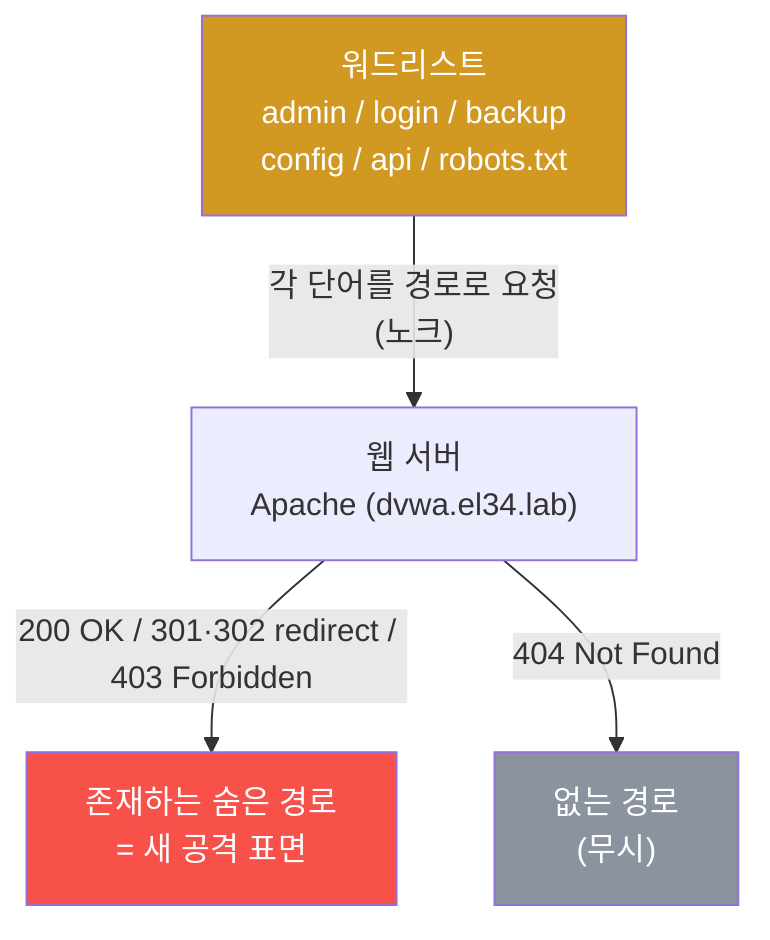
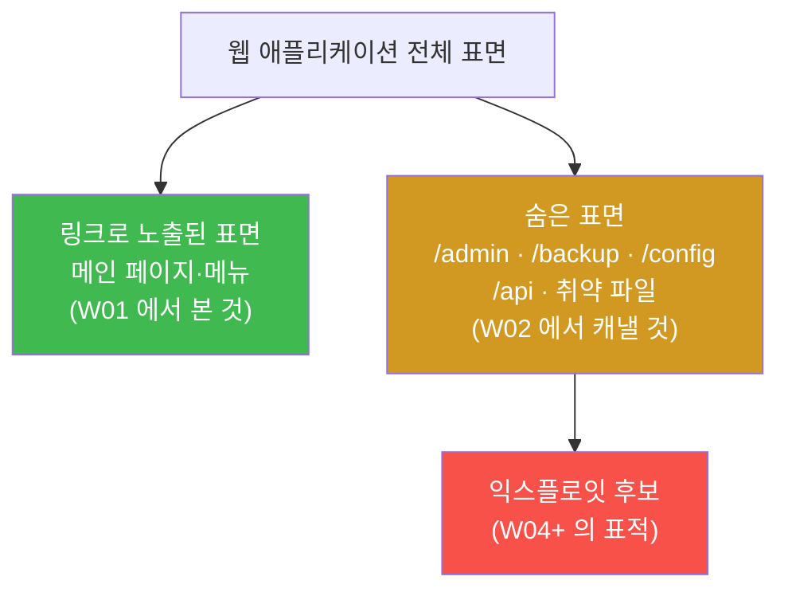
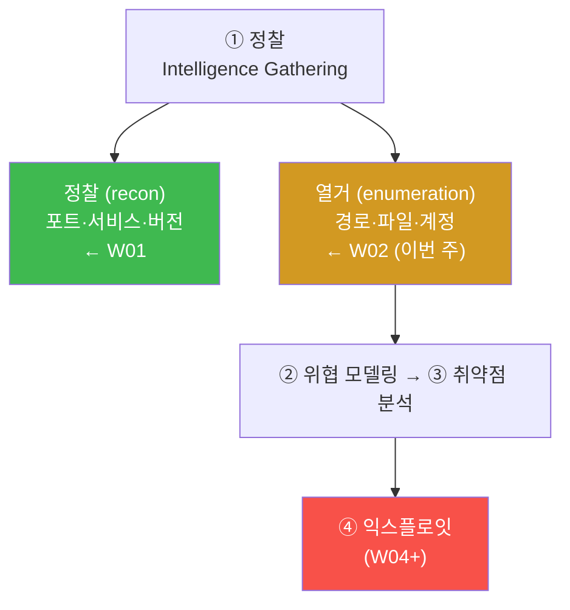
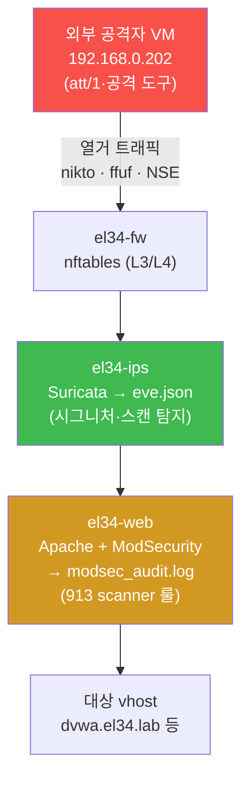
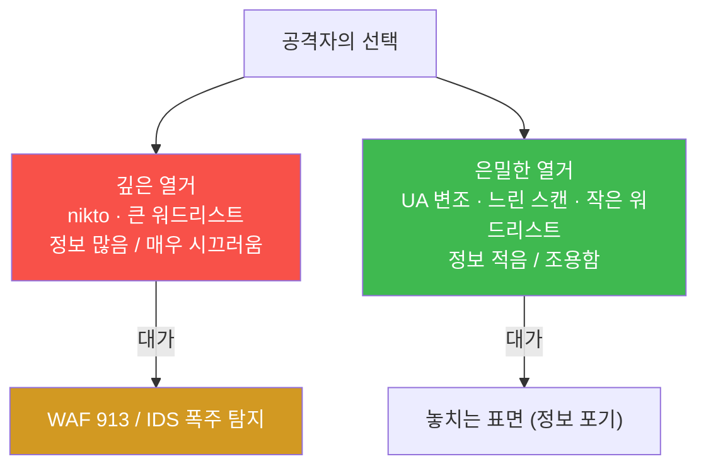
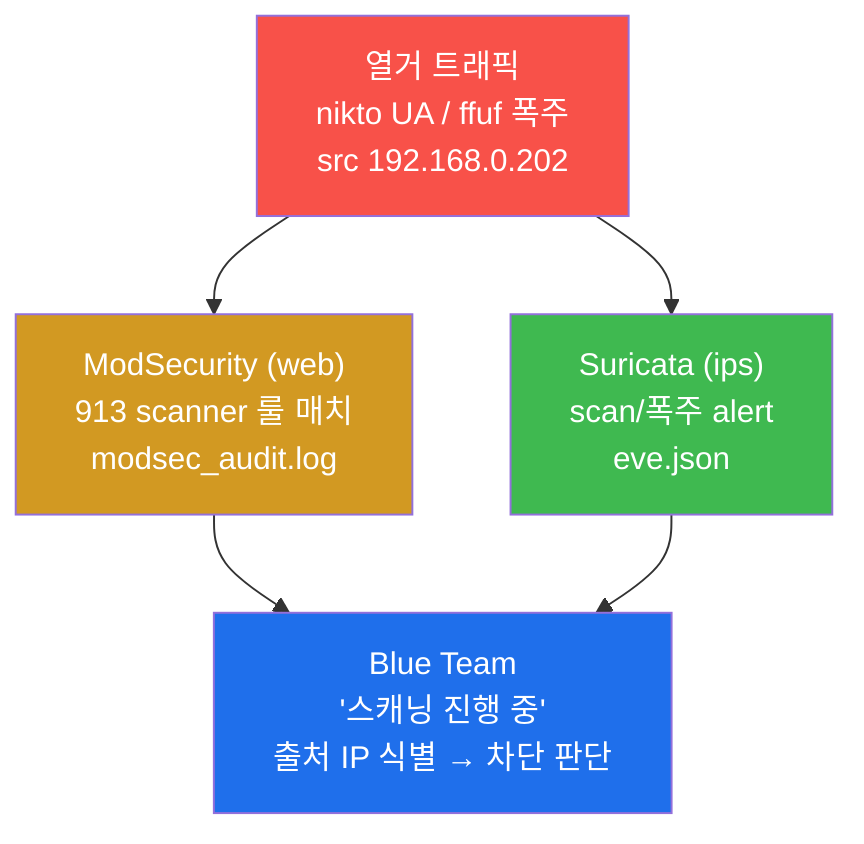

# 공격기법 W02 — 열거 심화: 디렉토리·콘텐츠 탐색 vs IDS/WAF 탐지

> **본 주차의 한 줄 요약**
>
> W01 에서 "어디가 열렸는가(포트·서비스)" 를 봤다면, W02 는 그 열린 문 **안쪽의 숨은 방**
> 을 찾는다. 웹 서버가 링크로 노출하지 않은 경로(`/admin`, `/backup`, `/config`)와 취약
> 파일을, 공격자 관점의 **열거(enumeration)** 도구 — nmap NSE 스크립트, nikto 웹 취약점
> 스캐너, ffuf 디렉토리 브루트포싱 — 으로 발굴한다. 동시에 이 깊은 정찰이 el34 의 방어
> 스택(Suricata IDS / Apache ModSecurity WAF)에 **얼마나 시끄럽게 잡히는지** 를 본인 눈으로
> 확인하여, "정보량 ↔ 은밀성" 의 trade-off 를 체득한다.

---

## 학습 목표

본 주차 종료 시 학생은 다음 6가지를 **본인 손으로** 할 수 있어야 한다.

1. 정찰(reconnaissance)과 열거(enumeration)의 차이를 PTES 방법론 안에서 한 문장으로
   구분해 설명하고, W01(포트 발견) → W02(콘텐츠 발견)의 연결을 그린다.
2. 외부 공격자 VM 192.168.0.202 컨테이너에서 nmap NSE 스크립트(`http-headers`, `http-title`)를 실행해
   수동 `curl` 로 하던 핑거프린팅을 자동화한다.
3. nikto 로 알려진 취약 파일·설정·보안 헤더 누락을 자동 점검하고, nikto 가 왜 "빠르지만
   시끄러운" 도구인지(User-Agent 노출) 설명한다.
4. ffuf 로 디렉토리 브루트포싱을 수행해, HTTP 상태코드(200/301/302/403)로 "존재하는
   숨은 경로" 와 "없는 경로(404)" 를 구별해낸다.
5. 본인이 방금 일으킨 열거 트래픽이 web 의 ModSecurity audit log(913 scanner 룰)와 ips 의
   Suricata eve.json 에 어떻게 출처 IP·시그니처로 남는지 추적한다.
6. 발견한 숨은 표면을 정리해 "확장된 공격 표면" 목록을 만들고, 깊이(정보량)와 은밀성
   (탐지 위험)의 trade-off 및 완화 기법(UA 변조·느린 스캔·작은 워드리스트)을 1페이지로
   보고한다.

---

## 0. 용어 해설 (열거 입문)

본 주차에서 처음 등장하는 핵심 용어를 먼저 정리한다. 본문에서 다시 막히면 이 표로 돌아와
확인하면 흐름이 끊기지 않는다.

| 용어 | 영문 | 뜻 | 비유 |
|------|------|----|------|
| **정찰** | Reconnaissance / Recon | 대상의 외형(포트·서비스·기술 스택)을 파악 | 건물 밖에서 창문·출입구 세어 보기 |
| **열거** | Enumeration | 대상 내부의 구체적 자원(경로·계정·파일)을 하나씩 끌어내기 | 건물 안 복도를 돌며 방 번호 적기 |
| **디렉토리 브루트포싱** | Directory brute-forcing | 후보 경로 단어를 대량으로 요청해 실제 존재하는 경로를 찾기 | 모든 방 문을 노크해 응답 있는 방 찾기 |
| **워드리스트** | Wordlist | 시도할 후보 단어(경로명)들을 한 줄에 하나씩 담은 파일 | 노크해 볼 방 번호 목록 |
| **NSE** | Nmap Scripting Engine | nmap 에 내장된 스크립트 자동화 엔진 | 정찰 드론에 장착한 자동 카메라 |
| **nikto** | — | 알려진 취약 파일·설정을 자동 점검하는 웹 스캐너 | 표준 점검 체크리스트를 든 점검원 |
| **ffuf** | Fuzz Faster U Fool | Go 로 작성된 초고속 웹 퍼저(brute-force 도구) | 자동 노크 기계 |
| **퍼징** | Fuzzing | 입력 위치(`FUZZ`)에 후보를 차례로 대입해 반응을 관찰 | 빈칸에 단어를 바꿔 끼우며 반응 보기 |
| **User-Agent (UA)** | — | HTTP 요청 헤더 중 클라이언트(브라우저·도구) 식별 문자열 | 방문객이 단 명찰 |
| **HTTP 상태코드** | Status code | 서버가 요청 결과를 알려주는 3자리 숫자(200/301/403/404 등) | 노크에 대한 응답(있음/이사함/거절/빈방) |
| **스캐너 탐지** | Scanner detection | WAF/IDS 가 스캐닝 도구 특유의 패턴을 탐지하는 룰군 | 점검원의 명찰을 알아보는 경비 |
| **ModSecurity** | ModSec | Apache 의 L7 웹 방화벽(WAF) 엔진 | 입구 금속탐지기 |
| **Suricata** | — | 페이로드를 검사하는 IDS/IPS(보안 카메라) | 통로 감시 카메라 |
| **PTES** | Penetration Testing Execution Standard | 침투 테스트 표준 7단계 방법론 | 침투 작전 표준 절차서 |
| **RoE** | Rules of Engagement | 교전 규칙(허용 범위·시간·방법) | 훈련 안전 수칙 |

### 0.5 헷갈리기 쉬운 핵심 — 정찰 vs 열거, 그리고 노크 비유

신입생이 가장 자주 헷갈리는 것이 **정찰(recon)** 과 **열거(enumeration)** 의 차이다. 둘은
연속된 단계라 경계가 흐릿해 보이지만, 공격자의 작업 단위가 다르다.

학생이 어느 낯선 건물을 침입 대상으로 삼았다고 하자.

- **정찰(W01)** 은 건물 **밖에서** 하는 일이다. 창문이 몇 개인지, 정문·후문·비상구가 어디
  있는지, 간판으로 보아 무슨 업종인지를 센다. 네트워크로 치면 "어떤 포트가 열려 있고
  (80/443), 무슨 서비스·버전이 떠 있는가(Apache 2.4)" 를 보는 단계다.
- **열거(W02)** 는 건물 **안으로** 한 발 들어가서, 복도를 돌며 방 하나하나의 번호와 용도를
  적는 일이다. 네트워크로 치면 "80 포트로 열린 그 웹 서버 **안에** `/admin`, `/backup`,
  `/config.php` 같은 경로가 실제로 존재하는가" 를 끌어내는 단계다.

핵심 차이를 한 줄로 요약하면 — **정찰은 "문이 어디 있나", 열거는 "그 문 안에 방이 몇 개고
뭐가 있나"** 다. 열거가 더 깊은 만큼 더 많은 요청을 보내야 하고, 그래서 더 시끄럽다.

**디렉토리 브루트포싱 = 모든 방을 노크하기.** 웹 서버는 자기가 가진 모든 경로를 친절히
목록으로 보여주지 않는다. 메인 페이지에 링크된 경로만 외부에 드러날 뿐, `/admin` 같은
관리 경로는 링크 없이 숨어 있다. 그래서 공격자는 "있을 법한 경로 단어" 를 잔뜩 모은
**워드리스트** 를 들고, 한 단어씩 서버에 요청을 던져 본다. 비유하자면 복도의 **모든 문을
차례로 노크** 하는 것이다. 서버의 응답(HTTP 상태코드)이 곧 노크에 대한 반응이다.



**상태코드를 읽는 법(이번 주의 핵심 기술).** 노크에 대한 응답 종류를 아는 것이 열거의
전부라 해도 과언이 아니다. 자주 만나는 4가지는 다음과 같다.

| 상태코드 | 이름 | 노크 비유 | 공격자에게 주는 의미 |
|---------|------|-----------|---------------------|
| **200** | OK | "들어오세요" — 문이 열림 | 경로가 존재하고 접근 가능 → 1순위 표적 |
| **301 / 302** | Moved / Found (redirect) | "그 방은 옆으로 옮겼어요" | 경로가 존재(다른 곳으로 안내) → 추적 가치 |
| **403** | Forbidden | "방은 있지만 못 들어와요" | 경로가 **존재** 하나 권한 차단 → 권한 우회 표적 |
| **404** | Not Found | "그런 방 없어요" | 경로 없음 → 무시 |

여기서 신입생이 가장 자주 놓치는 점 — **403 은 "실패" 가 아니라 "발견" 이다.** 404 와 403
은 둘 다 콘텐츠를 안 주지만, 의미가 정반대다. 404 는 "그런 경로 자체가 없다" 이고, 403 은
"경로는 분명히 있는데 지금 너에게는 권한이 없다" 이다. 공격자에게 403 은 "여기 뭔가
중요한 게 숨어 있다" 는 강한 신호다. 그래서 ffuf 로 열거할 때 200 뿐 아니라 401(인증 필요)
·403 까지 함께 "발견" 으로 잡는다.

---

## 1. 이번 주의 통찰 — 표면 아래를 판다

### 1.1 한 줄 답: 노출된 표면만 공격하면 절반밖에 못 본다

웹 애플리케이션의 공격 표면(attack surface)은 **메인 페이지에서 링크로 보이는 것** 이 전부가
아니다. 운영자가 일부러 숨겨 둔 관리 콘솔(`/admin`), 백업 파일(`/backup.zip`), 설정 파일
(`/config.php.bak`), 개발용 API(`/api/v1`) 같은 것들은 링크 없이 존재한다. 이런 숨은 경로가
오히려 인증이 허술하거나 민감 정보를 담고 있어, 실제 침해의 출발점이 되는 경우가 많다.



그래서 W02 의 목표는 한 문장이다 — **링크 너머의 숨은 표면을 끌어내 익스플로잇 후보를
넓힌다.** 더 깊은 열거 = 더 많은 익스플로잇 기회. 단, 그 대가는 "시끄러움" 이다.

### 1.2 W01 → W02 — PTES 안에서의 위치

W01 에서 PTES(Penetration Testing Execution Standard, 침투 테스트 표준 7단계) 의 1단계
"정찰(Intelligence Gathering)" 을 시작했다. W02 는 **여전히 같은 정찰 단계의 심화** 다.
정찰 단계는 다시 두 결로 나뉜다 — 표면을 훑는 **정찰(recon)** 과, 자원을 끌어내는
**열거(enumeration)** 다.



> ⚠️ **인가된 실습만.** 이 트랙의 모든 명령은 **el34 학습 환경** 안에서만 실행한다. 디렉토리
> 브루트포싱과 취약점 스캐닝은 대상에 수백~수천 건의 요청을 보내는 행위라, 인가받지 않은
> 외부 시스템에 실행하면 명백한 불법(공격 행위)이다. RoE(Rules of Engagement, 교전 규칙 —
> 허용 범위·시간·방법) 를 반드시 지킨다. 본 강의의 대상은 오직 el34 의 vhost(`*.el34.lab`)다.

### 1.3 공방 통합 — 공격하며 방어를 본다

el34 인프라의 핵심 특성은 **공격자의 출처 IP 를 fw → ips → web 전 계층에 보존** 한다는
점이다(구 6v6 인프라는 게이트웨이 IP 로 치환되어 출처가 가려졌다). 덕분에 학생은 공격을
일으키는 동시에, **그 공격이 방어 스택에 어떻게 보이는지** 를 같은 화면에서 추적할 수 있다.
공격 과목이지만 방어 가시성을 함께 배우는 이유다 — 좋은 공격자는 자기 행동이 어떻게
탐지되는지 알아야 회피의 출발점을 잡는다.



---

## 2. nmap NSE — 핑거프린팅 자동화

**한 줄 정의.** NSE(Nmap Scripting Engine)는 nmap 에 내장된 스크립트 실행 엔진으로, 단순
포트 스캔을 넘어 서비스의 상세 정보 수집·취약점 점검·심지어 일부 익스플로잇까지 자동화한다.

**왜 중요한가.** W01 에서는 `nc`(raw HTTP) 로 한 번에 한 vhost 씩 손으로 HTTP 헤더를 확인했다.
NSE 는 이 수작업을 스크립트로 자동화한다. 같은 정보를 더 빠르고 일관되게, 여러 대상에 대해
한 번에 수집할 수 있다.

**el34 에서 어떻게.** 외부 공격자 VM 192.168.0.202 컨테이너에 nmap 이 완비되어 있다. 본 주차에서 쓰는 두
스크립트는 다음과 같다.

```bash
nmap -sV --script=http-headers,http-title -p 80 192.168.0.161 -T4 --max-retries 1
```

각 옵션의 의미를 풀면 다음과 같다.

- `-sV` — 서비스/버전 식별(W01 에서 본 것). 포트 뒤에 떠 있는 소프트웨어와 버전을 알아낸다.
- `--script=http-headers,http-title` — 실행할 NSE 스크립트를 콤마로 지정한다.
  - `http-headers` — 웹 서버가 돌려주는 HTTP 응답 헤더(예: `Server: Apache/2.4`)를 수집한다.
  - `http-title` — 웹 페이지의 `<title>` 태그 내용을 수집해, 어떤 애플리케이션인지 단서를 준다.
- `-p 80` — 80 포트(HTTP)를 대상으로.
- `192.168.0.161` — el34 의 fw 내부 게이트웨이 주소(여기로 보내면 fw → ips → web 으로 forward).
- `-T4` — timing 템플릿 4(aggressive). nmap 은 `-T0`(매우 느림·은밀) ~ `-T5`(매우 빠름·시끄러움)
  의 5단계 속도가 있고, `-T4` 는 빠른 편이다.
- `--max-retries 1` — 응답 없는 포트의 재시도를 1회로 제한해 스캔을 빠르게 마친다.

**결과 해석.** `Server:` 헤더로 웹 서버 종류·버전을, `http-title` 로 애플리케이션 정체를
짐작한다. 예컨대 title 에 "DVWA" 가 보이면 그 vhost 가 DVWA(취약 실습 앱)임을 알 수 있다.

**한계/주의.** NSE 의 일부 카테고리(특히 `vuln`)는 능동적으로 취약점을 찔러 보므로 매우
시끄럽다. 스캔이 깊을수록 보내는 요청이 늘어 Suricata 의 탐지 가능성이 올라간다. 그래서
실전 공격자는 필요한 스크립트만 **선별** 해서 돌린다.

---

## 3. nikto — 웹 취약점 자동 스캐너

**한 줄 정의.** nikto 는 웹 서버를 상대로 "알려진 취약 파일·위험한 설정·누락된 보안 헤더"
수천 항목을 자동으로 점검하는 오픈소스 스캐너다. 점검원이 표준 체크리스트를 들고 건물을
훑는 것에 비유할 수 있다.

**왜 중요한가.** 사람이 손으로 `/admin.php`, `/phpinfo.php`, `/.git/`, `/server-status`
같은 위험 경로를 일일이 확인하려면 오래 걸린다. nikto 는 이 점검 항목 데이터베이스를 들고
한 번에 자동 점검해, "이 서버에 알려진 위험 요소가 있는가" 를 수 분 안에 답한다.

**el34 에서 어떻게.** 외부 공격자 VM 192.168.0.202 에 nikto 가 설치되어 있다.

```bash
nikto -h http://dvwa.el34.lab -maxtime 30s 2>&1 | head -15
```

- `-h http://dvwa.el34.lab` — 점검 대상(자연 URL, /etc/hosts → 192.168.0.161). 호스트명으로 보내면 내부 web 까지 전달된다.
- `-maxtime 30s` — 최대 실행 시간을 30초로 제한한다(전체 점검은 수십 분이 걸릴 수 있어, 실습에서는 시간을 끊는다).
- `2>&1 | head -15` — 표준에러까지 합쳐 앞 15줄만 본다(결과가 길기 때문).

**결과 해석.** nikto 의 출력 각 줄은 발견한 항목이다 — 예: "서버에 `X-Frame-Options` 헤더가
없다(클릭재킹 위험)", "`/icons/README` 가 노출되어 있다", "OSVDB-xxxx: 취약 파일 발견" 등.
각 항목이 곧 추가 조사 대상이다.

**한계/주의 — nikto 는 빠르지만 매우 시끄럽다.** nikto 의 가장 큰 특징은, 요청의 User-Agent
(UA — 클라이언트를 식별하는 HTTP 헤더 문자열)에 기본적으로 **`Nikto`** 라는 이름을 그대로
박아 넣는다는 점이다. 그래서 WAF(ModSecurity)의 **스캐너 탐지 룰군(913 — 알려진 스캐닝 도구를
잡는 CRS 룰)** 에 거의 즉시, 그리고 명확하게 걸린다. 또한 짧은 시간에 수천 건을 보내므로
요청 폭주로 IDS 에도 남는다. 즉 nikto 는 "정보는 많이 주지만, 내가 스캔 중임을 대놓고
광고하는" 도구다.

---

## 4. 디렉토리 브루트포싱 — 숨은 경로를 캐다 (ffuf)

### 4.1 개념과 도구 선택

**한 줄 정의.** 디렉토리 브루트포싱은 워드리스트(후보 경로 단어 목록)의 각 단어를 차례로
URL 경로에 끼워 요청을 보내, 서버의 응답 상태코드로 "실제 존재하는 숨은 경로" 를 찾아내는
기법이다(§0.5 의 "모든 방 노크하기").

**왜 중요한가.** §1.1 에서 봤듯 숨은 경로는 메인 페이지 링크에 없다. 브루트포싱은 이 보이지
않는 표면을 끌어내는 가장 직접적인 방법이다.

**도구 선택 — el34 에서는 ffuf 를 쓴다.** 디렉토리 브루트포싱의 대표 도구로 gobuster 와
ffuf 가 있다.

- **gobuster** — Go 로 작성된 디렉토리/DNS 브루트포서. 널리 쓰이지만, **외부 공격자 VM 192.168.0.202 에
  설치된 gobuster 는 인자 처리 버그가 있어 정상 동작하지 않는다.** 따라서 본 실습에서는
  사용하지 않는다.
- **ffuf** (Fuzz Faster U Fool) — Go 로 작성된 초고속 웹 퍼저(fuzzer). 입력 위치를 `FUZZ`
  라는 키워드로 표시하고, 워드리스트의 각 단어를 그 자리에 대입(퍼징)하며 요청을 보낸다.
  외부 공격자 VM 192.168.0.202 에서 안정적으로 동작하므로 **본 주차의 표준 도구** 다.

> **퍼징(fuzzing)이란?** 입력의 특정 위치에 후보 값을 차례로 바꿔 끼우며 시스템의 반응을
> 관찰하는 기법이다. ffuf 에서는 URL 의 `FUZZ` 자리에 워드리스트 단어를 하나씩 대입한다.
> 예: `http://.../FUZZ` 에 워드리스트가 `admin`, `login`, `backup` 이면 ffuf 는 실제로
> `/admin`, `/login`, `/backup` 세 경로를 요청한다.

### 4.2 el34 의 ffuf 명령 — 한 줄씩 해부

el34 에서 검증된 ffuf 명령은 다음 형태다(이것이 본 lab 의 정답 명령이며, 정확히 이 형식을
쓴다).

```bash
ffuf -u http://dvwa.el34.lab/FUZZ -w /tmp/aw2.txt -mc 200,301,302,403 -s
```

각 옵션의 의미는 다음과 같다.

- `-u http://dvwa.el34.lab/FUZZ` — 대상 URL(자연 URL). 경로 자리에 `FUZZ` 키워드를 둔다 → 워드리스트 각
  단어가 이 자리에 대입된다.
- `-w /tmp/aw2.txt` — 워드리스트(wordlist) 파일. 시도할 경로 후보가 한 줄에 하나씩 들어 있다.
- 대상은 **자연 URL `http://dvwa.el34.lab/`** 로 지정한다. 공격 VM 의 `/etc/hosts` 가
  `dvwa.el34.lab` 를 192.168.0.161 로 풀어 주고, 호스트명이 곧 `Host` 헤더가 되어(W01 의 vhost
  라우팅) web 의 Apache 가 요청을 DVWA vhost 로 보낸다. `-H "Host:"` + 생 IP 반복이 불필요하다.
- `-mc 200,301,302,403` — **m**atch **c**ode. 이 상태코드로 응답한 결과만 "발견" 으로
  출력한다. §0.5 에서 본 대로 200(OK)·301/302(redirect)·403(Forbidden)은 모두 "경로가
  존재한다" 는 신호다. 404 는 자동으로 걸러진다.
- `-s` — **s**ilent 모드. 진행 막대·배너 등 잡음을 끄고 발견된 경로만 깔끔히 출력한다.

> **el34 사실(정확히 기억).** el34 에서 동작 검증된 ffuf 사용 형태는
> `ffuf -u .../FUZZ -w <wordlist> -mc 200,401[,...] -s` 이다. `FUZZ` 자리·`-w` 워드리스트·
> `-mc` 매칭 코드·`-s` 사일런트가 핵심 4요소다. 인증이 걸린 경로를 함께 잡으려면 매칭 코드에
> **401(Unauthorized)** 을 추가하기도 한다.

본 실습은 작은 워드리스트를 그 자리에서 만들어 쓴다(외부 워드리스트 의존을 줄이고, 무엇을
시도하는지 명시적으로 보이게 하기 위함).

```bash
# 워드리스트 생성 → ffuf 실행 → 정리
printf "admin\nlogin\nindex.php\nrobots.txt\nconfig\nbackup\napi\n" > /tmp/aw2.txt
ffuf -u http://dvwa.el34.lab/FUZZ -w /tmp/aw2.txt -mc 200,301,302,403 -s
rm -f /tmp/aw2.txt
```

**결과 해석.** ffuf 가 출력하는 각 경로가 "존재하는 숨은 경로" 다. DVWA 에서는 보통
`login.php`(200) 같은 항목이 잡힌다. 출력된 각 경로 옆에는 매칭된 상태코드가 함께 보이므로,
200(바로 접근 가능)인지 403(권한 차단 — 더 흥미로움)인지 구분해 우선순위를 매긴다.

**한계/주의.** 디렉토리 브루트포싱은 본질적으로 **대량 요청** 이다. 워드리스트가 7줄이면
요청 7건이지만, 실전의 워드리스트는 수천~수만 줄이라 요청이 폭주한다. 이 폭주는 web 의
vhost별 access.log 와 ips 의 eve.json 에 고스란히 남는다 — 가장 시끄러운 열거 기법 중 하나다.

---

## 5. 탐지 trade-off — 깊이 vs 은밀

### 5.1 핵심 원리

심화 열거는 정보를 많이 주지만, 그만큼 방어 스택에 흔적을 많이 남긴다. 공격자의 모든
의사결정은 결국 두 축의 저울질이다 — **"얼마나 알아낼 수 있나(정보량)"** 와 **"얼마나
들킬까(탐지 위험)"**.



### 5.2 기법별 trade-off 비교

| 기법 | 정보량 | 탐지 위험 | 시끄러운 이유 | 완화(고급) |
|------|--------|-----------|--------------|-----------|
| **nikto** | 높음 | 매우 높음 | UA 에 `Nikto` 노출 → WAF 913 즉시 매치 | UA 변조, 느린 스캔(`-Pause`) |
| **디렉토리 브루트** | 높음 | 높음 | 단시간 대량 요청(폭주) | rate-limit, 작은 워드리스트, 분산 |
| **nmap NSE** | 중간 | 중간 | 스크립트가 능동 요청 발생 | 필요한 스크립트만 선별 |

여기서 중요한 통찰은 **회피는 공짜가 아니다** 라는 점이다. UA 를 위장하거나 스캔을 느리게
하면 탐지는 줄지만, 그만큼 정보 수집 속도·범위를 포기한다. 작은 워드리스트는 조용하지만
숨은 경로를 놓칠 수 있다. 실전 공격자는 이 trade-off 를 대상의 방어 수준에 맞춰 조절한다.

### 5.3 방어 측 관점 — 이 흔적을 어떻게 보는가

방어자(Blue Team)는 거꾸로 이 흔적을 단서로 삼는다. el34 에서 본인 열거의 흔적은 두 곳에서
확인한다.

- **web 의 ModSecurity audit log** (`/var/log/apache2/modsec_audit.log`) — nikto 의 UA 가
  913 스캐너 룰에 매치된 기록이 남는다. 913 은 CRS(OWASP Core Rule Set)의 "scanner detection"
  룰군 번호다(나머지 룰군: 941=XSS, 942=SQLi 등은 W05 에서 상세히 다룬다).
- **ips 의 Suricata eve.json** (`/var/log/suricata/eve.json`) — 출처 IP(공격자 192.168.0.202)
  에서 폭주한 요청이 alert 로 남는다. el34 는 출처 IP 를 보존하므로, alert 의 `src_ip` 가
  실제 공격자 주소 그대로다.



---

## 6. 실습 안내 (총 8 미션)

각 실습(lab step)은 다음 **4축** 으로 설명한다 — (1) 왜 하는가 (2) 무엇을 알 수 있는가
(3) 결과 해석(정상 vs 비정상) (4) 실전 활용. 모든 명령은 el34 호스트
(`ssh ccc@192.168.0.80`, 비밀번호 1)에서 `ssh att@192.168.0.202 ...` 형태로 실행하며,
**인가된 el34 환경에서만** 한다.

### 실습 1 — 심화 열거 도구 점검 (lab order 1)

> **왜 하는가?** 본격 열거에 앞서 nikto·gobuster·ffuf 가 외부 공격자 VM 192.168.0.202 에 설치되어 있는지
> 확인한다. 도구 부재를 모르고 진행하면 이후 미션이 줄줄이 실패한다.
>
> **무엇을 알 수 있는가?** 세 도구의 설치 경로(`command -v` 가 실행 파일 경로를 출력). 특히
> gobuster 는 설치는 되어 있으나 버그로 못 쓰므로(§4.1), 실제로는 ffuf 를 쓸 것임을 미리 확인.
>
> **결과 해석.** `command -v nikto` 가 경로(예: `/usr/bin/nikto`)를 출력하면 정상. 아무것도
> 안 나오면 해당 도구 미설치 → 진행 불가.
>
> **실전 활용.** 침투 현장에 투입된 첫 단계는 항상 "내 도구 상자에 무엇이 있는가" 점검이다.

명령은 `command -v nikto; command -v gobuster; command -v ffuf` 로, 세 도구의 가용성을 한
번에 확인한다.

### 실습 2 — nmap NSE 스크립트 스캔 (lab order 2)

> **왜 하는가?** 수동 `curl` 핑거프린팅(W01)을 NSE 스크립트로 자동화하는 첫 경험.
>
> **무엇을 알 수 있는가?** `http-headers`·`http-title` 가 수집한 HTTP 헤더(`Server:` 등)와
> 페이지 타이틀 → 대상 웹의 기술 스택·정체.
>
> **결과 해석.** 출력에 `http`/`Server`/`title` 관련 줄이 보이면 NSE 수집 성공. 아무 HTTP
> 정보도 없으면 포트 미개방 또는 스크립트 미동작.
>
> **실전 활용.** 다수 대상을 일괄 핑거프린팅할 때 NSE 가 손작업을 대체한다.

§2 의 명령(`nmap -sV --script=http-headers,http-title -p 80 ...`)을 그대로 사용한다.

### 실습 3 — nikto 웹 취약점 스캔 (lab order 3)

> **왜 하는가?** 알려진 취약 파일·설정·보안 헤더 누락을 자동 점검하고, nikto 가 왜 시끄러운
> 도구인지(UA 노출) 체득한다.
>
> **무엇을 알 수 있는가?** 대상 웹의 알려진 위험 요소 목록(취약 파일/헤더 누락). 동시에
> nikto 의 UA(`Nikto`)가 노출된다는 사실.
>
> **결과 해석.** 출력에 `Nikto` 배너와 발견 항목이 보이면 스캔 성공. 발견 항목 각 줄이 추가
> 조사 대상이다.
>
> **실전 활용.** 웹 서버의 1차 취약점 스냅샷을 수 분에 얻는다. 단 은밀성이 필요하면 부적합.

§3 의 명령(`nikto -h http://dvwa.el34.lab -maxtime 30s`)을 사용한다.

### 실습 4 — 디렉토리 브루트포싱으로 숨은 경로 발견 (lab order 4)

> **왜 하는가?** 링크로 노출되지 않은 숨은 경로(`/login`, `/admin` 등)를 ffuf 로 끌어낸다 —
> 본 주차의 핵심 기술.
>
> **무엇을 알 수 있는가?** 워드리스트 각 단어에 대한 서버 응답 상태코드. `-mc 200,301,302,403`
> 에 매칭된 경로가 "존재하는 숨은 표면" 이다.
>
> **결과 해석.** 출력에 `login`(또는 다른 경로)이 보이면 발견 성공. 상태코드를 함께 읽어
> 200(접근 가능)/403(권한 차단 — 더 흥미로움)을 구분한다. 아무것도 안 나오면 워드리스트가
> 대상과 안 맞거나 vhost(`Host` 헤더) 지정 누락.
>
> **실전 활용.** 실전에서는 대형 워드리스트로 관리 콘솔·백업·설정 파일을 발굴해 익스플로잇
> 표적으로 삼는다. 단 대량 요청이라 매우 시끄러움을 인지한다.

§4.2 의 ffuf 명령(`ffuf -u http://dvwa.el34.lab/FUZZ -w /tmp/aw2.txt -mc 200,301,302,403 -s`)을
사용한다. 외부 공격자 VM 192.168.0.202 의 gobuster 는 버그로 못 쓰므로 반드시 ffuf 를 쓴다.

### 실습 5 — 방어 탐지 확인: 열거의 흔적 (lab order 5)

> **왜 하는가?** 방금 일으킨 열거가 방어 스택에 어떻게 잡히는지 본인 눈으로 확인한다 —
> "깊이의 대가는 탐지" 를 실증.
>
> **무엇을 알 수 있는가?** web 의 ModSecurity audit log 에서 nikto UA·913 스캐너 룰 매치
> 건수, ips 의 Suricata eve.json 에서 출처 IP(192.168.0.202)별 alert 건수.
>
> **결과 해석.** modsec_audit.log 에 `nikto` 또는 `913xxx` 가 다수 보이면 정상 탐지(=내가
> 시끄러웠다는 증거). eve.json 에 공격자 IP 의 alert 가 쌓여 있어야 정상.
>
> **실전 활용.** Blue Team 은 바로 이 흔적으로 스캐닝을 탐지·차단한다. 공격자는 이를 알아야
> 회피를 설계한다.

명령은 `modsec_audit.log` 에서 `nikto|913[0-9]{3}` 를 집계하고, eve.json 에서 공격자
출처 IP 의 alert 를 집계한다. 이 미션은 web/ips 로그를 읽으므로 `target_vm: web` 이다.

### 실습 6 — 숨은 표면 매핑 (lab order 6)

> **왜 하는가?** 흩어진 발견(숨은 경로 + nikto 취약점 + NSE 스택)을 하나의 "확장된 공격
> 표면" 으로 정리한다.
>
> **무엇을 알 수 있는가?** W01 의 기본 표면 + W02 의 숨은 표면 = 익스플로잇 후보 전체 목록.
>
> **결과 해석.** 출력에 "표면" 정리(숨은 경로·취약점·스택)가 포함되면 합격. 단순 명령 실행이
> 아니라 발견을 종합하는 관리적 산출물이다.
>
> **실전 활용.** 이 표면 목록이 다음 단계(W04+ 익스플로잇)의 표적 리스트가 된다.

### 실습 7 — 탐지 trade-off 정리 (lab order 7)

> **왜 하는가?** §5 의 "깊이 vs 은밀" trade-off 를 본인 말로 정리해 의사결정 기준을 내재화한다.
>
> **무엇을 알 수 있는가?** 기법별 정보량·탐지 위험·완화 기법의 대응 관계. 회피가 정보 포기를
> 동반한다는 점.
>
> **결과 해석.** 출력에 `trade-off` 와 완화 기법(UA 변조·느린 스캔·작은 워드리스트)이 함께
> 보이면 합격.
>
> **실전 활용.** 실전에서 "지금은 빠르게 다 캘까, 조용히 일부만 캘까" 를 판단하는 기준.

### 실습 8 — 심화 열거 종합 보고서 (lab order 8)

> **왜 하는가?** 정찰/열거 단계의 산출물을 하나의 보고서로 종합한다 — PTES 의 마지막 단계
> (보고)의 축소판.
>
> **무엇을 알 수 있는가?** NSE/nikto/ffuf 결과, 확장된 공격 표면, 방어 탐지, trade-off 를
> 한 문서로 엮는 능력.
>
> **결과 해석.** 보고서에 도구 결과 + 표면 + 탐지 + trade-off 4요소가 모두 들어가면 합격.
>
> **실전 활용.** 실제 침투 테스트의 정찰 단계 보고서가 이 양식을 따른다.

---

## 7. 다음 주차 (W03) 예고 — 웹앱 구조·API·JWT 공격

W02 는 웹 서버의 표면을 깊게 파서 숨은 경로·취약 파일을 끌어냈다. W03 은 그 경로 너머
**웹 애플리케이션의 내부 구조** 로 들어간다 — API 엔드포인트의 설계, JWT(JSON Web Token)
인증 토큰의 약점을 공격하고, 그 API 남용이 방어 스택에 어떻게 탐지되는지 본다. W02 에서
발견한 `/api` 같은 숨은 경로가 W03 의 실제 표적이 된다.
