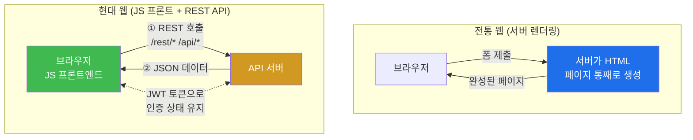
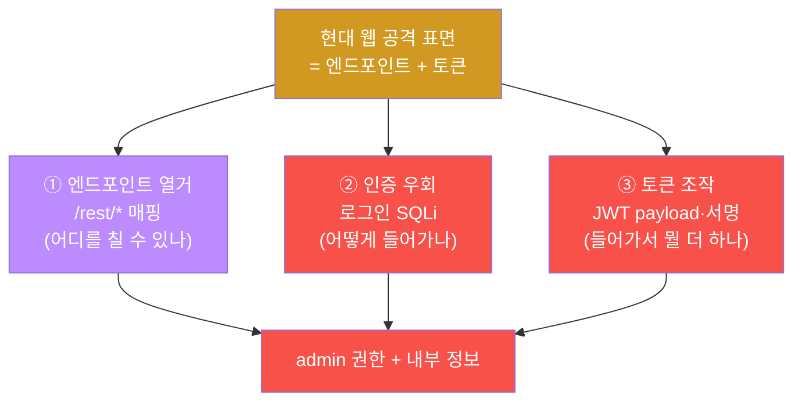
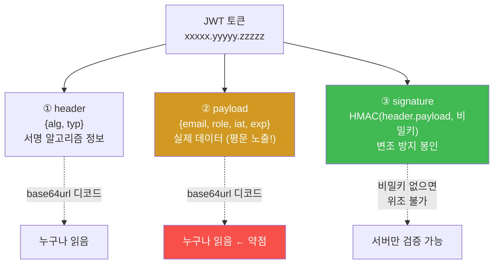
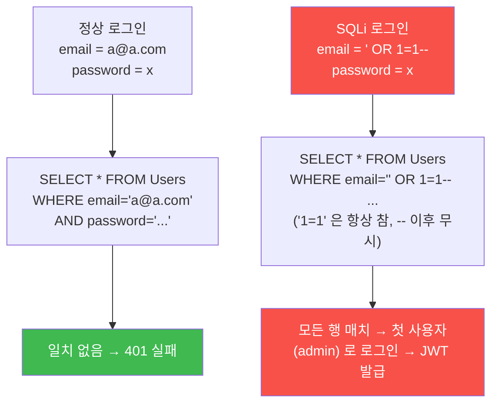
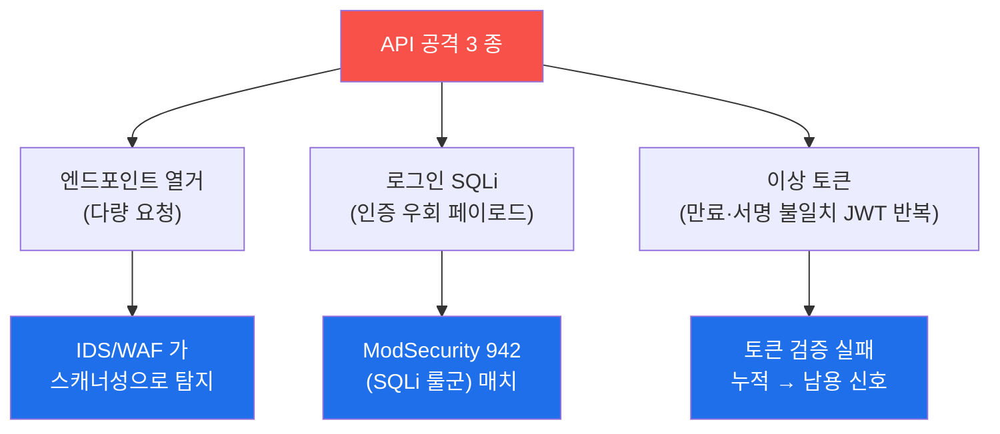

# 공격기법 W03 — 웹앱 구조·REST API·JWT 공격 vs API 남용 탐지

> **본 주차의 한 줄 요약**
>
> "현대 웹은 사실상 API 다." 라는 명제를 학생은 OWASP Juice Shop(`juice.el34.lab`) 을
> 직접 공격하면서 체감한다. 전통적 폼 기반 웹과 달리 현대 웹앱은 **REST API + 토큰
> 인증(JWT)** 으로 동작하므로, 공격 표면이 화면의 폼이 아니라 `/rest`, `/api`
> 엔드포인트와 그 사이를 오가는 토큰으로 옮겨갔다. 본 주차에는 API 엔드포인트 열거 →
> 로그인 SQL Injection 으로 인증 우회 → 발급된 JWT 의 payload 디코드(내용 노출) →
> 그 공격들이 방어 스택(ModSecurity/Suricata)에 어떻게 보이는지까지 한 사이클을 돈다.

---

## 학습 목표

본 주차 종료 시 학생은 다음 6가지를 **본인 손으로** 할 수 있어야 한다.

1. 전통 웹(서버 렌더링)과 현대 웹(JS 프론트엔드 + REST API + JWT)의 구조 차이를, 공격
   표면이 어디로 이동했는지를 들어 1분 안에 설명한다.
2. `ffuf` 로 `juice.el34.lab` 의 REST API 엔드포인트(`/rest/*`)를 열거하여 공격
   표면(어떤 엔드포인트가 200/401/500 을 돌려주는가)을 매핑한다.
3. 로그인 API 에 SQL Injection(`' OR 1=1--`)을 넣어 인증을 우회하고, 응답의
   `authentication.token` 으로 admin 권한 JWT 를 획득한다(OWASP A07 인증 실패).
4. 획득한 JWT 를 `header.payload.signature` 세 부분으로 분해하고, payload 를 base64url
   디코드하여 서명 검증 없이 내부 정보(email 등)가 노출됨을 직접 확인한다.
5. JWT 의 4대 약점(payload 평문 노출 / `alg:none` 서명 우회 / 약한 HMAC 키 brute / 만료·
   서명 미검증)을 각각의 방어책과 짝지어 설명한다.
6. 자신이 일으킨 로그인 SQLi 와 API 열거가 방어층에 어떻게 남는지(ModSecurity 942 룰
   매치, Suricata 의 다량 요청 흔적)를 추적하고, "공격자가 자기 흔적을 안다" 는 관점에서
   탐지 회피의 출발점을 정리한다.

> ⚠️ **인가된 실습만.** 본 트랙의 모든 공격은 **el34 실습 환경(`juice.el34.lab` 등)** 안에서만
> 수행한다. 학생 본인 소유가 아닌 실제 시스템에 대한 무단 공격은 명백한 불법이며, 교전 규칙
> (RoE — 범위·시간·방법의 사전 합의)을 벗어난 행위는 본 과정의 평가 대상이 아니다.

---

## 0. 용어 해설 (API·토큰 인증 입문)

본 절은 W03 에서 처음 등장하는 용어를 한자리에 모아 풀이한다. 본문에서 막히면 이 표로
돌아오면 흐름이 끊기지 않는다.

| 용어 | 영문 | 뜻 | 비유 |
|------|------|----|------|
| **API** | Application Programming Interface | 프로그램끼리 정해진 형식으로 주고받는 창구 | 식당 주방 주문 창구 |
| **REST API** | Representational State Transfer | HTTP 메서드(GET/POST…)와 URL 로 자원을 다루는 API 설계 양식 | 메뉴판처럼 표준화된 주문서 |
| **엔드포인트** | endpoint | API 가 노출하는 개별 URL 경로(예: `/rest/user/login`) | 주문 창구의 각 메뉴 |
| **JSON** | JavaScript Object Notation | `{"key":"value"}` 형식의 데이터 표현 | 표준 양식의 서류 |
| **인증** | Authentication | "너 누구냐" 를 확인하는 절차(로그인) | 신분증 확인 |
| **인가** | Authorization | "이걸 할 권한이 있냐" 를 확인하는 절차 | 출입증 등급 확인 |
| **토큰** | token | 인증을 통과했다는 증표. 이후 요청마다 제시 | 콘서트 입장 팔찌 |
| **JWT** | JSON Web Token | 서명된 JSON 토큰. `header.payload.signature` 구조 | 위·변조 방지 봉인이 찍힌 입장권 |
| **base64url** | — | 바이트를 URL 에 안전한 문자로 바꾼 인코딩(암호화 아님) | 누구나 풀 수 있는 포장지 |
| **서명** | signature | 토큰이 변조되지 않았음을 증명하는 검증값 | 봉인 스티커 |
| **HMAC** | Hash-based Message Authentication Code | 비밀키 + 해시로 만드는 서명 방식(JWT 의 `HS256`) | 비밀 도장 |
| **SQL Injection** | SQLi | 입력값에 SQL 조각을 끼워 질의를 조작 | 신청서 빈칸에 명령문 끼워넣기 |
| **인증 우회** | Authentication Bypass | 정상 자격 없이 로그인에 성공 | 신분증 없이 통과 |
| **Fuzzing** | fuzzing | 후보 목록을 자동으로 던져 존재 여부를 떠보는 기법 | 열쇠 꾸러미로 문 다 돌려보기 |
| **OWASP** | Open Worldwide Application Security Project | 웹 보안 비영리 단체. Top 10 위험 목록으로 유명 | 웹 보안 표준 협회 |
| **OWASP A07** | — | OWASP Top 10(2021)의 "Identification & Authentication Failures" | 인증 실패 분류 항목 |

### 0.1 헷갈리기 쉬운 핵심 — "인코딩 ≠ 암호화"

학생이 JWT 를 처음 만나면 거의 항상 한 가지를 오해한다. "토큰이 알아볼 수 없는 글자
덩어리니까 암호화된 것이겠지" 라는 생각이다. **이것은 틀렸다.**

택배 상자를 떠올려보자. 상자를 **테이프로 봉인(서명)** 했다고 해서 상자 **내용물이 안 보이게
포장(암호화)** 된 것은 아니다. 봉인은 "누군가 열었다 닫았는지" 를 알게 해줄 뿐, 내용물 자체를
가리지는 못한다. JWT 가 정확히 이렇다.

- **base64url 인코딩** = 누구나 즉시 되돌릴 수 있는 포장지. 비밀이 아니다. `base64 -d`
  한 줄이면 원문이 나온다.
- **서명(signature)** = 봉인 스티커. 내용물을 가리는 게 아니라 "변조 여부" 만 증명한다.

따라서 JWT 의 payload(가운데 부분)는 **누구나 디코드해서 읽을 수 있다.** 이 사실이 W03 의
JWT 디코드 실습(§4)의 핵심이며, "JWT payload 에 비밀번호·주민번호 같은 민감 정보를 담으면
안 된다" 는 결론으로 이어진다.

### 0.2 헷갈리기 쉬운 핵심 — "인증(Authentication) vs 인가(Authorization)"

두 단어는 영문 앞 세 글자가 같아 헷갈리지만 역할이 다르다.

- **인증(Authentication)** — "너 누구냐?" 신분 확인이다. 로그인이 여기 해당한다. 본 주차의
  **인증 우회(§4)** 는 이 단계를 무력화한다.
- **인가(Authorization)** — "그래서 이걸 할 자격이 있냐?" 권한 확인이다. 로그인한 사용자가
  남의 주문서를 보거나 관리자 기능을 쓰는 걸 막는 단계다.

W03 은 인증(로그인)을 깨는 데 집중하고, 인가 결함(다른 사용자의 자원에 접근하는 IDOR/BOLA
등)은 후속 주차에서 다룬다. 지금은 "로그인 자체를 우회하면 그 뒤 인가는 admin 권한으로
통과한다" 는 연결 고리만 잡아두면 된다.

---

## 1. 이번 주의 통찰 — 현대 웹은 API 다

### 1.1 한 줄 답: 공격 표면이 화면의 폼에서 API 엔드포인트로 옮겨갔다

전통적인 웹앱은 서버가 HTML 페이지를 통째로 만들어 보내주는 방식이었다. 로그인 폼도 서버가
그린 `<form>` 이었고, 공격자는 그 폼이 향하는 URL 하나를 노렸다. 그러나 OWASP Juice Shop
같은 **현대 웹앱은 다르다.** 브라우저가 받는 것은 거의 빈 껍데기 HTML 과 자바스크립트(JS)
번들이고, 실제 데이터는 그 JS 가 **REST API** 를 호출해 JSON 으로 받아와 화면을 채운다.



이 구조 변화가 공격자에게 의미하는 바는 분명하다. **공격 지점이 화면의 폼 하나가 아니라,
JS 가 부르는 수십 개의 API 엔드포인트 전체로 넓어졌다.** 그리고 인증 상태는 서버 세션 쿠키
대신 **JWT 토큰**으로 유지되므로, 토큰 자체가 새로운 공격 대상이 된다.

### 1.2 그래서 API 공격은 3 갈래로 접근한다

본 주차가 다루는 API 공격의 세 축은 다음과 같다. 각 축이 곧 lab 의 실습 단계와 대응한다.



### 1.3 el34 에서의 대상과 공방 통합 관점

el34 실습에서 본 주차의 공격 대상은 **`juice.el34.lab` (OWASP Juice Shop)** 이다. Juice Shop
은 교육용으로 일부러 취약하게 만든 현대 웹앱으로, REST API + JWT 인증으로 동작한다. 공격은
**`외부 공격자 VM 192.168.0.202` 컨테이너**에서 발생시키고, 트래픽은 `fw(192.168.0.161)` → `ips(Suricata)` →
`web(Apache + ModSecurity)` → `juiceshop` 경로를 탄다.

el34 의 중요한 성질 하나 — **공격자의 출처 IP 가 방어 스택 전 계층에 그대로 보존된다.**
외부 공격자 VM인 `외부 공격자 VM 192.168.0.202` 는 `192.168.0.202` 로, 외부 공격자 VM(`192.168.0.202`)은 그 IP
그대로 Suricata `eve.json`, Apache 접근 로그, ModSecurity audit 에 찍힌다. 덕분에 학생은
공격을 하면서 **그 공격이 방어 측에 어떻게 보이는지** 동시에 학습할 수 있다. 좋은 공격자는
자기 행동이 어떤 흔적을 남기는지 알며, 그것이 곧 탐지 회피의 출발점이다(공격 과목이지만
방어 가시성을 함께 보는 이유다).

> **el34 의 ModSec 모드 차이(중요).** `juice.el34.lab` vhost 의 ModSecurity 는 **DetectionOnly**
> 모드다. 즉 공격을 **탐지해서 로그에는 남기지만 차단하지는 않는다** — SQLi 페이로드를 보내도
> 응답은 `403` 이 아니라 `200`(또는 정상 API 응답)으로 통과한다. 반면 `dvwa.el34.lab` 등은
> 차단(`SecRuleEngine On`) 모드라 같은 공격에 `403` 을 돌려준다. 본 주차가 juice 를 쓰는 이유가
> 여기 있다 — 공격이 **성공**(인증 우회로 실제 JWT 획득)해야 후속 단계(JWT 디코드)가 가능하기
> 때문이다. "탐지됐는데도 통과한다" 는 이 상태가 운영 정책상 무엇을 의미하는지는 §5 에서 다룬다.

---

## 2. ① REST API 엔드포인트 열거

### 2.1 한 줄 정의

**엔드포인트 열거(enumeration)** 란, 애플리케이션이 노출하는 API 경로(`/rest/products`,
`/rest/user/login` 등)를 빠짐없이 찾아내 공격 표면 지도를 그리는 작업이다.

### 2.2 왜 중요한가

JS 프론트엔드는 화면을 채우기 위해 수많은 API 를 호출한다. 그런데 그중에는 **정상 화면에서는
드러나지 않는** 엔드포인트(관리자용, 디버그용, 미완성 기능)도 섞여 있다. 공격자가 노리는
것은 바로 이 "보이지 않는 문" 이다. 표면을 넓게 매핑할수록 익스플로잇 기회가 늘어난다.

### 2.3 el34 에서 어떻게

먼저 단일 엔드포인트가 살아 있는지 `nc`/`whatweb` 로 확인한다. `juice.el34.lab` 은 vhost(가상 호스트)
이므로 `Host:` 헤더로 어느 사이트인지 지정해야 한다.

```bash
echo -en 'GET /rest/products/search?q=test HTTP/1.0\r\nHost: juice.el34.lab\r\nConnection: close\r\n\r\n' | nc -w3 192.168.0.161 80 | head -c 200
```

- `echo -en 'GET ... HTTP/1.0\r\nHost: juice.el34.lab\r\n...' | nc -w3 192.168.0.161 80` — 요청 라인·헤더를 손으로 써서 raw HTTP 로 보낸다(꾸밈 없음).
- `Host: juice.el34.lab` — vhost 지정. 같은 IP(192.168.0.161)라도 Host 헤더에 따라 web Apache 가 juice vhost 로 분기한다.
- `/rest/products/search?q=test` — Juice Shop 의 상품 검색 REST 엔드포인트.

**해석.** 응답이 `{"status":"success","data":[...]}` 같은 **JSON** 이면 이 앱이 REST API 기반
이라는 증거다. HTML 이 아니라 JSON 이 돌아온다는 점에 주목하라 — 공격 표면이 페이지가 아니라
엔드포인트라는 §1 의 통찰이 눈으로 확인되는 순간이다.

다음으로 여러 후보 경로를 한 번에 떠보는 **fuzzing** 을 한다. 도구는 `ffuf`(Fuzz Faster
U Fool) 로, 워드리스트의 각 단어를 URL 의 `FUZZ` 자리에 대입해 응답 코드를 모아준다.

```bash
printf "products\nuser\nFeedbacks\nBasketItems\nadmin\n" > /tmp/aw3.txt
ffuf -u http://juice.el34.lab/rest/FUZZ -w /tmp/aw3.txt -mc 200,401,500 -s
rm -f /tmp/aw3.txt
```

- `-u http://juice.el34.lab/rest/FUZZ` — 자연 URL, `FUZZ` 자리에 워드리스트 단어가 하나씩 들어간다.
- `-w /tmp/aw3.txt` — 후보 경로 워드리스트.
- `-mc 200,401,500` — match codes. 이 응답 코드가 나온 경로만 "존재" 로 표시한다.
- `-s` — 배너 없이 결과만 출력.

**해석.** `200`(공개 접근 가능), `401`(존재하지만 인증 필요), `500`(존재하지만 서버 오류)이
나온 경로는 모두 **실재하는 엔드포인트** 다. 특히 `401` 은 "여기 뭔가 있는데 인증을 요구한다"
는 뜻이라 공격자에게는 다음 표적(인증 우회 대상)이 된다.

### 2.4 한계 / 주의

열거는 **시끄럽다.** 짧은 시간에 수십·수백 요청을 던지므로 IDS(Suricata)와 WAF(ModSecurity)
가 이를 스캐너성 행위로 탐지한다(W02 에서 본 nikto/디렉토리 brute 와 같은 성질). 은밀함이
필요한 실전이라면 요청 속도를 늦추거나 워드리스트를 작게 가져가는 trade-off 가 따른다.

---

## 3. ② JWT — 토큰 인증의 구조와 약점

### 3.1 한 줄 정의

**JWT(JSON Web Token)** 는 서버가 로그인 성공 시 발급하는, **서명된 JSON 토큰**이다. 클라이언트
는 이후 모든 요청에 이 토큰을 실어 "나는 이미 인증된 사용자" 임을 증명한다.

### 3.2 구조 — `header.payload.signature`

JWT 는 점(`.`) 으로 구분된 세 부분으로 이루어진다. 각 부분은 **base64url** 로 인코딩되어 있다.



- **header** — 어떤 서명 알고리즘을 썼는지(예: `{"alg":"HS256","typ":"JWT"}`).
- **payload** — 실제 담긴 데이터(클레임). 사용자 email, 권한(role), 발급 시각(`iat`),
  만료 시각(`exp`) 등. **여기가 평문으로 노출되는 부분이다.**
- **signature** — `header.payload` 를 비밀키로 서명한 값. 변조를 막는다.

### 3.3 왜 중요한가 — payload 는 누구나 읽는다

§0.1 에서 강조했듯 base64url 은 암호화가 아니다. 따라서 **JWT payload 는 토큰을 손에 넣은
누구나 디코드해서 읽을 수 있다.** 서버에 물어볼 필요도, 비밀키도 필요 없다. 개발자가 무심코
payload 에 비밀번호·주민번호·내부 시스템 정보를 담으면 그대로 유출된다.

### 3.4 el34 에서 어떻게 — payload 디코드 한 줄

토큰의 가운데 부분(payload)만 떼어내 디코드하는 표준 한 줄은 다음과 같다.

```bash
echo "$JWT" | cut -d. -f2 | tr "_-" "/+" | base64 -d
```

- `cut -d. -f2` — 점을 구분자로 두 번째 필드(=payload)만 추출.
- `tr "_-" "/+"` — base64url 의 `_`, `-` 문자를 표준 base64 의 `/`, `+` 로 치환(`base64 -d`
  가 표준 알파벳을 기대하기 때문).
- `base64 -d` — 디코드. 그러면 `{"email":"...","role":"..."}` 같은 JSON 이 평문으로 나온다.

§4 에서 인증 우회로 실제 admin JWT 를 얻은 뒤, 이 한 줄로 payload 를 까서 `email` 등이
노출됨을 눈으로 확인한다.

### 3.5 JWT 의 4대 약점과 방어

JWT 공격은 다음 네 갈래로 정리된다. 각 약점에는 짝이 되는 방어책이 있다.

| # | 약점 | 공격 방법 | 방어 |
|---|------|-----------|------|
| ① | **payload 평문 노출** | base64 디코드로 내용 열람 | 민감정보를 payload 에 담지 않기 |
| ② | **`alg:none` 우회** | header 의 `alg` 를 `none` 으로 바꿔 서명 없이 통과 시도 | 서버에서 알고리즘 화이트리스트 고정 |
| ③ | **약한 HMAC 키 brute** | 짧은 서명키를 `hashcat` 등으로 무차별 대입 → 임의 토큰 위조 | 길고 무작위한 비밀키 사용 |
| ④ | **만료·서명 미검증** | 만료된/변조된 토큰을 서버가 거르지 않으면 재사용 | `exp` 검증 + 서명 엄격 검증 |

> ②~④ 는 본 주차에서는 **개념으로 정리**하고, payload 노출(①)과 인증 우회를 손으로 실습한다.
> 약한 키 brute(`hashcat`)와 `alg:none` 변조는 도구·실습 환경 준비가 필요한 심화 주제로,
> 본 주차의 보고서 항목에서 방법론으로 다룬다.

---

## 4. ③ 인증 우회 — 로그인 SQL Injection

### 4.1 한 줄 정의

**로그인 SQL Injection 인증 우회** 란, 로그인 입력값(email)에 SQL 조각을 끼워 넣어 인증
질의를 "항상 참" 으로 만들고, 정상 자격 없이 첫 번째 사용자(보통 admin)로 로그인에 성공하는
공격이다.

### 4.2 왜 동작하는가 — 질의가 조작된다

Juice Shop 의 로그인은 입력 email 을 그대로 SQL 문에 이어 붙인다(교육용 취약점). 공격자가
email 칸에 `' OR 1=1--` 를 넣으면 서버가 만드는 질의는 대략 이렇게 변한다.



- `'` — 원래 email 문자열을 조기에 닫는다.
- `OR 1=1` — 항상 참인 조건을 OR 로 붙여 WHERE 절 전체를 참으로 만든다.
- `--` — 이후의 원래 SQL(비밀번호 비교 등)을 **주석 처리**해 무력화한다.

결과적으로 질의는 "모든 사용자" 를 반환하고, 앱은 그 첫 번째 행(보통 admin)으로 로그인
처리한다. **정상 자격 증명 없이 admin 이 된 것** 이다. 이것이 OWASP Top 10 의 **A07
(Identification & Authentication Failures, 인증 실패)** 에 해당한다.

### 4.3 el34 에서 어떻게

SQLi 페이로드에는 작은따옴표가 들어가 셸 따옴표 처리가 까다롭다. 그래서 lab 은 페이로드
JSON 을 base64 로 미리 인코딩해 두었다가 컨테이너 안에서 디코드해 파일로 떨어뜨리는 방식을
쓴다(셸 인용 충돌을 피하는 안정적 기법).

```bash
# email 에 SQLi(' OR 1=1--) 를 담은 JSON 을 디코드 → 파일로
echo eyJlbWFpbCI6IicgT1IgMT0xLS0iLCJwYXNzd29yZCI6IngifQo= | base64 -d > /tmp/sqli.json
curl -s -H 'Content-Type: application/json' -d @/tmp/sqli.json http://juice.el34.lab/rest/user/login  # curl-ok: 로그인 SQLi 우회→admin JWT(크래프티드 익스플로잇) | head -c 150
rm -f /tmp/sqli.json
```

위 base64 문자열을 디코드하면 정확히 `{"email":"' OR 1=1--","password":"x"}` 가 된다.

- `-H 'Content-Type: application/json'` — 본문이 JSON 임을 서버에 알림.
- `-d @/tmp/sqli.json` — `@` 는 "파일 내용을 본문으로" 라는 의미.

**해석.** 정상 로그인 실패는 `401` 이지만, 우회가 성공하면 응답 JSON 에
`{"authentication":{"token":"eyJ...","umail":"admin@juice-sh.op", ...}}` 형태로
**`authentication.token`(JWT)** 이 돌아온다. 응답에 `authentication` 과 `token` 이 보이면
인증 우회 성공이다. 이 토큰이 §3.4 의 디코드 대상이 된다.

### 4.4 한계 / 주의

이 공격은 Juice Shop 이 교육용으로 입력을 검증하지 않기 때문에 성립한다. 실제 운영 코드가
**파라미터화 질의(prepared statement)** 를 쓰면 입력은 데이터로만 취급되어 SQL 조각이 질의를
바꾸지 못한다 — 이것이 근본 방어다. WAF(ModSecurity 942)는 그 앞단의 보조 차단선이다(§5).

---

## 5. API 남용 탐지 (방어 관점)

본 절은 공격을 거꾸로 본다. 학생이 일으킨 API 공격이 방어 스택에 **어떤 흔적**으로 남는지를
추적한다. 공격자가 자기 흔적을 이해하는 것이 곧 탐지 회피의 출발점이다.

### 5.1 세 종류의 공격, 세 종류의 흔적



### 5.2 el34 에서 로그인 SQLi 의 ModSecurity 흔적 확인

로그인 API 로 보낸 SQLi 페이로드는 ModSecurity 의 **942 룰군(SQL Injection)** 에 매치된다.
el34 의 ModSec audit log 는 `SecAuditLogFormat JSON` 이라 한 transaction 이 한 JSON 라인으로
`/var/log/apache2/modsec_audit.log` 에 남는다.

```bash
ssh ccc@10.20.32.80 'sudo tail -120 /var/log/apache2/modsec_audit.log | grep -oE "94[0-9]1[0-9]{2}" | sort | uniq -c'
```

- `tail -120` — 최근 120 줄(직전 공격 흔적 포함).
- `grep -oE "94[0-9]1[0-9]{2}"` — 941xxx/942xxx 대역의 CRS 룰 ID 만 뽑아낸다(941=XSS,
  942=SQLi 룰군).
- `sort | uniq -c` — 룰 ID 별 매치 횟수 집계.

**해석.** `942100`(SQL Injection via libinjection) 같은 942 대역 룰 ID 가 보이면 로그인 SQLi
가 WAF 에 **탐지됐다는 증거**다. 핵심 — juice vhost 는 **DetectionOnly** 이므로 응답은 `200`
으로 통과했지만(§1.3), **탐지 자체는 로그에 기록된다.** "공격은 성공했는데 방어 로그에는
남는다" 는 이 상태가 본 절의 가장 중요한 관찰이다.

> **운영 정책의 의미.** DetectionOnly 는 운영자가 "일단 차단하지 말고 무엇이 잡히는지
> 관찰" 하려는 단계에서 쓴다(룰 튜닝 중 false-positive 로 정상 서비스를 막는 사고를 피하기
> 위함). 관찰이 끝나 신뢰가 쌓이면 `SecRuleEngine On` 으로 전환해 실제 차단(`403`)으로 올린다.
> 즉 같은 공격·같은 룰이라도 운영 정책(모드)에 따라 결과가 달라진다.

### 5.3 엔드포인트 열거의 흔적

엔드포인트 열거(§2)는 짧은 시간 다량 요청이므로, ModSec 의 스캐너 탐지(913 룰군)나 Suricata
의 다량 HTTP 요청 패턴으로 남는다. 단발 공격보다 오히려 더 눈에 띈다 — 은밀함과 정보량은
trade-off 라는 W02 의 교훈이 여기서도 반복된다.

---

## 6. 실습 안내 (총 8 미션)

각 실습은 **4 축**으로 설명한다 — (1) 왜 하는가, (2) 무엇을 알 수 있는가, (3) 결과 해석
(정상 vs 비정상), (4) 실전 활용. lab 의 각 step 이 아래 항목과 1:1 대응한다.

### 실습 1 — 점검: juiceshop REST API 도달 (category: survey)

- **왜 하는가?** 모든 공격은 대상 도달 확인에서 시작한다. juiceshop API 가 살아 있고 JSON 을
  돌려주는지 먼저 확인한다.
- **무엇을 알 수 있는가?** 이 앱이 REST API 기반(공격 표면 = 엔드포인트)이라는 사실.
- **결과 해석.** `{"status":"success",...}` JSON 응답 = 정상. 빈 응답·연결 거부 = 대상
  다운 또는 vhost 헤더 오류.
- **실전 활용.** 침투 첫 단계의 reachability 확인. API 가 안 뜨면 그 뒤 모든 공격이 무의미.

### 실습 2 — API 엔드포인트 열거 (category: recon)

- **왜 하는가?** 공격 표면(어떤 `/rest/*` 가 존재하나)을 매핑한다.
- **무엇을 알 수 있는가?** `/rest/user`, `/rest/products` 등 실재 엔드포인트 목록과 각각의
  응답 코드(200/401/500).
- **결과 해석.** `user` 등 엔드포인트가 발견되면 정상. 특히 `401` 은 "인증 필요한 표적".
- **실전 활용.** 표면이 넓을수록 익스플로잇 기회가 많다. 단 다량 요청은 IDS/WAF 에 탐지됨.

### 실습 3 — 인증 우회: 로그인 SQLi → JWT 획득 (category: manipulation)

- **왜 하는가?** 정상 자격 없이 admin 으로 로그인하는 핵심 공격(A07)을 손으로 수행한다.
- **무엇을 알 수 있는가?** `' OR 1=1--` 가 질의를 참으로 만들어 첫 사용자(admin)로 우회됨.
- **결과 해석.** 응답에 `authentication.token`(JWT)이 오면 우회 성공. `401` 이면 실패.
- **실전 활용.** 인증 우회는 거의 모든 침투의 관문. 이후 단계의 권한 기반.

### 실습 4 — JWT 디코드: payload 내용 노출 (category: analysis)

- **왜 하는가?** JWT payload 가 암호화가 아니라 인코딩일 뿐임을 직접 확인한다.
- **무엇을 알 수 있는가?** `cut -d. -f2 | tr ... | base64 -d` 로 payload 를 까면
  `email=admin@juice-sh.op` 등이 평문 노출.
- **결과 해석.** 디코드 결과에 `email` 등 사용자 정보가 보이면 정상(=취약점 입증).
- **실전 활용.** "JWT 에 민감정보를 담지 말라" 는 설계 원칙의 근거. 토큰 탈취 시 즉시 내용 분석.

### 실습 5 — API 남용 탐지 (방어 관점) (category: analysis)

- **왜 하는가?** 자기 공격이 방어층에 어떻게 남는지 추적(공격자의 자기 가시성).
- **무엇을 알 수 있는가?** 로그인 SQLi 가 ModSec 942 룰군에 탐지됨.
- **결과 해석.** `942xxx` 룰 ID 가 보이면 탐지 성공. juice 는 DetectionOnly 라 응답은 200 이나
  탐지는 기록됨.
- **실전 활용.** 운영자는 이 로그로 침해를 인지하고, 공격자는 이 흔적으로 회피를 설계한다.

### 실습 6 — API 공격 표면 정리 (category: analysis)

- **왜 하는가?** 발견한 표면을 엔드포인트 + 인증 + JWT 세 축으로 구조화한다.
- **무엇을 알 수 있는가?** 현대 웹 공격 표면의 전체 그림.
- **결과 해석.** 세 축이 모두 정리되면 정상.
- **실전 활용.** 침투 보고서의 "공격 표면" 절 작성 기반.

### 실습 7 — JWT 약점 방법론 (category: report)

- **왜 하는가?** JWT 4대 약점(§3.5)을 방어책과 짝지어 정리한다.
- **무엇을 알 수 있는가?** payload 노출 / `alg:none` / 약한 키 / 검증 부실의 공격·방어 쌍.
- **결과 해석.** 4 약점이 방어와 함께 정리되면 정상.
- **실전 활용.** JWT 사용 시스템의 점검 체크리스트.

### 실습 8 — API/JWT 공격 보고서 (category: report)

- **왜 하는가?** 전 과정을 침투 테스트 보고서 형식으로 종합한다.
- **무엇을 알 수 있는가?** 열거 → 인증 우회 → JWT 디코드 → 방어 탐지의 한 사이클.
- **결과 해석.** API 열거·인증 우회·JWT 분석이 모두 포함되면 정상.
- **실전 활용.** 실제 펜테스트 산출물(보고서)의 축소판.

> 공격은 내 공격 VM `ssh att@192.168.0.202`(비번 1, 자연 URL) / 방어 로그 확인은 WAF 장비
> `ssh ccc@10.20.32.80`(비번 1)로 실행한다. **인가된 실습
> 환경(`juice.el34.lab`)에서만** 수행한다.

---

## 7. 핵심 정리 (1줄씩)

1. **현대 웹 = API** — 공격 표면이 화면의 폼에서 `/rest`, `/api` 엔드포인트 + JWT 토큰으로
   이동했다.
2. **엔드포인트 열거** — `ffuf` 로 `/rest/*` 를 매핑. 200/401/500 = 실재 엔드포인트. 다량
   요청은 탐지됨.
3. **인증 우회(A07)** — 로그인 email 에 `' OR 1=1--` → 질의가 항상 참 → admin JWT 획득.
4. **JWT 구조** — `header.payload.signature`(base64url). **인코딩 ≠ 암호화** → payload 는
   누구나 디코드해 읽는다.
5. **JWT 4 약점** — payload 노출 / `alg:none` / 약한 키 brute / 만료·서명 미검증.
6. **공방 통합** — juice 는 DetectionOnly 라 SQLi 가 200 으로 통과하지만 ModSec 942 에
   탐지는 기록된다. 공격자는 자기 흔적을 안다.

---

## 8. 다음 주차 (W04) 예고 — SQL Injection 심화

W03 은 인증 우회용 SQLi 를 "맛보기" 로 다뤘다. W04 는 SQL Injection 을 본격적으로 판다 —
UNION/Boolean/Time/Error 4 유형, `sqlmap` 자동화, `--tamper` 를 통한 WAF 우회 시도와 그
한계(ModSec 의 정규화 후 검사), 그리고 같은 공격이 **차단(dvwa, 403) vs 탐지만(juice, 200)**
으로 갈리는 운영 정책의 차이를 깊게 본다.
